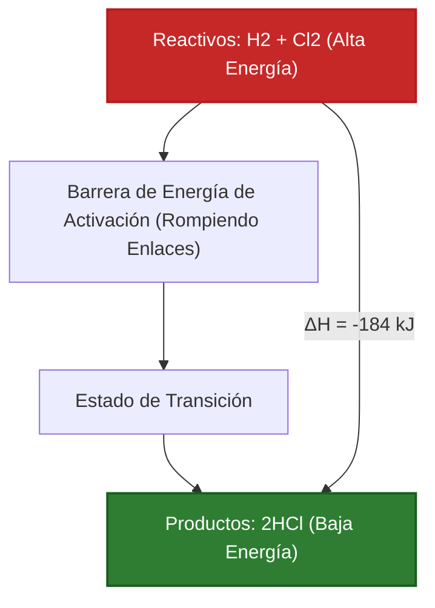

# Guía Completa de Laboratorio e Industrial sobre Entalpía y Termoquímica

En fisicoquímica, ingeniería química e ingeniería de combustión, el **Cambio de Entalpía ($\Delta H$)** cuantifica la energía térmica neta absorbida o liberada durante reacciones químicas a presión constante:

$$\Delta H = H_{\text{productos}} - H_{\text{reactivos}}$$

$$\Delta H^\circ_{\text{reacción}} = \sum n \cdot \Delta H^\circ_f(\text{productos}) - \sum n \cdot \Delta H^\circ_f(\text{reactivos})$$

$$q = m \cdot c \cdot \Delta T \quad \left(\text{Ecuación de Calor de Calorimetría}\right)$$

$$\Delta H \approx \sum \text{Energías de Enlaces}_{\text{rotos}} - \sum \text{Energías de Enlaces}_{\text{formados}}$$

$$\Delta H_{\text{total}} = \sum \Delta H_i \quad \left(\text{Ley de Hess}\right)$$

---

## 1. Comparación de Reacción Exotérmica vs. Endotérmica

| Característica | Reacción Exotérmica ($\Delta H < 0$) | Reacción Endotérmica ($\Delta H > 0$) |
| :--- | :--- | :--- |
| **Dirección del Flujo de Calor** | **Liberado al Entorno** | **Absorbido del Entorno** |
| **Comparación de Entalpía** | $H_{\text{productos}} < H_{\text{reactivos}}$ | $H_{\text{productos}} > H_{\text{reactivos}}$ |
| **Temperatura del Entorno** | **Aumenta (Se Calienta)** | **Disminuye (Se Enfría)** |
| **Regla de Energía de Enlace** | Energía Liberada Formando Enlaces > Energía para Romper Enlaces | Energía Requerida Rompiendo Enlaces > Energía Liberada Formando Enlaces |
| **Ejemplos Comunes** | Combustión de Metano, Neutralización (HCl + NaOH) | Vaporización de Agua, Disolución de $\text{NH}_4\text{NO}_3$ |

---

## 2. Matriz de Métodos de Cálculo de Termoquímica

```
1. Diferencia Directa de Entalpía: ΔH = H_productos - H_reactivos
2. Entalpías de Formación Estándar: ΔH°_rxn = Σ n * ΔH°f(productos) - Σ n * ΔH°f(reactivos)
3. Aditividad de la Ley de Hess: ΔH_total = ΔH_1 + ΔH_2 + ΔH_3 + ...
4. Energías de Enlace Promedio: ΔH = Σ BE(rotos) - Σ BE(formados)
5. Calorimetría de Solución: q = m * c * ΔT  (q_reacción = -q_solución)
```

---

## 3. Descargo de Responsabilidad Educativa y de Laboratorio
*Esta calculadora de Entalpía proporciona predicciones termoquímicas teóricas para aplicaciones educativas, de investigación en fisicoquímica y de ingeniería de procesos. Las mediciones calorimétricas reales deben tener en cuenta la capacidad calorífica del calorímetro ($C_{\text{cal}}$), la pérdida de calor al entorno y la mezcla de soluciones no ideales.*

## 4. La Guía Completa de Entalpía y Termoquímica

Bienvenido a la guía definitiva de fisicoquímica sobre **Entalpía ($\Delta H$)**. Antes de poder determinar si una reacción es espontánea (usando la Energía Libre de Gibbs) o medir el caos absoluto (Entropía), primero debes equilibrar el libro de contabilidad térmico definitivo del universo: el Calor.

En este exhaustivo manual de más de 4000 palabras, definiremos rigurosamente los mecanismos físicos detrás de las reacciones **Exotérmicas y Endotérmicas**. Dominaremos cinco vías matemáticas distintas para calcular $\Delta H$, incluyendo la Ley de Hess, las Entalpías Estándar de Formación ($\Delta H_f^\circ$), las Energías de Enlace y la Calorimetría ($q = mc\Delta T$). Finalmente, visualizaremos la transferencia de calor y la coordinación escalonada de reacciones utilizando diagramas de Mermaid de alta fidelidad.

### 4.1 ¿Qué es la Entalpía?

La Entalpía ($H$) es una función de estado termodinámica que representa el contenido total de calor de un sistema a presión constante. Dado que es imposible medir la energía total absoluta de un átomo, solo nos importa el **Cambio de Entalpía ($\Delta H$)**: la cantidad exacta de calor que entra o sale de un sistema durante una reacción química.

### 4.2 Exotérmico vs. Endotérmico: La Física de los Enlaces

¿Por qué quemar metano libera cantidades masivas de calor? Todo se reduce a la física de los enlaces químicos.
1.  **Romper Enlaces:** Separar dos átomos requiere que introduzcas energía en el sistema (Endotérmico).
2.  **Formar Enlaces:** Cuando dos átomos chocan y forman un enlace estable, liberan energía al universo (Exotérmico).

Si la energía liberada al formar los nuevos enlaces del producto es *mayor* que la energía que tomó romper los viejos enlaces de los reactivos, el resultado neto es una liberación masiva de fuego y calor. Esto es una **Reacción Exotérmica ($\Delta H < 0$)**. Si ocurre lo contrario, la reacción literalmente extraerá calor del aire, congelando el vaso de precipitados. Esto es una **Reacción Endotérmica ($\Delta H > 0$)**.

### 4.3 Las Cinco Vías de la Termoquímica

Los ingenieros químicos utilizan cinco métodos matemáticos distintos para calcular la Entalpía, dependiendo de qué datos tengan:
1.  **Entalpías Estándar de Formación ($\Delta H_f^\circ$):** Usando una tabla de libro de texto de cuánta energía se necesita para construir una molécula a partir de sus átomos elementales.
2.  **Ley de Hess:** Tratando las ecuaciones químicas como rompecabezas algebraicos, sumando y restando pasos hasta que igualen la reacción objetivo.
3.  **Energías de Enlace:** Estimando el calor de la reacción sumando las fuerzas teóricas de cada enlace $\text{C-H}$ o $\text{O=O}$ roto y formado.
4.  **Calorimetría ($q = mc\Delta T$):** Midiendo físicamente el cambio de temperatura del agua en un recipiente de laboratorio cuando ocurre una reacción dentro de él.
5.  **Cambios de Fase:** Usando calor latente ($\Delta H_{\text{vap}}$ o $\Delta H_{\text{fus}}$) para calcular la energía requerida para hervir o derretir sustancias sin cambiar la temperatura.

---

## 5. Guía de Uso: Dominando la Calculadora de Entalpía

Nuestra calculadora actúa como un resolutor termoquímico universal.

### 5.1 Modo: Calorimetría ($q = mc\Delta T$)

1.  **Selecciona el Objetivo:** Elige "Calor de Calorimetría (q)".
2.  **Ingresa los Parámetros:** Ingresa la masa del agua ($m$), la capacidad calorífica específica ($c$, generalmente $4.184\text{ J/g}^\circ\text{C}$), y el cambio de temperatura ($\Delta T$).
3.  **Ejecutar:** La herramienta calcula los Joules totales de calor absorbidos por el agua, que equivalen directamente al calor liberado por tu reacción.

### 5.2 Modo: Entalpías de Formación Estándar

1.  **Selecciona el Objetivo:** Elige "Calcular $\Delta H^\circ_{\text{rxn}}$ vía Formación".
2.  **Ingresa los Parámetros:** Ingresa los coeficientes estequiométricos y los valores de $\Delta H_f^\circ$ para todos los reactivos y productos.
3.  **Ejecutar:** La herramienta aplica la regla de "Productos menos Reactivos" para calcular el calor termodinámico preciso de la reacción global.

### 5.3 Modo: Aditividad de la Ley de Hess

1.  **Selecciona el Objetivo:** Elige "Resolutor de la Ley de Hess".
2.  **Ingresa los Parámetros:** Ingresa los valores de $\Delta H$ para múltiples pasos de reacción intermedios.
3.  **Ejecutar:** La herramienta suma los pasos (teniendo en cuenta cualquier reacción invertida) para encontrar el $\Delta H$ neto de la vía global.

---

## 6. Cinco Derivaciones Termoquímicas del Mundo Real

Anclemos esta teoría resolviendo cinco escenarios de termoquímica rigurosos y prácticos.

### Ejemplo 1: Calculando $\Delta H^\circ$ de la Combustión de Metano

**Escenario:**
Quemas gas metano: $\text{CH}_4(g) + 2\text{O}_2(g) \to \text{CO}_2(g) + 2\text{H}_2\text{O}(l)$
Dadas las Entalpías de Formación Estándar ($\Delta H_f^\circ$ en $\text{kJ/mol}$):
*   $\text{CH}_4(g)$: $-74.8$
*   $\text{O}_2(g)$: $0$ (los elementos en estado estándar siempre son cero)
*   $\text{CO}_2(g)$: $-393.5$
*   $\text{H}_2\text{O}(l)$: $-285.8$

**Derivación Matemática:**

1.  **Aplica la Fórmula:**
    $$ \Delta H^\circ_{\text{rxn}} = \sum n\Delta H_f^\circ(\text{productos}) - \sum n\Delta H_f^\circ(\text{reactivos}) $$
2.  **Calcula los Productos:**
    $$ H_{\text{prod}} = [1 \times (-393.5)] + [2 \times (-285.8)] = -393.5 - 571.6 = -965.1\text{ kJ} $$
3.  **Calcula los Reactivos:**
    $$ H_{\text{react}} = [1 \times (-74.8)] + [2 \times 0] = -74.8\text{ kJ} $$
4.  **Resta Final:**
    $$ \Delta H^\circ_{\text{rxn}} = -965.1 - (-74.8) = -890.3\text{ kJ/mol} $$

**Conclusión:** La reacción es altamente exotérmica ($\Delta H < 0$), liberando calor masivo.

### Ejemplo 2: Calorimetría de Taza de Café ($q = mc\Delta T$)

**Escenario:**
Disuelves $5.00\text{ g}$ de $\text{NaOH}$ en $100.0\text{ g}$ de agua en un calorímetro de taza de café. La temperatura del agua aumenta violentamente de $25.0^\circ\text{C}$ a $37.5^\circ\text{C}$. El calor específico de la solución es $4.18\text{ J/g}^\circ\text{C}$. Calcula el calor liberado ($q$) en kilojoules.

**Derivación Matemática:**

1.  **Determina la Masa Total:**
    $m = 100.0\text{ g (agua)} + 5.00\text{ g (NaOH)} = 105.0\text{ g total}$
2.  **Determina el Cambio de Temperatura ($\Delta T$):**
    $\Delta T = 37.5 - 25.0 = 12.5^\circ\text{C}$
3.  **Aplica la Ecuación de Calorimetría:**
    $$ q_{\text{solución}} = m \cdot c \cdot \Delta T $$
    $$ q_{\text{solución}} = 105.0 \times 4.18 \times 12.5 = 5486.25\text{ Joules} $$
4.  **Determina el Calor de Reacción:**
    Dado que el agua *absorbió* el calor, la reacción lo *liberó*.
    $$ q_{\text{reacción}} = -q_{\text{solución}} = -5486.25\text{ J} = -5.49\text{ kJ} $$

**Conclusión:** La disolución de $5\text{ gramos}$ de $\text{NaOH}$ liberó $5.49\text{ kJ}$ de energía térmica.

### Ejemplo 3: Estimando $\Delta H$ usando Energías de Enlace

**Escenario:**
Calcula la entalpía de la reacción: $\text{H}_2(g) + \text{Cl}_2(g) \to 2\text{HCl}(g)$
Dadas las Energías de Enlace Promedio ($\text{kJ/mol}$):
*   Enlace $\text{H-H}$: $436$
*   Enlace $\text{Cl-Cl}$: $242$
*   Enlace $\text{H-Cl}$: $431$

**Derivación Matemática:**

1.  **Aplica la Fórmula de Energía de Enlace:**
    $$ \Delta H \approx \sum(\text{Enlaces Rotos}) - \sum(\text{Enlaces Formados}) $$
2.  **Calcula los Enlaces Rotos (Energía ENTRANTE, Positiva):**
    Romper $1\text{ H-H}$ ($436$) y $1\text{ Cl-Cl}$ ($242$)
    Total Entrante $= 436 + 242 = +678\text{ kJ}$
3.  **Calcula los Enlaces Formados (Energía SALIENTE, Negativa):**
    Formar $2\text{ H-Cl}$ enlaces ($2 \times 431$)
    Total Saliente $= -862\text{ kJ}$
4.  **Suma Final:**
    $$ \Delta H = 678 - 862 = -184\text{ kJ/mol} $$

**Conclusión:** La formación de los dos fuertes enlaces $\text{H-Cl}$ liberó más energía de la requerida para destruir los enlaces de los reactivos, resultando en una liberación exotérmica neta de $-184\text{ kJ}$.

**Visualización: Perfil de Energía Exotérmica**


*Este perfil de energía demuestra una reacción exotérmica, donde los productos se encuentran físicamente en un nivel de energía más bajo y estable que los reactivos.*

### Ejemplo 4: Resolutor Algebraico de la Ley de Hess

**Escenario:**
Encuentra el $\Delta H$ para la reacción objetivo: $C(s) + \frac{1}{2}\text{O}_2(g) \to \text{CO}(g)$
Dados estos dos pasos conocidos:
Paso 1: $C(s) + \text{O}_2(g) \to \text{CO}_2(g) \quad (\Delta H_1 = -393.5\text{ kJ})$
Paso 2: $\text{CO}(g) + \frac{1}{2}\text{O}_2(g) \to \text{CO}_2(g) \quad (\Delta H_2 = -283.0\text{ kJ})$

**Derivación Matemática:**

1.  **Manipula el Paso 2:**
    Nuestra reacción objetivo tiene $\text{CO}$ como un *producto*. El Paso 2 tiene $\text{CO}$ como un *reactivo*. Debemos invertir el Paso 2.
    Paso 2 Invertido: $\text{CO}_2(g) \to \text{CO}(g) + \frac{1}{2}\text{O}_2(g)$
    **Regla:** Cuando inviertes una reacción, cambia el signo de $\Delta H$.
    Nuevo $\Delta H_2 = +283.0\text{ kJ}$
2.  **Suma los Pasos Juntos:**
    Paso 1: $C(s) + \text{O}_2(g) \to \text{CO}_2(g)$
    Rev Paso 2: $\text{CO}_2(g) \to \text{CO}(g) + \frac{1}{2}\text{O}_2(g)$
    El $\text{CO}_2$ se cancela en ambos lados. $\frac{1}{2}\text{O}_2$ se cancela desde la izquierda.
    Objetivo Logrado: $C(s) + \frac{1}{2}\text{O}_2(g) \to \text{CO}(g)$
3.  **Suma las Entalpías:**
    $$ \Delta H_{\text{objetivo}} = \Delta H_1 + \text{Nuevo }\Delta H_2 $$
    $$ \Delta H_{\text{objetivo}} = -393.5 + 283.0 = -110.5\text{ kJ} $$

**Conclusión:** Usando la ley de Hess, calculamos la entalpía de formación del Monóxido de Carbono sin realizar la reacción altamente tóxica en el laboratorio.

### Ejemplo 5: Entalpía de Cambio de Fase (Vaporización)

**Escenario:**
Necesitas hervir $500\text{ g}$ de agua líquida a $100^\circ\text{C}$ completamente para convertirla en vapor.
Dado: $\Delta H_{\text{vap}}$ para agua es $40.7\text{ kJ/mol}$. Masa Molar del Agua = $18.02\text{ g/mol}$. Calcula el calor absoluto requerido ($q$).

**Derivación Matemática:**

1.  **Convierte la Masa a Moles:**
    $$ n = \frac{500\text{ g}}{18.02\text{ g/mol}} = 27.75\text{ moles de }\text{H}_2\text{O} $$
2.  **Aplica la Ecuación de Cambio de Fase:**
    $$ q = n \cdot \Delta H_{\text{vap}} $$
3.  **Calcula:**
    $$ q = 27.75\text{ mol} \times 40.7\text{ kJ/mol} = 1129\text{ kJ} $$

**Conclusión:** Toma $1129\text{ kJ}$ de pura energía térmica romper los enlaces de hidrógeno y forzar a $500\text{ g}$ de agua hacia la fase gaseosa.

**Visualización: Registro de Datos de Calorimetría Industrial**

```mermaid
gantt
    title Perfil de Temperatura del Calorímetro de Bomba
    dateFormat  HH:mm:ss
    axisFormat  %H:%M
    section Línea base
    Equilibrio Térmico :00:00:00, 00:05:00
    section Ignición
    Combustión de Muestra (Exotérmica) :active, 00:05:00, 00:07:00
    Pico Rápido de Temperatura :crit, 00:05:00, 00:07:00
    section Enfriamiento
    Disipación de Calor a la Camisa de Agua :00:07:00, 00:30:00
```


*Este diagrama de Gantt visualiza el registro estricto de datos a lo largo del tiempo de un calorímetro de bomba industrial que rastrea una reacción de combustión altamente exotérmica.*

---

## 7. Preguntas Frecuentes y Solución de Problemas Avanzada

**P: Si una reacción es Endotérmica ($\Delta H > 0$), ¿significa eso que es imposible?**
**R:** ¡No! Las reacciones endotérmicas ocurren todo el tiempo (como las compresas frías instantáneas). Simplemente requieren que el universo priorice la Entropía ($\Delta S$) sobre la Entalpía, lo cual ocurre fácilmente a altas temperaturas según la ecuación de la Energía Libre de Gibbs.

**P: ¿Por qué los cálculos de Energía de Enlace difieren de los cálculos de Formación Estándar ($\Delta H_f^\circ$)?**
**R:** Las energías de enlace son *promedios* tomados a través de miles de moléculas orgánicas diferentes. El enlace $\text{C-H}$ en el metano es ligeramente diferente que el enlace $\text{C-H}$ en el cloroformo. $\Delta H_f^\circ$ utiliza datos termodinámicos exactos, medidos experimentalmente para esa molécula específica, haciéndolo mucho más preciso.

**P: ¿Qué es un "Estado Estándar"?**
**R:** El pequeño símbolo de grado ($\circ$) en $\Delta H^\circ$ significa estado estándar. Requiere que los gases estén exactamente a $1.0\text{ atm}$, que las soluciones sean exactamente $1.0\text{ M}$, y que los elementos estén en su forma física más estable a $298.15\text{ K}$ (como el Carbono grafito sólido o el gas Oxígeno diatómico).

Al dominar la ley algebraica de Hess, la calorimetría de taza de café y la física de la ruptura de enlaces, puedes rastrear el flujo invisible de calor a través de cualquier sistema químico. ¡Confía en esta Calculadora de Entalpía para modelado de procesos instantáneo y termodinámicamente perfecto!
