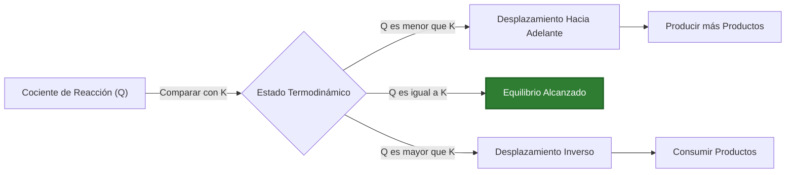

# Guía de Química Analítica y de Laboratorio para el Equilibrio Químico (Kc y Kp)

En fisicoquímica, química analítica e ingeniería química industrial, la **constante de equilibrio** ($K_c$ o $K_p$) cuantifica la extensión de una reacción química reversible en equilibrio dinámico:

$$a\text{A} + b\text{B} \rightleftharpoons c\text{C} + d\text{D} \quad \implies \quad K_c = \frac{[\text{C}]^c [\text{D}]^d}{[\text{A}]^a [\text{B}]^b}$$

$$K_p = K_c (R T)^{\Delta n} \quad (\Delta n = \text{moles de productos gaseosos} - \text{moles de reactivos gaseosos})$$

$$Q_c = \frac{[\text{C}]_{\text{actual}}^c [\text{D}]_{\text{actual}}^d}{[\text{A}]_{\text{actual}}^a [\text{B}]_{\text{actual}}^b} \quad \begin{cases} Q_c < K_c & \implies \text{Desplazamiento Neto hacia Adelante} \\ Q_c > K_c & \implies \text{Desplazamiento Neto Inverso} \\ Q_c = K_c & \implies \text{En Equilibrio} \end{cases}$$

$$\ln\left(\frac{K_2}{K_1}\right) = -\frac{\Delta H^\circ}{R} \left(\frac{1}{T_2} - \frac{1}{T_1}\right) \quad (\text{Ecuación de van 't Hoff})$$

---

## 1. Matriz de Referencia Clásica de la Constante de Equilibrio Químico

| Sistema de Reacción | Ecuación | Expresión de $K_c$ | $\Delta n$ (gas) | Relación de $K_p$ |
| :--- | :--- | :--- | :--- | :--- |
| **Proceso de Amoníaco de Haber** | $\text{N}_2(g) + 3\text{H}_2(g) \rightleftharpoons 2\text{NH}_3(g)$ | $\frac{[\text{NH}_3]^2}{[\text{N}_2][\text{H}_2]^3}$ | **$-2$** | $K_p = K_c (RT)^{-2}$ |
| **Síntesis de Gas HI** | $\text{H}_2(g) + \text{I}_2(g) \rightleftharpoons 2\text{HI}(g)$ | $\frac{[\text{HI}]^2}{[\text{H}_2][\text{I}_2]}$ | **$0$** | $K_p = K_c$ |
| **Descomposición de PCl5** | $\text{PCl}_5(g) \rightleftharpoons \text{PCl}_3(g) + \text{Cl}_2(g)$ | $\frac{[\text{PCl}_3][\text{Cl}_2]}{[\text{PCl}_5]}$ | **$+1$** | $K_p = K_c (RT)^1$ |
| **Horno de Cal Heterogéneo** | $\text{CaCO}_3(s) \rightleftharpoons \text{CaO}(s) + \text{CO}_2(g)$ | $[\text{CO}_2]$ | **$+1$** | $K_p = P_{\text{CO}_2}$ |

---

## 2. Protocolos Estándar de Cálculo de Equilibrio

```
1. Kc a partir de Concentraciones: Kc = [Productos]^c / [Reactivos]^a
2. Kp a partir de Presiones Parciales: Kp = (P_productos)^c / (P_reactivos)^a
3. Kp a partir de Kc: Kp = Kc * (0.08206 * T)^deltaN
4. Predicción de Dirección: Compare Q con K (Q < K -> Hacia adelante, Q > K -> Inverso)
5. Dependencia de la Temperatura: ln(K2/K1) = -deltaH/R * (1/T2 - 1/T1)
```

---

## 3. Descargo de Responsabilidad de Seguridad Educativa y de Laboratorio
*Esta calculadora de constante de equilibrio proporciona cálculos termodinámicos teóricos para aplicaciones educativas, de investigación de laboratorio y química AP. Los sistemas industriales reales de alta presión deben tener en cuenta los coeficientes de fugacidad y la actividad de los gases no ideales.*

## 4. La Guía Completa del Equilibrio Químico ($K_c$, $K_p$ y $Q$)

Bienvenido a la guía definitiva sobre la **Constante de Equilibrio**. A diferencia de las ecuaciones básicas de química de la escuela secundaria, que asumen que las reacciones proceden al 100% hasta su finalización (donde los reactivos se convierten completamente en productos), la química del mundo real es mucho más compleja.

La gran mayoría de las reacciones químicas son reversibles. Ocurren en ambas direcciones simultáneamente. A medida que se forman los productos, comienzan a chocar y reaccionar de inmediato para reformar los reactivos originales. Finalmente, se alcanza un punto muerto termodinámico: el **Estado de Equilibrio Dinámico**. La velocidad de la reacción directa coincide perfectamente con la velocidad de la reacción inversa, y las concentraciones macroscópicas de todas las especies se estabilizan en su lugar.

En este exhaustivo manual técnico de más de 4000 palabras, desmitificaremos por completo la termodinámica del equilibrio químico. Decodificaremos la relación matemática entre las constantes de concentración molar ($K_c$) y las constantes de presión parcial de gases ($K_p$), estableceremos el poder predictivo del Cociente de Reacción ($Q$), definiremos las reglas del Equilibrio Heterogéneo y analizaremos cinco ejemplos rigurosos de ingeniería química del mundo real, completos con derivaciones algebraicas paso a paso y diagramas visuales de Mermaid.

### 4.1 ¿Qué es la Constante de Equilibrio ($K$)?

Para una reacción reversible genérica que ocurre a una temperatura constante:
$$ a\text{A} + b\text{B} \rightleftharpoons c\text{C} + d\text{D} $$

La **Constante de Equilibrio ($K$)** es una proporción matemáticamente rigurosa que describe la concentración final de los productos en relación con los reactivos una vez que se ha alcanzado el equilibrio dinámico. La Ley de Acción de Masas define esta fórmula como el producto de las concentraciones de los productos elevadas a la potencia de sus coeficientes estequiométricos, dividido por las concentraciones de los reactivos elevadas a la potencia de sus coeficientes estequiométricos.

$$ K_c = \frac{[\text{C}]^c [\text{D}]^d}{[\text{A}]^a [\text{B}]^b} $$

La magnitud de $K$ revela instantáneamente la preferencia termodinámica de la reacción:
*   **$K \gg 1$:** Los productos son fuertemente favorecidos. La reacción esencialmente procede hasta completarse.
*   **$K \ll 1$:** Los reactivos son fuertemente favorecidos. Se forma muy poco producto.
*   **$K \approx 1$:** Ni los reactivos ni los productos son fuertemente favorecidos; existe una mezcla significativa de ambos en el equilibrio.

### 4.2 La Diferencia Entre $K_c$ y $K_p$

El subíndice en la $K$ indica las unidades utilizadas para medir las sustancias:
*   **$K_c$ (Concentración):** Utilizado para soluciones acuosas o gases medidos en molaridad (mol/L).
*   **$K_p$ (Presión):** Utilizado específicamente para reacciones en fase gaseosa donde las sustancias se miden por sus presiones parciales (en atm o bar).

Dado que la Ley de los Gases Ideales ($PV = nRT$) relaciona la presión directamente con la concentración ($P = \frac{n}{V}RT = MRT$), podemos interconvertir matemáticamente $K_c$ y $K_p$ utilizando la siguiente ecuación maestra:

$$ K_p = K_c(RT)^{\Delta n} $$

*   $R$ = Constante de los gases ideales ($0.08206 \text{ L atm mol}^{-1} \text{ K}^{-1}$)
*   $T$ = Temperatura absoluta en Kelvin
*   $\Delta n$ = (Suma de moles de productos gaseosos) - (Suma de moles de reactivos gaseosos)

*Nota: Si una reacción no cambia el número total de moles de gas (es decir, $\Delta n = 0$), entonces $K_p = K_c$.*

### 4.3 El Cociente de Reacción ($Q$) vs Constante de Equilibrio ($K$)

La constante de equilibrio $K$ solo se preocupa por las concentraciones **finales y estabilizadas**. Pero, ¿qué pasa si mezclas cantidades arbitrarias de sustancias químicas y quieres saber en qué dirección se desplazarán para *alcanzar* el equilibrio?

Ingrese el **Cociente de Reacción ($Q$)**. La fórmula para $Q$ es idéntica a la de $K$, pero introduce las concentraciones **actuales, fuera del equilibrio**:

$$ Q_c = \frac{[\text{C}]_{\text{actual}}^c [\text{D}]_{\text{actual}}^d}{[\text{A}]_{\text{actual}}^a [\text{B}]_{\text{actual}}^b} $$

Al comparar $Q$ con $K$, puede predecir perfectamente el desplazamiento termodinámico:
*   **$Q < K$:** La proporción de productos es demasiado baja. La reacción se desplazará **HACIA ADELANTE** (derecha) para generar más productos.
*   **$Q > K$:** La proporción de productos es demasiado alta. La reacción se desplazará a la **INVERSA** (izquierda) para consumir productos y regenerar reactivos.
*   **$Q = K$:** El sistema ya está en equilibrio. No ocurrirá ningún desplazamiento macroscópico.

### 4.4 Equilibrios Heterogéneos (La Regla de Sólidos y Líquidos)

Al establecer una expresión de $K$, los **sólidos puros (s)** y los **líquidos puros (l)** se ignoran estrictamente. ¿Por qué? Porque la "actividad" termodinámica (concentración efectiva) de un sólido puro o un líquido puro es constante y esencialmente es igual a 1. Sus concentraciones no cambian a medida que avanza la reacción.

Por ejemplo, la calcinación de la piedra caliza:
$$ \text{CaCO}_3(s) \rightleftharpoons \text{CaO}(s) + \text{CO}_2(g) $$
La expresión es simplemente:
$$ K_c = [\text{CO}_2] \quad \text{y} \quad K_p = P_{\text{CO}_2} $$
La piedra caliza sólida y la cal viva se ignoran por completo.

---

## 5. Guía de Uso: Dominando la Calculadora de Constante de Equilibrio

Nuestra calculadora actúa como un simulador termodinámico completo.

### 5.1 Modo: Predecir la Dirección de la Reacción ($Q$ vs $K$)

1.  **Seleccionar Modo:** Elija "Cociente de Reacción Qc / Qp".
2.  **Ingresar Parámetros:** Ingrese su valor de $K_c$ objetivo, los coeficientes estequiométricos para su reacción y las concentraciones de laboratorio *actuales* de todas las especies.
3.  **Leer Resultados:** La herramienta calcula instantáneamente $Q_c$, lo compara con $K_c$ y muestra explícitamente la dirección prevista del desplazamiento de Le Chatelier (Hacia adelante o Inverso).

### 5.2 Modo: Convertir $K_c$ a $K_p$

1.  **Seleccionar Modo:** Elija "Conversión de Kc a Kp".
2.  **Ingresar Parámetros:** Ingrese su $K_c$ conocido, la temperatura en Kelvin y los moles totales de los productos y reactivos gaseosos.
3.  **Ejecutar:** La herramienta calcula $\Delta n$, aplica el factor $(RT)^{\Delta n}$ y muestra el $K_p$ exacto.

### 5.3 Modo: Resolver Tablas ICE

1.  **Seleccionar Modo:** Elija "Resolvedor de Tablas ICE".
2.  **Ingresar Parámetros:** Ingrese su $K_c$ objetivo y las concentraciones iniciales.
3.  **Ejecutar:** La herramienta construye la matriz algebraica de Inicial, Cambio y Equilibrio, ejecuta un resolutor polinomial interno y muestra las concentraciones de equilibrio final exactas para todas las especies.

---

## 6. Cinco Ejemplos Reales de Ingeniería Química

Pongamos esta teoría termodinámica en práctica con desgloses matemáticos rigurosos paso a paso de escenarios clásicos de equilibrio.

### Ejemplo 1: Predicción del Desplazamiento de Reacción con $Q_c$

**Escenario:** 
La síntesis de gas de yoduro de hidrógeno: $\text{H}_2(g) + \text{I}_2(g) \rightleftharpoons 2\text{HI}(g)$
A $430^\circ\text{C}$, la $K_c$ es 54.3. Un estudiante mezcla $0.050\text{ M de H}_2$, $0.050\text{ M de I}_2$ y $0.100\text{ M de HI}$ en un matraz. ¿La reacción producirá más $\text{HI}$, o se descompondrá el $\text{HI}$?

**Derivación Matemática:**

1.  **Establecer la Expresión de $Q_c$:**
    $$ Q_c = \frac{[\text{HI}]^2}{[\text{H}_2][\text{I}_2]} $$
2.  **Insertar las Concentraciones Actuales:**
    $$ Q_c = \frac{(0.100)^2}{(0.050)(0.050)} $$
    $$ Q_c = \frac{0.0100}{0.0025} = 4.0 $$
3.  **Comparar $Q_c$ con $K_c$:**
    $$ Q_c (4.0) < K_c (54.3) $$

**Conclusión:** Debido a que $Q_c$ es menor que $K_c$, la reacción está lejos del equilibrio y "quiere" llegar a 54.3. El sistema se desplazará **HACIA ADELANTE** (a la derecha), consumiendo $\text{H}_2$ y $\text{I}_2$ para sintetizar mucho más $\text{HI}$ hasta que $Q_c$ alcance 54.3.

**Visualización: El Mecanismo de Desplazamiento de Le Chatelier**



*Este diagrama de flujo dicta las reglas universales para predecir los desplazamientos de reacción comparando el Cociente de Reacción con la Constante de Equilibrio.*

### Ejemplo 2: Conversión de $K_c$ a $K_p$ para Haber-Bosch

**Escenario:**
El proceso de Haber-Bosch para sintetizar amoníaco: $\text{N}_2(g) + 3\text{H}_2(g) \rightleftharpoons 2\text{NH}_3(g)$.
A $300^\circ\text{C}$ (573 K), el $K_c$ es 9.60. Calcule $K_p$ en atmósferas.

**Derivación Matemática:**

1.  **Calcular $\Delta n$ (cambio en moles de gas):**
    $\Delta n = (\text{moles de gas del producto}) - (\text{moles de gas del reactivo})$
    $\Delta n = (2) - (1 + 3) = 2 - 4 = -2$
2.  **Establecer la Ecuación de Conversión:**
    $$ K_p = K_c(RT)^{\Delta n} $$
3.  **Insertar Valores ($R = 0.08206$):**
    $$ K_p = 9.60 \times (0.08206 \times 573)^{-2} $$
    $$ K_p = 9.60 \times (47.02)^{-2} $$
    $$ K_p = 9.60 \times (0.000452) $$
    $$ K_p = 4.34 \times 10^{-3} $$

**Conclusión:** Debido a la caída severa en los moles totales de gas ($\Delta n = -2$), el $K_p$ ($4.34 \times 10^{-3}$) es drásticamente más pequeño que el $K_c$ ($9.60$).

### Ejemplo 3: Resolver una Tabla ICE de PCl5

**Escenario:**
El pentacloruro de fósforo se descompone: $\text{PCl}_5(g) \rightleftharpoons \text{PCl}_3(g) + \text{Cl}_2(g)$
A $250^\circ\text{C}$, $K_c = 0.0415$. Si comenzamos con $0.200\text{ M}$ de $\text{PCl}_5$ puro, ¿cuáles son las concentraciones finales de equilibrio?

**Derivación Matemática:**

1.  **Construir la Tabla ICE:**
    *   **I (Inicial):** $[\text{PCl}_5] = 0.200$, $[\text{PCl}_3] = 0$, $[\text{Cl}_2] = 0$
    *   **C (Cambio):** $-x$, $+x$, $+x$
    *   **E (Equilibrio):** $(0.200 - x)$, $x$, $x$
2.  **Establecer la Ecuación de $K_c$:**
    $$ K_c = \frac{[\text{PCl}_3][\text{Cl}_2]}{[\text{PCl}_5]} = \frac{x^2}{0.200 - x} = 0.0415 $$
3.  **Reorganizar en una Ecuación Cuadrática:**
    $$ x^2 = 0.0415(0.200 - x) $$
    $$ x^2 + 0.0415x - 0.00830 = 0 $$
4.  **Resolver mediante la Fórmula Cuadrática:**
    $$ x = \frac{-0.0415 + \sqrt{(0.0415)^2 - 4(1)(-0.00830)}}{2} $$
    $$ x = 0.0729\text{ M} $$
5.  **Calcular las Concentraciones Finales:**
    $[\text{PCl}_3] = [\text{Cl}_2] = 0.0729\text{ M}$
    $[\text{PCl}_5] = 0.200 - 0.0729 = 0.1271\text{ M}$

**Conclusión:** En equilibrio, la mezcla contiene $0.1271\text{ M de PCl}_5$ y $0.0729\text{ M}$ de ambos gases producto.

### Ejemplo 4: Calcinación Heterogénea de Carbonato

**Escenario:**
La descomposición térmica del carbonato de calcio: $\text{CaCO}_3(s) \rightleftharpoons \text{CaO}(s) + \text{CO}_2(g)$.
A $800^\circ\text{C}$, el $K_p$ para esta reacción es $0.236\text{ atm}$. Si coloca $500\text{ g}$ de $\text{CaCO}_3$ en un matraz sellado y al vacío, ¿cuál es la presión de equilibrio del $\text{CO}_2$? ¿Importa la cantidad de sólido?

**Derivación Matemática:**

1.  **Analizar las Fases:**
    $\text{CaCO}_3$ y $\text{CaO}$ son sólidos puros. Sus actividades son iguales a 1. Están completamente excluidos de la expresión de equilibrio.
2.  **Establecer la Expresión de $K_p$:**
    $$ K_p = P_{\text{CO}_2} $$
3.  **Resolver la Presión:**
    $$ 0.236\text{ atm} = P_{\text{CO}_2} $$

**Conclusión:** La presión de equilibrio del $\text{CO}_2$ simplemente se bloqueará en exactamente $0.236\text{ atm}$. No importa en absoluto si comenzó con $500\text{ g}$, $5\text{ kg}$ o $5\text{ toneladas}$ de piedra caliza; siempre que haya *algo* de sólido presente para mantener el equilibrio, el $K_p$ se basa exclusivamente en la fase gaseosa.

### Ejemplo 5: Cambios de Temperatura y la Ecuación de van 't Hoff

**Escenario:**
Según el principio de Le Chatelier, los cambios de temperatura realmente alteran el valor fundamental de $K$. El proceso de Haber ($\text{N}_2 + 3\text{H}_2 \rightleftharpoons 2\text{NH}_3$) es extremadamente exotérmico ($\Delta H^\circ = -92.4\text{ kJ/mol}$). ¿Cómo afecta el aumento de la temperatura a $K$?

**Derivación Termodinámica:**

1.  **Analizar el Flujo de Calor Exotérmico:**
    Debido a que la reacción libera calor, podemos tratar al "Calor" como un producto en el lado derecho de la ecuación:
    $\text{N}_2 + 3\text{H}_2 \rightleftharpoons 2\text{NH}_3 + \text{CALOR}$
2.  **Aplicar el Principio de Le Chatelier:**
    Si aumentamos artificialmente la temperatura del reactor, el sistema intenta consumir ese exceso de calor. Lo hace desplazando la reacción fuertemente en la dirección **INVERSA** (izquierda), descomponiendo el amoníaco nuevamente en nitrógeno e hidrógeno gaseoso.
3.  **Resultado Matemático:**
    Debido a que el equilibrio se estabiliza en un estado con muchos más reactivos y menos productos, la proporción $K = \frac{\text{Productos}}{\text{Reactivos}}$ disminuye físicamente.
4.  **El Compromiso Industrial:**
    Esto crea una pesadilla de ingeniería. Se requieren altas temperaturas para que la reacción sea rápida (cinética), pero las altas temperaturas reducen drásticamente el $K_c$ (termodinámica), destruyendo el rendimiento. Los reactores de Haber-Bosch funcionan a una temperatura de compromiso ($~450^\circ\text{C}$) para equilibrar la velocidad con el rendimiento.

**Visualización: Desplazamiento Termodinámico de las Reacciones Exotérmicas**

```mermaid
gantt
    title Desplazamiento Termodinámico Exotérmico de Temperatura
    dateFormat  HH:mm:ss
    axisFormat  %H:%M
    section Línea Base (300C)
    Alto Rendimiento de Amoníaco (Gran K) :crit, 00:00:00, 00:10:00
    section Perturbación
    Calentador Encendido :00:10:00, 00:12:00
    section Nuevo Equilibrio (500C)
    Amoníaco se Descompone (K cae) :active, 00:12:00, 00:20:00
```



*Esta línea de tiempo de Gantt mapea el colapso termodinámico de un equilibrio exotérmico. A medida que aumenta la temperatura, el sistema se desplaza hacia la izquierda para consumir el calor, lo que hace que la Constante de Equilibrio ($K$) se desplome.*

---

## 7. Preguntas Frecuentes Profundas y Solución de Problemas Avanzada

**P: ¿Puede un Cociente de Reacción ($Q$) ser cero?**
**R:** Sí. Si inicia una reacción solo con reactivos puros y cero productos, el numerador es cero, haciendo $Q = 0$. Dado que $0 < K$, la reacción se desplazará inmediatamente hacia adelante para generar productos. Por el contrario, si comienza solo con productos, $Q$ es indefinido (se acerca al infinito), lo que significa que $Q > K$ y la reacción se desplaza agresivamente a la inversa.

**P: ¿Qué le sucede a $K$ si invierto la ecuación química al revés?**
**R:** La nueva constante de equilibrio es el inverso exacto (recíproco) de la original. $K_{\text{inversa}} = \frac{1}{K_{\text{directa}}}$.

**P: ¿Qué le sucede a $K$ si multiplico toda la estequiometría por 2?**
**R:** La nueva constante de equilibrio es la $K$ original elevada a esa potencia. $K_{\text{nueva}} = (K_{\text{original}})^2$.

Al dominar el puente matemático entre $K_c$ y $K_p$, predecir los desplazamientos utilizando $Q_c$ y comprender las consecuencias termodinámicas de los cambios de temperatura, usted posee el poder teórico para optimizar cualquier proceso de ingeniería química. ¡Confíe siempre en esta Calculadora de Constante de Equilibrio para equilibrar rápidamente tablas ICE complejas y garantizar la perfección analítica!
