# Guía de Laboratorio e Industrial de las Leyes de Faraday de la Electrólisis

En galvanoplastia industrial, metalurgia extractiva y electroquímica analítica, las **Leyes de Faraday de la Electrólisis** cuantifican la relación entre la carga eléctrica, la estequiometría química y la masa electrodepositada:

$$m = \frac{M \cdot I \cdot t}{n \cdot F} = Z \cdot Q$$

$$Q = I \cdot t \quad \left(\text{Amperios} \times \text{Segundos} = \text{Culombios}\right)$$

$$n_e = \frac{Q}{F} = \frac{I \cdot t}{F} \quad \left(\text{Moles de Electrones}\right)$$

$$Z = \frac{M}{n \cdot F} \quad \left(\text{Equivalente Electroquímico en g/C}\right)$$

$$\text{Segunda Ley de Faraday: } \frac{m_1}{m_2} = \frac{E_1}{E_2} = \frac{M_1 / n_1}{M_2 / n_2}$$

$$\text{Grosor de la Capa de Galvanoplastia: } h = \frac{m}{\rho \cdot A} \quad \left(\text{donde } \rho = \text{densidad}, A = \text{área de superficie}\right)$$

---

## 1. Matriz de Referencia de Electrodeposición de Metales Industriales

| Sistema Metálico | Semirreacción | Masa Molar ($M$) | Valencia ($n$) | Densidad ($\rho$) | Equivalente Electroquímico ($Z$) |
| :--- | :--- | :--- | :--- | :--- | :--- |
| **Plata (Ag)** | $\text{Ag}^+ + e^- \to \text{Ag}(s)$ | **$107.87 \text{ g/mol}$** | **$1$** | **$10.49 \text{ g/cm}^3$** | **$1.1180 \text{ mg/C}$** |
| **Cobre (Cu)** | $\text{Cu}^{2+} + 2e^- \to \text{Cu}(s)$ | **$63.55 \text{ g/mol}$** | **$2$** | **$8.96 \text{ g/cm}^3$** | **$0.3294 \text{ mg/C}$** |
| **Oro (Au)** | $\text{Au}^{3+} + 3e^- \to \text{Au}(s)$ | **$196.97 \text{ g/mol}$** | **$3$** | **$19.32 \text{ g/cm}^3$** | **$0.6805 \text{ mg/C}$** |
| **Aluminio (Al)**| $\text{Al}^{3+} + 3e^- \to \text{Al}(s)$ | **$26.98 \text{ g/mol}$** | **$3$** | **$2.70 \text{ g/cm}^3$** | **$0.0932 \text{ mg/C}$** |
| **Níquel (Ni)** | $\text{Ni}^{2+} + 2e^- \to \text{Ni}(s)$ | **$58.69 \text{ g/mol}$** | **$2$** | **$8.90 \text{ g/cm}^3$** | **$0.3041 \text{ mg/C}$** |

---

## 2. Protocolos Estándar de Cálculo de Electrólisis y Galvanoplastia

```
1. Masa Depositada: m = (M * I * t) / (n * F)
2. Carga: Q = I * t  (Culombios)
3. Moles de Electrones: n_e = Q / F
4. Masa Real (% de Eficiencia): m_real = m_teórica * (Eficiencia / 100)
5. Grosor de Revestimiento: h = m_real / (densidad * área_de_superficie)
```

---

## 3. Descargo de Responsabilidad de Seguridad Educativa y de Laboratorio
*Esta calculadora de la ley de Faraday proporciona cálculos estequiométricos y termodinámicos teóricos para aplicaciones educativas, de investigación en laboratorios de galvanoplastia y de ingeniería química. Las celdas de electrodeposición industrial reales deben tener en cuenta las pérdidas de eficiencia de corriente, los sobrepotenciales y las reacciones secundarias de evolución de gas.*

## 4. La Guía Completa de las Leyes de Faraday de la Electrólisis

Bienvenido a la guía de laboratorio e industrial definitiva sobre las **Leyes de Faraday de la Electrólisis**. En 1834, Michael Faraday descubrió que la masa física de metal chapada en un electrodo es perfecta y matemáticamente proporcional al número absoluto de electrones que se fuerzan a través del circuito.

En este exhaustivo manual de más de 4000 palabras, definiremos rigurosamente la Primera y Segunda Ley de la Electrólisis, desglosaremos el significado físico de la Constante de Faraday ($F$) y exploraremos el concepto crítico de la **Eficiencia de Corriente** en la galvanoplastia industrial. A continuación, recorreremos cinco derivaciones analíticas complejas del mundo real, que van desde el baño de plata en joyería hasta la fundición industrial de aluminio. Además, visualizaremos la estequiometría de la electrodeposición utilizando diagramas Mermaid de alta fidelidad.

### 4.1 Primera Ley de Faraday

**"La masa de cualquier sustancia depositada o liberada en un electrodo es directamente proporcional a la cantidad de electricidad (carga) que pasa a través del electrolito."**

La electricidad no es continua; está cuantizada en electrones individuales. La Corriente ($I$) es simplemente la tasa de flujo de electrones (Amperios = Culombios por segundo). Si multiplica la Corriente por el Tiempo ($t$), obtiene la Carga total ($Q$ en Culombios). 

Dado que cada ion metálico requiere un número entero muy específico de electrones ($n$) para reducirse a metal sólido (por ejemplo, $\text{Cu}^{2+}$ necesita 2 electrones, $\text{Ag}^+$ necesita 1), puede predecir la masa exacta depositada hasta el microgramo si conoce la corriente y el tiempo.

### 4.2 La Ecuación Maestra y la Constante de Faraday ($F$)

La constante de proporcionalidad que une los Amperios macroscópicos con los moles microscópicos es la **Constante de Faraday ($F$)**.
$F = 96485\text{ Culombios/mol de electrones}$.

La ecuación maestra de la Primera Ley de Faraday es:
$$m = \frac{M \cdot I \cdot t}{n \cdot F}$$

Donde:
*   **$m$** = Masa del metal depositado (gramos)
*   **$M$** = Masa molar del metal (gramos/mol)
*   **$I$** = Corriente eléctrica (Amperios)
*   **$t$** = Tiempo (segundos)
*   **$n$** = Número de electrones requeridos por ion (valencia)
*   **$F$** = Constante de Faraday ($96485\text{ C/mol}$)

### 4.3 Segunda Ley de Faraday

**"Cuando la misma cantidad de electricidad pasa a través de varios electrolitos en serie, las masas de las sustancias depositadas son proporcionales a sus pesos equivalentes químicos."**

El "Peso Equivalente" ($E$) es simplemente la Masa Molar dividida por la valencia ($E = M / n$). Si conecta un baño de plata ($n=1$) y un baño de cobre ($n=2$) en serie para que reciban exactamente la misma corriente, depositará significativamente más masa de plata que de cobre porque la plata solo requiere un electrón por átomo, mientras que el cobre requiere dos.

### 4.4 Eficiencia de Corriente y Reacciones Parasitarias

En un libro de texto, el 100% de su corriente eléctrica se destina a recubrir su metal objetivo.
En una fábrica industrial real, el agua a menudo se divide simultáneamente en gas Hidrógeno en el cátodo junto con su metal. Esta "reacción secundaria parasitaria" roba electrones. 

Si su cálculo predice que deberían depositarse $10.0\text{ gramos}$ de cobre, pero usted solo pesa $8.5\text{ gramos}$, su **Eficiencia de Corriente** es del $85\%$. El $15\%$ faltante de su electricidad se desperdició generando gas hidrógeno.

---

## 5. Guía de Uso: Dominando la Calculadora de Electrólisis

Nuestra calculadora actúa como un solucionador estequiométrico universal para galvanoplastia.

### 5.1 Modo: Masa Depositada

1.  **Seleccionar Objetivo:** Elija "Calcular Masa (m)".
2.  **Ingresar Parámetros:** Ingrese la Masa Molar ($M$), Valencia ($n$), Corriente ($I$ en Amperios) y Tiempo ($t$ en Segundos).
3.  **Ejecutar:** La herramienta aplica la ecuación maestra y muestra la masa teórica depositada en gramos.

### 5.2 Modo: Tiempo Requerido para Galvanoplastia

1.  **Seleccionar Objetivo:** Elija "Calcular Tiempo (t)".
2.  **Ingresar Parámetros:** Ingrese la masa exacta de metal que desea recubrir, junto con la Corriente ($I$) que su fuente de alimentación puede manejar.
3.  **Ejecutar:** La herramienta reorganiza algebraicamente la ley de Faraday para resolver $t = (m \cdot n \cdot F) / (M \cdot I)$, indicándole exactamente cuántos segundos (u horas) debe hacer funcionar la máquina.

### 5.3 Modo: Grosor del Recubrimiento de Galvanoplastia

1.  **Seleccionar Objetivo:** Elija "Calcular Grosor (h)".
2.  **Ingresar Parámetros:** Ingrese la masa depositada, la densidad del metal ($\rho$) y el Área de Superficie física ($A$) del objeto que está recubriendo.
3.  **Ejecutar:** La herramienta calcula el volumen del metal depositado ($V = m/\rho$) y lo divide por el área para mostrar el grosor microscópico del recubrimiento en micrómetros ($\mu\text{m}$).

---

## 6. Cinco Ejemplos Reales de Electrólisis Industrial

Llevemos esta teoría a la práctica resolviendo cinco escenarios de galvanoplastia rigurosos y prácticos.

### Ejemplo 1: Baño de Plata en Joyería

**Escenario:** 
Usted está recubriendo un colgante de latón con plata. Aplica una corriente constante de $2.50\text{ Amperios}$ durante exactamente $45.0\text{ minutos}$ a través de una solución de $\text{AgNO}_3$. 
Dado: Masa Molar de la Plata $M = 107.87\text{ g/mol}$, Valencia $n = 1$.
Calcule la masa teórica de plata sólida depositada en el colgante.

**Derivación Matemática:**

1.  **Estandarizar Unidades (Tiempo a Segundos):**
    $$ t = 45.0\text{ min} \times 60\text{ s/min} = 2700\text{ s} $$
2.  **Aplicar Ecuación Maestra:**
    $$ m = \frac{M \cdot I \cdot t}{n \cdot F} $$
3.  **Calcular:**
    $$ m = \frac{107.87 \times 2.50 \times 2700}{1 \times 96485} $$
    $$ m = \frac{728122.5}{96485} = 7.546\text{ g} $$

**Conclusión:** Exactamente $7.55\text{ gramos}$ de plata pura recubrirán perfectamente el colgante.

### Ejemplo 2: Determinación de la Corriente Requerida para Electrorrefinación de Cobre

**Escenario:**
Una refinería de cobre industrial necesita depositar $500.0\text{ kg}$ de Cobre puro desde un baño de $\text{CuSO}_4$ durante un solo turno de $8.0\text{ horas}$.
Dado: Cobre $M = 63.55\text{ g/mol}$, Valencia $n = 2$.
¿Qué corriente eléctrica masiva ($I$) deben mantener sus fuentes de alimentación?

**Derivación Matemática:**

1.  **Estandarizar Unidades:**
    $$ m = 500,000\text{ g} $$
    $$ t = 8.0\text{ hr} \times 3600\text{ s/hr} = 28800\text{ s} $$
2.  **Reorganizar la Ecuación Maestra para la Corriente ($I$):**
    $$ I = \frac{m \cdot n \cdot F}{M \cdot t} $$
3.  **Calcular:**
    $$ I = \frac{500000 \times 2 \times 96485}{63.55 \times 28800} $$
    $$ I = \frac{9.6485 \times 10^{10}}{1830240} = 52717\text{ Amperios} $$

**Conclusión:** La refinería debe bombear unos asombrosos $52,717\text{ Amperios}$ de corriente directa continua para alcanzar esta tasa de producción.

### Ejemplo 3: Consideración de la Eficiencia de Corriente (Cromado)

**Escenario:**
El cromado es notoriamente ineficiente debido a la masiva evolución de gas hidrógeno. Usted aplica $15.0\text{ A}$ durante $2.0\text{ horas}$ a través de un baño de $\text{Cr}^{3+}$ ($M = 52.00\text{ g/mol}$, $n = 3$). La fábrica sabe que la eficiencia de corriente de este baño específico es solo del $18.0\%$. Calcule la masa *real* de cromo depositada.

**Derivación Matemática:**

1.  **Calcular la Masa Teórica Primero:**
    $t = 7200\text{ s}$
    $$ m_{\text{teórica}} = \frac{52.00 \times 15.0 \times 7200}{3 \times 96485} $$
    $$ m_{\text{teórica}} = \frac{5616000}{289455} = 19.40\text{ g} $$
2.  **Aplicar el Factor de Eficiencia de Corriente:**
    $$ m_{\text{real}} = m_{\text{teórica}} \times 0.18 $$
3.  **Calcular:**
    $$ m_{\text{real}} = 19.40 \times 0.18 = 3.49\text{ g} $$

**Conclusión:** Aunque pagó suficiente electricidad para depositar $19.4\text{ gramos}$, el $82\%$ de su energía se desperdició hirviendo agua en gas hidrógeno explosivo. Solo obtuvo $3.49\text{ g}$ de cromo.

**Visualización: Flujo de Conversión Estequiométrica**


*Este diagrama de flujo desglosa la ecuación maestra de Faraday en sus conversiones estequiométricas lógicas paso a paso, desde Amperios hasta Gramos físicos.*

### Ejemplo 4: Cálculo del Grosor de la Capa de Galvanoplastia

**Escenario:**
Usted chapa en oro el chasis de un teléfono inteligente con un área de superficie de $120\text{ cm}^2$. El baño de galvanoplastia depositó $0.45\text{ gramos}$ de Oro ($\text{Au}$). La densidad del Oro es $19.32\text{ g/cm}^3$. Calcule el grosor exacto de la capa de oro en micrómetros ($\mu\text{m}$).

**Derivación Matemática:**

1.  **Calcular el Volumen Total de Oro:**
    $$ V = \frac{m}{\rho} = \frac{0.45\text{ g}}{19.32\text{ g/cm}^3} = 0.02329\text{ cm}^3 $$
2.  **Calcular el Grosor (Altura) en cm:**
    $$ \text{Volumen} = \text{Área} \times \text{Grosor} \implies h = \frac{V}{A} $$
    $$ h = \frac{0.02329}{120} = 0.0001941\text{ cm} $$
3.  **Convertir a Micrómetros ($\mu\text{m}$):**
    $1\text{ cm} = 10,000\text{ }\mu\text{m}$
    $$ h = 0.0001941 \times 10000 = 1.94\text{ }\mu\text{m} $$

**Conclusión:** El teléfono tiene un revestimiento de oro hermoso y uniforme de $1.94$ micras de espesor, el estándar para la electrónica de consumo premium.

### Ejemplo 5: Segunda Ley de Faraday en Circuitos en Serie

**Escenario:**
Usted conecta un baño de Níquel(II) ($n=2$, $M=58.69$) y un baño de Aluminio(III) ($n=3$, $M=26.98$) en serie. Enciende la alimentación, y después de unas horas, observa que exactamente $15.0\text{ g}$ de Níquel se han depositado. Sin saber la corriente o el tiempo, calcule exactamente cuánto Aluminio se depositó en el segundo vaso de precipitados.

**Derivación Matemática:**

1.  **Identificar Pesos Equivalentes ($E = M/n$):**
    $$ E_{\text{Ni}} = \frac{58.69}{2} = 29.345\text{ g/equivalente} $$
    $$ E_{\text{Al}} = \frac{26.98}{3} = 8.993\text{ g/equivalente} $$
2.  **Aplicar la Segunda Ley de Faraday:**
    $$ \frac{m_{\text{Ni}}}{m_{\text{Al}}} = \frac{E_{\text{Ni}}}{E_{\text{Al}}} $$
3.  **Calcular:**
    $$ \frac{15.0}{m_{\text{Al}}} = \frac{29.345}{8.993} = 3.263 $$
    $$ m_{\text{Al}} = \frac{15.0}{3.263} = 4.60\text{ g} $$

**Conclusión:** Debido a que las celdas estaban en serie, recibieron exactamente el mismo número de electrones. Debido a que el Aluminio requiere 3 electrones por átomo y es un elemento más ligero, deposita significativamente menos masa ($4.60\text{ g}$) en comparación con el Níquel más pesado de 2 electrones ($15.0\text{ g}$).

**Visualización: Cronograma de Electrorrefinación Industrial**

```mermaid
gantt
    title Ciclo de Lote de Refinación de Cobre
    dateFormat  HH:mm:ss
    axisFormat  %H:%M
    section Preparación
    Calentamiento del Baño y Carga del Ánodo :00:00:00, 01:00:00
    section Electrólisis
    Corriente Constante Aplicada :active, 01:00:00, 08:00:00
    Deposición de Masa en el Cátodo :active, 01:00:00, 08:00:00
    section Cosecha
    Apagado y Extracción del Cátodo :crit, 08:00:00, 09:00:00
    Lavado con Agua y Pesaje :09:00:00, 09:30:00
```


*Este cronograma ilustra un proceso de electrorrefinación industrial por lotes estándar de 8 horas, estrictamente controlado por la aplicación de corriente constante de Faraday.*

---

## 7. Preguntas Frecuentes Profundas y Solución de Problemas Avanzados

**P: ¿Puede la Ley de Faraday calcular el volumen de gas producido en un electrodo?**
**R:** ¡Sí! Para gases como el Cloro ($\text{Cl}_2$) o el Hidrógeno ($\text{H}_2$), usted usa la ley de Faraday para calcular los *moles* de gas producido ($m/M$). Luego, usa la Ley de los Gases Ideales ($PV = nRT$) para convertir esos moles en litros de gas a su presión y temperatura específicas.

**P: ¿Por qué mi baño de plata se ve negro y polvoriento en lugar de brillante?**
**R:** A esto se le llama "quemado". Significa que su Corriente ($I$) es demasiado alta. Los iones de plata se están reduciendo tan rápido que forman dendritas caóticas en lugar de una red cristalina suave y plana. Está empujando electrones más rápido de lo que el líquido puede difundir físicamente nuevos iones a la superficie.

**P: ¿Afecta la temperatura a la Ley de Faraday?**
**R:** Teóricamente, no. $m = MIt/nF$ no tiene variable de temperatura. Sin embargo, en la práctica, calentar el baño aumenta las tasas de difusión de iones, lo que le permite usar una Corriente ($I$) más alta sin quemar el depósito, aumentando así su velocidad de galvanoplastia.

Al dominar el cálculo de los Culombios, la identificación de pesos equivalentes mediante la Segunda Ley de Faraday y la consideración de las pérdidas parasitarias de Eficiencia de Corriente, usted puede diseñar procesos de fabricación electroquímica impecables. ¡Confíe en esta Calculadora de la Ley de Faraday para obtener una precisión estequiométrica instantánea en galvanoplastia!
