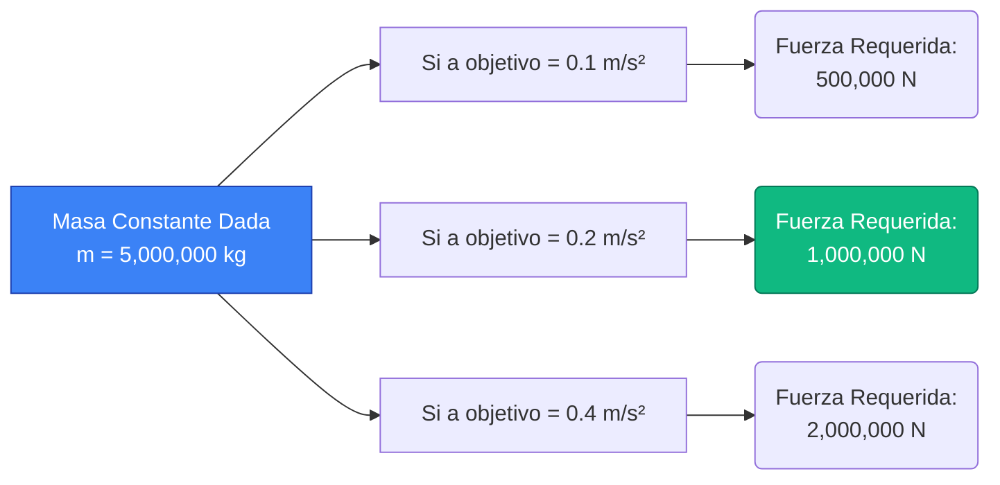
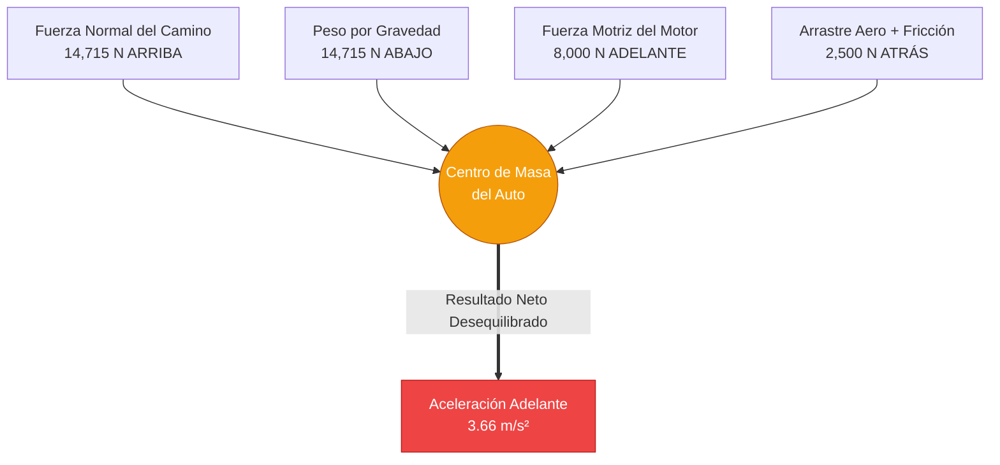
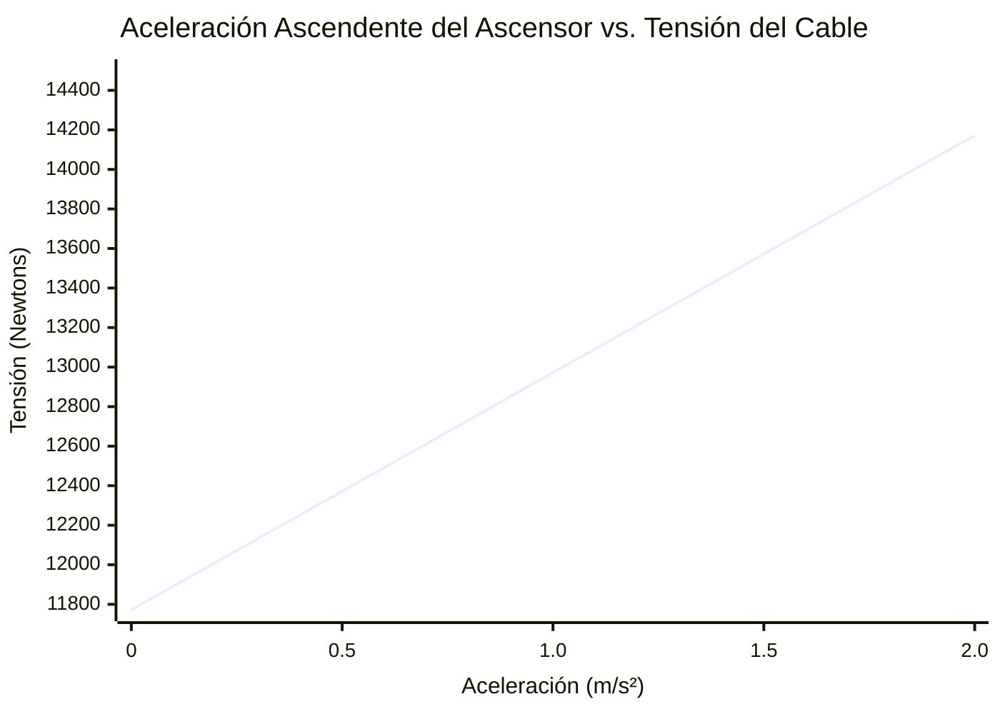
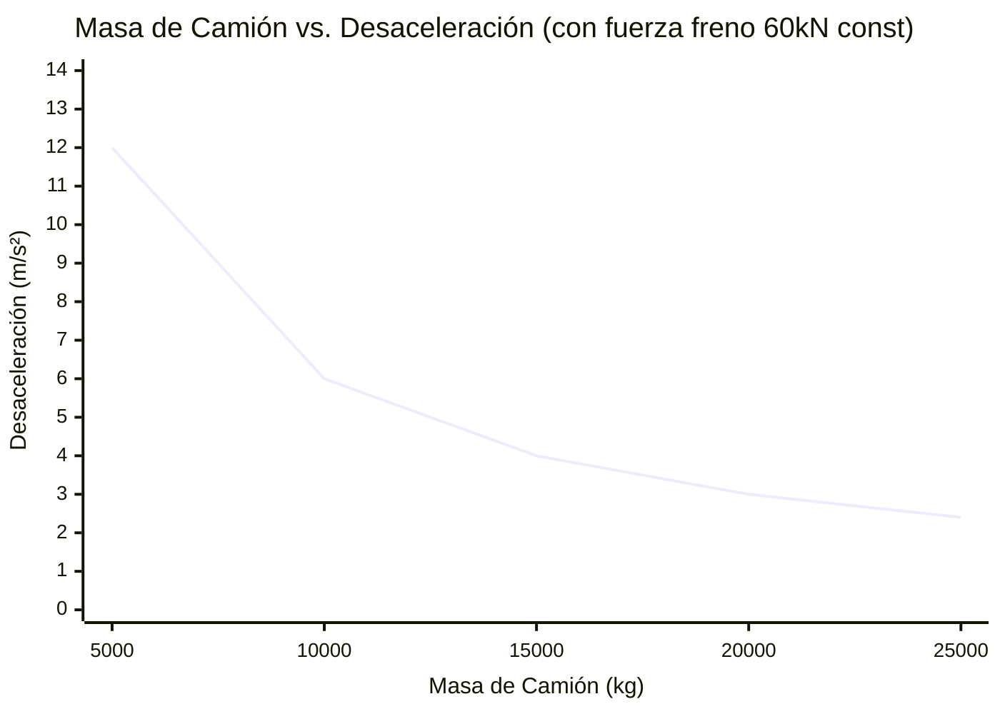

# La Calculadora de Fuerza Definitiva: Dominando la Segunda Ley de Newton y la Mecánica Vectorial

Bienvenido a la **Calculadora de Fuerza** definitiva y a la guía completa de física. Ya sea que sea un ingeniero aeroespacial que calcula los meganewtons exactos de empuje requeridos para poner un satélite en órbita, un diseñador automotriz que analiza la fricción de frenado o un estudiante de física preparándose para un extenuante examen final sobre las leyes del movimiento de Newton, esta herramienta está diseñada para una precisión absoluta.

La fuerza es la interacción fundamental que impulsa todo cambio en el universo físico. Sin fuerza, el universo es perfectamente estático: los objetos en reposo permanecen exactamente donde están, y los objetos que se mueven a través del vacío continúan para siempre a la misma velocidad. La fuerza rompe esa inercia.

En esta inmersión masiva de más de 4000 palabras, deconstruiremos completamente el concepto de fuerza mecánica. Exploraremos los fundamentos matemáticos de la Segunda Ley de Newton ($F = m \cdot a$), analizaremos la diferencia entre fuerza neta y fuerza equilibrada, lo guiaremos a través de estrategias de cálculo avanzadas y recorreremos cinco ejemplos de ingeniería del mundo real visualizados con diagramas detallados de Mermaid.js.

---

## 1. La Física de la Fuerza: Rompiendo la Inercia

Para entender la fuerza, primero debemos entender la inercia, tal como la define la **Primera Ley de Movimiento de Sir Isaac Newton**:
> *Un objeto en reposo permanece en reposo y un objeto en movimiento permanece en movimiento con la misma velocidad y en la misma dirección a menos que actúe sobre él una fuerza desequilibrada.*

La fuerza es el mecanismo mediante el cual anulamos la inercia. Es una **cantidad vectorial**, lo que significa que posee tanto una magnitud (qué tan fuerte es el empuje o tirón) como una dirección (hacia dónde se dirige el empuje o tirón).

### Fuerzas Equilibradas vs. Desequilibradas
Imagine una caja fuerte pesada descansando en el suelo. La gravedad empuja la caja fuerte hacia abajo, hacia el centro de la Tierra, con una fuerza de $10,000\text{ N}$. El sólido piso de concreto empuja hacia arriba contra la caja fuerte con una Fuerza Normal de exactamente $10,000\text{ N}$.
Dado que la fuerza ascendente cancela perfectamente la fuerza descendente, la **Fuerza Neta** es exactamente cero ($0\text{ N}$). Estas son **fuerzas equilibradas**. Por lo tanto, la caja fuerte no se acelera; permanece exactamente donde está.

Ahora imagine que coloca un cabrestante a la caja fuerte y tira de ella horizontalmente hacia la derecha con una fuerza de $500\text{ N}$. La fricción del piso se resiste con una fuerza de $200\text{ N}$ hacia la izquierda.
Las fuerzas horizontales ya no están equilibradas. Tiene una **Fuerza Neta** de $300\text{ N}$ empujando hacia la derecha. Debido a que existe una fuerza neta desequilibrada, la caja fuerte comenzará a acelerar inmediatamente hacia la derecha.

### Las Cuatro Fuerzas Fundamentales de la Naturaleza
Si bien nuestra calculadora se ocupa de la mecánica clásica macroscópica (a menudo llamadas Fuerzas de Contacto o Fuerzas Aplicadas), todas las fuerzas en el universo provienen de cuatro interacciones fundamentales:
1. **La Fuerza Nuclear Fuerte:** La fuerza más poderosa, que une protones y neutrones en los núcleos atómicos.
2. **El Electromagnetismo:** La fuerza que actúa entre partículas con carga eléctrica (esta es la causa raíz de la fricción, la tensión y la fuerza normal a nivel molecular).
3. **La Fuerza Nuclear Débil:** Responsable de la desintegración radiactiva.
4. **La Gravedad:** La fuerza más débil, pero la única con un alcance infinito, que hace que la masa atraiga a la masa.

---

## 2. Las Matemáticas Centrales: La Segunda Ley de Newton

Si la Primera Ley define lo que sucede cuando *no* hay fuerza neta, la **Segunda Ley de Newton** define exactamente qué sucede cuando *sí* hay una fuerza neta.

La Segunda Ley establece que la aceleración de un objeto es directamente proporcional a la fuerza neta que actúa sobre él, e inversamente proporcional a su masa. Matemáticamente, esto se expresa como:

$$ F = m \cdot a $$

Dónde:
- **$F$** = Fuerza Neta (medida en Newtons, $N$)
- **$m$** = Masa (medida en kilogramos, $kg$)
- **$a$** = Aceleración (medida en metros por segundo al cuadrado, $m/s^2$)

### La Relación Proporcional
La ecuación $F = m \cdot a$ es elegantemente simple pero profundamente poderosa. Nos dice dos cosas críticas sobre el universo:
1. **Proporcionalidad Directa:** Si desea duplicar la aceleración de un objeto dado, debe duplicar la fuerza aplicada.
2. **Proporcionalidad Inversa:** Si aplica exactamente la misma fuerza a un objeto que es el doble de masivo, se acelerará a la mitad de la velocidad.

### Derivando Masa y Aceleración
Usando álgebra básica, podemos reorganizar la Segunda Ley de Newton para resolver las otras variables.

Para encontrar la Masa cuando se conocen la Fuerza y la Aceleración:
$$ m = \frac{F}{a} $$

Para encontrar la Aceleración cuando se conocen la Fuerza y la Masa:
$$ a = \frac{F}{m} $$

Nuestra calculadora dinámica maneja las tres permutaciones al instante.

---

## 3. Guía de Uso Completa: Maximizando la Calculadora

Nuestra Calculadora de Fuerza interactiva está diseñada para manejar simples revisiones de tareas escolares y complejos análisis de carga de ingeniería. Aquí hay una guía paso a paso para utilizar sus funciones avanzadas.

### Paso 1: Seleccione su Variable Objetivo
En la parte superior de la interfaz, elija lo que está tratando de resolver:
- **Resolver para Fuerza (F):** Seleccione esto si conoce la masa del vehículo/objeto y la tasa a la que se está acelerando.
- **Resolver para Masa (m):** Seleccione esto si sabe cuánta fuerza está aplicando un actuador y qué tan rápido se acelera el objeto como resultado.
- **Resolver para Aceleración (a):** Seleccione esto si conoce el peso exacto de una carga útil y la salida de empuje máximo de su motor.

### Paso 2: Ingrese Valores y Conversiones de Unidades Inteligentes
No necesita realizar conversiones manuales de unidades antes de usar la herramienta.
- Puede ingresar la masa en **Gramos**, **Libras (lbs)** o **Kilogramos**.
- Puede ingresar la aceleración en **Fuerza G**, **$ft/s^2$** o **$m/s^2$**.
- El motor interno de la calculadora normaliza instantáneamente todas las entradas a las unidades estándar del SI (Kilogramos y $m/s^2$) antes de ejecutar el algoritmo $F = ma$.

### Paso 3: Interprete el Medidor de Fuerza Logarítmico
La fuerza escala exponencialmente en el mundo real. Un ser humano empujando un carrito de compras ejerce aproximadamente $50\text{ N}$. El lanzamiento de un cohete de SpaceX ejerce $22,000,000\text{ N}$.
Para representar esto visualmente, nuestro **Medidor de Arco de Fuerza** opera en una escala logarítmica. Clasifica su resultado en niveles del mundo real:
- **Micro-Fuerzas (Verde):** Insectos caminando, manzanas cayendo, pasos humanos.
- **Macro-Fuerzas (Azul):** Coches acelerando, maquinaria industrial, ascensores.
- **Mega-Fuerzas (Rojo):** Motores a reacción, desplazamientos de placas tectónicas, propulsores de cohetes orbitales.

### Paso 4: Alterne al Modo Avanzado para Visualización de Datos
Cambiar al **Modo Avanzado** desbloquea el trazado interactivo de Recharts:
- **El Gráfico de Fuerza vs. Aceleración:** Muestra una pendiente lineal que demuestra cómo la fuerza requerida escala perfectamente junto con la aceleración objetivo para su masa específica.
- **El Animador de Movimiento Vectorial:** Muestra un lienzo 2D dinámico que muestra un bloque que está siendo empujado, con flechas vectoriales que escalan proporcionalmente en función de su magnitud de fuerza calculada.

---

## 4. Cinco Ejemplos Conceptuales de Ingeniería con Visualizaciones 2D

Para cerrar la brecha entre la teoría algebraica y la aplicación en el mundo real, exploremos cinco ejemplos detallados de la mecánica de fuerzas, utilizando Mermaid.js para visualizar la física.

### Ejemplo 1: El Tren de Carga (Fuerza vs. Masa)

**El Escenario:**
Una enorme locomotora diésel tiene la tarea de tirar de un tren de carga cargado de carbón. La masa total del tren es de $5,000,000\text{ kg}$ (5,000 toneladas métricas). El ingeniero del tren necesita acelerar el tren fuera de la estación a una velocidad suave y constante de $0.2\text{ m/s}^2$ para evitar romper los acoplamientos. ¿Cuánta fuerza de tracción neta deben generar los motores de la locomotora?

**Las Matemáticas:**
- Masa ($m$) = $5,000,000\text{ kg}$
- Aceleración ($a$) = $0.2\text{ m/s}^2$

Usando $F = m \cdot a$:
$$ F = 5,000,000 \times 0.2 = 1,000,000\text{ Newtons (1 Meganewton)} $$

La locomotora debe generar una fuerza neta hacia adelante de 1 Mega-Newton solo para lograr esa ligera aceleración.

**Visualización 2D:**
El árbol lógico a continuación ilustra cómo la Segunda Ley de Newton escala linealmente cuando la masa es constante.

---

### Ejemplo 2: El Diagrama de Cuerpo Libre (Resolución de Fuerza Neta)

**El Escenario:**
Un automóvil deportivo de $1,500\text{ kg}$ acelera por una autopista. El motor empuja el auto hacia adelante con $8,000\text{ N}$ de fuerza motriz. Sin embargo, la resistencia aerodinámica del viento (arrastre) empuja hacia atrás con $2,000\text{ N}$, y la fricción de rodadura mecánica empuja hacia atrás con $500\text{ N}$. ¿Cuál es la aceleración real del auto?

**Las Matemáticas:**
Primero, debemos calcular la **Fuerza Neta** ($F_{net}$) en el eje horizontal. Restamos las fuerzas resistivas de la fuerza motriz:
$$ F_{net} = F_{motriz} - (F_{arrastre} + F_{friccion}) $$
$$ F_{net} = 8,000 - (2,000 + 500) = 5,500\text{ N} $$

Ahora que tenemos la verdadera fuerza neta, usamos la fórmula reorganizada para encontrar la aceleración:
$$ a = \frac{F_{net}}{m} = \frac{5,500}{1,500} = 3.66\text{ m/s}^2 $$

**Visualización 2D:**
Este clásico Diagrama de Cuerpo Libre mapea visualmente las fuerzas en conflicto que actúan sobre el centro de masa del vehículo.

---

### Ejemplo 3: Tensión del Cable de un Ascensor (Resolución de Fuerzas Verticales)

**El Escenario:**
La cabina de un ascensor con una masa de $1,200\text{ kg}$ necesita acelerar hacia arriba desde la planta baja a una velocidad de $1.5\text{ m/s}^2$. ¿Cuál es la fuerza de tensión absoluta que tira del pesado cable de soporte de acero?

**Las Matemáticas:**
Este es un problema de fuerzas verticales. El cable no solo tiene que acelerar el ascensor; *primero* tiene que sostener el ascensor contra la gravedad de la Tierra.
- Fuerza de Gravedad (Peso) = $m \cdot g = 1,200 \times 9.81 = 11,772\text{ N}$ hacia abajo.
- Fuerza Neta requerida para acelerar hacia arriba = $m \cdot a = 1,200 \times 1.5 = 1,800\text{ N}$ hacia arriba.

La Tensión total ($T$) en el cable debe ser igual a la fuerza de gravedad MÁS la fuerza necesaria para la aceleración:
$$ T = F_{gravedad} + F_{neta} $$
$$ T = 11,772 + 1,800 = 13,572\text{ N} $$

El cable de acero experimenta casi $13.6\text{ kN}$ de fuerza de tensión.

**Visualización 2D:**
El gráfico a continuación traza la relación lineal entre la aceleración requerida y la tensión resultante del cable.

*(Observe que a una aceleración de $0\text{ m/s}^2$, la tensión no es cero; es igual al peso en reposo de $11,772\text{ N}$).*

---

### Ejemplo 4: El Lanzamiento del Apolo Saturno V (Mega-Newtons en Acción)

**El Escenario:**
El cohete Saturno V, que llevó humanos a la Luna, fue la máquina más poderosa jamás construida. En el despegue, tenía una masa absolutamente asombrosa de $2,970,000\text{ kg}$. Para escapar de la gravedad de la Tierra y lograr una aceleración ascendente inicial de exactamente $1.5\text{ m/s}^2$, ¿cuánto empuje total necesitaron producir sus cinco motores F-1?

**Las Matemáticas:**
Al igual que el ascensor, los motores deben vencer la gravedad antes de que puedan acelerar el vehículo.
$$ F_{gravedad} = m \cdot g = 2,970,000 \times 9.81 = 29,135,700\text{ N (29.14 MN)} $$

La fuerza neta extra requerida para alcanzar la aceleración de $1.5\text{ m/s}^2$ es:
$$ F_{neta} = m \cdot a = 2,970,000 \times 1.5 = 4,455,000\text{ N (4.45 MN)} $$

Empuje total requerido del motor:
$$ Empuje = 29,135,700 + 4,455,000 = 33,590,700\text{ Newtons (33.6 MN)} $$

**Visualización 2D:**
A medida que el cohete quema miles de galones de combustible por segundo, su masa disminuye rápidamente. Debido a que el empuje es constante pero la masa se reduce, la aceleración se dispara. Este diagrama de Gantt traza las fuerzas que cambian violentamente.

```mermaid
gantt
    title Perfil de Ascenso de la Primera Etapa del Saturno V
    dateFormat  HH:mm:ss
    axisFormat %M:%S
    section Despegue
    Ignición (Alta Masa, Baja Acel. 1.5g) :active, id1, 00:00:00, 30s
    Max Q (Picos de Resistencia Aerodinámica) :crit, id2, after id1, 30s
    section Ascenso Tardío
    Pérdida Rápida de Masa (Combustible Quemado) : id3, after id2, 60s
    Fuerza Máxima antes de Separación (Alta Acel. 4g) :milestone, id4, after id3, 0s
```

---

### Ejemplo 5: Frenado y Fricción (Fuerza Negativa)

**El Escenario:**
Un camión semirremolque de $10,000\text{ kg}$ se mueve a $25\text{ m/s}$ (90 km/h). El conductor ve un peligro y bloquea los frenos. La fricción cinética entre las llantas bloqueadas y el asfalto proporciona una fuerza resistiva máxima de $-60,000\text{ N}$. ¿Cuál es la desaceleración del camión y cuánto tiempo tardará en detenerse?

**Las Matemáticas:**
Primero, encuentre la desaceleración (aceleración negativa) usando $a = F/m$:
$$ a = \frac{-60,000}{10,000} = -6.0\text{ m/s}^2 $$

Luego, use la cinemática ($t = \frac{v_f - v_i}{a}$) para encontrar el tiempo de frenado.
- $v_i$ = $25\text{ m/s}$
- $v_f$ = $0\text{ m/s}$ (detenido)
$$ t = \frac{0 - 25}{-6.0} = 4.16\text{ segundos} $$

**Visualización 2D:**
Este gráfico muestra que si el camión fuera más pesado (mayor masa), la misma fuerza de frenado exacta resultaría en una desaceleración drásticamente menor.

*(Cuanto más pesado es el vehículo, peor es el rendimiento de frenado, lo que demuestra la relación inversa $a \propto 1/m$).*

---

## 5. Profundización en Preguntas Frecuentes (FAQ)

**P: ¿Puede haber fuerza sin movimiento?**
**R:** Absolutamente. Si empuja contra una pared de ladrillo sólida con todas sus fuerzas ($500\text{ N}$ de fuerza), la pared responde con exactamente $500\text{ N}$ de fuerza normal. Debido a que las fuerzas están equilibradas, la fuerza neta es cero y no hay movimiento. Usted está aplicando fuerza, pero no genera trabajo ni aceleración.

**P: ¿Cuál es la diferencia entre Peso y Masa?**
**R:** Esta es la distinción más crítica en la física introductoria. La **Masa** es una medida de cuánta materia hay en un objeto (medida en kilogramos). Es igual en todo el universo. El **Peso** es una *fuerza* (medida en Newtons). Es el resultado de la gravedad actuando sobre la masa ($W = m \cdot g$). Un astronauta con una masa de $80\text{ kg}$ pesa $784\text{ N}$ en la Tierra, pero solo $130\text{ N}$ en la Luna. Su masa nunca cambió, solo lo hizo la fuerza gravitacional.

**P: ¿Por qué los objetos más pesados caen a la misma velocidad que los objetos más ligeros en el vacío?**
**R:** La gravedad tira con más fuerza de los objetos más pesados (una roca tiene más fuerza de peso hacia abajo que un guijarro). Sin embargo, los objetos más pesados también tienen más *masa* (inercia), lo que significa que requieren proporcionalmente más fuerza para acelerar. De acuerdo con $a = F/m$, si la Fuerza gravitacional ($F$) aumenta exactamente a la misma tasa que la Masa ($m$), la Aceleración resultante ($a$) permanece perfectamente constante ($9.81\text{ m/s}^2$).

**P: ¿Qué es la Fuerza Centrífuga y es "falsa"?**
**R:** A la fuerza centrífuga a menudo se le llama una fuerza "ficticia" o "inercial". Cuando está en un automóvil tomando una curva cerrada a la izquierda, siente que es empujado hacia la derecha. No hay una fuerza real empujándolo hacia la derecha; en cambio, la masa de su cuerpo quiere continuar en línea recta (inercia) mientras el automóvil gira hacia usted. La única fuerza verdadera es la **Fuerza Centrípeta** (fricción de los neumáticos) empujando el automóvil hacia la izquierda.

**P: ¿Cómo se relacionan los airbags con la Fuerza y la Segunda Ley de Newton?**
**R:** Una forma alternativa de escribir la Segunda Ley de Newton es $F = \frac{\Delta p}{\Delta t}$ (La fuerza es igual al cambio en el momento dividido por el cambio en el tiempo). En un accidente automovilístico, su momento se reduce a cero independientemente de si choca contra el volante o contra un airbag. Sin embargo, el airbag aumenta drásticamente el *tiempo* ($\Delta t$) que le toma detenerse. Al dividir el mismo cambio de momento por un tiempo mucho mayor, la fuerza máxima resultante ($F$) ejercida sobre su cráneo se reduce exponencialmente, salvándole la vida.

---

## 6. Conclusión y Desafío de Ingeniería

La Segunda Ley de Newton ($F = ma$) es la piedra angular de la ingeniería mecánica, la planificación de trayectorias aeroespaciales y la física clásica. Demuestra que el universo opera sobre un sistema de intercambios energéticos equilibrados y desequilibrados.

Para dominar verdaderamente estos conceptos, utilice nuestra Calculadora de Fuerza para resolver los siguientes desafíos conceptuales de ingeniería:
1. **El Tren Bala:** Calcule la fuerza de empuje requerida para acelerar un tren de levitación magnética de $400,000\text{ kg}$ desde el reposo hasta $100\text{ m/s}$ en $60\text{ segundos}$.
2. **La Desviación del Asteroide:** Un asteroide de $10,000,000\text{ kg}$ se dirige hacia la Tierra. Si el motor de un satélite lo empuja con una fuerza constante de $500\text{ N}$ durante exactamente un año, ¿cuál será el cambio final en la velocidad lateral del asteroide?
3. **La Grúa de Remolque:** Si el cable de una grúa de remolque está clasificado para romperse a $30,000\text{ N}$ de tensión, ¿cuál es la tasa máxima absoluta de aceleración que puede aplicar de manera segura a un SUV atascado de $3,000\text{ kg}$?

Experimente con las variables, cambie sin problemas entre las unidades del SI y las unidades imperiales, y confíe en esta calculadora para iluminar las fuerzas matemáticas ocultas que gobiernan el mundo físico que le rodea.
