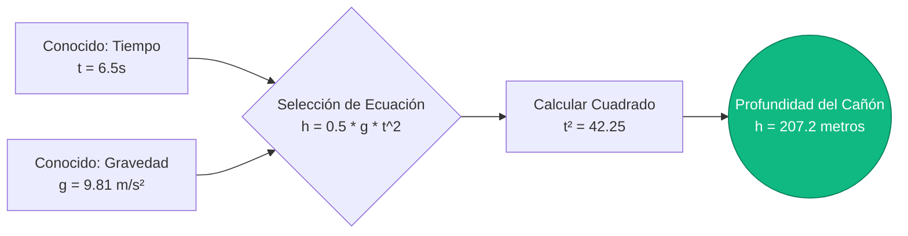
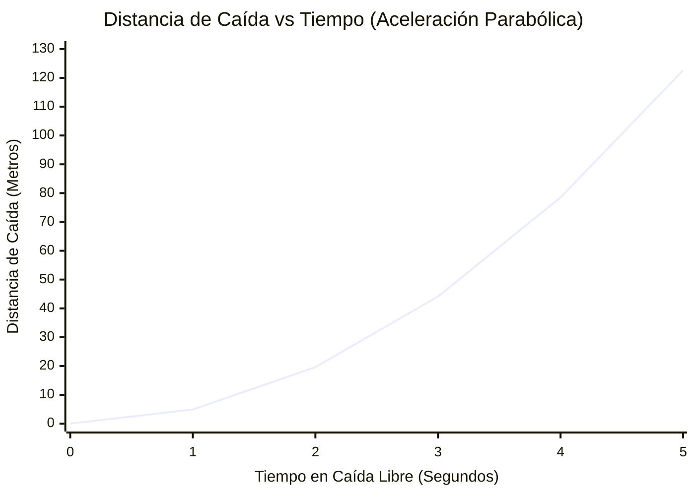
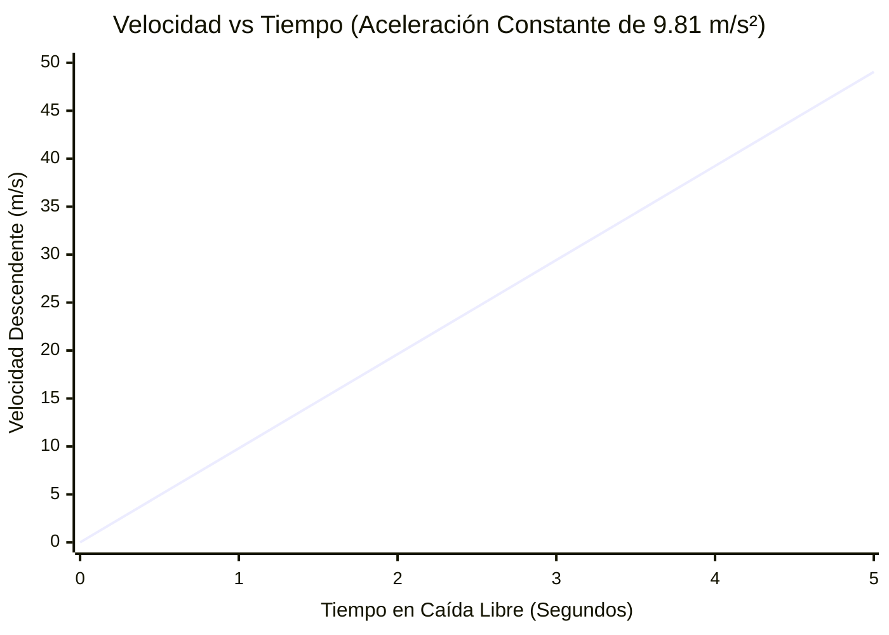
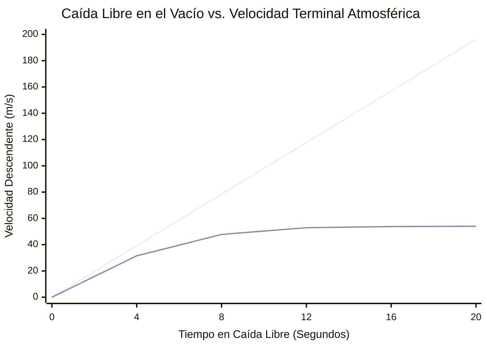

# La Calculadora Definitiva de Caída Libre: Dominando la Cinemática y la Aceleración Gravitacional

Bienvenido a la **Calculadora de Caída Libre** definitiva y guía completa de física. Ya seas un instructor de paracaidismo calculando altitudes de despliegue, un ingeniero aeroespacial simulando la dinámica de reentrada orbital, o un estudiante de física tratando de dominar las Leyes del Movimiento de Galileo, esta herramienta proporciona una precisión inigualable.

La caída libre es la forma más pura de movimiento en el universo. Es la física de objetos que aceleran bajo la fuerza exclusiva e implacable de la gravedad. Desde una manzana que cae de la rama de un árbol hasta los astronautas que flotan a bordo de la Estación Espacial Internacional, las matemáticas de la caída libre lo dictan todo.

En esta enorme guía técnica de más de 4,000 palabras, deconstruiremos exhaustivamente la cinemática de la Caída Libre ($h = \frac{1}{2}gt^2$). Exploraremos la historia de la ciencia gravitacional, la diferencia crítica entre la aceleración en el vacío y la velocidad terminal atmosférica, y te guiaremos a través de cinco escenarios de ingeniería y deportes del mundo real visualizados con diagramas detallados de Mermaid.js.

---

## 1. La Física de la Caída Libre: Movimiento Bajo la Gravedad

En la física newtoniana, la **Caída Libre** se define como el movimiento de un cuerpo donde la gravedad es la *única* fuerza que actúa sobre él. 

Esto significa que, en un verdadero sentido físico, un paracaidista que cae a través del aire *no* está en perfecta caída libre, porque la resistencia del aire atmosférico (arrastre) lo empuja hacia arriba. La verdadera caída libre solo ocurre en un vacío perfecto, como en la superficie de la Luna o dentro de cámaras de caída de vacío especializadas. 

Sin embargo, para objetos densos y pesados que caen distancias relativamente cortas en la Tierra (como dejar caer un rodamiento de bolas de acero desde un escritorio), la resistencia del aire es matemáticamente tan insignificante que lo tratamos como una verdadera caída libre.

### Galileo y la Igualdad de las Masas en Caída
Antes de finales del siglo XVI, el consenso científico (defendido por Aristóteles) era que los objetos más pesados caían más rápido que los objetos más ligeros. Galileo Galilei destrozó este paradigma. 

A través de sus legendarios experimentos (a menudo vinculados apócrifamente con el lanzamiento de esferas desde la Torre Inclinada de Pisa), Galileo demostró que **en ausencia de resistencia del aire, todos los objetos aceleran hacia abajo exactamente al mismo ritmo, independientemente de su masa.** 

Si dejas caer una bola de demolición de $5,000\text{ kg}$ y una pelota de golf de $0.05\text{ kg}$ en una cámara de vacío exactamente al mismo tiempo y desde la misma altura exacta, golpearán el suelo en el mismo milisegundo exacto. 

### Aceleración Estándar Debida a la Gravedad ($g$)
En la Tierra, la tasa estándar de aceleración gravitacional se denota con la letra minúscula $g$. 

$$ g \approx 9.81\text{ m/s}^2 $$

Esto significa que por cada segundo que un objeto está en caída libre, su velocidad descendente aumenta en $9.81\text{ metros por segundo}$ ($35.3\text{ km/h}$ o $21.9\text{ mph}$). 

---

## 2. Las Ecuaciones Cinemáticas Básicas

Las matemáticas de la caída libre se rigen por las ecuaciones cinemáticas 1D estándar de movimiento bajo aceleración constante. Cuando un objeto se deja caer desde el reposo, su velocidad inicial ($v_i$) es precisamente cero, lo que simplifica drásticamente las ecuaciones.

### Ecuación 1: Tiempo de Caída ($t$)
Si conoces la altura ($h$) desde la que se deja caer un objeto, puedes calcular exactamente cuántos segundos tardará en golpear el suelo.

$$ t = \sqrt{\frac{2 \cdot h}{g}} $$

### Ecuación 2: Velocidad de Impacto ($v_f$)
Si conoces la altura de caída, puedes calcular exactamente qué tan rápido viajará el objeto un milisegundo antes de impactar contra el suelo.

$$ v_f = \sqrt{2 \cdot g \cdot h} $$
*(Alternativamente, si ya calculaste el tiempo $t$, simplemente puedes usar $v_f = g \cdot t$)*

### Ecuación 3: Distancia Caída ($h$)
Si tomas el tiempo de cuánto tarda un objeto en golpear el suelo, puedes hacer ingeniería inversa de la altura exacta de la caída. Este es un método común para estimar la profundidad de un pozo oscuro o un cañón.

$$ h = \frac{1}{2} \cdot g \cdot t^2 $$

### La Curva Parabólica de la Distancia
La característica más crítica de la ecuación de distancia es que el tiempo está **elevado al cuadrado** ($t^2$). Un objeto no cae a una velocidad constante; acelera. 
- En el 1er segundo, un objeto cae aproximadamente $4.9\text{ metros}$.
- En el 2do segundo, no cae otros $4.9\text{ metros}$—¡cae otros $14.7\text{ metros}$! 
- Después de 2 segundos de vuelo total, ha caído $19.6\text{ metros}$ ($4.9 \times 4$).

La distancia de caída se escala parabólicamente, no linealmente. 

---

## 3. Velocidad Terminal (La Atmósfera Contraataca)

Aunque las ecuaciones anteriores asumen un vacío perfecto, vivimos en un planeta con una atmósfera densa. A medida que un objeto acelera hacia abajo, debe empujar las moléculas de aire fuera de su camino. Esto crea arrastre aerodinámico.

La fuerza de arrastre aumenta cuadráticamente con la velocidad ($F_D \propto v^2$). Por lo tanto, a medida que el objeto cae cada vez más rápido, la fuerza de arrastre hacia arriba que lo empuja se vuelve exponencialmente más fuerte. 

Eventualmente, la fuerza de arrastre hacia arriba llega a ser exactamente igual al peso gravitacional descendente del objeto. Cuando estas fuerzas se equilibran, la aceleración neta se vuelve cero. El objeto deja de acelerar y cae a una velocidad máxima y constante conocida como **Velocidad Terminal**.

$$ v_t = \sqrt{\frac{2 \cdot m \cdot g}{\rho \cdot A \cdot C_d}} $$

Donde $\rho$ es la densidad del aire, $A$ es el área de la sección transversal frontal y $C_d$ es el coeficiente de arrastre aerodinámico. 

Debido a que la masa ($m$) está en el numerador, los objetos más pesados (como las bolas de boliche) tienen una velocidad terminal mucho más alta que los objetos más ligeros con áreas de superficie similares (como los globos). Es por esto que una pluma cae más lento que un martillo en tu sala de estar, pero caen exactamente a la misma velocidad en una cámara de vacío.

---

## 4. Guía de Uso Completa: Maximizando la Calculadora

Nuestra Calculadora de Caída Libre interactiva está diseñada para resolver cualquier variable cinemática faltante, en cualquier planeta, al instante.

### Paso 1: Seleccionar el Objetivo de Cálculo
Utiliza la interfaz para definir lo que quieres resolver:
- **Tiempo (t):** Ingresa la altura y la gravedad para averiguar cuánto tiempo toma una caída.
- **Velocidad (vf):** Ingresa la altura y la gravedad para encontrar la velocidad de impacto aplastante.
- **Altura (h):** Ingresa el tiempo de caída y la gravedad para medir la profundidad de un acantilado.
- **Gravedad (g):** Ingresa el tiempo de caída y la altura para aplicar ingeniería inversa a la gravedad de un planeta desconocido.

### Paso 2: Utilizar Ajustes Preestablecidos de Gravedad Planetaria
La gravedad no es universal. Nuestra calculadora te permite cambiar instantáneamente entre 10 cuerpos celestes.
¿Quieres saber cuánto tiempo le toma a una llave inglesa caer $50\text{ metros}$ en la Luna? Selecciona el **Ajuste Preestablecido de la Luna** ($1.62\text{ m/s}^2$) y las matemáticas se recalcularán al instante.

### Paso 3: Interpretar el Arco Logarítmico de Velocidad
El **Medidor de Velocidad de Impacto** radial clasifica la velocidad final calculada logarítmicamente:
- **Verde (Baja Energía):** Impactos seguros a baja velocidad (caída de llaves, caer de una silla).
- **Azul (Alta Energía):** Impactos peligrosos a alta velocidad (caer del techo, dejar caer un martillo de un andamio).
- **Rojo (Energía Extrema):** Velocidades letales de velocidad terminal (paracaidismo, impactos de meteoritos).

---

## 5. Cinco Escenarios Conceptuales de Ingeniería con Visualizaciones 2D

Para comprender completamente la cinemática de la caída libre, exploraremos cinco escenarios de física detallados, utilizando Mermaid.js para deconstruir visualmente las matemáticas y las curvas de movimiento.

### Ejemplo 1: La Prueba de Profundidad del Cañón (Flujo Lógico Cinemático)

**El Escenario:**
Un excursionista está de pie al borde de un cañón enorme y oscuro. Quiere saber exactamente cuán profundo es. Deja caer una roca pesada por el borde y enciende su cronómetro. Exactamente $6.5\text{ segundos}$ después, escucha a la roca estrellarse contra el fondo del cañón. Asumiendo que la resistencia del aire en la pesada roca es insignificante, ¿qué profundidad tiene el cañón?

**Las Matemáticas:**
Usamos la fórmula de la distancia ($h = 0.5 \cdot g \cdot t^2$):
$$ h = 0.5 \cdot 9.81\text{ m/s}^2 \cdot (6.5\text{ s})^2 $$
$$ h = 4.905 \cdot 42.25 = 207.2\text{ metros} $$

El cañón tiene una asombrosa profundidad de $207\text{ metros}$ (aproximadamente 680 pies).

**Visualización 2D:**
El árbol lógico a continuación ilustra cómo elegimos la ecuación cinemática correcta en función de nuestras variables conocidas.



---

### Ejemplo 2: Distancia Caída vs. Tiempo (La Curva Parabólica)

**El Escenario:**
Analicemos la trayectoria de vuelo exacta de un rodamiento de bolas de acero que se deja caer desde un helicóptero suspendido en el aire. Queremos trazar su distancia exacta de caída en las marcas de 1, 2, 3, 4 y 5 segundos para visualizar la curva de aceleración de $t^2$.

**Las Matemáticas:**
- Al $1\text{ seg}$: $h = 0.5 \cdot 9.81 \cdot (1)^2 = 4.9\text{ m}$
- A los $2\text{ seg}$: $h = 0.5 \cdot 9.81 \cdot (2)^2 = 19.6\text{ m}$
- A los $3\text{ seg}$: $h = 0.5 \cdot 9.81 \cdot (3)^2 = 44.1\text{ m}$
- A los $4\text{ seg}$: $h = 0.5 \cdot 9.81 \cdot (4)^2 = 78.5\text{ m}$
- A los $5\text{ seg}$: $h = 0.5 \cdot 9.81 \cdot (5)^2 = 122.6\text{ m}$

**Visualización 2D:**
Observa la curva extrema. Entre el segundo 4 y el segundo 5, la bola cayó la enorme cantidad de $44\text{ metros}$ en un solo segundo. Cuanto más tiempo caes, más rápido desaparece la distancia.



---

### Ejemplo 3: Velocidad vs. Tiempo (Aceleración Lineal)

**El Escenario:**
Usando el mismo rodamiento de bolas de acero dejado caer desde el helicóptero, observemos su velocidad en lugar de su distancia. Debido a que la aceleración ($g$) es constante a $9.81\text{ m/s}^2$, la velocidad debería aumentar en exactamente $9.81\text{ m/s}$ cada segundo.

**Las Matemáticas:**
Usamos la fórmula de la velocidad ($v = g \cdot t$):
- Al $1\text{ seg}$: $v = 9.81 \cdot 1 = 9.81\text{ m/s}$ ($35\text{ km/h}$)
- A los $2\text{ seg}$: $v = 9.81 \cdot 2 = 19.62\text{ m/s}$ ($70\text{ km/h}$)
- A los $3\text{ seg}$: $v = 9.81 \cdot 3 = 29.43\text{ m/s}$ ($106\text{ km/h}$)
- A los $4\text{ seg}$: $v = 9.81 \cdot 4 = 39.24\text{ m/s}$ ($141\text{ km/h}$)

**Visualización 2D:**
A diferencia de la distancia, que se curva agresivamente, la velocidad bajo aceleración constante forma una línea recta y predecible perfecta.



---

### Ejemplo 4: Física en el Vacío vs. Velocidad Terminal

**El Escenario:**
Un paracaidista humano salta desde un avión a $4,000\text{ metros}$. Queremos comparar su curva de velocidad real (que toma en cuenta la resistencia atmosférica) frente a su velocidad teórica si saltara en un vacío total (donde $v = gt$ continúa para siempre). 

**Las Matemáticas:**
En realidad, un paracaidista humano en una posición de arco estándar de vientre a tierra genera una resistencia del aire masiva. Aproximadamente en la marca de 12 a 15 segundos de su caída, alcanzarán una velocidad terminal de aproximadamente $54\text{ m/s}$ ($195\text{ km/h}$ o $120\text{ mph}$). 

Si no hubiera aire, seguirían acelerando infinitamente hasta estrellarse contra el suelo a velocidades supersónicas.

**Visualización 2D:**
Este gráfico compara dramáticamente las dos realidades. La línea del vacío se dispara hacia arriba sin fin. La curva atmosférica del mundo real se aplana perfectamente a $54\text{ m/s}$ a medida que el arrastre anula la gravedad.


*(La línea superior empinada representa la física teórica del Vacío. La curva inferior aplanada representa la Velocidad Terminal del mundo real).*

---

### Ejemplo 5: El Salto en Paracaídas a Gran Altitud (Línea de Tiempo del Proceso de Gantt)

**El Escenario:**
Tracemos el cronograma exacto de un salto en paracaídas recreativo estándar. El saltador sale de la aeronave a $4,000\text{ metros}$ ($13,000\text{ pies}$). Cae en caída libre hasta los $1,500\text{ metros}$ ($5,000\text{ pies}$) antes de desplegar su paracaídas principal. ¿Cuánto dura la fase de caída libre?

**Las Matemáticas:**
Necesitan caer en caída libre una distancia total de $2,500\text{ metros}$ ($4,000 - 1,500$). 
Debido a que este es un salto largo, no podemos usar la simple ecuación del vacío $t = \sqrt{2h/g}$. Alcanzarán la velocidad terminal ($54\text{ m/s}$) en aproximadamente $12\text{ segundos}$, habiendo caído aproximadamente $450\text{ metros}$ durante esa fase de aceleración.
Para los $2,050\text{ metros}$ restantes ($2,500 - 450$), caerán a una constante de $54\text{ m/s}$.
$$ t_{constante} = \frac{Distancia}{Velocidad} = \frac{2050}{54} = 37.9\text{ segundos} $$

Tiempo total de caída libre = $12\text{ s}$ (aceleración) + $37.9\text{ s}$ (terminal constante) = **$49.9\text{ segundos}$**.

**Visualización 2D:**
Este diagrama de Gantt visualiza el cronograma lleno de adrenalina del salto, desglosando la fase de aceleración, la fase de velocidad terminal y el viaje con el dosel del paracaídas.

```mermaid
gantt
    title Cronograma de Salto en Paracaídas Estándar (Salida a 4,000m al Suelo)
    dateFormat s
    axisFormat %S
    section Caída Libre
    Salida de Aeronave y Acelerar :done, 0, 12s
    Velocidad Terminal Constante (54 m/s) :crit, active, 12s, 50s
    section Paracaídas
    Despliegue de Paracaídas Principal (Alta Desaceleración) :milestone, 50s, 0s
    Viaje en Dosel (descenso de 5 m/s) :active, 54s, 354s
    Aterrizaje Seguro en Suelo :milestone, 354s, 0s
```

---

## 6. Respuestas a Preguntas Frecuentes (FAQ) a Profundidad

**P: ¿Por qué los astronautas flotan en el espacio si hay gravedad en todas partes?**
**R:** ¡Este es el concepto erróneo más común en astrofísica! Los astronautas a bordo de la Estación Espacial Internacional (ISS) *no* están en gravedad cero. A $400\text{ km}$ sobre la Tierra, la gravedad es todavía un $90\%$ tan fuerte como en la superficie. Los astronautas flotan porque están en un estado de **caída libre continua y perpetua**. La ISS se mueve hacia los lados de manera increíblemente rápida ($28,000\text{ km/h}$) de tal forma que a medida que cae hacia la Tierra, la Tierra se curva por debajo de ella. Están literalmente cayendo alrededor del planeta para siempre. 

**P: ¿Los objetos más pesados caen más rápido?**
**R:** En el vacío, en absoluto. La masa tiene cero efecto sobre la tasa de aceleración gravitacional. Sin embargo, en nuestra atmósfera, los objetos más pesados (que normalmente tienen una mayor relación masa-área de superficie) pueden superar la resistencia aerodinámica de manera más efectiva, lo que significa que tienen una velocidad terminal más alta y, en última instancia, golpearán el suelo más rápido si se dejan caer desde una altitud muy alta.

**P: ¿Qué es la "Ingravidez" (Cero-G)?**
**R:** El peso es simplemente la fuerza normal del suelo empujando hacia arriba contra tus pies. Cuando estás en caída libre, no hay suelo empujándote hacia arriba. Por lo tanto, aunque tu masa siga siendo la misma, tu "peso" aparente se reduce exactamente a cero. Te sientes sin peso.

**P: ¿Cómo funciona realmente un paracaídas?**
**R:** Un paracaídas aumenta drásticamente el área de superficie ($A$) del objeto que cae. Si miramos hacia atrás a nuestra ecuación de la Velocidad Terminal, si aumentas masivamente $A$, disminuyes masivamente $v_t$. Un paracaídas reduce la velocidad terminal de un humano de un nivel letal de $54\text{ m/s}$ a un nivel de supervivencia de $5\text{ m/s}$.

**P: ¿Puedes sobrevivir a una caída libre en agua desde una altura extrema?**
**R:** Por lo general, no. El agua es incompresible. Si golpeas el agua a velocidad terminal ($195\text{ km/h}$), el agua no puede apartarse del camino lo suficientemente rápido. La tensión superficial y la densidad hacen que el agua actúe casi exactamente como hormigón sólido. El salto de altura extremo requiere entradas perfectamente verticales para romper la tensión superficial y extender el tiempo de desaceleración.

---

## 7. Conclusión y Reto de Ingeniería

Las matemáticas de la caída libre son elegantemente simples pero definen el movimiento de todo en el cosmos. Al dominar la curva parabólica $t^2$ de la distancia y comprender el acto crítico de equilibrio de la velocidad terminal, desbloqueas la capacidad de modelar el mundo físico con precisión.

Para dominar verdaderamente estos conceptos, utiliza nuestra Calculadora de Caída Libre para resolver los siguientes desafíos de física conceptual:
1. **La Caída en la Luna:** Los astronautas del Apolo 15 dejaron caer un martillo desde una altura de $1.2\text{ metros}$ en la Luna ($g = 1.62\text{ m/s}^2$). ¿Cuántos segundos exactos tardó en golpear el polvo lunar?
2. **El Abismo de Júpiter:** Si dejaras caer una esfera pesada de titanio en la atmósfera gaseosa de Júpiter ($g = 24.79\text{ m/s}^2$) desde un globo aerostático a gran altitud, ¿cuál sería su velocidad después de exactamente $10\text{ segundos}$ de caída libre equivalente al vacío puro? 
3. **El Salto Acrobático:** Un doble de acrobacias de Hollywood necesita dejarse caer desde un edificio y golpear un colchón de aire especializado exactamente $3.5\text{ segundos}$ después de dar el paso fuera de la cornisa. ¿A qué altura se debe construir la cornisa para que esta sincronización sea perfectamente precisa?

Experimenta con el simulador, analiza las agresivas curvas parabólicas de distancia y confía en esta calculadora para iluminar las fuerzas gravitacionales masivas que gobiernan el universo.
