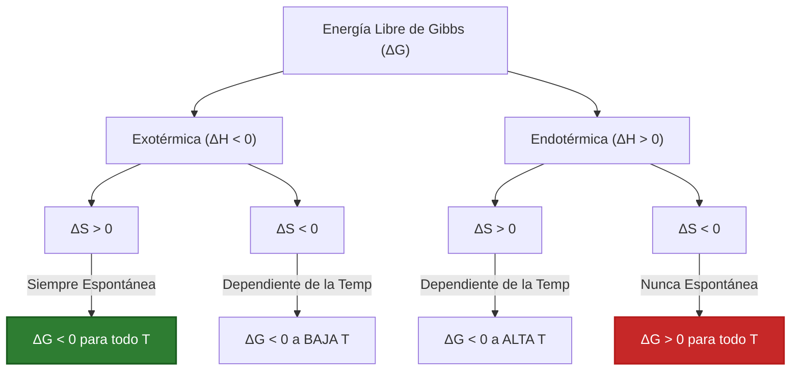

# Guía Completa sobre la Energía Libre de Gibbs y Termodinámica de Reacciones

En fisicoquímica, ingeniería química y electroquímica, la **Energía Libre de Gibbs ($\Delta G$)** determina la favorabilidad termodinámica y el estado de equilibrio de las reacciones químicas:

$$\Delta G = \Delta H - T \cdot \Delta S$$

$$\Delta G^\circ = -R \cdot T \cdot \ln(K)$$

$$\Delta G = \Delta G^\circ + R \cdot T \cdot \ln(Q)$$

$$\Delta G = -n \cdot F \cdot E_{\text{celda}} \quad \left(\text{Puente Electroquímico}\right)$$

$$T_{\text{cruce}} = \frac{\Delta H}{\Delta S} \quad \left(\text{donde } \Delta G = 0\right)$$

---

## 1. La Matriz de los Cuatro Casos de Signos Termodinámicos

| Caso | Entalpía ($\Delta H$) | Entropía ($\Delta S$) | Comportamiento a alta $T$ | Comportamiento a baja $T$ | Condición de Espontaneidad |
| :--- | :--- | :--- | :--- | :--- | :--- |
| **Caso 1** | **Exotérmica ($\Delta H < 0$)** | **Creciente ($\Delta S > 0$)** | Espontánea | Espontánea | **Espontánea a TODAS las Temperaturas** |
| **Caso 2** | **Endotérmica ($\Delta H > 0$)** | **Decreciente ($\Delta S < 0$)** | No Espontánea | No Espontánea | **No Espontánea a TODAS las Temperaturas** |
| **Caso 3** | **Exotérmica ($\Delta H < 0$)** | **Decreciente ($\Delta S < 0$)** | No Espontánea | Espontánea | **Espontánea a BAJA $T$ ($T < T_{\text{cruce}}$)** |
| **Caso 4** | **Endotérmica ($\Delta H > 0$)** | **Creciente ($\Delta S > 0$)** | Espontánea | No Espontánea | **Espontánea a ALTA $T$ ($T > T_{\text{cruce}}$)** |

---

## 2. Resumen de Estado Estándar vs. Estado No Estándar

```
Condiciones Estándar (ΔG°):
T = 298.15 K (25°C), P = 1 atm, Concentración = 1.0 M para todas las especies.
Fórmula: ΔG° = -R * T * ln(K)

Condiciones No Estándar (ΔG):
Las presiones parciales y concentraciones reales difieren de 1.0 M.
Fórmula: ΔG = ΔG° + R * T * ln(Q)
- Si Q < K ➔ ΔG < 0 (La reacción se desplaza HACIA ADELANTE)
- Si Q > K ➔ ΔG > 0 (La reacción se desplaza HACIA ATRÁS)
- Si Q = K ➔ ΔG = 0 (El sistema está en EQUILIBRIO)
```

---

## 3. Descargo de Responsabilidad Educativa y de Laboratorio
*Esta calculadora de Energía Libre de Gibbs proporciona predicciones termodinámicas teóricas para fines educativos, de investigación fisicoquímica y modelado de procesos químicos. Los sistemas reales no ideales pueden requerir coeficientes de actividad, correcciones de entalpía/entropía dependientes de la temperatura ($\Delta C_p$) y transiciones de fase.*

## 4. La Guía Completa de la Energía Libre de Gibbs ($\Delta G$)

Bienvenido al manual definitivo de fisicoquímica sobre la **Energía Libre de Gibbs ($\Delta G$)**. Introducido por Josiah Willard Gibbs en la década de 1870, este potencial termodinámico es el árbitro final del destino químico. Le dice exactamente si una reacción química procederá hacia adelante, procederá hacia atrás o se quedará en equilibrio muerto.

En esta guía exhaustiva de más de 4000 palabras, exploraremos la batalla entre el Calor (Entalpía, $\Delta H$) y el Caos (Entropía, $\Delta S$). Desglosaremos exactamente por qué la temperatura es el gran desempate, calcularemos constantes de equilibrio industrial masivas ($K$) y trazaremos el puente energético hacia la electroquímica. Finalmente, repasaremos cinco derivaciones termodinámicas rigurosas del mundo real y visualizaremos estos procesos utilizando diagramas Mermaid de alta fidelidad.

### 4.1 La Batalla de la Entalpía y la Entropía

El universo se rige por dos deseos termodinámicos conflictivos:
1.  **Entalpía ($\Delta H$):** El deseo de liberar energía (calor). Las reacciones exotérmicas ($\Delta H < 0$) son favorables porque alcanzan un estado de energía más bajo y estable.
2.  **Entropía ($\Delta S$):** El deseo de caos y desorden. Las reacciones que crean más partículas o gases ($\Delta S > 0$) son favorables porque el universo tiende naturalmente hacia un mayor desorden (La Segunda Ley de la Termodinámica).

La **Energía Libre de Gibbs ($\Delta G$)** es simplemente la ecuación maestra que sopesa ambos factores entre sí:
$$ \Delta G = \Delta H - T \cdot \Delta S $$

### 4.2 Por qué la Temperatura ($T$) es el Desempate

Observe el término $-T \cdot \Delta S$. 
Si la Entalpía y la Entropía no están de acuerdo sobre si una reacción debería ocurrir (por ejemplo, la reacción es endotérmica pero crea gas, Caso 4), la Temperatura es el desempate.
Debido a que la Temperatura Absoluta (Kelvin) actúa como un multiplicador en la Entropía, **las altas temperaturas hacen que el universo priorice el caos ($\Delta S$), mientras que las bajas temperaturas hacen que el universo priorice la estabilidad térmica ($\Delta H$).**

### 4.3 Condiciones Estándar vs. No Estándar

*   **Energía Libre Estándar ($\Delta G^\circ$):** Este es un valor constante que se encuentra en los libros de texto. Asume que todos los gases están a $1.0\text{ atm}$ y todas las soluciones son exactamente $1.0\text{ M}$. Está físicamente ligado a la Constante de Equilibrio ($K$): $\Delta G^\circ = -RT \ln(K)$.
*   **Energía Libre Real ($\Delta G$):** En fábricas y celdas reales, las concentraciones casi nunca son exactamente $1.0\text{ M}$. $\Delta G$ calcula la fuerza impulsora *inmediata* de la reacción en este momento, basada en el Cociente de Reacción ($Q$): $\Delta G = \Delta G^\circ + RT \ln(Q)$.

---

## 5. Guía de Uso: Dominando la Calculadora de Energía Libre de Gibbs

Nuestra calculadora actúa como un solver termodinámico universal tanto para ingenieros químicos como para estudiantes.

### 5.1 Modo: Calcular Espontaneidad Básica ($\Delta G = \Delta H - T\Delta S$)

1.  **Seleccione el Objetivo:** Elija "Calcular $\Delta G$".
2.  **Parámetros de Entrada:** Ingrese $\Delta H$ (en $\text{kJ/mol}$), $\Delta S$ (en $\text{J/mol}\cdot\text{K}$) y Temperatura ($T$).
3.  **Ejecutar:** La herramienta maneja la conversión de unidades crítica de $1000\times$ entre Julios y kiloJulios automáticamente, generando $\Delta G$ e indicando explícitamente si la reacción es espontánea.

### 5.2 Modo: Temperatura de Cruce ($T_{\text{cruce}}$)

1.  **Seleccione el Objetivo:** Elija "Calcular Temperatura de Cruce".
2.  **Parámetros de Entrada:** Ingrese valores opuestos de $\Delta H$ y $\Delta S$ (por ejemplo, ambos positivos).
3.  **Ejecutar:** La herramienta calcula $T = \Delta H / \Delta S$, produciendo la temperatura Kelvin exacta donde la reacción transita de no espontánea a espontánea.

### 5.3 Modo: Constante de Equilibrio ($K$)

1.  **Seleccione el Objetivo:** Elija "Calcular Constante de Equilibrio (K)".
2.  **Parámetros de Entrada:** Ingrese la Energía Libre Estándar ($\Delta G^\circ$) y Temperatura ($T$).
3.  **Ejecutar:** La herramienta aplica $K = \exp(-\Delta G^\circ / RT)$, generando la constante de equilibrio masiva (o minúscula), prediciendo exactamente cuánto avanzará la reacción antes de detenerse.

---

## 6. Cinco Derivaciones Termodinámicas del Mundo Real

Anclemos esta pesada teoría resolviendo cinco escenarios termodinámicos rigurosos y prácticos.

### Ejemplo 1: La Combustión del Metano (Caso 1)

**Escenario:** 
Quema gas metano en un horno. 
$\text{CH}_4(g) + 2\text{O}_2(g) \to \text{CO}_2(g) + 2\text{H}_2\text{O}(g)$
Dado a $298.15\text{ K}$: $\Delta H^\circ = -802.3\text{ kJ/mol}$ (altamente exotérmica) y $\Delta S^\circ = +5.2\text{ J/mol}\cdot\text{K}$ (aumenta el desorden).
Calcule $\Delta G^\circ$ y prediga la espontaneidad.

**Derivación Matemática:**

1.  **Verifique las Unidades:**
    $\Delta H^\circ = -802.3\text{ kJ/mol}$
    $\Delta S^\circ = 5.2\text{ J/mol}\cdot\text{K} = 0.0052\text{ kJ/mol}\cdot\text{K}$ (PASO CRÍTICO)
2.  **Aplique la Ecuación de Gibbs:**
    $$ \Delta G^\circ = \Delta H^\circ - T\cdot\Delta S^\circ $$
3.  **Calcule:**
    $$ \Delta G^\circ = -802.3 - (298.15 \times 0.0052) $$
    $$ \Delta G^\circ = -802.3 - 1.55 = -803.85\text{ kJ/mol} $$

**Conclusión:** Debido a que $\Delta H$ es negativo y $\Delta S$ es positivo (Caso 1), esta reacción es increíblemente espontánea ($\Delta G^\circ \ll 0$). Arderá violentamente a cualquier temperatura.

### Ejemplo 2: El Proceso de Haber-Bosch y la Temperatura de Cruce (Caso 3)

**Escenario:**
Síntesis industrial de amoníaco: $\text{N}_2(g) + 3\text{H}_2(g) \rightleftharpoons 2\text{NH}_3(g)$.
Dado: $\Delta H^\circ = -92.2\text{ kJ/mol}$ (exotérmica, favorable) y $\Delta S^\circ = -198.7\text{ J/mol}\cdot\text{K}$ (pierde desorden, 4 moles de gas se convierten en 2, desfavorable).
¿A qué temperatura esta reacción deja de ser espontánea?

**Derivación Matemática:**

1.  **Identifique la Condición de Cruce:**
    El punto de cruce ocurre cuando $\Delta G = 0$.
    $$ 0 = \Delta H - T\cdot\Delta S \implies T = \frac{\Delta H}{\Delta S} $$
2.  **Verifique las Unidades:**
    $\Delta H = -92.2\text{ kJ/mol}$
    $\Delta S = -0.1987\text{ kJ/mol}\cdot\text{K}$
3.  **Calcule $T_{\text{cruce}}$:**
    $$ T = \frac{-92.2}{-0.1987} = 464\text{ K} \quad (191^\circ\text{C}) $$

**Conclusión:** La reacción solo es espontánea *por debajo* de $464\text{ K}$. Si la fábrica opera el reactor a más de $191^\circ\text{C}$, ¡la reacción se revertirá termodinámicamente y destruirá el amoníaco producido! (Los ingenieros deben equilibrar cuidadosamente la termodinámica con la cinética, ya que las bajas temperaturas hacen que la reacción sea demasiado lenta).

### Ejemplo 3: Cálculo de la Constante de Equilibrio ($K$) a partir de $\Delta G^\circ$

**Escenario:**
La disolución del Cloruro de Plata ($\text{AgCl} \rightleftharpoons \text{Ag}^+ + \text{Cl}^-$) tiene una energía libre estándar de $\Delta G^\circ = +55.6\text{ kJ/mol}$ a $298.15\text{ K}$. Calcule la Constante de Producto de Solubilidad ($K_{\text{sp}}$).

**Derivación Matemática:**

1.  **Identifique la Ecuación:**
    $$ \Delta G^\circ = -RT \ln(K) \implies \ln(K) = \frac{-\Delta G^\circ}{RT} $$
2.  **Verifique las Unidades (¡R requiere Julios!):**
    $\Delta G^\circ = 55600\text{ J/mol}$
    $R = 8.314\text{ J/mol}\cdot\text{K}$
3.  **Calcule el exponente:**
    $$ \ln(K) = \frac{-55600}{8.314 \times 298.15} = \frac{-55600}{2478.8} = -22.43 $$
4.  **Resuelva para $K$:**
    $$ K = e^{-22.43} = 1.81 \times 10^{-10} $$

**Conclusión:** Debido a que $\Delta G^\circ$ es grande y positiva, la constante de equilibrio es microscópica ($1.8 \times 10^{-10}$). El $\text{AgCl}$ es altamente insoluble en agua.

**Visualización: Lógica de Casos Termodinámicos**


*Este diagrama de flujo mapea visualmente los cuatro casos termodinámicos, dictando exactamente cuándo una reacción está permitida por las leyes de la física.*

### Ejemplo 4: Energía Libre No Estándar ($\Delta G$) a través del Cociente de Reacción ($Q$)

**Escenario:**
Para la reacción $A \rightleftharpoons B$, $\Delta G^\circ = +5.0\text{ kJ/mol}$ a $298.15\text{ K}$. 
Normalmente, esto es no espontáneo. Sin embargo, configura un reactor con una concentración masiva de $A$ ($10.0\text{ M}$) y casi cero $B$ ($0.01\text{ M}$). Calcule el $\Delta G$ real.

**Derivación Matemática:**

1.  **Calcule el Cociente de Reacción ($Q$):**
    $$ Q = \frac{[B]}{[A]} = \frac{0.01}{10.0} = 0.001 $$
2.  **Aplique la Ecuación No Estándar:**
    $$ \Delta G = \Delta G^\circ + RT \ln(Q) $$
3.  **Verifique las Unidades (Use kJ para R):**
    $R = 0.008314\text{ kJ/mol}\cdot\text{K}$
4.  **Calcule:**
    $$ \Delta G = 5.0 + (0.008314 \times 298.15 \times \ln(0.001)) $$
    $$ \Delta G = 5.0 + (2.4788 \times -6.907) $$
    $$ \Delta G = 5.0 - 17.12 = -12.12\text{ kJ/mol} $$

**Conclusión:** Al manipular el principio de Le Chatelier y privar al sistema del producto, usted forzó una reacción no espontánea ($\Delta G^\circ = +5.0$) a volverse altamente espontánea en la dirección directa ($\Delta G = -12.12\text{ kJ/mol}$).

### Ejemplo 5: Conectando Gibbs a la Electroquímica ($\Delta G^\circ = -nFE^\circ$)

**Escenario:**
La Pila de Daniell ($\text{Zn} + \text{Cu}^{2+} \to \text{Zn}^{2+} + \text{Cu}$) tiene un potencial de celda estándar de $E^\circ_{\text{celda}} = +1.10\text{ V}$. Se transfieren exactamente 2 electrones ($n=2$). Calcule el trabajo termodinámico máximo ($\Delta G^\circ$) que esta batería puede generar.

**Derivación Matemática:**

1.  **Identifique la Ecuación:**
    $$ \Delta G^\circ = -n \cdot F \cdot E^\circ_{\text{celda}} $$
2.  **Defina las Constantes:**
    $n = 2\text{ mol } e^-$
    $F = 96485\text{ C/mol}$
    $E^\circ = 1.10\text{ V (J/C)}$
3.  **Calcule en Julios:**
    $$ \Delta G^\circ = - (2) \times (96485) \times (1.10) $$
    $$ \Delta G^\circ = -212267\text{ Julios/mol} $$
4.  **Convierta a kJ:**
    $$ \Delta G^\circ = -212.3\text{ kJ/mol} $$

**Conclusión:** Una simple batería de $1.10\text{ V}$ produce unos inmensos $212.3\text{ kiloJulios}$ de energía libre termodinámica, demostrando exactamente por qué las baterías electroquímicas son tan poderosas.

**Visualización: Línea de Tiempo del Cambio de Temperatura**

```mermaid
gantt
    title Reacción por Lotes de Cambio de Temperatura
    dateFormat  HH:mm:ss
    axisFormat  %H:%M
    section Fase Ambiente
    T=298K No Espontánea (ΔG > 0) :active, 00:00:00, 02:00:00
    section Fase de Calentamiento
    Aumento de T a 600K :02:00:00, 03:00:00
    section Fase de Alta Temp
    T=600K Espontánea (ΔG < 0) :crit, 03:00:00, 06:00:00
```


*Este diagrama de Gantt visualiza una reacción industrial endotérmica impulsada por la entropía (Caso 4). Permanece inactiva a temperatura ambiente, pero procede violentamente una vez que se supera la temperatura de cruce mediante el calentamiento.*

---

## 7. Preguntas Frecuentes Detalladas y Solución de Problemas Avanzados

**P: ¿Puede una reacción ser espontánea si tanto $\Delta H$ como $\Delta S$ son negativos?**
**R:** Sí, pero SOLO a bajas temperaturas (Caso 3). Si $\Delta S$ es negativo, el término $-T\Delta S$ se vuelve positivo. Si la temperatura es demasiado alta, este término positivo domina al $\Delta H$ negativo, anulando la espontaneidad. 

**P: ¿Por qué los cálculos de $\Delta G$ de mi libro de texto nunca coinciden con los resultados del laboratorio?**
**R:** Los libros de texto calculan $\Delta G^\circ$ en estados estándar (concentración de $1.0\text{ M}$). En su vaso de precipitados de laboratorio, sus concentraciones podrían ser de $0.05\text{ M}$, lo que desplaza el Cociente de Reacción ($Q$). Debe calcular el $\Delta G$ no estándar = $\Delta G^\circ + RT \ln(Q)$ para encontrar la verdadera espontaneidad en su vaso.

**P: ¿Es $\Delta G$ lo mismo que la Energía de Activación?**
**R:** Absolutamente NO. $\Delta G$ mide la diferencia de altura entre el punto de partida y el punto de llegada de una montaña. La energía de activación ($E_a$) mide la altura del pico de la montaña en el medio. $\Delta G$ le indica si puede rodar cuesta abajo (termodinámica); $E_a$ dicta con cuánta fuerza debe empujar para que comience (cinética).

¡Al dominar el tira y afloja matemático entre la Entalpía y la Entropía, identificar las temperaturas de cruce y vincular la Energía Libre Estándar con las constantes de equilibrio, puede trazar el destino termodinámico de cualquier sistema químico. Confíe en esta Calculadora de Energía Libre de Gibbs para obtener predicciones termodinámicas instantáneas y físicamente perfectas!
