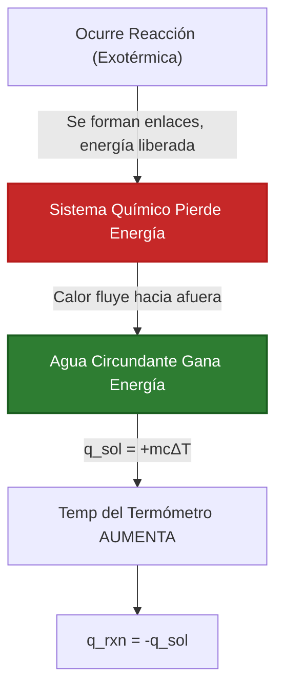

# Guía Industrial y de Laboratorio Completa sobre el Calor de Reacción y la Termoquímica

En química física, termoquímica e ingeniería química, el **Calor de Reacción ($q_{\text{rxn}}$)** cuantifica la energía térmica transferida durante los procesos químicos:

$$q_p = \Delta H_{\text{rxn}} \quad \left(\text{Presión Constante}\right)$$

$$q_v = \Delta U_{\text{rxn}} \quad \left(\text{Bomba Calorimétrica a Volumen Constante}\right)$$

$$q_{\text{total}} = n_{\text{reactivo}} \cdot \Delta H_{\text{rxn}}$$

$$q_{\text{solucion}} = m \cdot c \cdot \Delta T \quad \left(\text{Calor de Solución}\right)$$

$$q_{\text{calorimetro}} = C_{\text{cal}} \cdot \Delta T \quad \left(\text{Calor del Hardware}\right)$$

$$q_{\text{rxn}} = -\left(q_{\text{solucion}} + q_{\text{calorimetro}}\right)$$

---

## 1. Comparación de Calorimetría: Taza de Café vs. Bomba Calorimétrica

| Característica | Calorimetría a Presión Constante (Taza de Café) | Bomba Calorimétrica |
| :--- | :--- | :--- |
| **Condición de Operación** | **Presión Constante ($P = \text{const}$)** | **Volumen Constante ($V = \text{const}$)** |
| **Valor Termodinámico** | **Cambio de Entalpía ($\Delta H$)** | **Cambio de Energía Interna ($\Delta U$)** |
| **Sistema Principal** | Soluciones Acuosas, Neutralización Ácido-Base | Combustión de Combustibles, Reacciones de Gases |
| **Ecuación de Calor** | $q_{\text{rxn}} = -m c \Delta T$ | $q_v = -C_{\text{cal}} \Delta T$ |
| **Alivio de Presión** | Abierto a la Atmósfera | Recipiente de Acero Sellado (Alta Presión) |

---

## 2. Matriz de Métodos de Cálculo Termoquímico

```
1. Calor de Reacción Directo: q_rxn = n * ΔH_rxn
2. Calorimetría de Solución: q = m * c * ΔT
3. Calor de Reacción en Taza de Café: q_rxn = -(q_solucion + q_calorimetro)
4. Bomba Calorimétrica a Volumen Constante: q_v = ΔU = -C_cal * ΔT
5. Entalpías de Formación Estándar: ΔH°_rxn = Σ n * ΔH°f(productos) - Σ n * ΔH°f(reactivos)
6. Aditividad de la Ley de Hess: ΔH_total = ΔH_1 + ΔH_2 + ΔH_3 + ...
7. Energías de Enlace Promedio: ΔH = Σ BE(rotos) - Σ BE(formados)
```

---

## 3. Descargo de Responsabilidad Educativo y de Laboratorio
*Esta calculadora de Calor de Reacción proporciona predicciones termoquímicas teóricas para aplicaciones educativas, investigación en química física e ingeniería de procesos. Las mediciones calorimétricas reales deben tener en cuenta la capacidad calorífica del calorímetro ($C_{\text{cal}}$), la pérdida de calor hacia el entorno y la mezcla no ideal de soluciones.*

## 4. La Guía Completa del Calor de Reacción ($q_{\text{rxn}}$) y Calorimetría

Bienvenido al manual definitivo de química física sobre el **Calor de Reacción ($q_{\text{rxn}}$)**. Mientras que la entalpía estándar ($\Delta H$) te dice la energía teórica liberada por mol de un libro de texto, el Calor de Reacción te dice exactamente cuánta energía térmica está estallando físicamente en tu vaso de precipitados en este momento.

En esta guía exhaustiva de más de 4000 palabras, analizaremos la diferencia fundamental entre los estados termodinámicos abstractos (Entalpía, $\Delta H$) y la transferencia de calor físico (Calor, $q$). Dominaremos las matemáticas de ingeniería detrás de la **Calorimetría a Presión Constante (Taza de Café)** y la **Bomba Calorimétrica** (volumen constante). Finalmente, resolveremos cinco escenarios de transferencia de calor estequiométricos rigurosos del mundo real y visualizaremos la dinámica térmica utilizando diagramas Mermaid de alta fidelidad.

### 4.1 Entalpía ($\Delta H$) vs. Calor ($q$)

Los estudiantes a menudo confunden Entalpía y Calor, pero son fundamentalmente distintos en termodinámica:
1.  **Cambio de Entalpía ($\Delta H$):** Esta es una *función de estado termodinámico*, generalmente dada en $\text{kJ/mol}$. Es una propiedad teórica de la reacción química en sí, totalmente independiente de la cantidad de sustancia química que realmente tengas en tu vaso de precipitados.
2.  **Calor ($q$):** Esta es la transferencia física de energía térmica, generalmente dada en $\text{Joules}$ o $\text{kJ}$ físicos. Depende completamente de la masa física de las sustancias químicas que reaccionan. Si quemas un fósforo, el Calor ($q$) es pequeño. Si quemas un bosque, el Calor ($q$) es enorme. ¡Pero la Entalpía de quemar madera ($\Delta H$) es idéntica para ambos!

**El Puente:** El calor es simplemente la Entalpía escalada por la estequiometría física:
$$ q_{\text{rxn}} = n \cdot \Delta H_{\text{rxn}} $$

### 4.2 Presión Constante (Taza de Café) vs Volumen Constante (Bomba)

Los ingenieros químicos utilizan dos tipos distintos de calorímetros para medir el Calor de Reacción, y la física difiere significativamente:

*   **Calorimetría de Taza de Café:** Realizada en una taza de espuma de poliestireno abierta. Debido a que está abierta a la atmósfera, la presión es constante. A presión constante, todo el calor transferido equivale directamente al cambio de Entalpía ($q_p = \Delta H$).
*   **Bomba Calorimétrica:** Realizada dentro de un cilindro de acero pesado y sellado (una bomba). Dado que el gas no puede expandirse contra la atmósfera, no se realiza trabajo de expansión $P\Delta V$. Por lo tanto, ¡todo el calor transferido es igual al cambio de Energía Interna ($q_v = \Delta U$), no a la Entalpía!

### 4.3 La Física de lo Exotérmico vs. Endotérmico

*   **Reacción Exotérmica:** El sistema de reacción pierde físicamente energía hacia el agua circundante. El agua absorbe la energía, lo que hace que la temperatura aumente ($q_{\text{rxn}} < 0$, $\Delta T > 0$).
*   **Reacción Endotérmica:** El sistema de reacción extrae energía térmica del agua circundante para romper sus enlaces químicos. El agua pierde calor, lo que hace que la temperatura caiga en picada ($q_{\text{rxn}} > 0$, $\Delta T < 0$).

---

## 5. Guía de Uso: Dominando la Calculadora del Calor de Reacción

Nuestra calculadora actúa como un solucionador termoquímico universal tanto para laboratorios de secundaria como para ingeniería industrial.

### 5.1 Modo: Escala de Calor Estequiométrico ($q = n\Delta H$)

1.  **Seleccione el Objetivo:** Elija "Calor Estequiométrico de Reacción".
2.  **Ingrese los Parámetros:** Ingrese la entalpía molar ($\Delta H_{\text{rxn}}$ en $\text{kJ/mol}$) y los moles físicos de reactivo consumido ($n$).
3.  **Ejecutar:** La herramienta escala la función de estado termodinámico en un valor de transferencia de energía física ($q$ en kiloJoules).

### 5.2 Modo: Calorimetría de Solución (Taza de Café)

1.  **Seleccione el Objetivo:** Elija "Calorimetría de Taza de Café".
2.  **Ingrese los Parámetros:** Ingrese la masa del agua circundante ($m$), la capacidad calorífica específica ($c$) y el cambio de temperatura ($\Delta T$).
3.  **Ejecutar:** La herramienta calcula el calor absorbido por la solución ($q_{\text{sol}}$), y luego invierte el signo para calcular el calor exacto liberado por la reacción ($q_{\text{rxn}}$).

### 5.3 Modo: Bomba Calorimétrica (Calor del Hardware)

1.  **Seleccione el Objetivo:** Elija "Bomba Calorimétrica".
2.  **Ingrese los Parámetros:** Ingrese la constante del calorímetro de hardware ($C_{\text{cal}}$ en $\text{kJ/}^\circ\text{C}$) y el cambio de temperatura ($\Delta T$).
3.  **Ejecutar:** La herramienta ignora por completo la masa de agua, basándose estrictamente en la capacidad calorífica precalibrada de la bomba de acero pesada para calcular $q_v = \Delta U$.

---

## 6. Cinco Derivaciones Termoquímicas del Mundo Real

Fundamentemos esta teoría resolviendo cinco escenarios de transferencia de calor rigurosos y prácticos.

### Ejemplo 1: Escalar Entalpía a Calor Físico ($q = n\Delta H$)

**Escenario:** 
La combustión del propano ($\text{C}_3\text{H}_8$) tiene una entalpía estándar de $\Delta H^\circ_{\text{rxn}} = -2220\text{ kJ/mol}$. Quemas físicamente un tanque masivo de $500.0\text{ g}$ de propano en una barbacoa. Calcula el calor físico exacto ($q$) liberado.

**Derivación Matemática:**

1.  **Convertir Masa a Moles:**
    Masa Molar de $\text{C}_3\text{H}_8 = (3 \times 12.01) + (8 \times 1.01) = 44.11\text{ g/mol}$
    $$ n = \frac{500.0\text{ g}}{44.11\text{ g/mol}} = 11.335\text{ moles de propano} $$
2.  **Aplicar Escala Estequiométrica:**
    $$ q_{\text{total}} = n \cdot \Delta H^\circ_{\text{rxn}} $$
3.  **Calcular:**
    $$ q_{\text{total}} = 11.335\text{ mol} \times -2220\text{ kJ/mol} = -25164\text{ kJ} $$

**Conclusión:** La entalpía termodinámica es de $-2220\text{ kJ/mol}$, pero quemar físicamente $500\text{g}$ de combustible libera la enorme cantidad de $25,164\text{ kJ}$ de energía térmica.

### Ejemplo 2: Calorimetría Completa de Taza de Café

**Escenario:**
Mezclas $50.0\text{ mL}$ de $1.0\text{ M HCl}$ con $50.0\text{ mL}$ de $1.0\text{ M NaOH}$ en una taza de café de poliestireno. Ambos comienzan a $22.0^\circ\text{C}$. La temperatura se dispara a $28.9^\circ\text{C}$. Suponiendo que la densidad de la solución es $1.0\text{ g/mL}$ y el calor específico es $4.18\text{ J/g}^\circ\text{C}$, calcula el Calor de Reacción ($q_{\text{rxn}}$).

**Derivación Matemática:**

1.  **Determinar la Masa Total:**
    $m = 50.0\text{ g} + 50.0\text{ g} = 100.0\text{ g de solucion}$
2.  **Determinar el Cambio de Temperatura ($\Delta T$):**
    $\Delta T = 28.9 - 22.0 = +6.9^\circ\text{C}$
3.  **Calcular el Calor Absorbido por la Solución ($q_{\text{sol}}$):**
    $$ q_{\text{sol}} = m \cdot c \cdot \Delta T $$
    $$ q_{\text{sol}} = 100.0 \times 4.18 \times 6.9 = +2884.2\text{ Joules} = +2.88\text{ kJ} $$
4.  **Determinar el Calor de Reacción ($q_{\text{rxn}}$):**
    La solución absorbió calor porque la reacción lo liberó (Primera Ley de la Termodinámica).
    $$ q_{\text{rxn}} = -q_{\text{sol}} = -2.88\text{ kJ} $$

**Conclusión:** La neutralización ácido-base liberó físicamente $2.88\text{ kiloJoules}$ de calor en el agua.

### Ejemplo 3: Encontrar la Entalpía Molar a partir de la Calorimetría

**Escenario:**
Siguiendo el Ejemplo 2, calcula la Entalpía Molar de Neutralización ($\Delta H_{\text{rxn}}$) en $\text{kJ/mol}$.

**Derivación Matemática:**

1.  **Recordar el calor físico:**
    $$ q_{\text{rxn}} = -2.88\text{ kJ} $$
2.  **Calcular Moles que Reaccionaron ($n$):**
    Se usaron $50.0\text{ mL}$ de ácido $1.0\text{ M}$.
    $$ n = \text{Molaridad} \times \text{Volumen (L)} = 1.0\text{ mol/L} \times 0.0500\text{ L} = 0.0500\text{ moles} $$
3.  **Calcular Entalpía Molar:**
    $$ \Delta H_{\text{rxn}} = \frac{q_{\text{rxn}}}{n} $$
    $$ \Delta H_{\text{rxn}} = \frac{-2.88\text{ kJ}}{0.0500\text{ mol}} = -57.6\text{ kJ/mol} $$

**Conclusión:** Se determina experimentalmente que la Entalpía Molar de neutralización de ácido fuerte/base fuerte es $-57.6\text{ kJ/mol}$.

**Visualización: Lógica de Flujo de Calor Exotérmico**


*Este diagrama de flujo traza la transferencia física exacta de energía térmica obligada por la Primera Ley de la Termodinámica: la energía perdida por las sustancias químicas debe ser absorbida perfectamente por el agua.*

### Ejemplo 4: Bomba Calorimétrica a Volumen Constante

**Escenario:**
Quemas $1.50\text{ g}$ de ácido benzoico dentro de una Bomba Calorimétrica de acero sellada. La constante del calorímetro de hardware ($C_{\text{cal}}$) está precalibrada a $10.5\text{ kJ/}^\circ\text{C}$. La temperatura de la bomba aumenta de $20.00^\circ\text{C}$ a $23.75^\circ\text{C}$. Calcula el calor de combustión ($q_v$).

**Derivación Matemática:**

1.  **Determinar el Cambio de Temperatura ($\Delta T$):**
    $\Delta T = 23.75 - 20.00 = 3.75^\circ\text{C}$
2.  **Aplicar la Ecuación de la Bomba:**
    Ten en cuenta que las ecuaciones de bomba usan $C_{\text{cal}}$, ignorando por completo la masa específica o el calor específico del agua.
    $$ q_{\text{cal}} = C_{\text{cal}} \cdot \Delta T $$
    $$ q_{\text{cal}} = 10.5\text{ kJ/}^\circ\text{C} \times 3.75^\circ\text{C} = +39.375\text{ kJ} $$
3.  **Calcular el Calor de Reacción ($q_{\text{rxn}}$):**
    $$ q_{\text{rxn}} = -q_{\text{cal}} = -39.375\text{ kJ} $$

**Conclusión:** La combustión de la muestra de $1.50\text{ g}$ liberó físicamente $39.37\text{ kJ}$ de energía interna.

### Ejemplo 5: Calibración de la Capacidad Calorífica del Calorímetro ($C_{\text{cal}}$)

**Escenario:**
Antes de que puedas usar una bomba calorimétrica, debes calibrarla. Quemas exactamente $1.00\text{ g}$ de ácido benzoico ($\Delta H_{\text{combustion}} = -26.38\text{ kJ/g}$ conocido). La temperatura de la bomba aumenta en $2.50^\circ\text{C}$. Calcula la Constante del Calorímetro ($C_{\text{cal}}$).

**Derivación Matemática:**

1.  **Calcular el Calor Liberado por el Estándar:**
    $$ q_{\text{rxn}} = \text{masa} \times \Delta H_{\text{combustion}} $$
    $$ q_{\text{rxn}} = 1.00\text{ g} \times -26.38\text{ kJ/g} = -26.38\text{ kJ} $$
2.  **Determinar el Calor Absorbido por el Calorímetro:**
    $$ q_{\text{cal}} = -q_{\text{rxn}} = +26.38\text{ kJ} $$
3.  **Resolver para $C_{\text{cal}}$:**
    $$ q_{\text{cal}} = C_{\text{cal}} \cdot \Delta T \implies C_{\text{cal}} = \frac{q_{\text{cal}}}{\Delta T} $$
    $$ C_{\text{cal}} = \frac{26.38\text{ kJ}}{2.50^\circ\text{C}} = 10.55\text{ kJ/}^\circ\text{C} $$

**Conclusión:** La enorme bomba de acero requiere $10.55\text{ kJ}$ de energía para elevar su temperatura interna un solo grado Celsius. ¡Ahora está perfectamente calibrada para combustibles desconocidos!

**Visualización: Línea de Tiempo de Operaciones de Calorimetría**

```mermaid
gantt
    title Ciclo de Prueba y Calibración del Calorímetro
    dateFormat  HH:mm:ss
    axisFormat  %H:%M
    section Preparación
    Pesar Muestra Estándar :00:00:00, 00:05:00
    Purga de Oxígeno y Sellar Bomba :00:05:00, 00:10:00
    section Ignición
    Ignición Estándar (q_rxn = -26.38 kJ) :active, 00:10:00, 00:12:00
    Registro de Calibración C_cal :crit, 00:12:00, 00:20:00
    section Pruebas
    Cargar Muestra de Combustible Desconocido :00:20:00, 00:25:00
    Ignición Desconocida (Calcular q_v) :00:25:00, 00:35:00
```


*Este diagrama de Gantt describe el procedimiento operativo estándar (SOP) para la bomba calorimétrica industrial pesada, lo que requiere una combustión de calibración estricta antes de que se puedan cuantificar legalmente los combustibles desconocidos.*

---

## 7. Preguntas Frecuentes Detalladas y Solución de Problemas Avanzados

**P: ¿Puedo usar los datos de la bomba calorimétrica directamente para los cálculos de Entalpía ($\Delta H$)?**
**R:** No perfectamente. La bomba calorimétrica es a volumen constante, lo que significa que calcula la Energía Interna ($\Delta U$). La entalpía ($\Delta H$) asume presión constante. Para reacciones que implican cambios masivos en los moles de gas, debes usar la ecuación de corrección: $\Delta H = \Delta U + \Delta n_{\text{gas}}RT$.

**P: ¿Por qué la calorimetría de taza de café no incluye la masa de la espuma de poliestireno?**
**R:** La espuma de poliestireno es un aislante térmico increíblemente poderoso con una capacidad calorífica extremadamente baja. Absorbe casi cero calor en comparación con el baño de agua masivo, por lo que los ingenieros simplemente lo ignoran para simplificar la ecuación $q=mc\Delta T$. (En entornos de laboratorio altamente rigurosos, ¡sí calculas un $q_{\text{cal}}$ menor para la taza!).

**P: Si mi $\Delta T$ es negativo, ¿es negativo mi calor?**
**R:** Ten cuidado con los signos. Si el $\Delta T$ del agua es negativo (se enfrió), entonces el calor del *agua* ($q_{\text{sol}}$) es negativo. Debido a que la energía se conserva, el calor de la *reacción* ($q_{\text{rxn}}$) debe ser POSITIVE (Endotérmico).

¡Al dominar la escala física de la entalpía, la mecánica del calor específico de la taza de café y la calibración de la bomba de acero de volumen constante, puedes atrapar físicamente y medir la salida térmica de cualquier reacción química. Confía en esta Calculadora de Calor de Reacción para un análisis de transferencia de calor termoquímicamente perfecto al instante!
