# Guía de Laboratorio y Química Analítica para Henderson-Hasselbalch y Análisis de Tampones

En química analítica, física y biológica, la **ecuación de Henderson-Hasselbalch** rige el comportamiento de equilibrio de los sistemas de tampones ácido-base conjugados:

$$\text{pH} = \text{p}K_a + \log_{10}\left(\frac{[\text{A}^-]}{[\text{HA}]}\right) \quad \iff \quad \frac{[\text{A}^-]}{[\text{HA}]} = 10^{\text{pH} - \text{p}K_a}$$

$$\beta = 2.303 \cdot C_{\text{total}} \cdot \frac{K_a [\text{H}^+]}{(K_a + [\text{H}^+])^2} \quad \text{donde } C_{\text{total}} = [\text{HA}] + [\text{A}^-]$$

---

## 1. Matriz de Referencia de Pares Conjugados de Tampón y Relaciones

| Ácido Débil ($\text{HA}$) | Base Conjugada ($\text{A}^-$) | $\text{p}K_a$ ($25^\circ\text{C}$) | Rango Óptimo de pH del Tampón | Aplicación Típica |
| :--- | :--- | :--- | :--- | :--- |
| **Ácido Fórmico** ($\text{HCOOH}$) | Formiato ($\text{HCOO}^-$) | **$3.75$** | $2.75 - 4.75$ | Fase Móvil HPLC |
| **Ácido Acético** ($\text{CH}_3\text{COOH}$) | Acetato ($\text{CH}_3\text{COO}^-$) | **$4.76$** | $3.76 - 5.76$ | Alimentos y Ensayos Enzimáticos |
| **Ácido Carbónico** ($\text{H}_2\text{CO}_3$) | Bicarbonato ($\text{HCO}_3^-$) | **$6.35$** | $5.35 - 7.35$ | Tampón de Plasma Sanguíneo (pH 7.40) |
| **Fosfato ($\text{p}K_{a2}$)** ($\text{H}_2\text{PO}_4^-$) | Fosfato de Hidrógeno ($\text{HPO}_4^{2-}$) | **$7.20$** | $6.20 - 8.20$ | Solución Salina Biológica (PBS) |
| **Ion Amonio** ($\text{NH}_4^+$) | Amoníaco ($\text{NH}_3$) | **$9.25$** | $8.25 - 10.25$ | Tampón Analítico Alcalino |

---

## 2. Protocolos de Cálculo Estándar de Henderson-Hasselbalch

```
1. Calcular pH del Tampón: pH = pKa + log10([A-] / [HA])
2. Calcular pKa: pKa = pH - log10([A-] / [HA])
3. Calcular Relación Conjugada: [A-] / [HA] = 10^(pH - pKa)
4. Calcular [A-] Requerida: [A-] = [HA] * 10^(pH - pKa)
5. Calcular [HA] Requerida: [HA] = [A-] / 10^(pH - pKa)
```

---

## 3. Descargo de Responsabilidad de Seguridad Educativa y de Laboratorio
*Esta calculadora de Henderson-Hasselbalch proporciona cálculos teóricos de tampones para fines educativos, investigación de laboratorio y aplicaciones de química AP. Las soluciones concentradas no ideales a altas fuerzas iónicas deben tener en cuenta los coeficientes de actividad utilizando ecuaciones de Debye-Hückel o Pitzer.*

## 4. La Guía Completa de la Ecuación de Henderson-Hasselbalch y Sistemas de Tampones

Bienvenido a la guía definitiva para dominar la química de tampones a través de la **ecuación de Henderson-Hasselbalch**. Ya sea que sea un estudiante de química AP que aprende por qué una mezcla de ácido débil y base conjugada resiste los cambios de pH, un bioquímico calculando la relación molar exacta requerida para un tampón salino fisiológico, o un estudiante de medicina estudiando la acidosis sanguínea humana, comprender esta ecuación no es negociable.

Un **tampón** es una solución química especial que resiste obstinadamente los cambios en su pH cuando se añaden pequeñas cantidades de ácidos fuertes o bases fuertes. Logra esta "absorción de choque" química al contener tanto un ácido débil (para neutralizar la base entrante) como su base conjugada (para neutralizar el ácido entrante). Las matemáticas que rigen este delicado tira y afloja se describen íntegramente por la ecuación de Henderson-Hasselbalch.

En esta guía técnica exhaustiva de más de 4000 palabras, desglosaremos las derivaciones termodinámicas de la ecuación, analizaremos el concepto crítico de la **Capacidad del Tampón ($\beta$)**, estableceremos las reglas para el diseño de tampones y recorreremos cinco ejemplos rigurosos del mundo real (incluido el sistema de tampón de bicarbonato en sangre humana) con derivaciones matemáticas y diagramas visuales de Mermaid.

### 4.1 Derivación de la Ecuación de Henderson-Hasselbalch

La ecuación no es una fórmula mágica; es una transformación logarítmica directa de la constante estándar de disociación ácida ($K_a$). Veamos la disociación de un ácido débil genérico, $\text{HA}$:
$\text{HA} \rightleftharpoons \text{H}^+ + \text{A}^-$

La constante de equilibrio para esta reacción es:
$$ K_a = \frac{[\text{H}^+][\text{A}^-]}{[\text{HA}]} $$

Si aislamos algebraicamente la concentración del ion hidronio $[\text{H}^+]$:
$$ [\text{H}^+] = K_a \times \frac{[\text{HA}]}{[\text{A}^-]} $$

Ahora, tome el logaritmo negativo en base 10 ($-\log_{10}$) de ambos lados de la ecuación:
$$ -\log_{10}([\text{H}^+]) = -\log_{10}(K_a) - \log_{10}\left(\frac{[\text{HA}]}{[\text{A}^-]}\right) $$

Sustituya nuestras definiciones estándar ($\text{pH} = -\log_{10}[\text{H}^+]$ y $\text{p}K_a = -\log_{10}K_a$), e invierta el término logarítmico final para cambiar la resta por suma:
$$ \text{pH} = \text{p}K_a + \log_{10}\left(\frac{[\text{A}^-]}{[\text{HA}]}\right) $$

Esta es la **Ecuación de Henderson-Hasselbalch**. Afirma explícitamente que el pH de un tampón está determinado por la fuerza intrínseca del ácido ($\text{p}K_a$) **más** la relación de la base conjugada con el ácido débil.

### 4.2 La "Regla del 1" y el Punto de Semi-Equivalencia

La comprensión más profunda de la ecuación de Henderson-Hasselbalch ocurre cuando un tampón contiene concentraciones molares exactamente iguales del ácido débil y su base conjugada: $[\text{A}^-] = [\text{HA}]$.
Cuando esto sucede, la relación $[\text{A}^-] / [\text{HA}]$ se convierte exactamente en $1.0$.

Debido a que $\log_{10}(1.0) = 0$, la ecuación colapsa violentamente en:
$$ \text{pH} = \text{p}K_a + 0 $$
$$ \text{pH} = \text{p}K_a $$

Esto se conoce como el **Punto de Semi-Equivalencia** en una titulación. A este pH específico, el tampón posee su máxima capacidad posible para resistir cambios de pH en direcciones tanto ácidas como básicas.

### 4.3 Capacidad del Tampón ($\beta$) y el Rango del Tampón

Si bien un tampón resiste el cambio de pH, no puede resistir indefinidamente. La **Capacidad del Tampón ($\beta$)** es una medida cuantitativa de cuánto ácido fuerte o base fuerte puede absorber un tampón antes de que su pH cambie significativamente (generalmente en 1 unidad).

La capacidad del tampón depende de dos factores críticos:
1.  **Concentración Absoluta ($C_{\text{total}}$):** Un tampón que contiene $1.0\text{ M}$ de HA y $1.0\text{ M}$ de $\text{A}^-$ tiene diez veces la capacidad de un tampón que contiene $0.1\text{ M}$ de HA y $0.1\text{ M}$ de $\text{A}^-$, a pesar de que su pH es idéntico. Más moléculas = más poder de neutralización.
2.  **La Relación:** La capacidad del tampón se maximiza cuando $[\text{A}^-] = [\text{HA}]$ (es decir, cuando $\text{pH} = \text{p}K_a$).

Como regla general en química analítica, un tampón solo se considera efectivo dentro de **$\pm 1\text{ unidad de pH}$ de su $\text{p}K_a$**.
- Si $\text{pH} = \text{p}K_a - 1$, la relación $[\text{A}^-]/[\text{HA}]$ es $1:10$. El tampón tiene muy poca capacidad para absorber más ácido.
- Si $\text{pH} = \text{p}K_a + 1$, la relación $[\text{A}^-]/[\text{HA}]$ es $10:1$. El tampón tiene muy poca capacidad para absorber más base.

### 4.4 ¿Cuándo falla la Ecuación?

La ecuación de Henderson-Hasselbalch es una *aproximación*. Supone que las concentraciones de equilibrio de $[\text{HA}]$ y $[\text{A}^-]$ son exactamente iguales a las cantidades iniciales que usted colocó en el vaso de precipitados.
Esta suposición comienza a fallar gravemente bajo tres condiciones:
1.  **Dilución Extrema:** Si el tampón se diluye por debajo de $1 \times 10^{-4}\text{ M}$, la autoionización del agua ($[\text{H}^+] = 10^{-7}\text{ M}$) comienza a interferir significativamente.
2.  **Ácidos/Bases Fuertes:** La ecuación no se puede utilizar para ácidos fuertes como $\text{HCl}$ o $\text{HNO}_3$, ya que sus valores de $K_a$ tienden al infinito y no queda $[\text{HA}]$ intacto en la solución.
3.  **Relaciones Extremas:** Si la relación de $[\text{A}^-]$ a $[\text{HA}]$ supera $100:1$ o cae por debajo de $1:100$, la aproximación falla ya que el efecto amortiguador del agua toma el control.

---

## 5. Guía de Uso: Dominando la Calculadora de Henderson-Hasselbalch

Nuestra calculadora actúa como un laboratorio analítico digital, ofreciendo resolución bidireccional perfecta para el diseño de tampones.

### 5.1 Cálculo Simple del pH del Tampón

Si está mezclando una cantidad conocida de ácido débil y base conjugada:
1.  **Seleccione el Modo:** Elija "Calcular pH del Tampón".
2.  **Ingrese los Parámetros:** Ingrese el $\text{p}K_a$ de su ácido, la concentración de la base conjugada $[\text{A}^-]$, y la concentración del ácido débil $[\text{HA}]$.
3.  **Lea el Resultado:** La calculadora proporciona inmediatamente el pH final de la mezcla, la relación y evalúa si el tampón se encuentra dentro del rango de capacidad ideal de $\pm 1$.

### 5.2 Diseño de Tampón de Laboratorio (Apuntando a un pH)

Si su protocolo de laboratorio requiere un tampón a un pH específico (ej. pH 7.40 para células biológicas):
1.  **Seleccione el Modo:** Elija "Calcular Relación $[\text{A}^-]/[\text{HA}]$".
2.  **Ingrese los Parámetros:** Ingrese su pH objetivo y el $\text{p}K_a$ de su agente amortiguador elegido (ej. $7.20$ para Fosfato).
3.  **Ejecutar:** La herramienta utiliza la función del logaritmo inverso $10^{(\text{pH} - \text{p}K_a)}$ para indicarle exactamente cuántos moles de base conjugada necesita por cada mol de ácido débil. 

---

## 6. Cinco Ejemplos Conceptuales del Mundo Real

Las matemáticas abstractas se convierten en herramientas poderosas cuando se aplican a la química física. A continuación se presentan cinco ejemplos rigurosos que cubren la creación de tampones, el amortiguamiento fisiológico de la sangre y el cálculo de la capacidad de neutralización.

### Ejemplo 1: El Clásico Tampón de Acetato

**Escenario:** 
Un bioquímico prepara una solución tampón que contiene $0.25\text{ M}$ de Ácido Acético ($\text{CH}_3\text{COOH}$, $\text{p}K_a = 4.76$) y $0.15\text{ M}$ de Acetato de Sodio ($\text{CH}_3\text{COONa}$). ¿Cuál es el pH de esta solución?

**Derivación Matemática:**

1.  **Identificar Componentes:**
    Ácido Débil $[\text{HA}] = 0.25\text{ M}$
    Base Conjugada $[\text{A}^-] = 0.15\text{ M}$
    $\text{p}K_a$ del Ácido $= 4.76$
2.  **Aplicar Henderson-Hasselbalch:**
    $$ \text{pH} = \text{p}K_a + \log_{10}\left(\frac{[\text{A}^-]}{[\text{HA}]}\right) $$
    $$ \text{pH} = 4.76 + \log_{10}\left(\frac{0.15}{0.25}\right) $$
    $$ \text{pH} = 4.76 + \log_{10}(0.60) $$
    $$ \text{pH} = 4.76 - 0.222 $$
    $$ \text{pH} = 4.538 \approx 4.54 $$

**Conclusión:** El pH es 4.54. Debido a que hay más ácido débil ($0.25\text{ M}$) que base conjugada ($0.15\text{ M}$), el pH se tira más bajo que el $\text{p}K_a$ intrínseco (4.76).

### Ejemplo 2: La Sangre Humana y el Tampón de Bicarbonato

**Escenario:**
El plasma sanguíneo humano está estrictamente amortiguado a un pH de $7.40$. El tampón primario es el sistema Ácido Carbónico / Bicarbonato. El ácido carbónico ($\text{H}_2\text{CO}_3$) tiene un $\text{p}K_a$ fisiológico de $6.10$. ¿Cuál debe ser la relación de Bicarbonato ($[\text{HCO}_3^-]$) a Ácido Carbónico ($[\text{H}_2\text{CO}_3]$) en la sangre humana sana?

**Derivación Matemática:**

1.  **Identificar Parámetros:**
    $\text{pH}$ Objetivo $= 7.40$
    $\text{p}K_a$ del Ácido $= 6.10$
2.  **Aislar la Relación Logarítmica:**
    $$ \text{pH} = \text{p}K_a + \log_{10}\left(\frac{[\text{HCO}_3^-]}{[\text{H}_2\text{CO}_3]}\right) $$
    $$ 7.40 = 6.10 + \log_{10}(\text{Relación}) $$
    $$ 1.30 = \log_{10}(\text{Relación}) $$
3.  **Ejecutar el Logaritmo Inverso:**
    $$ \text{Relación} = 10^{1.30} \approx 19.95 $$

**Conclusión:** En la sangre humana sana, hay aproximadamente **$20$ veces** más base de bicarbonato que ácido carbónico. Este desequilibrio masivo proporciona a la sangre una gran capacidad para absorber desechos metabólicos ácidos (como el ácido láctico) sin que el pH de la sangre caiga en una peligrosa acidosis.

**Visualización: Fisiología del Bicarbonato**


*Este diagrama de flujo demuestra por qué la biología humana selecciona específicamente una relación de tampón desequilibrada para sobrevivir a los subproductos ácidos del metabolismo.*

### Ejemplo 3: Diseño de un Tampón de Fosfato (PBS)

**Escenario:**
Un laboratorio necesita diseñar una solución de Solución Salina Tamponada con Fosfato (PBS) exactamente a un pH de 7.00. El sistema amortiguador disponible es $\text{H}_2\text{PO}_4^-$ (ácido débil, $\text{p}K_a = 7.20$) y $\text{HPO}_4^{2-}$ (base conjugada). Si el protocolo requiere que la concentración de ácido débil sea exactamente $0.050\text{ M}$, ¿qué concentración de base conjugada se debe añadir?

**Derivación Matemática:**

1.  **Calcular la Relación Requerida:**
    $$ \text{pH} - \text{p}K_a = \log_{10}\left(\frac{[\text{A}^-]}{[\text{HA}]}\right) $$
    $$ 7.00 - 7.20 = -0.20 $$
    $$ \text{Relación} = 10^{-0.20} = 0.631 $$
2.  **Calcular la Concentración de Base Conjugada Requerida:**
    $$ \frac{[\text{A}^-]}{[\text{HA}]} = 0.631 $$
    $$ \frac{[\text{A}^-]}{0.050} = 0.631 $$
    $$ [\text{A}^-] = 0.050 \times 0.631 = 0.03155\text{ M} $$

**Conclusión:** Para lograr un pH perfecto de 7.00, el químico debe mezclar $0.050\text{ M}$ del ácido débil con $0.03155\text{ M}$ de la sal de base conjugada.

### Ejemplo 4: El Ataque Ácido (Neutralización de Tampón)

**Escenario:**
Tomemos $1.0\text{ Litro}$ de un tampón perfecto que contiene $0.10\text{ M}$ de ácido débil genérico ($\text{HA}$, $\text{p}K_a = 5.00$) y $0.10\text{ M}$ de base conjugada ($\text{A}^-$). El pH inicial es 5.00. 
Luego añadimos agresivamente $0.02\text{ Moles}$ de ácido clorhídrico puro ($\text{HCl}$, un ácido fuerte). ¿Cuál es el nuevo pH?

**Derivación Matemática:**

1.  **Moles Iniciales en 1.0 L:**
    $[\text{HA}] = 0.10\text{ mol}$
    $[\text{A}^-] = 0.10\text{ mol}$
2.  **Neutralización Estequiométrica:**
    Los $0.02\text{ mol}$ de ácido fuerte ($\text{H}^+$) atacarán completamente la base conjugada ($\text{A}^-$), convirtiéndola en ácido débil ($\text{HA}$).
    **Nuevo $[\text{A}^-]$:** $0.10 - 0.02 = 0.08\text{ mol}$
    **Nuevo $[\text{HA}]$:** $0.10 + 0.02 = 0.12\text{ mol}$
3.  **Aplicar Henderson-Hasselbalch al Nuevo Estado:**
    $$ \text{pH} = \text{p}K_a + \log_{10}\left(\frac{[\text{A}^-]}{[\text{HA}]}\right) $$
    $$ \text{pH} = 5.00 + \log_{10}\left(\frac{0.08}{0.12}\right) $$
    $$ \text{pH} = 5.00 + \log_{10}(0.667) $$
    $$ \text{pH} = 5.00 - 0.176 = 4.82 $$

**Conclusión:** A pesar de recibir un golpe masivo de ácido fuerte, el tampón solo redujo su pH de 5.00 a 4.82. Si hubiera añadido ese mismo ácido a agua pura, el pH habría caído violentamente a 1.70. Esto demuestra el increíble poder de la capacidad de tampón.

**Visualización: Configuración de Laboratorio de Neutralización**

```mermaid
gantt
    title Línea de Tiempo del Laboratorio: Prueba de Neutralización de Tampón
    dateFormat  HH:mm:ss
    axisFormat  %H:%M
    section Preparación
    Mezclar 0.1M HA y 0.1M A- :active, 00:00:00, 00:10:00
    Registrar pH Inicial 5.00 :milestone, 00:10:00, 00:10:00
    section Neutralización
    Inyectar 0.02M HCl :crit, 00:10:00, 00:15:00
    Agitar y Equilibrar :active, 00:15:00, 00:20:00
    section Resultado
    Registrar pH Final 4.82 :milestone, 00:20:00, 00:20:00
```



*Esta línea de tiempo de Gantt traza la secuencia crítica de preparación del tampón, registro de datos de referencia y ejecución del ataque de ácido estequiométrico.*

### Ejemplo 5: Dilución de un Tampón

**Escenario:**
Usted tiene un tampón con $0.50\text{ M HA}$ ($\text{p}K_a = 4.0$) y $0.50\text{ M A}^-$. Su pH es 4.0. Usted diluye la solución añadiendo un volumen igual de agua pura, reduciendo a la mitad ambas concentraciones a $0.25\text{ M}$. ¿Cambia el pH?

**Derivación Matemática:**

1.  **Estado Inicial:**
    $$ \text{pH} = 4.0 + \log_{10}\left(\frac{0.50}{0.50}\right) = 4.0 + 0 = 4.0 $$
2.  **Estado Diluido:**
    $$ \text{pH} = 4.0 + \log_{10}\left(\frac{0.25}{0.25}\right) = 4.0 + 0 = 4.0 $$

**Conclusión:** El pH **no** cambia. Debido a que la ecuación de Henderson-Hasselbalch se basa completamente en la *relación* de los dos componentes, diluirlos ambos por igual se cancela. **Sin embargo**, la capacidad del tampón ($\beta$) de la solución diluida se reduce a la mitad, lo que significa que es mucho más vulnerable a futuros ataques de ácido/base.

---

## 7. Preguntas Frecuentes Detalladas y Solución de Problemas Avanzada

**P: ¿Puedo usar Henderson-Hasselbalch para Ácidos Fuertes?**
**R:** No. Los ácidos fuertes (como el ácido Sulfúrico o Clorhídrico) se disocian al 100% en agua. No hay equilibrio, no hay $[\text{HA}]$ intacto medible, y sus valores de $\text{p}K_a$ son negativos. La ecuación colapsará matemáticamente o producirá resultados sin sentido.

**P: ¿Por qué algunos libros de texto usan "pKb" para tampones?**
**R:** Si está tratando con una base débil (como el Amoníaco, $\text{NH}_3$) y su ácido conjugado (Amonio, $\text{NH}_4^+$), puede usar la variante de base de la ecuación: $\text{pOH} = \text{p}K_b + \log_{10}([\text{Ácido Conjugado}]/[\text{Base Débil}])$. Sin embargo, la mayoría de los químicos analíticos modernos prefieren convertir todo a $\text{p}K_a$ y pH (usando $\text{p}K_a + \text{p}K_b = 14.00$) para evitar confusiones.

**P: ¿Qué sucede si hago un tampón fuera del rango de $\text{p}K_a \pm 1$?**
**R:** Digamos que intenta forzar un tampón de Ácido Acético ($\text{p}K_a = 4.76$) para mantener un pH de 7.00. La relación requerida sería $10^{(7.00 - 4.76)} = 173$. Necesitaría 173 moléculas de Acetato por cada 1 molécula de Ácido Acético. Si entra incluso una pequeña gota de base fuerte en la solución, la única molécula de ácido acético se aniquila instantáneamente y el pH se dispara hacia la zona alcalina. Es un "tampón" solo de nombre, con una capacidad de amortiguamiento ácido efectivamente nula.

**P: ¿La ecuación de Henderson-Hasselbalch se ve afectada por la temperatura?**
**R:** Sí, indirectamente. El valor del $\text{p}K_a$ en sí mismo depende en gran medida de la temperatura porque la disociación ácida está gobernada por la termodinámica ($\Delta G$). Si calienta un tampón, su $\text{p}K_a$ se desplazará, y por lo tanto su pH se desplazará, incluso si la relación química permanece idéntica.

Al comprender profundamente los fundamentos logarítmicos de la ecuación de Henderson-Hasselbalch, posee el poder teórico para diseñar tampones químicos impenetrables, analizar fluidos biológicos complejos y calcular el momento exacto de fallo de la titulación. ¡Use esta calculadora para optimizar los diseños de su laboratorio y garantizar la perfección analítica!
