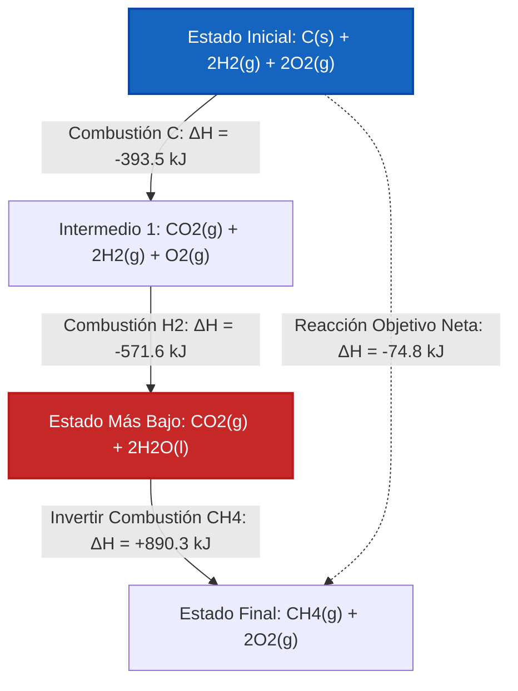

# Guía Completa de Laboratorio y Universidad para la Ley de Hess y el Álgebra de Reacciones

En fisicoquímica, termoquímica y termodinámica química, la **Ley de Hess de la Suma Constante de Calor** proporciona un puente matemático fundamental para calcular las entalpías de reacción ($\Delta H$) de reacciones que son difíciles, peligrosas o lentas de medir directamente en un calorímetro:

$$\Delta H_{\text{objetivo}} = \sum_{i=1}^{k} x_i \cdot \Delta H_i$$

$$\vec{R}_{\text{objetivo}} = \sum_{i=1}^{k} x_i \cdot \vec{R}_i \quad \left(\text{Combinación Lineal de Vectores de Reacción}\right)$$

$$\Delta H_{\text{inversa}} = -\Delta H_{\text{directa}}$$

$$\Delta H_{n \cdot \text{reacción}} = n \cdot \Delta H_{\text{original}}$$

---

## 1. Reglas de Transformación de Reacciones de la Ley de Hess

| Transformación | Acción en la Ecuación Química | Acción en el Cambio de Entalpía ($\Delta H$) |
| :--- | :--- | :--- |
| **Invertir Reacción** | Intercambiar Reactivos y Productos ($A + B \to C \implies C \to A + B$) | **Invertir Signo ($\Delta H \to -\Delta H$)** |
| **Multiplicar por $n$** | Multiplicar todos los coeficientes por $n$ ($2A \to 2B$) | **Multiplicar $\Delta H$ por $n$ ($n \cdot \Delta H$)** |
| **Dividir por $n$** | Dividir todos los coeficientes por $n$ ($0.5A \to 0.5B$) | **Dividir $\Delta H$ por $n$ ($\Delta H / n$)** |
| **Sumar Ecuaciones** | Sumar todos los reactivos y todos los productos; cancelar intermedios comunes | **Sumar todas las entalpías ajustadas ($\Delta H_{\text{total}} = \sum \Delta H_i$)** |

---

## 2. Matriz del Motor del Solucionador de Álgebra Lineal y Vectores

```
1. Vectorizar Reacción Objetivo: R_objetivo = [c_1, c_2, ..., c_m]
2. Vectorizar Reacciones de Paso: R_1, R_2, ..., R_k
3. Formar Ecuación Matricial: A * x = b  (donde A = [R_1 | R_2 | ... | R_k], b = R_objetivo)
4. Resolver el Vector Multiplicador x = [x_1, x_2, ..., x_k]
5. Calcular Entalpía Objetivo: ΔH_objetivo = x_1*ΔH_1 + x_2*ΔH_2 + ... + x_k*ΔH_k
```

---

*Esta calculadora de la Ley de Hess proporciona predicciones termoquímicas teóricas con fines educativos, de investigación en fisicoquímica y de aplicaciones en ingeniería de procesos. Los ciclos termoquímicos reales deben garantizar la consistencia de fase (por ejemplo, H2O(l) frente a H2O(g)) y la presión del estado estándar (1 bar / 1 atm).*

## 4. La Guía Completa de la Ley de Hess y la Entalpía de Reacción

Bienvenido al manual definitivo de fisicoquímica sobre la **Ley de Hess de la Suma Constante de Calor**. En termoquímica, medir el cambio de entalpía ($\Delta H$) de cada reacción química físicamente es imposible. Algunas reacciones son demasiado lentas, otras son peligrosamente explosivas, y algunas producen cantidades masivas de subproductos no deseados.

¿Cómo calculan los ingenieros químicos el calor liberado por estas reacciones imposibles? Utilizan la Ley de Hess—un poderoso marco matemático que trata a las ecuaciones químicas como vectores algebraicos.

En esta guía exhaustiva de más de 4000 palabras, dominaremos la lógica de las funciones de estado, las reglas estrictas del álgebra estequiométrica (invertir reacciones, multiplicar coeficientes de escala), la consistencia del estado de fase y algoritmos avanzados de combinación lineal. Finalmente, resolveremos cinco ciclos termoquímicos rigurosos del mundo real y mapearemos rutas de estado de entalpía utilizando diagramas Mermaid de alta fidelidad.

### 4.1 La Entalpía como Función de Estado

La Ley de Hess está matemáticamente garantizada por la Primera Ley de la Termodinámica, específicamente el hecho de que la **Entalpía (H) es una Función de Estado**.

Una función de estado depende *únicamente* del estado termodinámico actual del sistema (temperatura, presión, composición), y es totalmente independiente de la ruta tomada para alcanzar ese estado. 
Imagina subir a una montaña. Tu cambio total de altitud (Entalpía) es idéntico ya sea que tomes un vuelo directo en helicóptero hacia la cima (la reacción objetivo), o si caminas por senderos sinuosos, acampas a mitad de camino y asciendes en zigzag (las reacciones de paso intermedias).

¡Por esto, podemos combinar matemáticamente cualquier secuencia de reacciones químicas medibles para calcular el $\Delta H$ de una reacción objetivo inmedible!

### 4.2 Las Reglas del Álgebra de Ecuaciones Químicas

Para utilizar la Ley de Hess, debes manipular las ecuaciones de los pasos intermedios para que sumen perfectamente tu ecuación objetivo.

**Regla 1: Invertir Reacciones Invierte el Signo de la Entalpía**
Si una reacción es exotérmica (libera calor) en la dirección directa, debe ser endotérmica (absorbe exactamente la misma cantidad de calor) en la dirección inversa.
*   Directa: $A \to B \quad \Delta H = -50\text{ kJ}$
*   Inversa: $B \to A \quad \Delta H = +50\text{ kJ}$

**Regla 2: Multiplicar Ecuaciones Escala la Entalpía**
La entalpía es una propiedad extensiva. Si quemas el doble de combustible, liberas el doble de calor. Si multiplicas los coeficientes estequiométricos de una ecuación por $n$, debes multiplicar el $\Delta H$ por $n$.
*   Original: $A \to B \quad \Delta H = -50\text{ kJ}$
*   Escalada ($x2$): $2A \to 2B \quad \Delta H = -100\text{ kJ}$

**Regla 3: Las Especies Intermedias Deben Cancelarse**
Las especies intermedias son moléculas que aparecen en las ecuaciones de paso pero NO en la ecuación objetivo final. Para cancelarlas, deben aparecer en lados opuestos de la flecha química en cantidades molares iguales.

### 4.3 Estados de Fase: El Peligro Oculto

Un error común en la Ley de Hess es ignorar los estados de fase: sólido ($s$), líquido ($l$), gas ($g$) y acuoso ($ac$). 
**No puedes** cancelar $H_2O(l)$ en el lado de los reactivos con $H_2O(g)$ en el lado de los productos. Contienen cantidades diferentes de entalpía (separadas por el Calor Latente de Vaporización). ¡Debes introducir una reacción de paso de cambio de fase adicional para resolverlos!

---

## 5. Guía de Uso: Dominando la Calculadora de la Ley de Hess

Nuestra calculadora de la Ley de Hess está diseñada tanto para la resolución de problemas educativos como para la termoquímica industrial rápida.

### 5.1 Modo: Manipulación Manual de Reacciones

1.  **Definir Reacción Objetivo:** Ingresa o selecciona un ajuste de reacción objetivo (ej. Síntesis de Monóxido de Carbono).
2.  **Inspeccionar Pasos:** Carga las reacciones de paso intermedio disponibles y sus valores de $\Delta H_i$ base.
3.  **Aplicar Reglas Algebraicas:** 
    *   Haz clic en "Invertir" para intercambiar reactivos/productos e invertir el signo de entalpía.
    *   Ajusta el "Multiplicador" (ej. $1, 2, 0.5$) para escalar la estequiometría y la entalpía.
4.  **Verificar Cancelación:** El motor mostrará dinámicamente la suma de tus pasos manipulados, destacando cualquier especie intermedia que no se haya cancelado.
5.  **Calcular Entalpía Neta:** Una vez que la suma coincida perfectamente con el objetivo, la herramienta mostrará el $\Delta H_{\text{objetivo}}$ final.

### 5.2 Modo: Solucionador Automático de Combinación Lineal

1.  **Sistema de Entrada:** Proporciona la reacción objetivo y todas las ecuaciones de paso intermedio disponibles.
2.  **Ejecutar Solucionador:** La herramienta vectoriza la estequiometría en una matriz de álgebra lineal y resuelve automáticamente los multiplicadores de combinación óptimos.

---

## 6. Cinco Derivaciones Rigurosas de la Ley de Hess

Dominemos el álgebra resolviendo manualmente cinco ciclos termoquímicos complejos y de múltiples pasos.

### Ejemplo 1: Síntesis de Monóxido de Carbono (Inversión Intermedia)

**Reacción Objetivo:**
$$C(s) + \frac{1}{2}O_2(g) \to CO(g) \quad \Delta H = ?$$
*(Esto es difícil de medir porque el CO a menudo entra en combustión adicional para formar CO2 en un calorímetro)*

**Reacciones de Paso Disponibles:**
1.  $C(s) + O_2(g) \to CO_2(g) \quad \Delta H_1 = -393.5\text{ kJ}$
2.  $CO(g) + \frac{1}{2}O_2(g) \to CO_2(g) \quad \Delta H_2 = -283.0\text{ kJ}$

**Derivación Matemática:**

1.  **Alinear Reactivos:** Necesitamos $C(s)$ a la izquierda. El Paso 1 tiene $C(s)$ a la izquierda. 
    *   **Mantener el Paso 1 exactamente como está:**
    *   $C(s) + O_2(g) \to CO_2(g) \quad \Delta H = -393.5\text{ kJ}$
2.  **Alinear Productos:** Necesitamos $CO(g)$ a la derecha. El Paso 2 tiene $CO(g)$ a la izquierda. 
    *   **Invertir Paso 2 (Invertir signo de $\Delta H$):**
    *   $CO_2(g) \to CO(g) + \frac{1}{2}O_2(g) \quad \Delta H = +283.0\text{ kJ}$
3.  **Sumar Ecuaciones y Cancelar:**
    *   Lado izquierdo: $C(s) + O_2(g) + CO_2(g)$
    *   Lado derecho: $CO_2(g) + CO(g) + \frac{1}{2}O_2(g)$
    *   El intermedio $CO_2(g)$ se cancela por completo. 
    *   El $\frac{1}{2}O_2(g)$ a la derecha cancela la mitad del $O_2(g)$ de la izquierda.
    *   Neto: $C(s) + \frac{1}{2}O_2(g) \to CO(g)$ (¡Coincide con el Objetivo!)
4.  **Sumar Entalpías:**
    $$ \Delta H_{\text{objetivo}} = -393.5\text{ kJ} + 283.0\text{ kJ} = -110.5\text{ kJ} $$

**Conclusión:** La síntesis de Monóxido de Carbono es exotérmica, liberando $-110.5\text{ kJ/mol}$.

### Ejemplo 2: Síntesis de Metano (Escalado e Inversión)

**Reacción Objetivo:**
$$C(s) + 2H_2(g) \to CH_4(g) \quad \Delta H = ?$$

**Reacciones de Paso Disponibles:**
1.  $C(s) + O_2(g) \to CO_2(g) \quad \Delta H_1 = -393.5\text{ kJ}$
2.  $H_2(g) + \frac{1}{2}O_2(g) \to H_2O(l) \quad \Delta H_2 = -285.8\text{ kJ}$
3.  $CH_4(g) + 2O_2(g) \to CO_2(g) + 2H_2O(l) \quad \Delta H_3 = -890.3\text{ kJ}$

**Derivación Matemática:**

1.  **Alinear $C(s)$:** Mantener el Paso 1 como está.
    *   $C(s) + O_2(g) \to CO_2(g) \quad \Delta H = -393.5\text{ kJ}$
2.  **Alinear $H_2(g)$:** Necesitamos $2H_2$. El Paso 2 tiene $1H_2$. 
    *   **Multiplicar Paso 2 por 2:**
    *   $2H_2(g) + 1O_2(g) \to 2H_2O(l) \quad \Delta H = 2 \times (-285.8) = -571.6\text{ kJ}$
3.  **Alinear $CH_4(g)$:** Necesitamos $CH_4$ a la derecha. El Paso 3 lo tiene a la izquierda.
    *   **Invertir Paso 3 (Invertir signo):**
    *   $CO_2(g) + 2H_2O(l) \to CH_4(g) + 2O_2(g) \quad \Delta H = +890.3\text{ kJ}$
4.  **Sumar y Cancelar:**
    *   Los intermedios $CO_2(g)$ y $2H_2O(l)$ se cancelan perfectamente.
    *   El $2O_2(g)$ a la derecha cancela perfectamente el $1O_2 + 1O_2 = 2O_2$ a la izquierda.
5.  **Sumar Entalpías:**
    $$ \Delta H_{\text{objetivo}} = -393.5 - 571.6 + 890.3 = -74.8\text{ kJ} $$

**Conclusión:** La entalpía estándar de formación para el Metano es $-74.8\text{ kJ/mol}$.

**Visualización: Diagrama de Vía de Función de Estado de Entalpía**


*Este diagrama ilustra por qué funciona la Ley de Hess: ya sea que se calcule la ruta directa (línea punteada) o la vía profundamente exotérmica de 3 pasos (líneas sólidas), el estado de energía neto final es idéntico.*

### Ejemplo 3: Sublimación del Carbono (Álgebra de Estados de Fase)

**Reacción Objetivo:**
$$C(\text{grafito}) \to C(g) \quad \Delta H = ?$$

**Reacciones de Paso Disponibles:**
1.  $C(\text{grafito}) + O_2(g) \to CO_2(g) \quad \Delta H = -393.5\text{ kJ}$
2.  $C(g) + O_2(g) \to CO_2(g) \quad \Delta H = -1108\text{ kJ}$

**Derivación Matemática:**

1.  **Mantener Paso 1:** $C(\text{grafito})$ está a la izquierda.
    *   $C(\text{grafito}) + O_2(g) \to CO_2(g) \quad \Delta H = -393.5\text{ kJ}$
2.  **Invertir Paso 2:** Mover $C(g)$ a la derecha.
    *   $CO_2(g) \to C(g) + O_2(g) \quad \Delta H = +1108\text{ kJ}$
3.  **Sumar Entalpías:**
    $$ \Delta H_{\text{objetivo}} = -393.5 + 1108 = +714.5\text{ kJ} $$

**Conclusión:** Vaporizar grafito sólido en un gas es masivamente endotérmico, requiriendo $+714.5\text{ kJ/mol}$. 

### Ejemplo 4: Formación de Peróxido de Hidrógeno

**Reacción Objetivo:**
$$H_2(g) + O_2(g) \to H_2O_2(l) \quad \Delta H = ?$$

**Reacciones de Paso Disponibles:**
1.  $H_2(g) + \frac{1}{2}O_2(g) \to H_2O(l) \quad \Delta H_1 = -285.8\text{ kJ}$
2.  $2H_2O_2(l) \to 2H_2O(l) + O_2(g) \quad \Delta H_2 = -196.0\text{ kJ}$

**Derivación Matemática:**

1.  **Alinear $H_2(g)$:** Mantener el Paso 1 como está.
    *   $H_2(g) + \frac{1}{2}O_2(g) \to H_2O(l) \quad \Delta H = -285.8\text{ kJ}$
2.  **Alinear $H_2O_2(l)$:** Necesitamos $1H_2O_2$ a la derecha. El Paso 2 tiene $2H_2O_2$ a la izquierda.
    *   **Invertir Y Dividir el Paso 2 entre 2:**
    *   $H_2O(l) + \frac{1}{2}O_2(g) \to H_2O_2(l) \quad \Delta H = +196.0 / 2 = +98.0\text{ kJ}$
3.  **Sumar y Cancelar:**
    *   Los intermedios $H_2O(l)$ se cancelan perfectamente.
    *   El $\frac{1}{2}O_2$ del Paso 1 y el $\frac{1}{2}O_2$ del Paso 2 invertido se suman para formar exactamente $1 O_2$ a la izquierda.
4.  **Sumar Entalpías:**
    $$ \Delta H_{\text{objetivo}} = -285.8 + 98.0 = -187.8\text{ kJ} $$

**Conclusión:** La entalpía de formación para el Peróxido de Hidrógeno es $-187.8\text{ kJ/mol}$.

### Ejemplo 5: Proceso Industrial de Ácido Nítrico (Ostwald)

**Reacción Objetivo:**
$$4NH_3(g) + 5O_2(g) \to 4NO(g) + 6H_2O(g) \quad \Delta H = ?$$

**Reacciones de Paso Disponibles:**
1.  $N_2(g) + 3H_2(g) \to 2NH_3(g) \quad \Delta H_1 = -91.8\text{ kJ}$
2.  $N_2(g) + O_2(g) \to 2NO(g) \quad \Delta H_2 = +180.6\text{ kJ}$
3.  $2H_2(g) + O_2(g) \to 2H_2O(g) \quad \Delta H_3 = -483.6\text{ kJ}$

**Derivación Matemática:**

1.  **Alinear $NH_3(g)$:** Necesitamos $4NH_3$ a la izquierda. El Paso 1 tiene $2NH_3$ a la derecha.
    *   **Invertir y Multiplicar el Paso 1 por 2:**
    *   $4NH_3(g) \to 2N_2(g) + 6H_2(g) \quad \Delta H = 2 \times (+91.8) = +183.6\text{ kJ}$
2.  **Alinear $NO(g)$:** Necesitamos $4NO$ a la derecha. El Paso 2 tiene $2NO$ a la derecha.
    *   **Multiplicar Paso 2 por 2:**
    *   $2N_2(g) + 2O_2(g) \to 4NO(g) \quad \Delta H = 2 \times (180.6) = +361.2\text{ kJ}$
3.  **Alinear $H_2O(g)$:** Necesitamos $6H_2O$ a la derecha. El Paso 3 tiene $2H_2O$ a la derecha.
    *   **Multiplicar Paso 3 por 3:**
    *   $6H_2(g) + 3O_2(g) \to 6H_2O(g) \quad \Delta H = 3 \times (-483.6) = -1450.8\text{ kJ}$
4.  **Sumar y Cancelar:**
    *   Los intermedios $2N_2(g)$ se cancelan.
    *   Los intermedios $6H_2(g)$ se cancelan.
    *   El Oxígeno reactivo se suma perfectamente: $2O_2 + 3O_2 = 5O_2$.
5.  **Sumar Entalpías:**
    $$ \Delta H_{\text{objetivo}} = +183.6 + 361.2 - 1450.8 = -906.0\text{ kJ} $$

**Conclusión:** El primer paso del proceso de Ostwald para generar ácido nítrico industrial es masivamente exotérmico ($-906.0\text{ kJ}$).

---

## 7. Preguntas Frecuentes Detalladas y Resolución de Problemas Avanzada

**P: ¿La Ley de Hess solo se aplica a la Entalpía?**
**R:** ¡No! Debido a que la Ley de Hess se basa estrictamente en las matemáticas de las funciones de estado, se aplica igualmente a la Entropía estándar ($\Delta S$), la Energía Libre de Gibbs ($\Delta G$) y la Energía Interna ($\Delta U$).

**P: ¿Qué pasa si multiplico por una fracción, eso rompe la química?**
**R:** No, la estequiometría fraccionaria (como $1/2O_2$) es completamente válida en termoquímica. Simplemente significa "medio mol" de Oxígeno, lo cual existe físicamente.

**P: ¿Por qué mi solucionador dice "No se encontró solución"?**
**R:** Esto significa que las ecuaciones de los pasos intermedios proporcionadas son *linealmente independientes* de su ecuación objetivo. Le falta una reacción de paso intermedia crítica (a menudo un cambio de fase como la vaporización) necesaria para abarcar el espacio vectorial de la reacción objetivo.

Al dominar las reglas estrictas del álgebra estequiométrica—invirtiendo reacciones, multiplicando coeficientes y haciendo seguimiento a las especies intermedias—desbloqueas el poder matemático para resolver la entalpía del universo. ¡Confía en esta Calculadora de la Ley de Hess para automatizar combinaciones de vectores y eliminar los errores algebraicos intermedios instantáneamente!
