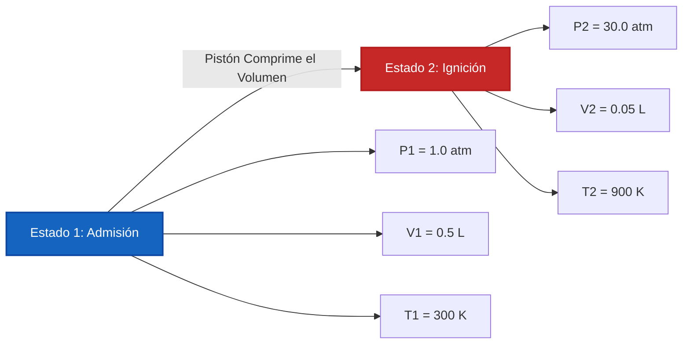

# Guía Completa de Laboratorio e Industrial para la Ley de los Gases Ideales y la Termodinámica de Gases

En fisicoquímica, dinámica de gases e ingeniería de procesos químicos, la **Ley de los Gases Ideales** define el comportamiento de estado de la materia gaseosa:

$$P \cdot V = n \cdot R \cdot T \quad \left(\text{Ecuación de los Gases Ideales}\right)$$

$$\rho = \frac{P \cdot M}{R \cdot T} \quad \left(\text{Fórmula de la Densidad del Gas}\right)$$

$$M = \frac{\rho \cdot R \cdot T}{P} \quad \left(\text{Masa Molar a partir de la Densidad del Gas}\right)$$

$$V_m = \frac{V}{n} = \frac{R \cdot T}{P} \quad \left(\text{Volumen Molar}\right)$$

$$\frac{P_1 \cdot V_1}{T_1} = \frac{P_2 \cdot V_2}{T_2} \quad \left(\text{Ley Combinada de los Gases para } n \text{ Fija}\right)$$

$$Z = \frac{P \cdot V}{n \cdot R \cdot T} \quad \left(\text{Factor de Compresibilidad}\right)$$

---

## 1. Valores de la Constante Universal de los Gases $R$ en Diferentes Sistemas de Unidades

| Unidad de Presión ($P$) | Unidad de Volumen ($V$) | Cantidad ($n$) | Temp ($T$) | Valor de la Constante de los Gases ($R$) |
| :--- | :--- | :--- | :--- | :--- |
| **Atmósferas ($\text{atm}$)** | **Litros ($\text{L}$)** | **$\text{mol}$** | **$\text{K}$** | **$0.082057\text{ L}\cdot\text{atm/(mol}\cdot\text{K)}$** |
| **Pascales ($\text{Pa}$)** | **Metros Cúbicos ($\text{m}^3$)** | **$\text{mol}$** | **$\text{K}$** | **$8.314462\text{ J/(mol}\cdot\text{K)}$** |
| **Bar ($\text{bar}$)** | **Litros ($\text{L}$)** | **$\text{mol}$** | **$\text{K}$** | **$0.083145\text{ L}\cdot\text{bar/(mol}\cdot\text{K)}$** |
| **Torr / $\text{mmHg}$** | **Litros ($\text{L}$)** | **$\text{mol}$** | **$\text{K}$** | **$62.3637\text{ L}\cdot\text{mmHg/(mol}\cdot\text{K)}$** |

---

## 2. Matriz de Solucionadores de las Leyes de los Gases y Relaciones Termodinámicas

```
1. Calcular Presión: P = (n * R * T) / V
2. Calcular Volumen: V = (n * R * T) / P
3. Calcular Moles: n = (P * V) / (R * T)
4. Calcular Temp Absoluta: T_K = (P * V) / (n * R)
5. Calcular Densidad del Gas: ρ = (P * M) / (R * T)
6. Calcular Masa Molar: M = (ρ * R * T) / P
7. Ley de los Gases Combinada de Dos Estados: P2 = (P1 * V1 * T2) / (V2 * T1)
8. Factor de Compresibilidad: Z = (P * V) / (n * R * T)
```

---

*Esta calculadora de la Ley de los Gases Ideales proporciona predicciones termodinámicas teóricas para aplicaciones educativas, de investigación fisicoquímica y de ingeniería de procesos de gases. La dinámica de gases reales a presiones extremas ($P > 100\text{ atm}$) o bajas temperaturas ($T \approx T_{\text{ebullición}}$) debe utilizar las ecuaciones de estado para gases reales de Van der Waals o Redlich-Kwong.*

## 4. La Guía Completa de la Ley de los Gases Ideales y la Termodinámica de Gases

Bienvenido al manual definitivo de fisicoquímica sobre la **Ley de los Gases Ideales ($PV = nRT$)**. ¿Por qué se eleva un globo aerostático en el frío cielo matutino? ¿Por qué los tanques de buceo de aguas profundas contienen una presión letal? ¿Por qué se expande y explota una bolsa sellada de papas fritas en un vuelo de avión a gran altitud?

La respuesta matemática a todos estos fenómenos reside en el equilibrio algebraico impecable de la termodinámica de gases. En esta guía exhaustiva de más de 4000 palabras, analizaremos la teoría cinético-molecular que sustenta $PV=nRT$, definiremos rigurosamente la escala de temperatura absoluta Kelvin, derivaremos fórmulas de masa molar y densidad de gases, y resolveremos cinco escenarios rigurosos de ingeniería termodinámica del mundo real.

### 4.1 La Teoría Cinético-Molecular de los Gases Ideales

La Ley de los Gases Ideales es un modelo matemático que describe perfectamente las propiedades macroscópicas de un gas (Presión, Volumen, Temperatura) al hacer algunas suposiciones críticas sobre su comportamiento microscópico:
1.  **Masas Puntuales:** Las moléculas de gas son infinitesimalmente pequeñas. Su volumen físico es cero en comparación con el inmenso espacio vacío del contenedor.
2.  **Sin Fuerzas Intermoleculares:** Las moléculas de gas no se atraen ni se repelen entre sí. Se comportan como bolas de billar perfectas e independientes.
3.  **Colisiones Elásticas:** Cuando las moléculas de gas chocan contra las paredes del contenedor (creando Presión), rebotan con cero pérdida de energía cinética.
4.  **La Temperatura es igual a la Energía Cinética:** La Temperatura absoluta en Kelvin ($T$) es directa y linealmente proporcional a la energía cinética promedio de las moléculas aceleradas.

### 4.2 La Importancia Crucial del Kelvin Absoluto ($K$)

El fallo catastrófico más común en los cálculos de las leyes de los gases es usar Celsius ($^\circ\text{C}$) o Fahrenheit ($^\circ\text{F}$). **Debe usar estrictamente Kelvin ($K$).**

¿Por qué? Porque la Ley de los Gases Ideales es una relación de magnitudes absolutas. Si usara Celsius, $0^\circ\text{C}$ daría como resultado matemático ¡$0\text{ Volumen}$ y $0\text{ Presión}$! Peor aún, las temperaturas Celsius negativas darían como resultado Volúmenes *negativos*, una imposibilidad física.
El Kelvin soluciona esto. $0\text{ K}$ (Cero Absoluto) es el verdadero estado donde se detiene todo movimiento cinético molecular.
**Conversión:** $T_{\text{K}} = T_{^\circ\text{C}} + 273.15$

### 4.3 Condiciones Estándar (STP vs SATP)

Los químicos utilizan estados de referencia para estandarizar las mediciones de gases:
*   **STP (Temperatura y Presión Estándar):** Históricamente definido como $0^\circ\text{C}$ ($273.15\text{ K}$) y exactamente $1\text{ atm}$. En STP, exactamente $1\text{ mol}$ de un gas ideal ocupa $22.414\text{ Litros}$.
*   **SATP (Temperatura y Presión Ambiente Estándar):** Definido como $25^\circ\text{C}$ ($298.15\text{ K}$) y exactamente $1\text{ bar}$ ($0.9869\text{ atm}$). En SATP, exactamente $1\text{ mol}$ de un gas ideal ocupa $24.789\text{ Litros}$.

---

## 5. Guía de Uso: Dominando la Calculadora de Gases Ideales

Nuestra calculadora actúa como un solucionador algebraico universal para cilindros de gas de alta presión, globos meteorológicos y reactores químicos.

### 5.1 Modo: Aislamiento de Variables de Estado Faltantes

1.  **Seleccione el Objetivo:** ¿Necesita encontrar la presión dentro de un tanque? Elija "Calcular Presión ($P$)". ¿Necesita saber cuánto espacio produce una reacción? Elija "Calcular Volumen ($V$)".
2.  **Ingrese los Datos de Estado:** Introduzca las variables conocidas. Asegúrese de que su sistema de unidades coincida con la constante $R$ elegida (por ejemplo, si usa $0.08206$, use Litros y Atmósferas).
3.  **Ejecutar:** El motor reorganiza algebraicamente $PV = nRT$ para aislar y resolver la variable desconocida al instante.

### 5.2 Modo: Densidad del Gas e Identificación de la Masa Molar

1.  **Seleccione el Objetivo:** Elija "Calcular Densidad del Gas ($\rho$)" o "Calcular Masa Molar ($M$)".
2.  **Ingrese Parámetros:** Introduzca la presión, la temperatura y la masa molar (si resuelve para la densidad) o la densidad (si resuelve para la masa molar).
3.  **Ejecutar:** La herramienta aplica $\rho = \frac{PM}{RT}$. Esto es extremadamente poderoso para identificar gases desconocidos en un laboratorio forense. Si un gas desconocido tiene una densidad de $1.78\text{ g/L}$ en STP, el motor revelará una masa molar de $\approx 40\text{ g/mol}$, identificándolo perfectamente como Argón.

---

## 6. Cinco Derivaciones Rigurosas de la Ley de los Gases Ideales

Dominemos el álgebra de $PV=nRT$ aislando todas las variables a través de cinco escenarios de ingeniería del mundo real.

### Ejemplo 1: Aislando la Presión para un Tanque de Buceo

**Escenario:** 
Un tanque de buceo de aluminio con un volumen interno de exactamente $11.0\text{ Litros}$ se bombea con $100.0\text{ moles}$ de aire respirable. El tanque se almacena en un cobertizo a $35.0^\circ\text{C}$. ¿Cuál es la presión interna del tanque en atmósferas?

**Derivación Matemática:**

1.  **Convertir la Temperatura a Kelvin:**
    $T = 35.0 + 273.15 = 308.15\text{ K}$
2.  **Seleccionar la Constante de los Gases ($R$):**
    Como queremos la presión en `atm` y el volumen en `Litros`, usamos $R = 0.082057\text{ L}\cdot\text{atm/(mol}\cdot\text{K)}$.
3.  **Aislar la Presión ($P$):**
    $$ P \cdot V = n \cdot R \cdot T \implies P = \frac{n \cdot R \cdot T}{V} $$
4.  **Calcular:**
    $$ P = \frac{100.0 \times 0.082057 \times 308.15}{11.0} $$
    $$ P = \frac{2528.6}{11.0} = 229.87\text{ atm} $$

**Conclusión:** La presión interna es de unos aplastantes $229.87\text{ atm}$ (aproximadamente $3,378\text{ PSI}$). ¡Las paredes de aluminio del tanque deben ser increíblemente gruesas para evitar una ruptura catastrófica!

### Ejemplo 2: Determinando el Volumen de un Globo Meteorológico

**Escenario:**
Un equipo de investigación meteorológica lanza un globo meteorológico de gran altitud lleno de $50.0\text{ moles}$ de gas Helio. A medida que asciende a la estratosfera, la presión ambiental cae a unos microscópicos $0.050\text{ atm}$ y la temperatura se desploma a $-60.0^\circ\text{C}$. ¿Cuál es el volumen del globo a esta altitud?

**Derivación Matemática:**

1.  **Convertir la Temperatura a Kelvin:**
    $T = -60.0 + 273.15 = 213.15\text{ K}$
2.  **Aislar el Volumen ($V$):**
    $$ P \cdot V = n \cdot R \cdot T \implies V = \frac{n \cdot R \cdot T}{P} $$
3.  **Calcular:**
    $$ V = \frac{50.0 \times 0.082057 \times 213.15}{0.050} $$
    $$ V = \frac{874.5}{0.050} = 17490\text{ Litros} $$

**Conclusión:** ¡El globo se expande a unos enormes $17,490\text{ Litros}$! Esta es exactamente la razón por la que los globos meteorológicos se lanzan con un aspecto flácido y poco inflados desde el suelo: si se lanzaran completamente tensos, estallarían instantáneamente en la atmósfera superior de baja presión.

### Ejemplo 3: Identificación de la Masa Molar en un Laboratorio

**Escenario:**
Un gas incoloro desconocido se recolecta en un matraz de vidrio de $2.50\text{ Litros}$. El manómetro lee $0.850\text{ atm}$ a una temperatura de laboratorio de $22.0^\circ\text{C}$. El gas se pesa y tiene una masa física de $3.82\text{ gramos}$. Identifique la masa molar del gas para determinar su identidad química.

**Derivación Matemática:**

1.  **Convertir la Temperatura a Kelvin:**
    $T = 22.0 + 273.15 = 295.15\text{ K}$
2.  **Aislar los Moles ($n$):**
    $$ n = \frac{P \cdot V}{R \cdot T} $$
3.  **Calcular los Moles:**
    $$ n = \frac{0.850 \times 2.50}{0.082057 \times 295.15} $$
    $$ n = \frac{2.125}{24.219} = 0.08774\text{ moles} $$
4.  **Determinar la Masa Molar ($M$):**
    $M = \frac{\text{Masa}}{\text{Moles}} = \frac{3.82\text{ g}}{0.08774\text{ mol}} = 43.5\text{ g/mol}$

**Conclusión:** La masa molar es $43.5\text{ g/mol}$. Esta es una coincidencia casi perfecta para el **Dióxido de Carbono ($\text{CO}_2$)**, que tiene una masa molar teórica de $44.01\text{ g/mol}$.

### Ejemplo 4: Compresión de la Ley Combinada de los Gases en Dos Estados

**Escenario:**
El cilindro de un motor de combustión interna aspira $0.500\text{ Litros}$ de aire ($V_1$) a $1.00\text{ atm}$ ($P_1$) y $300\text{ K}$ ($T_1$). El pistón se dispara hacia arriba, aplastando el volumen a $0.050\text{ Litros}$ ($V_2$). La intensa compresión hace que la temperatura se dispare a $900\text{ K}$ ($T_2$). ¿Cuál es la nueva presión máxima ($P_2$) justo antes de que se dispare la bujía?

**Derivación Matemática:**

1.  **Entender la Lógica de Dos Estados:**
    Dado que la válvula está cerrada, la cantidad de gas ($n$) es constante. Por lo tanto, podemos omitir $R$ por completo y usar la Ley Combinada de los Gases:
    $$ \frac{P_1 \cdot V_1}{T_1} = \frac{P_2 \cdot V_2}{T_2} $$
2.  **Aislar $P_2$:**
    $$ P_2 = \frac{P_1 \cdot V_1 \cdot T_2}{V_2 \cdot T_1} $$
3.  **Calcular:**
    $$ P_2 = \frac{1.00 \times 0.500 \times 900}{0.050 \times 300} $$
    $$ P_2 = \frac{450}{15} = 30.0\text{ atm} $$

**Conclusión:** La carrera de compresión multiplica violentamente la presión a $30.0\text{ atm}$ justo antes de la ignición.

**Visualización: Compresión del Cilindro en Dos Estados**


*Este diagrama de flujo ilustra la relación inversa entre el volumen y la presión/temperatura durante la compresión mecánica rápida.*

### Ejemplo 5: Calculando la Densidad del Gas ($\rho$)

**Escenario:**
El Hexafluoruro de Azufre ($\text{SF}_6$) es un gas increíblemente pesado (Masa Molar = $146.06\text{ g/mol}$). Si lo libera a Temperatura y Presión Ambiente Estándar (SATP: $1.0\text{ bar}$ y $298.15\text{ K}$), ¿cuál es su densidad en $\text{g/L}$?

**Derivación Matemática:**

1.  **Seleccionar $R$:**
    Dado que la presión está en `bar`, debemos usar $R = 0.083145\text{ L}\cdot\text{bar/(mol}\cdot\text{K)}$.
2.  **Aplicar la Ecuación de Densidad:**
    $$ \rho = \frac{P \cdot M}{R \cdot T} $$
3.  **Calcular:**
    $$ \rho = \frac{1.0 \times 146.06}{0.083145 \times 298.15} $$
    $$ \rho = \frac{146.06}{24.789} = 5.89\text{ g/L} $$

**Conclusión:** La densidad es unos asombrosos $5.89\text{ g/L}$. A modo de comparación, el aire normal tiene una densidad de aproximadamente $1.18\text{ g/L}$. ¡Es por eso que el $\text{SF}_6$ se hunde hasta el suelo y puede, literalmente, hacer flotar un bote de papel de aluminio en una pecera!

---

## 7. Preguntas Frecuentes Detalladas y Termodinámica Avanzada

**P: ¿Funciona $PV=nRT$ para todos los gases?**
**R:** Funciona increíblemente bien para casi todos los gases a temperatura ambiente y presiones atmosféricas normales (como el Oxígeno, el Nitrógeno y el Aire). Comienza a fallar bajo dos condiciones:
1. **Presión Ultra Alta:** Cuando los gases se comprimen en volúmenes diminutos (como en el Ejemplo 1), el tamaño físico de las moléculas de gas comienza a ocupar un espacio significativo, violando la suposición de "Masa Puntual".
2. **Temperatura Ultra Baja:** A medida que los gases se congelan hacia la condensación, sus moléculas se ralentizan lo suficiente como para comenzar a atraerse gravitacionalmente entre sí, violando la suposición de "Sin Fuerzas Intermoleculares".

**P: ¿Qué es el Factor de Compresibilidad ($Z$)?**
**R:** El Factor de Compresibilidad mide matemáticamente cuánto desobedece un gas la Ley de los Gases Ideales. $Z = \frac{PV}{nRT}$. Para un gas perfectamente ideal, $Z = 1.000$. Si una medición en el mundo real arroja $Z = 0.85$, significa que el gas se está comportando de manera no ideal (probablemente debido a atracciones intermoleculares que reducen el volumen).

**P: ¿Por qué mis cálculos dan como resultado volúmenes negativos?**
**R:** ¡Olvidó convertir los grados Celsius a Kelvin! $PV=nRT$ es estrictamente una ecuación de temperatura absoluta. ¡Sume $273.15$ a todas las entradas en grados Celsius!

Al dominar las simetrías matemáticas de $PV=nRT$, obtiene un control total sobre la ingeniería neumática, el seguimiento de globos meteorológicos y la estequiometría de recipientes de reacción. ¡Confíe en esta Calculadora de la Ley de los Gases Ideales para aislar y resolver al instante cualquier variable termodinámica faltante!
