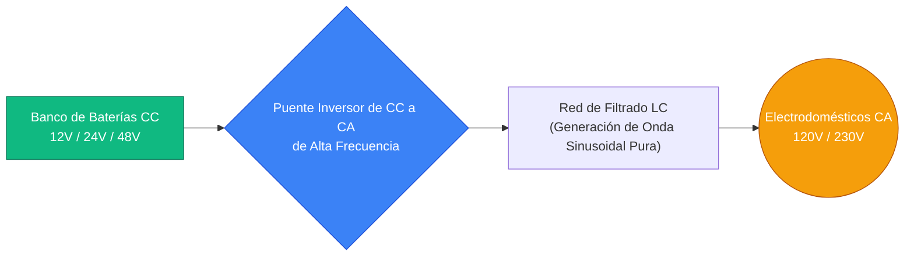
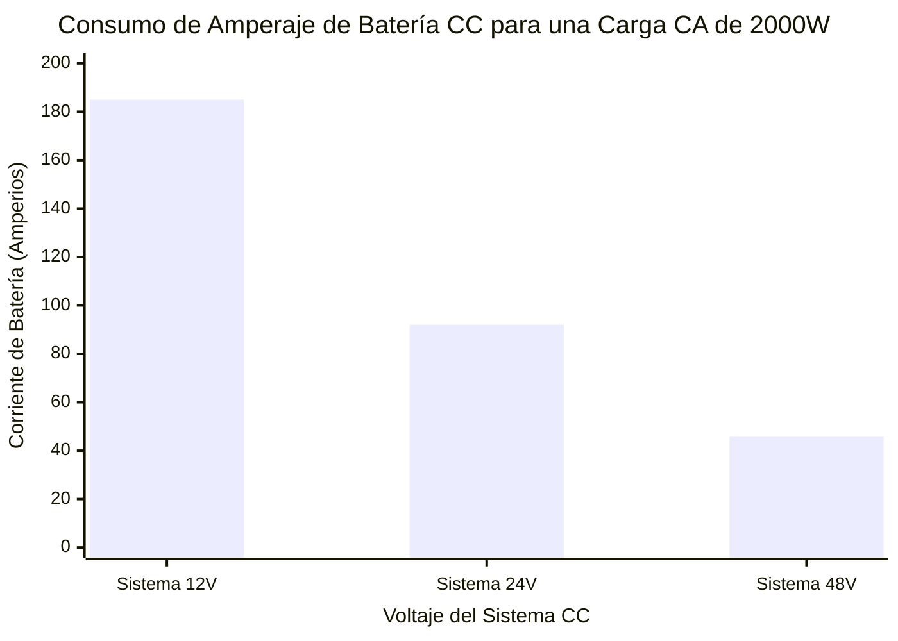
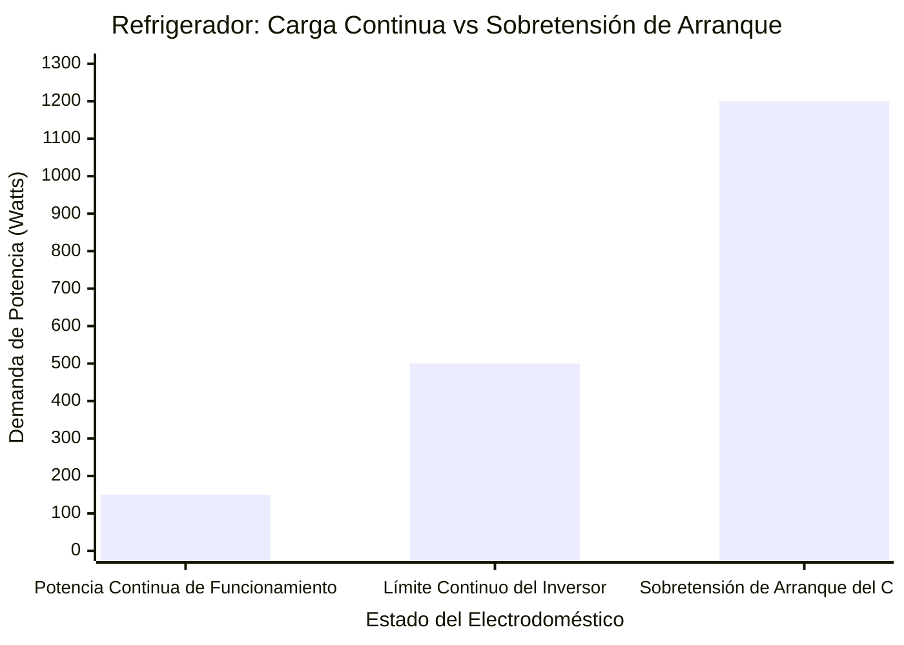
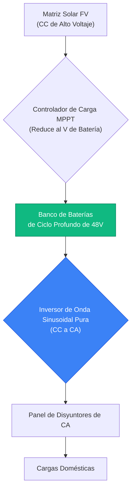

# La Calculadora de Inversores Definitiva: Dimensionamiento, Selección de Voltaje de CC y Sistemas Híbridos Solares

Bienvenido a la **Calculadora de Inversores** definitiva y la guía completa de ingeniería de electrónica de potencia. Ya sea que sea un propietario fuera de la red diseñando un sistema de batería híbrida solar, un entusiasta de RV que convierte $12\text{V}$ de CC para encender un microondas, o un ingeniero de instalaciones que intenta dimensionar una matriz masiva de respaldo de emergencia de $48\text{V}$, comprender la física del inversor es absolutamente crítico.

Un inversor es el corazón tecnológico latiente de cualquier sistema moderno de baterías o energía solar. Realiza la tarea compleja de alta frecuencia de convertir la Corriente Continua (CC) pura de un banco de baterías en Corriente Alterna (CA) suave y utilizable requerida por los electrodomésticos. Si subdimensiona su inversor, el compresor de su refrigerador se detendrá y se sobrecalentará durante el arranque. Si selecciona el voltaje del sistema de CC incorrecto ($12\text{V}$ en lugar de $48\text{V}$), sus cables de cobre se derretirán bajo la enorme carga de amperaje.

En esta exhaustiva clase magistral de SEO de más de 4.000 palabras, deconstruiremos las diferencias fundamentales entre las tecnologías de Onda Sinusoidal Pura y Onda Sinusoidal Modificada, expondremos los peligros ocultos de las sobretensiones de arranque de los electrodomésticos, probaremos matemáticamente por qué los sistemas de CC de $48\text{V}$ son inmensamente superiores a los sistemas de CC de $12\text{V}$ para cargas grandes, y decodificaremos la ingeniería requerida para dimensionar una matriz híbrida solar. Para garantizar una comprensión absoluta, hemos incluido cinco diagramas interactivos de Mermaid.js meticulosamente detallados y seguros para el analizador (parser).

---

## 1. La Física del Dimensionamiento del Inversor (Watts vs VA vs Factor de Potencia)

El concepto absolutamente más crítico en la ingeniería de inversores es entender por qué las cargas eléctricas tienen dos clasificaciones de potencia diferentes: **Watts (W)** y **Voltio-Amperios (VA)**, y cómo esto se relaciona con el **Factor de Potencia (PF)**.

1. **Potencia Real (Watts):** Esto representa el trabajo real que se está realizando. Una tostadora de $1000\text{W}$ realiza exactamente $1000\text{W}$ de trabajo de calentamiento.
2. **Potencia Aparente (VA):** Esto representa la demanda eléctrica total colocada en el puente de silicio del inversor. Debido a la física de la corriente alterna, las cargas inductivas (como los motores de CA y los compresores de refrigeradores) obligan al inversor a empujar y jalar potencia reactiva "fantasma".

**La Ecuación del Factor de Potencia:**
$$\text{Factor de Potencia (PF)} = \frac{\text{Potencia Real (Watts)}}{\text{Potencia Aparente (VA)}}$$

Por lo tanto:
$$\text{Potencia Aparente (VA)} = \frac{\text{Watts}}{\text{Factor de Potencia}}$$

**¿Por qué Importa Esto?**
Los inversores están clasificados por su capacidad de Potencia Aparente (VA o kVA).
- Si conecta un calentador resistivo de $1500\text{W}$ ($1.0\text{ PF}$) a un inversor de $2000\text{VA}$, consume $1500\text{VA}$. El inversor maneja esto sin esfuerzo.
- Si conecta una bomba de agua antigua de $1500\text{W}$ ($0.65\text{ PF}$) exactamente al mismo inversor de $2000\text{VA}$, exige $2307\text{VA}$ ($1500 / 0.65$). El inversor se sobrecargará y se apagará, a pesar de que el "Wattaje" aparentemente está por debajo del límite.

---

## 2. El Peligro de las Sobretensiones de Arranque Inductivas

Cuando calcula la carga total de su equipo, no puede simplemente sumar el vataje de funcionamiento de sus electrodomésticos. Debe diseñar para **Sobretensiones de Corriente de Arranque (Inrush Current Surges)**.

Los motores eléctricos, bombas de agua, compresores de aire acondicionado y compresores de refrigeradores extraen sobretensiones masivas de corriente en el milisegundo exacto en que se encienden para superar la inercia física.
- Un **refrigerador** que funciona a $150\text{W}$ puede extraer una sobretensión violenta de $1200\text{W}$ por un segundo cuando el compresor se enciende.
- Un **aire acondicionado de 1.5 HP** que funciona a $1200\text{W}$ puede extraer una sobretensión de $4000\text{W}$.

Si la "Capacidad de Sobretensión Máxima" de su inversor no puede manejar este pico de fracción de segundo, el inversor disparará instantáneamente sus circuitos de protección internos, cortando la energía de toda su casa. Siempre dimensione la capacidad de sobretensión de su inversor para superar cómodamente al motor individual más grande que arranque en su hogar.

---

## 3. Desmitificando los Voltajes del Sistema de CC: 12V vs 24V vs 48V

El error más común cometido por los entusiastas del bricolaje fuera de la red es intentar ejecutar una carga masiva de $3000\text{W}$ en un banco de baterías de CC de $12\text{V}$. Este es un error de ingeniería catastrófico.

Para producir $3000\text{W}$ de potencia de CA, el inversor debe extraer $3000\text{W}$ del banco de baterías de CC.
Usando la Ley de Watt ($I = P / V$), calculemos el consumo de corriente de CC a diferentes voltajes del sistema, asumiendo una eficiencia del inversor del $90\%$:

- **A $12\text{V}$ de CC:** $3000\text{W} / (12\text{V} \times 0.90) = \mathbf{277\text{ Amperios}}$.
- **A $24\text{V}$ de CC:** $3000\text{W} / (24\text{V} \times 0.90) = \mathbf{138\text{ Amperios}}$.
- **A $48\text{V}$ de CC:** $3000\text{W} / (48\text{V} \times 0.90) = \mathbf{69\text{ Amperios}}$.

**¿Por qué son peligrosos 277 Amperios a 12V?**
Empujar $277\text{ Amperios}$ requiere cables de cobre más gruesos que su pulgar ($4/0\text{ AWG}$). Si usa cable estándar, la corriente extrema generará cantidades masivas de calor $I^2R$, derritiendo el aislamiento, causando un peligro de incendio y desperdiciando valiosa energía de la batería como pérdida térmica.
Al subir a un sistema de $48\text{V}$, la corriente cae en un $75\%$, permitiendo un cableado más delgado, económico y seguro.

---

## 4. Onda Sinusoidal Pura vs. Onda Sinusoidal Modificada

Los inversores generan potencia de CA al cambiar rápidamente la potencia de CC de un lado a otro. La calidad de este cambio crea la "Forma de onda".

1. **Onda Sinusoidal Modificada:** El inversor produce una onda cuadrada escalonada en bloques. Es económico de fabricar. Funciona bien para cargas resistivas como bombillas incandescentes y calentadores simples. Sin embargo, si conecta un refrigerador, ventilador o fuente de alimentación de computadora con PFC activo a un inversor de onda sinusoidal modificada, el electrodoméstico zumbará fuertemente, se sobrecalentará y eventualmente sufrirá un daño permanente en el motor.
2. **Onda Sinusoidal Pura:** El inversor utiliza modulación por ancho de pulsos (PWM) avanzada de alta frecuencia y filtrado LC para producir una onda sinusoidal rodante perfectamente suave que imita perfectamente la energía de la red municipal. Esto es estrictamente requerido para electrónica sensible moderna, máquinas CPAP médicas y motores de inducción de CA.

---

## 5. Inversores Solares Híbridos y Matrices Fuera de la Red

Un **Inversor Solar Híbrido** moderno es en realidad tres dispositivos distintos agrupados en un solo chasis:
1. **Controlador de Carga Solar MPPT:** Optimiza el voltaje de CC bruto de los paneles solares y carga el banco de baterías.
2. **Inversor de CC a CA:** Convierte la CC de la batería en CA doméstica.
3. **Rectificador de CA a CC / Interruptor de Transferencia:** Puede tomar energía de CA de la red (o un generador) para cargar las baterías durante días nublados y cambiar instantáneamente las cargas entre energía solar, de batería y de red.

Al dimensionar una matriz solar para un inversor híbrido, los ingenieros utilizan la **Relación CC/CA**:
$$\text{Relación CC/CA} = \frac{\text{Total de Watts CC de Panel Solar}}{\text{Clasificación de Salida CA del Inversor}}$$
Una relación de $1.15$ a $1.25$ es óptima. Este "sobrepanelamiento" garantiza que el inversor funcione a su máxima capacidad más temprano en la mañana y más tarde en la tarde, maximizando la generación diaria de kWh.

---

## 6. Cinco Escenarios Conceptuales de Ingeniería con Visualizaciones 2D

Para dominar completamente las relaciones físicas que rigen los sistemas de inversores, exploraremos cinco escenarios de ingeniería distintos desglosados visualmente utilizando diagramas interactivos personalizados de Mermaid.js.

### Ejemplo 1: La Topografía Central del Inversor

**El Escenario:**
El propietario de una cabaña fuera de la red necesita comprender el flujo físico básico de energía desde su banco de baterías, a través de la electrónica del inversor, hasta sus electrodomésticos.

**Visualización 2D:**
Este diagrama de flujo lógico mapea el proceso de conversión de alto nivel, demostrando cómo la CC de bajo voltaje se eleva y se invierte en CA de alto voltaje.

---

### Ejemplo 2: La Crisis de Consumo de Corriente 12V vs 48V

**El Escenario:**
Un aficionado al bricolaje quiere extraer $2000\text{W}$ de un banco de baterías y no puede decidir si conectar sus baterías para $12\text{V}$ o $48\text{V}$.

**Las Matemáticas:**
La corriente es inversamente proporcional al Voltaje. A $12\text{V}$, extraer $2000\text{W}$ (con un $90\%$ de eficiencia) resulta en unos aterradores $185\text{ Amperios}$. A $48\text{V}$, son unos altamente manejables $46\text{ Amperios}$.

**Visualización 2D:**
Este gráfico traza la brutal realidad del consumo de corriente de CC a través de diferentes voltajes del sistema, demostrando por qué $48\text{V}$ es obligatorio para configuraciones de toda la casa fuera de la red.

---

### Ejemplo 3: La Trampa de la Sobretensión de Arranque del Refrigerador

**El Escenario:**
Un propietario compra un inversor económico de $500\text{W}$ para hacer funcionar su refrigerador de $150\text{W}$ durante un apagón. El inversor se dispara instantáneamente y emite una alarma de sobrecarga.

**Las Matemáticas:**
Si bien el vataje de funcionamiento continuo es de solo $150\text{W}$, el motor del compresor requiere una sobretensión instantánea de $1200\text{W}$ para romper la inercia física. El inversor de $500\text{W}$ se sobrecargó violentamente en un $240\%$.

**Visualización 2D:**
Este gráfico prueba gráficamente la necesidad de dimensionar un inversor en función de la capacidad de sobretensión máxima en lugar de la capacidad de funcionamiento continuo.

---

### Ejemplo 4: Arquitectura Solar Híbrida Fuera de la Red

**El Escenario:**
Un instalador solar está diseñando un sistema de energía completamente fuera de la red que cuenta con paneles solares, un controlador de carga MPPT, un banco de baterías y un inversor de CA.

**Visualización 2D:**
Este diagrama de flujo de arriba hacia abajo mapea el flujo multidireccional de energía en un Sistema Solar Híbrido, demostrando cómo el banco de baterías actúa como el depósito de energía central.

---

### Ejemplo 5: El Ciclo Diario Solar / Batería

**El Escenario:**
Un propietario fuera de la red necesita comprender cómo se genera y consume energía a lo largo de un ciclo de 24 horas.

**Visualización 2D:**
Este diagrama de Gantt visualiza el ciclo de energía diario, demostrando cómo la generación solar debe cubrir las cargas diurnas Y recargar simultáneamente el banco de baterías para sobrevivir a la larga y oscura noche.

```mermaid
gantt
    title Ciclo de Energía Fuera de la Red de 24 Horas
    dateFormat  HH:mm
    axisFormat  %H:%M
    
    section Generación Solar
    Aumento Matutino de FV :active, 07:00, 4h
    Pico de Producción Solar (Carga) :crit, 11:00, 4h
    Reducción Vespertina de FV :active, 15:00, 4h
    
    section Estado de Batería
    Descarga (Carga Nocturna) :done, 00:00, 8h
    Carga (Superávit Solar) :active, 08:00, 8h
    Descarga (Carga de la Tarde) :done, 16:00, 8h
```

---

## 7. Conclusión y Reto de Ingeniería

Dominar el dimensionamiento de inversores es la base fundamental de toda la ingeniería de energía fuera de la red, marina y de respaldo de emergencia. Comprender la relación inversa entre el voltaje y la corriente de CC, respetar la brutal realidad de las sobretensiones de arranque inductivas y elegir la tecnología de Onda Sinusoidal Pura sobre las ondas cuadradas modificadas garantizará que su sistema de energía funcione sin problemas durante décadas.

Si ignora estos principios matemáticos, sus cables de CC se derretirán bajo cargas de $12\text{V}$, sus refrigeradores se detendrán y se quemarán con ondas sinusoidales modificadas, y su inversor se disparará continuamente durante los arranques del aire acondicionado.

Para garantizar que ha dominado estos conceptos críticos, inicie nuestro Simulador interactivo e intente resolver estos desafíos finales:
1. **La Trampa del Amperaje:** Necesita hacer funcionar un horno eléctrico de $4000\text{W}$. Si usa un banco de baterías de $12\text{V}$ (asumiendo una eficiencia del inversor del $85\%$), ¿exactamente cuántos amperios de corriente de CC fluirán a través de sus cables?
2. **El Cálculo de Sobretensión:** Desea operar una bomba de agua de $1.0\text{ HP}$ ($750\text{W}$ continuos) y un televisor de $200\text{W}$ simultáneamente. Suponiendo que la bomba tiene una sobretensión de arranque de $3.0\times$, ¿cuál es la clasificación mínima absoluta de sobretensión que debe tener su inversor?
3. **El Cálculo Solar:** Tiene un inversor de $5000\text{VA}$. Quiere una relación CC/CA de $1.20$. ¿Cuántos Watts de paneles solares debería instalar en su techo?

Confíe en esta calculadora para auditar sus diseños de cabañas fuera de la red, justificar matemáticamente la actualización a una arquitectura de $48\text{V}$ y eliminar permanentemente las fallas por sobrecarga del inversor.
