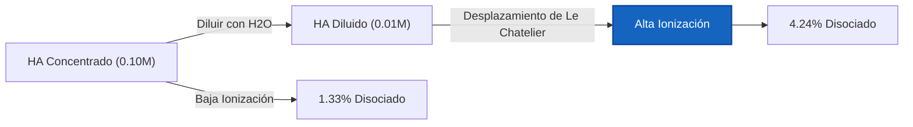

# Guía de Química Analítica y de Laboratorio para Ka y Equilibrio de Ácidos Débiles

En química analítica, física y biológica, la **constante de disociación ácida** ($K_a$) mide la fuerza cuantitativa de un ácido débil en solución acuosa:

$$K_a = \frac{[\text{H}^+][\text{A}^-]}{[\text{HA}]} \quad \iff \quad \text{p}K_a = -\log_{10}(K_a)$$

$$x^2 + K_a x - K_a C = 0 \quad \implies \quad [\text{H}^+] = \frac{-K_a + \sqrt{K_a^2 + 4 K_a C}}{2}$$

$$\text{Porcentaje de Ionización} = \frac{[\text{H}^+]_{\text{eq}}}{C_{\text{inicial}}} \times 100\% \le 5\% \quad (\text{Regla de Aproximación del 5\%})$$

---

## 1. Matriz de Referencia de Constantes de Disociación de Ácidos Débiles Comunes

| Ácido Débil | Fórmula | $K_a$ ($25^\circ\text{C}$) | $\text{p}K_a$ | Porcentaje de Ionización ($0.10\,\text{M}$) |
| :--- | :--- | :--- | :--- | :--- |
| **Ácido Tricloroacético** | $\text{CCl}_3\text{COOH}$ | **$3.0 \cdot 10^{-1}$** | **$0.52$** | $\sim 80\%$ |
| **Ácido Fórmico** | $\text{HCOOH}$ | **$1.8 \cdot 10^{-4}$** | **$3.75$** | $\sim 4.2\%$ |
| **Ácido Benzoico** | $\text{C}_6\text{H}_5\text{COOH}$ | **$6.3 \cdot 10^{-5}$** | **$4.20$** | $\sim 2.5\%$ |
| **Ácido Acético** | $\text{CH}_3\text{COOH}$ | **$1.8 \cdot 10^{-5}$** | **$4.76$** | $\sim 1.3\%$ |
| **Ácido Cianhídrico** | $\text{HCN}$ | **$6.2 \cdot 10^{-10}$** | **$9.21$** | $\sim 0.008\%$ |

---

## 2. Protocolos de Cálculo de $K_a$ Estándar

```
1. Ka a partir del pH: x = 10^(-pH), Ka = x^2 / (C - x)
2. Ka a partir de [H+]: x = [H+], Ka = x^2 / (C - x)
3. Ka a partir del % de Ionización: x = (% / 100) * C, Ka = x^2 / (C - x)
4. Ka a partir de pKa: Ka = 10^(-pKa)
5. Concentraciones de Equilibrio a partir de Ka: Resolver cuadrática x^2 + Ka*x - Ka*C = 0
```

---

## 3. Descargo de Responsabilidad de Seguridad de Laboratorio y Educativa
*Esta calculadora de Ka proporciona cálculos de equilibrio teóricos para aplicaciones educativas, de investigación de laboratorio y química AP. Las soluciones no ideales concentradas a altas fuerzas iónicas deben tener en cuenta los coeficientes de actividad utilizando las ecuaciones de Debye-Hückel o Pitzer.*

## 4. La Guía Completa de Disociación Ácida ($K_a$) y Tablas ICE

Bienvenido a la guía definitiva sobre la Constante de Disociación Ácida ($K_a$). En el ámbito de la química acuosa, no todos los ácidos son creados iguales. Mientras que los ácidos fuertes abandonan imprudentemente todos sus protones en el momento en que tocan el agua, los ácidos débiles son cautelosos. Establecen un delicado equilibrio termodinámico (un equilibrio) donde solo una fracción de sus moléculas se disocia.

Comprender, calcular y predecir esta fracción exacta es el núcleo de la química analítica, la farmacología y la ciencia ambiental. La clave matemática de esta predicción es el valor $K_a$, que dicta estrictamente la proporción de equilibrio de las moléculas de ácido rotas frente a las moléculas de ácido intactas.

En este manual técnico exhaustivo de más de 4000 palabras, desmitificaremos por completo la termodinámica de la disociación de ácidos débiles, desglosaremos la construcción de las tablas ICE (Inicial, Cambio, Equilibrio), estableceremos los límites matemáticos exactos de la "Regla del 5%" y analizaremos cinco ejemplos químicos rigurosos del mundo real, completos con derivaciones algebraicas paso a paso y diagramas visuales Mermaid.

### 4.1 ¿Qué es $K_a$ (La Constante de Disociación Ácida)?

Cuando un ácido genérico débil ($\text{HA}$) se disuelve en agua, experimenta una reacción reversible:
$$ \text{HA (aq)} \rightleftharpoons \text{H}^+\text{(aq)} + \text{A}^-\text{(aq)} $$

Debido a que esta reacción es reversible, finalmente alcanza un estado de equilibrio dinámico donde la tasa directa de disociación coincide exactamente con la tasa inversa de recombinación. La **Constante de Disociación Ácida ($K_a$)** es la proporción matemática estricta de los productos frente a los reactivos en este estado exacto de equilibrio:

$$ K_a = \frac{[\text{H}^+][\text{A}^-]}{[\text{HA}]} $$

Esta simple fracción nos dice todo sobre la fuerza del ácido:
*   **$K_a$ grande:** El numerador (productos) es grande. El ácido es relativamente fuerte y se disocia en gran medida.
*   **$K_a$ pequeño:** El denominador (ácido intacto) es grande. El ácido es muy débil y prefiere permanecer entero.

### 4.2 Conversión entre $K_a$ y $\text{p}K_a$

Debido a que los valores de $K_a$ suelen ser números de notación científica muy pequeños e incómodos (por ejemplo, $1.8 \times 10^{-5}$), los químicos los convierten universalmente en una escala logarítmica conocida como $\text{p}K_a$.

$$ \text{p}K_a = -\log_{10}(K_a) \quad \text{y} \quad K_a = 10^{-\text{p}K_a} $$

**La Regla de Oro de la Fuerza Ácida:** Debido al logaritmo negativo, la relación se invierte. Un $\text{p}K_a$ **menor** significa un ácido débil **más fuerte**. Por ejemplo, el Ácido Fórmico ($\text{p}K_a = 3.75$) es más fuerte que el Ácido Acético ($\text{p}K_a = 4.76$).

### 4.3 La Anatomía de una Tabla ICE

Una **Tabla ICE** (Inicial, Cambio, Equilibrio) es la herramienta de contabilidad fundamental utilizada para resolver problemas de disociación de ácidos débiles.

Supongamos que comenzamos con una concentración inicial ($C$) del ácido débil $\text{HA}$ y cero productos.
Sea $x$ la molaridad desconocida de $\text{HA}$ que se disocia con éxito.

| Especies | $\text{HA}$ | $\text{H}^+$ | $\text{A}^-$ |
| :--- | :--- | :--- | :--- |
| **I**nicial | $C$ | $0$ | $0$ |
| **C**ambio | $-x$ | $+x$ | $+x$ |
| **E**quilibrio | $C - x$ | $x$ | $x$ |

Al insertar la fila inferior de "Equilibrio" en nuestra expresión de $K_a$, generamos la ecuación maestra:
$$ K_a = \frac{x \cdot x}{C - x} = \frac{x^2}{C - x} $$

### 4.4 La Regla del 5% y la Ecuación Cuadrática

Para encontrar el pH final, debemos despejar $x$ (que es $[\text{H}^+]$). Reordenando la ecuación maestra se obtiene una cuadrática:
$$ x^2 + K_a x - K_a C = 0 $$

Históricamente, antes de las computadoras y las calculadoras en línea, a los estudiantes se les enseñaba a usar la **Aproximación de x pequeña** para evitar la fórmula cuadrática. Si el ácido es muy débil ($K_a$ pequeño), entonces la cantidad que se disocia ($x$) es tan diminuta en comparación con $C$ que podemos pretender que $(C - x) \approx C$.
Esto simplifica las matemáticas maravillosamente a:
$$ x = \sqrt{K_a \cdot C} $$

**La Regla del 5%:** Esta aproximación solo es matemáticamente válida si la $x$ final calculada es menor al 5% de la concentración inicial $C$. Si la ionización excede el 5%, la aproximación crea errores analíticos inaceptables y se debe utilizar la fórmula cuadrática exacta:
$$ x = \frac{-K_a + \sqrt{K_a^2 - 4(1)(-K_a C)}}{2} $$

Nuestra Calculadora de $K_a$ siempre utiliza el solucionador cuadrático exacto para garantizar la precisión, independientemente de si se cumple o no la regla del 5%.

---

## 5. Guía de Uso: Dominando la Calculadora de Ka

Nuestra herramienta funciona de forma bidireccional: puede ingresar un $K_a$ para encontrar el pH resultante, o ingresar datos de pH experimentales para determinar el $K_a$ de un ácido desconocido.

### 5.1 Modo: Calcular el pH a partir de un $K_a$ conocido

1.  **Seleccione el Modo:** Elija "Concentraciones de Equilibrio a partir de Ka".
2.  **Parámetros de Entrada:** Ingrese la Concentración Inicial ($C$) y el $K_a$ (o $\text{p}K_a$) conocido de su ácido.
3.  **Salida de Lectura:** La calculadora genera la tabla ICE completa, ejecuta el solucionador cuadrático exacto y emite el pH final, el $[\text{H}^+]$ exacto y el porcentaje de ionización.

### 5.2 Modo: Descubrir un $K_a$ desconocido a partir de datos de pH

1.  **Seleccione el Modo:** Elija "Ka a partir del pH".
2.  **Parámetros de Entrada:** Ingrese la Concentración Inicial ($C$) del ácido que preparó en el laboratorio y el pH final que midió con su medidor de pH.
3.  **Ejecutar:** La herramienta calcula de manera inversa $x$ ($[\text{H}^+] = 10^{-\text{pH}}$) y lo introduce directamente en la fórmula $K_a = x^2 / (C - x)$ para revelar la identidad del ácido.

### 5.3 Modo: Porcentaje de Ionización

1.  **Seleccione el Modo:** Elija "Ka a partir del porcentaje de ionización".
2.  **Parámetros de Entrada:** Ingrese la Concentración Inicial ($C$) y el porcentaje del ácido que se ionizó.
3.  **Ejecutar:** La herramienta calcula $x$ tomando ese porcentaje de $C$, y luego resuelve para el $K_a$.

---

## 6. Cinco Ejemplos Conceptuales del Mundo Real

Apliquemos estos marcos matemáticos a escenarios de química analítica del mundo real, con desgloses algebraicos paso a paso.

### Ejemplo 1: Encontrar Ka a partir de Datos de pH de Laboratorio

**Escenario:** 
Una investigadora sintetiza un nuevo ácido monoprótico débil. Ella crea una solución de $0.250\text{ M}$ del mismo en el laboratorio y mide el pH con una sonda calibrada. El pH es de 3.45. ¿Cuál es el $K_a$ y el $\text{p}K_a$ de este nuevo ácido?

**Derivación Matemática:**

1.  **Calcular $x$ ($[\text{H}^+]$) a partir del pH:**
    $$ [\text{H}^+] = 10^{-\text{pH}} $$
    $$ x = 10^{-3.45} = 3.55 \times 10^{-4}\text{ M} $$
2.  **Establecer Variables ICE:**
    $[\text{H}^+] = x = 3.55 \times 10^{-4}\text{ M}$
    $[\text{A}^-] = x = 3.55 \times 10^{-4}\text{ M}$
    $[\text{HA}] = C - x = 0.250 - (3.55 \times 10^{-4}) = 0.2496\text{ M}$
3.  **Calcular $K_a$:**
    $$ K_a = \frac{x^2}{C - x} $$
    $$ K_a = \frac{(3.55 \times 10^{-4})^2}{0.2496} $$
    $$ K_a = \frac{1.26 \times 10^{-7}}{0.2496} = 5.05 \times 10^{-7} $$
4.  **Calcular $\text{p}K_a$:**
    $$ \text{p}K_a = -\log_{10}(5.05 \times 10^{-7}) = 6.30 $$

**Conclusión:** El ácido recién sintetizado tiene un $K_a$ de $5.05 \times 10^{-7}$ y un $\text{p}K_a$ de 6.30.

### Ejemplo 2: El pH Cuadrático Exacto del Ácido Acético

**Escenario:**
Calcule el pH exacto de una solución de $0.100\text{ M}$ de Ácido Acético ($\text{CH}_3\text{COOH}$). El $K_a$ es $1.80 \times 10^{-5}$.

**Derivación Matemática:**

1.  **Establecer la Ecuación Cuadrática:**
    $$ x^2 + K_a x - K_a C = 0 $$
    $$ x^2 + (1.80 \times 10^{-5})x - (1.80 \times 10^{-5})(0.100) = 0 $$
    $$ x^2 + 1.80 \times 10^{-5}x - 1.80 \times 10^{-6} = 0 $$
2.  **Resolver usando la Fórmula Cuadrática:**
    $$ x = \frac{-1.80 \times 10^{-5} + \sqrt{(1.80 \times 10^{-5})^2 - 4(1)(-1.80 \times 10^{-6})}}{2} $$
    $$ x = \frac{-1.80 \times 10^{-5} + \sqrt{3.24 \times 10^{-10} + 7.20 \times 10^{-6}}}{2} $$
    $$ x = 1.33 \times 10^{-3}\text{ M } [\text{H}^+] $$
3.  **Calcular el pH:**
    $$ \text{pH} = -\log_{10}(1.33 \times 10^{-3}) = 2.88 $$

**Conclusión:** El pH de la solución de ácido acético de $0.100\text{ M}$ es 2.88.

### Ejemplo 3: Porcentaje de Ionización y Dilución

**Escenario:**
Tomando el ácido acético de $0.100\text{ M}$ del Ejemplo 2 ($[\text{H}^+] = 1.33 \times 10^{-3}\text{ M}$). Calculemos su porcentaje de ionización. Luego, de acuerdo con la Ley de Dilución de Ostwald, si diluimos el ácido, el porcentaje de ionización debería *aumentar*. Vamos a demostrarlo.

**Derivación Matemática:**

1.  **Calcular el % de Ionización inicial (a $0.100\text{ M}$):**
    $$ \% \text{ Ionizado} = \left(\frac{1.33 \times 10^{-3}}{0.100}\right) \times 100 = 1.33\% $$
2.  **Diluir por 10x (Nuevo $C = 0.010\text{ M}$):**
    Usando la aproximación de x pequeña para mayor velocidad: $x \approx \sqrt{K_a \cdot C} = \sqrt{(1.8 \times 10^{-5})(0.010)} = 4.24 \times 10^{-4}\text{ M}$
3.  **Calcular el nuevo % de Ionización (a $0.010\text{ M}$):**
    $$ \% \text{ Ionizado} = \left(\frac{4.24 \times 10^{-4}}{0.010}\right) \times 100 = 4.24\% $$

**Conclusión:** Al diluir el ácido 10 veces, el porcentaje de ionización se más que triplicó (de 1.33% a 4.24%). Esto demuestra físicamente el Principio de Le Chatelier: diluir la solución añade agua, lo que desplaza el equilibrio hacia el lado con más partículas acuosas (los productos disociados) para compensar la pérdida de concentración.

**Visualización: Ley de Dilución de Ostwald**



*Este diagrama de flujo visualiza la Ley de Dilución de Ostwald: a medida que disminuye la concentración, el equilibrio termodinámico se ve forzado a desplazarse hacia la derecha, aumentando agresivamente el porcentaje de moléculas que se disocian.*

### Ejemplo 4: Cuando la Regla del 5% Falla Catastróficamente

**Escenario:**
Calcule la $[\text{H}^+]$ de una solución muy diluida de $0.0050\text{ M}$ de Ácido Cloroacético, un ácido débil relativamente fuerte con un $K_a$ de $1.4 \times 10^{-3}$. Compare la Aproximación de x pequeña con la Cuadrática Exacta.

**Derivación Matemática (Aproximación de x pequeña):**

1.  **Asumir que $C - x \approx C$:**
    $$ x = \sqrt{K_a \cdot C} $$
    $$ x = \sqrt{(1.4 \times 10^{-3})(0.0050)} $$
    $$ x = \sqrt{7.0 \times 10^{-6}} = 2.65 \times 10^{-3}\text{ M H}^+ $$
2.  **Comprobar la Regla del 5%:**
    $$ \% \text{ Ionizado} = \left(\frac{2.65 \times 10^{-3}}{0.0050}\right) \times 100 = 53\% $$
    La regla se rompe violentamente (53% $\gg$ 5%). La aproximación es completamente inválida.

**Derivación Matemática (Cuadrática Exacta):**

1.  **Utilizar la Cuadrática completa:**
    $$ x^2 + (1.4 \times 10^{-3})x - 7.0 \times 10^{-6} = 0 $$
2.  **Resolver usando la Fórmula Cuadrática:**
    $$ x = 2.05 \times 10^{-3}\text{ M H}^+ $$

**Conclusión:** La aproximación dedujo $2.65 \times 10^{-3}\text{ M}$, mientras que la verdadera respuesta exacta es $2.05 \times 10^{-3}\text{ M}$. La aproximación causó un error masivo del **29%** en la concentración de iones de hidrógeno.

### Ejemplo 5: Aproximaciones de Ácidos Polipróticos ($K_{a1}$ vs $K_{a2}$)

**Escenario:**
El ácido fosfórico ($\text{H}_3\text{PO}_4$) es un ácido triprótico, lo que significa que libera 3 protones en etapas.
$K_{a1} = 7.5 \times 10^{-3}$
$K_{a2} = 6.2 \times 10^{-8}$
Al calcular el pH de una solución de $0.10\text{ M}$ de Ácido Fosfórico, ¿necesitamos calcular los tres pasos?

**Derivación Matemática:**

1.  **Comparar $K_{a1}$ y $K_{a2}$:**
    La primera constante de disociación ($7.5 \times 10^{-3}$) es aproximadamente **100,000 veces mayor** que la segunda ($6.2 \times 10^{-8}$).
2.  **La Regla Poliprótica:**
    Debido a que el primer protón se desprende mucho más fácil que el segundo, prácticamente el 100% de los iones $\text{H}^+$ en el vaso de precipitados provienen del primer paso de disociación. La contribución del segundo paso es matemáticamente invisible.
3.  **Cálculo:**
    Simplemente trata al ácido fosfórico como un ácido monoprótico utilizando solo $K_{a1}$.
    $$ x^2 + (7.5 \times 10^{-3})x - 7.5 \times 10^{-4} = 0 $$
    $$ x = 0.0239\text{ M H}^+ \implies \text{pH} = 1.62 $$

**Visualización: Pasos de Disociación Poliprótica**

```mermaid
gantt
    title Dominio Termodinámico de Ka1 en Ácidos Polipróticos
    dateFormat  HH:mm:ss
    axisFormat  %H:%M
    section Paso 1 (Ka1)
    H3PO4 => H+ + H2PO4- :crit, 00:00:00, 00:15:00
    section Paso 2 (Ka2)
    H2PO4- => H+ + HPO4(2-) :active, 00:15:00, 00:16:00
    section Paso 3 (Ka3)
    HPO4(2-) => H+ + PO4(3-) :00:16:00, 00:16:10
```



*Este cronograma de Gantt ilustra cómo $K_{a1}$ domina completamente el proceso de disociación, generando la gran mayoría de los protones y haciendo que los pasos subsiguientes sean insignificantes.*

---

## 7. Preguntas Frecuentes Detalladas y Solución de Problemas Avanzada

**P: ¿Puede un ácido débil tener un $K_a$ mayor que 1?**
**R:** Técnicamente, sí, aunque rara vez los llamamos "débiles" en ese punto. Los ácidos con un $K_a > 1$ (lo que significa que los productos son favorecidos sobre los reactivos) generalmente se clasifican como Ácidos Fuertes. Por ejemplo, se estima que el $K_a$ del Ácido Clorhídrico ($\text{HCl}$) es de alrededor de $1.3 \times 10^6$. El equilibrio se encuentra tan a la derecha que el $[\text{HA}]$ intacto es efectivamente cero.

**P: ¿Por qué existe la Regla del 5% si puede causar errores?**
**R:** Antes de las computadoras, resolver ecuaciones cuadráticas con notación científica decimal a mano era increíblemente tedioso y propenso a errores. La regla del 5% fue un compromiso pragmático para ahorrar tiempo a los estudiantes y técnicos de laboratorio. Hoy en día, nuestras calculadoras resuelven instantáneamente la cuadrática exacta, haciendo obsoleta la aproximación.

**P: ¿Cambia el $K_a$ si añado más ácido?**
**R:** No. $K_a$ es una constante termodinámica estricta. No cambia con la concentración ni el volumen. Lo único que puede cambiar el valor físico de $K_a$ es cambiar la **Temperatura** de la solución.

Al comprender profundamente los mecanismos termodinámicos detrás de las tablas ICE, los valores de $K_a$ y las derivaciones cuadráticas exactas, posee el poder teórico para predecir el pH y la especiación de cualquier electrolito débil que exista. ¡Confíe siempre en esta Calculadora de $K_a$ para eludir las peligrosas aproximaciones de "x pequeña" y garantizar la perfección analítica!
