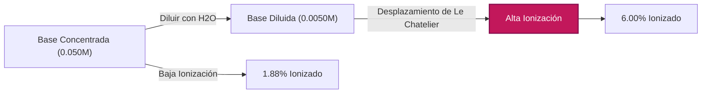

# Guía de Química Analítica y de Laboratorio para Kb y Equilibrio de Base Débil

En química analítica, física y farmacéutica, la **constante de disociación básica** ($K_b$) mide la fuerza cuantitativa de una base débil en solución acuosa:

$$K_b = \frac{[\text{BH}^+][\text{OH}^-]}{[\text{B}]} \quad \iff \quad \text{p}K_b = -\log_{10}(K_b)$$

$$K_a \times K_b = K_w \quad \iff \quad \text{p}K_a + \text{p}K_b = \text{p}K_w \quad (14.00 \text{ a } 25^\circ\text{C})$$

$$x^2 + K_b x - K_b C = 0 \quad \implies \quad [\text{OH}^-] = \frac{-K_b + \sqrt{K_b^2 + 4 K_b C}}{2}$$

$$\text{Porcentaje de Ionización} = \frac{[\text{OH}^-]_{\text{eq}}}{C_{\text{inicial}}} \times 100\% \le 5\% \quad (\text{Regla de Aproximación del 5\%})$$

---

## 1. Matriz de Referencia de Constantes de Disociación de Bases Débiles Comunes

| Base Débil | Fórmula | $K_b$ ($25^\circ\text{C}$) | $\text{p}K_b$ | $\text{p}K_a$ del Ácido Conjugado | Porcentaje de Ionización ($0.10\,\text{M}$) |
| :--- | :--- | :--- | :--- | :--- | :--- |
| **Etilamina** | $\text{C}_2\text{H}_5\text{NH}_2$ | **$5.6 \cdot 10^{-4}$** | **$3.25$** | **$10.75$** | $\sim 7.2\%$ |
| **Metilamina** | $\text{CH}_3\text{NH}_2$ | **$4.4 \cdot 10^{-4}$** | **$3.36$** | **$10.64$** | $\sim 6.4\%$ |
| **Amoníaco** | $\text{NH}_3$ | **$1.8 \cdot 10^{-5}$** | **$4.75$** | **$9.25$** | $\sim 1.3\%$ |
| **Piridina** | $\text{C}_5\text{H}_5\text{N}$ | **$1.7 \cdot 10^{-9}$** | **$8.77$** | **$5.23$** | $\sim 0.013\%$ |
| **Anilina** | $\text{C}_6\text{H}_5\text{NH}_2$ | **$4.3 \cdot 10^{-10}$** | **$9.37$** | **$4.63$** | $\sim 0.0065\%$ |

---

## 2. Protocolos Estándar de Cálculo de $K_b$

```
1. Kb a partir de pOH: x = 10^(-pOH), Kb = x^2 / (C - x)
2. Kb a partir de pH: pOH = pKw - pH, x = 10^(-pOH), Kb = x^2 / (C - x)
3. Kb a partir de [OH-]: x = [OH-], Kb = x^2 / (C - x)
4. Kb a partir de Ka Conjugado: Kb = Kw / Ka & pKb = pKw - pKa
5. Concentraciones de Equilibrio a partir de Kb: Resolver cuadrática x^2 + Kb*x - Kb*C = 0
```

---

## 3. Descargo de Responsabilidad de Seguridad de Laboratorio y Educativa
*Esta calculadora de Kb proporciona cálculos de equilibrio teóricos para aplicaciones educativas, de investigación de laboratorio y de química AP. Soluciones no ideales concentradas con altas fuerzas iónicas deberían dar cuenta de los coeficientes de actividad usando ecuaciones de Debye-Hückel o Pitzer.*

## 4. La Guía Completa de Disociación de Bases ($K_b$) y Tablas ICE

Bienvenido a la guía definitiva sobre la Constante de Disociación Básica ($K_b$). Al aprender sobre equilibrios ácido-base, gran parte de la atención se centra injustamente en los ácidos. Sin embargo, comprender las bases débiles — como el amoníaco, aminas farmacéuticas y alcaloides biológicos — es discutiblemente aún más crítico para la medicina, el diseño de medicamentos y los sistemas de amortiguamiento fisiológicos.

Cuando se agrega una base débil al agua, no se desmorona simplemente. En su lugar, ataca activamente a las moléculas de agua, robando un protón para formar un ácido conjugado y dejando un ión hidróxido ($\text{OH}^-$). Debido a que la base es "débil", carece de la fuerza termodinámica para robar protones de *cada* molécula de agua, resultando en un estado delicado de equilibrio químico.

En este manual técnico masivo de más de 4000 palabras, decodificaremos completamente la termodinámica del equilibrio de base débil, exploraremos la relación matemática inversa exacta entre pares $K_a$ y $K_b$ conjugados, estableceremos los límites estrictos de la "Regla del 5%", y caminaremos por cinco ejemplos rigurosos de química analítica del mundo real con derivaciones algebraicas paso a paso y diagramas visuales Mermaid.

### 4.1 ¿Qué es $K_b$ (La Constante de Disociación Básica)?

Cuando se disuelve una base genérica débil ($\text{B}$) en agua, reacciona de acuerdo con la siguiente ecuación reversible:
$$ \text{B (aq)} + \text{H}_2\text{O (l)} \rightleftharpoons \text{BH}^+\text{(aq)} + \text{OH}^-\text{(aq)} $$

Una vez que esta reacción alcanza el equilibrio dinámico (donde la tasa directa de robo de protones iguala la tasa inversa de retorno de protones), definimos su posición termodinámica usando la **Constante de Disociación Básica ($K_b$)**:

$$ K_b = \frac{[\text{BH}^+][\text{OH}^-]}{[\text{B}]} $$

*(Nota: El agua es un solvente líquido puro y su concentración es efectivamente constante, por lo que se excluye estrictamente de la expresión de equilibrio.)*

El valor de $K_b$ nos dice de inmediato la fuerza de la base:
*   **$K_b$ grande:** El numerador es grande. La base es relativamente fuerte y produce con éxito una gran cantidad de $\text{OH}^-$.
*   **$K_b$ pequeño:** El denominador es grande. La base es muy débil y la mayor parte permanece en su forma neutral $\text{B}$.

### 4.2 Convirtiendo entre $K_b$ y $\text{p}K_b$

Al igual que con $K_a$, las constantes de disociación de base suelen ser números extremadamente pequeños (ej., $1.8 \times 10^{-5}$ para Amoníaco). Para hacer los cálculos manejables, los químicos usan la escala logarítmica $\text{p}K_b$.

$$ \text{p}K_b = -\log_{10}(K_b) \quad \text{y} \quad K_b = 10^{-\text{p}K_b} $$

**La Regla de Oro de la Fuerza de la Base:** Debido al logaritmo negativo, un $\text{p}K_b$ **menor** equivale a una base débil **más fuerte**. Por ejemplo, la Metilamina ($\text{p}K_b = 3.36$) es más fuerte que el Amoníaco ($\text{p}K_b = 4.75$).

### 4.3 La Relación $K_a \times K_b = K_w$ (Pares Conjugados)

Esta es indiscutiblemente la regla termodinámica más importante en toda la química ácido-base: **La fuerza de una base débil es inversamente proporcional a la fuerza de su ácido conjugado.**

Si conoce el $K_a$ de un ácido, sabe instantáneamente el $K_b$ de su base conjugada a través de la constante de autoionización del agua ($K_w$):
$$ K_a \times K_b = K_w = 1.0 \times 10^{-14} \quad (\text{a } 25^\circ\text{C}) $$
$$ \text{p}K_a + \text{p}K_b = \text{p}K_w = 14.00 $$

Si tiene un ácido débil moderadamente fuerte, su base conjugada será increíblemente débil. Por el contrario, un ácido increíblemente débil tendrá una base conjugada relativamente fuerte.

### 4.4 La Anatomía de una Tabla ICE para Bases Débiles

Una **Tabla ICE** (Inicial, Cambio, Equilibrio) es el método estándar para resolver problemas de disociación de bases débiles.

Comencemos con una concentración inicial ($C$) de la base débil $\text{B}$, y asumamos que las concentraciones iniciales del producto son cero. Sea $x$ la molaridad desconocida de $\text{B}$ que reacciona con éxito con el agua.

| Especie | $\text{B}$ | $\text{BH}^+$ | $\text{OH}^-$ |
| :--- | :--- | :--- | :--- |
| **I**nicial | $C$ | $0$ | $0$ |
| **C**ambio | $-x$ | $+x$ | $+x$ |
| **E**quilibrio | $C - x$ | $x$ | $x$ |

Sustituir la fila "Equilibrio" en nuestra expresión de $K_b$ da como resultado la ecuación maestra:
$$ K_b = \frac{x \cdot x}{C - x} = \frac{x^2}{C - x} $$

### 4.5 La Regla del 5% y la Ecuación Cuadrática

Para encontrar el $\text{pOH}$ final (y por lo tanto el pH), debemos resolver para $x$ (que es $[\text{OH}^-]$). Esto se reorganiza en una cuadrática:
$$ x^2 + K_b x - K_b C = 0 $$

Para ahorrar tiempo, los químicos a menudo utilizan la **Aproximación de x-Pequeña**. Si $K_b$ es muy pequeño, asumimos que la cantidad que se disocia ($x$) es insignificante comparada con $C$, significando $(C - x) \approx C$. La ecuación se simplifica a:
$$ x = \sqrt{K_b \cdot C} $$

**La Regla del 5%:** Esta aproximación solo es matemáticamente permitida si la $x$ calculada es menor al 5% de la concentración inicial $C$. Si la ionización es mayor al 5%, la fórmula cuadrática exacta DEBE ser utilizada para evitar errores inaceptables:
$$ x = \frac{-K_b + \sqrt{K_b^2 - 4(1)(-K_b C)}}{2} $$

Nuestra Calculadora de $K_b$ nunca utiliza la aproximación de x-pequeña. Ejecuta el resolvedor cuadrático exacto el 100% del tiempo para garantizar absoluta precisión.

---

## 5. Guía de Uso: Dominando la Calculadora Kb

Nuestra herramienta opera bidireccionalmente: puede introducir un $K_b$ para predecir el pH resultante, o introducir datos experimentales de pH/pOH para realizar ingeniería inversa del $K_b$ de una base desconocida.

### 5.1 Modo: Calcular pH a partir de un $K_b$ conocido

1.  **Seleccionar Modo:** Elija "Concentraciones de Equilibrio a partir de Kb".
2.  **Ingresar Parámetros:** Ingrese la Concentración Inicial ($C$) y el $K_b$ (o $\text{p}K_b$) conocido de su base débil.
3.  **Leer Salida:** La calculadora genera la tabla ICE completa, ejecuta el resolvedor cuadrático exacto para $[\text{OH}^-]$, y devuelve el $\text{pOH}$ final, pH de equilibrio, $[\text{OH}^-]$ exacto, y Porcentaje de Ionización.

### 5.2 Modo: Descubriendo un $K_b$ desconocido a partir de datos de pH

1.  **Seleccionar Modo:** Elija "Kb a partir de pH".
2.  **Ingresar Parámetros:** Ingrese la Concentración Inicial ($C$) de la base, y el pH final que midió.
3.  **Ejecutar:** La herramienta primero convierte su pH en pOH ($\text{pOH} = 14 - \text{pH}$). Calcula a la inversa $x$ ($[\text{OH}^-] = 10^{-\text{pOH}}$) y lo sustituye directamente en la fórmula $K_b = x^2 / (C - x)$ para revelar la identidad de la base.

### 5.3 Modo: Porcentaje de Ionización

1.  **Seleccionar Modo:** Elija "Kb a partir de Porcentaje de Ionización".
2.  **Ingresar Parámetros:** Ingrese la Concentración Inicial ($C$) y el porcentaje de la base que se ionizó.
3.  **Ejecutar:** La herramienta calcula $x$ tomando ese porcentaje de $C$, y luego resuelve para el $K_b$.

---

## 6. Cinco Ejemplos Conceptuales del Mundo Real

Apliquemos estos marcos matemáticos a escenarios de laboratorio del mundo real, completos con desgloses algebraicos paso a paso.

### Ejemplo 1: Encontrando Kb a partir de Datos de pH de Laboratorio

**Escenario:**
Un farmacólogo crea una solución de $0.150\text{ M}$ de una amina biológica desconocida (una base débil) y mide el pH con una sonda calibrada. El pH es 11.20. ¿Cuál es el $K_b$ y $\text{p}K_b$ de esta amina?

**Derivación Matemática:**

1.  **Calcular pOH a partir de pH:**
    $$ \text{pOH} = 14.00 - \text{pH} = 14.00 - 11.20 = 2.80 $$
2.  **Calcular $x$ ($[\text{OH}^-]$) a partir de pOH:**
    $$ [\text{OH}^-] = 10^{-\text{pOH}} $$
    $$ x = 10^{-2.80} = 1.58 \times 10^{-3}\text{ M} $$
3.  **Establecer Variables ICE:**
    $[\text{OH}^-] = x = 1.58 \times 10^{-3}\text{ M}$
    $[\text{BH}^+] = x = 1.58 \times 10^{-3}\text{ M}$
    $[\text{B}] = C - x = 0.150 - (1.58 \times 10^{-3}) = 0.1484\text{ M}$
4.  **Calcular $K_b:**
    $$ K_b = \frac{x^2}{C - x} $$
    $$ K_b = \frac{(1.58 \times 10^{-3})^2}{0.1484} $$
    $$ K_b = \frac{2.51 \times 10^{-6}}{0.1484} = 1.69 \times 10^{-5} $$
5.  **Calcular $\text{p}K_b:**
    $$ \text{p}K_b = -\log_{10}(1.69 \times 10^{-5}) = 4.77 $$

**Conclusión:** La amina desconocida tiene un $K_b$ de $1.69 \times 10^{-5}$, lo que significa que probablemente sea amoníaco ($\text{NH}_3$).

### Ejemplo 2: El pH Cuadrático Exacto del Amoníaco

**Escenario:**
Calcule el pH exacto de una solución de $0.050\text{ M}$ de Amoníaco ($\text{NH}_3$). El $K_b$ es $1.80 \times 10^{-5}$.

**Derivación Matemática:**

1.  **Configurar la Ecuación Cuadrática:**
    $$ x^2 + K_b x - K_b C = 0 $$
    $$ x^2 + (1.80 \times 10^{-5})x - (1.80 \times 10^{-5})(0.050) = 0 $$
    $$ x^2 + 1.80 \times 10^{-5}x - 9.00 \times 10^{-7} = 0 $$
2.  **Resolver mediante Fórmula Cuadrática:**
    $$ x = \frac{-1.80 \times 10^{-5} + \sqrt{(1.80 \times 10^{-5})^2 - 4(1)(-9.00 \times 10^{-7})}}{2} $$
    $$ x = 9.39 \times 10^{-4}\text{ M } [\text{OH}^-] $$
3.  **Calcular pOH y pH:**
    $$ \text{pOH} = -\log_{10}(9.39 \times 10^{-4}) = 3.03 $$
    $$ \text{pH} = 14.00 - 3.03 = 10.97 $$

**Conclusión:** El pH de la solución de amoníaco $0.050\text{ M}$ es exactamente 10.97.

### Ejemplo 3: Porcentaje de Ionización y Dilución de Bases

**Escenario:**
Usando el amoníaco $0.050\text{ M}$ del Ejemplo 2 ($[\text{OH}^-] = 9.39 \times 10^{-4}\text{ M}$). Calculemos su porcentaje de ionización. Luego, según la Ley de Dilución de Ostwald, si diluimos la base agregando agua pura, el porcentaje de ionización debería *aumentar*.

**Derivación Matemática:**

1.  **Calcular el % de Ionización inicial (a $0.050\text{ M}$):**
    $$ \% \text{ Ionizado} = \left(\frac{9.39 \times 10^{-4}}{0.050}\right) \times 100 = 1.88\% $$
2.  **Diluir por 10x (Nuevo $C = 0.0050\text{ M}$):**
    Usando la aprox. de x pequeña por velocidad: $x \approx \sqrt{K_b \cdot C} = \sqrt{(1.8 \times 10^{-5})(0.0050)} = 3.00 \times 10^{-4}\text{ M}$
3.  **Calcular nuevo % de Ionización (a $0.0050\text{ M}$):**
    $$ \% \text{ Ionizado} = \left(\frac{3.00 \times 10^{-4}}{0.0050}\right) \times 100 = 6.00\% $$

**Conclusión:** Al diluir la base 10 veces, el porcentaje de ionización aumentó del 1.88% a más del 6.00%. Al igual que con los ácidos, diluir una base débil fuerza al equilibrio a desplazarse hacia la derecha para producir más partículas disociadas.

**Visualización: Ley de Dilución de Ostwald para Bases**



*Este diagrama de flujo visualiza la Ley de Dilución de Ostwald para bases: a medida que cae la concentración, el equilibrio termodinámico se desplaza hacia la derecha, aumentando enormemente el porcentaje de moléculas que reaccionan con el agua.*

### Ejemplo 4: El Subibaja Conjugado $K_a \times K_b$

**Escenario:**
Necesita encontrar el $K_b$ de la base Piridina ($\text{C}_5\text{H}_5\text{N}$). Revisa un libro de texto, pero la tabla solo enumera el $K_a$ de su ácido conjugado, el ión Piridinio ($\text{C}_5\text{H}_5\text{NH}^+$), que es $K_a = 5.9 \times 10^{-6}$.

**Derivación Matemática:**

1.  **Utilizar la Fórmula de Autoionización Conjugada:**
    $$ K_a \times K_b = K_w $$
2.  **Resolver para $K_b$:**
    $$ K_b = \frac{K_w}{K_a} $$
    $$ K_b = \frac{1.0 \times 10^{-14}}{5.9 \times 10^{-6}} = 1.7 \times 10^{-9} $$
3.  **Resolver para $\text{p}K_b$:**
    $$ \text{p}K_b = -\log_{10}(1.7 \times 10^{-9}) = 8.77 $$

**Conclusión:** El $K_b$ de la Piridina es $1.7 \times 10^{-9}$. Dado que el ión Piridinio es un ácido moderadamente débil, su Piridina conjugada es una base increíblemente débil.

### Ejemplo 5: Cuando la Regla del 5% Falla Catastróficamente para las Bases

**Escenario:**
Calcule el $[\text{OH}^-]$ de una solución muy diluida $0.0010\text{ M}$ de Etilamina, una base débil relativamente fuerte con un $K_b$ de $5.6 \times 10^{-4}$. Compare la Aproximación de x-Pequeña con la Cuadrática Exacta.

**Derivación Matemática (Aproximación de x-Pequeña):**

1.  **Asumir $C - x \approx C$:**
    $$ x = \sqrt{K_b \cdot C} $$
    $$ x = \sqrt{(5.6 \times 10^{-4})(0.0010)} $$
    $$ x = \sqrt{5.6 \times 10^{-7}} = 7.48 \times 10^{-4}\text{ M OH}^- $$
2.  **Comprobar la Regla del 5%:**
    $$ \% \text{ Ionizado} = \left(\frac{7.48 \times 10^{-4}}{0.0010}\right) \times 100 = 74.8\% $$
    La regla se rompe violentamente (75% $\gg$ 5%). La aproximación es completamente inválida.

**Derivación Matemática (Cuadrática Exacta):**

1.  **Usar la Cuadrática completa:**
    $$ x^2 + (5.6 \times 10^{-4})x - 5.6 \times 10^{-7} = 0 $$
2.  **Resolver mediante Fórmula Cuadrática:**
    $$ x = 5.17 \times 10^{-4}\text{ M OH}^- $$

**Conclusión:** La aproximación estimó $7.48 \times 10^{-4}\text{ M}$, mientras que la verdadera respuesta exacta es $5.17 \times 10^{-4}\text{ M}$. La aproximación causó un **error analítico masivo del 45%** en la concentración de hidróxido.

**Visualización: La Relación Conjugada Inversa**

```mermaid
gantt
    title Dominio de Fuerza Ácido-Base Conjugado
    dateFormat  HH:mm:ss
    axisFormat  %H:%M
    section HCl / Cl-
    Ácido Fuerte Ka >> 1 :crit, 00:00:00, 00:05:00
    Base Inútil Kb ~ 0 :00:00:00, 00:05:00
    section NH4+ / NH3
    Ácido Débil Ka (5e-10) :00:05:00, 00:10:00
    Base Débil Kb (2e-5) :active, 00:05:00, 00:10:00
```



*Esta línea de tiempo de Gantt traza la relación inversa de $K_a$ y $K_b$. Cuando el ácido es increíblemente fuerte (como $\text{HCl}$), la base conjugada ($\text{Cl}^-$) es tan débil que virtualmente no tiene basicidad. Cuando el ácido es débil (como $\text{NH}_4^+$), la base conjugada ($\text{NH}_3$) gana fuerza termodinámica funcional.*

---

## 7. Preguntas Frecuentes Detalladas y Resolución de Problemas Avanzada

**P: ¿Necesito incluir el Agua en la expresión de $K_b$?**
**R:** No. En soluciones acuosas diluidas, la concentración de agua es asombrosamente alta ($\sim 55.5\text{ M}$) y permanece efectivamente constante durante la reacción. Se integra matemáticamente en la constante $K_b$ en sí, por lo que nunca escribimos $[\text{H}_2\text{O}]$ en el denominador.

**P: ¿Puede una base débil tener un pH menor a 7?**
**R:** No, no si es lo único disuelto en el agua. Si disuelve cualquier base débil pura en agua pura, producirá $\text{OH}^-$ y elevará el pH por encima de 7.00. Sin embargo, si la base se agrega a un amortiguador ácido, la solución resultante puede tener un pH por debajo de 7.

**P: ¿Cambia $K_b$ si agrego más base?**
**R:** No. $K_b$ es una constante termodinámica estricta. No cambia con la concentración ni el volumen. Al igual que con $K_a$, lo único que puede cambiar el valor físico de $K_b$ es un cambio en la **Temperatura** de la solución.

Al comprender profundamente los mecanismos termodinámicos detrás de las tablas ICE, las relaciones de pares conjugados ($K_w = K_a \times K_b$) y las derivaciones cuadráticas exactas, posee el poder teórico para predecir el pH y la especiación de cualquier base débil existente. ¡Confíe siempre en esta Calculadora de $K_b$ para eludir las peligrosas aproximaciones de "x-pequeña" y garantizar la perfección analítica!
