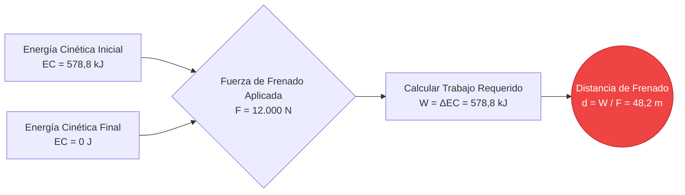
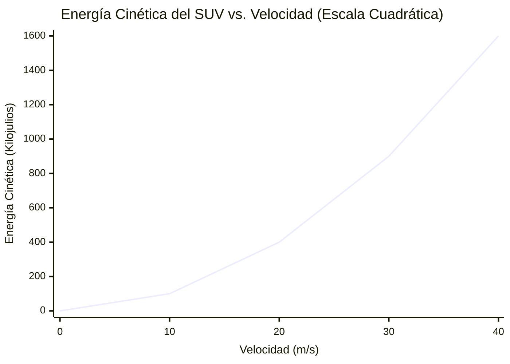
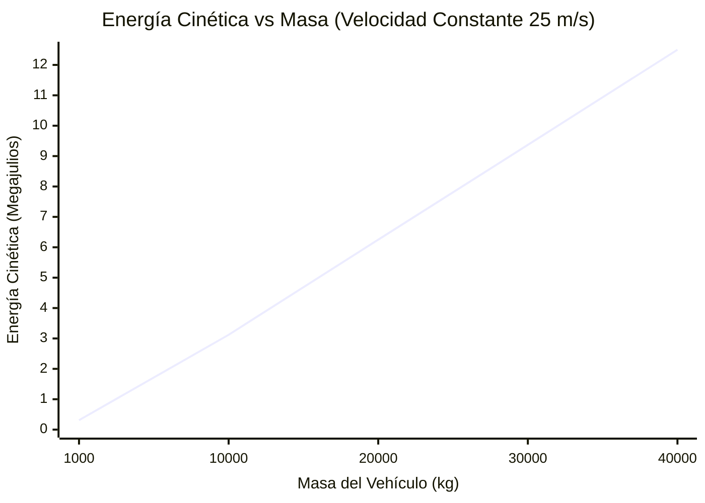
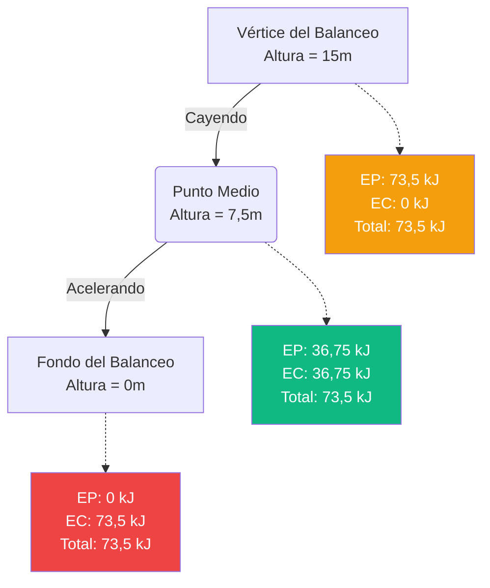

# La Calculadora de Energía Cinética Definitiva: Dominando la Física del Movimiento y el Impacto

Bienvenido a la **Calculadora de Energía Cinética** definitiva y a la guía completa de física. Ya sea que sea un ingeniero automotriz que diseña sistemas de frenado avanzados para disipar la energía de un choque, un científico planetario que modela cráteres de impactos de asteroides o un estudiante de física que se prepara para un examen final sobre el Teorema del Trabajo y la Energía, esta herramienta está diseñada para brindar precisión absoluta.

La energía cinética es la energía fundamental del movimiento. Es la razón por la que un glaciar que se mueve lentamente puede esculpir valles masivos durante milenios, y es la razón por la que una bala diminuta puede perforar el blindaje en una fracción de milisegundo.

En este análisis profundo de más de 4.000 palabras, deconstruiremos exhaustivamente la mecánica de la energía cinética ($EC = \frac{1}{2} m \cdot v^2$). Exploraremos los fundamentos matemáticos del Teorema del Trabajo y la Energía, analizaremos las diferencias críticas entre el momento lineal y la energía cinética cuadrática, y lo guiaremos a través de cinco ejemplos de ingeniería del mundo real visualizados con diagramas detallados de Mermaid.js.

---

## 1. La Física de la Energía Cinética: Energía en Movimiento

En la física clásica, la **Energía** se define simplemente como la capacidad de realizar un trabajo. El trabajo se realiza cuando se aplica una fuerza a un objeto, lo que hace que se mueva a lo largo de una distancia.

La **Energía Cinética** (de la palabra griega *kinesis*, que significa movimiento) es el tipo específico de energía que posee un objeto puramente porque se está moviendo. Si un objeto tiene masa y se mueve en relación con el marco de referencia de un observador, posee energía cinética.

### La Fórmula Central ($EC = \frac{1}{2} m \cdot v^2$)
La energía cinética de traslación ($EC$) de cualquier objeto se calcula usando la mitad de su masa ($m$) multiplicada por el cuadrado de su velocidad ($v$).

$$ EC = \frac{1}{2} m \cdot v^2 $$

Donde:
- **$EC$** = Energía Cinética (medida en Julios, $J$)
- **$m$** = Masa (medida en kilogramos, $kg$)
- **$v$** = Velocidad (medida en metros por segundo, $m/s$)

### La Naturaleza Cuadrática de la Velocidad
El aspecto más crítico de esta ecuación, y el concepto que causa mayor confusión tanto a los estudiantes de física como a los conductores, es que la energía cinética es **cuadrática** con respecto a la velocidad, no lineal.

- Si duplica la masa de un automóvil en movimiento, duplica su energía cinética ($2 \times 1 = 2$).
- Si duplica la **velocidad** de un automóvil en movimiento, **cuadruplica** su energía cinética ($2^2 = 4$).
- Si triplica la velocidad, la energía cinética aumenta en un factor de nueve ($3^2 = 9$).

Esta escala exponencial es la razón por la que los accidentes automovilísticos a alta velocidad son exponencialmente más devastadores que los choques a baja velocidad, y por la que las multas por exceso de velocidad escalan de manera tan agresiva.

### Cantidades Escalares vs. Vectoriales
A diferencia de la Fuerza ($F = ma$) y el Momento ($p = mv$), que son **vectores** (lo que significa que tienen una dirección específica como "Norte" o "Arriba"), la Energía Cinética es una cantidad **escalar**.

Una cantidad escalar solo tiene una magnitud. Un automóvil de $1.500\text{ kg}$ que se mueve hacia el Este a $30\text{ m/s}$ tiene exactamente la misma energía cinética que un automóvil idéntico que se mueve hacia el Oeste a $30\text{ m/s}$. Además, debido a que la velocidad está al cuadrado ($v^2$), incluso si ingresa una velocidad negativa en la ecuación, la energía cinética resultante siempre será positiva. La energía cinética no puede ser negativa; un objeto la tiene ($v > 0$) o no la tiene ($v = 0$).

---

## 2. El Teorema del Trabajo y la Energía

Para darle a un objeto energía cinética, debe acelerarlo. Para acelerarlo, debe aplicar una fuerza a lo largo de una distancia. Este proceso se llama realizar **Trabajo** ($W = F \cdot d$).

El **Teorema del Trabajo y la Energía** une elegantemente las Leyes del Movimiento de Newton con las Leyes de la Termodinámica. Establece:
> *El trabajo neto realizado sobre un objeto por una fuerza neta externa es igual al cambio en la energía cinética del objeto.*

$$ W_{neto} = \Delta EC = EC_{final} - EC_{inicial} $$

Si empuja un carrito de compras estacionario con $50\text{ N}$ de fuerza sobre una distancia de $10\text{ metros}$, ha realizado $500\text{ Julios}$ de trabajo en el carrito. Suponiendo que no haya fricción, el carrito ahora posee exactamente $500\text{ Julios}$ de energía cinética.

Por el contrario, para detener un objeto en movimiento, se debe realizar un trabajo negativo (como la fricción de las pastillas de freno). Los frenos deben hacer exactamente el trabajo negativo suficiente para cancelar la energía cinética inicial del automóvil.

---

## 3. Conservación de la Energía Mecánica

La energía cinética es la mitad de la ecuación de la **Energía Mecánica**. La otra mitad es la **Energía Potencial** ($EP$), que es energía almacenada basada en la posición de un objeto (como una roca asentada en el borde de un acantilado).

La **Ley de Conservación de la Energía Mecánica** dicta que en un sistema aislado (ignorando la fricción, la resistencia del aire y la pérdida de calor), la energía mecánica total permanece perfectamente constante. La energía simplemente se transforma de un lado a otro entre los estados potencial y cinético.

$$ EC_{inicial} + EP_{inicial} = EC_{final} + EP_{final} $$

### La Analogía de la Montaña Rusa
Imagine un vagón de montaña rusa sentado en la cima de una caída masiva.
1. **En el pico:** El vagón apenas se mueve. La Energía Cinética es casi nula, pero la Energía Potencial Gravitacional ($EP = mgh$) está en su punto máximo absoluto.
2. **A mitad de camino hacia abajo:** A medida que el vagón cae, pierde altura (perdiendo $EP$) pero gana velocidad (ganando $EC$). La energía total sigue siendo exactamente la misma.
3. **En la parte inferior:** El vagón está a nivel del suelo ($h = 0$, por lo que $EP = 0$). Toda la energía potencial almacenada se ha convertido en Energía Cinética máxima, lo que da como resultado la velocidad máxima.

---

## 4. Guía de Uso Completa: Maximizando la Calculadora

Nuestra Calculadora de Energía Cinética interactiva está construida para manejar cálculos simples de masa/velocidad, así como complejos problemas de física de ingeniería inversa.

### Paso 1: Cálculos Base
En la interfaz principal, seleccione lo que desea resolver:
- **Resolver para Energía Cinética (EC):** Ingrese la masa y la velocidad conocidas.
- **Resolver para Masa (m):** Ingrese la energía cinética y la velocidad conocidas para determinar qué tan pesado debe ser un objeto.
- **Resolver para Velocidad (v):** Ingrese la energía cinética y la masa conocidas para determinar qué tan rápido se mueve un objeto.

### Paso 2: Conversiones Inteligentes de Unidades
La calculadora cuenta con un robusto motor de conversión.
- Ingrese la masa en **Gramos**, **Libras**, **Onzas** o **Toneladas Métricas**.
- Ingrese la velocidad en **mph**, **km/h**, **nudos** o **Mach**.
- Vea la salida de energía en **Julios (J)**, **Kilojulios (kJ)**, **Megajulios (MJ)** estándar o equivalentes eléctricos como **Vatios-hora (Wh)** y **Kilovatios-hora (kWh)**.

### Paso 3: Interprete el Arco de Energía Logarítmico
La energía escala drásticamente. Una manzana que cae posee aproximadamente $1\text{ J}$ de energía cinética. Un avión comercial en vuelo posee más de $5.000.000.000\text{ J}$.
El **Medidor de Arco de Energía** radial categoriza su resultado logarítmicamente:
- **Micro-Escala (Verde):** Pelotas de béisbol, velocistas, objetos que caen.
- **Macro-Escala (Azul):** Automóviles de carretera, maquinaria industrial, trenes.
- **Mega-Escala (Rojo):** Aviones a reacción, cohetes orbitales, impactos de meteoritos.

---

## 5. Cinco Ejemplos Conceptuales de Ingeniería con Visualizaciones 2D

Para comprender verdaderamente cómo la energía cinética impacta en el mundo físico, exploremos cinco escenarios de ingeniería detallados, utilizando Mermaid.js para visualizar la física.

### Ejemplo 1: La Crisis de Frenado en la Carretera (Teorema del Trabajo y la Energía)

**El Escenario:**
Un sedán de $1.500\text{ kg}$ conduce por la carretera a $100\text{ km/h}$ ($27,78\text{ m/s}$). Un ciervo salta a la carretera y el conductor pisa los frenos. El sistema de frenado del automóvil y la fricción de los neumáticos pueden aplicar una fuerza de frenado máxima de $12.000\text{ N}$. ¿Cuál es la distancia mínima absoluta que necesita el automóvil para detenerse?

**Las Matemáticas:**
Primero, calcule la energía cinética inicial del automóvil:
$$ EC = 0,5 \cdot m \cdot v^2 = 0,5 \cdot 1.500 \cdot (27,78)^2 $$
$$ EC = 750 \cdot 771,73 = 578.797\text{ Julios (578,8 kJ)} $$

Para detener el automóvil, los frenos deben realizar $578.797\text{ J}$ de trabajo. Usando la ecuación de Trabajo ($W = F \cdot d$):
$$ d = \frac{W}{F} = \frac{578.797}{12.000} = 48,23\text{ metros} $$

El automóvil requiere poco más de 48 metros para patinar hasta detenerse.

**Visualización 2D:**
El árbol lógico a continuación ilustra el Teorema del Trabajo y la Energía en acción.



---

### Ejemplo 2: Energía Cinética vs. Velocidad (La Curva Cuadrática)

**El Escenario:**
Surge un debate sobre los límites de velocidad. Un conductor argumenta que conducir a $80\text{ mph}$ en lugar de $40\text{ mph}$ es solo "el doble de peligroso" porque solo van el doble de rápido. Usando un SUV estándar de $2.000\text{ kg}$, debemos calcular la energía cinética destructiva a varias velocidades para demostrar que están equivocados.

**Las Matemáticas:**
- A $20\text{ m/s}$ (~45 mph): $EC = 0,5 \cdot 2.000 \cdot (20)^2 = 400.000\text{ J (400 kJ)}$
- A $30\text{ m/s}$ (~67 mph): $EC = 0,5 \cdot 2.000 \cdot (30)^2 = 900.000\text{ J (900 kJ)}$
- A $40\text{ m/s}$ (~90 mph): $EC = 0,5 \cdot 2.000 \cdot (40)^2 = 1.600.000\text{ J (1,6 MJ)}$

**Visualización 2D:**
Este gráfico ilustra de forma dramática la aterradora realidad de la variable $v^2$. Duplicar la velocidad de $20\text{ m/s}$ a $40\text{ m/s}$ no duplicó la energía de choque; la cuadruplicó de $400\text{ kJ}$ a $1.600\text{ kJ}$.



---

### Ejemplo 3: Energía Cinética vs. Masa (Escala Lineal)

**El Escenario:**
Ahora comparemos dos vehículos diferentes que se mueven a la misma velocidad de $25\text{ m/s}$ (55 mph) en una carretera rural. El Vehículo A es un auto deportivo liviano de $1.000\text{ kg}$. El Vehículo B es un camión semirremolque cargado y masivo de $35.000\text{ kg}$. ¿Cuánta energía cinética poseen?

**Las Matemáticas:**
- Auto Deportivo: $EC = 0,5 \cdot 1.000 \cdot (25)^2 = 312.500\text{ J (312,5 kJ)}$
- Camión Semirremolque: $EC = 0,5 \cdot 35.000 \cdot (25)^2 = 10.937.500\text{ J (10,94 MJ)}$

Debido a que el camión es 35 veces más pesado, posee exactamente 35 veces más energía cinética.

**Visualización 2D:**
A diferencia de la velocidad, la masa escala de manera lineal. Este gráfico muestra la relación de línea recta entre masa y energía cuando la velocidad es constante.



---

### Ejemplo 4: Conservación de la Energía Mecánica (El Péndulo)

**El Escenario:**
Una bola de demolición masiva de $500\text{ kg}$ es levantada por una grúa a una altura de $15\text{ metros}$ sobre su punto de reposo más bajo. La grúa suelta la bola. ¿Cuál es la velocidad máxima absoluta de la bola de demolición en la parte inferior exacta de su balanceo?

**Las Matemáticas:**
En la parte superior del balanceo, la Velocidad = 0, lo que significa que $EC = 0$. Toda la energía se almacena como Energía Potencial Gravitacional ($EP = m \cdot g \cdot h$).
$$ EP_{arriba} = 500 \cdot 9,81 \cdot 15 = 73.575\text{ Julios} $$

Debido a la Ley de Conservación de la Energía Mecánica, en la parte inferior del balanceo ($h = 0$), los $73.575\text{ J}$ de energía potencial se han convertido perfectamente en Energía Cinética.
$$ EC_{abajo} = 73.575\text{ Julios} $$

Ahora, hagamos ingeniería inversa de la velocidad a partir de la ecuación de la $EC$:
$$ v = \sqrt{\frac{2 \cdot EC}{m}} $$
$$ v = \sqrt{\frac{2 \cdot 73.575}{500}} = \sqrt{\frac{147.150}{500}} = \sqrt{294,3} = 17,15\text{ m/s} $$

La bola de demolición golpea el objetivo a $17,15\text{ m/s}$ (~38 mph).

**Visualización 2D:**
Este diagrama de flujo demuestra cómo la energía mecánica total permanece constante mientras se transfiere suavemente entre estados.



---

### Ejemplo 5: Biomecánica del Swing de Golf (Tiempo de Transferencia Cinética)

**El Escenario:**
Un golfista profesional hace el swing con una cabeza de palo de $0,2\text{ kg}$ a $50\text{ m/s}$ (111 mph). El golfista impacta una pelota de golf estacionaria de $0,045\text{ kg}$. Necesitamos analizar la inmensa potencia de salida generada durante la duración microscópica del impacto.

**Las Matemáticas:**
Primero, ¿cuál es la energía cinética de la cabeza del palo justo antes del impacto?
$$ EC_{palo} = 0,5 \cdot 0,2 \cdot (50)^2 = 250\text{ Julios} $$

En una colisión altamente eficiente (aunque ligeramente inelástica), un gran porcentaje de esta energía se transfiere a la bola. Si la cabeza del palo se desacelera a $35\text{ m/s}$ después del impacto:
$$ EC_{palo\_después} = 0,5 \cdot 0,2 \cdot (35)^2 = 122,5\text{ Julios} $$

La diferencia ($250 - 122,5 = 127,5\text{ Julios}$) se transfiere. Sin embargo, esta transferencia de energía masiva ocurre en una duración de aproximadamente $0,0005\text{ segundos}$ (medio milisegundo).
La potencia se define como la tasa de transferencia de energía ($P = \frac{Energía}{Tiempo}$):
$$ Potencia = \frac{127,5\text{ J}}{0,0005\text{ s}} = 255.000\text{ Vatios (255 kW)} $$

Durante ese medio milisegundo, ¡el palo genera más potencia máxima que el motor de un auto deportivo de alto rendimiento!

**Visualización 2D:**
Este diagrama de Gantt visualiza la línea de tiempo microscópica de la transferencia de energía durante el swing de golf.

```mermaid
gantt
    title Transferencia de Energía Cinética (Impacto del Palo de Golf)
    dateFormat s
    axisFormat %S
    section Pre-Impacto
    Fase Aceleración del Palo (Generando 250J EC) :done, 0, 0.500s
    section Impacto
    Contacto Inicial & Compresión de Bola :crit, active, 0.500s, 0.5002s
    Transferencia de Energía (255kW Potencia Máx) :crit, active, 0.5002s, 0.5005s
    Lanzamiento de la Bola :milestone, 0.5005s, 0s
```

---

## 6. Análisis Profundo de Preguntas Frecuentes (FAQ)

**P: ¿Puede la energía cinética ser negativa?**
**R:** No, la energía cinética es estrictamente positiva. Debido a que la masa no puede ser negativa y el término de velocidad se eleva matemáticamente al cuadrado ($v^2$), incluso una velocidad negativa (moviéndose hacia atrás) da como resultado una salida de energía cinética positiva.

**P: ¿Cuál es la diferencia entre Energía Cinética y Momento?**
**R:** Este es el punto de confusión más común en física. Ambos dependen de la masa y la velocidad. El **Momento** ($p = m \cdot v$) es un *vector* y escala *linealmente* con la velocidad. Determina qué tan difícil es detener un objeto. La **Energía Cinética** ($EC = 0,5 \cdot m \cdot v^2$) es un *escalar* y escala de forma *cuadrática* con la velocidad. Determina cuánto trabajo destructivo hará un objeto cuando alcance un objetivo.

**P: ¿La energía cinética depende de su marco de referencia?**
**R:** Sí, absolutamente. Si está sentado en un tren bala que se mueve a $300\text{ km/h}$, su velocidad relativa al tren es cero, por lo que su energía cinética con respecto al tren es cero. Sin embargo, en relación con una persona parada afuera en el suelo, se está moviendo a $300\text{ km/h}$ y posee cantidades masivas de energía cinética.

**P: ¿Qué es la Energía Térmica en relación con la Energía Cinética?**
**R:** La energía térmica (calor) en realidad es solo energía cinética microscópica. Cuando mide la temperatura de una taza de agua, está midiendo la energía cinética de traslación promedio de las moléculas individuales de agua que vibran y rebotan dentro de la taza.

**P: ¿Qué sucede con la energía cinética en un accidente automovilístico?**
**R:** De acuerdo con la Primera Ley de la Termodinámica, la energía no se puede crear ni destruir. En un accidente automovilístico, la enorme energía cinética del vehículo no desaparece; se convierte rápidamente en otras formas de energía. Se destina al trabajo mecánico de doblar el acero (deformación), energía térmica (el metal en realidad se calienta mucho) y energía acústica (el fuerte estruendo del choque).

---

## 7. Conclusión y Desafío de Ingeniería

Los principios de la energía cinética dictan las reglas del movimiento en nuestro universo. Al comprender la relación cuadrática entre la velocidad y la energía, los ingenieros pueden fabricar autos más seguros, los astrofísicos pueden predecir el tamaño de los cráteres de meteoritos y los técnicos en energías renovables pueden maximizar la eficiencia de las turbinas eólicas.

Para dominar verdaderamente estos conceptos, utilice nuestra Calculadora de Energía Cinética para resolver los siguientes desafíos de física conceptual:
1. **El Cañón de Riel:** Un cañón de riel militar experimental dispara un proyectil de tungsteno de $10\text{ kg}$ a Mach 7 ($2.400\text{ m/s}$). Calcule la energía cinética en Megajulios. ¿Es esto más o menos energía que un camión de $2.000\text{ kg}$ que conduce a $100\text{ km/h}$?
2. **La Amenaza del Asteroide:** Un asteroide con una masa de $1.000.000\text{ kg}$ se precipita hacia la Tierra a $15.000\text{ m/s}$. Para desviarlo, los científicos quieren golpearlo con un impactador cinético. Si solo pueden construir un satélite de $500\text{ kg}$, ¿qué tan rápido debe golpear el satélite al asteroide para entregar $1,0\times10^{11}\text{ Julios}$ de contraenergía cinética?
3. **La Montaña Rusa:** Una montaña rusa de $1.200\text{ kg}$ llega a la cima de una colina de $50\text{ metros}$ de altura a una velocidad lenta de $2\text{ m/s}$. Utilizando la Ley de Conservación de la Energía Mecánica, calcule su velocidad máxima exacta cuando llega a la parte inferior de la caída ($h = 0$).

Experimente con el simulador, analice los gráficos cuadráticos y confíe en esta calculadora para iluminar las energías masivas que gobiernan el mundo físico que lo rodea.
