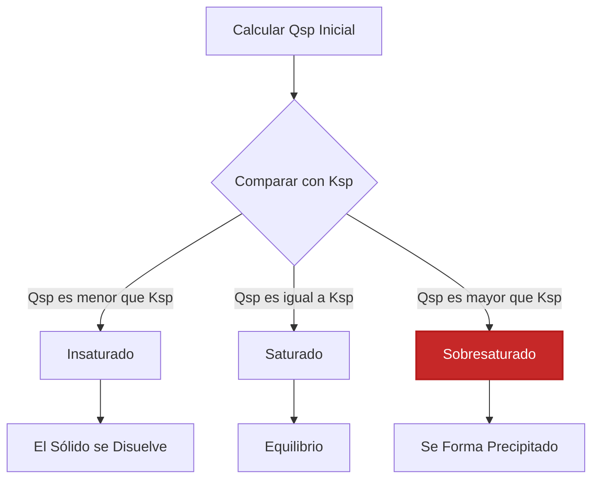

# Guía de Química Analítica y de Laboratorio sobre $K_{sp}$ y el Equilibrio de Solubilidad

En química analítica, ambiental y farmacéutica, la **constante del producto de solubilidad** ($K_{sp}$) mide la posición de equilibrio de un compuesto iónico poco soluble en agua:

$$\text{M}_m\text{X}_n(s) \rightleftharpoons m\text{M}^{n+}(aq) + n\text{X}^{m-}(aq) \quad \implies \quad K_{sp} = [\text{M}^{n+}]^m [\text{X}^{m-}]^n$$

$$\text{Solubilidad Molar } s \implies \begin{cases} \text{Sal 1:1 (AgCl): } & K_{sp} = s^2 \implies s = \sqrt{K_{sp}} \\ \text{Sal 1:2 / 2:1 (CaF}_2, \text{Ag}_2\text{CrO}_4): & K_{sp} = (s)(2s)^2 = 4s^3 \implies s = \sqrt[3]{\frac{K_{sp}}{4}} \\ \text{Sal 1:3 (Al(OH)}_3): & K_{sp} = (s)(3s)^3 = 27s^4 \implies s = \sqrt[4]{\frac{K_{sp}}{27}} \end{cases}$$

$$Q_{sp} = [\text{M}^{n+}]_{\text{inic}}^m [\text{X}^{m-}]_{\text{inic}}^n \quad \begin{cases} Q_{sp} < K_{sp} & \implies \text{Insaturado (Sin Precipitado)} \\ Q_{sp} = K_{sp} & \implies \text{Saturado (Equilibrio)} \\ Q_{sp} > K_{sp} & \implies \text{Sobresaturado (Precipita)} \end{cases}$$

$$\text{Solubilidad en Masa } (\text{g/L}) = s \, (\text{mol/L}) \times M \, (\text{g/mol})$$

---

## 1. Matriz de Referencia de Sales Poco Solubles Comunes

| Compuesto | Fórmula | Estequiometría | $K_{sp}$ ($25^\circ\text{C}$) | Solubilidad Molar $s$ ($\text{M}$) | Solubilidad en Masa ($\text{g/L}$) |
| :--- | :--- | :--- | :--- | :--- | :--- |
| **Cloruro de Plata** | $\text{AgCl}$ | **1:1** | **$1.77 \cdot 10^{-10}$** | **$1.33 \cdot 10^{-5}$** | **$0.00191$** |
| **Sulfato de Bario** | $\text{BaSO}_4$ | **1:1** | **$1.08 \cdot 10^{-10}$** | **$1.04 \cdot 10^{-5}$** | **$0.00243$** |
| **Fluoruro de Calcio** | $\text{CaF}_2$ | **1:2** | **$3.45 \cdot 10^{-11}$** | **$2.05 \cdot 10^{-4}$** | **$0.0160$** |
| **Yoduro de Plomo(II)** | $\text{PbI}_2$ | **1:2** | **$9.8 \cdot 10^{-9}$** | **$1.35 \cdot 10^{-3}$** | **$0.622$** |
| **Cromato de Plata** | $\text{Ag}_2\text{CrO}_4$ | **2:1** | **$1.12 \cdot 10^{-12}$** | **$6.54 \cdot 10^{-5}$** | **$0.0217$** |
| **Hidróxido de Aluminio**| $\text{Al(OH)}_3$ | **1:3** | **$1.3 \cdot 10^{-33}$** | **$2.63 \cdot 10^{-9}$** | **$2.05 \cdot 10^{-7}$** |

---

## 2. Protocolos de Cálculo Estándar de $K_{sp}$

```
1. Sol. a partir de Ksp (1:1): s = sqrt(Ksp)
2. Sol. a partir de Ksp (1:2 / 2:1): s = (Ksp / 4)^(1/3)
3. Sol. a partir de Ksp (1:3): s = (Ksp / 27)^(1/4)
4. Solubilidad en Masa: Sol. en Masa (g/L) = s (mol/L) * MasaMolar (g/mol)
5. Comparación Qsp: Comparar Qsp con Ksp (Qsp > Ksp -> Precipitado)
```

---

## 3. Descargo de Responsabilidad de Seguridad Educativa y de Laboratorio
*Esta calculadora de Ksp proporciona cálculos de equilibrio teórico para aplicaciones educativas, de investigación de laboratorio y de química AP. Las soluciones concentradas o las soluciones iónicas con electrolitos de fondo elevados deben considerar los coeficientes de actividad utilizando las ecuaciones de Debye-Hückel o Pitzer.*

## 4. La Guía Completa de la Constante del Producto de Solubilidad ($K_{sp}$)

Bienvenido a la guía definitiva sobre la **Constante del Producto de Solubilidad ($K_{sp}$)**. Un error común en la química introductoria es que los compuestos iónicos son "solubles" o "insolubles". En realidad, casi todos los compuestos iónicos se disuelven en agua en *cierta* medida. Incluso un sólido pesado y aparentemente impermeable como el Mármol endurecido ($\text{CaCO}_3$) se disolverá ligeramente, liberando cantidades microscópicas de iones $\text{Ca}^{2+}$ y $\text{CO}_3^{2-}$ hasta que se alcance el equilibrio dinámico.

En este manual técnico exhaustivo de más de 4000 palabras, decodificaremos por completo las matemáticas del equilibrio de solubilidad heterogéneo. Definiremos la relación estequiométrica entre $K_{sp}$ y la solubilidad molar ($s$), explicaremos por qué no se puede simplemente observar un valor de $K_{sp}$ para saber qué sal es más soluble, y profundizaremos en el Efecto del Ion Común. Finalmente, ejecutaremos cinco derivaciones matemáticas rigurosas paso a paso que cubren sales 1:1, 1:2 y 1:3, conversión de solubilidad en masa y predicción de precipitación utilizando el Cociente de Reacción ($Q_{sp}$).

### 4.1 ¿Qué es $K_{sp}$ (Constante del Producto de Solubilidad)?

Cuando un compuesto iónico sólido se disuelve en agua, se disocia en sus cationes y aniones acuosos constituyentes. Una vez que la solución se satura, se alcanza un estado de equilibrio dinámico: la velocidad a la que el sólido se disuelve es perfectamente igual a la velocidad a la que los iones disueltos se recombinan y precipitan como sólido.

Para una sal genérica poco soluble:
$$ \text{M}_m\text{X}_n(s) \rightleftharpoons m\text{M}^{n+}(aq) + n\text{X}^{m-}(aq) $$

La expresión de equilibrio para esta disolución es la **Constante del Producto de Solubilidad ($K_{sp}$)**:
$$ K_{sp} = [\text{M}^{n+}]^m [\text{X}^{m-}]^n $$

**REGLA CRÍTICA:** Observe que el reactivo sólido ($\text{M}_m\text{X}_n(s)$) se excluye completamente del denominador. Esto se debe a que los sólidos puros tienen una actividad termodinámica constante igual a 1. Su masa no afecta la concentración de los iones disueltos en el equilibrio.

### 4.2 Solubilidad Molar ($s$) vs $K_{sp}$

$K_{sp}$ es una constante adimensional que se aplica a una temperatura específica. Pero lo que los químicos generalmente desean saber es la **Solubilidad Molar ($s$)**: el número máximo de moles del sólido que se disolverá en un litro de agua.

La relación entre $s$ y $K_{sp}$ depende enteramente de la estequiometría de la sal:
*   **Sales 1:1 (ej., AgCl):** $s$ moles se disuelven para producir $s$ moles de $\text{Ag}^+$ y $s$ moles de $\text{Cl}^-$.
    $K_{sp} = (s)(s) = s^2 \implies s = \sqrt{K_{sp}}$
*   **Sales 1:2 o 2:1 (ej., $\text{CaF}_2$):** $s$ moles se disuelven para producir $s$ moles de $\text{Ca}^{2+}$ y $2s$ moles de $\text{F}^-$.
    $K_{sp} = (s)(2s)^2 = 4s^3 \implies s = \sqrt[3]{\frac{K_{sp}}{4}}$
*   **Sales 1:3 o 3:1 (ej., $\text{Al(OH)}_3$):** $s$ moles se disuelven para producir $s$ moles de $\text{Al}^{3+}$ y $3s$ moles de $\text{OH}^-$.
    $K_{sp} = (s)(3s)^3 = 27s^4 \implies s = \sqrt[4]{\frac{K_{sp}}{27}}$

**Por qué no se pueden comparar directamente los valores de $K_{sp}$:** Si desea saber qué sal es más soluble, solo puede comparar los $K_{sp}$ directamente si las sales comparten la misma estequiometría. Una sal 1:2 podría tener un $K_{sp}$ menor que una sal 1:1, pero en realidad tener una solubilidad molar $s$ *mayor* debido a las matemáticas de la raíz cúbica. ¡Siempre calcule $s$ para determinar la verdadera solubilidad!

### 4.3 Predicción de la Precipitación: El Cociente de Reacción ($Q_{sp}$)

Si mezcla dos soluciones transparentes juntas, ¿se formará un precipitado sólido? Predecimos esto calculando el **Cociente de Reacción ($Q_{sp}$)**. $Q_{sp}$ utiliza exactamente la misma fórmula que $K_{sp}$, pero introducimos las concentraciones *iniciales* de los iones mezclados antes de que haya ocurrido cualquier reacción.

Al comparar $Q_{sp}$ con $K_{sp}$:
*   **$Q_{sp} < K_{sp}$ (Insaturado):** La solución puede contener más iones. No se formará precipitado. Cualquier sólido existente continuará disolviéndose.
*   **$Q_{sp} = K_{sp}$ (Saturado):** La solución está perfectamente en equilibrio.
*   **$Q_{sp} > K_{sp}$ (Sobresaturado):** La concentración de iones es demasiado alta. El sistema se desplazará en reversa, y **SE FORMARÁ** un precipitado sólido hasta que $Q_{sp}$ disminuya para igualar a $K_{sp}$.

### 4.4 El Efecto del Ion Común (Le Chatelier en Acción)

El Efecto del Ion Común establece que añadir un ion que ya está involucrado en el equilibrio suprimirá drásticamente la solubilidad del sólido.

Si tiene una solución saturada de $\text{AgCl}$ y vierte $\text{NaCl}$ altamente soluble, la afluencia masiva de iones $\text{Cl}^-$ perturba violentamente el equilibrio. De acuerdo con el Principio de Le Chatelier, el sistema se desplaza hacia la izquierda para consumir el exceso de $\text{Cl}^-$, provocando que enormes cantidades de $\text{AgCl}(s)$ precipiten de la solución. La solubilidad de una sal siempre es mucho menor en una solución que contiene un ion común de lo que es en agua pura.

---

## 5. Guía de Uso: Dominando la Calculadora de Ksp

Nuestra Calculadora de Ksp es un conjunto completo de herramientas analíticas para la solubilidad.

### 5.1 Modo: Calcular Solubilidad a partir de $K_{sp}$

1.  **Seleccionar Modo:** Elija "Solubilidad Molar a partir de Ksp".
2.  **Seleccionar Sal:** Elija entre los preajustes (como $\text{CaF}_2$) o ingrese una estequiometría personalizada (como 1:2).
3.  **Entrada:** Ingrese el valor de $K_{sp}$.
4.  **Leer Salida:** La herramienta ejecuta instantáneamente el cálculo de la raíz algebraica ($s = \sqrt[3]{K_{sp}/4}$) y genera la Solubilidad Molar $s$, las concentraciones de iones en equilibrio, y la convierte en Solubilidad en Masa (g/L).

### 5.2 Modo: Predictor de Precipitación de Qsp

1.  **Seleccionar Modo:** Elija "Predictor de Precipitación de Qsp".
2.  **Entrada:** Ingrese el $K_{sp}$ objetivo, la estequiometría, y la concentración inicial del Catión y del Anión.
3.  **Ejecutar:** La herramienta calcula $Q_{sp}$, lo compara con $K_{sp}$, y declara si se formará un precipitado sólido.

### 5.3 Modo: Simulador del Efecto del Ion Común

1.  **Seleccionar Modo:** Elija "Efecto del Ion Común".
2.  **Entrada:** Ingrese el $K_{sp}$ y la concentración del ion común añadido (por ejemplo, $0.10\text{ M}$ de $\text{Cl}^-$ añadido).
3.  **Ejecutar:** La herramienta establece la expresión algebraica modificada de la tabla ICE, ignora el término '+s' insignificante mediante la aproximación de x pequeña, y calcula la solubilidad molar drásticamente reducida.

---

## 6. Cinco Ejemplos del Mundo Real de Química Analítica

Fundamentemos esta teoría en una realidad matemática absoluta resolviendo cinco escenarios de solubilidad clásicos y rigurosos.

### Ejemplo 1: La Sal 1:1 (Cloruro de Plata)

**Escenario:** 
El Cloruro de Plata ($\text{AgCl}$) es una sal poco soluble clásica utilizada en fotografía. Su $K_{sp}$ a $25^\circ\text{C}$ es $1.77 \times 10^{-10}$. Calcule su solubilidad molar en agua pura, y encuentre la concentración de iones $\text{Ag}^+$.

**Derivación Matemática:**

1.  **Ecuación de Equilibrio:**
    $\text{AgCl}(s) \rightleftharpoons \text{Ag}^+(aq) + \text{Cl}^-(aq)$
2.  **Definir Expresión de $K_{sp}$:**
    $K_{sp} = [\text{Ag}^+][\text{Cl}^-]$
3.  **Definir Solubilidad Molar ($s$):**
    Deje que $s$ sea la cantidad de $\text{AgCl}$ que se disuelve.
    $[\text{Ag}^+] = s$
    $[\text{Cl}^-] = s$
4.  **Sustituir y Resolver:**
    $1.77 \times 10^{-10} = (s)(s) = s^2$
    $s = \sqrt{1.77 \times 10^{-10}}$
    $s = 1.33 \times 10^{-5}\text{ M}$
5.  **Calcular Concentraciones de Iones:**
    $[\text{Ag}^+] = 1.33 \times 10^{-5}\text{ M}$

**Conclusión:** Solo $1.33 \times 10^{-5}$ moles de $\text{AgCl}$ se disolverán por litro de agua pura.

### Ejemplo 2: La Sal 1:2 (Fluoruro de Calcio)

**Escenario:**
El Fluoruro de Calcio ($\text{CaF}_2$) forma el mineral fluorita. Su $K_{sp}$ es $3.45 \times 10^{-11}$. Calcule su solubilidad molar y la concentración final de iones Fluoruro.

**Derivación Matemática:**

1.  **Ecuación de Equilibrio:**
    $\text{CaF}_2(s) \rightleftharpoons \text{Ca}^{2+}(aq) + 2\text{F}^-(aq)$
2.  **Definir Expresión de $K_{sp}$:**
    $K_{sp} = [\text{Ca}^{2+}][\text{F}^-]^2$
3.  **Definir Solubilidad Molar ($s$):**
    Por cada 1 mol de $\text{CaF}_2$ que se disuelve, se produce 1 mol de $\text{Ca}^{2+}$ y **2 moles** de $\text{F}^-$.
    $[\text{Ca}^{2+}] = s$
    $[\text{F}^-] = 2s$
4.  **Sustituir y Resolver:**
    $3.45 \times 10^{-11} = (s)(2s)^2$
    $3.45 \times 10^{-11} = 4s^3$
    $s^3 = 8.625 \times 10^{-12}$
    $s = \sqrt[3]{8.625 \times 10^{-12}}$
    $s = 2.05 \times 10^{-4}\text{ M}$
5.  **Calcular Concentraciones de Iones:**
    $[\text{Ca}^{2+}] = 2.05 \times 10^{-4}\text{ M}$
    $[\text{F}^-] = 2(2.05 \times 10^{-4}) = 4.10 \times 10^{-4}\text{ M}$

**Conclusión:** La solubilidad molar es $2.05 \times 10^{-4}\text{ M}$, y la concentración de fluoruro es exactamente el doble de esa cantidad.

### Ejemplo 3: Convertir a Solubilidad en Masa (g/L)

**Escenario:**
Utilizando los resultados del Ejemplo 2, ¿cuál es la solubilidad de $\text{CaF}_2$ en términos de gramos por litro? La masa molar del $\text{CaF}_2$ es $78.07\text{ g/mol}$.

**Derivación Matemática:**

1.  **Recuperar la Solubilidad Molar ($s$):**
    $s = 2.05 \times 10^{-4}\text{ mol/L}$
2.  **Multiplicar por la Masa Molar:**
    $\text{Solubilidad en Masa} = \left(2.05 \times 10^{-4} \frac{\text{mol}}{\text{L}}\right) \times \left(78.07 \frac{\text{g}}{\text{mol}}\right)$
    $\text{Solubilidad en Masa} = 0.0160\text{ g/L}$
3.  **Convertir a Miligramos por Litro (mg/L):**
    $0.0160\text{ g/L} \times 1000\text{ mg/g} = 16.0\text{ mg/L}$

**Conclusión:** Puede disolver exactamente 16 miligramos de Fluoruro de Calcio en un litro de agua pura.

### Ejemplo 4: Predicción de Precipitación con $Q_{sp}$

**Escenario:**
Se mezclan $50.0\text{ mL}$ de $0.0010\text{ M BaCl}_2$ con $50.0\text{ mL}$ de $0.00010\text{ M Na}_2\text{SO}_4$. El $K_{sp}$ del Sulfato de Bario ($\text{BaSO}_4$) es $1.08 \times 10^{-10}$. ¿Se formará un precipitado blanco de $\text{BaSO}_4$?

**Derivación Matemática:**

1.  **Calcular Nuevas Concentraciones Diluidas:**
    Dado que se duplicó el volumen total (de 50 mL a 100 mL), las concentraciones de los iones se reducen a la mitad inmediatamente después de mezclarse.
    $[\text{Ba}^{2+}]_{\text{inic}} = \frac{0.0010}{2} = 0.00050\text{ M}$
    $[\text{SO}_4^{2-}]_{\text{inic}} = \frac{0.00010}{2} = 0.000050\text{ M}$
2.  **Calcular $Q_{sp}$:**
    $Q_{sp} = [\text{Ba}^{2+}]_{\text{inic}} [\text{SO}_4^{2-}]_{\text{inic}}$
    $Q_{sp} = (0.00050)(0.000050) = 2.5 \times 10^{-8}$
3.  **Comparar $Q_{sp}$ con $K_{sp}$:**
    $Q_{sp} (2.5 \times 10^{-8}) > K_{sp} (1.08 \times 10^{-10})$

**Conclusión:** Debido a que $Q_{sp}$ es significativamente mayor que $K_{sp}$, la solución está sobresaturada. **SE FORMARÁ** un precipitado sólido blanco de Sulfato de Bario.

**Visualización: La Matriz de Predicción de Precipitación**


*Este diagrama de flujo ilustra la lógica universal para determinar si dos soluciones transparentes mezcladas formarán espontáneamente un sólido insoluble.*

### Ejemplo 5: El Efecto del Ion Común (Aplastando la Solubilidad)

**Escenario:**
Recuerde el Ejemplo 1: La solubilidad de $\text{AgCl}$ en agua pura es $1.33 \times 10^{-5}\text{ M}$. Ahora, calcule la solubilidad molar de $\text{AgCl}$ en una solución que ya contiene $0.10\text{ M NaCl}$. 
($K_{sp} = 1.77 \times 10^{-10}$)

**Derivación Matemática:**

1.  **Identificar el Ion Común:**
    El $\text{NaCl}$ se disuelve completamente, llenando la solución con $0.10\text{ M}$ de iones $\text{Cl}^-$.
2.  **Construir la Tabla ICE:**
    *   **I:** $[\text{Ag}^+] = 0$, $[\text{Cl}^-] = 0.10$
    *   **C:** $+s$, $+s$
    *   **E:** $s$, $(0.10 + s)$
3.  **Configurar Ecuación de $K_{sp}$:**
    $K_{sp} = [\text{Ag}^+][\text{Cl}^-]$
    $1.77 \times 10^{-10} = (s)(0.10 + s)$
4.  **Aplicar Aproximación de x pequeña:**
    Debido a que $K_{sp}$ es increíblemente pequeño ($10^{-10}$), la cantidad de sólido que se disuelve ($s$) será minúscula comparada con los enormes $0.10\text{ M}$ ya presentes. Por lo tanto, asumimos $(0.10 + s) \approx 0.10$.
5.  **Resolver la Ecuación Simplificada:**
    $1.77 \times 10^{-10} = (s)(0.10)$
    $s = \frac{1.77 \times 10^{-10}}{0.10}$
    $s = 1.77 \times 10^{-9}\text{ M}$

**Conclusión:** En agua pura, la solubilidad era de $13,300 \times 10^{-9}\text{ M}$. En presencia del ion cloruro común, se desplomó a $1.77 \times 10^{-9}\text{ M}$. ¡El Efecto del Ion Común disminuyó la solubilidad del Cloruro de Plata en un factor de casi 10,000!

**Visualización: Dinámica del Efecto del Ion Común**

```mermaid
gantt
    title El Efecto del Ion Común en la Solubilidad del AgCl
    dateFormat  HH:mm:ss
    axisFormat  %H:%M
    section Línea Base
    Solubilidad en Agua Pura :00:00:00, 00:10:00
    section Ion Común Añadido
    NaCl Vertido en el Vaso :crit, 00:10:00, 00:12:00
    section Desplazamiento de Le Chatelier
    Precipitación Masiva Desplazamiento Izquierda :active, 00:12:00, 00:20:00
    Solubilidad Aplastada por 10,000x :00:20:00, 00:30:00
```


*Esta línea de tiempo ilustra cómo la repentina afluencia de un ion común fuerza un violento desplazamiento de Le Chatelier en reversa, provocando una precipitación masiva y reduciendo permanentemente la solubilidad molar del sólido.*

---

## 7. Preguntas Frecuentes Detalladas y Solución de Problemas Avanzados

**P: Si aumento la cantidad de sólido en el fondo del vaso, ¿aumenta la concentración de iones en el agua?**
**R:** Absolutamente no. El sólido no forma parte de la expresión de $K_{sp}$. Ya sea que tenga 1 gramo o 1 kilogramo de sólido sin disolver en el fondo del vaso de precipitados, la concentración de los iones disueltos en el agua por encima de este permanece perfectamente bloqueada en el punto de saturación dictado por el $K_{sp}$.

**P: ¿Existen limitaciones para los cálculos de $K_{sp}$?**
**R:** Sí. Los cálculos simples de $K_{sp}$ asumen un comportamiento ideal. En soluciones con concentraciones extremadamente altas de otros iones, no comunes (alta "fuerza iónica"), las moléculas de agua se organizan alrededor de esos iones extraños, facilitando que el sólido poco soluble se disuelva. Esto se denomina el "Efecto del Ion Diverso" o "Efecto Salino", y en realidad *aumenta* la solubilidad, requiriendo cálculos avanzados de Actividad de Debye-Hückel para modelar con precisión.

**P: ¿Puede $Q_{sp}$ ser exactamente cero?**
**R:** Sí, si coloca un sólido puro en agua destilada 100% pura, antes de que se disuelva un solo átomo, la concentración inicial de los iones es exactamente cero. $Q_{sp} = (0)(0) = 0$. Dado que $0 < K_{sp}$, el sólido comienza a disolverse inmediatamente para alcanzar el equilibrio.

Dominar los matices matemáticos de los exponentes estequiométricos, la conversión de solubilidad en masa y el impacto brutal del efecto del ion común le otorga control total sobre la química analítica de precipitación. Cada vez que se enfrente a un equilibrio iónico heterogéneo, confíe en esta Calculadora de Ksp para proporcionar soluciones inmediatas y matemáticamente perfectas.
