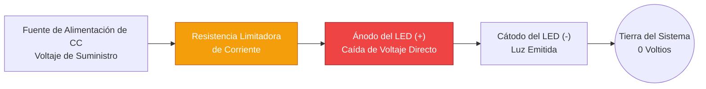
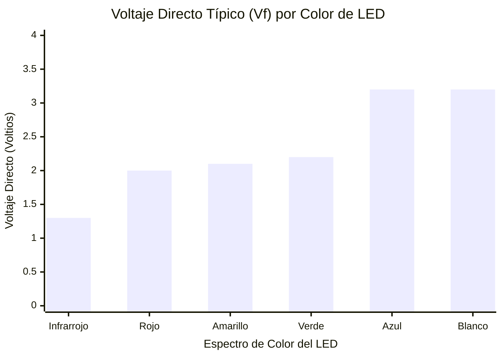
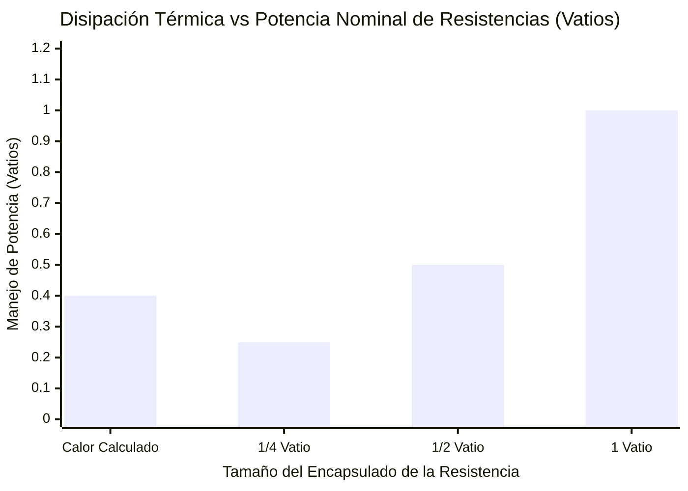
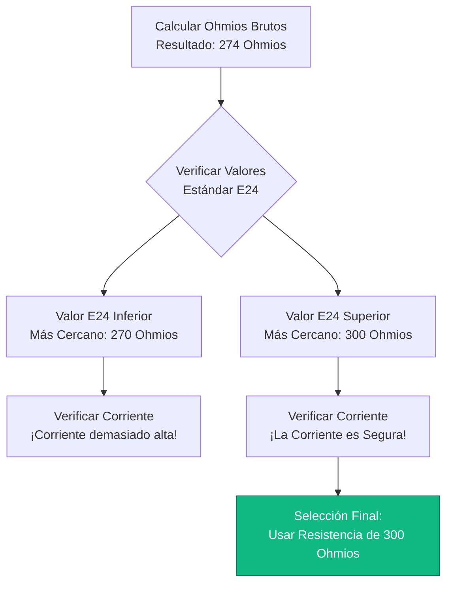
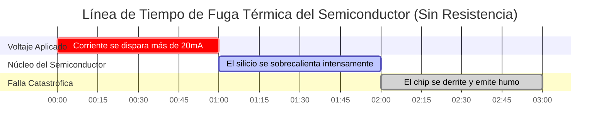

# La Calculadora Definitiva de Resistencias para LED: Ley de Ohm, Estándares E24 y Disipación Térmica

Bienvenido a la **Calculadora de Resistencias para LED** definitiva y guía completa de circuitos semiconductores. Ya sea que sea un aficionado a la electrónica que está prototipando un panel de indicadores con un Arduino de $5\text{V}$, un técnico automotriz que intenta reacondicionar limpiamente LEDs en un tablero de $12\text{V}$ sin provocar errores en el CanBus, o un estudiante de ingeniería deduciendo físicamente $R = (V_s - V_f) / I$, dominar las matemáticas de las resistencias limitadoras de corriente es absolutamente obligatorio.

Un LED (Diodo Emisor de Luz) no es una bombilla. Es un semiconductor altamente sensible. Si conecta un LED directamente a una fuente de energía sin una resistencia limitadora de corriente, su resistencia interna colapsará instantáneamente, provocando que consuma una corriente infinita, se sobrecaliente violentamente y explote en una nube de humo azul acre.

En esta exhaustiva clase magistral de SEO de más de 4000 palabras, analizaremos la ecuación fundamental $R = \frac{V_s - V_f}{I}$, expondremos matemáticamente los peligros de los arreglos de LEDs en paralelo, descifraremos los confusos códigos de colores de las resistencias de 4 y 5 bandas, y analizaremos enérgicamente el calentamiento de Joule ($P = I^2 R$) para asegurarnos de que nunca derrita accidentalmente una resistencia de $1/4\text{W}$. Para consolidar estos conceptos críticos de la ingeniería eléctrica, hemos incluido cinco diagramas interactivos en Mermaid.js, detallados y seguros para el analizador.

---

## 1. ¿Por Qué Explotan los LEDs? (La Física del Voltaje Directo)

Para entender por qué es obligatoria una resistencia, debe comprender la física de los semiconductores del **Voltaje Directo ($V_f$)**.

A diferencia de un cable de cobre tradicional o un filamento de tungsteno, un LED no obedece la Ley de Ohm de manera lineal. Un LED es un diodo, una válvula de una sola vía para la electricidad. Cuando se aplica voltaje, el LED bloquea perfectamente toda la corriente hasta que el voltaje cruza un umbral semiconductor crítico conocido como **Voltaje Directo ($V_f$)**.

Para un LED rojo estándar, el $V_f$ es de exactamente $2.0\text{V}$. 
- Si aplica $1.9\text{V}$, el LED consume $0\text{ Amperios}$. Está totalmente oscuro.
- Si aplica $2.0\text{V}$, el LED se enciende y consume su corriente nominal de $20\text{ mA}$.
- Si aplica $2.1\text{V}$, la resistencia interna colapsa por completo, el LED consume $200\text{ mA}$ y el chip semiconductor se derrite físicamente.

Una resistencia actúa como un amortiguador. Quema matemáticamente el voltaje excedente ($V_s - V_f$) y limita estrictamente la corriente máxima que fluye a través del circuito, manteniendo al LED bloqueado de manera segura en $20\text{ mA}$.

---

## 2. La Ecuación Principal de la Resistencia para LED

Calcular la resistencia limitadora de corriente perfecta requiere solo de álgebra básica. Debe determinar cuánto voltaje en exceso necesita ser absorbido por la resistencia, y dividirlo por su corriente objetivo.

**La Fórmula Fundamental:**
$$R = \frac{V_s - V_f}{I}$$

Dónde:
- $V_s$ = **Voltaje de Suministro** (El voltaje de su batería o fuente de alimentación, p. ej., $5\text{V}$ o $12\text{V}$).
- $V_f$ = **Voltaje Directo** (El voltaje consumido por el LED en sí, p. ej., $2.0\text{V}$ para el color rojo).
- $I$ = **Corriente Objetivo** (La corriente de brillo deseada en amperios, p. ej., $0.020\text{A}$ para $20\text{mA}$).

**Ejemplo de Cálculo (Arduino 5V con LED Rojo):**
1. Voltaje a reducir: $5.0\text{V} - 2.0\text{V} = 3.0\text{V}$
2. Corriente Objetivo: $20\text{ mA} = 0.020\text{ A}$
3. Resistencia: $3.0 / 0.020 = 150 \ \Omega$

Necesita exactamente una resistencia de $150 \ \Omega$ para encender de forma segura un LED rojo en un Arduino.

---

## 3. El Problema de las Resistencias Estándar E24

Las matemáticas a menudo producen números complicados. Si calcula que requiere una resistencia de $137.5 \ \Omega$, rápidamente descubrirá una realidad frustrante: **No puede comprar una resistencia de $137.5 \ \Omega$.**

Los componentes electrónicos se fabrican en lotes logarítmicos estandarizados conocidos como **Serie E**. 
El estándar más común es la **serie E24**, que dicta los 24 valores estándar disponibles en cada década de resistencia.

Valores base comunes de E24: $10, 11, 12, 13, 15, 16, 18, 20, 22, 24, 27, 30, 33, 36, 39, 43, 47, 51, 56, 62, 68, 75, 82, 91$.

Cuando su cálculo se encuentra entre dos valores E24, **siempre redondee hacia el siguiente valor estándar más alto.** 
Redondear hacia arriba aumenta la resistencia, lo que disminuye ligeramente la corriente, asegurando que el LED funcione más frío y viva más tiempo. Si redondea hacia abajo, se arriesga a sobrecargar el LED.

---

## 4. Calentamiento de Joule y Peligros de Incendio de Resistencias ($P = I^2 R$)

Limitar la corriente es solo la mitad de la batalla. Cuando una resistencia absorbe el exceso de voltaje, no hace que la energía desaparezca mágicamente: convierte violentamente esa energía eléctrica en calor térmico. Esto se conoce como **Calentamiento de Joule**.

Si su resistencia se calienta demasiado, su película de carbono se vaporizará, rompiendo el circuito.

**La Fórmula de Disipación de Potencia:**
$$P = V_R \times I \quad \text{o} \quad P = I^2 \cdot R$$

**Ejemplo: Batería de automóvil de 12V con un solo LED rojo (2V, 20mA).**
- Voltaje absorbido por la resistencia ($V_R$): $12\text{V} - 2\text{V} = 10\text{V}$.
- Corriente ($I$): $0.020\text{ A}$.
- Potencia ($P$): $10 \times 0.020 = 0.200\text{ Vatios}$ ($200\text{ mW}$).

Una pequeña resistencia estándar para aficionados está clasificada para **$1/4\text{ de Vatio}$ ($250\text{ mW}$)**. 
Debido a que $200\text{ mW}$ está extremadamente cerca del límite de $250\text{ mW}$, esta resistencia estará demasiado caliente al tacto. En entornos automotrices, el calor ambiental empujará fácilmente a esta resistencia más allá de su punto de falla térmica.

*Regla de Ingeniería:* **Siempre duplique el vataje de potencia calculado.** Si calcula $200\text{ mW}$, debe usar una resistencia de $1/2\text{ Vatio}$ ($500\text{ mW}$) para un margen térmico seguro.

---

## 5. Arreglos de LEDs en Serie vs en Paralelo

Al conectar varios LEDs, tiene dos opciones: En serie o En paralelo. **Una de estas opciones es un enorme error de ingeniería.**

### El Peligro de los LEDs en Paralelo
Los principiantes a menudo conectan 5 LEDs en paralelo e intentan usar una sola resistencia compartida. Esto es catastrófico. Debido a defectos de fabricación microscópicos, un LED inevitablemente tendrá un $V_f$ ligeramente inferior que los demás. Ese solo LED "acaparará" ávidamente toda la corriente, sobrecalentándose y muriendo. Una vez que muere, toda la corriente se descarga en el siguiente LED más débil, provocando una explosión en cadena en cascada conocida como **Fuga Térmica**.
*Nunca use una resistencia compartida para LEDs en paralelo. Dele a cada LED su propia resistencia dedicada.*

### La Eficiencia de los LEDs en Serie
Conectar LEDs en una cadena en serie es muy eficiente. La corriente ($20\text{ mA}$) fluye a través de todos los LEDs por igual, pero sus Voltajes Directos ($V_f$) se suman.
- Tres LEDs rojos (de $2.0\text{V}$ cada uno) en serie consumen $6.0\text{V}$ en total.
- En una fuente de $12\text{V}$, la resistencia solo tiene que reducir $6.0\text{V}$, disminuyendo drásticamente el desperdicio de calor.
- **Fórmula:** $R = (V_s - (3 \times V_f)) / I$.

---

## 6. Cinco Escenarios Conceptuales de Ingeniería con Visualizaciones 2D

Para dominar completamente las relaciones físicas que gobiernan los circuitos LED, exploraremos cinco escenarios de ingeniería distintos desglosados visualmente utilizando diagramas personalizados en Mermaid.js.

### Ejemplo 1: La Anatomía Estándar de un Circuito LED

**El Escenario:**
Un estudiante de electrónica necesita comprender la secuencia obligatoria de componentes requeridos para iluminar de manera segura un solo LED a partir de una fuente de alimentación de CC.

**Visualización 2D:**
Este diagrama de flujo lógico mapea la ruta física de la corriente que fluye desde la fuente de voltaje positivo, a través de la resistencia protectora, hacia el ánodo del LED y regresando a tierra.

---

### Ejemplo 2: Voltaje Directo ($V_f$) por Color de LED

**El Escenario:**
Un ingeniero en robótica está diseñando un panel de indicadores y necesita dar cuenta con precisión de las diferentes caídas de voltaje en varios LEDs de colores.

**Las Matemáticas:**
Diferentes colores requieren de diferentes materiales semiconductores (GaAs vs InGaN). El rojo es de energía extremadamente baja ($2.0\text{V}$), mientras que el azul/blanco requiere de alta energía ($3.2\text{V}$).

**Visualización 2D:**
Este gráfico de barras clasifica agresivamente los Voltajes Directos exactos necesarios para iluminar los LEDs estándar de 5 mm en función de su espectro de color.

---

### Ejemplo 3: Márgenes de Disipación de Potencia de Resistencias

**El Escenario:**
Un técnico automotriz calcula que la resistencia de su LED de tablero de $12\text{V}$ disipará $0.40\text{W}$ ($400\text{ mW}$) de calor térmico. Debe seleccionar el tamaño físico correcto de la resistencia.

**Las Matemáticas:**
El uso de una resistencia de $1/4\text{W}$ ($250\text{ mW}$) provocará un incendio inmediato. El uso de una resistencia de $1/2\text{W}$ ($500\text{ mW}$) es técnicamente seguro pero deja un margen térmico de cero. Una resistencia de $1\text{W}$ ($1000\text{ mW}$) proporciona el factor de seguridad obligatorio del $2x$.

**Visualización 2D:**
Este gráfico traza los límites de seguridad de los encapsulados de resistencias estándar frente a la disipación térmica real del circuito.

---

### Ejemplo 4: El Algoritmo de Selección Estándar E24

**El Escenario:**
Un diseñador de circuitos calcula una resistencia requerida de $274 \ \Omega$. Debido a que esta resistencia no existe en el mundo real, debe ejecutar el Algoritmo de Selección E24 para encontrar un sustituto seguro.

**Visualización 2D:**
Este diagrama de flujo de arriba hacia abajo mapea la lógica estricta necesaria para evaluar los valores de las resistencias estándar E24, asegurando que el circuito se redondee HACIA ARRIBA para proteger el LED.

---

### Ejemplo 5: Fuga Térmica (Sin Resistencia)

**El Escenario:**
Un principiante conecta un LED azul de $3.2\text{V}$ directamente a una fuente de alimentación USB de $5.0\text{V}$ sin una resistencia, creyendo falsamente que el LED simplemente "tomará lo que necesita".

**Visualización 2D:**
Este diagrama de Gantt describe brutalmente la línea de tiempo microscópica de la Fuga Térmica, demostrando qué tan rápido colapsará y se quemará una unión de semiconductor sin protección bajo un exceso de voltaje.

---

## 7. Conclusión y Desafío de Ingeniería

Dominar el cálculo de Resistencias para LED ($R = (V_s - V_f) / I$) es el último rito de paso para cualquier ingeniero eléctrico o maker. Comprender la severa física del Voltaje Directo, la frustrante realidad de la disponibilidad de componentes del estándar E24, y el peligro de incendio invisible del Calentamiento de Joule garantizará que sus circuitos funcionen a la perfección durante décadas.

Si ignora estos principios matemáticos, sus LEDs se quemarán instantáneamente, sus arreglos en paralelo sufrirán una fuga térmica por acaparamiento de corriente, y sus resistencias subestimadas quemarán sus placas de circuito impreso.

Para garantizar que ha dominado estos conceptos críticos, inicie nuestro Simulador interactivo e intente resolver estos desafíos finales:
1. **El Arreglo Automotriz de $12\text{V}$:** Necesita ejecutar tres LEDs azules ($3.2\text{V}$, $20\text{mA}$) en una cadena en serie desde un suministro de alternador de $14.4\text{V}$. Calcule la resistencia exacta requerida y encuentre el valor estándar E24 más cercano.
2. **El Pánico de Potencia:** Está reduciendo $9.0\text{V}$ a través de una resistencia a $50\text{mA}$. Calcule la potencia exacta del Calentamiento de Joule. ¿Puede usar de manera segura una resistencia de $1/2\text{W}$?
3. **El Código de Colores:** Encuentra una resistencia con las bandas: Amarillo, Violeta, Marrón, Oro. ¿Cuál es su resistencia exacta y su tolerancia?

Confíe en esta calculadora para auditar sus protoboards, calcular arreglos en serie complejos, y siempre defender matemáticamente sus semiconductores de la destrucción térmica.
