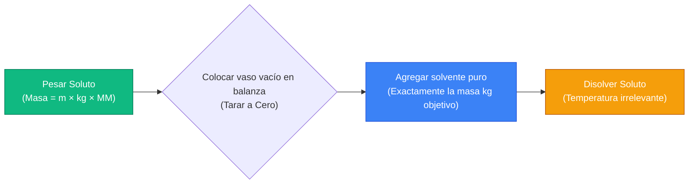
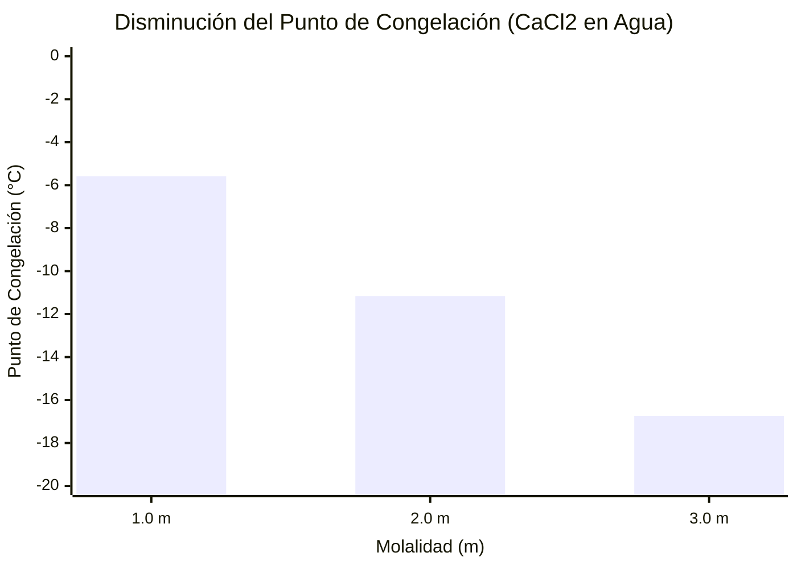
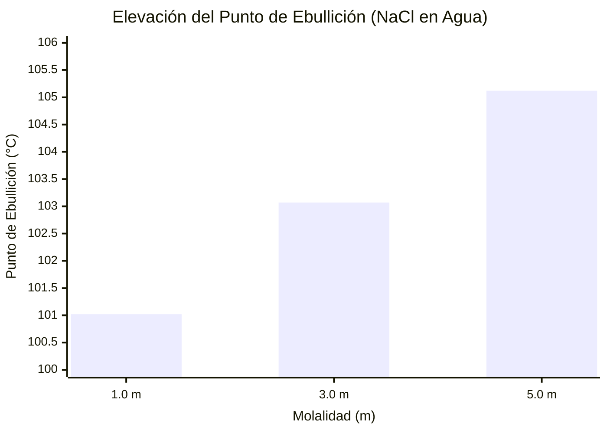
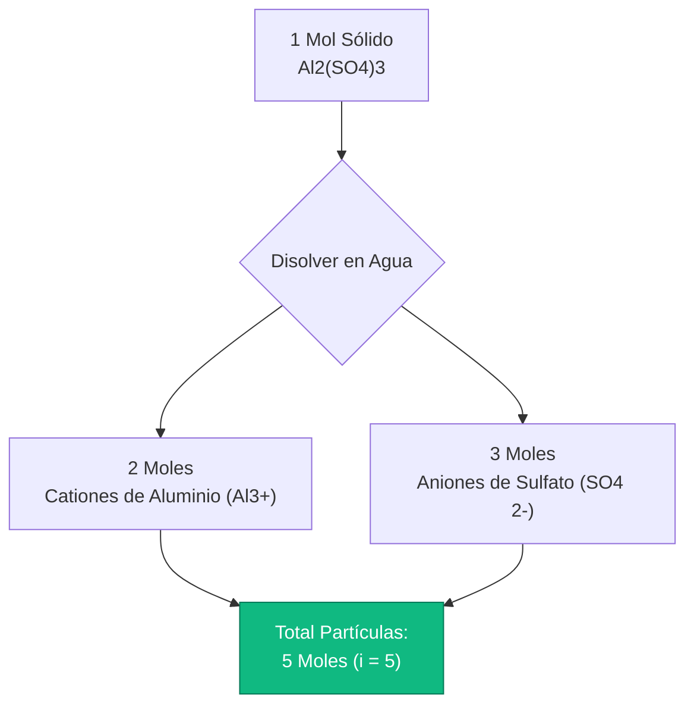
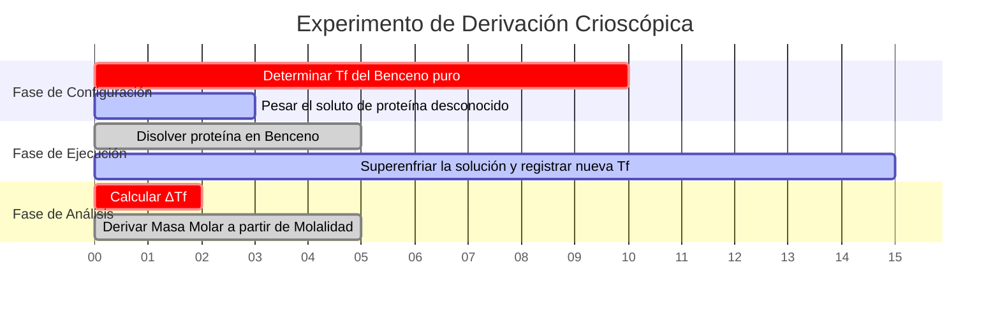

# La Calculadora Definitiva de Molalidad: Propiedades Coligativas y Termodinámica

Bienvenido a la **Calculadora de Molalidad** definitiva y a la guía completa de fisicoquímica. Si usted es un estudiante de Química AP analizando la depresión del punto de congelación, un ingeniero químico industrial diseñando soluciones anticongelantes para automóviles o un investigador de criobiología trabajando con termodinámica de solventes bajo cero, dominar las matemáticas de la Molalidad es una necesidad absoluta.

Si bien la Molaridad ($M$) domina la química general de soluciones, posee un defecto fatal: depende completamente del volumen, que se expande y contrae con la variación térmica. Cuando se analizan los puntos de ebullición y los puntos de congelación, las concentraciones basadas en el volumen son matemáticamente inútiles. En su lugar, debe confiar en la **Molalidad ($m$)**—la estricta relación invariable con la temperatura entre los moles de soluto y la masa de solvente puro.

En esta exhaustiva clase magistral de SEO de más de 4,000 palabras, deconstruiremos por completo las matemáticas fundamentales de la Molalidad, expondremos las diferencias críticas entre Molaridad y Molalidad, demostraremos matemáticamente las leyes termodinámicas de las Propiedades Coligativas ($\Delta T_f$ y $\Delta T_b$) y decodificaremos los mecanismos físicos detrás del factor de Van't Hoff ($i$). Para garantizar una comprensión absoluta, hemos incluido cinco diagramas interactivos de Mermaid.js detallados minuciosamente y seguros para el analizador.

---

## 1. La Termodinámica de la Molalidad (m = n / kg)

El concepto absolutamente más crítico en fisicoquímica es comprender la estricta definición matemática de la **Molalidad ($m$)**. 

La molalidad es una métrica de ingeniería que cuantifica la concentración de una solución química, expresada estrictamente como el número de **moles de soluto** disueltos por **Kilogramo de SOLVENTE puro**.
- Una solución de $1.0\text{ m}$ (Un Molal) de Cloruro de Sodio ($\text{NaCl}$) contiene exactamente $1.0$ mol de moléculas de $\text{NaCl}$ dispersas dentro de exactamente $1.0\text{ kg}$ de agua pura.
- A diferencia de la Molaridad, NO utiliza el volumen total de la solución en el denominador.

**La Ecuación Central:**
$$\text{Molalidad (m)} = \frac{\text{Moles de Soluto (n)}}{\text{Masa de Solvente (kg)}}$$

### Por Qué la Molalidad es Independiente de la Temperatura
La masa física ($kg$) es una propiedad invariable de la materia. Un kilogramo de agua a $4^\circ\text{C}$ contiene exactamente la misma cantidad de moléculas que un kilogramo de agua a $95^\circ\text{C}$. Sin embargo, un Litro de agua a $95^\circ\text{C}$ ocupa un espacio físico (volumen) significativamente mayor debido a la expansión térmica.

Debido a que la Molaridad ($M = n/V$) depende del volumen, calentar una solución disminuye su Molaridad. Debido a que la Molalidad ($m = n/kg$) se basa puramente en la masa, permanece matemáticamente perfecta y constante a través de todos los estados termodinámicos, convirtiéndola en la única métrica válida para estudiar los puntos de ebullición y congelación.

**La Fórmula de Preparación de la Masa del Soluto:**
Para preparar una solución física en un vaso de precipitados, debe combinar la ecuación de moles con la ecuación de molalidad:
$$\text{Masa de Soluto Requerida (g)} = \text{Molalidad Objetivo (m)} \times \text{Masa de Solvente (kg)} \times \text{Masa Molar (g/mol)}$$

**Ejemplo de Cálculo:**
Necesita preparar una solución $0.50\text{ m}$ de Cloruro de Calcio ($\text{CaCl}_2$, $\text{MM} = 110.98\text{ g/mol}$) usando $2.0\text{ kg}$ de agua pura.
$\text{Masa Requerida} = 0.50\text{ m} \times 2.0\text{ kg} \times 110.98\text{ g/mol} = \mathbf{110.98\text{ gramos}}$.
Pesará $110.98\text{ g}$ de $\text{CaCl}_2$ y lo disolverá directamente en $2000\text{ g}$ de agua.

---

## 2. Propiedades Coligativas: Disminución del Punto de Congelación ($\Delta T_f$)

Las propiedades coligativas son un subconjunto fascinante de la fisicoquímica. Son propiedades que dependen **únicamente del número total de partículas disueltas** en una solución, ignorando por completo la identidad química o el tamaño de esas partículas.

Cuando se disuelve un soluto en un solvente puro, las partículas de soluto interfieren físicamente con la capacidad de las moléculas del solvente para organizarse en una red cristalina sólida. Esto significa que la temperatura debe caer significativamente por debajo del punto de congelación normal para obligar a la solución a congelarse. Es por esto que los municipios rocían sal en las carreteras heladas durante las tormentas de nieve en invierno.

**La Ecuación del Punto de Congelación:**
$$\Delta T_f = i \times K_f \times m$$

Donde:
- $\Delta T_f$ = La caída de temperatura por debajo del punto de congelación normal.
- $i$ = El Factor de Van't Hoff (número de partículas disociadas).
- $K_f$ = La Constante Crioscópica del solvente (Para el agua, $K_f = 1.86^\circ\text{C/m}$).
- $m$ = La Molalidad de la solución.

---

## 3. Propiedades Coligativas: Elevación del Punto de Ebullición ($\Delta T_b$)

A la inversa, cuando se hierve una solución, las partículas de soluto bloquean físicamente el escape de las moléculas del solvente en la superficie del líquido hacia la fase gaseosa, disminuyendo la presión de vapor (Ley de Raoult). Para superar esto y lograr la ebullición, se debe aplicar significativamente más energía térmica (mayor temperatura).

**La Ecuación del Punto de Ebullición:**
$$\Delta T_b = i \times K_b \times m$$

Donde:
- $\Delta T_b$ = El aumento de temperatura por encima del punto de ebullición normal.
- $K_b$ = La Constante Ebullioscópica del solvente (Para el agua, $K_b = 0.512^\circ\text{C/m}$).

---

## 4. Decodificando el Factor de Van't Hoff ($i$)

El factor de Van't Hoff es el multiplicador matemático que representa cómo un compuesto químico se despedaza cuando se expone a un solvente. Dado que las propiedades coligativas solo se preocupan por el *número* de partículas, $1.0\text{ mol}$ de sal disuelta tendrá un impacto termodinámico radicalmente diferente que $1.0\text{ mol}$ de azúcar disuelta.

**No Electrolitos (Azúcares, Compuestos Orgánicos):**
Los compuestos como la Glucosa ($\text{C}_6\text{H}_{12}\text{O}_6$) o el Etanol no se rompen en el agua. Un mol de glucosa sólida produce un mol de glucosa disuelta.
- **Glucosa $i = 1$**

**Electrolitos (Sales, Ácidos):**
Los compuestos iónicos se rompen en sus iones constituyentes.
- $\text{NaCl} \rightarrow \text{Na}^+ + \text{Cl}^-$ (Produce 2 partículas). **$i = 2$**
- $\text{CaCl}_2 \rightarrow \text{Ca}^{2+} + 2\text{Cl}^-$ (Produce 3 partículas). **$i = 3$**
- $\text{Al}_2(\text{SO}_4)_3 \rightarrow 2\text{Al}^{3+} + 3\text{SO}_4^{2-}$ (Produce 5 partículas). **$i = 5$**

¡Esto significa que una solución de $1.0\text{ m}$ de $\text{Al}_2(\text{SO}_4)_3$ reducirá el punto de congelación del agua **cinco veces más eficazmente** que una solución de $1.0\text{ m}$ de azúcar!

---

## 5. Cinco Escenarios de Ingeniería Conceptual con Visualizaciones 2D

Para dominar por completo las relaciones físicas que gobiernan la termodinámica coligativa, exploraremos cinco escenarios de laboratorio distintos desglosados visualmente utilizando diagramas personalizados de Mermaid.js.

### Ejemplo 1: El Proceso de Preparación Molal

**El Escenario:**
Un técnico de laboratorio necesita preparar físicamente una solución de molalidad específica. Note cómo los matraces aforados son completamente irrelevantes aquí porque la molalidad depende por completo de la masa.

**Visualización 2D:**
Este diagrama de flujo lógico traza la estricta secuencia cronológica requerida para preparar correctamente una solución molal usando solo una balanza analítica de masas.

---

### Ejemplo 2: La Curva de Disminución del Punto de Congelación

**El Escenario:**
Un ingeniero de la ciudad está evaluando las sales de las carreteras para evitar la formación de hielo a $-15^\circ\text{C}$. Modela cómo el aumento de la molalidad del $\text{CaCl}_2$ ($i=3$) hace que el punto de congelación del agua baje linealmente.

**Las Matemáticas:**
$\Delta T_f = 3 \times 1.86 \times m = 5.58 \times m$. Por cada aumento de $1.0\text{ m}$, el punto de congelación cae en $5.58^\circ\text{C}$.

**Visualización 2D:**
Este gráfico traza la correlación lineal directa entre la concentración molal del Cloruro de Calcio y el punto de congelación bajo cero resultante.

---

### Ejemplo 3: El Efecto de Elevación del Punto de Ebullición

**El Escenario:**
Un chef agrega grandes cantidades de sal ($\text{NaCl}$, $i=2$) al agua de la pasta para forzar que el agua hierva más caliente, cocinando la pasta más rápido.

**Las Matemáticas:**
$\Delta T_b = 2 \times 0.512 \times m = 1.024 \times m$. Incluso en concentraciones extremadamente altas, el efecto de elevación del punto de ebullición en el agua es físicamente muy pequeño.

**Visualización 2D:**
Este gráfico prueba gráficamente que se necesitarían cantidades absurdas de sal para elevar el punto de ebullición del agua incluso unos pocos grados.

---

### Ejemplo 4: La Arquitectura de Disociación de Van't Hoff

**El Escenario:**
Un estudiante de primer año de química lucha por comprender por qué $1.0\text{ m}$ de Sulfato de Aluminio tiene un impacto termodinámico tan radical en comparación con el azúcar.

**Visualización 2D:**
Este diagrama de flujo de arriba hacia abajo mapea la cascada de disociación iónica, demostrando cómo una sola unidad cristalina se rompe en cinco partículas termodinámicas distintas.

---

### Ejemplo 5: Línea de Tiempo del Laboratorio Crioscópico

**El Escenario:**
Un investigador de criobiología ejecuta un experimento de precisión para deducir la masa molar desconocida de una proteína recién sintetizada observando la disminución del punto de congelación en Benceno.

**Visualización 2D:**
Este diagrama de Gantt visualiza la secuencia cronológica de un experimento de fisicoquímica, desde la calibración del solvente hasta la derivación matemática termodinámica final.

---

## 7. Conclusión y Desafío Termodinámico

Dominar la Molalidad es la base fundamental de toda la química termodinámica y coligativa. Comprender la diferencia entre la Molaridad dependiente del volumen y la Molalidad dependiente de la masa, respetar la ruptura física de los electrolitos a través del factor de Van't Hoff y modelar matemáticamente la variación térmica garantizará que sus experimentos de laboratorio produzcan resultados precisos y reproducibles.

Si ignora estos principios matemáticos, sus calibraciones de precisión fallarán cuando la temperatura del laboratorio fluctúe, los bloques de los motores de sus automóviles se agrietarán congelados en invierno y sus cultivos celulares biológicos morirán por choque osmótico.

Para garantizar que ha dominado estos conceptos críticos, inicie nuestro Simulador interactivo e intente resolver estos desafíos finales de fisicoquímica:
1. **El Desafío de la Masa:** Necesita preparar una solución de $0.75\text{ m}$ de Nitrato de Potasio ($\text{KNO}_3$, $\text{MM} = 101.1\text{ g/mol}$) usando exactamente $500\text{ g}$ de agua. ¿Exactamente cuántos gramos de $\text{KNO}_3$ debe pesar en la balanza analítica?
2. **El Desafío de Invierno:** Vierte $2000\text{ g}$ de $\text{MgCl}_2$ ($i=3$, $\text{MM} = 95.21\text{ g/mol}$) en $10.0\text{ kg}$ de agua. ¿Cuál es el nuevo punto de congelación exacto de la mezcla? (Para el agua $K_f = 1.86$).
3. **El Desafío de la Masa Molar:** Disuelve $50.0\text{ g}$ de un no electrolito desconocido ($i=1$) en $1.0\text{ kg}$ de agua. El punto de ebullición se eleva en $0.256^\circ\text{C}$. ¿Cuál es la masa molar precisa del soluto desconocido? (Para el agua $K_b = 0.512$).

Confíe en esta calculadora para auditar su tarea de termodinámica, precalcular sus protocolos de punto de congelación en el laboratorio y dominar permanentemente las matemáticas de la fisicoquímica.
