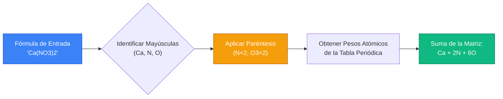
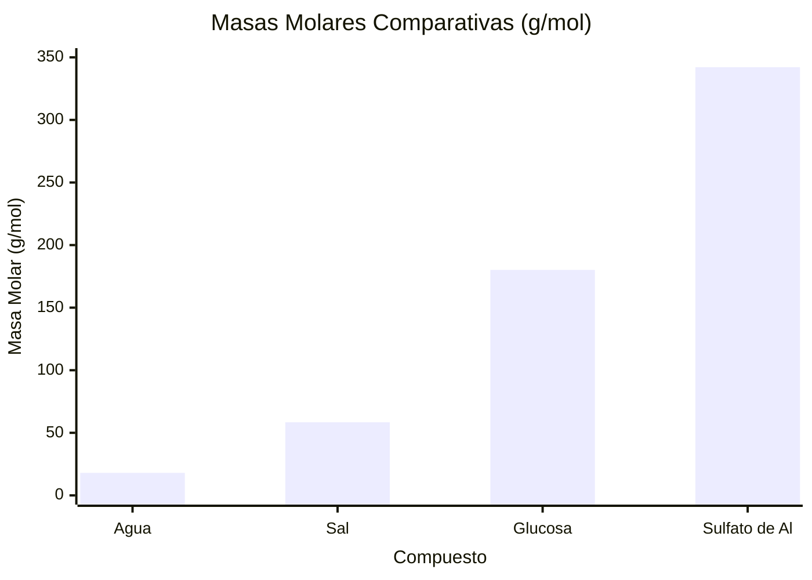
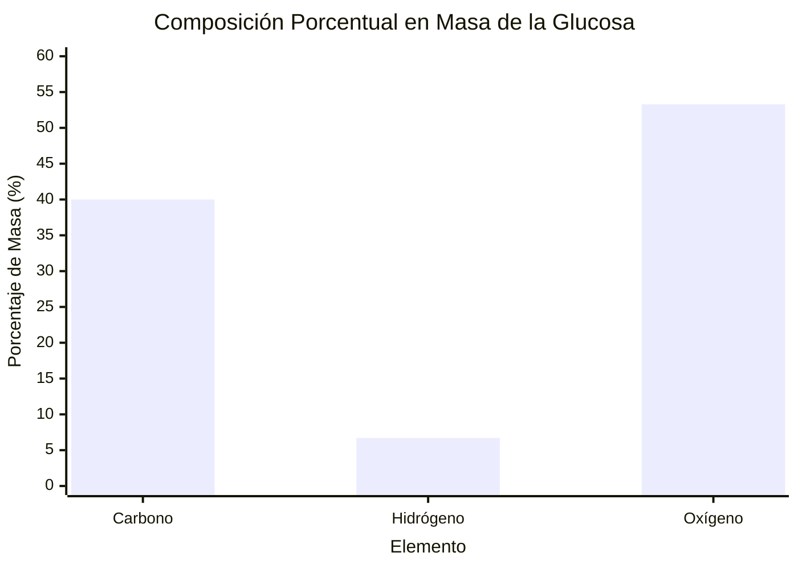
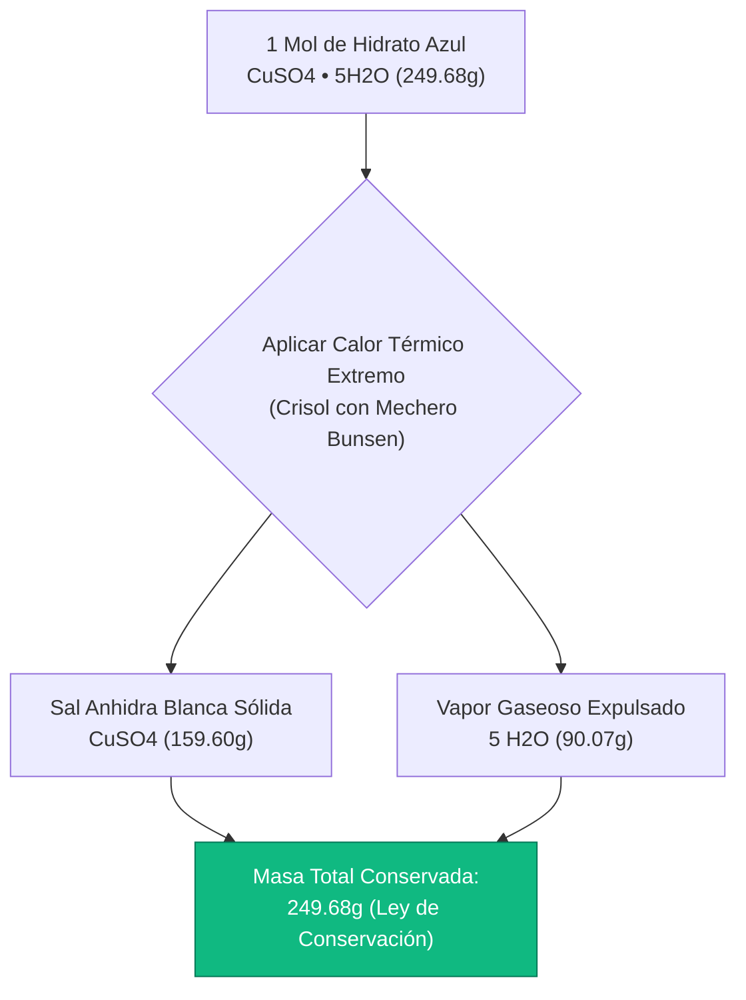
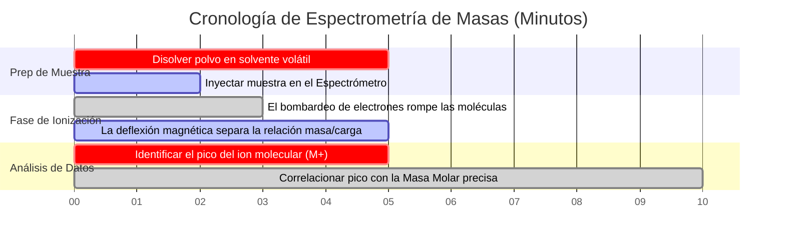

# La Calculadora de Masa Molar Definitiva: Fórmulas, Composición Porcentual e Hidratos

Bienvenido a la **Calculadora de Masa Molar** definitiva y guía completa de fórmulas químicas. Ya sea un estudiante de química de secundaria que está aprendiendo a balancear su primera ecuación estequiométrica, un químico analítico que configura un espectrómetro de masas para análisis de proteínas, o un científico de materiales que calcula el porcentaje de hidratación preciso del cemento industrial, dominar las matemáticas de la Masa Molar es la base ineludible de la química cuantitativa.

Las fórmulas químicas como $\text{C}_6\text{H}_{12}\text{O}_6$ (Glucosa) o $\text{CuSO}_4\cdot 5\text{H}_2\text{O}$ (Sulfato de Cobre Pentahidratado) pueden parecer una sopa de letras alfanumérica confusa para un principiante. Sin embargo, son planos matemáticos altamente estructurados. Al deconstruir estas fórmulas y multiplicar los recuentos de átomos por los pesos atómicos estándar de la tabla periódica, podemos tender un puente entre el mundo microscópico de las partículas atómicas y el mundo macroscópico de los gramos en el laboratorio.

En esta exhaustiva clase magistral de SEO de más de 4,000 palabras, deconstruiremos por completo los algoritmos matemáticos requeridos para calcular la masa molar, exploraremos las diferencias críticas entre las fórmulas moleculares y empíricas, probaremos matemáticamente la composición porcentual de compuestos orgánicos complejos, y decodificaremos la termodinámica de los hidratos cristalinos. Para garantizar una comprensión absoluta, hemos incluido cinco diagramas interactivos de Mermaid.js seguros para el analizador y meticulosamente detallados.

---

## 1. Las Matemáticas de la Masa Molar ($\text{g/mol}$)

La **Masa Molar ($M$)** de una sustancia química se define con precisión como la masa física (medida en gramos) de exactamente $1.0\text{ mol}$ ($6.022 \times 10^{23}$ partículas) de esa sustancia. 
Utilizando los pesos atómicos estándar de la tabla periódica (que se escalan al estándar del isótopo Carbono-12), podemos derivar la masa molar exacta de cualquier compuesto teórico en el universo.

**El Algoritmo de Suma Central:**
$$M = \sum (\text{Recuento de Átomos del Elemento} \times \text{Peso Atómico Estándar})$$

### La Masa Molar del Agua ($\text{H}_2\text{O}$)
Para calcular la masa molar del agua, analizamos la fórmula $\text{H}_2\text{O}$:
- El subíndice "2" significa que hay dos átomos de Hidrógeno ($\text{H}$).
- La ausencia de un subíndice después del Oxígeno ($\text{O}$) implica matemáticamente "1".
- Busque Hidrógeno en la tabla periódica: $1.008\text{ g/mol}$.
- Busque Oxígeno en la tabla periódica: $15.999\text{ g/mol}$.

**El Cálculo:**
- Hidrógeno: $2 \times 1.008 = 2.016\text{ g/mol}$
- Oxígeno: $1 \times 15.999 = 15.999\text{ g/mol}$
- **Masa Molar Total ($\text{H}_2\text{O}$): $18.015\text{ g/mol}$**

Si pesa físicamente exactamente $18.015\text{ gramos}$ de agua líquida pura en una balanza analítica, posee exactamente $1.0\text{ mol}$ de moléculas de agua.

---

## 2. Análisis Avanzado de Fórmulas: Paréntesis y Corchetes

Las fórmulas químicas para los iones poliatómicos a menudo usan paréntesis. Un subíndice inmediatamente fuera de un paréntesis multiplica matemáticamente cada átomo contenido *dentro* del paréntesis.

### La Masa Molar del Sulfato de Aluminio [$\text{Al}_2(\text{SO}_4)_3$]
Este es un compuesto químico clásico que causa inmensa frustración a los estudiantes de química. Deconstruyamos el plano matemático:
1. **$\text{Al}_2$:** $2\text{ átomos de Aluminio}$.
2. **$(\text{SO}_4)_3$:** El "3" exterior multiplica la $\text{S}$ por 3, y la $\text{O}_4$ por 3 ($4 \times 3 = 12$). Así que tenemos $3\text{ átomos de Azufre}$ y $12\text{ átomos de Oxígeno}$.

**El Cálculo:**
- Aluminio: $2 \times 26.982 = 53.964\text{ g/mol}$
- Azufre: $3 \times 32.06 = 96.180\text{ g/mol}$
- Oxígeno: $12 \times 15.999 = 191.988\text{ g/mol}$
- **Masa Molar Total ($\text{Al}_2(\text{SO}_4)_3$): $342.132\text{ g/mol}$**

---

## 3. Hidratos y Agua de Cristalización ($\cdot x\text{H}_2\text{O}$)

Muchas sales iónicas absorben naturalmente las moléculas de agua de la humedad ambiental en la atmósfera, atrapando estas moléculas de agua fuertemente dentro de su red cristalina 3D. A estos se les conoce como **Hidratos**. El agua NO es agua líquida físicamente húmeda; es agua estructural sólida unida químicamente.

La fórmula química para un hidrato utiliza un punto central "$\cdot$" seguido de un número entero $x$, que representa el número de moléculas de agua unidas por unidad de fórmula de sal. Al calcular la masa molar, debe SUMAR la masa del agua a la masa de la sal anhidra.

### Sulfato de Cobre(II) Pentahidratado ($\text{CuSO}_4\cdot 5\text{H}_2\text{O}$)
- El prefijo "Penta" significa que exactamente $5\text{ moléculas de agua}$ están atrapadas.
- Primero, calcule la sal anhidra $\text{CuSO}_4$:
  - $\text{Cu}$ ($63.546$) + $\text{S}$ ($32.06$) + $4\times \text{O}$ ($63.996$) = $159.602\text{ g/mol}$.
- Segundo, calcule las $5\text{ moléculas de agua}$:
  - $5 \times \text{H}_2\text{O}$ ($18.015$) = $90.075\text{ g/mol}$.
- **Masa Molar Hidratada Total: $159.602 + 90.075 = 249.677\text{ g/mol}$.**

Cuando calienta un hidrato en un crisol sobre un mechero Bunsen, la energía térmica rompe los enlaces que retienen el agua de cristalización. El agua hierve en forma de vapor, y el hidrato cristalino azul colapsa en una masa anhidra pulverulenta y blanca.

---

## 4. Composición Porcentual en Masa

Una vez que ha calculado la masa molar total de un compuesto, determinar la **Composición Porcentual en Masa** es una simple cuestión de división. Esto es altamente crítico en la minería industrial y la metalurgia (ej., determinando qué porcentaje del mineral de hierro es realmente hierro puro).

**La Ecuación:**
$$\text{\% del Elemento} = \left( \frac{\text{Masa Total del Elemento en 1 Mol}}{\text{Masa Molar Total del Compuesto}} \right) \times 100\%$$

**Ejemplo: Composición Porcentual de la Glucosa ($\text{C}_6\text{H}_{12}\text{O}_6$)**
- **Masa Molar Total:** $180.156\text{ g/mol}$
- **% Carbono ($C$):** $(72.066 / 180.156) \times 100\% = \mathbf{40.00\%}$
- **% Hidrógeno ($H$):** $(12.096 / 180.156) \times 100\% = \mathbf{6.71\%}$
- **% Oxígeno ($O$):** $(95.994 / 180.156) \times 100\% = \mathbf{53.28\%}$

Debido a que los porcentajes deben sumar $100\%$, sabemos que la matemática es impecable: $40.00 + 6.71 + 53.28 = 99.99\%$ (con $0.01\%$ perdido por redondeo estándar).

---

## 5. Cinco Escenarios Conceptuales de Ingeniería con Visualizaciones 2D

Para dominar completamente los algoritmos que gobiernan el análisis de fórmulas, la suma de elementos y la composición de masa, exploraremos cinco escenarios distintos de química analítica desglosados visualmente utilizando diagramas personalizados de Mermaid.js.

### Ejemplo 1: El Analizador de Fórmulas Algorítmico

**El Escenario:**
Un estudiante de ciencias de la computación está intentando entender cómo nuestro algoritmo de calculadora interno analiza una cadena compleja como `Ca(NO3)2` en una matriz matemática.

**Visualización 2D:**
Este diagrama de flujo lógico mapea el estricto proceso de tokenización paso a paso que extrae símbolos atómicos, aplica multiplicadores de multiplicación y suma los pesos finales.

---

### Ejemplo 2: Densidad Comparativa de la Masa Molar

**El Escenario:**
Un técnico de laboratorio compara visualmente la "pesantez" relativa (masas molares) de cuatro sustancias químicas completamente diferentes.

**Visualización 2D:**
Este gráfico prueba visualmente qué tan rápido aumenta la masa molar cuando se introducen metales de transición pesados (como el Cobre) o iones poliatómicos complejos (como el Sulfato) en una fórmula química.

---

### Ejemplo 3: Composición Porcentual en Masa (Glucosa)

**El Escenario:**
Un nutricionista está evaluando el desglose exacto de masa de los azúcares macronutrientes. Visualizan la composición porcentual de la Glucosa ($\text{C}_6\text{H}_{12}\text{O}_6$).

**Visualización 2D:**
Este gráfico traza la contribución de masa exacta de cada elemento constituyente. Note cómo el Hidrógeno, a pesar de tener $12\text{ átomos}$ (el recuento más alto), contribuye con el menor porcentaje de masa porque su peso atómico es apenas de $1.008$.

---

### Ejemplo 4: Arquitectura de la Descomposición Térmica de Hidratos

**El Escenario:**
Un estudiante de química analítica está realizando un experimento de laboratorio clásico: calentar Sulfato de Cobre(II) Pentahidratado azul para expulsar el agua de cristalización.

**Visualización 2D:**
Este diagrama de flujo de arriba hacia abajo mapea la destrucción termodinámica de la red de hidratos, demostrando que la masa química se divide en una fase sólida anhidra y una fase gaseosa de vapor de agua.

---

### Ejemplo 5: Cronología del Laboratorio de Espectrometría de Masas

**El Escenario:**
Un químico analítico forense utiliza un Espectrómetro de Masas para verificar experimentalmente la masa molar exacta de un polvo cristalino desconocido encontrado en la escena de un crimen.

**Visualización 2D:**
Este diagrama de Gantt visualiza la secuencia cronológica de un análisis de espectrometría de masas analítica, desde la ionización de la muestra hasta la derivación computacional de la masa molar.

---

## 6. Conclusión y Desafío de Estequiometría

Dominar el cálculo de la Masa Molar es la cuota de entrada ineludible para estudiar química. Entender cómo analizar algorítmicamente las fórmulas químicas, aplicar los paréntesis como multiplicadores matemáticos, calcular la composición porcentual elemental y decodificar la descomposición térmica de los hidratos garantizará que sus rendimientos de laboratorio sean precisos.

Si ignora estas reglas algorítmicas, calculará mal las masas de reactivos, envenenará accidentalmente soluciones con concentraciones incorrectas y no distinguirá entre el monóxido de carbono ($\text{CO}$) y el elemento cobalto ($\text{Co}$).

Para garantizar que ha dominado estos conceptos críticos, inicie nuestro Simulador interactivo e intente resolver estos desafíos finales de química analítica:
1. **El Desafío del Paréntesis:** Calcule la masa molar exacta del Fosfato de Amonio [$(\text{NH}_4)_3\text{PO}_4$]. Recuerde multiplicar el Nitrógeno y el Hidrógeno interiores por el subíndice exterior $3$.
2. **El Desafío del Hidrato:** Tiene una muestra de $100.0\text{g}$ de Sulfato de Magnesio Heptahidratado ($\text{MgSO}_4\cdot 7\text{H}_2\text{O}$). La calienta hasta que toda el agua hierva y se evapore. ¿Cuál es la masa exacta del polvo blanco anhidro que queda en el crisol?
3. **El Desafío de la Composición:** ¿Qué compuesto contiene un mayor porcentaje de Nitrógeno puro en masa: el Amoníaco ($\text{NH}_3$) o el Nitrato de Amonio ($\text{NH}_4\text{NO}_3$)? ¡Debe calcular ambos para descubrirlo!

Confíe en esta calculadora para auditar sus algoritmos de análisis de fórmulas, buscar instantáneamente pesos atómicos exactos de la IUPAC, y dominar de forma permanente las matemáticas de la estequiometría analítica.
