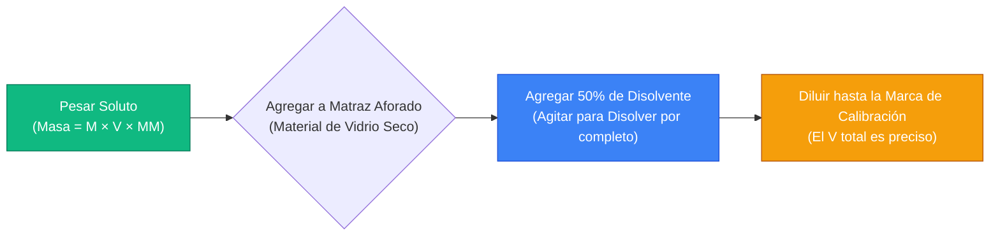
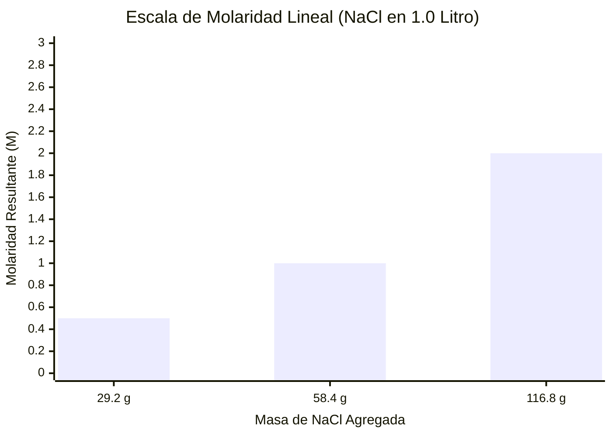
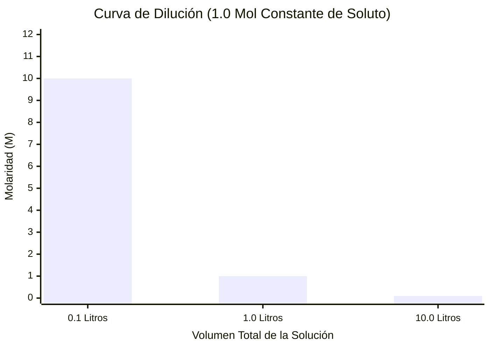
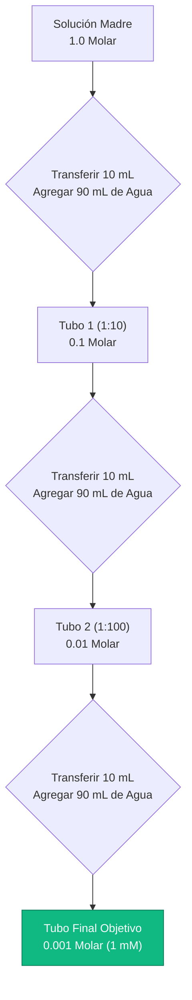
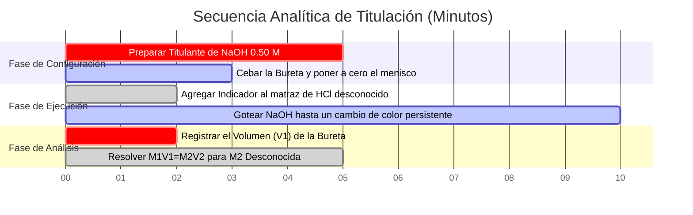

# La Calculadora de Molaridad Definitiva: Estequiometría de Moles, Masa y Dilución

Bienvenido a la **Calculadora de Molaridad** definitiva y a la guía completa de ingeniería de soluciones químicas. Ya sea que sea un estudiante de Química AP luchando con las tareas de estequiometría, un estudiante de farmacología médica calculando concentraciones de goteo intravenoso o un ingeniero químico industrial que amplía un lote de 10,000 litros de ácido sulfúrico, dominar las matemáticas de la molaridad es absolutamente innegociable.

La química es la ciencia de las reacciones, y la gran mayoría de las reacciones químicas ocurren dentro de soluciones líquidas. Si calcula incorrectamente la masa requerida de su soluto, su experimento fallará. Si comprende mal la ecuación de dilución fundamental $M_1 V_1 = M_2 V_2$, podría administrar accidentalmente una sobredosis letal de un fármaco en un entorno clínico. Si no comprende la diferencia física entre Molaridad (dependiente de la temperatura) y Molalidad (independiente de la temperatura), sus calibraciones analíticas de precisión serán inherentemente erróneas.

En esta clase magistral exhaustiva de SEO de más de 4,000 palabras, deconstruiremos por completo las matemáticas fundamentales de la Concentración de Soluciones, expondremos las complejidades ocultas de la preparación de matraces aforados, probaremos matemáticamente la conservación de la masa en la dilución y descifraremos las fórmulas estequiométricas exactas requeridas para preparar mezclas químicas complejas desde cero. Para garantizar una comprensión absoluta, hemos incluido cinco diagramas interactivos de Mermaid.js meticulosamente detallados y seguros para el analizador.

---

## 1. La Física Fundamental de la Molaridad (M = n / V)

El concepto absolutamente más crítico en la química de soluciones es comprender la estricta definición matemática de la **Molaridad ($M$)**. 

La molaridad es una métrica de ingeniería que cuantifica la concentración de una solución química, expresada estrictamente como el número de **moles de soluto** disueltos por **Litro de solución total**.
- Una solución $1.0\text{ M}$ (Un Molar) de Cloruro de Sodio ($\text{NaCl}$) contiene exactamente $1.0$ mol de moléculas de $\text{NaCl}$ dispersas dentro de $1.0$ Litro de volumen físico total.
- NO significa $1.0$ mol de soluto agregado a $1.0$ Litro de agua pura (ese es un error común y catastrófico que discutiremos más adelante).

**La Ecuación Principal:**
$$\text{Molaridad (M)} = \frac{\text{Moles de Soluto (n)}}{\text{Volumen de Solución (Litros)}}$$

### El Concepto del Mol ($n$)
Antes de poder calcular la molaridad, debe comprender qué es un "mol". No puede contar átomos individuales con pinzas; son demasiado pequeños. En su lugar, los químicos utilizan el **Número de Avogadro** ($6.022 \times 10^{23}$). 
Un mol de CUALQUIER sustancia contiene exactamente $6.022 \times 10^{23}$ partículas.
Sin embargo, debido a que los átomos tienen pesos físicos diferentes, un mol de Carbono pesa $12.011$ gramos, mientras que un mol de Plomo pesa unos masivos $207.2$ gramos. A esto se le conoce como **Masa Molar ($\text{MM}$)**.

**La Ecuación de Moles:**
$$\text{Moles de Soluto (n)} = \frac{\text{Masa Física (gramos)}}{\text{Masa Molar (g/mol)}}$$

### Calcular la Masa a partir de la Molaridad
En el mundo real, las balanzas de laboratorio miden la masa en gramos, no en moles. Para preparar una solución física en un vaso de precipitados, debe combinar las dos ecuaciones anteriores en la Fórmula de Preparación de Soluciones universal:

**La Fórmula de Preparación de Soluciones:**
$$\text{Masa Requerida (gramos)} = \text{Molaridad Objetivo (M)} \times \text{Volumen (L)} \times \text{Masa Molar (g/mol)}$$

**Ejemplo de Cálculo:**
Necesita preparar $500\text{ mL}$ ($0.500\text{ L}$) de una solución $0.200\text{ M}$ de Glucosa ($\text{C}_6\text{H}_{12}\text{O}_6$). La masa molar de la Glucosa es $180.156\text{ g/mol}$.
$\text{Masa Requerida} = 0.200\text{ M} \times 0.500\text{ L} \times 180.156\text{ g/mol} = \mathbf{18.015\text{ gramos}}$.
Pesará $18.015\text{ g}$ de polvo de glucosa.

---

## 2. La Restricción del Matraz Aforado (Un Error Crítico)

El error más común que cometen los estudiantes de química de primer año es agregar el soluto al volumen final del disolvente.

Si toma $18.015\text{ g}$ de glucosa y los vierte en exactamente $500\text{ mL}$ de agua pura, el volumen final de su solución será **mayor que** $500\text{ mL}$ porque la masa física de la glucosa sólida ocupa espacio físico y desplaza el agua. Su molaridad resultante será incorrectamente baja.

**El Protocolo Volumétrico Correcto:**
1. Pese los $18.015\text{ g}$ de glucosa.
2. Agréguelo a un **Matraz Aforado** seco de $500\text{ mL}$.
3. Agregue solo $300\text{ mL}$ de agua para disolver el sólido por completo.
4. Una vez completamente disuelto, agregue lentamente agua gota a gota hasta que la parte inferior del menisco líquido toque exactamente la línea de calibración de $500\text{ mL}$ en el cuello del matraz.

Este protocolo garantiza que el **volumen final total** de la mezcla (soluto + disolvente) sea exactamente $500\text{ mL}$, asegurando una concentración matemáticamente perfecta de $0.200\text{ M}$.

---

## 3. La Ecuación de Dilución ($M_1V_1 = M_2V_2$)

En laboratorios profesionales, los científicos no preparan soluciones débiles desde cero. En su lugar, preparan enormes cubas de **Soluciones Madre** altamente concentradas (ej., Ácido Clorhídrico $10.0\text{ M}$). Cuando necesitan una concentración más débil (ej., $1.0\text{ M}$) para un experimento, extraen un pequeño volumen de la solución madre y lo diluyen con agua pura.

Cuando diluye una solución agregando agua, el **volumen total aumenta**, la **molaridad disminuye**, pero el **número total de partículas de soluto (moles) permanece completamente inalterado**.

Debido a que $\text{Moles} = \text{Molaridad} \times \text{Volumen}$, y los moles permanecen constantes antes y después de la dilución, derivamos la Ley de Dilución universal:

**La Fórmula de Dilución:**
$$M_1 \times V_1 = M_2 \times V_2$$

Donde:
- $M_1$ = Concentración Inicial de la Solución Madre
- $V_1$ = Volumen Inicial extraído de la Solución Madre (La incógnita que usualmente resolvemos)
- $M_2$ = Concentración Final Objetivo de la Solución Diluida
- $V_2$ = Volumen Final Objetivo de la Solución Diluida

**Ejemplo de Cálculo:**
Necesita $2.0\text{ Litros}$ ($V_2$) de $\text{HCl}$ al $0.50\text{ M}$ ($M_2$) para un experimento. Tiene una jarra de $\text{HCl}$ madre al $12.0\text{ M}$ ($M_1$). ¿Cuánta solución madre extrae?
$$12.0\text{ M} \times V_1 = 0.50\text{ M} \times 2.0\text{ L}$$
$$V_1 = \frac{0.50 \times 2.0}{12.0} = \mathbf{0.0833\text{ Litros (83.3 mL)}}$$

**Cálculo del Agua Agregada:**
Extrae $83.3\text{ mL}$ del ácido altamente peligroso al $12.0\text{ M}$. Para alcanzar el volumen final de $2.0\text{ Litros}$ ($2000\text{ mL}$), ¿cuánta agua pura debe agregar?
$$\text{Agua Agregada} = V_2 - V_1 = 2000\text{ mL} - 83.3\text{ mL} = \mathbf{1916.7\text{ mL}}$$

---

## 4. Cinco Escenarios Conceptuales de Ingeniería con Visualizaciones 2D

Para dominar completamente las relaciones físicas que rigen las soluciones químicas, exploraremos cinco escenarios de laboratorio distintos desglosados visualmente usando diagramas personalizados de Mermaid.js.

### Ejemplo 1: El Flujo de Preparación de la Solución

**El Escenario:**
Un técnico de laboratorio necesita preparar físicamente una solución de molaridad específica a partir de un polvo químico seco.

**Visualización 2D:**
Este diagrama de flujo lógico mapea la secuencia cronológica estricta requerida para usar correctamente un matraz aforado, previniendo el error de desplazamiento de volumen discutido anteriormente.

---

### Ejemplo 2: Escala de Masa vs Molaridad

**El Escenario:**
Un estudiante está preparando $1.0\text{ Litro}$ de solución de $\text{NaCl}$ y quiere entender cómo aumenta linealmente la molaridad a medida que agrega más masa física de sal al vaso de precipitados.

**Las Matemáticas:**
Debido a que la Masa Molar ($\text{MM}$) y el Volumen ($V$) se mantienen constantes, la Molaridad ($M$) se vuelve directamente proporcional a la Masa.

**Visualización 2D:**
Este gráfico traza la correlación lineal directa entre los gramos de $\text{NaCl}$ agregados a $1.0\text{ L}$ de agua y la molaridad de la solución resultante.

---

### Ejemplo 3: La Curva de Volumen de Dilución

**El Escenario:**
Un químico toma $0.1\text{ Litros}$ de una solución madre al $10.0\text{ M}$ y comienza a agregar agua. Quieren rastrear cómo la concentración molar cae en picado exponencialmente a medida que el volumen total se amplía.

**Las Matemáticas:**
Dado que los moles de soluto están atrapados exactamente en $1.0\text{ mol}$ ($10.0\text{ M} \times 0.1\text{ L}$), la Molaridad ($M = 1.0 / V$) cae como una función inversa del volumen total.

**Visualización 2D:**
Este gráfico prueba gráficamente la relación inversa que rige la ley de dilución $M_1 V_1 = M_2 V_2$.

---

### Ejemplo 4: La Arquitectura de Dilución en Serie

**El Escenario:**
Un microbiólogo necesita una solución extremadamente diluida al $0.001\text{ M}$ ($1\text{ mM}$) para un cultivo bacteriano, comenzando con una solución madre al $1.0\text{ M}$. Pipetear directamente los microlitros requeridos en una enorme cuba de agua es demasiado inexacto. Deben realizar una Dilución en Serie.

**Visualización 2D:**
Este diagrama de flujo de arriba hacia abajo mapea una cascada de dilución en serie paso a paso de 1:10, demostrando cómo pasar $10\text{ mL}$ de solución a $90\text{ mL}$ de agua divide sucesivamente la concentración por 10 en cada etapa.

---

### Ejemplo 5: Cronograma de Titulación Ácido-Base

**El Escenario:**
Un químico analítico utiliza una bureta con $\text{NaOH}$ conocido al $0.50\text{ M}$ para neutralizar un matraz con una molaridad desconocida de $\text{HCl}$. Rastrean la secuencia de eventos de laboratorio requeridos para ejecutar el análisis.

**Visualización 2D:**
Este diagrama de Gantt visualiza la secuencia cronológica de un experimento de titulación química, desde la preparación de reactivos hasta la derivación matemática estequiométrica.

---

## 5. Conclusión y Reto de Química

Dominar los cálculos de Molaridad es la base fundamental de toda la química cuantitativa. Comprender la diferencia entre masa de soluto y moles químicos, respetar las leyes físicas de desplazamiento de volumen de los matraces aforados y modelar matemáticamente los procesos de dilución garantizará que sus experimentos de laboratorio produzcan resultados precisos y reproducibles.

Si ignora estos principios matemáticos, sus diluciones en serie agravarán errores catastróficos, sus cultivos celulares biológicos morirán por choque osmótico debido a concentraciones hipertónicas y sus reacciones de escalamiento industrial producirán subproductos contaminados.

Para asegurarse de haber dominado estos conceptos críticos, inicie nuestro Simulador interactivo e intente resolver estos desafíos estequiométricos finales:
1. **El Desafío de Masa:** Necesita preparar $250\text{ mL}$ de una solución $0.050\text{ M}$ de Sulfato de Cobre(II) Pentahidratado ($\text{CuSO}_4\cdot 5\text{H}_2\text{O}$, $\text{MM} = 249.68\text{ g/mol}$). ¿Exactamente cuántos miligramos debe pesar en la balanza analítica?
2. **El Desafío de Dilución:** Accidentalmente vertió $150\text{ mL}$ de agua pura en un vaso de precipitados que contenía $50\text{ mL}$ de solución madre al $2.0\text{ M}$. ¿Cuál es la molaridad final exacta de su mezcla arruinada?
3. **El Desafío de Moles:** Una bolsa de goteo intravenoso contiene $1000\text{ mL}$ de $\text{NaCl}$ al $0.154\text{ M}$ (Solución Salina Normal). ¿Exactamente cuántos moles totales de iones $\text{Na}^+$ recibirá el paciente durante la infusión?

Confíe en esta calculadora para auditar sus tareas, precalcular sus protocolos de laboratorio y dominar permanentemente las matemáticas de las soluciones químicas.
