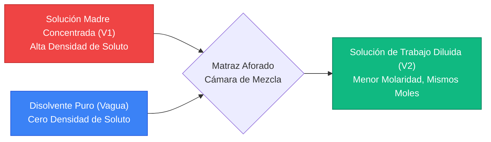
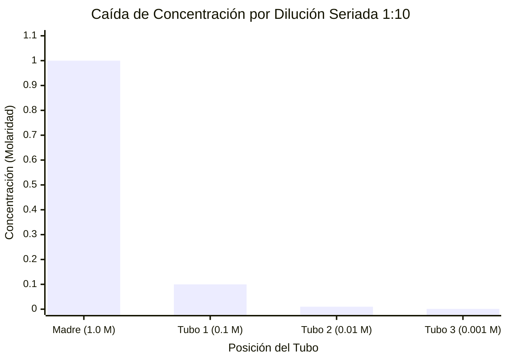
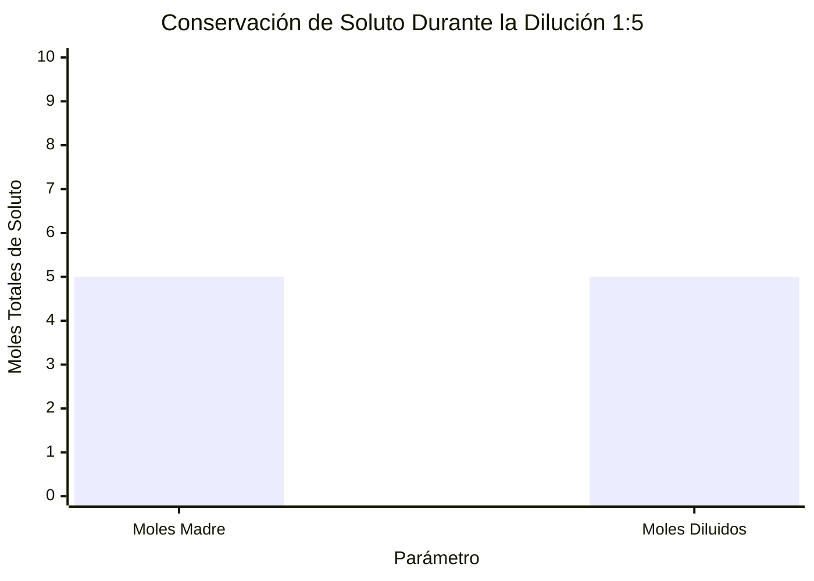
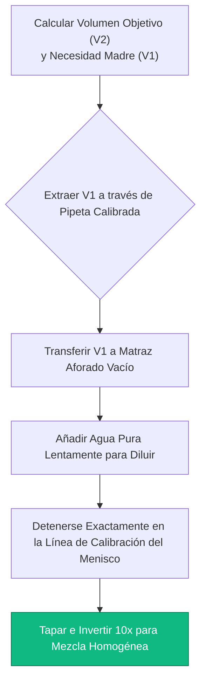
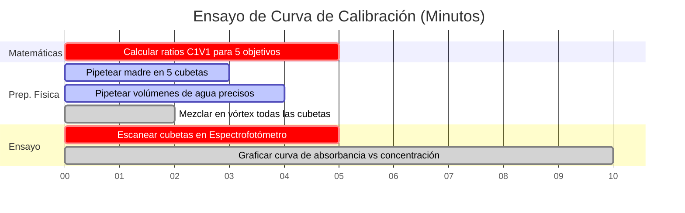

# La Calculadora Definitiva de Dilución de Molaridad: $C_1 V_1 = C_2 V_2$ y Preparación de Soluciones

Bienvenido a la **Calculadora de Dilución de Molaridad** definitiva y guía completa de preparación de soluciones de laboratorio. Ya sea un estudiante de química de secundaria aprendiendo la ecuación fundamental $C_1 V_1 = C_2 V_2$, un bioquímico preparando soluciones tampón complejas para la extracción de proteínas o un microbiólogo ejecutando diluciones seriadas precisas para calcular unidades formadoras de colonias bacterianas, dominar la dilución de soluciones es la base mecánica ineludible de la ciencia experimental.

Comprar soluciones químicas premezcladas a concentraciones exactas es prohibitivamente costoso y tremendamente ineficiente. En cambio, los laboratorios modernos compran **Soluciones Madre** altamente concentradas. Pipeteando microvolúmenes precisos de estos concentrados densos y diluyéndolos con un disolvente puro (típicamente agua desionizada), los químicos pueden fabricar instantáneamente volúmenes infinitos de soluciones de trabajo personalizadas a demanda.

En esta clase magistral exhaustiva de SEO de más de 4000 palabras, deconstruiremos por completo la termodinámica de la conservación de solutos, demostraremos matemáticamente el algoritmo de dilución $C_1 V_1 = C_2 V_2$, decodificaremos la mecánica de decaimiento exponencial de las diluciones seriadas y expondremos los errores de laboratorio más comunes que destruyen la precisión de la solución. Para garantizar la comprensión absoluta, hemos incluido cinco diagramas interactivos Mermaid.js, detallados meticulosamente y seguros para el analizador.

---

## 1. La Física Central de la Dilución: Conservación del Soluto

Antes de memorizar cualquier ecuación matemática, debe comprender la física fundamental de un evento de dilución. 

Cuando diluye una solución madre concentrada, *solo* está agregando disolvente puro (agua). El disolvente puro contiene absolutamente cero partículas de soluto. Por lo tanto, el número total de moléculas de soluto flotando en su vaso de precipitados permanece estricta y matemáticamente constante.

**La Regla de Oro de la Dilución:**
$$(\text{Moles Totales de Soluto Antes}) = (\text{Moles Totales de Soluto Después})$$

Dado que la Molaridad ($M$) se define como Moles por Litro ($\text{mol}/V$), podemos reorganizar la definición para demostrar que $\text{Moles} = M \times V$. 
Si los moles nunca cambian durante la dilución, entonces:
$$M_{\text{inicial}} \times V_{\text{inicial}} = M_{\text{final}} \times V_{\text{final}}$$

Esto produce la mundialmente famosa ecuación de dilución, enseñada universalmente a todos los estudiantes de química en la Tierra:
$$C_1 V_1 = C_2 V_2$$

*(Nota: $C$ significa Concentración y $V$ significa Volumen. $M_1 V_1 = M_2 V_2$ es exactamente la misma ecuación, restringiendo específicamente la concentración a la Molaridad).*

---

## 2. Resolviendo la Matriz $C_1 V_1 = C_2 V_2$

La ecuación de dilución contiene cuatro variables. Si un protocolo de laboratorio proporciona tres variables cualquiera, puede calcular fácilmente la cuarta usando álgebra básica.

### Escenario A: Encontrar el Volumen Madre Requerido ($V_1$)
Un protocolo de laboratorio le requiere preparar $500\text{ mL}$ de una solución de trabajo de Ácido Clorhídrico ($\text{HCl}$) a $0.5\text{ M}$. Su armario de almacenamiento de productos químicos contiene una solución madre de $\text{HCl}$ altamente concentrada a $12.0\text{ M}$. ¿Cuánta solución madre necesita pipetear?

**Dado:**
- $C_1 = 12.0\text{ M}$ (Madre)
- $C_2 = 0.5\text{ M}$ (Objetivo)
- $V_2 = 500\text{ mL}$ (Objetivo)

**Cálculo:**
$$V_1 = \frac{C_2 \times V_2}{C_1} = \frac{0.5 \times 500}{12.0} = \mathbf{20.83\text{ mL}}$$

Debe extraer cuidadosamente $20.83\text{ mL}$ de la peligrosa solución madre a $12.0\text{ M}$.

### Escenario B: Calcular el Volumen de Disolvente Añadido ($V_{\text{agua}}$)
En el Escenario A, pipeteó $20.83\text{ mL}$ de solución madre. Su volumen objetivo final es $500\text{ mL}$. ¿Cuánta agua desionizada pura debe agregar?
$$V_{\text{agua}} = V_2 - V_1 = 500\text{ mL} - 20.83\text{ mL} = \mathbf{479.17\text{ mL de Agua}}$$

---

## 3. El Poder de las Diluciones Seriadas

Cuando un científico necesita una concentración exponencialmente menor que la solución madre (ej., diluir una solución madre de $1.0\text{ M}$ a $0.000001\text{ M}$), ejecutar un solo paso de dilución es físicamente imposible. El volumen madre requerido ($V_1$) sería mucho más pequeño que una gota microscópica, excediendo los límites de precisión de las pipetas de laboratorio modernas.

La solución es una **Dilución Seriada**: una secuencia de diluciones escalonadas idénticas que desencadenan un rápido decaimiento exponencial de la concentración.

### La Secuencia de Dilución Seriada 1:10
Una dilución 1:10 significa que $1\text{ parte de solución madre}$ se mezcla con $9\text{ partes de disolvente}$, produciendo $10\text{ partes de volumen total}$. Esto divide perfectamente la concentración por $10$ (un Factor de Dilución de 10).

1. **Tubo 1 ($10^{-1}$):** Mezcle $1\text{ mL}$ de Madre ($1.0\text{ M}$) + $9\text{ mL}$ de Agua $\rightarrow$ Nueva Concentración = $0.100\text{ M}$.
2. **Tubo 2 ($10^{-2}$):** Mezcle $1\text{ mL}$ del Tubo 1 + $9\text{ mL}$ de Agua $\rightarrow$ Nueva Concentración = $0.010\text{ M}$.
3. **Tubo 3 ($10^{-3}$):** Mezcle $1\text{ mL}$ del Tubo 2 + $9\text{ mL}$ de Agua $\rightarrow$ Nueva Concentración = $0.001\text{ M}$.

Al transferir secuencialmente la solución previamente diluida, los científicos pueden lograr concentraciones nanomolares extremas con una precisión estadística masiva.

---

## 4. Mejores Prácticas de Laboratorio y Trampas Mortales de Seguridad

Ejecutar diluciones en papel es limpio e impecable; ejecutar diluciones en un laboratorio físico introduce caos, error humano y riesgos extremos para la seguridad.

**1. La Trampa del Ácido Exotérmico (Siempre Añadir Ácido al Agua):**
Cuando se diluye ácido sulfúrico concentrado ($\text{H}_2\text{SO}_4$) con agua, la termodinámica de hidratación libera calor violentamente. Si vierte agua *dentro* de un vaso de precipitados de ácido concentrado, el agua hierve al instante, explotando ácido hirviendo en su cara. *Siempre* debe verter lentamente el ácido *dentro* de un gran volumen de agua para disipar de manera segura la energía térmica.

**2. El Error de Lectura del Menisco:**
Al preparar una solución en un matraz aforado, la superficie del líquido se curva hacia abajo, formando una forma de 'U' llamada menisco. Debe alinear su ojo perfectamente horizontal con la línea de calibración de vidrio, asegurándose de que la parte inferior absoluta del menisco toque la línea. Ver desde un ángulo alto o bajo induce un error de paralaje, arruinando su volumen final ($V_2$).

**3. La Paradoja de la Contracción Volumétrica:**
Si mezcla $50\text{ mL}$ de agua y $50\text{ mL}$ de etanol puro, el volumen final NO es $100\text{ mL}$; es de aproximadamente $96\text{ mL}$. Diferentes moléculas se empaquetan de manera diferente (como verter arena en un cubo de pelotas de golf). Por lo tanto, nunca debe medir los volúmenes de disolvente por separado. Siempre transfiera su volumen madre ($V_1$) a un matraz aforado primero, y luego simplemente llene el matraz *hasta* la línea de volumen total ($V_2$).

---

## 5. Cinco Escenarios de Ingeniería Conceptual con Visualizaciones 2D

Para dominar completamente los algoritmos mecánicos que rigen la reducción de la concentración, la conservación del soluto y los ensayos secuenciales en serie, exploraremos cinco escenarios distintos de química analítica desglosados visualmente usando diagramas personalizados de Mermaid.js.

### Ejemplo 1: La Arquitectura del Mecanismo de Dilución

**El Escenario:**
Un estudiante de biología de primer año está tratando de mapear el flujo de masa mecánico de un protocolo de dilución madre de un solo paso.

**Visualización 2D:**
Este diagrama de flujo mapea visualmente cómo el concentrado madre y el disolvente puro chocan dentro de un matraz aforado para generar una solución de trabajo diluida, estable y homogénea.

---

### Ejemplo 2: Decaimiento de la Concentración por Dilución Seriada

**El Escenario:**
Un microbiólogo ejecuta una dilución seriada de 3 pasos 1:10 para reducir la letalidad de un compuesto antibiótico antes de probarlo en células bacterianas vivas.

**Visualización 2D:**
Este gráfico rastrea visualmente la caída exponencial masiva en la concentración molar a medida que el protocolo de dilución avanza por la gradilla de tubos de ensayo.

---

### Ejemplo 3: La Prueba de Conservación del Soluto

**El Escenario:**
Una profesora de química intenta demostrar a sus alumnos que agregar galones de agua a una solución salina no crea ni destruye mágicamente las moléculas de sal.

**Visualización 2D:**
Este gráfico comparativo demuestra visualmente que, si bien la Concentración ($M$) y el Volumen ($V$) fluctúan drásticamente durante la dilución, la masa total de las partículas de soluto está bloqueada matemáticamente.

---

### Ejemplo 4: Protocolo de Preparación en Matraz Aforado

**El Escenario:**
Un técnico de laboratorio mapea el estricto procedimiento operativo estándar (POE) requerido para certificar legalmente una solución analítica estándar para pruebas industriales de alimentos.

**Visualización 2D:**
Este diagrama de flujo de arriba hacia abajo actúa como una receta química estricta, imponiendo la secuencia absoluta de acciones requeridas para evitar errores de contracción de volumen y riesgos térmicos.

---

### Ejemplo 5: Línea de Tiempo del Ensayo de Espectrofotometría

**El Escenario:**
Un químico analítico debe preparar un gradiente de soluciones colorantes perfectamente espaciadas para calibrar el láser de absorbancia de un espectrofotómetro.

**Visualización 2D:**
Este diagrama de Gantt visualiza la secuencia cronológica de un ensayo de calibración de varios pasos, desde las matemáticas y la dilución física hasta la calibración definitiva del láser.

---

## 6. Conclusión y Desafío de Estequiometría

Dominar el algoritmo de dilución $C_1 V_1 = C_2 V_2$ es un requisito de ingreso no negociable para entrar en cualquier laboratorio biológico, químico o médico en la Tierra. Comprender la rigidez matemática de la conservación de solutos, la necesidad de cristalería volumétrica para vencer la contracción de volumen y el poder exponencial de las diluciones seriadas garantizará que sus soluciones de trabajo funcionen exactamente como se pretende.

Si no logra dominar estos algoritmos, sus tampones matarán instantáneamente los cultivos celulares, sus espectrómetros de masas se aplanarán y sus datos experimentales se corromperán por completo debido a errores humanos.

Para garantizar que haya dominado estos conceptos críticos, encienda nuestro Simulador interactivo e intente resolver estos desafíos finales de química analítica:
1. **El Desafío del Ácido:** Necesita $250\text{ mL}$ de $\text{H}_2\text{SO}_4$ a $2.5\text{ M}$. Su madre es de $18.0\text{ M}$. ¿Exactamente cuántos mL de madre debe pipetear con cuidado? 
2. **El Desafío de Evaporación (Dilución Inversa):** Tiene $500\text{ mL}$ de una solución salina de $1.0\text{ M}$. Hierve el vaso de precipitados hasta que se evaporan exactamente $200\text{ mL}$ de agua. ¿Cuál es la Molaridad recién concentrada de la solución sobreviviente? (Pista: Use $C_1 V_1 = C_2 V_2$, pero su $V_2$ es $500 - 200 = 300\text{ mL}$).
3. **El Desafío Seriado:** Ejecuta una dilución 1:5. Luego toma ese tubo y ejecuta una dilución 1:10. Luego toma *ese* tubo y ejecuta una dilución 1:2. ¿Cuál es el Factor de Dilución acumulativo total?

Confíe en esta calculadora para auditar sus protocolos de laboratorio, verificar visualmente su conservación de partículas y dominar permanentemente la termodinámica de la dilución de soluciones.
