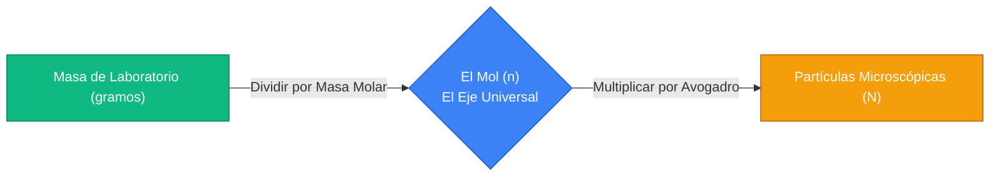
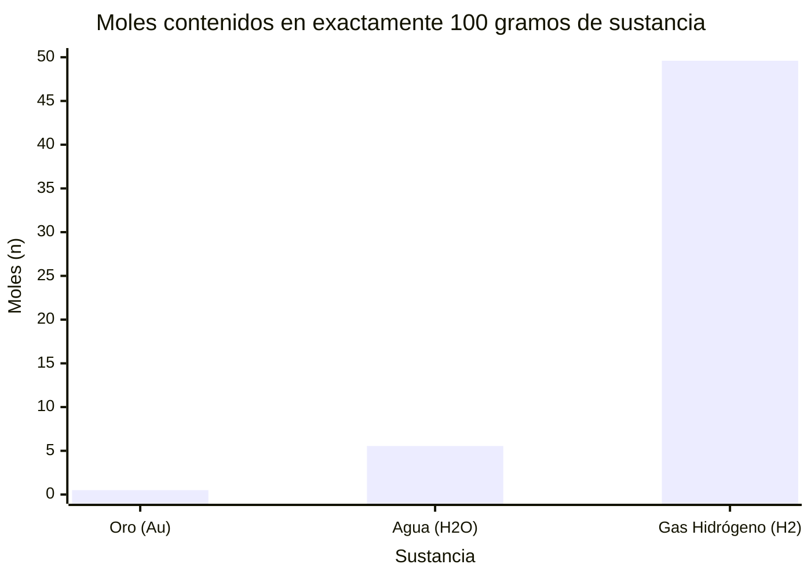
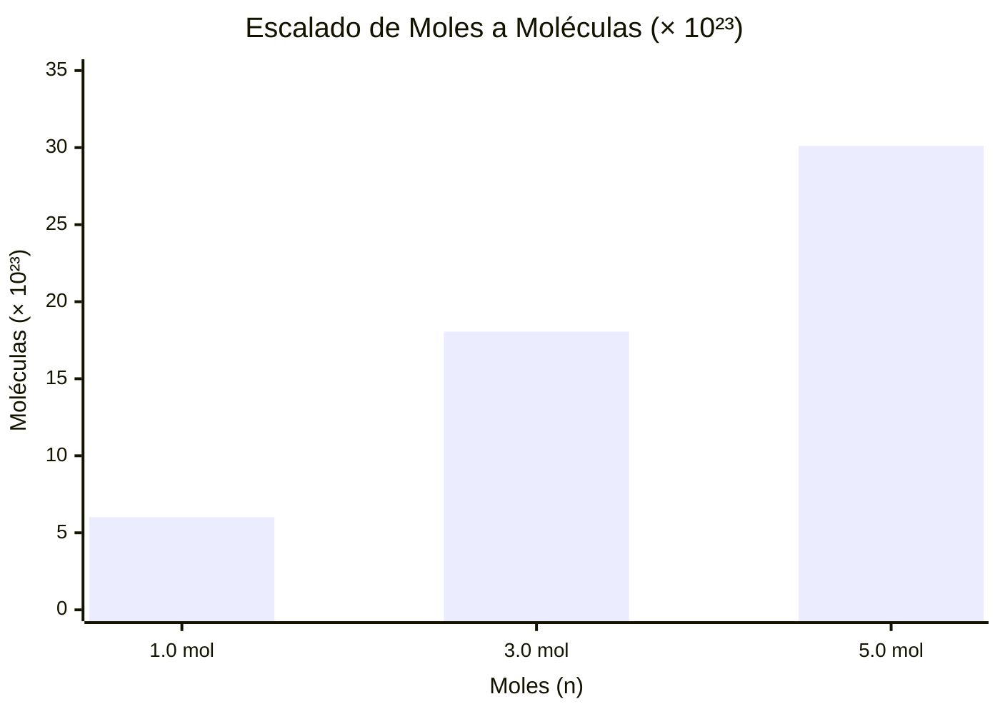
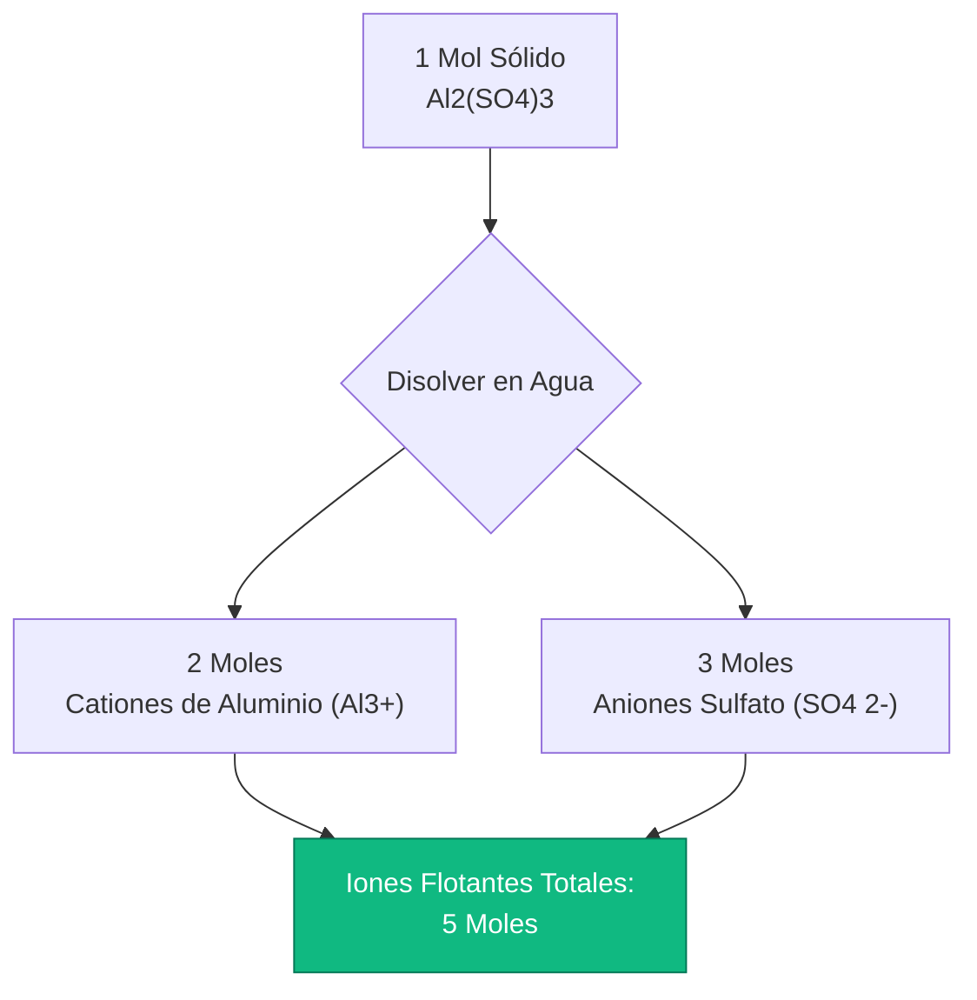
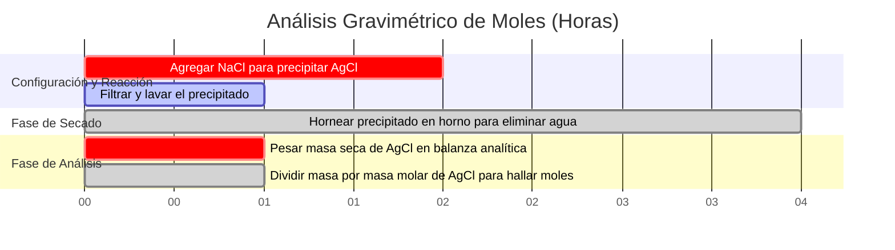

# La Calculadora Definitiva de Moles: Masa, Masa Molar y el Número de Avogadro

Bienvenido a la **Calculadora de Moles** definitiva y guía integral de estequiometría química. Ya sea que seas un estudiante de secundaria balanceando tu primera ecuación química, un químico analítico calculando el rendimiento teórico para una síntesis orgánica, o un ingeniero farmacéutico dosificando ingredientes activos en miligramos, dominar el concepto del Mol químico es la base absoluta de toda la ciencia cuantitativa.

La química es el estudio de cómo interactúan los átomos. El problema fundamental es que los átomos son inimaginablemente pequeños; una sola gota de agua contiene más moléculas de $\text{H}_2\text{O}$ que estrellas hay en el universo observable. Debido a que las balanzas de laboratorio miden la **Masa (gramos)** macroscópica, pero las ecuaciones químicas dictan los conteos microscópicos de **Moléculas**, los científicos necesitaron un puente matemático para conectar los dos mundos. Ese puente es el **Mol**.

En esta exhaustiva clase magistral de SEO de más de 4,000 palabras, deconstruiremos por completo el concepto del número de Avogadro, demostraremos matemáticamente la conversión entre la masa física y las partículas microscópicas, expondremos la diferencia crítica entre moléculas y unidades formulares, y decodificaremos cómo las sales iónicas complejas se fragmentan en iones independientes. Para garantizar una comprensión absoluta, hemos incluido cinco diagramas interactivos de Mermaid.js meticulosamente detallados y seguros para el analizador.

---

## 1. La Física del Mol ($n$) y el Número de Avogadro ($N_A$)

El concepto más crítico en toda la química es entender que el "Mol" es simplemente una unidad de conteo. 
- Una "docena" significa exactamente 12 de algo. 
- Una "gruesa" significa exactamente 144 de algo.
- Un **"Mol" ($n$)** significa exactamente **$6.02214076 \times 10^{23}$** de algo.

Este número astronómicamente masivo se conoce como la **Constante de Avogadro ($N_A$)**.
Si tuvieras un mol de canicas, cubrirían toda la superficie de la Tierra hasta una profundidad de varias millas. Sin embargo, dado que los átomos son tan pequeños, un mol de agua líquida es solo $18.015\text{ mL}$ (aproximadamente una cucharada).

**La Ecuación de Partículas:**
$$\text{Número de Partículas (N)} = \text{Moles (n)} \times \text{Número de Avogadro (}N_A\text{)}$$

### ¿Qué es una "Partícula"?
El término "partícula" es un marcador de posición genérico. Debes usar la terminología correcta según la sustancia química:
- **Átomos:** Para elementos puros (por ejemplo, $1.0\text{ mol}$ de Oro = $6.022 \times 10^{23}\text{ átomos de Oro}$).
- **Moléculas:** Para compuestos unidos covalentemente (por ejemplo, $1.0\text{ mol}$ de $\text{H}_2\text{O}$ = $6.022 \times 10^{23}\text{ moléculas de Agua}$).
- **Unidades Formulares:** Para redes cristalinas iónicas (por ejemplo, $1.0\text{ mol}$ de $\text{NaCl}$ = $6.022 \times 10^{23}\text{ unidades formulares de NaCl}$).
- **Iones:** Para partículas cargadas disueltas (por ejemplo, $1.0\text{ mol}$ de $\text{Na}^+$ = $6.022 \times 10^{23}\text{ iones de Sodio}$).

---

## 2. Masa Molar: El Puente Entre la Masa y los Moles

Para cerrar la brecha entre el conteo de partículas microscópicas y el pesaje de polvos macroscópicos en el laboratorio, utilizamos la **Masa Molar ($\text{MM}$)**.
La Masa Molar de cualquier sustancia química se define con precisión como la masa física (en gramos) de exactamente $1.0\text{ mol}$ de esa sustancia.

Al observar la Tabla Periódica, vemos que el peso atómico del Carbono es $12.011$. Esto significa que exactamente $1.0\text{ mol}$ de átomos de Carbono pesa exactamente $12.011\text{ gramos}$.

**Cálculo de la Masa Molar de un Compuesto:**
Para encontrar la masa molar de una molécula compleja como la Glucosa ($\text{C}_6\text{H}_{12}\text{O}_6$), sumamos los pesos atómicos de todos sus átomos constituyentes:
- Carbono ($6 \times 12.011$) = $72.066\text{ g/mol}$
- Hidrógeno ($12 \times 1.008$) = $12.096\text{ g/mol}$
- Oxígeno ($6 \times 15.999$) = $95.994\text{ g/mol}$
- **Masa Molar Total** = $180.156\text{ g/mol}$

**La Ecuación de Masa a Mol:**
$$\text{Moles (n)} = \frac{\text{Masa Física (gramos)}}{\text{Masa Molar (g/mol)}}$$

Si pesas $90.078\text{ gramos}$ de polvo de Glucosa en una balanza de laboratorio, posees exactamente $0.50\text{ moles}$ de Glucosa.

---

## 3. Estequiometría Avanzada: Conteo de Átomos e Iones

El concepto del mol se vuelve significativamente más complejo cuando te das cuenta de que una sola molécula química está compuesta por múltiples subpartículas.

### Conteo de Átomos Covalentes
Considera exactamente $1.0\text{ mol}$ de Agua ($\text{H}_2\text{O}$).
- Tienes $1.0\text{ mol}$ de **moléculas** de $\text{H}_2\text{O}$ ($6.022 \times 10^{23}\text{ moléculas}$).
- Dado que cada molécula contiene exactamente $2$ átomos de Hidrógeno, posees $2.0\text{ moles}$ de **átomos** de Hidrógeno ($1.204 \times 10^{24}\text{ átomos de H}$).
- Dado que cada molécula contiene exactamente $1$ átomo de Oxígeno, posees $1.0\text{ mol}$ de **átomos** de Oxígeno ($6.022 \times 10^{23}\text{ átomos de O}$).
- En total, tu único mol de moléculas de agua contiene **$3.0\text{ moles}$ de átomos totales**.

### Conteo de Disociación Iónica
Cuando las sales iónicas se disuelven en agua, se rompen físicamente en iones flotantes independientes. Esto es crítico para la electroquímica y las propiedades coligativas.
Considera $1.0\text{ mol}$ de Cloruro de Calcio ($\text{CaCl}_2$).
- El $\text{CaCl}_2$ se disocia físicamente en un ion $\text{Ca}^{2+}$ y dos iones $\text{Cl}^-$.
- $\text{CaCl}_2 \rightarrow \text{Ca}^{2+} + 2\text{Cl}^-$
- Por lo tanto, $1.0\text{ mol}$ de polvo sólido de $\text{CaCl}_2$ genera **$3.0\text{ moles}$ de iones disueltos**.

---

## 4. Cinco Escenarios Conceptuales de Ingeniería con Visualizaciones 2D

Para dominar completamente las relaciones físicas que gobiernan los moles, la masa y las partículas, exploraremos cinco escenarios de laboratorio distintos desglosados visualmente usando diagramas personalizados de Mermaid.js.

### Ejemplo 1: El Flujo Universal de Conversión de Moles

**El Escenario:**
Un estudiante de química necesita convertir un bloque de $50.0\text{ gramos}$ de hierro sólido en un conteo exacto de átomos individuales de hierro.

**Visualización 2D:**
Este diagrama de flujo lógico traza la vía de conversión bipartita estricta. No puedes saltar directamente de la masa a las partículas; siempre debes convertir a través del eje central del "Mol".

---

### Ejemplo 2: Masa vs Moles (Variación de Densidad de la Sustancia)

**El Escenario:**
Un investigador tiene exactamente $100.0\text{ gramos}$ de tres sustancias diferentes: gas Hidrógeno ($\text{H}_2$), Agua líquida ($\text{H}_2\text{O}$) y Oro sólido ($\text{Au}$). Dado que sus masas molares difieren radicalmente, la cantidad de moles (y, por lo tanto, de partículas) presentes en esa masa de $100\text{g}$ difiere enormemente.

**Las Matemáticas:**
- $\text{H}_2$: $100\text{g} / 2.016\text{ g/mol} = 49.6\text{ moles}$.
- $\text{H}_2\text{O}$: $100\text{g} / 18.015\text{ g/mol} = 5.55\text{ moles}$.
- $\text{Au}$: $100\text{g} / 196.97\text{ g/mol} = 0.50\text{ moles}$.

**Visualización 2D:**
Este gráfico demuestra visualmente que masas físicas iguales NO equivalen a conteos de partículas iguales. Los átomos pesados como el oro producen muy pocas partículas por gramo.

---

### Ejemplo 3: El Efecto de Multiplicación de Avogadro

**El Escenario:**
Un profesor de secundaria quiere demostrar visualmente qué tan rápido aumenta el número de partículas a medida que se incrementa el número de moles de $1.0$ a $5.0$.

**Las Matemáticas:**
La relación es estrictamente lineal, pero la pendiente es un valor increíblemente empinado de $6.022 \times 10^{23}$.

**Visualización 2D:**
Este gráfico traza la correlación directa entre moles y moléculas totales (escalado por $10^{23}$).

---

### Ejemplo 4: La Arquitectura de Fragmentación Iónica (Disociación)

**El Escenario:**
Un electroquímico disuelve exactamente $1.0\text{ mol}$ de Sulfato de Aluminio sólido ($\text{Al}_2(\text{SO}_4)_3$) en agua y necesita mapear el conteo molar exacto de los cationes y aniones resultantes.

**Visualización 2D:**
Este diagrama de flujo de arriba hacia abajo mapea la cascada de disociación iónica, demostrando cómo un solo mol macroscópico de sal se fragmenta en cinco moles termodinámicos independientes de iones.

---

### Ejemplo 5: Cronograma de Análisis Gravimétrico

**El Escenario:**
Un químico analítico precipita Cloruro de Plata ($\text{AgCl}$) a partir de una solución para determinar la masa original de Plata en una muestra de agua contaminada.

**Visualización 2D:**
Este diagrama de Gantt visualiza la secuencia cronológica de un experimento de análisis gravimétrico, uniendo la filtración de la masa física con los cálculos estequiométricos de moles.

---

## 5. Conclusión y Reto de Estequiometría

Dominar el Mol es la base ineludible de todas las ciencias físicas. Entender la diferencia estricta entre masa y conteo de partículas, respetar la inmensa escala del número de Avogadro y modelar matemáticamente la disociación iónica garantizará que los rendimientos de tu laboratorio sean precisos y que tus ecuaciones químicas se balanceen perfectamente.

Si ignoras estos principios matemáticos, confundirás gramos con moles, predecirás incorrectamente los rendimientos químicos y reprobarás cada examen de estequiometría que tomes.

Para garantizar que has dominado estos conceptos críticos, inicia nuestro Simulador interactivo e intenta resolver estos retos finales de moles:
1. **El Reto de la Masa:** Necesitas exactamente $0.350\text{ moles}$ de Sulfato de Cobre(II) Pentahidratado ($\text{CuSO}_4\cdot 5\text{H}_2\text{O}$, $\text{MM} = 249.68\text{ g/mol}$). ¿Exactamente cuántos gramos debes pesar en la balanza analítica?
2. **El Reto de las Partículas:** Bebes un vaso que contiene $250.0\text{ gramos}$ de agua pura. ¿Exactamente cuántas moléculas individuales de $\text{H}_2\text{O}$ acabas de consumir?
3. **El Reto de los Iones:** Disuelves $100.0\text{ gramos}$ de $\text{CaCl}_2$ en una piscina. ¿Exactamente cuántos moles totales de iones flotantes acabas de añadir al agua?

Confía en esta calculadora para auditar tu tarea, derivar rápidamente masas molares complejas y dominar permanentemente las matemáticas de la estequiometría química.
