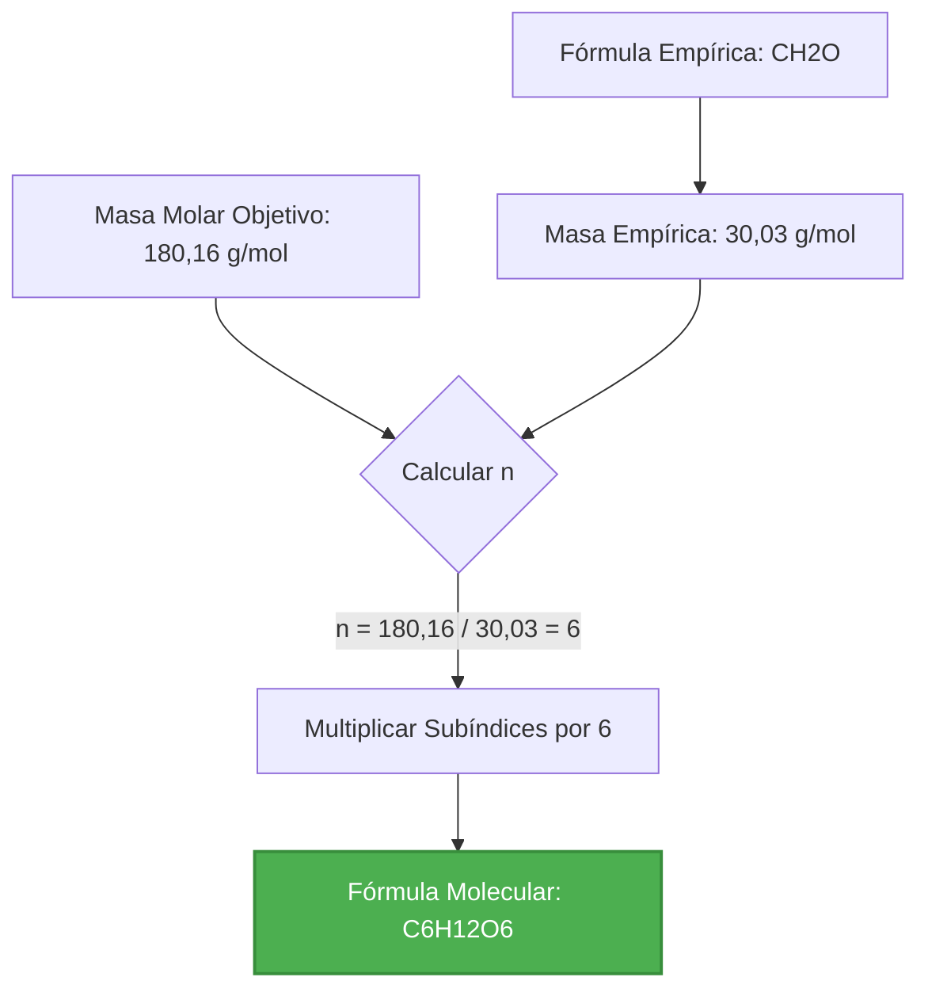

# Guía de Laboratorio y Química Analítica para Fórmulas Moleculares y Matemáticas de Multiplicadores

En la química analítica y la espectrometría de masas, determinar la **Fórmula Molecular** de un compuesto requiere vincular su **Fórmula Empírica** con su **Masa Molar Molecular** experimental:

$$\text{Fórmula Molecular} = (\text{Fórmula Empírica})_n \quad \text{donde} \quad n = \frac{\text{Masa Molar Molecular}}{\text{Masa de Fórmula Empírica}}$$

---

## 1. Matriz de Conversión de Empírica a Molecular

| Nombre del Compuesto | Fórmula Empírica | Masa Empírica ($M_{\text{emp}}$) | Masa Molar ($M$) | Multiplicador ($n$) | Fórmula Molecular |
| :--- | :--- | :--- | :--- | :--- | :--- |
| **Formaldehído** | $\text{CH}_2\text{O}$ | $30,026\text{ g/mol}$ | $30,026\text{ g/mol}$ | $n = 1$ | $\text{CH}_2\text{O}$ |
| **Ácido Acético** | $\text{CH}_2\text{O}$ | $30,026\text{ g/mol}$ | $60,052\text{ g/mol}$ | $n = 2$ | $\text{C}_2\text{H}_4\text{O}_2$ |
| **Glucosa** | $\text{CH}_2\text{O}$ | $30,026\text{ g/mol}$ | $180,156\text{ g/mol}$ | $n = 6$ | $\text{C}_6\text{H}_{12}\text{O}_6$ |
| **Benceno** | $\text{CH}$ | $13,019\text{ g/mol}$ | $78,114\text{ g/mol}$ | $n = 6$ | $\text{C}_6\text{H}_6$ |
| **Tetróxido de Dinitrógeno** | $\text{NO}_2$ | $46,005\text{ g/mol}$ | $92,011\text{ g/mol}$ | $n = 2$ | $\text{N}_2\text{O}_4$ |

---

## 2. Protocolo de Cálculo de Fórmula Molecular Estándar

```
   Paso 1: Determine la fórmula empírica del compuesto.
   Paso 2: Calcule la masa de la fórmula empírica (suma de las masas atómicas de los subíndices empíricos).
   Paso 3: Obtenga la masa molar molecular experimental (p. ej., a partir de espectrometría de masas).
   Paso 4: Calcule el multiplicador entero n = masa molar molecular / masa empírica.
   Paso 5: Multiplique cada subíndice empírico por n para obtener la fórmula molecular final.
   Paso 6: Verifique que la masa molar molecular calculada coincida con la masa molar objetivo.
```

---

## 3. Descargo de Responsabilidad de Seguridad de Laboratorio y Educativa
*Esta calculadora de fórmula molecular proporciona derivaciones preliminares de fórmulas para fines educativos, química AP y planificación de investigación. Los datos de masa molar experimental deben confirmarse mediante espectrometría de masas de alta resolución (HRMS) o cromatografía de gases-espectrometría de masas (GC-MS).*

## 4. La Guía Completa de Fórmulas Moleculares

Bienvenido a la guía definitiva sobre cómo comprender, calcular y aplicar fórmulas moleculares en química. Ya sea que sea un estudiante de secundaria abordando la estequiometría por primera vez, un académico de Química AP preparándose para exámenes o un técnico de laboratorio analizando datos de espectrometría de masas, este recurso integral está diseñado para iluminar el fascinante mundo de las fórmulas químicas.

En su núcleo, la química es el estudio de la materia y sus transformaciones. Para comprender estas transformaciones, debemos tener un lenguaje preciso para describir la composición de la materia. Ese lenguaje está escrito en fórmulas químicas. Si bien las fórmulas empíricas nos dan la proporción más simple de elementos en un compuesto, no nos cuentan toda la historia. La **fórmula molecular** es la verdadera identidad de una molécula, revelando el número exacto de cada tipo de átomo presente.

En esta guía exhaustiva, exploraremos las mecánicas profundas de las fórmulas moleculares, cómo se relacionan con sus contrapartes empíricas y el multiplicador matemático ($n$) que cierra la brecha entre ellas. También profundizaremos en aplicaciones del mundo real, el uso paso a paso de nuestra Calculadora de Fórmula Molecular y cinco ejemplos detallados completos con derivaciones matemáticas y visualizaciones 2D.

### 4.1 ¿Qué es una Fórmula Molecular?

Una fórmula molecular es una fórmula química que indica el número exacto de átomos de cada elemento en una sola molécula de una sustancia. Es el "plano" químico de una molécula. Por ejemplo, la fórmula molecular del agua es $\text{H}_2\text{O}$, lo que significa que cada molécula consta precisamente de dos átomos de hidrógeno y un átomo de oxígeno. La fórmula molecular de la glucosa es $\text{C}_6\text{H}_{12}\text{O}_6$, lo que nos dice que una sola molécula de azúcar contiene 6 átomos de carbono, 12 átomos de hidrógeno y 6 átomos de oxígeno.

En contraste, una **fórmula empírica** solo proporciona la proporción entera más simple de átomos. Para la glucosa, dividir los subíndices por su máximo común divisor (6) da la fórmula empírica $\text{CH}_2\text{O}$. Observe cómo varios compuestos pueden compartir exactamente la misma fórmula empírica. El formaldehído ($\text{CH}_2\text{O}$), el ácido acético ($\text{C}_2\text{H}_4\text{O}_2$) y la glucosa comparten la fórmula empírica $\text{CH}_2\text{O}$. La fórmula molecular es lo que distingue el conservante tóxico (formaldehído) del componente agrio del vinagre (ácido acético) y la fuente de energía esencial para la respiración celular (glucosa).

### 4.2 El Papel de la Masa Molar

Si la fórmula empírica da la proporción y la fórmula molecular da el conteo exacto, ¿cómo pasamos de una a otra? El eslabón perdido es la **masa molar** (o peso molecular).

Cuando un químico sintetiza un nuevo compuesto, podría usar análisis elemental para encontrar los porcentajes de masa de cada elemento, que se convierte fácilmente en una fórmula empírica. Sin embargo, para encontrar la verdadera fórmula molecular, deben determinar la masa molar del compuesto usando técnicas como espectrometría de masas o depresión del punto de congelación.

Al comparar la masa teórica de la fórmula empírica (la masa empírica) con la masa molar real del compuesto, podemos determinar cuántas "unidades" empíricas encajan en una molécula real.

### 4.3 La Relación Matemática

La relación entre la fórmula empírica y molecular es elegantemente simple. La fórmula molecular es siempre un múltiplo entero de la fórmula empírica. Denotamos este multiplicador entero como $n$.

$$ \text{Fórmula Molecular} = (\text{Fórmula Empírica}) \times n $$

Para encontrar este multiplicador, usamos la proporción de las masas molares:

$$ n = \frac{\text{Masa Molar Real del Compuesto}}{\text{Masa de Fórmula Empírica}} $$

Debido a que no se puede tener una fracción de un átomo en una molécula estándar, $n$ debe ser un número entero (1, 2, 3, etc.). En datos experimentales reales, ligeros errores de medición podrían dar un valor como 5,98 o 6,03, que redondeamos con confianza a 6. Sin embargo, si el cálculo da un valor como 4,5, es un fuerte indicador de que la fórmula empírica se calculó incorrectamente o los datos de masa molar son defectuosos.

Para obtener más información sobre los principios fundamentales de la química, puede explorar el [IUPAC Gold Book](https://goldbook.iupac.org/) o los [recursos de química de la NASA](https://www.nasa.gov/).

---

## 5. Guía de Uso: Dominando la Calculadora de Fórmula Molecular

Nuestra Calculadora de Fórmula Molecular está diseñada para ser una herramienta intuitiva pero profundamente poderosa tanto para estudiantes como para profesionales. Siga esta guía paso a paso para desbloquear todo su potencial.

### 5.1 Selección del Modo de Cálculo

La calculadora presenta múltiples modos para adaptarse a las diversas formas en que se presentan los datos químicos en los problemas y laboratorios.

1. **Fórmula Empírica + Masa Molar:** El modo más común. Usted ingresa la fórmula empírica y la masa molar determinada experimentalmente. La calculadora encuentra el multiplicador $n$ y muestra la fórmula molecular.
2. **Modo de Masa Relativa (Mr):** Similar al anterior, pero utiliza la Masa Molecular Relativa, que es adimensional pero numéricamente equivalente a la masa molar.
3. **Composición Porcentual:** Le permite ingresar directamente los porcentajes de masa elemental, evitando la necesidad de calcular la fórmula empírica usted mismo.
4. **Analizador de Masa de Fórmula:** Un modo de utilidad que calcula rápidamente la masa molar exacta de cualquier fórmula molecular compleja ingresada.
5. **Reducción de Subíndices:** Una herramienta que toma una fórmula molecular grande y la reduce automáticamente a su forma empírica usando matemáticas del Máximo Común Divisor (MCD).

### 5.2 Ingreso de Fórmulas Químicas

Al ingresar fórmulas químicas, nuestro analizador está diseñado para ser muy indulgente e inteligente, pero seguir la notación química estándar garantiza los mejores resultados.

*   **Mayúsculas:** Siempre ponga en mayúscula la primera letra del símbolo de un elemento. Use minúsculas para la segunda letra (p. ej., use `Na` para sodio, no `NA` o `na`).
*   **Subíndices:** Ingrese los números directamente después del símbolo del elemento sin espacios (p. ej., `H2O`, `C6H12O6`). La calculadora los formateará automáticamente como subíndices en la pantalla de resultados.
*   **Paréntesis:** Puede usar paréntesis para iones poliatómicos o grupos repetidos (p. ej., `Ca(OH)2` o `(NH4)2SO4`). El analizador comprende cómo distribuir el subíndice exterior a los elementos interiores.

### 5.3 Análisis del Resultado

Una vez que ejecute el cálculo, la "Cabina Interactiva" mostrará una gran cantidad de información:

*   **Masa de Fórmula Empírica:** La masa exacta de la unidad empírica, calculada usando pesos atómicos de alta precisión.
*   **Masa Molar Objetivo:** Una reafirmación de su entrada para verificación.
*   **El Multiplicador ($n$):** El núcleo del cálculo. La interfaz mostrará la división exacta (p. ej., 180,16 / 30,03 = 6,00) y validará que sea un número entero. Si $n$ no está cerca de un número entero, aparecerá una advertencia.
*   **Fórmula Molecular Final:** El resultado, bellamente formateado. De manera predeterminada, los compuestos que contienen carbono se ordenan usando el **Sistema de Hill Orgánico** (Carbono primero, Hidrógeno segundo, luego alfabéticamente).

### 5.4 Uso de las Visualizaciones

La calculadora incluye un Gráfico de Anillos de Recharts que desglosa visualmente la contribución de masa de cada elemento en la molécula final. Esto es excepcionalmente útil para verificar problemas de composición porcentual visualmente. Puede pasar el cursor sobre los segmentos para ver puntos de datos precisos.

---

## 6. Cinco Ejemplos Conceptuales del Mundo Real

Para dominar verdaderamente las fórmulas moleculares, uno debe ver las matemáticas aplicadas a escenarios reales. A continuación hay cinco ejemplos profundamente detallados que van desde estequiometría introductoria hasta análisis bioquímico avanzado.

### Ejemplo 1: El Bloque de Construcción de la Vida (Glucosa)

**Escenario:** 
Un bioquímico aísla una sustancia cristalina pura de la savia de una planta. El análisis elemental revela que consta de 40,00% de Carbono, 6,71% de Hidrógeno y 53,29% de Oxígeno en masa. Esto produce una fórmula empírica de $\text{CH}_2\text{O}$. La espectrometría de masas posterior determina que la masa molar del compuesto es de aproximadamente $180,16\text{ g/mol}$. ¿Cuál es la fórmula molecular?

**Derivación Matemática:**

1.  **Identificar Fórmula Empírica:** $\text{CH}_2\text{O}$
2.  **Calcular Masa Empírica ($M_{\text{emp}}$):**
    *   C: $1 \times 12,011\text{ g/mol} = 12,011$
    *   H: $2 \times 1,008\text{ g/mol} = 2,016$
    *   O: $1 \times 15,999\text{ g/mol} = 15,999$
    *   $M_{\text{emp}} = 12,011 + 2,016 + 15,999 = 30,026\text{ g/mol}$
3.  **Determinar Multiplicador ($n$):**
    $$ n = \frac{\text{Masa Molar}}{M_{\text{emp}}} = \frac{180,16}{30,026} \approx 6 $$
4.  **Calcular Fórmula Molecular:**
    $$ (\text{CH}_2\text{O}) \times 6 = \text{C}_6\text{H}_{12}\text{O}_6 $$

**Visualización: Diagrama de Flujo de Cálculo**



*Este diagrama de flujo ilustra la progresión lineal directa de los datos empíricos al plano molecular final de la glucosa, la fuente de energía principal para la vida celular.*

### Ejemplo 2: El Propelente de Cohetes (Hidrazina)

**Escenario:**
Ingenieros aeroespaciales en la NASA están probando un compuesto de nitrógeno-hidrógeno altamente reactivo usado como monopropelente en propulsores de satélites. Se determina que la fórmula empírica es $\text{NH}_2$. Los datos experimentales muestran que el vapor tiene una densidad que corresponde a una masa molar de $32,05\text{ g/mol}$. Encuentre la fórmula molecular.

**Derivación Matemática:**

1.  **Identificar Fórmula Empírica:** $\text{NH}_2$
2.  **Calcular Masa Empírica ($M_{\text{emp}}$):**
    *   N: $1 \times 14,007 = 14,007$
    *   H: $2 \times 1,008 = 2,016$
    *   $M_{\text{emp}} = 14,007 + 2,016 = 16,023\text{ g/mol}$
3.  **Determinar Multiplicador ($n$):**
    $$ n = \frac{32,05}{16,023} = 1,999 \approx 2 $$
4.  **Calcular Fórmula Molecular:**
    $$ (\text{NH}_2) \times 2 = \text{N}_2\text{H}_4 $$

**Visualización: Tabla de Comparación de Masa**

| Componente | Fórmula | Masa (g/mol) | % Nitrógeno | % Hidrógeno |
| :--- | :--- | :--- | :--- | :--- |
| **Base Empírica** | $\text{NH}_2$ | 16,023 | 87,4% | 12,6% |
| **Molécula Real** | $\text{N}_2\text{H}_4$ | 32,046 | 87,4% | 12,6% |

*Observe cómo el porcentaje de masa de los elementos sigue siendo absolutamente idéntico entre las fórmulas empíricas y moleculares, a pesar de que la masa total se duplica.*

### Ejemplo 3: El Analgésico (Ibuprofeno)

**Escenario:**
Un laboratorio farmacéutico sintetiza un lote de ibuprofeno. Se encuentra que la fórmula empírica es $\text{C}_{13}\text{H}_{18}\text{O}_2$. El espectrómetro de masas del laboratorio mide el pico del ion molecular en $m/z = 206,29$, lo que indica una masa molar de $206,29\text{ g/mol}$. ¿Cuál es la verdadera fórmula molecular del ibuprofeno?

**Derivación Matemática:**

1.  **Identificar Fórmula Empírica:** $\text{C}_{13}\text{H}_{18}\text{O}_2$
2.  **Calcular Masa Empírica ($M_{\text{emp}}$):**
    *   C: $13 \times 12,011 = 156,143$
    *   H: $18 \times 1,008 = 18,144$
    *   O: $2 \times 15,999 = 31,998$
    *   $M_{\text{emp}} = 156,143 + 18,144 + 31,998 = 206,285\text{ g/mol}$
3.  **Determinar Multiplicador ($n$):**
    $$ n = \frac{206,29}{206,285} \approx 1 $$
4.  **Calcular Fórmula Molecular:**
    $$ (\text{C}_{13}\text{H}_{18}\text{O}_2) \times 1 = \text{C}_{13}\text{H}_{18}\text{O}_2 $$

**Visualización: La Línea de Tiempo del Escenario "n = 1"**

```mermaid
gantt
    title Flujo de Trabajo del Laboratorio: Identificación del Ibuprofeno
    dateFormat  HH:mm:ss
    axisFormat  %H:%M
    section Síntesis
    Preparación de Lote       :active, 00:00:00, 00:02:00
    section Análisis
    Análisis Elemental (Empírica) :crit, active, 00:02:00, 00:04:00
    Espectrometría de Masas (Masa Molar) :active, 00:04:00, 00:06:00
    section Conclusión
    Calcular Multiplicador (n=1) :done, 00:06:00, 00:07:00
    Fórmula Confirmada Idéntica :milestone, 00:07:00, 00:07:00
```



*Este diagrama de Gantt representa una línea de tiempo típica de un laboratorio. Debido a que $n = 1$, la fórmula empírica y la fórmula molecular son idénticas. Esto es común en muchos productos farmacéuticos orgánicos complejos donde la estructura no se puede dividir simétricamente.*

### Ejemplo 4: El Hidrocarburo Aromático (Benceno)

**Escenario:**
Un químico orgánico está estudiando un líquido altamente inflamable y de olor dulce. La fórmula empírica es simplemente $\text{CH}$, lo que indica una proporción de 1:1 de carbono a hidrógeno. Se determina que la masa molar por depresión del punto de congelación es de $78,11\text{ g/mol}$. 

**Derivación Matemática:**

1.  **Identificar Fórmula Empírica:** $\text{CH}$
2.  **Calcular Masa Empírica ($M_{\text{emp}}$):**
    *   $12,011 + 1,008 = 13,019\text{ g/mol}$
3.  **Determinar Multiplicador ($n$):**
    $$ n = \frac{78,11}{13,019} \approx 6 $$
4.  **Calcular Fórmula Molecular:**
    $$ (\text{CH}) \times 6 = \text{C}_6\text{H}_6 $$

**Visualización: Proceso de Escalamiento de Subíndices**


*La estructura de anillo del benceno requiere 6 carbonos. La fórmula empírica $\text{CH}$ no da ninguna pista de esta geometría de anillo, resaltando por qué determinar la verdadera fórmula molecular ($\text{C}_6\text{H}_6$) es un paso crítico en la química orgánica.*

### Ejemplo 5: El Precursor de Polímero Misterioso (Etileno vs Buteno)

**Escenario:**
Una planta petroquímica está refinando una corriente de gas. El análisis muestra una fórmula empírica de $\text{CH}_2$. Sin embargo, dependiendo de la presión y temperatura de la columna de destilación, el gas podría ser etileno ($28,05\text{ g/mol}$) o buteno ($56,11\text{ g/mol}$). La muestra actual tiene una masa molar de $56,11\text{ g/mol}$.

**Derivación Matemática:**

1.  **Identificar Fórmula Empírica:** $\text{CH}_2$
2.  **Calcular Masa Empírica ($M_{\text{emp}}$):**
    *   $12,011 + (2 \times 1,008) = 14,027\text{ g/mol}$
3.  **Determinar Multiplicador ($n$):**
    $$ n = \frac{56,11}{14,027} \approx 4 $$
4.  **Calcular Fórmula Molecular:**
    $$ (\text{CH}_2) \times 4 = \text{C}_4\text{H}_8 \text{ (Buteno)} $$

*Si la masa molar hubiera sido de $28,05\text{ g/mol}$, $n$ sería 2, produciendo etileno ($\text{C}_2\text{H}_4$). Esto demuestra cómo se usan los cálculos de fórmulas moleculares en la industria para diferenciar entre distintos químicos que comparten las mismas proporciones fundamentales.*

---

## 7. Preguntas Frecuentes Profundas y Solución de Problemas Avanzados

A medida que utilice la Calculadora de Fórmula Molecular para problemas más complejos de Química AP o nivel universitario, es posible que encuentre casos extremos. Esta sección de preguntas frecuentes aborda los matices de las matemáticas moleculares.

**P: ¿Qué sucede si mi $n$ calculado es un número como 4,5?**
**R:** En los problemas de fórmulas moleculares estándar, $n$ debe ser un número entero. Si calcula $n = 4,5$, es probable que haya cometido un error al determinar la fórmula empírica. Por ejemplo, si calculó incorrectamente una fórmula empírica de $\text{CH}_3$ (masa $\approx 15$) para un compuesto con una masa molar de $\approx 58$, $58 / 15 = 3,86$. Esto significa que $\text{CH}_3$ estaba mal (la verdadera fórmula empírica probablemente era $\text{C}_2\text{H}_5$, masa $\approx 29$, lo que da $n=2$ para $\text{C}_4\text{H}_{10}$). 

**P: ¿Utiliza la calculadora masas isotópicas exactas?**
**R:** La calculadora utiliza las masas atómicas promedio estándar ponderadas por abundancia natural (p. ej., Carbono = 12,011) aprobadas por la IUPAC. Para problemas de tareas y síntesis químicas estándar, esto es muy preciso. Si está haciendo espectrometría de masas de alta resolución (HRMS) analizando isótopos específicos (como Carbono-13), deberá tener en cuenta la masa isotópica exacta de forma manual.

**P: ¿Puede un compuesto tener una fórmula empírica con un multiplicador de $n = 100$?**
**R:** ¡Absolutamente! En la química de polímeros, las moléculas pueden ser masivas. Por ejemplo, el polietileno es esencialmente una cadena de unidades de $\text{CH}_2$. Una sola cadena de polietileno podría tener una fórmula empírica de $\text{CH}_2$ y una masa molar de $140.000\text{ g/mol}$, lo que da como resultado un multiplicador de $n = 10.000$.

**P: ¿Por qué la calculadora reorganiza mi salida en el Sistema de Hill?**
**R:** El Sistema de Hill es el estándar reconocido internacionalmente para escribir fórmulas químicas. Evita confusiones al garantizar que las fórmulas se escriban de manera uniforme en la bibliografía. El carbono se enumera primero, el hidrógeno segundo y todos los demás elementos siguen en orden alfabético. Por ejemplo, en lugar de escribir $\text{ClCH}_3$, el sistema de Hill lo estandariza a $\text{CH}_3\text{Cl}$. Nuestra calculadora aplica automáticamente este estándar para garantizar que sus respuestas tengan un formato profesional.

**P: ¿Cómo se relaciona esto con el Concepto de Mol?**
**R:** La masa molar utilizada en estos cálculos está directamente relacionada con el número de Avogadro ($6,022 \times 10^{23}$). La masa empírica es la masa de un mol de unidades empíricas, y la masa molecular es la masa de un mol de moléculas reales. El multiplicador $n$ le indica cuántos moles de unidades empíricas hay dentro de un mol de la sustancia real. Para obtener más información sobre los moles, consulte nuestra [Calculadora de Moles](/mole-calculator).

¡Al dominar la transición de fórmulas empíricas a moleculares, desbloquea la capacidad de identificar sustancias desconocidas, equilibrar ecuaciones estequiométricas complejas y comprender la geometría física del mundo molecular! Utilice esta calculadora tanto como una herramienta de verificación como una guía educativa para optimizar sus análisis químicos.
