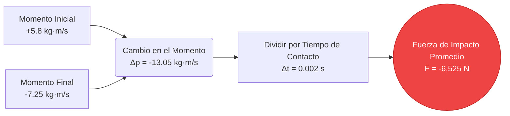
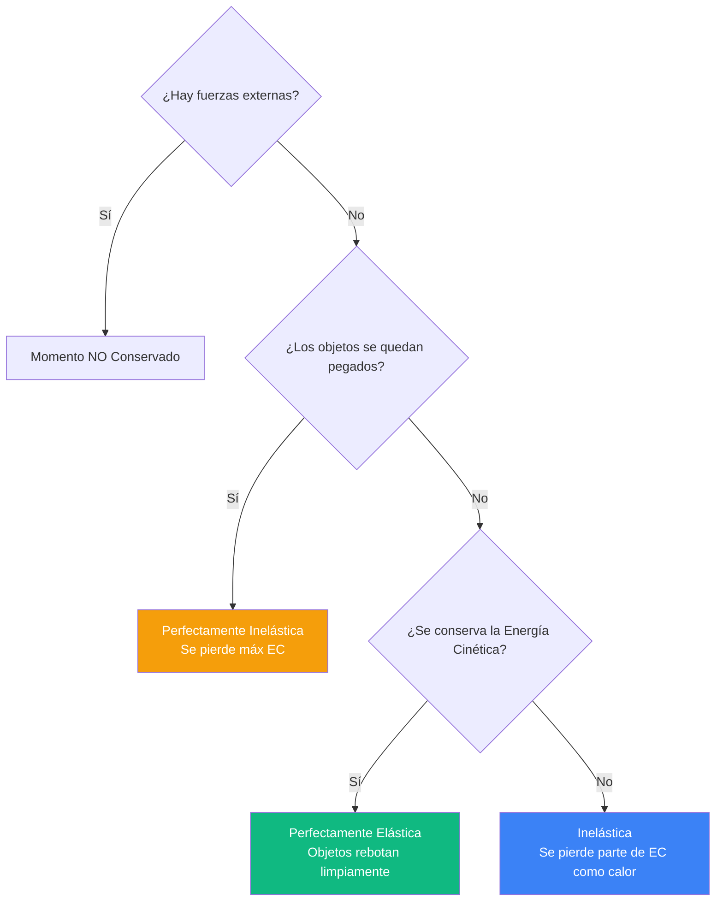
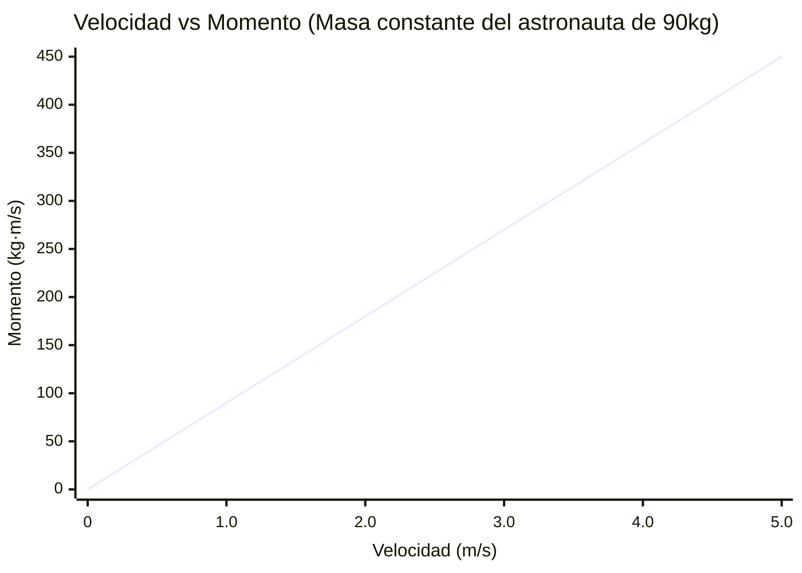
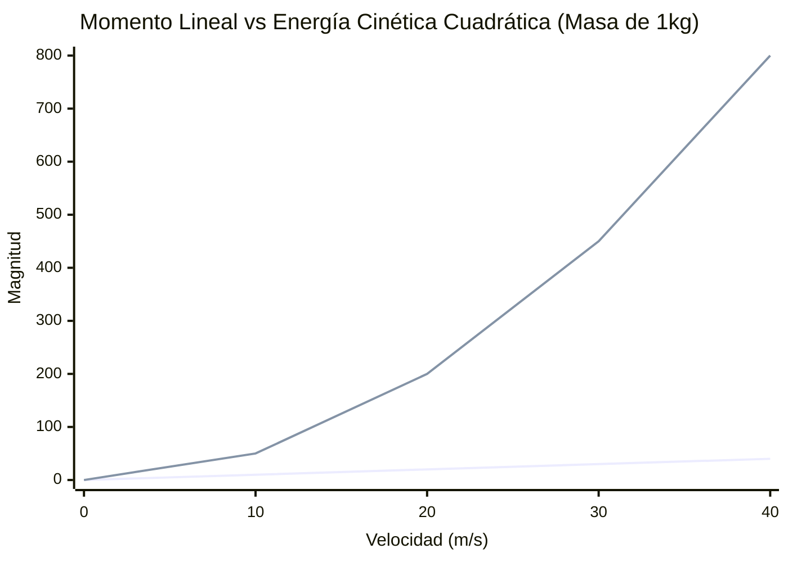

# La Calculadora de Momento Definitiva: Dominando el Movimiento Lineal, las Colisiones y el Impulso

Bienvenido a la **Calculadora de Momento** definitiva y a la guía completa sobre colisiones en física. Ya sea que seas un ingeniero automotriz analizando las zonas de deformación de pruebas de choque, un astrofísico calculando encuentros orbitales o un estudiante universitario preparándose para un agotador examen parcial de física sobre las leyes de conservación, esta herramienta está diseñada para una precisión mecánica absoluta.

El momento es la encarnación física de ser "imparable". Explica por qué un tren de carga que se mueve lentamente puede atravesar una pared de ladrillos, por qué una pequeña bala puede perforar acero sólido y cómo maniobran los cohetes en el vacío del espacio profundo.

En esta extensa inmersión de más de 4000 palabras, desglosaremos exhaustivamente la mecánica del momento lineal ($p = m \cdot v$). Exploraremos los fundamentos matemáticos del Teorema del Impulso-Momento, analizaremos la diferencia entre colisiones elásticas y perfectamente inelásticas, y te guiaremos a través de cinco ejemplos de ingeniería del mundo real visualizados con diagramas detallados de Mermaid.js.

---

## 1. La Física del Momento: Cantidad de Movimiento

Para entender el momento, debemos referirnos a la raíz latina de la palabra, *movimentum*, que significa "movimiento". Sir Isaac Newton se refería originalmente al momento simplemente como la "Cantidad de Movimiento".

El momento es una **magnitud vectorial**, lo que significa que tiene tanto una magnitud (qué tan grande es el valor) como una dirección (hacia dónde se dirige el objeto). 

### La Fórmula Principal ($p = m \cdot v$)
El momento lineal ($p$) de cualquier objeto es el producto matemático de su masa ($m$) por su velocidad ($v$).

$$ p = m \cdot v $$

Donde:
- **$p$** = Momento Lineal (medido en kilogramo-metros por segundo, $\text{kg} \cdot \text{m/s}$)
- **$m$** = Masa (medida en kilogramos, $kg$)
- **$v$** = Velocidad (medida en metros por segundo, $m/s$)

### Por Qué Importan Ambas Variables
Debido a que el momento es un producto de multiplicación, se puede lograr un momento masivo a través de dos extremos muy diferentes:
1. **Alta Masa, Baja Velocidad:** Un superpetrolero de 300,000 toneladas que entra arrastrándose al puerto a $1\text{ m/s}$ posee unos astronómicos $300,000,000\text{ kg} \cdot \text{m/s}$ de momento. Es por esto que se necesitan millas para detener buques de forma segura.
2. **Baja Masa, Alta Velocidad:** Una bala de 0.05 kg disparada desde un rifle a $1,000\text{ m/s}$ posee $50\text{ kg} \cdot \text{m/s}$ de momento. Aunque numéricamente es menor que el buque, está concentrado en un área diminuta, haciéndola altamente penetrante.

### La Verdadera Forma de la Segunda Ley de Newton
A la mayoría de los estudiantes se les enseña que la Segunda Ley de Newton es $F = m \cdot a$. Sin embargo, Newton escribió originalmente su ley con respecto al momento. La verdadera ley establece: *"La fuerza externa neta sobre un objeto es igual a la tasa de cambio de su momento a lo largo del tiempo."*

$$ F_{neta} = \frac{\Delta p}{\Delta t} $$

---

## 2. Impulso: Cambiando el Momento a lo largo del Tiempo

Dado que la Fuerza equivale al cambio de momento dividido por el tiempo, podemos reordenar el álgebra para entender cómo *cambiar* el momento de un objeto.

Al multiplicar ambos lados por el tiempo ($\Delta t$), obtenemos el **Teorema del Impulso-Momento**:

$$ F_{neta} \cdot \Delta t = \Delta p $$

Este producto de la Fuerza y el Tiempo ($F \cdot \Delta t$) se llama **Impulso ($J$)**, y se mide en Newton-segundos ($N \cdot s$). El teorema nos dice que para cambiar el momento de un objeto, se debe aplicar una fuerza durante un periodo de tiempo específico.

### La Física de la Seguridad Automotriz
El Teorema del Impulso-Momento es el fundamento entero de la seguridad en choques automotrices. 

Imagina un automóvil chocando contra un muro de concreto a velocidades de autopista. El cambio en el momento ($\Delta p$) es completamente fijo: el automóvil se movía rápido, y ahora debe detenerse. No puedes cambiar $\Delta p$. Sin embargo, *sí puedes* cambiar la Fuerza ($F$) ejercida sobre el conductor manipulando el Tiempo ($\Delta t$).

Sin zonas de deformación, el automóvil se detiene contra el concreto instantáneamente (ej. $0.01\text{ segundos}$). Para satisfacer la ecuación, la Fuerza debe ser astronómicamente alta, probablemente matando al conductor. Al diseñar el capó del auto para que se arrugue como un acordeón, la duración del impacto se extiende a $0.20\text{ segundos}$. Al aumentar $\Delta t$ por un factor de 20, la Fuerza máxima letal cae por un factor de 20. 

---

## 3. La Ley de Conservación del Momento

En cualquier sistema cerrado —lo que significa que no interfieren fuerzas externas como la fricción o la gravedad— el momento total de todos los objetos que interactúan permanece completamente constante.

$$ \sum p_{inicial} = \sum p_{final} $$

Si dos objetos chocan, el momento perdido por el Objeto A es exactamente ganado por el Objeto B. Esta regla fundamental gobierna todas las colisiones en la física.

### Colisiones Elásticas vs. Inelásticas
Si bien el momento *siempre* se conserva en una colisión cerrada, la Energía Cinética ($EC = \frac{1}{2}mv^2$) se comporta de manera diferente dependiendo de las propiedades materiales de los objetos que chocan.

1. **Colisiones Perfectamente Elásticas:** Los objetos rebotan entre sí perfectamente, como bolas de billar rígidas. Tanto el momento *como* la energía cinética se conservan al 100%.
2. **Colisiones Inelásticas:** Los objetos rebotan entre sí, pero parte de la energía cinética se pierde en forma de calor, sonido y deformación permanente (como dos autos que se rozan). El momento se conserva, pero la Energía Cinética disminuye.
3. **Colisiones Perfectamente Inelásticas:** Los objetos chocan y se pegan permanentemente (como una bala incrustándose en un bloque de madera). Se alejan moviéndose como una sola masa combinada. El momento se conserva, pero se pierde el máximo de Energía Cinética.

---

## 4. Guía de Uso Completa: Maximizando la Calculadora

Nuestra interactiva Calculadora de Momento presenta un avanzado Simulador de Colisiones 1D. Aquí le mostramos cómo navegar por las herramientas de manera efectiva.

### Paso 1: Cálculos Básicos de Momento
En el panel principal, seleccione su variable objetivo:
- **Resolver Momento (p):** Ingrese masa y velocidad para encontrar la cantidad de movimiento.
- **Resolver Masa (m):** Ingrese el momento conocido y la velocidad.
- **Resolver Velocidad (v):** Ingrese el momento y la masa.

### Paso 2: Utilizar el Simulador de Colisiones 1D
Cambie al Modo Avanzado para desbloquear el Explorador de Colisiones:
- Establezca la masa inicial y las velocidades para el **Cuerpo A** y el **Cuerpo B**. 
- Elija su tipo de colisión: **Elástica** (rebote) o **Perfectamente Inelástica** (adhesión).
- El motor ejecutará una matriz de conservación y arrojará las velocidades finales, el momento total del sistema y el porcentaje de energía cinética perdido por calor y deformación.

### Paso 3: Interpretar Momento vs. Energía Cinética
Utilice el interruptor para ver el desglose comparativo entre Momento y Energía Cinética. Esto es crucial para entender la balística. A medida que aumenta la velocidad, el momento escala linealmente, pero la energía cinética escala cuadráticamente ($v^2$). Esto significa que duplicar su velocidad duplica su momento, pero *cuadruplica* su destructiva energía cinética.

---

## 5. Cinco Ejemplos Conceptuales de Ingeniería con Visualizaciones 2D

Exploremos cinco ejemplos detallados de mecánica del momento, utilizando Mermaid.js para visualizar la física subyacente.

### Ejemplo 1: El Teorema del Impulso-Momento (Biomecánica Deportiva)

**El Escenario:**
Un lanzador de béisbol lanza una pelota de $0.145\text{ kg}$ horizontalmente a $40\text{ m/s}$ (dirección +x). El bateador hace el swing y la golpea directamente de vuelta a $50\text{ m/s}$ (dirección -x). El bate solo está en contacto físico con la pelota durante $0.002\text{ segundos}$. ¿Cuál fue la fuerza de impacto promedio sobre el bate?

**Las Matemáticas:**
Primero, calcule el cambio de momento ($\Delta p = m \cdot v_f - m \cdot v_i$). 
*¡Preste mucha atención a los signos de la dirección de los vectores!* La pelota llegó a $+40\text{ m/s}$ y salió a $-50\text{ m/s}$.
$$ \Delta p = 0.145 \times (-50) - 0.145 \times (40) $$
$$ \Delta p = -7.25 - 5.8 = -13.05\text{ kg} \cdot \text{m/s} $$

Ahora, use el Teorema del Impulso-Momento ($F = \Delta p / \Delta t$):
$$ F = \frac{-13.05}{0.002} = -6,525\text{ Newtons} $$

¡El bate golpeó la pelota con una fuerza máxima de más de 6.5 kilonewtons!

**Visualización 2D:**
El árbol lógico a continuación mapea el flujo del cálculo de Impulso-Momento.

---

### Ejemplo 2: Colisión Perfectamente Inelástica (El Péndulo Balístico)

**El Escenario:**
Un científico forense dispara una bala de rifle de $0.02\text{ kg}$ a una alta velocidad desconocida contra un bloque de madera de $5.0\text{ kg}$ que cuelga de unas cuerdas. La bala se incrusta completamente dentro del bloque. Las cámaras de alta velocidad muestran el conjunto del bloque y la bala balanceándose hacia atrás a exactamente $4.0\text{ m/s}$ inmediatamente después del impacto. ¿A qué velocidad viajaba la bala antes del impacto?

**Las Matemáticas:**
Esta es una colisión perfectamente inelástica ($m_1v_1 + m_2v_2 = (m_1 + m_2)v_f$).
- $m_{bala}$ = $0.02\text{ kg}$
- $v_{bala}$ = Desconocida
- $m_{bloque}$ = $5.0\text{ kg}$
- $v_{bloque}$ = $0\text{ m/s}$ (estacionario)
- $v_{final}$ = $4.0\text{ m/s}$

Establezca la ecuación de conservación:
$$ (0.02 \cdot v_{bala}) + (5.0 \cdot 0) = (5.0 + 0.02) \cdot 4.0 $$
$$ 0.02 \cdot v_{bala} = 5.02 \cdot 4.0 $$
$$ 0.02 \cdot v_{bala} = 20.08 $$
$$ v_{bala} = \frac{20.08}{0.02} = 1,004\text{ m/s} $$

La bala viajaba a más de Mach 2.9 ($1,004\text{ m/s}$) antes del impacto.

**Visualización 2D:**
Este árbol de decisión aclara las diferencias fundamentales entre los tipos de colisión.

---

### Ejemplo 3: Accidente de Caminata Espacial (Conservación del Momento)

**El Escenario:**
Un astronauta de $100\text{ kg}$ (incluyendo el traje) se separa de la Estación Espacial Internacional durante una caminata espacial. Está flotando completamente inmóvil con respecto a la estación, varado a 15 metros de distancia. En un movimiento desesperado por regresar, el astronauta se desengancha su pesado cinturón de herramientas de $10\text{ kg}$ y lo lanza lejos de la estación a una velocidad furiosa de $15\text{ m/s}$. ¿A qué velocidad se desplaza el astronauta de regreso hacia la esclusa de aire?

**Las Matemáticas:**
Dado que el astronauta y el cinturón de herramientas estaban inicialmente inmóviles, el momento inicial total del sistema es cero. Debido a las leyes de conservación, el momento final total también debe ser igual a cero.
$$ p_{inicial} = 0 $$
$$ p_{final} = (m_{cinturon} \cdot v_{cinturon}) + (m_{astro} \cdot v_{astro}) = 0 $$

Sustituya los valores conocidos (recuerde que el cinturón se lanza alejándose de la estación, por lo que le asignaremos una velocidad positiva, lo que significa que la dirección de la estación es negativa):
$$ (10 \cdot 15) + (90 \cdot v_{astro}) = 0 $$
*(Nota: la masa del astronauta ahora es de 90 kg porque soltó el cinturón de 10 kg).*
$$ 150 + 90 \cdot v_{astro} = 0 $$
$$ 90 \cdot v_{astro} = -150 $$
$$ v_{astro} = -1.67\text{ m/s} $$

El astronauta retrocede con éxito hacia la estación a $1.67\text{ m/s}$.

**Visualización 2D:**
El gráfico a continuación demuestra la relación estrictamente lineal entre la velocidad de un objeto y su momento (asumiendo una masa constante).

---

### Ejemplo 4: Momento Lineal vs. Energía Cinética 

**El Escenario:**
Surge un debate con respecto al poder de penetración de dos proyectiles diferentes. El Proyectil A es una bola de boliche pesada y lenta ($7\text{ kg}$ moviéndose a $10\text{ m/s}$). El Proyectil B es una bala de rifle de alta velocidad ($0.05\text{ kg}$ moviéndose a $1,000\text{ m/s}$). ¿Cuál tiene más momento para derribar un objetivo, y cuál tiene más energía cinética para destruirlo?

**Las Matemáticas:**
**Proyectil A (Bola de Boliche):**
$$ p_A = 7 \times 10 = 70\text{ kg}\cdot\text{m/s} $$
$$ EC_A = 0.5 \times 7 \times (10^2) = 350\text{ Julios} $$

**Proyectil B (Bala):**
$$ p_B = 0.05 \times 1,000 = 50\text{ kg}\cdot\text{m/s} $$
$$ EC_B = 0.5 \times 0.05 \times (1,000^2) = 25,000\text{ Julios} $$

A pesar de ser 140 veces más liviana, la bala posee 71 veces más Energía Cinética destructiva porque la energía escala cuadráticamente con la velocidad ($v^2$). Sin embargo, la pesada bola de boliche en realidad tiene más momento bruto de detención para empujar un objetivo hacia atrás.

**Visualización 2D:**
Este gráfico ilustra dramáticamente la diferencia entre el escalado lineal (momento) y el escalado cuadrático (energía cinética) a medida que aumenta la velocidad.

*(Línea azul = Momento $p = mv$, Línea roja = Energía Cinética $EC = 0.5mv^2$)*

---

### Ejemplo 5: Zonas de Deformación y Duración del Impacto

**El Escenario:**
Volvamos al problema de ingeniería de seguridad en choques. Un SUV de $2,000\text{ kg}$ choca contra una barrera de concreto a $30\text{ m/s}$. En un automóvil clásico rígido sin zona de deformación, el impacto detiene el vehículo en $0.05\text{ segundos}$. En un automóvil moderno con un marco de deformación tipo panal de titanio, el impacto toma $0.25\text{ segundos}$. Compare la fuerza ejercida sobre el compartimiento del conductor.

**Las Matemáticas:**
El cambio en el momento ($\Delta p$) es idéntico para ambos autos:
$$ \Delta p = m(v_f - v_i) = 2,000 \times (0 - 30) = -60,000\text{ kg}\cdot\text{m/s} $$

**Fuerza en Automóvil Clásico:**
$$ F = \frac{\Delta p}{\Delta t} = \frac{-60,000}{0.05} = -1,200,000\text{ Newtons} $$

**Fuerza en Automóvil Moderno:**
$$ F = \frac{\Delta p}{\Delta t} = \frac{-60,000}{0.25} = -240,000\text{ Newtons} $$

Al extender el tiempo de impacto por apenas 0.2 segundos, la moderna zona de deformación eliminó casi un millón de Newtons de fuerza aplastante.

**Visualización 2D:**
Este diagrama de Gantt visualiza la precisa diferencia en el marco temporal que salva vidas durante un impacto.

```mermaid
gantt
    title Duración del Impacto del Choque (Dispersión de la Fuerza de Impulso)
    dateFormat  s
    axisFormat %S
    section Chasis Clásico (Rígido)
    Fuerza Máxima de Impacto (1.2 MN) :crit, 0, 0.05s
    section Chasis Moderno (Deformable)
    Colapso de Zona de Deformación (0.24 MN) :active, 0, 0.25s
```

---

## 6. Sumersión Profunda en Preguntas Frecuentes (FAQ)

**P: ¿Puede el momento ser negativo?**
**R:** Sí, absolutamente. Debido a que el momento es una cantidad vectorial, un signo negativo simplemente indica dirección. Si a un automóvil que viaja hacia el este se le asigna un momento positivo de $+10,000\text{ kg}\cdot\text{m/s}$, un automóvil que viaje hacia el oeste a la misma velocidad exacta tendrá un momento de $-10,000\text{ kg}\cdot\text{m/s}$. 

**P: ¿La gravedad afecta el momento?**
**R:** Sí, la gravedad es una fuerza externa. Cuando dejas caer una pelota, la gravedad ejerce una fuerza descendente continua a lo largo del tiempo ($F \cdot \Delta t$), lo que resulta en un Impulso descendente continuo, causando que el momento de la pelota aumente hasta que golpea el suelo.

**P: ¿Cuál es la diferencia entre la velocidad del Centro de Masa y la velocidad del objeto individual en una colisión?**
**R:** El centro de masa de un sistema cerrado se mueve a una velocidad completamente constante antes, durante y después de una colisión. Incluso si dos bolas de billar rebotan violentamente entre sí y cambian sus velocidades individuales, el punto central matemático entre ellas continúa avanzando como si nada hubiera pasado. 

**P: ¿Cómo se propulsan los motores a reacción y los cohetes sin empujar contra nada?**
**R:** Se basan enteramente en la Ley de Conservación del Momento. Un cohete quema combustible para crear gas a alta presión. Luego expulsa ese gas por la boquilla trasera a velocidades extremas. El gas se lleva cantidades masivas de momento negativo. Para mantener el momento total del sistema equilibrado en cero, el pesado casco del cohete debe ganar una cantidad exactamente equivalente de momento positivo hacia adelante.

**P: ¿Qué es el Momento Angular?**
**R:** Esta calculadora se enfoca en el momento *lineal* (movimiento en líneas rectas). El momento angular ($L$) es el equivalente rotacional exacto. En lugar de masa, se usa el "Momento de Inercia" ($I$), y en lugar de velocidad lineal, se usa la "Velocidad Angular" ($\omega$). El momento angular se conserva en un sistema en rotación (como un patinador sobre hielo que contrae los brazos para girar más rápido).

---

## 7. Conclusión y Reto de Ingeniería

Los principios del momento lineal y el impulso rigen la macro-mecánica de nuestro universo. Desde la dispersión microscópica de partículas subatómicas hasta el diseño macroeconómico de las barreras de contención de carreteras, entender cómo interactúan la masa y la velocidad es fundamental.

Para dominar verdaderamente estos conceptos, utilice nuestra Calculadora de Momento para resolver los siguientes retos de ingeniería conceptual:
1. **El Cañón de Riel:** Un cañón de riel naval usa electromagnetismo para disparar un proyectil de tungsteno de $10\text{ kg}$ a $2,500\text{ m/s}$. Si el barco que dispara el arma tiene una masa de $10,000,000\text{ kg}$, ¿cuál es la velocidad de retroceso hacia atrás de todo el barco?
2. **El Impacto del Asteroide:** Un meteoro de $50,000\text{ kg}$ que se mueve a $20,000\text{ m/s}$ choca contra un satélite muerto y estacionario de $200,000\text{ kg}$ y se incrusta perfectamente en él. ¿Cuál es la velocidad de deriva final del grupo fundido resultante de metal?
3. **El Propulsor de Frenado:** Un módulo de aterrizaje lunar de $5,000\text{ kg}$ está cayendo hacia la luna a $200\text{ m/s}$. Si sus propulsores pueden generar $40,000\text{ N}$ de empuje hacia arriba, ¿exactamente cuántos segundos deben encenderse los propulsores para reducir la velocidad del módulo de aterrizaje a cero?

Experimente con el simulador, analice las matrices de energía cinética y confíe en esta calculadora para iluminar las ocultas colisiones matemáticas que rigen el mundo físico a su alrededor.
