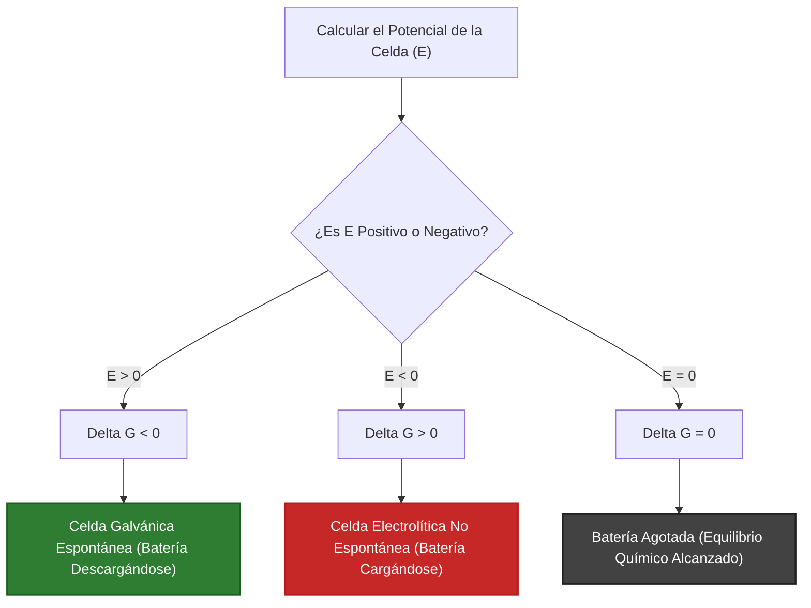

# Guía de Electroquímica Analítica y de Laboratorio para la Ecuación de Nernst

En la fisicoquímica, analítica y la ingeniería de almacenamiento de energía, la **Ecuación de Nernst** cuantifica la fuerza electromotriz (FEM) de una celda electroquímica que funciona bajo concentraciones no estándar, presiones parciales de gas y temperaturas:

$$E = E^\circ - \frac{R T}{n F} \ln Q$$

$$\text{A } T = 298.15 \text{ K } (25^\circ\text{C}) \implies E = E^\circ - \frac{0.05916}{n} \log_{10} Q$$

$$E_{\text{celda}}^\circ = E_{\text{cátodo}}^\circ - E_{\text{ánodo}}^\circ$$

$$\Delta G = -n F E \quad \text{y} \quad \Delta G^\circ = -n F E^\circ = -R T \ln K \implies K = \exp\left(\frac{n F E^\circ}{R T}\right)$$

$$\text{Celda de Concentración: } E_{\text{celda}} = \frac{R T}{n F} \ln\left(\frac{C_{\text{alta}}}{C_{\text{baja}}}\right)$$

---

## 1. Matriz de Referencia Clásica de Celdas Electroquímicas

| Sistema de Celda | Ecuación | $E^\circ$ ($25^\circ\text{C}$) | $n$ | Semicelda del Ánodo (-) | Semicelda del Cátodo (+) |
| :--- | :--- | :--- | :--- | :--- | :--- |
| **Celda de Daniell** | $\text{Zn}(s) + \text{Cu}^{2+} \rightleftharpoons \text{Zn}^{2+} + \text{Cu}(s)$ | **$+1.10 \text{ V}$** | **$2$** | $\text{Zn} \rightleftharpoons \text{Zn}^{2+} + 2e^-$ | $\text{Cu}^{2+} + 2e^- \rightleftharpoons \text{Cu}$ |
| **Hidrógeno (SHE)** | $2\text{H}^+(aq) + 2e^- \rightleftharpoons \text{H}_2(g)$ | **$0.00 \text{ V}$** | **$2$** | $\text{H}_2 \rightleftharpoons 2\text{H}^+ + 2e^-$ | $2\text{H}^+ + 2e^- \rightleftharpoons \text{H}_2$ |
| **Ión de Plata** | $\text{Ag}^+(aq) + e^- \rightleftharpoons \text{Ag}(s)$ | **$+0.80 \text{ V}$** | **$1$** | $\text{Ag} \rightleftharpoons \text{Ag}^+ + e^-$ | $\text{Ag}^+ + e^- \rightleftharpoons \text{Ag}$ |
| **Par Redox de Hierro**| $\text{Fe}^{3+}(aq) + e^- \rightleftharpoons \text{Fe}^{2+}(aq)$ | **$+0.77 \text{ V}$** | **$1$** | $\text{Fe}^{2+} \rightleftharpoons \text{Fe}^{3+} + e^-$ | $\text{Fe}^{3+} + e^- \rightleftharpoons \text{Fe}^{2+}$ |
| **Batería de Plomo-Ácido**| $\text{Pb} + \text{PbO}_2 + 2\text{H}_2\text{SO}_4 \rightleftharpoons 2\text{PbSO}_4 + 2\text{H}_2\text{O}$| **$+2.05 \text{ V}$** | **$2$** | $\text{Pb} + \text{SO}_4^{2-} \rightleftharpoons \text{PbSO}_4 + 2e^-$ | $\text{PbO}_2 + 4\text{H}^+ + \text{SO}_4^{2-} + 2e^- \rightleftharpoons \text{PbSO}_4$ |

---

## 2. Protocolos de Cálculo Estándar de Nernst

```
1. Potencial No Estándar: E = E0 - (R * T / (n * F)) * ln(Q)
2. Forma Simplificada Log10 a 25C: E = E0 - (0.05916 / n) * log10(Q)
3. Energía Libre de Gibbs: deltaG = -n * F * E (kJ/mol)
4. Constante de Equilibrio K: log10(K) = (n * E0) / 0.05916
5. Potencial de Celda de Concentración: E = (R * T / (n * F)) * ln(Calta / Cbaja)
```

---

## 3. Descargo de Responsabilidad de Seguridad de Laboratorio y Educativa
*Esta calculadora de la ecuación de Nernst proporciona cálculos termodinámicos teóricos para aplicaciones educativas, de investigación de laboratorio y de química AP. Los sistemas industriales reales de baterías o sensores electroquímicos deben tener en cuenta coeficientes de actividad, potenciales de unión líquida y sobrepotenciales de activación.*

## 4. La Guía Completa de la Ecuación de Nernst y la Electroquímica

Bienvenido al manual definitivo sobre la **Ecuación de Nernst**. Ya sea que sea un estudiante de química AP prediciendo el voltaje exacto de una celda de Daniell, un ingeniero diseñando baterías de iones de litio o un bioquímico estudiando gradientes de protones a través de membranas mitocondriales, usted confía completamente en los principios termodinámicos codificados en esta única ecuación.

En esta guía exhaustiva de más de 4000 palabras, desglosaremos la ecuación de Nernst para comprender sus orígenes termodinámicos en la Energía Libre de Gibbs. Analizaremos claramente cada variable ($E^\circ$, $R$, $T$, $n$, $F$, $Q$) y luego realizaremos cinco derivaciones electroquímicas rigurosas y prácticas, completas con álgebra paso a paso y diagramas visuales de Mermaid de alta compatibilidad.

### 4.1 El Origen Termodinámico del Voltaje

La fuerza electromotriz (FEM), medida en voltios ($V$), no es solo "electricidad"; es una medida directa de la fuerza motriz termodinámica. Específicamente, el potencial de celda ($E$) está matemáticamente bloqueado a la **Energía Libre de Gibbs ($\Delta G$)** a través de la constante de Faraday:

$$ \Delta G = -nFE $$

*   $n$ = moles de electrones transferidos.
*   $F$ = Constante de Faraday ($96,485\text{ Coulombios/mol e}^-$).
*   $E$ = Potencial de Celda en Voltios (Julios/Coulombio).

Si $\Delta G$ es negativa, la reacción es espontánea (empuja naturalmente a los electrones a través de un cable). Debido al signo negativo en la fórmula, **una celda galvánica espontánea debe tener un voltaje positivo ($E > 0$)**.

### 4.2 Analizando la Ecuación de Nernst

En condiciones no estándar (lo que significa que las concentraciones no son exactamente de $1.0\text{ M}$ y las presiones de los gases no son de $1.0\text{ atm}$), la fuerza motriz termodinámica se desplaza según el **Cociente de Reacción ($Q$)**. 

Walther Nernst derivó la fórmula que relaciona el voltaje estándar ($E^\circ$) con el voltaje real en tiempo real ($E$):

$$ E = E^\circ - \frac{RT}{nF} \ln Q $$

Analicemos esto:
*   $E^\circ$ **(Potencial Estándar de Celda):** El voltaje de referencia de la batería cuando está completamente cargada con $1.0\text{ M}$ de reactivos químicos prístinos a $25^\circ\text{C}$.
*   $R$ **(Constante de los Gases Ideales):** $8.314\text{ J/(mol}\cdot\text{K)}$.
*   $T$ **(Temperatura):** Debe estar en Kelvin.
*   $n$ **(Moles de Electrones):** El número estequiométrico de electrones pasados en la ecuación redox balanceada.
*   $F$ **(Constante de Faraday):** $96,485\text{ C/mol}$.
*   $Q$ **(Cociente de Reacción):** La relación entre las concentraciones de los Productos disueltos sobre las concentraciones de los Reactivos. Los sólidos puros (como los electrodos metálicos de cobre o zinc) se omiten por completo.

A temperatura ambiente estándar ($298.15\text{ K}$), podemos agrupar $R$, $T$, $F$ y el factor de conversión del logaritmo natural en una sola y elegante constante, simplificando la ecuación a:

$$ E = E^\circ - \frac{0.05916}{n} \log_{10} Q $$

### 4.3 Los Tres Estados de una Celda Electroquímica

El Cociente de Reacción ($Q$) dicta el destino de la batería:

1.  **Completamente Cargada ($Q \ll 1$):** Cuando tiene cantidades masivas de reactivos y cero productos, $\log_{10}(Q)$ es muy negativo. Esto resta un número negativo de $E^\circ$, lo que significa que el voltaje real $E$ es **superior** al estándar.
2.  **Estado Estándar ($Q = 1$):** Cuando los reactivos son exactamente iguales a los productos ($1\text{ M}$ cada uno), $\log_{10}(1) = 0$. Todo el lado derecho de la ecuación de Nernst desaparece, dejando $E = E^\circ$.
3.  **Batería Agotada ($Q = K$):** A medida que avanza la reacción, los productos se acumulan. Eventualmente, $Q$ alcanza la Constante de Equilibrio Termodinámico ($K$). En este momento exacto, la fuerza motriz colapsa a cero. **$E = 0\text{ V}$. La batería está muerta.**

---

## 5. Guía de Uso: Dominando la Calculadora de Nernst

Nuestra calculadora actúa como un motor electroquímico universal.

### 5.1 Modo: Potencial de Celda No Estándar ($E$)

1.  **Seleccionar Modo:** Elija "Potencial de Celda No Estándar ($E$)".
2.  **Parámetros de Entrada:** Ingrese el potencial estándar $E^\circ$, el recuento de electrones $n$, la temperatura $T$ y calcule su relación $Q$ (Productos / Reactivos).
3.  **Leer Salida:** La herramienta muestra instantáneamente el verdadero voltaje de funcionamiento de la celda en esas condiciones exactas.

### 5.2 Modo: Energía Libre de Gibbs ($\Delta G$) y Equilibrio ($K$)

1.  **Seleccionar Modo:** Elija "Energía Libre de Gibbs y Equilibrio K".
2.  **Parámetros de Entrada:** Ingrese $E^\circ$ y $n$.
3.  **Ejecutar:** La herramienta convierte instantáneamente el voltaje en Julios absolutos de trabajo termodinámico ($\Delta G^\circ$) y revela la constante de equilibrio masiva ($K$) que lo impulsa.

### 5.3 Modo: Celda de Concentración

1.  **Seleccionar Modo:** Elija "Celda de Concentración".
2.  **Parámetros de Entrada:** Ingrese las concentraciones de las dos semiceldas idénticas (ej., $1.0\text{ M Ag}^+$ y $0.001\text{ M Ag}^+$). 
3.  **Ejecutar:** Debido a que $E^\circ = 0$ (los electrodos son del mismo metal), la herramienta calcula el voltaje generado puramente por la entropía del gradiente de concentración.

---

## 6. Cinco Ejemplos Reales de Química Analítica

Fundamentemos esta teoría resolviendo cinco escenarios electroquímicos rigurosos y prácticos.

### Ejemplo 1: La Clásica Celda de Daniell

**Escenario:** 
Una celda de Daniell utiliza Zinc y Cobre: 
$$\text{Zn}(s) + \text{Cu}^{2+}(aq) \rightleftharpoons \text{Zn}^{2+}(aq) + \text{Cu}(s)$$
El potencial estándar $E^\circ = +1.10\text{ V}$. ¿Cuál es el voltaje a $25^\circ\text{C}$ si la batería está casi agotada, con $[\text{Zn}^{2+}] = 1.99\text{ M}$ y $[\text{Cu}^{2+}] = 0.01\text{ M}$?

**Derivación Matemática:**

1.  **Identificar Datos Conocidos:**
    $E^\circ = 1.10\text{ V}$
    $n = 2$ (electrones transferidos)
    $Q = \frac{[\text{Zn}^{2+}]}{[\text{Cu}^{2+}]} = \frac{1.99}{0.01} = 199$
2.  **Aplicar Ecuación de Nernst a 25°C:**
    $$ E = E^\circ - \frac{0.05916}{n} \log_{10} Q $$
3.  **Calcular:**
    $$ E = 1.10 - \frac{0.05916}{2} \log_{10}(199) $$
    $$ E = 1.10 - (0.02958 \times 2.298) $$
    $$ E = 1.10 - 0.068 = 1.032\text{ V} $$

**Conclusión:** Incluso cuando está agotada en un $99\%$, la celda de Daniell todavía genera $1.032\text{ V}$. El decaimiento logarítmico evita que el voltaje caiga hasta los últimos momentos de la reacción.

### Ejemplo 2: El Electrodo Estándar de Hidrógeno (Medidor de pH)

**Escenario:**
Un Electrodo Estándar de Hidrógeno (SHE) tiene un $E^\circ = 0.00\text{ V}$ asignado. Depende de la reacción:
$$2\text{H}^+(aq) + 2e^- \rightleftharpoons \text{H}_2(g)$$
Si el gas hidrógeno se mantiene a $1.0\text{ atm}$, ¿cuál es el potencial de este electrodo sumergido en una solución con un pH de $4.0$ a $25^\circ\text{C}$?

**Derivación Matemática:**

1.  **Identificar Datos Conocidos:**
    $\text{pH} = 4.0 \implies [\text{H}^+] = 10^{-4}\text{ M}$
    $Q = \frac{P_{\text{H}_2}}{[\text{H}^+]^2} = \frac{1.0}{(10^{-4})^2} = \frac{1.0}{10^{-8}} = 10^8$
    $n = 2$
2.  **Aplicar Ecuación de Nernst:**
    $$ E = 0.00 - \frac{0.05916}{2} \log_{10}(10^8) $$
3.  **Calcular:**
    $$ E = -0.02958 \times 8 $$
    $$ E = -0.2366\text{ V} $$

**Conclusión:** La ecuación de Nernst modela perfectamente los medidores de pH. Para una transferencia de un electrón ($n=1$), el voltaje cae exactamente $59.16\text{ mV}$ por cada aumento unitario del pH.

### Ejemplo 3: Energía Libre de Gibbs de una Batería de Plomo-Ácido

**Escenario:**
Su automóvil utiliza una batería de plomo-ácido de $12\text{V}$ que contiene 6 celdas en serie (aproximadamente $2.05\text{ V}$ por celda). Para una sola celda, $E^\circ = 2.05\text{ V}$ y $n = 2$. Calcule la Energía Libre de Gibbs estándar ($\Delta G^\circ$) liberada por mol de reactivo.

**Derivación Matemática:**

1.  **Identificar Datos Conocidos:**
    $E^\circ = 2.05\text{ V}$
    $n = 2\text{ mol } e^-$
    $F = 96485\text{ C/mol}$
2.  **Aplicar Ecuación de Gibbs:**
    $$ \Delta G^\circ = -nFE^\circ $$
3.  **Calcular:**
    $$ \Delta G^\circ = -(2)(96485)(2.05) $$
    $$ \Delta G^\circ = -395588\text{ J/mol} $$
    $$ \Delta G^\circ = -395.6\text{ kJ/mol} $$

**Conclusión:** Una sola celda de plomo-ácido libera $395.6\text{ kJ}$ de trabajo termodinámico por mol de plomo reaccionado. La reacción es masivamente espontánea.

**Visualización: Diagrama de Flujo de Lógica de Espontaneidad**


*Este diagrama de flujo ilustra la trinidad termodinámica inquebrantable entre el Potencial de Celda, la Energía Libre de Gibbs y la Espontaneidad Física.*

### Ejemplo 4: La Celda de Concentración

**Escenario:**
Usted construye una celda con electrodos de Plata ($\text{Ag}$) en ambos lados. $E^\circ$ es matemáticamente cero. El ánodo tiene $[\text{Ag}^+] = 0.001\text{ M}$ y el cátodo tiene $[\text{Ag}^+] = 1.0\text{ M}$. ¿Cuál es el voltaje generado puramente por difusión a $25^\circ\text{C}$?

**Derivación Matemática:**

1.  **Identificar Datos Conocidos:**
    $E^\circ = 0.00\text{ V}$
    $n = 1$
    $Q = \frac{[\text{Ag}^+]_{\text{diluido}}}{[\text{Ag}^+]_{\text{concentrado}}} = \frac{0.001}{1.0} = 10^{-3}$
2.  **Aplicar Ecuación de Nernst de Concentración:**
    $$ E = 0.00 - \frac{0.05916}{1} \log_{10}(10^{-3}) $$
3.  **Calcular:**
    $$ E = -0.05916 \times (-3) $$
    $$ E = +0.177\text{ V} $$

**Conclusión:** La naturaleza aborrece los gradientes. La entropía de la difusión sola genera $+0.177\text{ Voltios}$ de electricidad a medida que el lado concentrado intenta diluirse naturalmente.

### Ejemplo 5: Calculando la Constante de Equilibrio ($K$)

**Escenario:**
En la celda de Daniell, $E^\circ = 1.10\text{ V}$ y $n = 2$. Si cortocircuita la batería y la deja funcionar hasta que esté completamente agotada ($E = 0$), ¿cuál será la relación final de iones de Zinc a Cobre?

**Derivación Matemática:**

1.  **Configurar la Condición de Batería Agotada:**
    En equilibrio, $E = 0$ y $Q = K$.
    $$ 0 = E^\circ - \frac{0.05916}{n} \log_{10} K $$
2.  **Reorganizar para K:**
    $$ \log_{10} K = \frac{n \times E^\circ}{0.05916} $$
3.  **Calcular:**
    $$ \log_{10} K = \frac{2 \times 1.10}{0.05916} = 37.187 $$
    $$ K = 10^{37.187} = 1.54 \times 10^{37} $$

**Conclusión:** La constante de equilibrio es $1.54 \times 10^{37}$. Esto significa que cuando la batería finalmente se agota, hay $10^{37}$ veces más iones de Zinc que iones de Cobre. La reacción llega efectivamente al 100% de finalización.

**Visualización: La Línea de Tiempo de la Vida de una Batería**

```mermaid
gantt
    title Línea de Tiempo de Descarga Electroquímica
    dateFormat  HH:mm:ss
    axisFormat  %H:%M
    section Salida Máxima
    Estado Estándar Prístino (Q=1) :00:00:00, 01:00:00
    section Fase de Agotamiento
    Decaimiento Logarítmico del Voltaje :active, 01:00:00, 04:00:00
    Inanición Extrema de Reactivos (Q se acerca a K) :crit, 04:00:00, 04:30:00
    section Muerte Termodinámica
    Equilibrio Alcanzado (E=0V, Q=K) :04:30:00, 06:00:00
```


*Esta línea de tiempo ilustra la vida útil de una celda galvánica. El voltaje permanece notablemente estable durante la mayor parte de su vida debido al decaimiento logarítmico de Nernst, seguido de una caída abrupta justo antes de la muerte termodinámica.*

---

## 7. Preguntas Frecuentes Detalladas y Solución de Problemas Avanzada

**P: ¿Por qué una batería AA de $1.5\text{V}$ cae a $1.2\text{V}$ con el tiempo?**
**R:** A medida que la batería alimenta un dispositivo, los reactivos se convierten en productos. El Cociente de Reacción ($Q$) aumenta, lo que resta un factor de corrección de Nernst mayor del voltaje estándar $E^\circ$, reduciendo constantemente el voltaje de salida real $E$.

**P: ¿El tamaño o masa del electrodo de metal sólido afecta el voltaje?**
**R:** No. Los sólidos puros y los líquidos puros tienen una actividad de exactamente $1$. Se omiten por completo de la expresión de $Q$ en la Ecuación de Nernst. Un bloque macizo de zinc produce exactamente el mismo voltaje que una pequeña mota de zinc; el bloque más grande simplemente durará más tiempo (mayor capacidad total).

**P: ¿Qué sucede si caliento mi batería?**
**R:** La temperatura ($T$) está en el numerador del factor de corrección de Nernst. Para una batería en descarga ($Q > 1$), el aumento de la temperatura en realidad *aumenta* la magnitud de la corrección negativa de Nernst, reduciendo ligeramente el voltaje. Sin embargo, el calor incrementa la movilidad de los iones y la cinética de la reacción, que es la razón por la que las baterías calientes pueden suministrar más corriente instantánea, incluso si su voltaje de equilibrio disminuye ligeramente.

¡Al dominar la Ecuación de Nernst, descubre las verdades termodinámicas absolutas del almacenamiento de energía! Ya sea que esté calculando el pH exacto de una solución utilizando un electrodo de vidrio, diseñando gradientes de concentración para la extracción de energía de membrana o demostrando por qué una batería se agota, confíe en esta Calculadora de la Ecuación de Nernst para obtener una precisión analítica inmediata.
