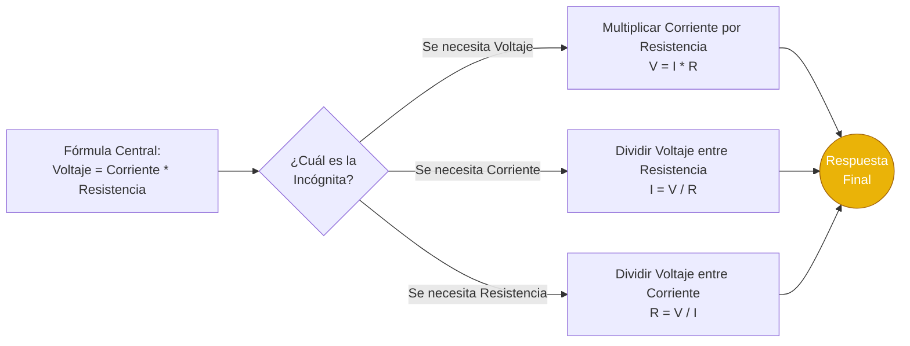
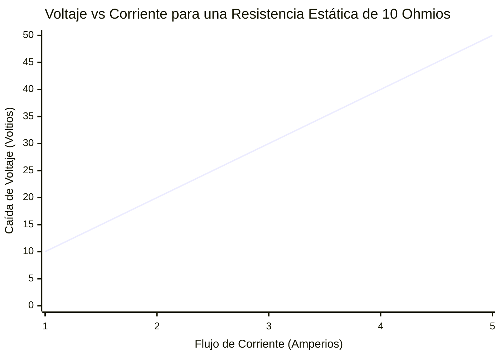
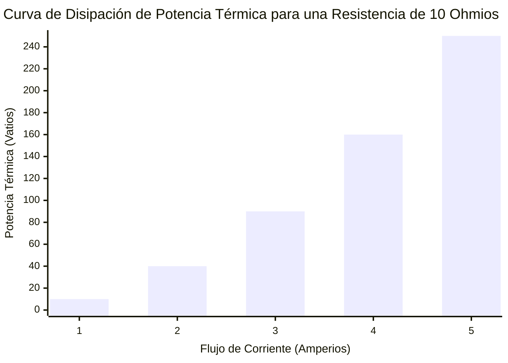
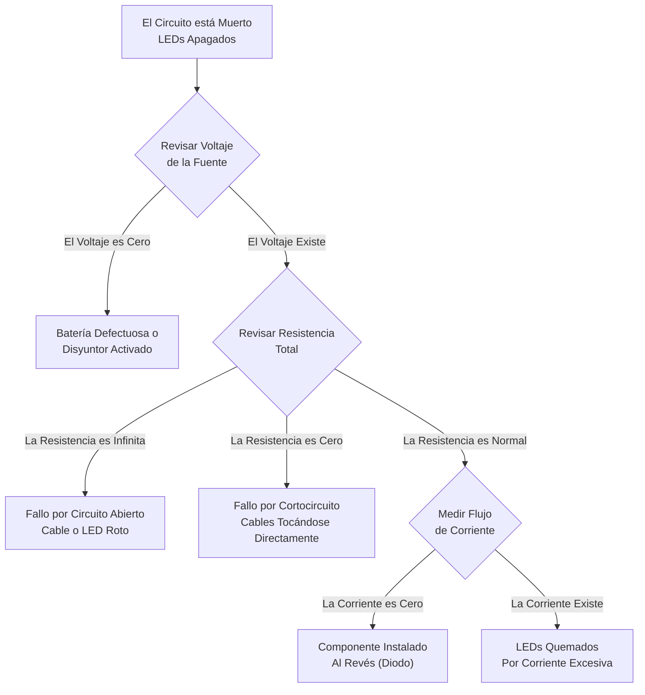

# La Calculadora Definitiva de la Ley de Ohm: Dominando Voltaje, Corriente, Resistencia y Potencia Eléctrica

Bienvenido a la **Calculadora de la Ley de Ohm** definitiva y la guía completa de ingeniería eléctrica. Ya sea que sea un aficionado a la electrónica que dimensiona una resistencia limitadora de corriente para un LED de Raspberry Pi, un estudiante de física luchando con la tarea de análisis de circuitos, o un maestro electricista calculando la caída de voltaje en 100 metros de cable de cobre, este conjunto interactivo proporciona las derivaciones matemáticas exactas que usted necesita.

La Ley de Ohm es la base absoluta de toda la tecnología moderna. Desde los transistores microscópicos a escala nanométrica en el interior del procesador de su teléfono inteligente hasta las enormes líneas de transmisión de alto voltaje que abarcan el país, cada sistema eléctrico obedece perfectamente a las relaciones entre el Voltaje ($V$), la Corriente ($I$), la Resistencia ($R$) y la Potencia ($P$).

En esta exhaustiva guía SEO de más de 4000 palabras, deconstruiremos agresivamente las fórmulas fundamentales ($V = IR$ y $P = VI$). Exploraremos la física del calentamiento de Joule, decodificaremos el arcaico sistema de código de colores de resistencias de 4 bandas, probaremos matemáticamente las Leyes de Circuitos de Kirchhoff y analizaremos cinco escenarios conceptuales eléctricos detallados, representados visualmente mediante diagramas interactivos de Mermaid.js.

---

## 1. Deconstruyendo la Santísima Trinidad: Voltaje, Corriente y Resistencia

Para dominar la electrónica, debe comprender intuitivamente la relación entre las tres variables centrales de la Ley de Ohm. La analogía más común y precisa utilizada por los físicos es la **Analogía de la Tubería de Agua**.

### Voltaje ($V$): La Presión del Agua
El **Voltaje**, conocido oficialmente como *Diferencia de Potencial Eléctrico*, es la fuerza que empuja los electrones a través de un circuito. 
- En nuestra analogía del agua, el Voltaje es la **presión del agua** en la tubería (o la altura de la torre de agua).
- Cuanto mayor es el voltaje, más fuerte son empujados los electrones. 
- **Unidad del SI:** Voltio ($\text{V}$). 

### Corriente ($I$): La Tasa de Flujo de Agua
La **Corriente** es el flujo físico real de carga eléctrica (electrones) a través de un punto específico en un circuito a lo largo del tiempo.
- En nuestra analogía del agua, la Corriente es el **volumen de agua** que sale de la tubería por segundo (galones por minuto).
- **Unidad del SI:** Amperio ($\text{A}$). Un Amperio representa un Coulomb de carga ($6.242 \times 10^{18}$ electrones) fluyendo a través de un punto cada segundo.

### Resistencia ($R$): La Restricción de la Tubería
La **Resistencia** es la oposición inherente que un material presenta al flujo de la corriente eléctrica.
- En nuestra analogía del agua, la Resistencia es la **estrechez de la tubería** o una válvula física que restringe el flujo.
- Un cable delgado tiene una alta resistencia; un cable grueso tiene una baja resistencia.
- **Unidad del SI:** Ohmio ($\Omega$).

---

## 2. Definiendo la Ley de Ohm ($V = I \cdot R$)

Publicada por el físico alemán Georg Simon Ohm en 1827, la Ley de Ohm vincula matemáticamente a estas tres variables. Establece que la corriente que fluye a través de un conductor estático es directamente proporcional al voltaje aplicado sobre él, e inversamente proporcional a su resistencia.

$$V = I \cdot R$$

A partir de esta sola ecuación algebraica, podemos derivar las otras dos mediante un simple despeje:
- **Resolviendo para la Corriente:** $I = \frac{V}{R}$ (Si usted aumenta la resistencia, la corriente disminuye. Si usted aumenta el voltaje, la corriente aumenta).
- **Resolviendo para la Resistencia:** $R = \frac{V}{I}$ (Si un dispositivo consume muy poca corriente a un voltaje alto, debe tener una resistencia interna enorme).

---

## 3. El Peligro de la Potencia y el Calentamiento de Joule ($P = VI$)

Mientras que la Ley de Ohm ($V = IR$) dicta cómo se mueven los electrones, la **Ley de Watt** ($P = VI$) dicta las consecuencias termodinámicas de ese movimiento. 

La **Potencia Eléctrica ($P$)** es la velocidad a la que la energía eléctrica se transforma en otra forma de energía, generalmente trabajo mecánico (motores), luz (LEDs) o más comúnmente, calor térmico. La unidad del SI para la Potencia es el **Vatio ($\text{W}$)**.

$$P = V \cdot I$$

Al combinar algebraicamente la Ley de Ohm ($V = IR$) con la Ley de Watt ($P = VI$), podemos derivar dos ecuaciones de potencia variantes increíblemente útiles:

1. **Potencia a través de Corriente y Resistencia:** $P = I^2 \cdot R$
2. **Potencia a través de Voltaje y Resistencia:** $P = \frac{V^2}{R}$

### La Regla Cuadrática del Calentamiento de Joule
Mire detenidamente la ecuación $P = I^2 \cdot R$. Note que la Corriente ($I$) está al cuadrado. Esto significa que si usted duplica la corriente que fluye a través de un cable del circuito, la potencia disipada como calor puro no solo se duplica, se **cuadruplica**. 
¡Si usted triplica la corriente, el calor se incrementa en un factor de nueve! 

Esta es exactamente la razón por la cual las empresas de servicios eléctricos transmiten energía a través de largas distancias utilizando voltajes increíblemente altos (como $500,000\text{ Voltios}$). Al elevar el voltaje a niveles astronómicos, pueden transmitir la misma cantidad de Potencia total ($P = VI$) mientras mantienen la Corriente ($I$) extremadamente baja. La corriente baja minimiza completamente las pérdidas de calor por $I^2 R$ en las líneas de transmisión.

---

## 4. Decodificando el Sistema de Bandas de Colores de las Resistencias

Al construir circuitos físicos en una placa de pruebas (breadboard), utilizará pequeñas resistencias axiales de orificio pasante. Debido a que estos componentes cilíndricos son demasiado pequeños para que se impriman números en ellos de manera legible, la industria electrónica adoptó rayas de colores estándar para indicar el valor de la resistencia en Ohmios.

Nuestra calculadora cuenta con un visualizador integrado, pero aquí está la lógica de decodificación manual para **Resistencias de 4 Bandas** estándar:
1. **Banda 1 (Primer Dígito):** La primera cifra significativa.
2. **Banda 2 (Segundo Dígito):** La segunda cifra significativa.
3. **Banda 3 (Multiplicador):** La potencia de 10 por la cual multiplicar los primeros dos dígitos.
4. **Banda 4 (Tolerancia):** La precisión de fabricación de la resistencia.

**Ejemplo de Cálculo:** Una resistencia tiene bandas coloreadas: **Rojo, Violeta, Naranja, Oro**.
- Rojo = 2
- Violeta = 7
- Naranja = Multiplicador de $1,000$ (o $10^3$)
- Oro = Tolerancia de $\pm 5\%$
- **Resultado:** $27 \times 1,000 = 27,000\ \Omega$ (o $27\text{ k}\Omega$) con un margen de tolerancia del $5\%$.

---

## 5. Guía Completa de Uso: Maximizando la Calculadora

Nuestra Calculadora interactiva de la Ley de Ohm opera como un robusto multímetro digital y simulador de circuitos.

### Paso 1: Seleccione su Variable Objetivo
Utilice la navegación superior para seleccionar la variable desconocida que necesita calcular:
- **Voltaje ($V$):** Calcule la diferencia de potencial a través de una resistencia conocida.
- **Corriente ($I$):** Determine cuántos Amperios extraerá su circuito de la fuente de alimentación.
- **Resistencia ($R$):** Calcule la resistencia necesaria para limitar la corriente de forma segura (ej., para un LED).
- **Potencia ($P$):** Calcule la disipación térmica para asegurarse de que su resistencia no se incendie.

### Paso 2: Utilice Preajustes de Circuitos del Mundo Real
Omita la entrada manual de datos seleccionando de nuestros 8 preajustes integrados. ¿Necesita calcular la corriente máxima segura para un puerto USB estándar? Seleccione **USB 5V**, y la calculadora completará instantáneamente $V = 5.0\text{V}$ y mapeará dinámicamente las curvas de corriente.

### Paso 3: Monitoree el Medidor de Disipación de Calor
Cada vez que calcule la Potencia ($P$), observe el medidor termodinámico interactivo. 
Las resistencias estándar para placas de pruebas solo están clasificadas para **$0.25\text{ Vatios}$** ($250\text{ mW}$). Si su potencia calculada excede los $0.25\text{W}$, el medidor se volverá Rojo, advirtiéndole que el componente físico se quemará y fallará. Usted debe entonces reducir el voltaje, aumentar la resistencia o comprar una resistencia físicamente más grande clasificada para un mayor vataje (ej., una resistencia de cerámica de $1\text{W}$ o $5\text{W}$).

---

## 6. Cinco Escenarios de Ingeniería Conceptual con Visualizaciones 2D

Para dominar completamente las relaciones matemáticas de la teoría de circuitos de CC, exploraremos cinco escenarios físicos distintos, desglosados visualmente utilizando diagramas personalizados de Mermaid.js. *(Todos los diagramas han sido estrictamente optimizados para la seguridad del analizador de Mermaid 11.16).*

### Ejemplo 1: La Lógica de la Fórmula de la Ley de Ohm (Resolviendo Variables)

**El Escenario:**
Un estudiante de primer año de ingeniería eléctrica necesita visualizar rápidamente las permutaciones algebraicas de la Ley de Ohm ($V = IR$) para resolver múltiples preguntas de exámenes.

**Visualización 2D:**
Este diagrama de flujo lógico ilustra la técnica clásica de aislamiento de variables para Voltaje, Corriente y Resistencia.

---

### Ejemplo 2: Voltaje vs Corriente Lineal (Resistencia Fija)

**El Escenario:**
Usted tiene una resistencia de cerámica estática fija de $10\ \Omega$ en su escritorio. La conecta a una fuente de alimentación de banco ajustable. A medida que aumenta lentamente el dial de la Corriente (de $1\text{A}$ a $5\text{A}$), ¿cómo responde exactamente el Voltaje a través de la resistencia?

**Las Matemáticas:**
Dado que $R = 10$, $V = I \cdot 10$. La relación es perfectamente lineal.
- A $1\text{A}$: $V = 1 \cdot 10 = 10\text{V}$
- A $5\text{A}$: $V = 5 \cdot 10 = 50\text{V}$

**Visualización 2D:**
Este gráfico traza la línea perfectamente recta lineal característica de las cargas puramente resistivas (Óhmicas).

---

### Ejemplo 3: La Curva Cuadrática de Disipación de Potencia (Calentamiento de Joule)

**El Escenario:**
Utilizando exactamente la misma resistencia de $10\ \Omega$ y la misma fuente de alimentación del Ejemplo 2, ahora queremos rastrear el calor total generado (Potencia) a medida que aumentamos el dial de la Corriente de $1\text{A}$ a $5\text{A}$. 

**Las Matemáticas:**
Usamos la fórmula de calentamiento de Joule $P = I^2 \cdot R$. ¡Note que la Corriente está al cuadrado!
- A $1\text{A}$: $P = (1 \cdot 1) \cdot 10 = 10\text{W}$
- A $2\text{A}$: $P = (2 \cdot 2) \cdot 10 = 40\text{W}$
- A $5\text{A}$: $P = (5 \cdot 5) \cdot 10 = 250\text{W}$

**Visualización 2D:**
Este gráfico de barras demuestra violentamente cómo la generación de calor se sale de control exponencialmente a medida que la corriente aumenta, lo que demuestra por qué los cortocircuitos derriten los cables instantáneamente.

---

### Ejemplo 4: Diagrama de Flujo de Diagnóstico para un Circuito Muerto

**El Escenario:**
Un técnico electrónico está solucionando un problema en una matriz de LED personalizada que se niega a encenderse. Necesita un procedimiento lógico y sistemático basado en la Ley de Ohm para identificar el punto de falla.

**Visualización 2D:**
Este diagrama de flujo describe el procedimiento operativo estándar para utilizar un multímetro a fin de verificar la integridad del Voltaje, la Resistencia y la Corriente.

---

### Ejemplo 5: Diagrama de Gantt de Calibración de Laboratorio

**El Escenario:**
Un laboratorio de física universitario requiere que los estudiantes verifiquen experimentalmente la Ley de Ohm utilizando multímetros digitales de alta precisión, fuentes de alimentación variables y cajas de resistencia de décadas.

**Visualización 2D:**
Este diagrama de Gantt describe los pasos cronológicos altamente regimentados que se requieren para realizar la calibración del hardware físico de manera segura sin quemar los sensibles fusibles internos de los multímetros.

```mermaid
gantt
    title Secuencia de Calibración de Hardware para Experimento de Ley de Ohm
    dateFormat  HH:mm:ss
    axisFormat  %H:%M:%S
    
    section Configuración de Hardware
    Verificar Fuente de Alimentación APAGADA :done, 00:00:00, 5s
    Conectar Resistencia a Terminales :active, 00:00:05, 10s
    
    section Prep de Multímetro
    Configurar Voltímetro en Paralelo :active, 00:00:15, 15s
    Configurar Amperímetro en Serie :crit, 00:00:30, 20s
    
    section Recolección de Datos
    Activar Fuente de Alimentación :done, 00:00:50, 5s
    Barrer Voltaje y Registrar Datos de Corriente :active, 00:00:55, 30s
    Calcular Resistencia igual a Voltaje dividido por Corriente :milestone, 00:01:25, 5s
```

---

## 7. Análisis Profundo de Preguntas Frecuentes (FAQ)

**P: ¿La Ley de Ohm se aplica a los LEDs y Diodos?**
**R:** No directamente. La Ley de Ohm solo se aplica perfectamente a los dispositivos "óhmicos" (como resistencias y cables estándar) donde la resistencia permanece constante. Los LEDs son diodos semiconductores no lineales; su resistencia cae drásticamente a medida que aumenta el voltaje. Debe usar la Ley de Ohm en la *resistencia en serie* emparejada con el LED para controlar la corriente ($R = (V_{fuente} - V_{led}) / I_{led}$).

**P: ¿Qué es exactamente un Cortocircuito?**
**R:** Un cortocircuito ocurre cuando un camino de baja resistencia elude la carga eléctrica deseada. Dado que $I = V/R$, si la Resistencia ($R$) cae a casi cero, la Corriente ($I$) se dispara matemáticamente hacia el infinito. Este pico masivo de corriente causa un violento calentamiento de Joule $I^2 R$ en los cables, derritiendo el aislamiento y causando incendios en las baterías.

**P: ¿Por qué los voltímetros tienen una resistencia increíblemente alta?**
**R:** Para medir el voltaje con precisión, un voltímetro debe colocarse en paralelo con el componente. Si el voltímetro tuviera baja resistencia, la corriente tomaría el "camino de menor resistencia" a través del medidor en lugar del componente, alterando fundamentalmente el circuito que usted está tratando de medir. La alta resistencia asegura que el medidor extraiga casi cero corriente.

**P: ¿Por qué los amperímetros tienen casi cero resistencia?**
**R:** Un amperímetro debe colocarse completamente en serie con el circuito para que el $100\%$ de la corriente fluya a través de él. Si el amperímetro tuviera una resistencia alta, actuaría como un cuello de botella, restringiendo la corriente y disminuyendo artificialmente la misma medición que intenta tomar.

**P: ¿Qué es la Conductancia Eléctrica?**
**R:** La conductancia ($G$) es simplemente el recíproco matemático de la resistencia ($G = 1 / R$). Mide con qué facilidad fluye la corriente, en lugar de con qué fuerza se opone a ella. La unidad del SI para la conductancia es el Siemens ($\text{S}$).

---

## 8. Conclusión y Desafío de Ingeniería

La Ley de Ohm es el libro de reglas ineludible de la red eléctrica del universo. Cada vez que enchufa un portátil, enciende una linterna o carga un vehículo eléctrico, millones de electrones obedecen ciegamente a $V = IR$ y purgan calor vía $P = I^2 R$.

Para garantizar que ha dominado estos conceptos, inicie nuestro Simulador de CC interactivo e intente resolver los siguientes desafíos:
1. **El LED Derretido:** Usted conecta un LED rojo ($2\text{V}$ de voltaje directo, $20\text{mA}$ de corriente óptima) directamente a una batería de $9\text{V}$ sin una resistencia. Explota al instante. Use la Ley de Ohm para calcular la Resistencia exacta ($\Omega$) de la resistencia protectora que *debería* haber usado.
2. **El Calentador de Espacio:** Un calentador de espacio eléctrico se enchufa en una toma de pared estándar de EE. UU. de $120\text{V}$ y extrae unos enormes $12.5\text{ Amperios}$ de corriente continua. Calcule la Potencia térmica total ($P$) que emite a la habitación en Vatios.
3. **La Caída en el Cable de Extensión:** Usted extiende un cable de cobre barato de $100\text{ pies}$ de largo hasta su jardín. El cable total tiene una resistencia de $2\ \Omega$. Si su herramienta eléctrica consume $10\text{A}$ de corriente, calcule la Caída de Voltaje ($V$) exacta que se pierde puramente debido a la resistencia del cable antes de que la energía alcance a la herramienta.

Confíe en esta calculadora, respete la física del calentamiento de Joule y nunca olvide: el Voltaje empuja, la Resistencia restringe y la Corriente mata.
