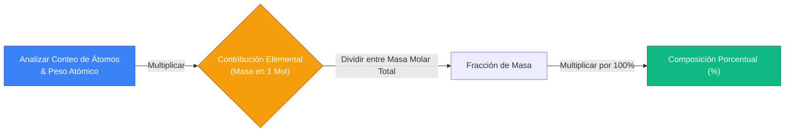
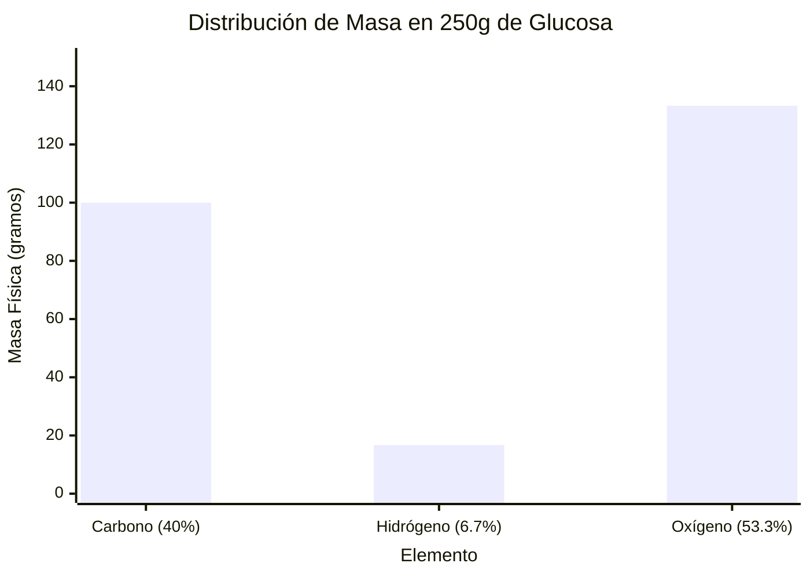
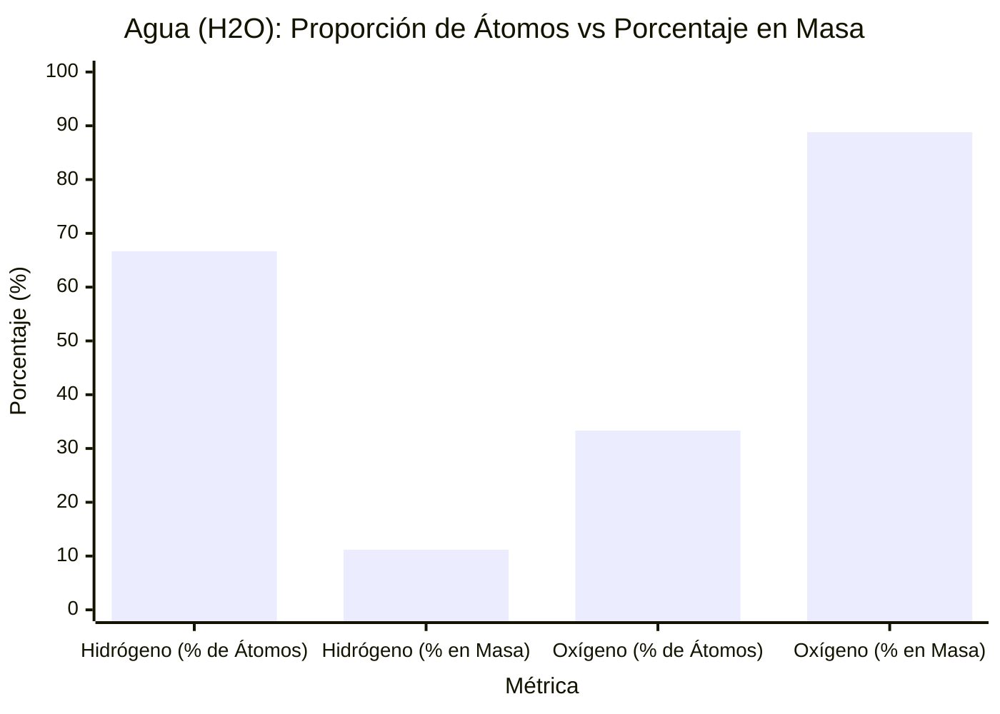
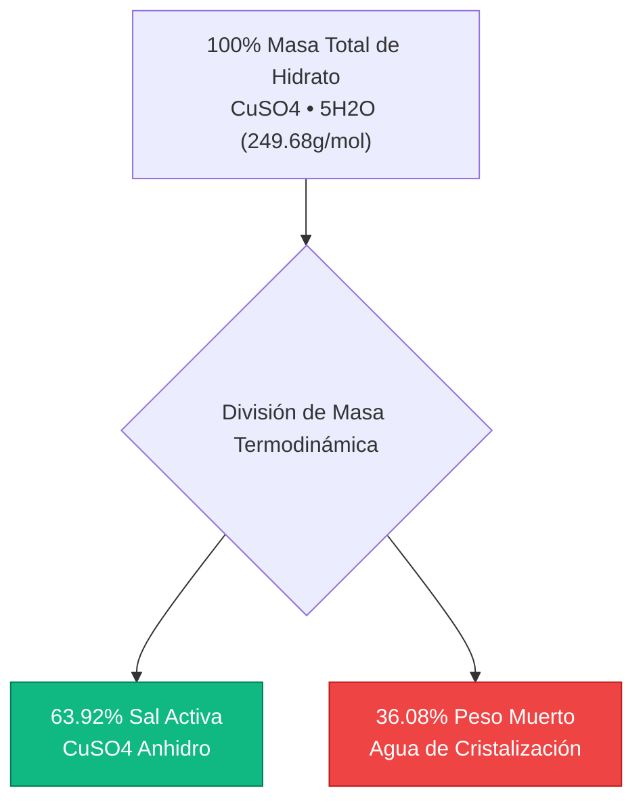
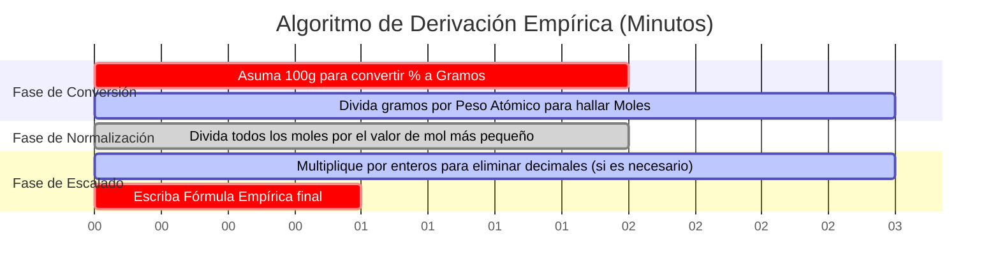

# La Calculadora Definitiva de Composición Porcentual: Fracciones de Masa y Análisis Empírico

Bienvenido a la **Calculadora de Composición Porcentual** definitiva y a la guía completa de química analítica. Ya sea usted un estudiante de química de secundaria descifrando su primera fórmula empírica, un químico analítico procesando datos de análisis de combustión elemental, o un ingeniero farmacéutico diseñando soluciones fisiológicas de medicamentos, dominar las matemáticas de la Composición Porcentual en Masa es una necesidad absoluta.

Las fórmulas químicas dictan la proporción exacta de números enteros de los átomos en un compuesto, pero NO representan la proporción física en masa. Dado que los diferentes elementos poseen pesos atómicos radicalmente distintos, un elemento que conforma la mayoría de los *átomos* en una molécula podría contribuir con la fracción más pequeña de su *masa física*.

En esta exhaustiva clase magistral de SEO de más de 4,000 palabras, deconstruiremos por completo los algoritmos matemáticos detrás de la composición porcentual, expondremos las diferencias críticas entre el Porcentaje de Átomos y el Porcentaje en Masa, mapearemos matemáticamente el agua de hidratación en las sales cristalinas y descifraremos el proceso paso a paso para derivar las Fórmulas Empíricas. Para garantizar una comprensión absoluta, hemos incluido cinco diagramas interactivos de Mermaid.js meticulosamente detallados y seguros para el analizador (parser-safe).

---

## 1. Las Matemáticas de la Composición Porcentual en Masa

La **Composición Porcentual en Masa** define el porcentaje exacto de la masa molar total de un compuesto químico que aporta cada elemento constituyente.

La ley de proporciones definidas establece que un compuesto químico puro *siempre* contendrá la misma proporción exacta de masa de sus elementos constituyentes, sin importar si tiene $1.0\text{ gramo}$ o $10,000\text{ kilogramos}$ de la sustancia.

**La Ecuación de Composición Porcentual:**
$$\% \text{Elemento}_i = \left( \frac{\text{Conteo de Átomos}_i \times \text{Peso Atómico}_i}{\text{Masa Molar Total del Compuesto}} \right) \times 100\%$$

### Calculando la Composición Porcentual del Agua ($\text{H}_2\text{O}$)
Para calcular el porcentaje en masa del agua, primero debemos analizar su masa molar:
- **Hidrógeno ($\text{H}$):** $2 \text{ átomos} \times 1.008\text{ g/mol} = 2.016\text{ g/mol}$
- **Oxígeno ($\text{O}$):** $1 \text{ átomo} \times 15.999\text{ g/mol} = 15.999\text{ g/mol}$
- **Masa Molar Total ($\text{H}_2\text{O}$): $18.015\text{ g/mol}$**

**Ahora aplique la ecuación de porcentaje:**
- **% de Hidrógeno:** $(2.016 / 18.015) \times 100\% = \mathbf{11.19\%}$
- **% de Oxígeno:** $(15.999 / 18.015) \times 100\% = \mathbf{88.81\%}$

Debido a que los porcentajes deben sumar un $100\%$, podemos verificar matemáticamente nuestro trabajo: $11.19\% + 88.81\% = 100.00\%$.

---

## 2. La Diferencia Crítica: Porcentaje de Átomos vs Porcentaje en Masa

La trampa más común para los estudiantes de química es confundir el **Porcentaje de Átomos** con el **Porcentaje en Masa**. Son conceptos completamente diferentes.

Considere el Agua ($\text{H}_2\text{O}$).
- **Porcentaje de Átomos:** El agua tiene 3 átomos en total ($2\text{ H}$, $1\text{ O}$). El hidrógeno representa $2/3$ de los átomos, haciéndolo el **$66.7\%$** de la molécula por conteo de átomos.
- **Porcentaje en Masa:** Como se comprobó anteriormente, el hidrógeno solo representa el **$11.19\%$** de la masa física.

¿A qué se debe esta enorme discrepancia? A que un átomo de Oxígeno ($15.999\text{ g/mol}$) es casi $16\text{ veces más pesado}$ que un átomo de Hidrógeno ($1.008\text{ g/mol}$). A pesar de que el hidrógeno supera en número al oxígeno de $2\text{ a }1$, el oxígeno domina por completo la masa física del compuesto.

---

## 3. Hidratos y Agua de Cristalización ($\cdot x\text{H}_2\text{O}$)

Muchas sales iónicas absorben naturalmente las moléculas de agua de la humedad circundante en la atmósfera, atrapando estas moléculas de agua firmemente dentro de su red cristalina 3D. Estos se conocen como **Hidratos**. 

Al calcular la composición porcentual de un hidrato, es crítico determinar qué porcentaje de la masa total del cristal es en realidad solo agua atrapada.

### Sulfato de Cobre(II) Pentahidratado ($\text{CuSO}_4\cdot 5\text{H}_2\text{O}$)
- **Sal Anhidra ($\text{CuSO}_4$):** $159.602\text{ g/mol}$.
- **Agua Atrapada ($5\text{H}_2\text{O}$):** $5 \times 18.015 = 90.075\text{ g/mol}$.
- **Masa Molar Hidratada Total:** $159.602 + 90.075 = \mathbf{249.677\text{ g/mol}}$.

**Porcentaje de Agua:**
$$\% \text{Agua} = \left( \frac{90.075}{249.677} \right) \times 100\% = \mathbf{36.08\%}$$

Si compra $100\text{ libras}$ de $\text{CuSO}_4\cdot 5\text{H}_2\text{O}$ a un proveedor de productos químicos, ¡$36.08\text{ libras}$ de lo que compró es literalmente solo agua atrapada!

---

## 4. El Puente a la Fórmula Empírica

La composición porcentual es el puente analítico fundamental requerido para derivar una **Fórmula Empírica** (la proporción de números enteros más simple de átomos en un compuesto). 
Cuando un químico analítico pasa un compuesto orgánico desconocido a través de un analizador de combustión, la máquina muestra la composición porcentual en masa. Luego, el químico debe ejecutar un riguroso algoritmo matemático para convertir esos porcentajes nuevamente en una fórmula química.

**El Algoritmo de Derivación Empírica:**
1. **Asuma una Muestra de $100\text{g}$:** Trate cada porcentaje como una masa física en gramos (ej., $40.0\% \text{ de Carbono} = 40.0\text{ gramos de Carbono}$).
2. **Convierta de Masa a Moles:** Divida la masa de cada elemento por su peso atómico específico de la tabla periódica.
3. **Derive la Pseudo-fórmula:** Ahora tiene una fórmula con decimales (ej., $\text{C}_{3.33}\text{H}_{6.66}\text{O}_{3.33}$).
4. **Normalice a Números Enteros:** Divida todos los valores de moles por el valor de moles absoluto más pequeño en el conjunto.
5. **Escale a Números Enteros:** Si la normalización da como resultado fracciones (como $.5$ o $.33$), multiplique todos los números por un entero ($2$ o $3$) para lograr subíndices de números enteros perfectos.

---

## 5. Cinco Escenarios de Ingeniería Conceptual con Visualizaciones 2D

Para dominar completamente los algoritmos que rigen la composición porcentual, las distribuciones de masas y las derivaciones empíricas, exploraremos cinco escenarios distintos de química analítica desglosados visualmente usando diagramas personalizados de Mermaid.js.

### Ejemplo 1: El Algoritmo de Cálculo de Composición Porcentual

**El Escenario:**
Un estudiante de ciencias de la computación está intentando mapear la ruta lógica matemática necesaria para derivar computacionalmente la composición porcentual.

**Visualización 2D:**
Este diagrama de flujo lógico traza la estricta vía de conversión bipartita que vincula los pesos atómicos con los porcentajes en masa finales.

---

### Ejemplo 2: Distribución de la Masa de la Muestra (Glucosa)

**El Escenario:**
Un nutricionista necesita determinar exactamente cuántos gramos físicos de Carbono están contenidos dentro de un bloque de $250.0\text{ gramos}$ de pura Glucosa ($\text{C}_6\text{H}_{12}\text{O}_6$). 
Dado que la glucosa tiene exactamente un $40.00\%$ de carbono por masa, multiplicamos $250\text{g} \times 0.400 = 100.0\text{g}$.

**Visualización 2D:**
Este gráfico comprueba visualmente cómo una masa de muestra macroscópica total se distribuye físicamente entre sus elementos constituyentes basándose estrictamente en sus porcentajes en masa calculados.

---

### Ejemplo 3: La Paradoja del Porcentaje de Átomos vs Porcentaje en Masa

**El Escenario:**
Un estudiante de química de primer año lucha por entender cómo el Hidrógeno, que conforma el $66.7\%$ de los átomos en el agua, solo aporta el $11.19\%$ de la masa.

**Visualización 2D:**
Este gráfico comparativo lado a lado expone visualmente la gran discrepancia entre las métricas de conteo de átomos y las métricas de masa física debido a las disparidades extremas en el peso atómico.

---

### Ejemplo 4: Desglose de Masa en la Red de Hidratos

**El Escenario:**
Un proveedor de productos químicos calcula el desperdicio financiero del envío de hidratos químicos "húmedos" a través del país, ya que están pagando costos de flete por agua atrapada.

**Visualización 2D:**
Este diagrama de flujo de arriba hacia abajo mapea el desglose porcentual exacto del Sulfato de Cobre(II) Pentahidratado, demostrando que más de un tercio del peso del cristal es agua económicamente inútil.

---

### Ejemplo 5: Línea de Tiempo para la Derivación de la Fórmula Empírica

**El Escenario:**
Un químico analítico extrae porcentajes en masa de un analizador de combustión y ejecuta el riguroso algoritmo matemático para derivar la fórmula empírica del compuesto desconocido.

**Visualización 2D:**
Este diagrama de Gantt visualiza la secuencia cronológica de transformaciones matemáticas necesarias para convertir los porcentajes nuevamente a subíndices químicos enteros.

---

## 6. Conclusión y Desafío de Estequiometría

Dominar la Composición Porcentual es el cimiento ineludible de toda la química analítica. Comprender la estricta diferencia entre las proporciones de átomos y las fracciones de masa, respetar la gran huella de densidad del agua atrapada en los hidratos y revertir matemáticamente los porcentajes a fórmulas empíricas garantizará que el rendimiento de sus análisis de laboratorio sea perfectamente preciso.

Si ignora estos principios matemáticos, calculará de manera drásticamente equivocada las dosis de reactivos, enviará hidratos químicos de forma ineficiente y fallará en cada análisis de espectrometría de masas que realice.

Para garantizar que ha dominado estos conceptos críticos, inicie nuestro Simulador interactivo e intente resolver estos últimos desafíos de química analítica:
1. **El Desafío del Fertilizante:** ¿Qué fertilizante agrícola contiene un mayor porcentaje de Nitrógeno puro por masa: Amoníaco ($\text{NH}_3$) o Nitrato de Amonio ($\text{NH}_4\text{NO}_3$)? ¡Deberá calcular ambos para averiguarlo!
2. **El Desafío del Hidrato:** Tiene una muestra de $500.0\text{g}$ de Sulfato de Magnesio Heptahidratado ($\text{MgSO}_4\cdot 7\text{H}_2\text{O}$). ¿Exactamente cuántos gramos físicos de agua están atrapados dentro de ese bloque sólido?
3. **El Desafío Empírico:** Un analizador de combustión informa que un gas desconocido tiene exactamente un $74.87\%$ de Carbono y un $25.13\%$ de Hidrógeno en masa. Ejecute el algoritmo de derivación empírica para determinar la fórmula química de este gas. (Pista: alimenta su estufa).

Confíe en esta calculadora para auditar sus resultados analíticos de combustión, determinar rápidamente las distribuciones de carga elemental y dominar para siempre las matemáticas de la estequiometría física.
