# Guía de Química Analítica y de Laboratorio para pH y Equilibrio Ácido-Base

En química analítica y física, el **pH** mide la actividad del ion de hidrógeno en soluciones acuosas:

$$\text{pH} = -\log_{10}[\text{H}^+] \quad \iff \quad [\text{H}^+] = 10^{-\text{pH}}$$

$$\text{pH} + \text{pOH} = \text{p}K_w \quad \text{donde } K_w = [\text{H}^+][\text{OH}^-]$$

---

## 1. Matriz de Referencia de $K_w$ Dependiente de la Temperatura y pH Neutro

| Temperatura (°C) | Autoionización del Agua ($K_w$) | $\text{p}K_w$ | pH Neutro ($\frac{1}{2}\text{p}K_w$) | Nota Fisiológica / de Contexto |
| :--- | :--- | :--- | :--- | :--- |
| **$0^\circ\text{C}$** | $1.14 \times 10^{-15}$ | $14.94$ | **$7.47$** | Punto de congelación del agua |
| **$25^\circ\text{C}$** | $1.00 \times 10^{-14}$ | $14.00$ | **$7.00$** | Referencia estándar de laboratorio |
| **$37^\circ\text{C}$** | $2.40 \times 10^{-14}$ | $13.62$ | **$6.81$** | Temperatura normal del cuerpo humano |
| **$60^\circ\text{C}$** | $9.60 \times 10^{-14}$ | $13.02$ | **$6.51$** | Agua de proceso calentada |

---

## 2. Protocolos Estándar de Cálculo Ácido-Base

```
1. Ácido Fuerte (monoprótico): [H+] = C_acid  ===>  pH = -log10[C_acid]
2. Base Fuerte (monohidróxido): [OH-] = C_base  ===>  pOH = -log10[C_base]  ===>  pH = pKw - pOH
3. Ácido Débil (HA <==> H+ + A-): Resolver x^2 + Ka*x - Ka*C = 0  ===>  pH = -log10(x)
4. Solución Tampón: pH = pKa + log10([Base Conjugada] / [Ácido Débil])
```

---

## 3. Aviso de Seguridad Educativo y de Laboratorio
*Esta calculadora de pH proporciona cálculos teóricos de equilibrio ácido-base para aplicaciones educativas, de investigación de laboratorio y de química AP. Las soluciones no ideales concentradas y los tampones analíticos precisos deben tener en cuenta la fuerza iónica y los coeficientes de actividad utilizando medidores de pH calibrados.*

## 4. La Guía Completa del pH y la Química Ácido-Base

Bienvenido a la guía definitiva sobre cómo entender, calcular y manipular el pH en soluciones químicas. Ya sea que sea un estudiante de secundaria que aprende sobre logaritmos por primera vez, un estudiante de química AP preparándose para problemas de equilibrio agotadores o un bioquímico modelando los sistemas de amortiguamiento de la sangre humana, dominar el pH es esencial para navegar por el mundo molecular.

En su esencia, el pH es una medida de cuán ácida o básica es una solución acuosa (basada en agua). Dicta directamente cómo se comportarán las moléculas, cómo se plegarán las enzimas y cómo procederán las reacciones industriales. Un ligero cambio en el pH del torrente sanguíneo humano puede ser fatal, mientras que un cambio en el pH del suelo puede determinar si una cosecha entera se produce o se marchita.

En esta guía exhaustiva, exploraremos la mecánica profunda de la química ácido-base, desempaquetaremos las matemáticas logarítmicas que rigen la escala de pH, explicaremos la dependencia de la temperatura de la neutralidad, que a menudo se malinterpreta, y veremos cinco ejemplos altamente detallados del mundo real, completos con derivaciones matemáticas y diagramas visuales en 2D.

### 4.1 ¿Qué es exactamente el pH?

El término "pH" significa "potencial de hidrógeno" (o "poder del hidrógeno"). Es una escala logarítmica que se utiliza para especificar la acidez o basicidad de una solución acuosa. Matemáticamente, el pH es el logaritmo negativo en base 10 de la concentración molar de iones de hidrógeno ($\text{H}^+$) en una solución.

Debido a que un ion de hidrógeno desnudo (un solo protón) no existe de forma aislada en el agua, se adhiere a una molécula de agua para formar un ion hidronio ($\text{H}_3\text{O}^+$). Para simplificar los cálculos, $\text{H}^+$ y $\text{H}_3\text{O}^+$ se usan indistintamente.

$$ \text{pH} = -\log_{10}[\text{H}^+] $$

Debido a que la escala es logarítmica, un cambio de **una unidad de pH** representa un **cambio de diez veces** en la concentración de iones de hidrógeno. Una solución con un pH de 3 es diez veces más ácida que una solución con un pH de 4, y cien veces más ácida que una solución con un pH de 5.

### 4.2 La Interacción del pH y pOH

Así como el pH mide la concentración de iones de hidrógeno, el **pOH** mide la concentración de iones de hidróxido ($\text{OH}^-$). 

$$ \text{pOH} = -\log_{10}[\text{OH}^-] $$

En el agua pura, las moléculas de agua se autoionizan, separándose espontáneamente en iones de hidrógeno y de hidróxido:
$\text{H}_2\text{O} \rightleftharpoons \text{H}^+ + \text{OH}^-$

La constante de equilibrio para esta reacción se conoce como la constante de autoionización del agua, $K_w$. A temperatura ambiente estándar (25°C), $K_w$ es exactamente $1.0 \times 10^{-14}$. 

Esto crea una relación matemática rígida entre el pH y el pOH. A 25°C:
$$ \text{pH} + \text{pOH} = 14.00 $$

Si conoce el pH, conoce inmediatamente el pOH, y por lo tanto conoce la concentración de ambos iones críticos en la solución.

### 4.3 El Mito de la Temperatura: ¿El pH neutro es siempre 7.00?

Un concepto erróneo común enseñado en química introductoria es que un pH neutro está rígidamente fijado en 7.00. **Esto es fundamentalmente falso.** 

La neutralidad simplemente significa que la concentración de iones de hidrógeno es igual a la concentración de iones de hidróxido ($[\text{H}^+] = [\text{OH}^-]$). Debido a que la autoionización del agua es un proceso endotérmico, aumentar la temperatura impulsa la reacción hacia adelante, creando *más* iones y por lo tanto aumentando $K_w$.

*   A **0°C** (congelación), $K_w$ cae a $1.14 \times 10^{-15}$. El pH neutro es **7.47**.
*   A **25°C** (temperatura ambiente), $K_w$ es $1.0 \times 10^{-14}$. El pH neutro es **7.00**.
*   A **37°C** (temperatura corporal), $K_w$ sube a $2.4 \times 10^{-14}$. El pH neutro es **6.81**.

Nuestra calculadora incluye un sofisticado Motor de $K_w$ Dependiente de la Temperatura que ajusta dinámicamente la escala basándose en la temperatura introducida, garantizando una precisión fisiológica y termodinámica absoluta.

---

## 5. Guía de Uso: Dominando la Calculadora de pH

Nuestra Calculadora de pH está diseñada con una "Cabina Interactiva" que proporciona tanto conversiones instantáneas como solucionadores algorítmicos profundos para equilibrios complejos.

### 5.1 Conversiones Logarítmicas Directas

Si simplemente necesita convertir entre $[\text{H}^+]$, $[\text{OH}^-]$, pH y pOH:
1.  **Seleccione el Modo:** Elija "pH a partir de [H+]" o la conversión relevante.
2.  **Ingrese el Valor:** Puede usar notación decimal (`0.001`) o notación científica (`1e-3`).
3.  **Lea la Salida:** La calculadora poblará instantáneamente las cuatro esquinas del cuadrado ácido-base (pH, pOH, $[\text{H}^+]$, $[\text{OH}^-]$) y clasificará la solución en el espectro de 0 a 14.

### 5.2 Equilibrio de Ácido y Base Débiles

A diferencia de los ácidos fuertes que se disocian al 100%, los ácidos débiles (como el ácido acético, el vinagre) solo se disocian parcialmente. Para encontrar su pH, debe resolver una ecuación cuadrática basada en la Constante de Disociación Ácida ($K_a$).
1.  **Seleccione el Modo:** Elija "Solucionador de Equilibrio de Ácido Débil".
2.  **Ingrese los Parámetros:** Ingrese la Concentración Inicial del ácido ($C$) y su $K_a$ (o $\text{p}K_a$).
3.  **Ejecute:** La herramienta resuelve internamente la ecuación cuadrática $x^2 + K_a x - K_a C = 0$ para encontrar el $[\text{H}^+]$ exacto.

### 5.3 Soluciones Tampón y Henderson-Hasselbalch

Los tampones resisten los cambios de pH y son esenciales en biología. 
1.  **Seleccione el Modo:** Elija "Calculadora de Henderson-Hasselbalch".
2.  **Ingrese los Parámetros:** Ingrese el $\text{p}K_a$ del ácido débil, la concentración de la Base Conjugada y la concentración del Ácido Débil.
3.  **Ejecute:** La herramienta aplica la fórmula $\text{pH} = \text{p}K_a + \log([\text{Base}]/[\text{Ácido}])$ para encontrar el pH tamponado.

---

## 6. Cinco Ejemplos Conceptuales del Mundo Real

Para dominar verdaderamente la química ácido-base, debe ver estos principios aplicados a distintos escenarios. A continuación, se presentan cinco ejemplos detallados que van desde diluciones de ácidos fuertes hasta tampones bioquímicos complejos.

### Ejemplo 1: El Ácido Fuerte (Ácido Estomacal)

**Escenario:** 
El ácido gástrico en el estómago humano contiene ácido clorhídrico concentrado ($\text{HCl}$), un ácido fuerte que se disocia completamente para digerir los alimentos. Si una muestra de laboratorio de fluido gástrico simulado tiene una concentración de $\text{HCl}$ de $0.0316\text{ M}$, ¿cuál es su pH a 25°C?

**Derivación Matemática:**

1.  **Identificar el Ácido Fuerte:** El $\text{HCl}$ se disocia completamente, por lo que $[\text{H}^+] = [\text{HCl}] = 0.0316\text{ M}$.
2.  **Calcular el pH:**
    $$ \text{pH} = -\log_{10}(0.0316) $$
    $$ \text{pH} = 1.50 $$
3.  **Calcular el pOH y $[\text{OH}^-]$:**
    $$ \text{pOH} = 14.00 - 1.50 = 12.50 $$
    $$ [\text{OH}^-] = 10^{-12.50} = 3.16 \times 10^{-13}\text{ M} $$

**Visualización: Flujo de Concentración**


*Debido a que es un ácido fuerte, el cálculo es un paso matemático directo y lineal. El rojo intenso indica una alta acidez.*

### Ejemplo 2: El Ácido Débil (Vinagre / Ácido Acético)

**Escenario:**
El ácido acético ($\text{CH}_3\text{COOH}$) es el componente principal del vinagre. Es un ácido débil con un $K_a$ de $1.8 \times 10^{-5}$. Si tiene una solución de $0.10\text{ M}$ de ácido acético, ¿cuál es el pH?

**Derivación Matemática:**

1.  **Configurar la Tabla ICE (Inicial, Cambio, Equilibrio):**
    *   Inicial: $[\text{HA}] = 0.10$, $[\text{H}^+] = 0$, $[\text{A}^-] = 0$
    *   Cambio: $-x$, $+x$, $+x$
    *   Equilibrio: $0.10 - x$, $x$, $x$
2.  **Configurar la Ecuación Cuadrática:**
    $$ K_a = \frac{x^2}{0.10 - x} = 1.8 \times 10^{-5} $$
    $$ x^2 + (1.8 \times 10^{-5})x - 1.8 \times 10^{-6} = 0 $$
3.  **Resolver para $x$ ($[\text{H}^+]$):**
    Usando la fórmula cuadrática, $x \approx 0.00133\text{ M}$.
4.  **Calcular el pH:**
    $$ \text{pH} = -\log_{10}(0.00133) = 2.88 $$

**Visualización: Aproximación vs Cuadrática Exacta**

| Método | $[\text{H}^+]$ (M) | pH Calculado | % Error |
| :--- | :--- | :--- | :--- |
| **Fórmula Cuadrática (Exacta)** | $0.001333$ | $2.875$ | $0.00\%$ |
| **Aproximación ($0.10 - x \approx 0.10$)** | $0.001341$ | $2.872$ | $0.10\%$ |

*Aunque el método de aproximación a menudo se enseña en la escuela secundaria, nuestra calculadora SIEMPRE usa el solucionador cuadrático exacto para evitar errores masivos al tratar con soluciones más diluidas.*

### Ejemplo 3: El Tampón Sanguíneo (Henderson-Hasselbalch)

**Escenario:**
La sangre humana está fuertemente tamponada por el sistema de ácido carbónico-bicarbonato para mantener un pH estricto. El $\text{p}K_a$ del ácido carbónico ($\text{H}_2\text{CO}_3$) a temperatura corporal es 6.10. En un paciente sano, la concentración de bicarbonato ($\text{HCO}_3^-$) es $24\text{ mM}$ y el ácido carbónico es $1.2\text{ mM}$. Verifique el pH de la sangre.

**Derivación Matemática:**

1.  **Identificar la Fórmula:** Ecuación de Henderson-Hasselbalch.
    $$ \text{pH} = \text{p}K_a + \log_{10}\left(\frac{[\text{Base}]}{[\text{Ácido}]}\right) $$
2.  **Ingresar Valores:**
    $$ \text{pH} = 6.10 + \log_{10}\left(\frac{24}{1.2}\right) $$
3.  **Calcular:**
    $$ \text{pH} = 6.10 + \log_{10}(20) $$
    $$ \text{pH} = 6.10 + 1.30 = 7.40 $$

*El resultado es precisamente 7.40, el pH ideal de libro de texto para la sangre arterial humana.*

### Ejemplo 4: Cambio de Temperatura del Agua Pura

**Escenario:**
Un ingeniero está monitoreando el agua refrigerante en un reactor nuclear. El agua pura y desionizada está operando a $60^\circ\text{C}$. El medidor de pH marca 6.51. El ingeniero entra en pánico, pensando que el agua se ha vuelto peligrosamente ácida debido a una fuga química. ¿El agua es ácida?

**Derivación Matemática:**

1.  **Identificar $K_w$ a 60°C:** Según las tablas termodinámicas, $K_w$ a $60^\circ\text{C}$ es $9.60 \times 10^{-14}$.
2.  **Calcular $[\text{H}^+]$ para agua pura neutra:**
    $$ [\text{H}^+] = \sqrt{K_w} = \sqrt{9.60 \times 10^{-14}} = 3.098 \times 10^{-7}\text{ M} $$
3.  **Calcular el pH Neutro:**
    $$ \text{pH} = -\log_{10}(3.098 \times 10^{-7}) = 6.51 $$

**Conclusión:** El agua es **perfectamente neutra**. El pH es simplemente más bajo porque la temperatura elevada impulsó la autoionización hacia adelante, creando cantidades iguales de AMBOS $[\text{H}^+]$ y $[\text{OH}^-]$. El ingeniero no necesita entrar en pánico.

### Ejemplo 5: Dilución de Ácido (Cronograma de Dilución Seriada)

**Escenario:**
Un técnico de laboratorio toma $10\text{ mL}$ de un ácido fuerte con un pH de 3.00 y lo diluye con agua pura a un volumen final de $1000\text{ mL}$ (una dilución 1:100). ¿Cuál es el nuevo pH?

**Derivación Matemática:**

1.  **Encontrar $[\text{H}^+]$ Inicial:**
    $$ [\text{H}^+]_{\text{inicial}} = 10^{-3.00} = 0.001\text{ M} $$
2.  **Calcular la Dilución ($M_1V_1 = M_2V_2$):**
    $$ (0.001\text{ M})(10\text{ mL}) = (M_2)(1000\text{ mL}) $$
    $$ M_2 = 0.00001\text{ M} = 10^{-5}\text{ M} $$
3.  **Calcular el Nuevo pH:**
    $$ \text{pH} = -\log_{10}(10^{-5}) = 5.00 $$

**Visualización: Cronograma de Laboratorio de Dilución Seriada**

```mermaid
gantt
    title Cronograma de Laboratorio: Proceso de Dilución Seriada
    dateFormat  HH:mm:ss
    axisFormat  %H:%M
    section Preparación
    Medir 10mL (pH 3.00) :active, 00:00:00, 00:05:00
    Transferir a Matraz Aforado :active, 00:05:00, 00:07:00
    section Dilución
    Añadir 990mL de Agua Desionizada :crit, 00:07:00, 00:15:00
    Homogeneización / Mezcla :active, 00:15:00, 00:20:00
    section Análisis
    Medir Nuevo pH (5.00) :milestone, 00:20:00, 00:20:00
```



*Este diagrama de Gantt describe los pasos físicos de laboratorio que acompañan al cálculo matemático de una dilución seriada.*

---

## 7. Preguntas Frecuentes Profundas y Solución de Problemas Avanzada

**P: ¿El pH puede ser negativo?**
**R:** ¡Sí! Es un mito matemático que la escala de pH se detiene absolutamente en 0 y 14. Si tiene un ácido fuerte altamente concentrado, como una solución $10\text{ M}$ de $\text{HCl}$, el pH es $-\log(10) = -1.0$. Por el contrario, una solución $10\text{ M}$ de $\text{NaOH}$ tiene un pH de $15.0$.

**P: ¿Por qué la calculadora pide la temperatura?**
**R:** Porque la constante de autoionización del agua ($K_w$) depende en gran medida de la temperatura. Si está calculando el pH de una base a partir de su concentración de $[\text{OH}^-]$, la fórmula $\text{pH} = \text{p}K_w - \text{pOH}$ requiere el $\text{p}K_w$ exacto a esa temperatura específica para ser analíticamente preciso. 

**P: ¿Cuál es la diferencia entre $K_a$ y $\text{p}K_a$?**
**R:** $K_a$ es la constante de disociación ácida, que suele ser un número muy pequeño (como $1.8 \times 10^{-5}$). $\text{p}K_a$ es el logaritmo negativo en base 10 de $K_a$ (en este caso, 4.74). Es mucho más fácil hablar de los valores de $\text{p}K_a$. Recuerde: ¡cuanto menor sea el $\text{p}K_a$, más fuerte será el ácido!

**P: ¿Diluir un ácido para siempre lo volverá eventualmente básico?**
**R:** No. A medida que se diluye un ácido infinitamente con agua pura neutra, el pH se acerca a 7.00 de forma asintótica, pero nunca lo cruzará al reino básico (por ejemplo, pH 8). En diluciones extremadamente altas (por ejemplo, $10^{-8}\text{ M de HCl}$), la autoionización del agua en sí misma contribuye con más $[\text{H}^+]$ que el ácido, lo que requiere un cálculo de equilibrio sistemático complejo para resolverse.

**P: ¿Cómo se relaciona esto con los Tampones y las Titulaciones?**
**R:** Las ecuaciones fundamentales que subyacen al pH se utilizan para construir curvas de titulación. Cuando agrega lentamente una base fuerte a un ácido débil, crea una región de tampón gobernada por la ecuación de Henderson-Hasselbalch hasta que alcanza el punto de equivalencia. Comprender estas conversiones básicas de pH es el primer paso para dominar el análisis de titulación.

Al dominar la interacción matemática entre los iones de hidrógeno, los iones de hidróxido y las escalas logarítmicas, obtiene un control profundo sobre el entorno químico. ¡Asegúrese de usar esta calculadora de pH como una herramienta analítica de precisión y como una salvaguardia educativa para verificar sus cálculos de laboratorio!
