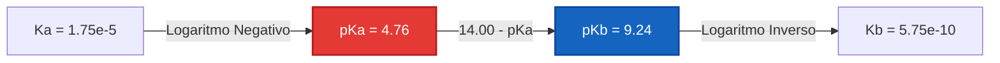

# Guía de Química Analítica y de Laboratorio para Análisis de pKa y Fuerza Ácida

En química orgánica física y analítica cuantitativa, **$\text{p}K_a$** cuantifica la tendencia termodinámica de un ácido a disociarse en medios acuosos:

$$\text{p}K_a = -\log_{10}(K_a) \quad \iff \quad K_a = 10^{-\text{p}K_a}$$

$$\text{p}K_a + \text{p}K_b = \text{p}K_w \quad \text{donde } K_w = K_a \cdot K_b = 1.00 \times 10^{-14} \text{ a } 25^\circ\text{C}$$

---

## 1. Clasificación de Fuerza Ácida y Matriz de Referencia

| Nombre del Ácido | Fórmula | $K_a$ ($25^\circ\text{C}$) | $\text{p}K_a$ ($25^\circ\text{C}$) | Base Conjugada ($\text{A}^-$) | Clasificación de Fuerza |
| :--- | :--- | :--- | :--- | :--- | :--- |
| **Ácido Clorhídrico** | $\text{HCl}$ | $\sim 1 \times 10^7$ | **$-7.0$** | $\text{Cl}^-$ | Ácido Fuerte |
| **Ácido Nítrico** | $\text{HNO}_3$ | $\sim 2.4 \times 10^1$ | **$-1.4$** | $\text{NO}_3^-$ | Ácido Fuerte |
| **Ácido Fosfórico ($\text{p}K_{a1}$)** | $\text{H}_3\text{PO}_4$ | $7.1 \times 10^{-3}$ | **$2.15$** | $\text{H}_2\text{PO}_4^-$ | Ácido Moderadamente Fuerte |
| **Ácido Acético** | $\text{CH}_3\text{COOH}$ | $1.75 \times 10^{-5}$ | **$4.76$** | $\text{CH}_3\text{COO}^-$ | Ácido Débil |
| **Ácido Carbónico ($\text{p}K_{a1}$)** | $\text{H}_2\text{CO}_3$ | $4.5 \times 10^{-7}$ | **$6.35$** | $\text{HCO}_3^-$ | Ácido Débil |
| **Ácido Cianhídrico** | $\text{HCN}$ | $6.2 \times 10^{-10}$ | **$9.21$** | $\text{CN}^-$ | Ácido Muy Débil |

---

## 2. Protocolos Estándar de Cálculo de Disociación de Ácidos

```
1. pKa a partir de Ka: pKa = -log10(Ka)
2. Ka a partir de pKa: Ka = 10^(-pKa)
3. pKb de la Base Conjugada: pKb = pKw - pKa  ===>  Kb = 10^(-pKb)
4. Equilibrio de Ácido Débil: Resolver x^2 + Ka*x - Ka*C = 0  ===>  [H+] = x, pH = -log10(x)
5. Henderson-Hasselbalch: pH = pKa + log10([Base Conjugada A-] / [Ácido Débil HA])
```

---

## 3. Descargo de Responsabilidad de Seguridad Educativa y de Laboratorio
*Esta calculadora de pKa proporciona cálculos teóricos de disociación de ácidos para aplicaciones educativas, de investigación de laboratorio y de química AP. Las soluciones no ideales a altas fuerzas iónicas deben dar cuenta de los coeficientes de actividad utilizando las ecuaciones de Debye-Hückel o Pitzer.*

## 4. La Guía Integral sobre pKa y Fuerza Ácida

Bienvenido a la guía definitiva para comprender, calcular y aplicar el $\text{p}K_a$ en sistemas químicos. Mientras que el pH mide la acidez de una *solución* en un momento dado, el $\text{p}K_a$ mide la fuerza intrínseca del *ácido en sí*. Ya sea que usted sea un estudiante de secundaria aprendiendo sobre bases conjugadas, un químico analítico determinando el punto de semiequivalencia en una valoración, o un bioquímico modelando el estado de protonación de los aminoácidos en una proteína, dominar el $\text{p}K_a$ es innegociable.

En su núcleo, el $\text{p}K_a$ dicta si una molécula retendrá su protón (ion de hidrógeno) o lo donará al entorno circundante. Gobierna la absorción de productos farmacéuticos en el estómago humano, la capacidad de amortiguación del agua del océano y la velocidad de la síntesis industrial catalizada por ácidos.

En esta guía exhaustiva, exploraremos la termodinámica de la disociación de ácidos, desentrañaremos las matemáticas logarítmicas que mapean $K_a$ a $\text{p}K_a$, detallaremos el comportamiento complejo de los ácidos polipróticos (como el ácido fosfórico), y recorreremos cinco ejemplos del mundo real altamente detallados y completos con derivaciones matemáticas y diagramas visuales estrictamente formateados.

### 4.1 ¿Qué es exactamente el pKa?

Cuando un ácido (HA) se disuelve en agua, alcanza un estado de equilibrio donde una fracción de las moléculas de ácido donan un protón al agua, formando iones hidronio ($\text{H}_3\text{O}^+$) e iones base conjugada ($\text{A}^-$):
$\text{HA} + \text{H}_2\text{O} \rightleftharpoons \text{H}_3\text{O}^+ + \text{A}^-$

La Constante de Equilibrio para esta disociación específica se llama Constante de Disociación del Ácido, $K_a$:
$$ K_a = \frac{[\text{H}^+][\text{A}^-]}{[\text{HA}]} $$

Debido a que los valores de $K_a$ para los ácidos débiles son números extremadamente pequeños (por ejemplo, $1.8 \times 10^{-5}$ para el ácido acético) con grandes exponentes negativos, los químicos utilizan una escala logarítmica para hacerlos más fáciles de manejar. Esto es **$\text{p}K_a$**:
$$ \text{p}K_a = -\log_{10}(K_a) $$

**La Regla de Oro del pKa:** Cuanto menor (o más negativo) sea el valor del $\text{p}K_a$, más **fuerte** será el ácido. 
- Un $\text{p}K_a$ de -7 (Ácido Clorhídrico) significa que es un donante de protones masivo y agresivo. 
- Un $\text{p}K_a$ de 4.76 (Ácido Acético) significa que es un donante de protones débil. 
- Un $\text{p}K_a$ de 15.7 (El agua actuando como ácido) significa que es un donante de protones increíblemente pobre.

Debido a que la escala es logarítmica, un ácido con un $\text{p}K_a$ de 3 es **diez veces más fuerte** que un ácido con un $\text{p}K_a$ de 4, y cien veces más fuerte que un ácido con un $\text{p}K_a$ de 5.

### 4.2 El Balancín Conjugado: pKa y pKb

Todo ácido (HA) tiene una base conjugada ($\text{A}^-$). Si el ácido es fuerte (realmente quiere regalar un protón), su base conjugada debe ser débil (realmente NO quiere recuperar un protón). Esta relación está bloqueada matemáticamente por la constante de autoionización del agua ($K_w$).

$$ K_a \times K_b = K_w $$
$$ \text{p}K_a + \text{p}K_b = 14.00 \quad (\text{a } 25^\circ\text{C}) $$

Si conoce el $\text{p}K_a$ de un ácido, conoce instantáneamente el $\text{p}K_b$ de su base conjugada. Por ejemplo, si el ácido acético tiene un $\text{p}K_a$ de 4.76, el ion acetato ($\text{CH}_3\text{COO}^-$) tiene un $\text{p}K_b$ de 9.24.

### 4.3 Ácidos Polipróticos: Personalidades Múltiples

Algunos ácidos poseen más de un protón donable. Estos se conocen como **ácidos polipróticos**. Los ejemplos más famosos son el ácido sulfúrico ($\text{H}_2\text{SO}_4$) y el ácido fosfórico ($\text{H}_3\text{PO}_4$). 

Los ácidos polipróticos se disocian en pasos discretos, y cada paso tiene su propio valor $K_a$ y $\text{p}K_a$. 
Para $\text{H}_3\text{PO}_4$:
1.  **$\text{p}K_{a1} = 2.15$**: $\text{H}_3\text{PO}_4 \rightleftharpoons \text{H}_2\text{PO}_4^- + \text{H}^+$
2.  **$\text{p}K_{a2} = 7.20$**: $\text{H}_2\text{PO}_4^- \rightleftharpoons \text{HPO}_4^{2-} + \text{H}^+$
3.  **$\text{p}K_{a3} = 12.35$**: $\text{HPO}_4^{2-} \rightleftharpoons \text{PO}_4^{3-} + \text{H}^+$

Note que cada protón sucesivo es más difícil de eliminar que el anterior. Esto se debe a que la eliminación de un protón con carga positiva de una molécula con carga cada vez más negativa requiere significativamente más energía termodinámica. Por lo tanto, **$\text{p}K_{a1} < \text{p}K_{a2} < \text{p}K_{a3}$** siempre es cierto.

---

## 5. Guía de Uso: Dominando la Calculadora de pKa

Nuestra Calculadora de pKa es una herramienta analítica de grado profesional diseñada para conversiones rápidas y mapeo complejo de equilibrios polipróticos.

### 5.1 Conversiones Logarítmicas Directas

Si simplemente necesita interconvertir $K_a$, $\text{p}K_a$, $K_b$ y $\text{p}K_b$:
1.  **Seleccione el Modo:** Elija "pKa a partir de Ka" o "Ka a partir de pKa".
2.  **Ingrese el Valor:** Puede usar notación decimal (`0.000018`) o notación científica (`1.8e-5`).
3.  **Lea la Salida:** La calculadora completa instantáneamente el perfil ácido-base, proporcionando los parámetros de la base conjugada ($\text{p}K_b$) y clasificando la fuerza del ácido.

### 5.2 Valoración y Semiequivalencia

El $\text{p}K_a$ se revela mágicamente durante una valoración de ácido débil/base fuerte.
1.  **Seleccione el Modo:** Elija "pKa a partir del pH y la Concentración Medidos".
2.  **Ingrese los Parámetros:** Ingrese el pH de la solución en el **Punto de Semiequivalencia** (el momento exacto en que ha neutralizado exactamente la mitad del ácido débil).
3.  **Ejecute:** La herramienta aprovecha la ecuación de Henderson-Hasselbalch. Debido a que $[\text{A}^-] = [\text{HA}]$ en este punto exacto, $\log(1) = 0$ y, por lo tanto, **$\text{pH} = \text{p}K_a$**.

### 5.3 Equilibrio Cuadrático de Ácido Débil

Para encontrar el pH exacto de un ácido débil disuelto en agua:
1.  **Seleccione el Modo:** Elija "Solucionador de Equilibrio de Ácido Débil".
2.  **Ingrese los Parámetros:** Ingrese la Concentración Inicial ($C$) y el $\text{p}K_a$.
3.  **Ejecute:** La calculadora convierte el $\text{p}K_a$ a $K_a$ y resuelve exactamente la ecuación cuadrática $x^2 + K_a x - K_a C = 0$ para encontrar la verdadera concentración de hidronio.

---

## 6. Cinco Ejemplos Conceptuales del Mundo Real

Para dominar la fuerza de los ácidos, debemos aplicar el logaritmo abstracto a los sistemas químicos físicos. A continuación hay cinco ejemplos detallados que cubren conversiones simples, amortiguación farmacéutica y mapeo de especies polipróticas.

### Ejemplo 1: La Conversión Clásica (Ácido Acético)

**Escenario:** 
Un problema de química de la escuela secundaria establece que la constante de disociación del ácido ($K_a$) del ácido acético es $1.75 \times 10^{-5}$ a $25^\circ\text{C}$. Calcule su $\text{p}K_a$ y el $\text{p}K_b$ del ion acetato.

**Derivación Matemática:**

1.  **Calcular $\text{p}K_a$:**
    $$ \text{p}K_a = -\log_{10}(1.75 \times 10^{-5}) $$
    $$ \text{p}K_a = 4.757 \approx 4.76 $$
2.  **Calcular $\text{p}K_b$ (Asumiendo $25^\circ\text{C}$ donde $\text{p}K_w = 14.00$):**
    $$ \text{p}K_b = 14.00 - 4.76 = 9.24 $$
3.  **Calcular $K_b$ del ion Acetato:**
    $$ K_b = 10^{-9.24} = 5.75 \times 10^{-10} $$

**Visualización: Flujo de Balancín Conjugado**



*Este simple diagrama de flujo demuestra la rígida relación termodinámica entre un ácido débil y su base conjugada.*

### Ejemplo 2: Mapeo de Fracciones de Ácido Poliprótico (Ácido Fosfórico)

**Escenario:**
Un agrónomo está analizando una muestra de suelo tamponada por fosfatos. El ácido fosfórico ($\text{H}_3\text{PO}_4$) tiene tres valores de $\text{p}K_a$: 2.15, 7.20 y 12.35. Si el pH del suelo es exactamente 7.20, ¿cuál es la especie de fosfato dominante?

**Derivación Matemática:**

1.  **Analice el pH en relación con los umbrales de $\text{p}K_a$:**
    - El pH del suelo es 7.20.
    - Esto está muy por encima de $\text{p}K_{a1}$ (2.15), lo que significa que el primer protón ha desaparecido por completo. La especie ya no es $\text{H}_3\text{PO}_4$.
    - Esto está muy por debajo de $\text{p}K_{a3}$ (12.35), lo que significa que el tercer protón está firmemente unido. La especie no es $\text{PO}_4^{3-}$.
2.  **Evalúe el Segundo Paso de Disociación ($\text{p}K_{a2} = 7.20$):**
    Este es el equilibrio entre $\text{H}_2\text{PO}_4^-$ e $\text{HPO}_4^{2-}$.
3.  **Aplique Henderson-Hasselbalch:**
    $$ \text{pH} = \text{p}K_{a2} + \log_{10}\left(\frac{[\text{HPO}_4^{2-}]}{[\text{H}_2\text{PO}_4^-]}\right) $$
    $$ 7.20 = 7.20 + \log_{10}\left(\frac{[\text{HPO}_4^{2-}]}{[\text{H}_2\text{PO}_4^-]}\right) $$
    $$ 0 = \log_{10}\left(\frac{[\text{HPO}_4^{2-}]}{[\text{H}_2\text{PO}_4^-]}\right) $$
    $$ 1 = \frac{[\text{HPO}_4^{2-}]}{[\text{H}_2\text{PO}_4^-]} $$

**Conclusión:** Exactamente a pH 7.20, el suelo contiene una mezcla perfecta del 50/50 de $\text{H}_2\text{PO}_4^-$ e $\text{HPO}_4^{2-}$. No hay una sola especie "dominante"; son exactamente iguales en concentración.

### Ejemplo 3: Absorción Farmacéutica (Aspirina)

**Escenario:**
La aspirina (ácido acetilsalicílico) es un ácido débil con un $\text{p}K_a$ de 3.5. En general, los medicamentos se absorben a través de las membranas celulares lipídicas solo cuando no tienen carga (protonados, $\text{HA}$). Si el estómago humano tiene un pH de 1.5, ¿qué porcentaje de la aspirina se encuentra en la forma absorbible ($\text{HA}$)?

**Derivación Matemática:**

1.  **Aplique Henderson-Hasselbalch:**
    $$ \text{pH} = \text{p}K_a + \log_{10}\left(\frac{[\text{A}^-]}{[\text{HA}]}\right) $$
    $$ 1.5 = 3.5 + \log_{10}\left(\frac{[\text{A}^-]}{[\text{HA}]}\right) $$
    $$ -2.0 = \log_{10}\left(\frac{[\text{A}^-]}{[\text{HA}]}\right) $$
2.  **Logaritmo Inverso:**
    $$ 10^{-2.0} = \frac{[\text{A}^-]}{[\text{HA}]} = 0.01 $$
3.  **Calcular Porcentaje:**
    Esto significa que por cada 1 molécula de $\text{A}^-$, hay 100 moléculas de $\text{HA}$.
    $$ \% \text{HA} = \frac{100}{101} \times 100 \approx 99.01\% $$

**Conclusión:** Debido a que el estómago es altamente ácido (el pH está dos unidades completas por debajo del $\text{p}K_a$ del medicamento), el 99% de la aspirina permanece sin carga y se absorbe rápidamente en el torrente sanguíneo.

### Ejemplo 4: La Valoración de Laboratorio

**Escenario:**
Un estudiante de química analítica está realizando una valoración en un ácido débil desconocido utilizando una solución estándar de $\text{NaOH}$ $0.100\text{ M}$. Encuentran que el punto de equivalencia ocurre a exactamente $40.0\text{ mL}$ de base agregada. Revisan sus lecturas del medidor de pH y encuentran que exactamente a los $20.0\text{ mL}$ de base agregada, el pH era de 3.85. ¿Cuál es el $K_a$ del ácido desconocido?

**Derivación Matemática:**

1.  **Identifique el Punto de Semiequivalencia:**
    Punto de equivalencia = $40.0\text{ mL}$.
    Punto de semiequivalencia = $20.0\text{ mL}$.
2.  **Aplique la Regla de Semiequivalencia:**
    En el punto de semiequivalencia, exactamente la mitad del ácido débil se ha convertido en su base conjugada.
    $[\text{HA}] = [\text{A}^-]$
    Por lo tanto, $\text{pH} = \text{p}K_a$.
3.  **Determine $\text{p}K_a$ y $K_a$:**
    $$ \text{p}K_a = 3.85 $$
    $$ K_a = 10^{-3.85} = 1.41 \times 10^{-4} $$

**Visualización: Cronograma del Laboratorio de Valoración**

```mermaid
gantt
    title Cronograma de Laboratorio: Valoración de Ácido Débil
    dateFormat  HH:mm:ss
    axisFormat  %H:%M
    section Configuración
    Calibrar Medidor de pH :active, 00:00:00, 00:05:00
    Medir Ácido Desconocido :active, 00:05:00, 00:10:00
    section Valoración
    Agregar Base a 20mL Semi-Eq :crit, 00:10:00, 00:20:00
    Agregar Base a 40mL Eq-Completo :crit, 00:20:00, 00:30:00
    section Análisis
    Extraer pKa de pH de Semi-Eq :milestone, 00:30:00, 00:30:00
```



*Este diagrama de Gantt visualiza el procedimiento cronológico estricto requerido para mapear correctamente una curva de valoración y extraer el parámetro de pKa.*

### Ejemplo 5: Encontrar el pH a partir del pKa (Solucionador Cuadrático Exacto)

**Escenario:**
Un estudiante disuelve $0.050\text{ M}$ de un ácido orgánico débil ($\text{p}K_a = 4.00$) en agua pura. ¿Cuál es el pH exacto?

**Derivación Matemática:**

1.  **Convierta $\text{p}K_a$ a $K_a$:**
    $$ K_a = 10^{-4.00} = 1.0 \times 10^{-4} $$
2.  **Configure la Tabla ICE y la Ecuación Cuadrática:**
    $$ K_a = \frac{x^2}{0.050 - x} = 1.0 \times 10^{-4} $$
    $$ x^2 + (1.0 \times 10^{-4})x - 5.0 \times 10^{-6} = 0 $$
3.  **Resuelva para $x$ ($[\text{H}^+]$):**
    Usando la fórmula cuadrática:
    $$ x = \frac{-1.0 \times 10^{-4} + \sqrt{(1.0 \times 10^{-4})^2 - 4(1)(-5.0 \times 10^{-6})}}{2} $$
    $$ x \approx 0.002186\text{ M} $$
4.  **Calcular el pH:**
    $$ \text{pH} = -\log_{10}(0.002186) = 2.66 $$

**Visualización: Exacto vs Aproximación**

| Método | $[\text{H}^+]$ (M) | pH Calculado | % de Error |
| :--- | :--- | :--- | :--- |
| **Fórmula Cuadrática (Exacta)** | $0.002186$ | $2.660$ | $0.00\%$ |
| **Aproximación ($0.050 - x \approx 0.050$)** | $0.002236$ | $2.650$ | $0.38\%$ |

*Si bien la aproximación se acerca, introduce errores. Nuestra calculadora siempre utiliza el algoritmo cuadrático exacto para garantizar una precisión analítica impecable.*

---

## 7. Preguntas Frecuentes Profundas y Solución de Problemas Avanzada

**P: ¿Puede un valor de pKa ser negativo?**
**R:** Sí, absolutamente. Un valor de $\text{p}K_a$ negativo indica un ácido fuerte. Debido a que $\text{p}K_a = -\log_{10}(K_a)$, un $K_a$ mayor que 1 (lo que significa que el ácido favorece fuertemente la disociación) producirá un $\text{p}K_a$ negativo. Por ejemplo, el ácido clorhídrico ($\text{HCl}$) tiene un $\text{p}K_a$ de aproximadamente -7.

**P: ¿Por qué se prefiere el pKa al Ka en química orgánica?**
**R:** Por conveniencia y linealidad. Discutir la fuerza de un ácido usando números como 4.76 y 9.24 es mucho más fácil que comparar $1.75 \times 10^{-5}$ y $5.75 \times 10^{-10}$. Además, la ecuación de Henderson-Hasselbalch mapea el $\text{p}K_a$ de forma lineal a la escala de pH, lo que permite a los químicos predecir instantáneamente el estado de protonación de una molécula en función del pH ambiental.

**P: ¿Es el pKa dependiente de la temperatura como el pH y el pOH?**
**R:** Sí. La disociación del ácido es un proceso de equilibrio termodinámico regido por $\Delta G^\circ = -RT \ln(K_a)$. Debido a que la temperatura ($T$) está en la ecuación, cambiar la temperatura alterará la constante de equilibrio $K_a$, cambiando así el $\text{p}K_a$. Sin embargo, para muchos ácidos orgánicos débiles, este cambio es relativamente pequeño a través de los rangos de temperatura estándar del laboratorio en comparación con el cambio masivo observado en la autoionización del agua ($K_w$).

**P: ¿Qué es la "Regla del 2" en Química de Tampones?**
**R:** Un ácido débil amortigua eficazmente una solución dentro de un rango de **$\text{p}K_a \pm 1$**. Por ejemplo, el ácido acético ($\text{p}K_a = 4.76$) es un buen tampón entre los pH 3.76 y 5.76. Fuera de este rango, la relación entre $[\text{A}^-]$ y $[\text{HA}]$ se vuelve demasiado extrema (mayor de 10:1 o 1:10), y el tampón pierde rápidamente su capacidad de resistir los cambios en el pH.

**P: ¿Cómo maneja esta calculadora los Ácidos Polipróticos?**
**R:** Nuestro motor de fracciones polipróticas calcula los valores alfa ($\alpha_0, \alpha_1, \alpha_2$, etc.) que representan la fracción del ácido total en cada estado de protonación a un pH dado. Esto es crítico para predecir la carga de moléculas complejas como EDTA o aminoácidos en bioquímica.

Al dominar la elegancia matemática del $\text{p}K_a$ y su relación logarítmica con la disociación, obtiene la capacidad de predecir el resultado de las valoraciones, el comportamiento de los tampones y la absorción de los productos farmacéuticos. ¡Confíe siempre en esta calculadora de pKa para verificar sus derivaciones y garantizar la precisión analítica!
