# Guía de Laboratorio y Química Analítica para pOH y Equilibrio de Bases

En química analítica y equilibrios de bases, el **pOH** mide la actividad del ion hidróxido en soluciones acuosas:

$$\text{pOH} = -\log_{10}[\text{OH}^-] \quad \iff \quad [\text{OH}^-] = 10^{-\text{pOH}}$$

$$\text{pH} + \text{pOH} = \text{p}K_w \quad \text{donde } K_w = [\text{H}^+][\text{OH}^-]$$

---

## 1. Matriz de Referencia de $K_w$ y pOH Neutro Dependiente de la Temperatura

| Temperatura (°C) | Autoionización del Agua ($K_w$) | $\text{p}K_w$ | pOH Neutro ($\frac{1}{2}\text{p}K_w$) | Nota Fisiológica / Contextual |
| :--- | :--- | :--- | :--- | :--- |
| **$0^\circ\text{C}$** | $1.14 \times 10^{-15}$ | $14.94$ | **$7.47$** | Punto de congelación del agua |
| **$25^\circ\text{C}$** | $1.00 \times 10^{-14}$ | $14.00$ | **$7.00$** | Referencia estándar de laboratorio |
| **$37^\circ\text{C}$** | $2.40 \times 10^{-14}$ | $13.62$ | **$6.81$** | Temperatura normal del cuerpo humano |
| **$60^\circ\text{C}$** | $9.60 \times 10^{-14}$ | $13.02$ | **$6.51$** | Agua de proceso calentada |

---

## 2. Protocolos Estándar de Cálculo de Equilibrio de Bases

```
1. Base Fuerte (monohidroxílica): [OH-] = C_base  ===>  pOH = -log10[C_base]
2. Base Fuerte (dihidroxílica, ej. Ca(OH)2): [OH-] = 2 * C_base  ===>  pOH = -log10[2 * C_base]
3. Base Débil (B + H2O <==> BH+ + OH-): Resolver x^2 + Kb*x - Kb*C = 0  ===>  pOH = -log10(x)
4. Solución Tampón Base: pOH = pKb + log10([Ácido Conjugado BH+] / [Base Débil B])
```

---

## 3. Descargo de Responsabilidad de Seguridad de Laboratorio y Educación
*Esta calculadora de pOH proporciona cálculos de equilibrio de base teóricos para aplicaciones educativas, de investigación de laboratorio y de química AP. Las soluciones no ideales concentradas y los tampones analíticos precisos deben considerar la fuerza iónica y los coeficientes de actividad utilizando equipos de laboratorio calibrados.*

## 4. La Guía Completa sobre el pOH y la Química de Bases

Bienvenido a la guía definitiva para comprender, calcular y manipular el pOH en soluciones químicas. Si bien el pH a menudo acapara la atención en la química de la escuela secundaria, el pOH es su contraparte igualmente vital, que rige el comportamiento de las bases, las soluciones alcalinas y el equilibrio fundamental del agua misma. Ya sea que sea un estudiante de Química AP que domina la ionización de bases débiles, un químico industrial formulando agentes de limpieza o un biólogo estudiando el tamponamiento celular, dominar el pOH es crucial.

En su núcleo, el pOH es una medida de la alcalinidad o basicidad de una solución acuosa (basada en agua). Cuantifica directamente la concentración de iones hidróxido ($\text{OH}^-$), dictando cómo interactúan las moléculas básicas, neutralizan los ácidos y desencadenan reacciones de saponificación.

En esta guía exhaustiva, exploraremos la mecánica profunda de la química de las bases, desentrañaremos las matemáticas logarítmicas que rigen la escala de pOH, aclararemos la relación crítica entre el pH, el pOH y la temperatura, y repasaremos cinco ejemplos altamente detallados y del mundo real, completos con derivaciones matemáticas y diagramas visuales.

### 4.1 ¿Qué es Exactamente el pOH?

El término "pOH" representa el "potencial de hidróxido". Es una escala logarítmica utilizada para especificar la concentración de iones hidróxido ($\text{OH}^-$) en una solución acuosa. Matemáticamente, el pOH es el logaritmo negativo en base 10 de la concentración molar de iones hidróxido.

$$ \text{pOH} = -\log_{10}[\text{OH}^-] $$

Debido a que la escala es logarítmica, un cambio de **una unidad de pOH** representa un **cambio diez veces mayor** en la concentración de iones hidróxido. Una solución con un pOH de 3 tiene diez veces más iones hidróxido que una solución con un pOH de 4.

Es importante destacar que la escala de pOH es el espejo inverso de la escala de pH. Un pOH *bajo* significa una *alta* concentración de iones hidróxido, lo que corresponde a una solución altamente **básica (alcalina)**. Un pOH *alto* indica una baja concentración de hidróxido, lo que significa que la solución es ácida.

### 4.2 El Vínculo Inseparable: pOH, pH y $K_w$

En el agua pura, las moléculas de agua se autoionizan de forma natural, separándose espontáneamente en iones hidrógeno e hidróxido:
$\text{H}_2\text{O} \rightleftharpoons \text{H}^+ + \text{OH}^-$

La constante de equilibrio para esta reacción vital es la constante de autoionización del agua, $K_w$. A temperatura ambiente estándar (25°C), $K_w$ es exactamente $1.0 \times 10^{-14}$.

Debido a que $K_w = [\text{H}^+][\text{OH}^-]$, tomar el logaritmo negativo de ambos lados nos da la ecuación más importante en química ácido-base. A 25°C:
$$ \text{pH} + \text{pOH} = 14.00 $$

Esta atadura matemática rígida significa que no puede cambiar la concentración de hidróxido sin afectar inversamente la concentración de hidrógeno. Si calcula el pOH, sabe instantáneamente el pH.

### 4.3 Dependencia de la Temperatura: Rompiendo la Regla del 14.00

Una trampa común en la educación química es asumir que $\text{pH} + \text{pOH}$ siempre es igual a 14.00. **Esto solo es cierto a exactamente 25°C.**

Debido a que la autoionización del agua es una reacción endotérmica (absorbe calor), el aumento de la temperatura desplaza el equilibrio hacia la derecha, generando *más* iones $\text{H}^+$ y $\text{OH}^-$. Esto aumenta $K_w$ y, en consecuencia, *disminuye* $\text{p}K_w$.

*   A **0°C** (cerca del punto de congelación), $K_w$ cae a $1.14 \times 10^{-15}$. $\text{pH} + \text{pOH} = \textbf{14.94}$.
*   A **25°C** (laboratorio estándar), $K_w$ es $1.0 \times 10^{-14}$. $\text{pH} + \text{pOH} = \textbf{14.00}$.
*   A **37°C** (cuerpo humano), $K_w$ se eleva a $2.4 \times 10^{-14}$. $\text{pH} + \text{pOH} = \textbf{13.62}$.

Nuestra avanzada Calculadora de pOH cuenta con un Motor Dinámico de $K_w$ Dependiente de la Temperatura que corrige automáticamente estas constantes en función de la temperatura especificada, asegurando una precisión perfecta para condiciones no estándar.

---

## 5. Guía de Uso: Dominando la Calculadora de pOH

Nuestra Calculadora de pOH está construida en torno a una "Cabina Interactiva", dándole acceso a conversiones logarítmicas simples así como a solucionadores cuadráticos avanzados de tabla ICE para el equilibrio de bases débiles.

### 5.1 Conversiones Logarítmicas Directas

Si necesita convertir rápidamente entre $[\text{OH}^-]$, $[\text{H}^+]$, pOH y pH:
1.  **Seleccione el Modo:** Elija "pOH a partir de [OH-]" o la conversión adecuada.
2.  **Ingrese el Valor:** Ingrese su valor utilizando el formato decimal estándar (`0.005`) o notación científica (`5e-3`).
3.  **Lea la Salida:** La calculadora rellena al instante todos los parámetros y clasifica la solución (Básica, Neutra o Ácida) en el espectro logarítmico.

### 5.2 Equilibrio de Base Débil (Solucionador $K_b$)

A diferencia de las bases fuertes (como $\text{NaOH}$) que se disocian al 100%, las bases débiles (como el Amoníaco, $\text{NH}_3$) solo reaccionan parcialmente con el agua para formar hidróxido. Debe resolver un equilibrio cuadrático basado en la Constante de Disociación de Base ($K_b$).
1.  **Seleccione el Modo:** Elija "Solucionador de Equilibrio de Base Débil".
2.  **Ingrese los Parámetros:** Ingrese la Concentración Inicial de la base ($C$) y su $K_b$ (o $\text{p}K_b$).
3.  **Ejecute:** La calculadora resuelve internamente la ecuación cuadrática exacta $x^2 + K_b x - K_b C = 0$ para encontrar el $[\text{OH}^-]$ real.

### 5.3 Tampones Base y Henderson-Hasselbalch

Las soluciones tampón básicas (como el Amoníaco/Amonio) resisten los cambios de pH/pOH cuando se agregan pequeñas cantidades de ácido fuerte o base fuerte.
1.  **Seleccione el Modo:** Elija "Solucionador de pOH de Tampón Base".
2.  **Ingrese los Parámetros:** Ingrese el $\text{p}K_b$ de la base débil, la concentración del Ácido Conjugado (ej. $\text{NH}_4^+$) y la Base Débil (ej. $\text{NH}_3$).
3.  **Ejecute:** La herramienta utiliza la forma base de la ecuación de Henderson-Hasselbalch: $\text{pOH} = \text{p}K_b + \log([\text{Ácido Conjugado}]/[\text{Base Débil}])$.

---

## 6. Cinco Ejemplos Conceptuales del Mundo Real

Comprender la matemática abstracta del pOH requiere una aplicación práctica del mundo real. A continuación, se presentan cinco ejemplos exhaustivos que cubren bases dihidroxílicas fuertes, equilibrios de bases débiles, tampones y diluciones en serie.

### Ejemplo 1: La Base Dihidroxílica Fuerte (Hidróxido de Calcio)

**Escenario:**
El hidróxido de calcio, $\text{Ca(OH)}_2$, también conocido como cal apagada, es una base fuerte que se utiliza en el tratamiento del agua. Si una instalación de tratamiento de agua prepara una solución de $0.015\text{ M}$ de $\text{Ca(OH)}_2$ a 25°C, ¿cuál es el pOH y el pH?

**Derivación Matemática:**

1.  **Identificar la Disociación Dihidroxílica:** El $\text{Ca(OH)}_2$ produce **dos** iones hidróxido por unidad de fórmula.
    $$ [\text{OH}^-] = 2 \times [\text{Ca(OH)}_2] $$
    $$ [\text{OH}^-] = 2 \times 0.015\text{ M} = 0.030\text{ M} $$
2.  **Calcular el pOH:**
    $$ \text{pOH} = -\log_{10}(0.030) $$
    $$ \text{pOH} = 1.52 $$
3.  **Calcular el pH:**
    $$ \text{pH} = 14.00 - 1.52 = 12.48 $$

**Visualización: Flujo de Concentración Dihidroxílica**


*Tenga en cuenta que debido a que el hidróxido de calcio proporciona dos moles de hidróxido por mol de base, produce una solución altamente alcalina (pH 12.48) a pesar de la molaridad relativamente baja.*

### Ejemplo 2: La Base Débil (Amoníaco / Limpiacristales)

**Escenario:**
El amoníaco ($\text{NH}_3$) es el ingrediente activo de muchos limpiacristales. Es una base débil con un $K_b$ de $1.8 \times 10^{-5}$. Si un limpiacristales comercial tiene una concentración de amoníaco de $0.25\text{ M}$, ¿cuál es su pOH?

**Derivación Matemática:**

1.  **Configurar la Tabla ICE para la Hidrólisis de Bases:**
    $\text{NH}_3 + \text{H}_2\text{O} \rightleftharpoons \text{NH}_4^+ + \text{OH}^-$
    *   Inicial: $[\text{NH}_3] = 0.25$, $[\text{NH}_4^+] = 0$, $[\text{OH}^-] = 0$
    *   Cambio: $-x$, $+x$, $+x$
    *   Equilibrio: $0.25 - x$, $x$, $x$
2.  **Configurar la Ecuación Cuadrática:**
    $$ K_b = \frac{x^2}{0.25 - x} = 1.8 \times 10^{-5} $$
    $$ x^2 + (1.8 \times 10^{-5})x - 4.5 \times 10^{-6} = 0 $$
3.  **Resolver para $x$ ($[\text{OH}^-]$):**
    Usando la fórmula cuadrática, $x \approx 0.00211\text{ M}$.
4.  **Calcular el pOH:**
    $$ \text{pOH} = -\log_{10}(0.00211) = 2.68 $$

**Visualización: Precisión Cuadrática**

| Método | $[\text{OH}^-]$ (M) | pOH Calculado | % de Error |
| :--- | :--- | :--- | :--- |
| **Fórmula Cuadrática (Exacta)** | $0.002112$ | $2.675$ | $0.00\%$ |
| **Aproximación ($0.25 - x \approx 0.25$)** | $0.002121$ | $2.673$ | $0.07\%$ |

*Nuestra calculadora emplea estrictamente el solucionador cuadrático exacto para evitar los errores compuestos que surgen en soluciones más diluidas al usar el método de aproximación.*

### Ejemplo 3: El Tampón Base (Amoníaco/Amonio)

**Escenario:**
Un químico analítico necesita un tampón alcalino para calibrar un instrumento. Prepara una solución que contiene $0.10\text{ M}$ de Amoníaco ($\text{NH}_3$, base débil) y $0.05\text{ M}$ de Cloruro de Amonio ($\text{NH}_4\text{Cl}$, ácido conjugado). El $\text{p}K_b$ del Amoníaco es 4.74. Encuentre el pOH.

**Derivación Matemática:**

1.  **Identificar la Fórmula:** Forma base de la Ecuación de Henderson-Hasselbalch.
    $$ \text{pOH} = \text{p}K_b + \log_{10}\left(\frac{[\text{Ácido Conjugado}]}{[\text{Base Débil}]}\right) $$
2.  **Ingresar Valores:**
    $$ \text{pOH} = 4.74 + \log_{10}\left(\frac{0.05}{0.10}\right) $$
3.  **Calcular:**
    $$ \text{pOH} = 4.74 + \log_{10}(0.5) $$
    $$ \text{pOH} = 4.74 - 0.30 = 4.44 $$

*La solución tiene un pOH de 4.44, lo que significa que es un tampón básico (pH = 9.56).*

### Ejemplo 4: Reacción de Neutralización

**Escenario:**
Un estudiante derrama accidentalmente $50\text{ mL}$ de $0.20\text{ M NaOH}$ (base fuerte) sobre una mesa de laboratorio. Intenta neutralizarlo vertiendo $100\text{ mL}$ de $0.05\text{ M HCl}$ (ácido fuerte) sobre él. ¿Es seguro el charco resultante (neutro)? Encuentre el pOH final.

**Derivación Matemática:**

1.  **Calcular Moles Iniciales:**
    Moles de $\text{OH}^- = (0.050\text{ L}) \times (0.20\text{ mol/L}) = 0.010\text{ moles}$
    Moles de $\text{H}^+ = (0.100\text{ L}) \times (0.05\text{ mol/L}) = 0.005\text{ moles}$
2.  **Realizar Neutralización (Resta):**
    El $\text{OH}^-$ está en exceso.
    $\text{OH}^-$ restante $= 0.010 - 0.005 = 0.005\text{ moles}$.
3.  **Calcular Nueva Concentración:**
    Volumen Total $= 50\text{ mL} + 100\text{ mL} = 150\text{ mL} = 0.150\text{ L}$
    $$ [\text{OH}^-] = \frac{0.005\text{ moles}}{0.150\text{ L}} = 0.0333\text{ M} $$
4.  **Calcular el pOH Final:**
    $$ \text{pOH} = -\log_{10}(0.0333) = 1.48 $$

**Conclusión:** ¡El charco es altamente básico (pH = 12.52) y todavía es peligroso! El estudiante no utilizó suficiente ácido para neutralizar completamente el derrame.

### Ejemplo 5: Dilución en Serie de una Base

**Escenario:**
Un técnico de laboratorio toma $5\text{ mL}$ de una base fuerte con un pOH de 2.00 ($[\text{OH}^-] = 0.01\text{ M}$) y la diluye con agua pura hasta un volumen final de $500\text{ mL}$. ¿Cuál es el nuevo pOH?

**Derivación Matemática:**

1.  **Encontrar el $[\text{OH}^-]$ Inicial:**
    $$ [\text{OH}^-]_{\text{inicial}} = 10^{-2.00} = 0.01\text{ M} $$
2.  **Calcular la Dilución ($M_1V_1 = M_2V_2$):**
    $$ (0.01\text{ M})(5\text{ mL}) = (M_2)(500\text{ mL}) $$
    $$ M_2 = 0.0001\text{ M} = 10^{-4}\text{ M} $$
3.  **Calcular el Nuevo pOH:**
    $$ \text{pOH} = -\log_{10}(10^{-4}) = 4.00 $$

**Visualización: Cronograma de Laboratorio de Dilución en Serie**

```mermaid
gantt
    title Cronograma de Laboratorio: Proceso de Dilución Alcalina
    dateFormat  HH:mm:ss
    axisFormat  %H:%M
    section Preparación
    Medir 5mL (pOH 2.00) :active, 00:00:00, 00:03:00
    Transferir al Matraz Aforado :active, 00:03:00, 00:05:00
    section Dilución
    Añadir 495mL de Agua Desionizada :crit, 00:05:00, 00:10:00
    Homogeneización / Mezcla :active, 00:10:00, 00:15:00
    section Análisis
    Medir el Nuevo pOH (4.00) :milestone, 00:15:00, 00:15:00
```



*Diluir una base aumenta su pOH, acercándola al punto neutro de 7.00.*

---

## 7. Preguntas Frecuentes Detalladas y Solución de Problemas Avanzada

**P: ¿Puede el pOH ser negativo?**
**R:** ¡Sí! Al igual que el pH, la escala de pOH puede extenderse por debajo de 0 para bases fuertes extremadamente concentradas. Una solución de $10\text{ M}$ de $\text{NaOH}$ tiene un pOH de $-\log(10) = -1.0$ (y un pH de 15.0).

**P: ¿Por qué la calculadora incluye la Temperatura para las conversiones de pOH?**
**R:** Si está convirtiendo de pOH a pH, la calculadora utiliza la fórmula $\text{pH} = \text{p}K_w - \text{pOH}$. Debido a que la constante de autoionización del agua ($K_w$) cambia significativamente con la temperatura, debe utilizarse el valor exacto de $\text{p}K_w$ para garantizar la precisión analítica en lugar de predeterminar el valor 14.00.

**P: ¿Cuál es la relación entre $K_a$ y $K_b$?**
**R:** Para cualquier par ácido-base conjugado, sus constantes de disociación están vinculadas por la constante de autoionización del agua: $K_a \times K_b = K_w$. En términos logarítmicos, $\text{p}K_a + \text{p}K_b = \text{p}K_w$ (que es 14.00 a 25°C).

**P: ¿Diluir una base para siempre la hará ácida?**
**R:** No. A medida que diluye infinitamente una base con agua pura neutra, el pOH se acerca a 7.00 de forma asintótica, pero nunca lo cruzará al reino ácido. A diluciones extremadamente altas (ej. $10^{-9}\text{ M NaOH}$), la autoionización del agua misma aporta más hidróxido que la base, lo que requiere cálculos de equilibrio sistemáticos complejos.

**P: ¿Por qué usar pOH en lugar de pH?**
**R:** Para soluciones básicas, calcular el pOH primero es matemáticamente más directo porque la especie principal presente en exceso es el ion hidróxido ($\text{OH}^-$). Usted calcula el pOH directamente a partir de la concentración de hidróxido, y luego simplemente resta de 14.00 (a 25°C) para encontrar el pH.

Al dominar la interacción matemática del pOH, las concentraciones de hidróxido y los equilibrios de $K_b$, obtendrá una comprensión rigurosa y cuantitativa de la química alcalina. ¡Confíe siempre en esta calculadora de pOH para verificar sus derivaciones manuales y salvaguardar sus procedimientos de laboratorio!
