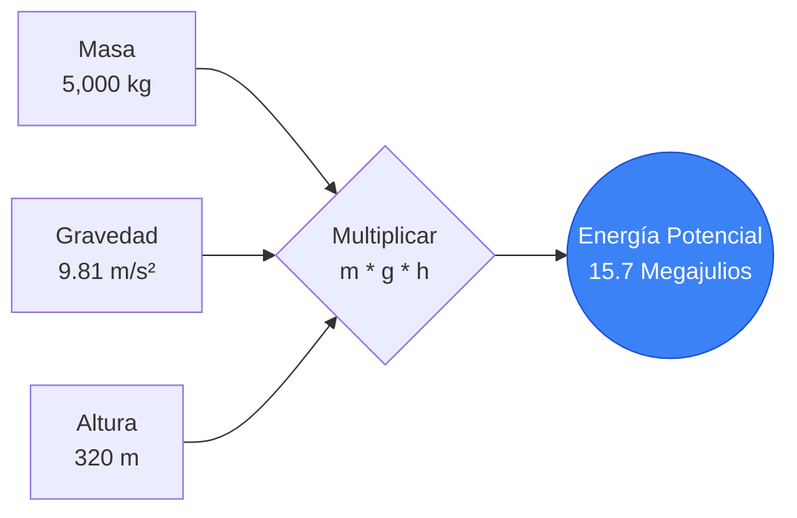
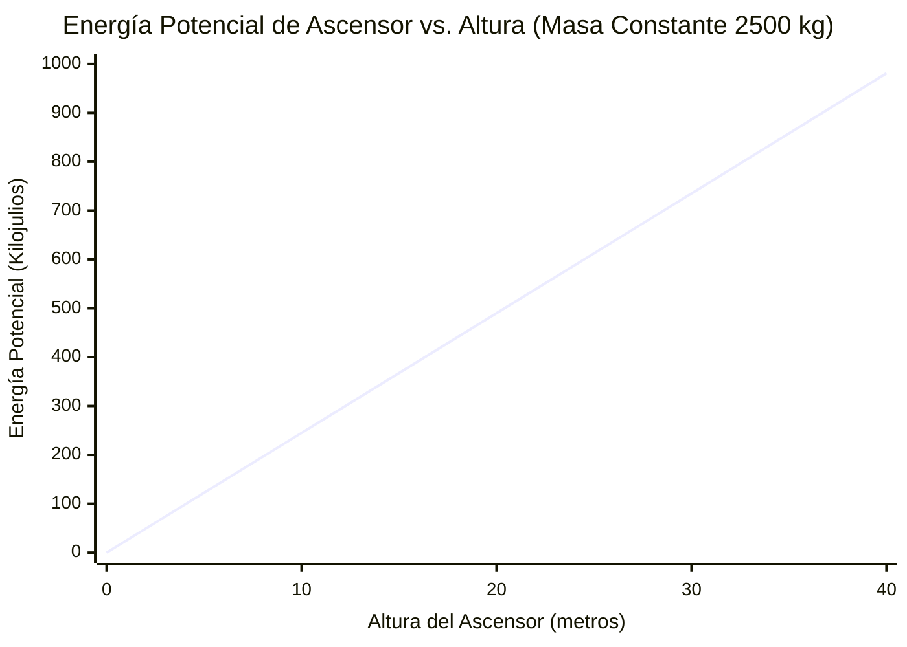
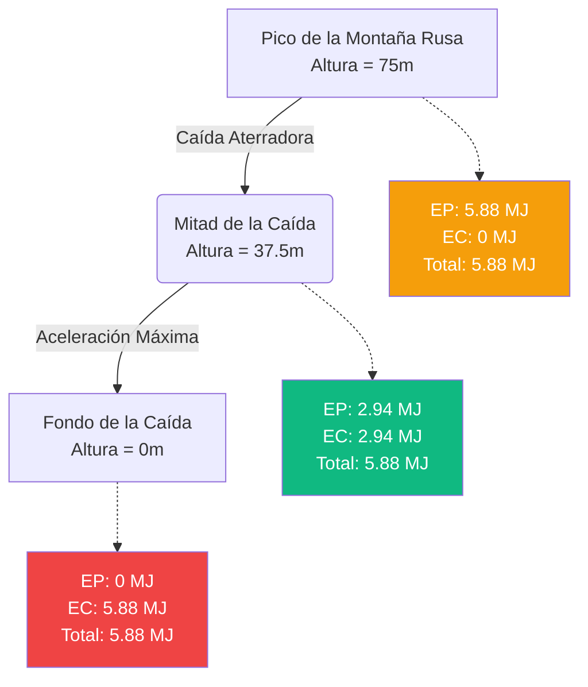

# La Calculadora Definitiva de Energía Potencial: Dominando la Física de la Energía Gravitacional Almacenada

Bienvenido a la **Calculadora de Energía Potencial** definitiva y guía integral de física. Ya sea usted un arquitecto diseñando altísimos rascacielos, un ingeniero de montañas rusas calculando la aterradora altura máxima de una nueva atracción, o un estudiante de física preparándose para un extenuante examen final sobre la Ley de Conservación de la Energía Mecánica, esta herramienta proporciona absoluta precisión y claridad.

La energía potencial es la energía invisible y almacenada que gobierna nuestro universo. Es la razón por la que una roca precaria amenaza a un valle debajo, la razón por la que las presas hidroeléctricas pueden abastecer a ciudades enteras y la razón por la que una cuerda de arco tensada puede lanzar una flecha a velocidades letales.

En esta enorme guía técnica de más de 4,000 palabras, deconstruiremos exhaustivamente la mecánica de la Energía Potencial Gravitacional ($EP = m \cdot g \cdot h$). Exploraremos los fundamentos matemáticos del campo gravitacional, analizaremos la conversión entre los estados potencial y cinético durante la caída libre y le guiaremos a través de cinco ejemplos de ingeniería del mundo real visualizados con diagramas detallados de Mermaid.js.

---

## 1. La Física de la Energía Potencial: Poder Almacenado

En la mecánica clásica, la **Energía** es la capacidad para realizar un trabajo. Mientras que la Energía Cinética es la energía del movimiento activo, la **Energía Potencial** es la energía de posición, estado o configuración.

Es "potencial" porque la energía está almacenada, esperando en silencio para ser liberada y convertida en trabajo cinético activo.

### La Fórmula Gravitacional Central ($EP = m \cdot g \cdot h$)
Cuando tratamos con objetos cerca de la superficie de la Tierra (o cualquier otro planeta), nos ocupamos específicamente de la **Energía Potencial Gravitacional**. La fórmula fundamental es elegantemente simple, basándose en solo tres variables:

$$ EP = m \cdot g \cdot h $$

Donde:
- **$EP$** = Energía Potencial (medida en Julios, $J$)
- **$m$** = Masa del objeto (medida en kilogramos, $kg$)
- **$g$** = Aceleración gravitacional del entorno local (medida en metros por segundo al cuadrado, $m/s^2$)
- **$h$** = Altura o elevación sobre un punto de referencia elegido (medida en metros, $m$)

### La Naturaleza Lineal de la Energía Potencial
A diferencia de la Energía Cinética, que se escala cuadráticamente con la velocidad ($v^2$), la Energía Potencial Gravitacional se escala de manera **perfectamente lineal** con sus tres variables.

- Si duplica la masa de una roca sentada en un acantilado, duplica exactamente su energía potencial.
- Si levanta una caja pesada al doble de su altura original en un estante, duplica exactamente su energía potencial.
- Si transporta una caja pesada desde la Tierra a un planeta con el doble de gravedad (como Júpiter), duplica su energía potencial.

### La Importancia del Dato de Referencia ($h=0$)
Un concepto crítico y a menudo malentendido en física es que la energía potencial es completamente relativa. El valor de $h$ requiere un punto de partida designado: un **dato de referencia** donde la altura se define exactamente como cero.

Por ejemplo, un libro sobre una mesa puede estar a $1\text{ metro}$ sobre el piso, dándole una energía potencial positiva en relación con el piso. Sin embargo, si el piso está en el décimo piso de un edificio de apartamentos, el libro está a $30\text{ metros}$ sobre el nivel de la calle, lo que le da una energía potencial mucho mayor en relación con la calle.

Debido a que la energía potencial es relativa, ¡puede ser absolutamente negativa! Si su dato de referencia ($h=0$) es el nivel del suelo y baja un cubo pesado $5\text{ metros}$ hacia un pozo, la altura es $-5\text{ m}$, resultando en una energía potencial matemáticamente correcta negativa.

---

## 2. Gravitación Universal vs. Gravedad Local ($g$)

La ecuación estándar $EP = mgh$ es en realidad una aproximación simplificada que solo funciona cerca de la superficie de un planeta.

### Gravedad Terrestre Estándar ($g \approx 9.81\text{ m/s}^2$)
En la Tierra, la atracción gravitacional es increíblemente constante al nivel del mar. Las clases de física utilizan habitualmente $9.8\text{ m/s}^2$ o $9.81\text{ m/s}^2$. Esto significa que si se deja caer un objeto en el vacío, su velocidad aumenta en $9.81\text{ m/s}$ por cada segundo que cae.

Sin embargo, la gravedad fluctúa ligeramente en función de la elevación y la densidad geológica. En la cima del Monte Everest, la gravedad es en realidad ligeramente más débil que al nivel del mar.

### Energía Potencial Gravitacional Universal
Si usted es un ingeniero aeroespacial que calcula la mecánica de satélites orbitales o lanzamientos de cohetes a Marte, la ecuación $EP = mgh$ falla porque $g$ ya no es constante. A medida que se aleja de la Tierra, la gravedad se debilita rápidamente de acuerdo con la ley de la inversa del cuadrado.

En astrofísica, usamos la fórmula de la Energía Potencial Gravitacional Universal:

$$ EP = - \frac{G \cdot M \cdot m}{r} $$

Donde $G$ es la constante gravitacional, $M$ es la masa del planeta, $m$ es la masa del satélite y $r$ es la distancia desde el centro exacto del planeta.

---

## 3. Conservación de la Energía Mecánica

La Energía Potencial rara vez existe en el vacío; interactúa constantemente con la Energía Cinética ($EC = 0.5mv^2$).

La **Ley de Conservación de la Energía Mecánica** dicta que en un sistema aislado (ignorando la fricción, la resistencia del aire y la pérdida de calor térmico), la suma total de energía potencial y cinética permanece perfectamente constante. La energía no se crea ni se destruye; simplemente cambia de estado.

$$ E_{total} = EP_{inicial} + EC_{inicial} = EP_{final} + EC_{final} $$

### La Conversión en Caída Libre
Si deja caer una bola de boliche de $10\text{ kg}$ desde un edificio de $50\text{ metros}$ de altura:
1. **En el momento de la liberación:** La velocidad es cero, por lo tanto $EC = 0$. La altura es máxima, por lo que la $EP$ está en su máximo absoluto.
2. **Cayendo hacia abajo:** A medida que la bola cae, pierde altura (perdiendo $EP$). Sin embargo, la gravedad acelera la bola, lo que significa que gana velocidad (ganando $EC$). La suma total de la energía permanece idénticamente constante.
3. **El momento antes del impacto:** La altura es exactamente cero ($EP = 0$). Toda la energía potencial almacenada se ha convertido impecablemente en energía cinética, lo que resulta en la máxima velocidad de impacto terminal.

---

## 4. Guía Integral de Uso: Maximizando la Calculadora

Nuestra Calculadora de Energía Potencial interactiva está diseñada para manejar tanto problemas simples de física introductoria como ecuaciones complejas de ciencia planetaria de ingeniería inversa.

### Paso 1: Cálculos Matemáticos Centrales
En la interfaz principal, seleccione la variable que desea aislar y resolver:
- **Resolver la Energía Potencial (EP):** Ingrese masa, altura y gravedad conocidas.
- **Resolver la Masa (m):** Ingrese energía, altura y gravedad conocidas para determinar el peso de un objeto.
- **Resolver la Altura (h):** Ingrese energía, masa y gravedad conocidas para determinar la elevación.
- **Resolver la Gravedad (g):** Ingrese energía, masa y altura conocidas para determinar la fuerza gravitacional de un planeta desconocido.

### Paso 2: Utilice los Preajustes de Planetas
La calculadora cuenta con un robusto motor de preajustes de gravedad. En lugar de escribir manualmente $9.81\text{ m/s}^2$, simplemente seleccione **Tierra**.

¿Desea ver a qué altura podría levantar una grúa una viga de acero en Marte usando la misma cantidad de energía? Cambie el preajuste de gravedad a **Marte** ($3.71\text{ m/s}^2$). La calculadora se actualiza instantáneamente, revelando que debido a que Marte tiene menos del 40% de la gravedad de la Tierra, la misma cantidad exacta de energía de trabajo puede levantar un objeto pesado mucho, mucho más alto.

### Paso 3: Interprete el Arco Logarítmico de Energía
El **Medidor Radial de Arco de Energía** clasifica su cálculo logarítmicamente:
- **Escala Micro (Verde):** Levantar libros, subir escaleras, dejar caer manzanas.
- **Escala Macro (Azul):** Grúas torre levantando vigas de acero, picos de montañas rusas.
- **Escala Mega (Rojo):** Presas hidroeléctricas, rascacielos, avalanchas.

---

## 5. Cinco Ejemplos Conceptuales de Ingeniería con Visualizaciones 2D

Para captar completamente la magnitud de la energía potencial, exploraremos cinco escenarios detallados de ingeniería y física, utilizando Mermaid.js para deconstruir visualmente las matemáticas.

### Ejemplo 1: La Grúa de Construcción (Cálculo Lineal)

**El Escenario:**
Una enorme grúa torre en Dubái levanta una sección de edificio de hormigón y acero prefabricada de $5,000\text{ kg}$. La grúa iza la carga desde el suelo hasta el piso 80, que tiene exactamente $320\text{ metros}$ de altura. Debemos calcular la inmensa energía potencial gravitacional almacenada en la viga colgante, que representa la energía catastrófica que se liberaría si el cable de la grúa se rompiera.

**Las Matemáticas:**
Usamos la fórmula lineal central:
$$ EP = m \cdot g \cdot h $$
$$ EP = 5,000\text{ kg} \cdot 9.81\text{ m/s}^2 \cdot 320\text{ metros} $$
$$ EP = 15,696,000\text{ Julios (15.7 Megajulios)} $$

**Visualización 2D:**
El árbol lógico a continuación ilustra la sencilla naturaleza lineal del cálculo $EP = mgh$.



---

### Ejemplo 2: Energía Potencial vs. Altura (Escala Lineal)

**El Escenario:**
Un diseñador de ascensores está calculando las cargas de energía de contrapeso. Una cabina de ascensor estándar de $2,500\text{ kg}$ es izada a un edificio. Debido a que la energía potencial se escala linealmente con la altura, queremos visualizar la acumulación constante de energía a medida que la cabina pasa por las marcas de 10 metros, 20 metros, 30 metros y 40 metros.

**Las Matemáticas:**
- A $10\text{ m}$: $EP = 2,500 \cdot 9.81 \cdot 10 = 245,250\text{ J (245 kJ)}$
- A $20\text{ m}$: $EP = 2,500 \cdot 9.81 \cdot 20 = 490,500\text{ J (490 kJ)}$
- A $30\text{ m}$: $EP = 2,500 \cdot 9.81 \cdot 30 = 735,750\text{ J (735 kJ)}$
- A $40\text{ m}$: $EP = 2,500 \cdot 9.81 \cdot 40 = 981,000\text{ J (981 kJ)}$

**Visualización 2D:**
A diferencia de la aterradora curva cuadrática exponencial de la Energía Cinética, la Energía Potencial forma una línea recta perfecta y predecible. Duplicar la altura duplica exactamente la energía almacenada.



---

### Ejemplo 3: Comparación de Gravedad Interplanetaria (Marte vs Júpiter)

**El Escenario:**
Astronautas de la NASA han aterrizado en Marte, mientras que una sonda robótica fuertemente blindada desciende en la atmósfera de Júpiter. Ambos llevan una carga científica de $100\text{ kg}$ levantada a exactamente $10\text{ metros}$ del suelo. ¿Cómo difiere enormemente la energía potencial almacenada a través del sistema solar?

**Las Matemáticas:**
- **Tierra ($9.81\text{ m/s}^2$):** $EP = 100 \cdot 9.81 \cdot 10 = 9,810\text{ J}$
- **La Luna ($1.62\text{ m/s}^2$):** $EP = 100 \cdot 1.62 \cdot 10 = 1,620\text{ J}$
- **Marte ($3.71\text{ m/s}^2$):** $EP = 100 \cdot 3.71 \cdot 10 = 3,710\text{ J}$
- **Júpiter ($24.79\text{ m/s}^2$):** $EP = 100 \cdot 24.79 \cdot 10 = 24,790\text{ J}$

**Visualización 2D:**
El gráfico de barras muestra dramáticamente que dejar caer una roca de $100\text{ kg}$ en Júpiter libera casi 15 veces más energía de impacto aplastante que dejar caer esa misma roca en la Luna desde la misma altura exacta.

```mermaid
xychart-beta
    title "Carga de 100kg a 10m de Altura en Distintos Planetas"
    x-axis "Planeta / Cuerpo Celeste" [Luna, Marte, Tierra, Júpiter]
    y-axis "Energía Potencial Almacenada (Julios)" 0 --> 25000
    bar [1620, 3710, 9810, 24790]
```

---

### Ejemplo 4: La Física de la Montaña Rusa (Conservación de la Energía)

**El Escenario:**
Un tren de montaña rusa cargado de $8,000\text{ kg}$ alcanza lentamente la cima de una aterradora caída de $75\text{ metros}$. En el pico, su velocidad es prácticamente cero. Debemos calcular la máxima velocidad teórica posible del tren cuando toque el fondo mismo de la primera caída, asumiendo una vía sin fricción.

**Las Matemáticas:**
En el pico, toda la energía mecánica es Energía Potencial.
$$ EP_{cima} = m \cdot g \cdot h = 8,000 \cdot 9.81 \cdot 75 = 5,886,000\text{ Julios (5.88 MJ)} $$

De acuerdo con la Ley de Conservación de la Energía Mecánica, en la parte inferior de la caída ($h=0$), los $5.88\text{ MJ}$ de energía potencial se han convertido en Energía Cinética ($EC = 0.5 \cdot m \cdot v^2$).
$$ EC_{fondo} = 5,886,000\text{ J} $$

Podemos aplicar ingeniería inversa matemáticamente para obtener la velocidad del tren:
$$ v = \sqrt{\frac{2 \cdot EC}{m}} $$
$$ v = \sqrt{\frac{2 \cdot 5,886,000}{8,000}} = \sqrt{\frac{11,772,000}{8,000}} = \sqrt{1471.5} = 38.36\text{ m/s} $$

El tren de la montaña rusa toca fondo de la vía viajando a unos emocionantes $38.36\text{ m/s}$ ($85.8\text{ mph}$).

**Visualización 2D:**
Este diagrama de flujo demuestra cómo la energía mecánica permanece perfectamente conservada mientras cambia sin problemas entre los estados Potencial (altura) y Cinético (velocidad).



---

### Ejemplo 5: Generación de Energía de Presa Hidroeléctrica (Línea de Tiempo del Proceso Gantt)

**El Escenario:**
Las presas hidroeléctricas son básicamente baterías masivas de "energía potencial" de hormigón. El agua se almacena en un depósito de gran elevación. Cuando se necesita energía, las compuertas se abren y la gravedad empuja el agua hacia abajo por enormes tubos llamados tuberías de carga.
Analicemos el proceso de transformación de energía de un volumen masivo de agua de $1,000,000\text{ kg}$ que cae $150\text{ metros}$ a través de una presa.

**Las Matemáticas:**
La energía potencial gravitacional almacenada de ese volumen específico de agua es:
$$ EP = 1,000,000 \cdot 9.81 \cdot 150 = 1,471,500,000\text{ Julios (1.47 Gigajulios)} $$

A medida que el agua cae por la tubería de carga, esos $1.47\text{ GJ}$ se convierten en energía cinética. Golpea contra las aspas de acero de una enorme turbina. La turbina hace girar un generador magnético. Asumiendo una tasa de eficiencia mecánica a eléctrica del $80\%$, el generador emite:
$$ 1.47\text{ GJ} \times 0.80 = \text{¡1.17 Gigajulios de pura energía eléctrica!} $$

**Visualización 2D:**
Este diagrama de Gantt traza la línea de tiempo de conversión física paso a paso, mostrando cómo el agua almacenada inmóvil se convierte en voltaje eléctrico enviado a la red de la ciudad.

```mermaid
gantt
    title Proceso de Conversión de Energía Potencial Hidroeléctrica
    dateFormat s
    axisFormat %S
    section Almacenamiento
    Agua descansa en depósito alto (EP Máxima) :done, 0, 10s
    section Caída Libre
    Compuertas se abren, agua cae por tubería :crit, active, 10s, 20s
    EP se convierte rápido a Energía Cinética :crit, active, 10s, 20s
    section Generación
    Agua cinética impacta aspas de turbina :milestone, 20s, 0s
    Turbina gira generador magnético :active, 20s, 30s
    Electricidad exportada a red eléctrica :active, 22s, 35s
```

---

## 6. Análisis Profundo de Preguntas Frecuentes (FAQ)

**P: ¿Puede ser negativa la energía potencial?**
**R:** Sí, ¡absolutamente! La energía potencial es estrictamente relativa a dónde establece su dato de referencia de altura ($h=0$). Si elige el nivel del suelo como $h=0$, y cava una trinchera de $10\text{ metros}$ de profundidad y deja caer una roca en ella, la altura de la roca es $-10\text{m}$. Por lo tanto, su energía potencial es negativa. Requiere trabajo positivo (levantamiento) solo para que su energía potencial vuelva a cero.

**P: ¿Cuál es la diferencia entre la Energía Cinética y la Energía Potencial?**
**R:** La Energía Potencial ($EP = mgh$) es energía almacenada basada en la altura, la posición o el estado interno. Es pasiva y sin movimiento. La Energía Cinética ($EC = 0.5mv^2$) es la energía activa del movimiento. En los sistemas físicos, la energía rebota constantemente de un lado a otro entre estos dos estados.

**P: ¿Importa el camino tomado al calcular la energía potencial?**
**R:** No. La gravedad es lo que los físicos llaman una **fuerza conservativa**. Esto significa que el cambio en la energía potencial depende *solo* de la altura vertical inicial y la altura vertical final. Si sube una caja pesada en línea recta por una escalera hasta un techo de $10\text{ metros}$, o si empuja esa caja por una rampa larga y sinuosa de $50\text{ metros}$ hasta el mismo techo, la energía potencial final ganada por la caja es matemáticamente idéntica.

**P: ¿Qué es la Energía Potencial Elástica?**
**R:** Si bien esta guía se centra en gran medida en la EP Gravitacional, la Energía Potencial Elástica es la energía almacenada al deformar físicamente un objeto, como estirar una banda elástica, comprimir un resorte de metal o tensar un arco de caza. La fórmula es $EP_{elástica} = 0.5 \cdot k \cdot x^2$, donde $k$ es la rigidez del resorte y $x$ es la distancia estirada.

**P: ¿Cómo depende un péndulo de la energía potencial?**
**R:** Un péndulo de reloj de pie es un oscilador mecánico perfecto. En la parte superior de su oscilación a la izquierda, se detiene momentáneamente (Cinética Cero) y está en su punto más alto (Potencial Máximo). Cae, intercambiando Potencial por Cinética, alcanzando la máxima velocidad en la parte inferior. Luego se balancea hacia la derecha, cambiando la Cinética de nuevo a Potencial hasta que se detiene nuevamente.

---

## 7. Conclusión y Desafío de Ingeniería

Las matemáticas de la energía potencial dictan todo, desde los diseños de cimientos de los rascacielos hasta la mecánica orbital de las lunas. Al dominar $EP = mgh$, obtiene la capacidad de cuantificar con precisión el inmenso e invisible poder almacenado que reside en el mundo físico que nos rodea.

Para dominar verdaderamente estos conceptos, utilice nuestra Calculadora de Energía Potencial para resolver los siguientes desafíos conceptuales de física:
1. **La Avalancha:** Una enorme plataforma de nieve compactada que pesa $50,000,000\text{ kg}$ descansa precariamente en el pico de una montaña a $2,500\text{ metros}$ sobre una estación de esquí. Calcule la aterradora energía potencial en Gigajulios almacenada sobre el valle.
2. **El Elevador en Júpiter:** Una grúa industrial en la Tierra puede elevar una caja de carga de $10,000\text{ kg}$ a una altura de $50\text{ metros}$ usando una cantidad específica de energía. Si transportara esa grúa exacta a Júpiter ($g = 24.79\text{ m/s}^2$), ¿cuál es la altura máxima que podría levantar esa misma caja usando la misma cantidad exacta de energía?
3. **El Saltador Base:** Un saltador base de $85\text{ kg}$ se arroja desde una antena de $400\text{ metros}$ de altura. Utilizando la Ley de Conservación de la Energía (e ignorando la resistencia del aire), calcule la velocidad terminal absoluta máxima que alcanzaría justo antes de golpear el suelo si su paracaídas no se desplegara.

Experimente con el simulador, analice los gráficos de altura lineal y confíe en esta calculadora para iluminar las fuerzas masivas que gobiernan el universo físico.
