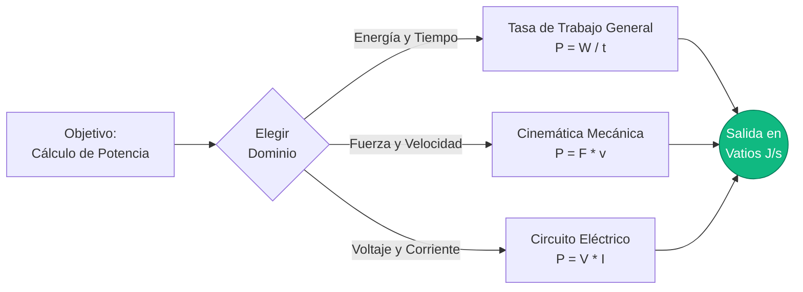
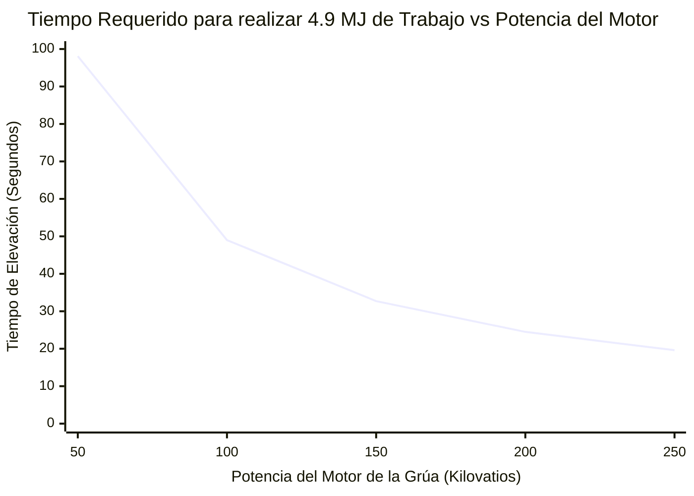
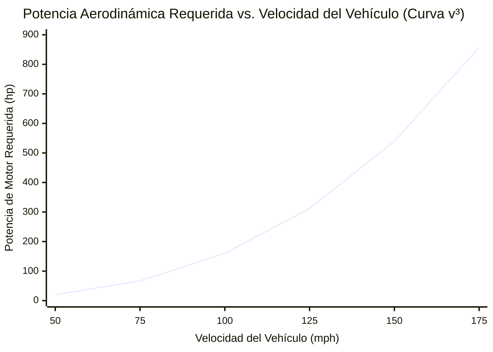
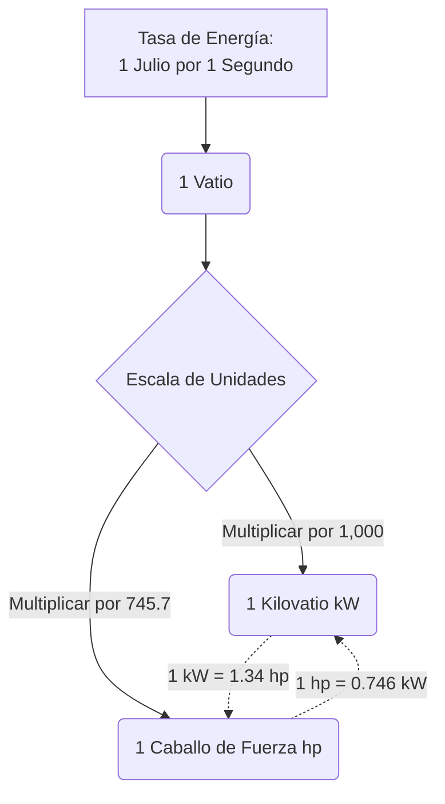

# La Calculadora de Potencia Completa: Dominando la Transferencia de Energía, Vatios Mecánicos y Caballos de Fuerza Eléctricos

Bienvenido a la **Calculadora de Potencia** definitiva y guía de ingeniería definitiva. Ya seas un ingeniero automotriz tratando de calcular los caballos de fuerza al freno de un bloque de motor recién diseñado, un ingeniero eléctrico dimensionando una red eléctrica comercial, o un fisiólogo deportivo analizando el vataje máximo de sprint de un ciclista profesional, esta herramienta te proporcionará las conversiones de física exactas que necesitas.

En las conversaciones cotidianas, las palabras "Energía", "Trabajo" y "Potencia" a menudo se usan indistintamente. Pero en la física, representan tres conceptos completamente diferentes y rígidamente definidos. Si el Trabajo ($W$) es la cantidad bruta de energía transferida, entonces la Potencia ($P$) es la *velocidad* a la cual se entrega esa energía.

En esta exhaustiva guía de SEO de más de 4,000 palabras, deconstruiremos en profundidad las fórmulas fundamentales de la Potencia ($P = W/t$ y $P = F \cdot v$). Desglosaremos la historia del Vatio y el Caballo de Fuerza, exploraremos las devastadoras curvas cúbicas de potencia de la resistencia aerodinámica, y analizaremos cinco escenarios reales de alta potencia con visualizaciones personalizadas en Mermaid.js.

---

## 1. Definiendo la Potencia: La Velocidad del Trabajo

En la física clásica, la **Potencia** se define como la derivada del Trabajo con respecto al tiempo. Mide exactamente qué tan rápido se está transfiriendo, consumiendo o generando la energía.

$$ P = \frac{W}{t} = \frac{\Delta E}{\Delta t} $$

### La Analogía de la Escalera
Para comprender de manera intuitiva la diferencia entre Trabajo y Potencia, imagina a un hombre de $100\text{ kg}$ de pie en la parte inferior de una escalera de $10\text{ metros}$ de altura.
- Si él sube lentamente las escaleras durante $60\text{ segundos}$, debe combatir la gravedad para levantar su masa. Realiza exactamente $9,810\text{ Julios}$ de trabajo mecánico ($W = mgh$).
- Si él corre violentamente por las mismas escaleras en solo $5\text{ segundos}$, igual levanta la misma masa exacta a la misma altura exacta. Realizó exactamente los *mismos* $9,810\text{ Julios}$ de trabajo.

Sin embargo, la **Potencia** generada fue radicalmente diferente:
- **Potencia Caminando:** $P = 9,810\text{ J} / 60\text{ s} = \mathbf{163.5\text{ Vatios}}$
- **Potencia Corriendo:** $P = 9,810\text{ J} / 5\text{ s} = \mathbf{1,962.0\text{ Vatios}}$

El corredor fue doce veces más potente, agotando completamente su sistema cardiovascular anaeróbico en el proceso.

### El Vatio: La Unidad SI de Potencia
La potencia se mide en **Vatios** ($\text{W}$), nombrada en honor a James Watt, el ingeniero escocés que mejoró radicalmente la máquina de vapor.
$$ 1\text{ Vatio} = 1\text{ Julio por segundo} $$
Si una bombilla está calificada para $60\text{W}$, está físicamente consumiendo $60\text{ Julios}$ de energía eléctrica cada segundo que permanece encendida.

---

## 2. Los Tres Dominios de las Ecuaciones de Potencia

Dado que la Potencia es simplemente la tasa de transferencia de energía, puede calcularse usando diferentes fórmulas dependiendo de si trabajas en mecánica general, cinemática o ingeniería eléctrica.

### 1. Tasa General de Trabajo ($P = W / t$)
La fórmula más universal. Divide el Trabajo total realizado (o la Energía total consumida) por el tiempo total transcurrido.

### 2. Potencia Cinemática Mecánica ($P = F \cdot v$)
Si un objeto se mueve a una velocidad constante ($v$) mientras es empujado por una fuerza constante ($F$), puedes calcular instantáneamente la potencia requerida sin necesidad de saber el tiempo total ni la distancia total.
Como $W = F \cdot d$, y $v = d / t$, sustituir estos nos da:
$$ P = F \cdot v $$
*(Esta es la fórmula exacta utilizada para calcular la potencia del motor de un coche empujando contra la resistencia del viento).*

### 3. Potencia Eléctrica ($P = V \cdot I$)
En un circuito de corriente continua (CC), la potencia eléctrica es el producto del Voltaje (presión eléctrica) y la Corriente (flujo de electrones).
$$ P = V \cdot I $$
Usando la Ley de Ohm ($V = I \cdot R$), esto también se puede reescribir como $P = I^2 \cdot R$ o $P = V^2 / R$, lo cual es vital para calcular la disipación de calor en una resistencia.

---

## 3. La Historia y Conversión del Caballo de Fuerza (hp)

Cuando James Watt inventó su máquina de vapor altamente eficiente a fines del siglo XVIII, enfrentó un enorme problema de marketing. Sus clientes potenciales eran mineros del carbón y operadores de molinos que en ese entonces usaban caballos de tiro para impulsar sus bombas. Ellos no entendían de "presión de vapor"; querían saber a cuántos caballos podrían despedir si compraban su máquina.

Watt estudió el trabajo promedio que producía un caballo de tiro moviendo la rueda de un molino y estandarizó la unidad del **Caballo de Fuerza (hp)**.
Definió $1\text{ hp}$ como la potencia requerida para levantar $33,000\text{ libras}$ por $1\text{ pie}$ en exactamente $1\text{ minuto}$.

### Conversiones Métricas Modernas
- **Caballo de Fuerza Mecánico (hp imperial):** $1\text{ hp} = 745.7\text{ Vatios}$
- **Caballo de Vapor Métrico (PS / Pferdestärke):** $1\text{ PS} = 735.5\text{ Vatios}$

El motor moderno de un automóvil de $200\text{ hp}$ es técnicamente capaz de realizar el trabajo mecánico continuo de 200 caballos de tiro masivos del siglo XVIII simultáneamente.

---

## 4. Guía de Uso Integral: Maximizando la Calculadora

Nuestra Calculadora de Potencia interactiva actúa como un puente universal a través de todos los dominios de la ingeniería.

### Paso 1: Selecciona Tu Objetivo de Cálculo
Usa la navegación superior para seleccionar tus variables conocidas:
- **Tasa de Trabajo ($P = W/t$):** Ideal para problemas generales de consumo de energía.
- **Mecánica ($P = F \cdot v$):** Ideal para problemas automotrices, aeroespaciales y de vehículos cinemáticos.
- **Eléctrica ($P = V \cdot I$):** Ideal para el diseño de placas de circuitos y la auditoría energética de electrodomésticos.

### Paso 2: Utiliza la Tabla de Conversión de Caballos de Fuerza
Deja de depender del cálculo mental. Ingresa tu vataje y ve instantáneamente la conversión exacta a Kilovatios, Megavatios, Caballos de Fuerza Mecánicos Imperiales, PS Métricos y BTU/hr (vital para técnicos de HVAC).

### Paso 3: Interpreta el Medidor de Potencia Logarítmico
Nuestra escala de potencia radial contextualiza instantáneamente tu resultado frente a puntos de referencia del mundo real:
- **Micro-Potencia:** $0\text{W}$ a $1,000\text{W}$ (Humanos, bombillas, licuadoras).
- **Macro-Potencia:** $1\text{kW}$ a $1,000\text{kW}$ (Automóviles, camiones, aviones pequeños).
- **Mega-Potencia:** $1\text{MW}$ a $1\text{GW}$+ (Locomotoras, plantas nucleares, cohetes Saturno V).

---

## 5. Cinco Escenarios de Ingeniería Conceptuales con Visualizaciones 2D

Para comprender completamente la dinámica de la generación de Potencia, exploraremos cinco escenarios físicos detallados, utilizando Mermaid.js para deconstruir visualmente las matemáticas y las curvas de potencia.

### Ejemplo 1: Los Tres Dominios de la Potencia (Flujo Lógico de Ecuaciones)

**El Escenario:**
Un estudiante de ingeniería necesita dirigir rápidamente sus variables conocidas a través de la fórmula de potencia correcta dependiendo de la pregunta de su examen (Termodinámica, Cinemática o Eléctrica).

**Visualización 2D:**
Este diagrama de flujo desglosa visualmente los tres pilares masivos del cálculo de potencia.



---

### Ejemplo 2: Potencia de Elevación de una Grúa vs Tiempo

**El Escenario:**
Una enorme grúa de construcción en el sitio de un rascacielos necesita levantar una viga I de acero de $5,000\text{ kg}$ a una altura de $100\text{ metros}$. El motor eléctrico del cabrestante de la grúa está clasificado para exactamente $100\text{ Kilovatios}$ ($100,000\text{ W}$) de potencia continua. ¿Qué tan rápido puede la grúa levantar la viga?

**Las Matemáticas:**
Primero, calcula el trabajo total requerido para combatir la gravedad:
$$ W = m \cdot g \cdot h = 5,000 \cdot 9.81 \cdot 100 = 4,905,000\text{ Julios} $$

Luego, usa la fórmula de la Potencia para despejar el tiempo:
$$ P = W / t $$
$$ 100,000 = 4,905,000 / t $$
$$ t = 49.05\text{ segundos} $$

**Visualización 2D:**
Si mejoran la grúa con un motor de $200\text{ kW}$, tomará la mitad del tiempo. Si la reducen a un motor de $50\text{ kW}$, tomará el doble de tiempo. Este gráfico muestra la relación inversa entre la potencia disponible y el tiempo requerido para una cantidad fija de trabajo.



---

### Ejemplo 3: La Penalización Aerodinámica V-Cubo (Potencia vs Velocidad)

**El Escenario:**
¿Por qué es tan increíblemente difícil para un coche ir a $200\text{ mph}$, incluso si puede ir fácilmente a $100\text{ mph}$? Todo se reduce a la física horripilante de la resistencia aerodinámica. La fuerza de resistencia aumenta con el cuadrado de la velocidad ($F \propto v^2$). Debido a que la potencia mecánica es Fuerza multiplicada por Velocidad ($P = F \cdot v$), ¡la potencia requerida para empujar un automóvil a través del aire aumenta en proporción al **cubo de la velocidad** ($P \propto v^3$)!

**Las Matemáticas:**
Si un sedán estándar requiere $20\text{ hp}$ para navegar por la carretera a $50\text{ mph}$...
Para duplicar la velocidad a $100\text{ mph}$, ¡requiere $2^3$ ($8\times$) más potencia! Requerirá $160\text{ hp}$.
Para triplicar la velocidad a $150\text{ mph}$, ¡requiere $3^3$ ($27\times$) más potencia! Requerirá $540\text{ hp}$.

**Visualización 2D:**
Este gráfico visualiza la devastadora curva $v^3$. Esta es la razón por la que un Bugatti Veyron de $1,000\text{ hp}$ solo va marginalmente más rápido que un Corvette de $500\text{ hp}$.



---

### Ejemplo 4: La Física de la Conversión de Caballos de Fuerza

**El Escenario:**
Un mecánico estadounidense y un ingeniero eléctrico europeo están debatiendo sobre las especificaciones del motor de un nuevo vehículo eléctrico. El mecánico habla en caballos de fuerza mecánicos al freno ($hp$) y el ingeniero eléctrico habla en Kilovatios ($kW$). Vamos a deconstruir visualmente cómo estas dos unidades están unidas matemáticamente al Julio por segundo fundamental.

**Visualización 2D:**
Este diagrama de flujo ilustra cómo ambas unidades provienen exactamente del mismo origen en la física.



---

### Ejemplo 5: Potencia de Salida de un Ciclista Profesional (Sprint vs Gantt de Resistencia)

**El Escenario:**
Analicemos la potencia biológica de salida de un ciclista profesional del Tour de Francia. La fisiología humana tiene dos sistemas de energía diferentes: Anaeróbico (potencia masiva a corto plazo sin oxígeno) y Aeróbico (potencia sostenida a largo plazo con oxígeno).

Un ciclista profesional podría generar la asombrosa cifra de $1,500\text{ Vatios}$ ($2\text{ hp}$) durante un sprint en la línea de meta. Sin embargo, solo puede mantener eso durante aproximadamente $15\text{ segundos}$ antes de que sus músculos se inunden con ácido láctico. Para una escalada de montaña de varias horas, debe bajar a su umbral aeróbico de aproximadamente $400\text{ Vatios}$.

**Visualización 2D:**
Este diagrama de Gantt visualiza el cronograma del final de una carrera, contrastando la larga fase de resistencia con el violento y poderoso, pero increíblemente breve, sprint anaeróbico.

```mermaid
gantt
    title Cronograma de Potencia de Salida del Ciclista Profesional en el Último Kilómetro
    dateFormat s
    axisFormat %S
    section Aeróbico (Sostenido)
    Pelotón en Crucero (300 Vatios) :active, 0, 45s
    Empuje de Tren de Lanzamiento (600 Vatios) :crit, done, 45s, 60s
    section Anaeróbico (Sprint)
    Sprint Máximo en la Línea de Meta (¡1,500 Vatios!) :milestone, 60s, 75s
    Agotamiento Post-Carrera (50 Vatios) :active, 75s, 100s
```

---

## 6. Análisis Profundo de las Preguntas Frecuentes (FAQ)

**P: ¿Qué es un Kilovatio-hora (kWh) en mi recibo de luz?**
**R:** Esto es muy confuso para los estudiantes. Un Kilovatio ($\text{kW}$) es una unidad de *Potencia*. ¡Pero un Kilovatio-hora ($\text{kWh}$) es una unidad de *Energía*! Es exactamente igual a $1,000\text{ Vatios}$ de potencia operando continuamente por $1\text{ hora}$ ($3,600\text{ segundos}$).
$1,000\text{ W} \times 3,600\text{ s} = 3,600,000\text{ Julios}$. ¡Tu compañía de electricidad te cobra por la energía total (Julios), no por la potencia (Vatios)!

**P: ¿Es lo mismo torque que caballos de fuerza?**
**R:** No. El torque es una fuerza de rotación (un giro). Los caballos de fuerza son qué tan *rápido* puedes aplicar ese giro.
La fórmula automotriz es: $\text{Caballos de Fuerza} = (\text{Torque} \times \text{RPM}) / 5252$.
Un tractor tiene un torque masivo pero RPM bajas, por lo que tiene pocos caballos de fuerza. Un auto de Fórmula 1 tiene un torque bajo pero grita a $15,000\text{ RPM}$, ¡generando caballos de fuerza masivos!

**P: ¿Qué es la potencia RMS vs la potencia máxima en altavoces de audio?**
**R:** La potencia máxima es un truco de marketing que representa una ráfaga de micro-segundos de energía que un altavoz puede soportar antes de estallar. RMS (Raíz Cuadrática Media) es la salida de potencia real, continua y sostenida que un amplificador puede entregar de forma segura. Siempre compra equipo basado en el vataje RMS.

**P: ¿Por qué los autos eléctricos (EVs) se sienten tan increíblemente poderosos?**
**R:** Los motores de combustión interna deben esperar a que se acumulen las RPM para alcanzar su máxima potencia en caballos de fuerza. Un motor eléctrico puede entregar el $100\%$ de su máxima potencia de salida casi instantáneamente desde $0\text{ RPM}$, proporcionando una aceleración violenta e instantánea.

**P: ¿Qué genera la mayor cantidad de potencia en la Tierra?**
**R:** Artificial: El cohete Saturno V generó aproximadamente $60\text{ Gigavatios}$ ($60,000\text{ MW}$) de potencia durante el despegue.
Natural: ¡Un huracán masivo puede liberar energía térmica equivalente a $200\text{ veces}$ la capacidad total de generación eléctrica a nivel mundial!

---

## 7. Conclusión y Reto de Ingeniería

La potencia es el límite de velocidad de la ingeniería humana. Sin importar cuánta energía tengas almacenada en un tanque de combustible o una batería, la clasificación de potencia de tu motor o tu circuito dicta qué tan rápido puedes utilizarla en realidad.

Para dominar verdaderamente estos conceptos, utiliza nuestra Calculadora de Potencia para resolver los siguientes retos de física conceptual:
1. **El Levantador de Pesas:** Un levantador de pesas olímpico levanta una barra de $150\text{ kg}$ del suelo a una altura de $2\text{ metros}$ en exactamente $0.8\text{ segundos}$. ¿Cuál fue su máxima potencia mecánica generada en caballos de fuerza durante ese levantamiento de menos de un segundo?
2. **El Calefactor Ambiental:** Conectas un calefactor ambiental a un tomacorriente estándar de pared de $120\text{ Voltios}$. Esto consume $12.5\text{ Amperios}$ de corriente. ¿Cuántos Kilovatios de potencia de calentamiento térmico genera?
3. **La Resistencia del Cohete:** Un cohete vuela directamente hacia arriba a través de la atmósfera a $500\text{ m/s}$. La resistencia del aire está generando $100,000\text{ Newtons}$ de fuerza de arrastre hacia abajo. ¿Cuántos Megavatios de potencia del motor se están desperdiciando por completo solo para combatir el viento?

Experimenta con el simulador, analiza las aterradoras curvas de potencia aerodinámica $v^3$ y apóyate en esta calculadora para iluminar el flujo masivo de energía que dicta el universo.
