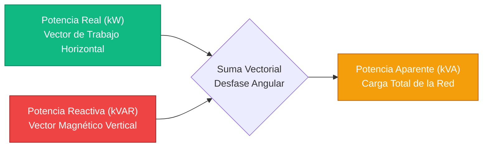
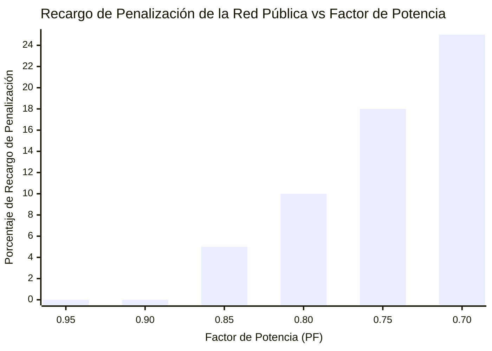
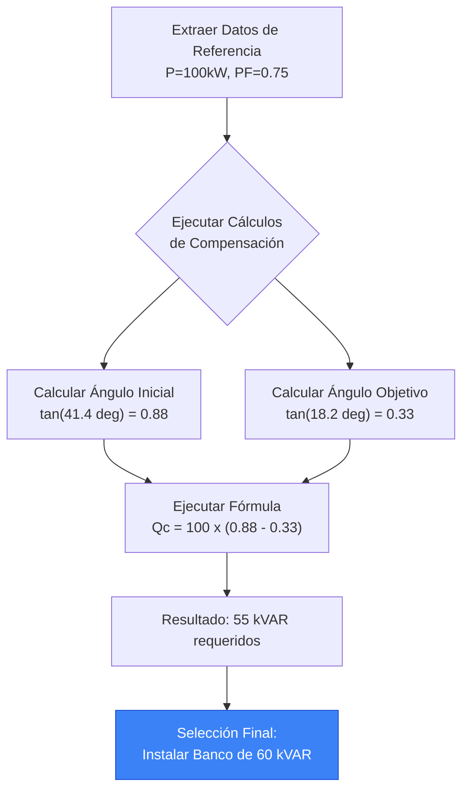
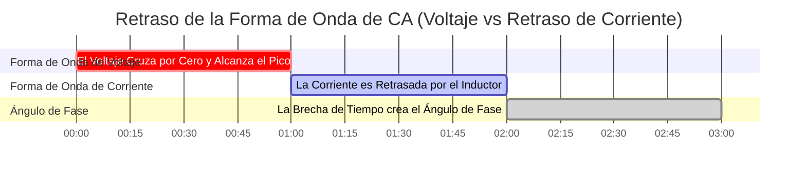

# La Calculadora Definitiva de Factor de Potencia: Potencia Reactiva, Dimensionamiento de Capacitores y Eficiencia Energética

Bienvenido a la **Calculadora de Factor de Potencia** definitiva y a la guía completa de ingeniería eléctrica de CA. Ya sea usted un gerente de instalaciones que intenta eliminar los abrumadores recargos de penalización por potencia reactiva de la red pública, un ingeniero industrial que dimensiona un enorme banco de capacitores automático de $480\text{V}$, o un estudiante universitario de física que intenta visualizar geométricamente el Triángulo de Potencia ($S^2 = P^2 + Q^2$), dominar el factor de potencia es absolutamente obligatorio.

El factor de potencia es la métrica definitiva de la eficiencia eléctrica de CA. Un factor de potencia bajo significa que su sistema está luchando activamente contra sí mismo: extrayendo cantidades masivas de corriente para no hacer absolutamente ningún trabajo real, sobrecalentando violentamente los cables, saturando los transformadores y obligando a la red pública a quemar carbón adicional solo para empujar la energía a su fábrica.

En esta exhaustiva clase magistral de SEO de más de 4,000 palabras, deconstruiremos la trigonometría fundamental $PF = \cos \phi$, expondremos la devastación financiera de las cargas de motores inductivos no corregidas, decodificaremos las matemáticas de ingeniería requeridas para dimensionar de forma segura un Banco de Capacitores Desintonizado, y demostraremos matemáticamente cómo la mejora de su factor de potencia libera instantáneamente la capacidad atrapada del transformador. Para asegurarnos de que comprenda completamente estos conceptos de ingeniería, hemos incluido cinco diagramas interactivos de Mermaid.js meticulosamente detallados y seguros para el analizador.

---

## 1. La Física del Triángulo de Potencia (Real, Reactiva y Aparente)

En los circuitos de corriente continua (CC), la potencia es simple: Voltios multiplicados por Amperios es igual a Vatios. En los circuitos de corriente alterna (CA), la potencia se divide en tres vectores dimensionales distintos.

Para entender el Factor de Potencia, debe visualizar el **Triángulo de Potencia**.

1. **Potencia Real (P) en kW:** Esta es la base horizontal del triángulo. Representa el trabajo útil y real que realiza la electricidad: hacer girar el eje de un motor, calentar el elemento de un horno o iluminar un LED.
2. **Potencia Reactiva (Q) en kVAR:** Esta es la perpendicular vertical del triángulo. Representa la energía "fantasma" requerida para sostener los campos magnéticos invisibles dentro de los motores de inducción y transformadores. Rebota de un lado a otro entre la carga y la red pública, sin realizar ningún trabajo real, pero ocupando un espacio valioso en las líneas eléctricas.
3. **Potencia Aparente (S) en kVA:** Esta es la hipotenusa del triángulo. Es la suma vectorial total de la potencia Real y Reactiva ($S = \sqrt{P^2 + Q^2}$). Esta es la energía bruta que la red pública tiene que generar y empujar a través de los cables.

**La Ecuación del Factor de Potencia:**
$$\text{Factor de Potencia (PF)} = \frac{\text{Potencia Real (kW)}}{\text{Potencia Aparente (kVA)}}$$

Si su instalación consume $100\text{ kW}$ de Potencia Real, pero extrae $125\text{ kVA}$ de Potencia Aparente, su Factor de Potencia es $100 / 125 = 0.80$ (o $80\%$). Esto significa que su instalación tiene solo un $80\%$ de eficiencia en la utilización de la corriente de CA que extrae de la red.

---

## 2. La Devastación Financiera del Factor de Potencia Bajo

Las empresas de servicios eléctricos facturan a las viviendas residenciales estrictamente por Potencia Real (kWh). Sin embargo, a las instalaciones comerciales e industriales se les factura por la Potencia Aparente (kVA) o se les penaliza por el exceso de Potencia Reactiva (kVAR).

¿Por qué? Porque empujar la potencia reactiva por la red requiere cables de cobre más gruesos, transformadores elevadores masivos y aparamenta más pesada. Si su fábrica tiene un factor de potencia de $0.70$, la empresa de servicios públicos tiene que construir una infraestructura capaz de manejar un $42\%$ más de corriente de lo que realmente justifica su Potencia Real.

Para compensar, la empresa de servicios públicos le aplicará un **Recargo de Penalización por Factor de Potencia**.
- Si su PF cae por debajo de $0.90$, pueden cobrar un $2\%$ adicional en su factura total.
- Si su PF cae por debajo de $0.80$, la penalización puede aumentar al $10\%$.
- Si su PF cae a $0.70$, la empresa de servicios públicos puede desconectar forzosamente su instalación de la red hasta que instale bancos de capacitores correctivos.

Corregir su factor de potencia de $0.75$ a $0.95$ a menudo se amortiza en menos de 18 meses únicamente a través de la eliminación de estas tarifas de penalización paralizantes.

---

## 3. Las Matemáticas del Dimensionamiento de Capacitores ($Q_c$)

¿Cómo se soluciona un factor de potencia bajo? Luchando contra la física con física.

Las cargas inductivas (motores) requieren Potencia Reactiva en atraso ($+\text{kVAR}$). Los capacitores generan naturalmente Potencia Reactiva en adelanto ($-\text{kVAR}$). Al instalar un enorme Banco de Capacitores justo al lado del motor inductivo, el capacitor suministra localmente la energía del campo magnético requerida. La potencia reactiva simplemente rebota de un lado a otro entre el capacitor y el motor, protegiendo completamente a la red pública de tener que suministrarla.

**La Fórmula para el Dimensionamiento de Capacitores:**
$$Q_c = P \times (\tan(\phi_1) - \tan(\phi_2))$$

Donde:
- $Q_c$ = Tamaño del capacitor requerido en kVAR.
- $P$ = Potencia Real de la carga en kW.
- $\phi_1$ = Ángulo de Fase Inicial (calculado como $\arccos(\text{PF}_{\text{inicial}})$).
- $\phi_2$ = Ángulo de Fase Objetivo (calculado como $\arccos(\text{PF}_{\text{objetivo}})$).

**Cálculo de Ejemplo:**
Tiene un motor de $100\text{ kW}$ funcionando a $0.75\text{ PF}$. Desea corregirlo a $0.95\text{ PF}$.
1. Ángulo Inicial: $\arccos(0.75) = 41.41^\circ$. $\tan(41.41^\circ) = 0.8819$.
2. Ángulo Objetivo: $\arccos(0.95) = 18.19^\circ$. $\tan(18.19^\circ) = 0.3286$.
3. Compensación Requerida: $Q_c = 100 \times (0.8819 - 0.3286) = 55.33\text{ kVAR}$.

Debe instalar un banco de capacitores de $55\text{ kVAR}$ para lograr un factor de potencia de $0.95$.

---

## 4. Liberando la Capacidad Atrapada del Transformador

Uno de los beneficios más poderosos, aunque rara vez comprendido, de la Corrección del Factor de Potencia es la liberación instantánea de la capacidad atrapada del transformador.

Los transformadores tienen clasificaciones rígidas en kVA (Potencia Aparente). No les importa los kW; solo les importa la corriente térmica total.
Si tiene un enorme transformador de instalación de $500\text{ kVA}$, y su fábrica extrae $400\text{ kW}$ de Potencia Real a un terrible Factor de Potencia de $0.70$:
- Potencia Aparente = $400 / 0.70 = 571\text{ kVA}$.
- **Resultado:** Su transformador de $500\text{ kVA}$ está sobrecargado en $71\text{ kVA}$. Se sobrecalentará y explotará catastróficamente.

En lugar de gastar $50,000 para actualizar a un transformador de $800\text{ kVA}$, instala un banco de capacitores para corregir el Factor de Potencia a $0.95$:
- Nueva Potencia Aparente = $400 / 0.95 = 421\text{ kVA}$.
- **Resultado:** El mismo transformador de $500\text{ kVA}$ está operando ahora de forma segura al $84\%$ de carga. Ha liberado mágicamente $150\text{ kVA}$ de capacidad atrapada de la nada, lo que le permite agregar nuevos equipos de fabricación sin actualizar la subestación de la red pública.

---

## 5. El Peligro de la Resonancia Armónica y la Desintonización

Los capacitores son increíblemente peligrosos cuando se instalan a ciegas. Las fábricas modernas están llenas de electrónica no lineal: Variadores de Frecuencia (VFDs), controladores de iluminación LED y Fuentes de Alimentación Conmutadas.

Estos dispositivos generan **Distorsión Armónica**: frecuencias rebeldes que rebotan por la red eléctrica a $300\text{Hz}$, $420\text{Hz}$ y $660\text{Hz}$.
Por las leyes de la física, la impedancia de un capacitor cae violentamente a medida que aumenta la frecuencia. Si instala un banco de capacitores estándar en una fábrica con altos armónicos, el capacitor actuará como una aspiradora, absorbiendo toda la corriente armónica de alta frecuencia hasta que literalmente detone.

Para prevenir esto, los ingenieros instalan **Bancos de Capacitores Desintonizados**. Estos bancos colocan pesados Reactores Inductivos en serie directamente delante de los capacitores, desplazando intencionalmente el punto de resonancia del circuito de manera segura por debajo de la frecuencia armónica peligrosa más baja (por ejemplo, sintonizando el banco a $255\text{Hz}$ para esquivar perfectamente el agresivo quinto armónico de $300\text{Hz}$).

---

## 6. Cinco Escenarios Conceptuales de Ingeniería con Visualizaciones 2D

Para dominar completamente las relaciones físicas que rigen el Factor de Potencia, exploraremos cinco escenarios de ingeniería distintos desglosados visualmente utilizando diagramas interactivos personalizados de Mermaid.js.

### Ejemplo 1: La Física Vectorial del Triángulo de Potencia

**El Escenario:**
Un estudiante de ingeniería eléctrica necesita visualizar exactamente cómo el vector horizontal de Potencia Real se combina con el vector vertical de Potencia Reactiva para formar la hipotenusa de Potencia Aparente.

**Visualización 2D:**
Este diagrama de flujo lógico traza la relación física de los vectores, demostrando claramente cómo la reducción del vector vertical Q colapsa el vector de la hipotenusa S más cerca de la unidad.



---

### Ejemplo 2: La Curva de Penalización Financiera

**El Escenario:**
Un gerente de instalación debe presentar un caso de negocio al director financiero (CFO) probando que permitir que el factor de potencia de la fábrica caiga por debajo de $0.85$ desencadena un aumento exponencial en las tarifas de penalización de la red pública.

**Las Matemáticas:**
Las empresas de servicios públicos suelen aplicar una línea de base de $0.90$. Por debajo de eso, el multiplicador de penalización se curva agresivamente hacia arriba para castigar el abuso de la red.

**Visualización 2D:**
Este gráfico traza la correlación directa entre un factor de potencia en colapso y las severas penalizaciones financieras infligidas por la red eléctrica local.



---

### Ejemplo 3: Liberando la Capacidad Atrapada del Transformador

**El Escenario:**
Una planta industrial quiere agregar una nueva línea de ensamblaje de $100\text{ kW}$, pero su transformador de $500\text{ kVA}$ está al máximo en $490\text{ kVA}$ debido a un terrible Factor de Potencia de $0.70$.

**Las Matemáticas:**
Carga Actual: $343\text{ kW}$ / $0.70 = 490\text{ kVA}$.
Carga Corregida: $343\text{ kW}$ / $0.98 = 350\text{ kVA}$.
Capacidad Atrapada Liberada: $140\text{ kVA}$.

**Visualización 2D:**
Este gráfico demuestra cómo corregir el Factor de Potencia reduce matemáticamente la huella de Potencia Aparente (kVA), liberando enormes cantidades de espacio libre en el transformador existente.

```mermaid
xychart-beta
    title "Demanda de kVA del Transformador para una Carga de 343 kW"
    x-axis "Estado del Sistema" [Antes de la Corrección (0.70 PF), Después de la Corrección (0.98 PF), Límite Seguro de Espacio Libre]
    y-axis "Demanda del Transformador (kVA)" 0 --> 600
    bar [490, 350, 500]
```

---

### Ejemplo 4: Lógica Automática de Dimensionamiento de Banco de Capacitores

**El Escenario:**
Un contratista eléctrico debe calcular la cantidad exacta de kVAR en adelanto requerida para neutralizar los motores de inducción en atraso de una fábrica, al tiempo que garantiza que el sistema no se sobrecorrija accidentalmente y entre en un peligroso factor de potencia en adelanto.

**Visualización 2D:**
Este diagrama de flujo de arriba hacia abajo traza la lógica estricta requerida para extraer la Potencia Real y los Ángulos de Fase, calcular la compensación requerida ($Q_c$) y desplegar un panel de Corrección Automática del Factor de Potencia (APFC) escalonado.



---

### Ejemplo 5: El Retraso del Ángulo de Fase

**El Escenario:**
Un estudiante de física lucha por entender qué significa realmente "en atraso" en una forma de onda de corriente alterna.

**Visualización 2D:**
Este diagrama de Gantt describe brutalmente la línea de tiempo microscópica de una onda sinusoidal de CA de 50Hz, demostrando cómo una carga inductiva retrasa físicamente la forma de onda de la Corriente para que no se eleve al unísono con la forma de onda del Voltaje, creando el Ángulo de Fase ($\phi$).



---

## 7. Conclusión y Desafío de Ingeniería

Dominar el cálculo del Factor de Potencia es la cúspide absoluta de la ingeniería de eficiencia eléctrica de CA. Comprender la trigonometría vectorial del Triángulo de Potencia, respetar la devastación financiera de las cargas inductivas no corregidas y temer el peligro explosivo de la Resonancia Armónica garantizará que sus instalaciones industriales funcionen con la máxima eficiencia y sin penalizaciones de los servicios públicos.

Si ignora estos principios matemáticos, sus cables se derretirán por sobrecarga térmica $I^2 R$, sus transformadores se saturarán y fallarán violentamente, y su director financiero sangrará miles de dólares cada mes pagando recargos de kVA fantasma a la red eléctrica.

Para garantizar que ha dominado estos conceptos críticos, inicie nuestro Simulador interactivo e intente resolver estos desafíos finales:
1. **El Transformador Atrapado:** Una fábrica extrae $600\text{ kW}$ a $0.65\text{ PF}$ de un transformador de $1000\text{ kVA}$. Si instalan un banco de capacitores para lograr $0.95\text{ PF}$, ¿cuánta capacidad kVA exacta se libera?
2. **El Dimensionamiento del Capacitor:** Un motor de $250\text{ kW}$ opera a $0.80\text{ PF}$. Calcule los kVAR exactos de Compensación Capacitiva requeridos para alcanzar $0.98\text{ PF}$.
3. **La Reducción de Corriente:** Una carga Trifásica de $480\text{V}$ extrae $100\text{ kW}$ a $0.70\text{ PF}$. Calcule la corriente de línea. Luego calcule la nueva corriente de línea si el PF se mejora a $0.95$. ¿Cuántos Amperios de estrés térmico se ahorraron?

Confíe en esta calculadora para auditar las facturas de servicios públicos de sus instalaciones, justificar matemáticamente el retorno de inversión (ROI) de los bancos de capacitores y eliminar permanentemente la ineficiencia de la red.
