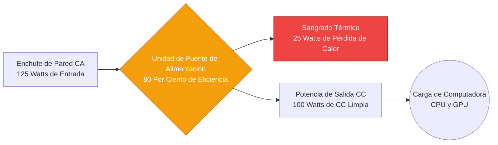
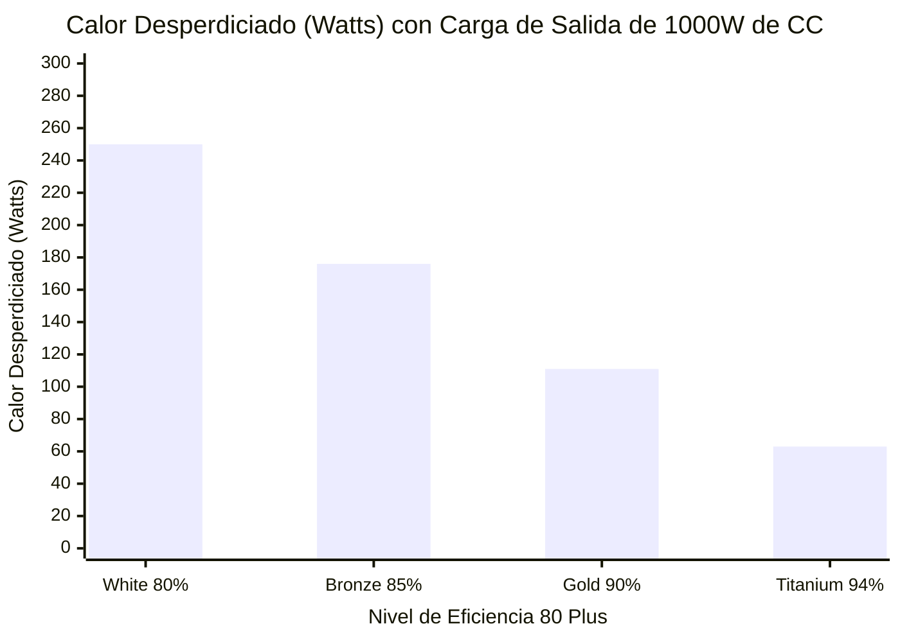
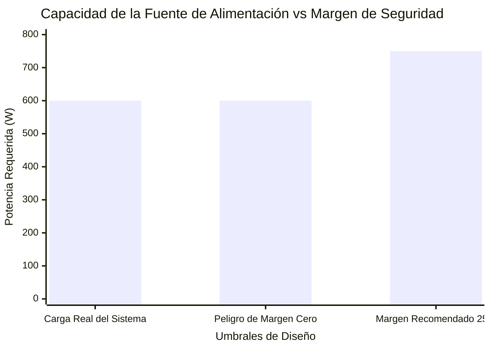
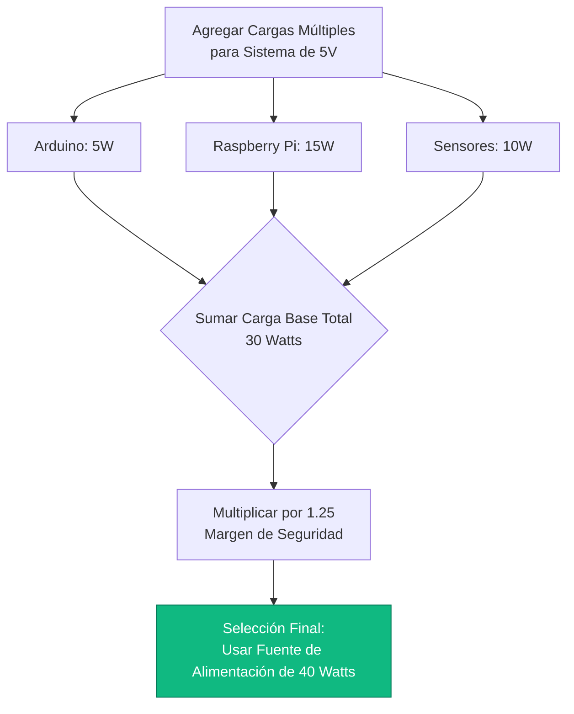
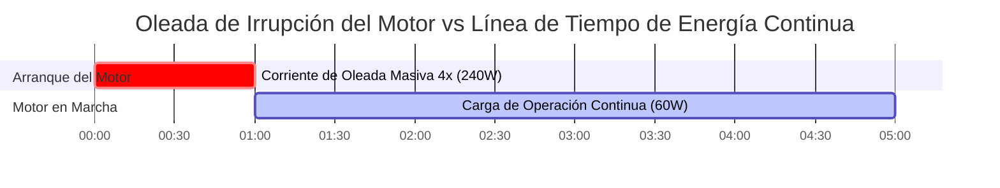

# La Calculadora Definitiva de Fuentes de Alimentación: Potencia, Margen y Eficiencia del Sistema

Bienvenido a la **Calculadora de Fuente de Alimentación** definitiva y la guía completa de gestión de carga eléctrica. Ya sea que sea un integrador de sistemas de TI diseñando un enorme chasis de servidor con PSU dual, un constructor de PC empedernido intentando domesticar matemáticamente los picos de potencia transitorios de una RTX 4090, o un ingeniero de automatización industrial dimensionando una fuente de riel DIN de $24\text{V}$ para una matriz de motores de CC hambrientos, dominar la física de la fuente de alimentación no es negociable.

Una Unidad de Fuente de Alimentación (PSU) es el corazón palpitante de todo sistema electrónico. Si la subdimensiona, su equipo colapsará violentamente, sufrirá caídas de voltaje o desencadenará un apagado térmico. Si ignora su curva de eficiencia, desperdiciará miles de dólares convirtiendo la energía principal de CA en un calor inútil y dañino.

En esta exhaustiva clase magistral de SEO de más de 4,000 palabras, deconstruiremos la ecuación de potencia fundamental $P = V \times I$, expondremos la necesidad crítica de ingeniería del margen de seguridad del 25%, decodificaremos las realidades financieras de los estándares de eficiencia 80 Plus y analizaremos la aterradora física de las corrientes de irrupción de los motores. Para garantizar que comprenda completamente estos conceptos de ingeniería, hemos incluido cinco diagramas interactivos de Mermaid.js meticulosamente detallados y seguros para el analizador.

---

## 1. La Física de la Tubería de la Fuente de Alimentación

Una Fuente de Alimentación Conmutada (SMPS) moderna realiza una conversión eléctrica violenta. Toma Corriente Alterna (CA) de alto voltaje de la pared, la rectifica, la corta en pulsos de alta frecuencia, la reduce a través de un transformador y la filtra en una Corriente Continua (CC) perfectamente suave.

**La Ecuación de Potencia Base:**
$$P_{\text{carga}} = V \times I$$
*(Potencia en Watts = Voltaje en Voltios $\times$ Corriente en Amperios).*

Si tiene una cámara de CCTV de $12\text{V}$ que consume $2\text{ Amperios}$, requiere exactamente $24\text{ Watts}$ de potencia para funcionar.

Pero la fuente de alimentación en sí no es perfecta. Debido a la resistencia eléctrica interna, las pérdidas de conmutación y las ineficiencias del transformador, la fuente de alimentación debe extraer **más** energía de la pared de la que entrega a la cámara. Esta energía desperdiciada se disipa como calor térmico.

---

## 2. La Regla del Margen de Seguridad del 25%

El error más común que cometen los ingenieros aficionados es dimensionar una fuente de alimentación exactamente para la carga total.
Si la carga combinada de su sistema es de $400\text{ Watts}$, y compra una fuente de alimentación de $400\text{W}$, ha diseñado un sistema condenado a fallar.

Hacer funcionar una fuente de alimentación al 100% de su capacidad es idéntico a conducir un automóvil al 100% de su velocidad máxima constantemente. Los capacitores internos hervirán, el ventilador de enfriamiento gritará al máximo de RPM y los componentes de silicio se degradarán térmicamente, reduciendo drásticamente la vida útil de la unidad de 10 años a 2 años.

**El Estándar de Ingeniería Recomendado:**
$$P_{\text{recomendada}} = P_{\text{carga total}} \times 1.25$$

Debe *siempre* agregar un mínimo **Margen de Seguridad del 25%**.
Si la carga de su sistema es de $400\text{W}$: $400 \times 1.25 = 500\text{W}$. Debe comprar una fuente de alimentación de $500\text{W}$. 

Este margen proporciona tres beneficios críticos:
1. **Vida Útil Térmica:** La PSU funciona más fría y silenciosa.
2. **Picos Transitorios:** Proporciona capacidad de reserva para absorber los picos de energía repentinos de microsegundos generados por las GPU y CPU modernas al cambiar de estado.
3. **Punto Dulce de Eficiencia:** Las fuentes de alimentación son matemáticamente más eficientes cuando operan entre el 50% y el 80% de su capacidad total.

---

## 3. Las Matemáticas de la Eficiencia (El Estándar 80 Plus)

Debido a que la conversión de energía genera calor, la industria electrónica creó la **Certificación 80 Plus** para calificar la eficiencia de las fuentes de alimentación. 

Una unidad "80 Plus Bronze" garantiza un $85\%$ de eficiencia al $50\%$ de carga.
Una unidad "80 Plus Titanium" garantiza un $94\%$ de eficiencia al $50\%$ de carga.

**La Ecuación de Potencia de Entrada:**
$$P_{\text{entrada}} = \frac{P_{\text{carga}}}{\text{\% de Eficiencia}}$$

**Ejemplo: Una carga de 500W funcionando con una PSU con 80% de eficiencia frente a una PSU Titanium con 94% de eficiencia.**
- **PSU con 80% de Eficiencia:** $500 / 0.80 = 625\text{W}$ extraídos de la pared. ($125\text{W}$ desperdiciados como calor).
- **PSU con 94% de Eficiencia:** $500 / 0.94 = 531\text{W}$ extraídos de la pared. ($31\text{W}$ desperdiciados como calor).

En un entorno de servidor 24/7, esa diferencia de $94\text{W}$ en calor desperdiciado ahorrará a las instalaciones cientos de dólares tanto en costos eléctricos directos como en costos indirectos de aire acondicionado requeridos para enfriar la sala de servidores.

---

## 4. El Peligro de la Corriente de Irrupción (Multiplicadores de Oleada)

Ciertos componentes eléctricos, en particular los motores de CC, las bombas de agua y los ventiladores pesados, no obedecen las leyes básicas de energía cuando se encienden por primera vez.

Cuando un motor está completamente detenido, genera cero Fuerza Contra-Electromotriz (Back-EMF). En los primeros milisegundos del arranque, el motor actúa casi como un cortocircuito muerto, atrayendo cantidades masivas de corriente para romper la inercia física del rotor.

Esto se conoce como **Corriente de Irrupción** o Potencia de Arranque (Surge).
- Un motor de CC de $12\text{V}$, $2\text{A}$ ($24\text{W}$) puede extraer $8\text{A}$ ($96\text{W}$) durante medio segundo durante el arranque.
- Una fuente de alimentación estándar diseñada estrictamente para $24\text{W}$ activará instantáneamente su Protección contra Sobrecorriente (OCP) y se apagará.

*Regla de Ingeniería:* Al dimensionar una fuente de alimentación para motores o bombas, debe multiplicar la carga continua por un factor de arranque de $3.0\times$ a $4.0\times$ para garantizar que la fuente de alimentación pueda sobrevivir el transitorio de inicio.

---

## 5. Arquitecturas de Energía para PC y Servidores

Las fuentes de alimentación de computadora ATX modernas están altamente especializadas. Aunque emiten $3.3\text{V}$, $5\text{V}$ y $12\text{V}$, la gran mayoría de los componentes de PC modernos (la CPU y la GPU) extraen su energía exclusivamente del riel de $12\text{V}$.

Al dimensionar una fuente de alimentación de PC, debe asegurarse de que la capacidad específica del riel de $12\text{V}$ sea lo suficientemente grande para manejar el TDP (Potencia de Diseño Térmico) combinado de sus procesadores, más los picos transitorios masivos (que pueden alcanzar $2.5\times$ la potencia nominal por unos microsegundos).

En los servidores empresariales, los ingenieros utilizan **Redundancia N+1**. Si un servidor requiere $800\text{W}$ de potencia, está equipado con dos fuentes de alimentación de $800\text{W}$. Comparten la carga de $400\text{W}$ cada una. Si una PSU explota, la otra aumenta instantáneamente al 100% de capacidad ($800\text{W}$), evitando que el servidor colapse.

---

## 6. Cinco Escenarios de Ingeniería Conceptuales con Visualizaciones 2D

Para dominar completamente las relaciones físicas que rigen el dimensionamiento de las fuentes de alimentación, exploraremos cinco escenarios de ingeniería distintos desglosados visualmente mediante diagramas interactivos de Mermaid.js personalizados.

### Ejemplo 1: La Tubería de Conversión de la Fuente de Alimentación

**El Escenario:**
Un estudiante de TI necesita visualizar cómo una fuente de alimentación toma la energía bruta de CA de la pared, sufre pérdidas térmicas y entrega energía de CC utilizable a la placa base.

**Visualización 2D:**
Este diagrama de flujo lógico traza el camino físico de la energía que fluye a través de una SMPS, mostrando explícitamente el sangrado de eficiencia donde la energía eléctrica se pierde como calor.

---

### Ejemplo 2: La Comparación de Pérdida de Calor de Eficiencia 80 Plus

**El Escenario:**
Un gerente de centro de datos debe decidir si pagar una prima por fuentes de alimentación 80 Plus Titanium o apegarse a unidades 80 Plus White baratas para un enorme conjunto de servidores que consumen $1000\text{W}$.

**Las Matemáticas:**
A $1000\text{W}$ de salida, una PSU con 80% de eficiencia desperdicia $250\text{W}$ de calor. Una PSU con 94% de eficiencia desperdicia solo $63\text{W}$ de calor.

**Visualización 2D:**
Este gráfico de barras demuestra agresivamente la masiva penalización térmica infligida a una sala de servidores al utilizar fuentes de alimentación de nivel de eficiencia bajo.

---

### Ejemplo 3: El Margen de Seguridad del 25%

**El Escenario:**
Un constructor de PC personalizado ha tabulado todos los componentes y llegado a una carga de sistema total de $600\text{W}$. Necesita entender visualmente por qué comprar una PSU de $600\text{W}$ es peligroso.

**Las Matemáticas:**
$600\text{W} \times 1.25 = 750\text{W}$ Recomendado.

**Visualización 2D:**
Este gráfico traza la carga total exacta contra el umbral catastrófico de Margen Cero, probando la necesidad del umbral Recomendado de $750\text{W}$.

---

### Ejemplo 4: Algoritmo de Dimensionamiento de Sistemas de Cargas Múltiples

**El Escenario:**
Una ingeniera de automatización está construyendo una caja de control que contiene un Arduino ($5\text{V}$, $1\text{A}$), una Raspberry Pi ($5\text{V}$, $3\text{A}$) y una matriz de sensores ($5\text{V}$, $2\text{A}$). Ella debe dimensionar una sola fuente de alimentación de riel DIN de $5\text{V}$.

**Visualización 2D:**
Este diagrama de flujo de arriba hacia abajo mapea la lógica estricta requerida para agregar cargas independientes de CC y aplicar matemáticamente el margen de seguridad para seleccionar la PSU industrial final.

---

### Ejemplo 5: Oleada de Corriente de Irrupción del Motor (El Pico de Arranque)

**El Escenario:**
Un técnico conecta una bomba de agua de $12\text{V}$ $5\text{A}$ ($60\text{W}$) a una fuente de alimentación de $12\text{V}$ $10\text{A}$ ($120\text{W}$). A pesar de tener un margen de seguridad del 100%, la fuente de alimentación se apaga instantáneamente y se reinicia cada vez que la bomba intenta arrancar.

**Visualización 2D:**
Este diagrama de Gantt describe brutalmente la línea de tiempo microscópica de la Corriente de Irrupción del Motor, demostrando cómo un motor de $60\text{W}$ extrae en realidad $240\text{W}$ durante los primeros 500 milisegundos, disparando violentamente la Protección contra Sobrecorriente de la PSU.

---

## 7. Conclusión y Desafío de Ingeniería

Dominar el cálculo de la Fuente de Alimentación es la base fundamental de todos los sistemas electrónicos estables. Entender la necesidad absoluta del margen de seguridad del 25%, respetar el impacto financiero de las pérdidas térmicas de la Eficiencia 80 Plus, y temer a la aterradora física de las Corrientes de Irrupción de los motores garantizará que sus sistemas nunca colapsen bajo presión.

Si ignora estos principios matemáticos, sus servidores se reiniciarán espontáneamente bajo cargas pesadas, sus fuentes de alimentación se degradarán térmicamente y ventilarán sus capacitores, y sus cajas de control industrial dispararán repetidamente sus circuitos de protección.

Para garantizar que ha dominado estos conceptos críticos, inicie nuestro Simulador interactivo e intente resolver estos desafíos finales:
1. **La Actualización del Servidor:** Un servidor extrae una carga total de $550\text{W}$. Calcule la potencia exacta de la PSU Recomendada usando un estricto margen de seguridad del $25\%$.
2. **El Desperdicio Térmico:** Usted está extrayendo $400\text{W}$ de una fuente de alimentación Bronze con $85\%$ de eficiencia. ¿Exactamente cuántos Watts está extrayendo de la pared, y exactamente cuántos Watts se están desperdiciando como calor térmico?
3. **La Oleada de la Bomba:** Un ventilador industrial de CC de $24\text{V}$ tiene una carga de funcionamiento continuo de $3\text{ Amperios}$. Para garantizar que sobreviva a una oleada de irrupción de arranque de $3\times$, ¿cuál es la PSU de menor potencia absoluta que debe comprar?

Confíe en esta calculadora para auditar sus construcciones de PC, calcular cargas complejas de múltiples dispositivos y defender matemáticamente siempre a su electrónica de la inanición de energía.

