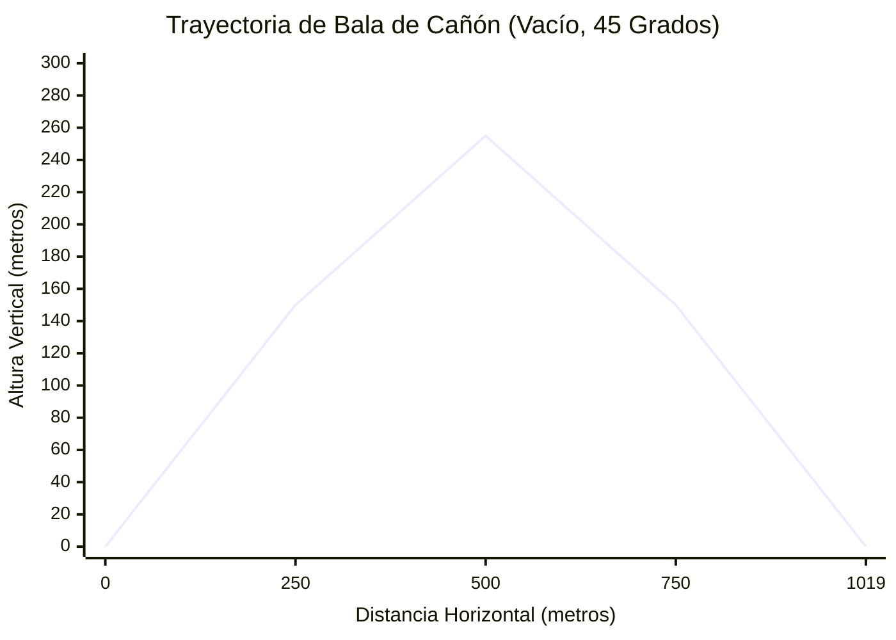
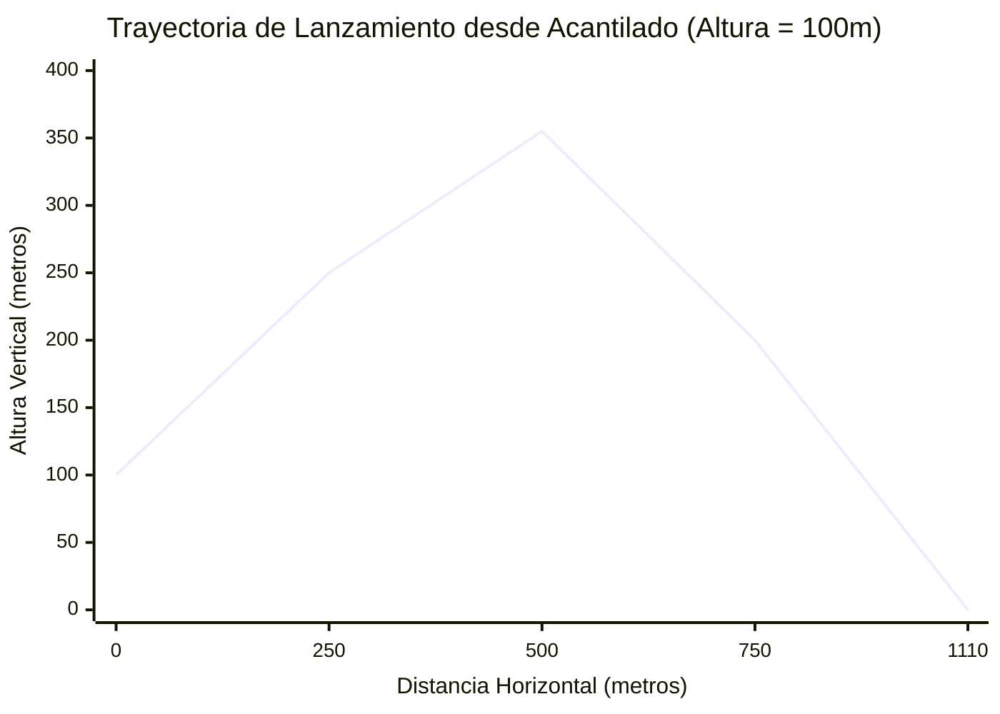
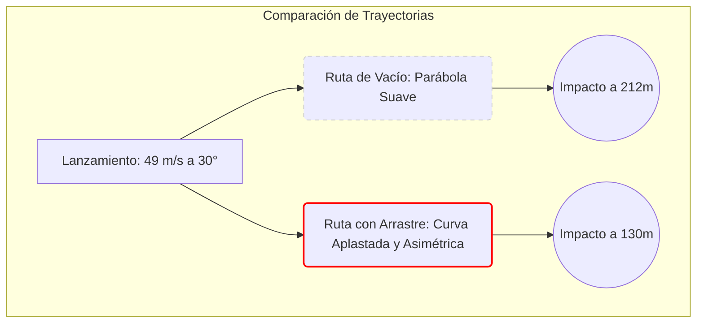
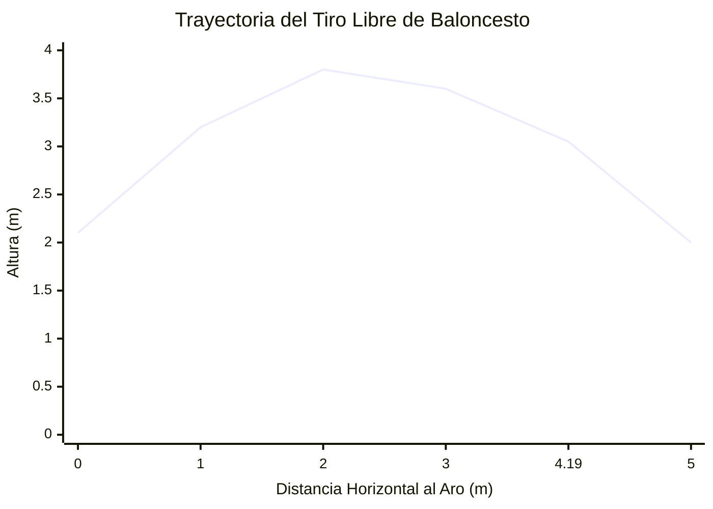
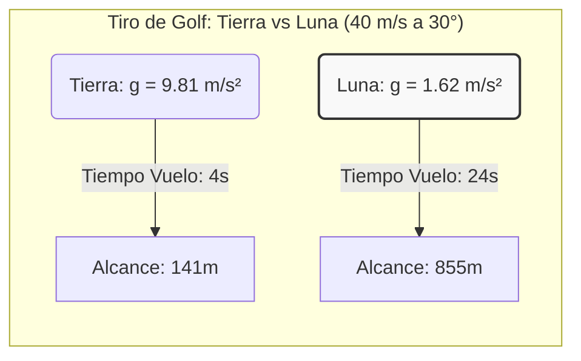

# Calculadora de Movimiento de Proyectiles: La Guía Definitiva de Cinemática y Balística

¿Alguna vez ha lanzado una pelota de béisbol, hecho rebotar una piedra sobre un estanque tranquilo o visto unos fuegos artificiales iluminar el cielo nocturno y se ha preguntado por las reglas matemáticas invisibles que gobiernan su vuelo? Cada vez que un objeto se lanza o dispara al aire, se convierte en un **proyectil**. En el momento en que abandona su mano o el cañón de un arma, su destino queda en manos de las fuerzas fundamentales del universo, principalmente la gravedad y la resistencia del aire.

Comprender cómo se mueven estos objetos no es solo un ejercicio matemático; es la base misma de la mecánica clásica. Es la ciencia que permite a los ingenieros aterrizar rovers en Marte, a los atletas optimizar sus tiros libres y a los desarrolladores de videojuegos crear motores físicos realistas.

Bienvenido a la guía definitiva sobre el movimiento de proyectiles. Tanto si es un estudiante de física de secundaria que lucha con las ecuaciones cinemáticas, un ingeniero mecánico que diseña un lanzador neumático o una mente curiosa que desea comprender el mundo, esta guía, junto con nuestra avanzada **Calculadora de Movimiento de Proyectiles**, le dará un dominio total sobre las trayectorias 2D.

---

## 1. El Concepto Humano del Movimiento de Proyectiles: Una Explicación Profunda

Para comprender verdaderamente el movimiento de los proyectiles, primero debemos desaprender un concepto erróneo común. Durante siglos, filósofos antiguos como Aristóteles creyeron que un objeto lanzado al aire viajaba en línea recta hasta que se quedaba sin "fuerza" (o *ímpetu*), momento en el que caería directamente al suelo. Si observas un objeto que se mueve rápidamente, como una bala, podría parecer que viaja en línea recta.

Sin embargo, a finales del siglo XVI y principios del XVII, **Galileo Galilei** cambió el mundo para siempre al darse cuenta de que la trayectoria de un proyectil es en realidad una curva suave y simétrica conocida en matemáticas como **parábola**.

El genio de Galileo consistió en darse cuenta de que el movimiento de un proyectil no es un movimiento complejo, sino **dos movimientos simples y completamente independientes que ocurren al mismo tiempo**.

### Los Dos Pilares de la Cinemática 2D

Cuando se dispara una bala de cañón horizontalmente desde un acantilado, hace dos cosas simultáneamente:
1. **Avanzar** (Movimiento Horizontal)
2. **Caer hacia abajo** (Movimiento Vertical)

El principio de **Independencia del Movimiento** de Galileo establece que estas dos dimensiones no se afectan entre sí. A la velocidad de avance horizontal no le importa que el objeto esté cayendo, y a la velocidad de caída vertical no le importa que el objeto esté avanzando.

#### Movimiento Horizontal: La Fase de Inercia
Imagine que desliza un disco sobre una capa de hielo perfecto sin fricción. Una vez que lo empuja, sigue deslizándose hacia adelante a la misma velocidad para siempre. Ya no hay ninguna fuerza que lo empuje hacia adelante, pero tampoco hay ninguna fuerza que lo frene. Esta es la Primera Ley del Movimiento de Newton (Inercia).

En un vacío físico ideal (donde fingimos que el aire no existe), el movimiento horizontal de un proyectil es exactamente como ese disco. Una vez que se lanza el objeto, hay cero fuerzas horizontales actuando sobre él. Por lo tanto, su **velocidad horizontal permanece perfectamente constante**, y su aceleración horizontal es cero ($a_x = 0$).

#### Movimiento Vertical: La Fase de Caída
Ahora, imagine dejar caer una manzana de su mano. Comienza a velocidad cero, pero la gravedad tira de ella hacia abajo, haciendo que acelere. Cada segundo que cae, su velocidad aumenta en aproximadamente $9.81 \text{ m/s}$.

Para un proyectil, sucede exactamente lo mismo. Independientemente de lo rápido que avance, la gravedad tira implacablemente de él hacia abajo con una aceleración vertical constante ($a_y = -9.81 \text{ m/s}^2$ en la Tierra).

Cuando combinas una velocidad de avance constante con una velocidad de caída que acelera hacia abajo, la ruta resultante trazada a través del espacio es un arco parabólico perfecto.

### Las Matemáticas del Vacío

Para predecir la ubicación exacta de un proyectil en un segundo dado, usamos las ecuaciones cinemáticas estándar.

**1. Desglose del Lanzamiento (Resolución de Vectores)**
Cuando se lanza un proyectil a una velocidad inicial ($v_0$) y un ángulo específico ($\theta$) en relación con el suelo, el primer paso es dividir esa velocidad en sus componentes horizontal y vertical usando trigonometría.
*   **Velocidad Horizontal Inicial:** $v_{x0} = v_0 \cdot \cos(\theta)$
*   **Velocidad Vertical Inicial:** $v_{y0} = v_0 \cdot \sin(\theta)$

**2. Cálculo de la Posición a lo Largo del Tiempo**
Debido a que la velocidad horizontal nunca cambia (en el vacío), encontrar la distancia horizontal ($x$) en cualquier tiempo ($t$) es una simple multiplicación:
*   **Posición Horizontal:** $x(t) = v_{x0} \cdot t$

La posición vertical ($y$) es un poco más compleja porque la gravedad cambia constantemente la velocidad. Debemos tener en cuenta la altura inicial ($h_0$), la velocidad ascendente inicial y el tirón descendente de la gravedad ($g$):
*   **Posición Vertical:** $y(t) = h_0 + (v_{y0} \cdot t) - \frac{1}{2}g \cdot t^2$

Al vincular estas dos ecuaciones a través de la variable del tiempo ($t$), nuestra calculadora puede trazar instantáneamente la ruta de vuelo exacta de cualquier objeto en el universo.

---

## 2. Guía de Uso Completa: Dominando el Simulador

Nuestra **Calculadora de Movimiento de Proyectiles** no es solo un simple solucionador de ecuaciones; es un motor de física 2D completo. Aquí se explica cómo desbloquear todo su potencial.

### Paso 1: Configurar Sus Parámetros Iniciales
*   **Velocidad Inicial (Launch Speed):** Esta es la velocidad bruta a la que el objeto abandona el lanzador. Puede ingresarla en metros por segundo (m/s), kilómetros por hora (km/h), millas por hora (mph) o pies por segundo (ft/s).
*   **Ángulo de Lanzamiento:** Ingrese el ángulo de elevación. $0^\circ$ significa disparar perfectamente en horizontal. $90^\circ$ significa disparar directamente hacia el aire. $45^\circ$ es tradicionalmente el ángulo para el alcance máximo en el vacío.
*   **Altura Inicial:** Si está lanzando una pelota desde un acantilado de 50 metros, ingrese 50 aquí. Si está pateando un balón de fútbol desde el suelo, déjelo en 0.

### Paso 2: Elegir el Entorno
*   **Ajustes Preestablecidos de Gravedad:** La gravedad de la Tierra es la predeterminada ($9.81 \text{ m/s}^2$). Sin embargo, puede usar el menú desplegable para simular lanzamientos en la Luna, Marte, Júpiter o incluso asteroides en el espacio profundo. ¡Observe cómo la trayectoria explota en altura cuando selecciona la Luna!
*   **Resistencia del Aire (Arrastre):** Aquí es donde la calculadora pasa de la física de la escuela secundaria a la ingeniería de nivel universitario. Al habilitar "Enable Air Resistance", el simulador cambia de simples ecuaciones algebraicas a un complejo motor de integración numérica **Runge-Kutta de 4º Orden (RK4)**. Debe proporcionar la Masa, el Área Transversal y el Coeficiente de Resistencia Aerodinámica ($C_d$) del objeto. Ofrecemos ajustes preestablecidos para objetos comunes como pelotas de béisbol, pelotas de golf y balas.

### Paso 3: El Simulador de Impacto en el Objetivo
¿Intenta golpear una ventana específica, sortear un muro específico o aterrizar en una trinchera específica?
*   Habilite el **Simulador de Impacto en el Objetivo (Target Hit Simulator)**.
*   Ingrese las coordenadas X (distancia horizontal) e Y (altura vertical) de su objetivo.
*   Aparecerá un punto de mira en el gráfico interactivo. A continuación, puede ajustar el ángulo de lanzamiento y la velocidad hasta que la curva de su trayectoria se cruce perfectamente con el punto de mira objetivo.

### Paso 4: Análisis de los Datos de Salida
Una vez que ingrese sus parámetros, la calculadora genera instantáneamente los datos de vuelo:
*   **Altura Máxima (Apex):** El punto vertical más alto alcanzado antes de que la gravedad lo tire hacia abajo.
*   **Alcance Horizontal:** La distancia total recorrida por el suelo antes del impacto.
*   **Tiempo de Vuelo:** Los segundos totales que el objeto permanece en el aire.
*   **Velocidad de Impacto:** La velocidad y el ángulo exactos a los que el proyectil golpea el suelo.

Puede pasar el ratón sobre el gráfico de trayectoria interactivo para ver las coordenadas exactas X/Y y los vectores de velocidad en cualquier fracción de segundo durante el vuelo.

---

## 3. Cinco Ejemplos Conceptuales con Visualizaciones 2D

Para dominar verdaderamente el movimiento de los proyectiles, debemos ir más allá de las ecuaciones abstractas y observar ejemplos concretos del mundo real. A continuación se presentan cinco escenarios distintos que ilustran cómo cambiar una sola variable altera drásticamente la trayectoria de vuelo.

### Ejemplo 1: La Bala de Cañón Clásica (Vacío Ideal, Terreno Plano)
**El Escenario:** Usted está al mando de una tripulación de artillería del siglo XVII en una llanura perfectamente plana e interminable. Ignoraremos la resistencia del aire para esta línea base puramente matemática. Dispara una bala de cañón con una velocidad inicial de $100 \text{ m/s}$ a un ángulo de $45^\circ$.

**El Desglose Físico:**
Debido a que estamos en terreno plano ($h_0 = 0$) en un vacío, la trayectoria será una parábola perfectamente simétrica. Un ángulo de $45^\circ$ divide la velocidad inicial de forma perfectamente equitativa entre los vectores horizontal y vertical ($v_{x0} = 70.7 \text{ m/s}$, $v_{y0} = 70.7 \text{ m/s}$).
*   **Tiempo para alcanzar el pico:** $70.7 / 9.81 = 7.21 \text{ segundos}$.
*   **Tiempo Total de Vuelo:** $7.21 \times 2 = 14.42 \text{ segundos}$ (simetría perfecta).
*   **Alcance Horizontal:** $70.7 \text{ m/s} \times 14.42 \text{ s} = 1019.5 \text{ metros}$.

**Visualización 2D (Mapa de Trayectoria):**

*Observe la perfecta simetría de espejo de la curva. El ascenso toma exactamente la misma cantidad de tiempo y cubre la misma distancia horizontal exacta que el descenso.*

---

### Ejemplo 2: El Lanzamiento desde el Acantilado (Altura Inicial > 0)
**El Escenario:** Ahora está defendiendo un castillo construido al borde de un acantilado vertical de 100 metros. Dispara la misma bala de cañón a $100 \text{ m/s}$, pero esta vez experimenta con el ángulo.

**El Desglose Físico:**
Cuando se lanza desde una altura, $45^\circ$ **ya no es el ángulo óptimo para el alcance máximo**. ¿Por qué? Porque el proyectil pasa un tiempo adicional cayendo desde el acantilado de 100 metros hasta el suelo de elevación cero. Si usa un ángulo un poco más bajo (por ejemplo, $40^\circ$), dedica más de su energía inicial a la velocidad horizontal de avance ($v_x$). La distancia de caída adicional proporciona el tiempo de vuelo necesario para que esa velocidad horizontal más rápida cubra más terreno.
*   Si se dispara a $45^\circ$, el alcance es de $1110 \text{ metros}$.
*   Si se dispara a $40^\circ$, el alcance aumenta a $1115 \text{ metros}$.

**Visualización 2D (La Asimetría de los Lanzamientos Elevados):**

*Aquí, la simetría se rompe. El proyectil alcanza su altura máxima relativamente temprano en su viaje horizontal, y el lado derecho de la parábola se estira a medida que cae por debajo de la elevación del lanzamiento.*

---

### Ejemplo 3: El Jonrón de Béisbol (La Realidad de la Resistencia del Aire)
**El Escenario:** Dejamos el vacío teórico y entramos en el mundo real. Un jugador de las Grandes Ligas de Béisbol golpea una pelota con una velocidad de salida de $49 \text{ m/s}$ (aproximadamente 110 mph) a un ángulo de lanzamiento de $30^\circ$. Una pelota de béisbol tiene una masa de $0.145 \text{ kg}$ y un coeficiente de resistencia ($C_d$) de aproximadamente $0.3$.

**El Desglose Físico:**
La resistencia del aire lo cambia todo. A medida que la pelota empuja a través del aire, millones de moléculas atmosféricas chocan contra ella, generando una fuerza de arrastre que se opone a su movimiento. Esta fuerza de arrastre crece exponencialmente con la velocidad ($F_d \propto v^2$).
*   **En el vacío:** La pelota viajaría unos enormes **212 metros** (695 pies), saliendo del estadio por completo.
*   **Con Resistencia del Aire:** El arrastre purga rápidamente la velocidad horizontal. La pelota alcanza su punto máximo antes y cae de forma mucho más vertical. El alcance real se reduce a aproximadamente **130 metros** (426 pies), un jonrón estándar.

**Visualización 2D (Vacío frente a Arrastre):**

*Cuando se factoriza la resistencia del aire, la trayectoria ya no es una parábola. Se asemeja a una forma de lágrima. El ángulo de descenso es mucho más pronunciado que el ángulo de lanzamiento porque la velocidad de avance ha sido eliminada en gran medida por el arrastre.*

---

### Ejemplo 4: El Tiro Libre de Baloncesto (Impacto en un Objetivo Fijo)
**El Escenario:** Un jugador de baloncesto está lanzando un tiro libre. El jugador suelta el balón desde una altura de $2.1 \text{ metros}$. El centro del aro está exactamente a $4.19 \text{ metros}$ de distancia horizontal, y exactamente a $3.05 \text{ metros}$ de altura.

**El Desglose Físico:**
Este es un problema de cinemática inversa. En lugar de preguntar "¿Dónde aterrizará?", estamos exigiendo que la trayectoria intercepte una coordenada específica: $(X = 4.19, Y = 3.05)$.
El jugador generalmente dispara a un ángulo de aproximadamente $50^\circ$ para darle a la pelota un arco alto, lo que le permite caer limpiamente a través del aro. Usando la ecuación de la trayectoria, la velocidad inicial requerida para golpear perfectamente el centro del aro en un ángulo de $50^\circ$ desde una altura de liberación de $2.1\text{m}$ es exactamente **$7.28 \text{ m/s}$**. Si el jugador dispara a $7.5 \text{ m/s}$, golpea el hierro trasero. Si disparan a $7.0 \text{ m/s}$, ni siquiera toca el aro (airball).

**Visualización 2D (Intersección del Objetivo):**

*La precisión matemática requerida en los deportes es asombrosa. El cerebro humano actúa como una computadora balística en tiempo real, calculando intuitivamente el $v_0$ y el $\theta$ necesarios para hacer que la línea de la trayectoria intercepte la coordenada $(4.19, 3.05)$.*

---

### Ejemplo 5: Jugar al Golf en la Luna (Entornos de Baja Gravedad)
**El Escenario:** En 1971, el astronauta del Apolo 14, Alan Shepard, golpeó una pelota de golf en la superficie de la Luna con un hierro 6 improvisado. Supongamos una velocidad de swing amateur de $40 \text{ m/s}$ y un ángulo de lanzamiento de $30^\circ$.

**El Desglose Físico:**
La Luna es un entorno físico radicalmente diferente.
1.  **Cero Resistencia del Aire:** No hay atmósfera, por lo que usamos las ecuaciones de vacío puro. La pelota de golf no se curvará ni frenará.
2.  **Baja Gravedad:** La atracción gravitatoria es de solo $1.62 \text{ m/s}^2$ (aproximadamente 1/6 de la gravedad de la Tierra).

Debido a que la gravedad tira de la pelota hacia abajo 6 veces menos fuerza, la pelota permanece en el aire 6 veces más. Debido a que está en el aire 6 veces más, su velocidad horizontal constante la lleva 6 veces más lejos.
*   **Alcance en la Tierra:** $141 \text{ metros}$
*   **Alcance en la Luna:** $855 \text{ metros}$ (¡Más de media milla!)

**Visualización 2D (Escala de Gravedad):**

*Al cambiar la constante fundamental de la gravedad ($g$), la entrada exacta de energía inicial da como resultado una salida cinemática enormemente ampliada.*

---

## 4. Temas Avanzados e Ingeniería del Mundo Real

Si bien lanzar pelotas de béisbol y golpear pelotas de golf son excelentes herramientas pedagógicas, el movimiento de proyectiles forma la base de la ingeniería avanzada y las aplicaciones militares.

### Mecánica Orbital: La Bala de Cañón de Newton
Isaac Newton propuso un famoso experimento mental: ¿Qué pasaría si pusiéramos un cañón en lo alto de una montaña tan imposiblemente alta que superara la atmósfera de la Tierra (eliminando la resistencia del aire)?
Si se dispara la bala de cañón a velocidades estándar, sigue una parábola normal y golpea el suelo. Pero si se dispara lo suficientemente rápido (alrededor de $7,900 \text{ m/s}$), ocurre algo milagroso.
La bala de cañón cae hacia la Tierra debido a la gravedad, pero debido a que la Tierra es una esfera, la superficie del planeta *se curva alejándose* de la bala de cañón exactamente al mismo ritmo al que cae la pelota. La bala de cañón está en un estado perpetuo de caída libre, perdiendo constantemente el suelo.
Esto es lo que es una **órbita**. La Estación Espacial Internacional (ISS) es técnicamente solo un proyectil que se mueve tan rápido horizontalmente que su arco parabólico coincide perfectamente con la curvatura de la Tierra.

### Artillería y el Efecto Coriolis
Para los francotiradores militares y las tripulaciones de artillería de largo alcance, la ecuación básica $R = \frac{v_0^2 \sin(2\theta)}{g}$ es lamentablemente insuficiente. Al disparar un proyectil a kilómetros de distancia, los ingenieros deben tener en cuenta:
1.  **Densidad Variable del Aire:** El aire es más delgado en el vértice de la trayectoria que en el punto de lanzamiento, cambiando el coeficiente de resistencia aerodinámica dinámicamente durante el vuelo.
2.  **El Efecto Coriolis:** La Tierra gira bajo el proyectil mientras está en el aire. Si se dispara un proyectil de artillería hacia el norte en el hemisferio norte, el objetivo se mueve hacia el este más rápido que el punto de lanzamiento. El proyectil parecerá curvarse hacia la derecha. Las computadoras balísticas deben calcular esta fuerza ficticia para garantizar la precisión.

### Ciencia del Deporte: El Efecto Magnus
En nuestro simulador, tratamos los objetos como masas puntuales no rotativas. En realidad, las esferas como pelotas de tenis, balones de fútbol y pelotas de béisbol giran rápidamente.
Cuando una pelota gira mientras se mueve por el aire, arrastra consigo una capa límite de aire. Una pelota con **retroceso** (como una bola rápida o una pelota de golf impulsada) empuja el aire hacia abajo. Según la Tercera Ley de Newton, el aire empuja la pelota hacia arriba. Esto genera una fuerza de sustentación conocida como **Efecto Magnus**.
Esta es la razón por la que una pelota de golf impulsada con un fuerte retroceso puede viajar de hecho *más lejos* en el mundo real que en un vacío puro: la sustentación aerodinámica la mantiene en el aire el tiempo suficiente para contrarrestar la desaceleración aerodinámica.

---

## Conclusión: La Belleza de la Física Predecible

La magia del movimiento de los proyectiles radica en su determinismo absoluto. Una vez que un objeto abandona el lanzador, su destino queda completamente sellado por las leyes de la física. Al comprender la velocidad inicial, el ángulo de lanzamiento y las fuerzas ambientales de la gravedad y la resistencia aerodinámica, podemos mirar hacia el futuro y predecir exactamente dónde y cuándo aterrizará el objeto.

Le recomendamos encarecidamente que dedique tiempo a experimentar con el **Simulador de Movimiento de Proyectiles** anterior. Cambie los ángulos de lanzamiento. Alterne la resistencia del aire. Vea qué sucede cuando dispara una pelota de béisbol en Júpiter. Al jugar con las variables, las ecuaciones abstractas de la cinemática se transformarán en una comprensión intuitiva y visual de la mecánica que gobierna nuestro universo.
