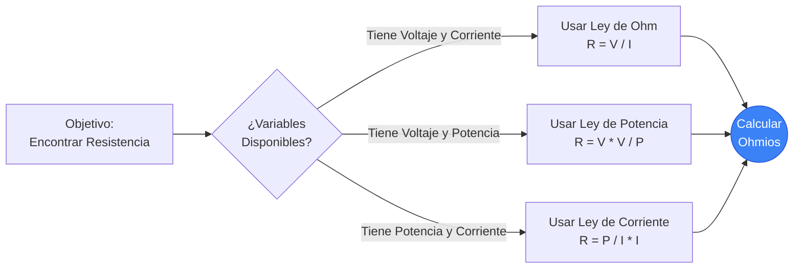
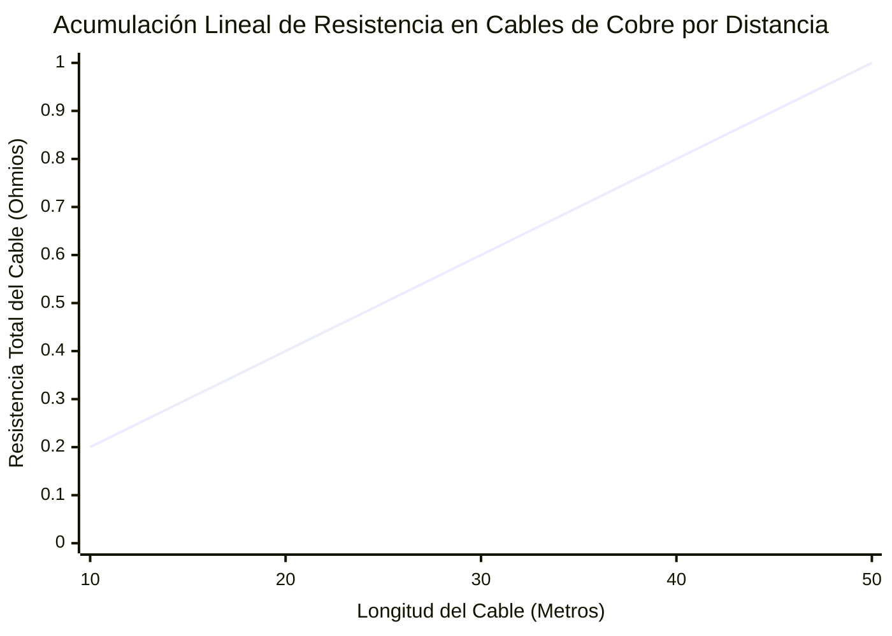
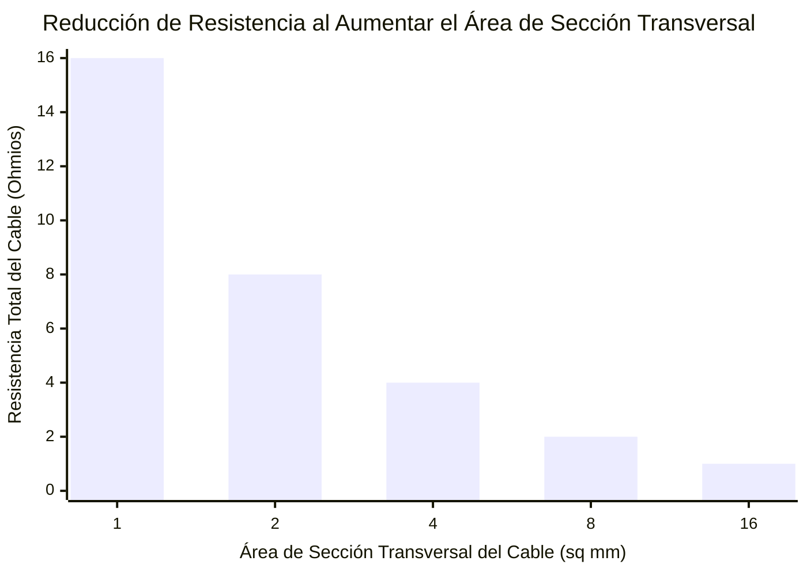
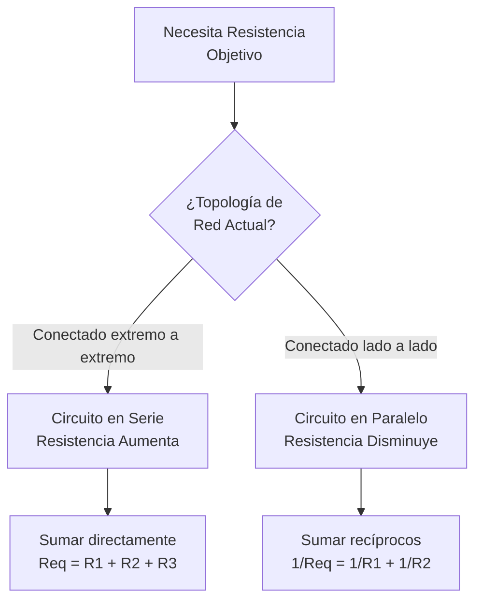

# La Calculadora de Resistencia Definitiva: Dominando los Resistores y la Física de los Conductores

Bienvenido a la **Calculadora de Resistencia** definitiva y guía completa de física. Ya sea que esté decodificando un resistor de 4 bandas quemado en una placa de circuito rota, calculando la resistencia equivalente precisa de una red masiva de carga en paralelo, o analizando la caída de voltaje resistiva de una línea de transmisión de cobre de $500\text{-pies}$, esta suite interactiva proporciona las derivaciones matemáticas exactas que necesita.

La Resistencia Eléctrica es la fricción del mundo de la electrónica. Sin Resistencia, la corriente fluiría infinitamente, vaporizando instantáneamente todo a su paso. La Resistencia nos permite controlar, limitar y aprovechar la electricidad para realizar un trabajo útil, desde encender LEDs hasta generar calor térmico.

En esta guía de SEO exhaustiva de más de 4,000 palabras, deconstruiremos agresivamente la física de la Resistencia Eléctrica, exploraremos los límites matemáticos de la Ley de Ohm ($R = V/I$) y el Calentamiento de Joule ($P = I^2 R$), decodificaremos los estándares internacionales del Código de Colores de Resistores, analizaremos la resistividad intrínseca del material ($\rho$) y desglosaremos cinco escenarios eléctricos detallados representados visualmente mediante diagramas de Mermaid.js interactivos y seguros para el analizador.

---

## 1. ¿Qué es Exactamente la Resistencia Eléctrica? (La Definición Física)

La **Resistencia Eléctrica**, medida científicamente en **Ohmios ($\Omega$)**, es la oposición fundamental al flujo de corriente eléctrica a través de un material conductor. 

Para entender la Resistencia de forma intuitiva, los ingenieros eléctricos confían universalmente en la **Analogía de la Tubería de Agua**:
- Imagine una enorme torre de agua empujando el agua a través de una tubería. Si la tubería es enorme y ancha, el agua fluye fácilmente (Baja Resistencia).
- **La Resistencia es una Tubería Obstruida.** 
- Si pellizca la tubería o la llena de rocas, crea una fricción extrema. El agua lucha por pasar, la presión se acumula detrás de la obstrucción y la obstrucción misma se calienta físicamente por la fricción.
- Esto es exactamente lo que un **Resistor** le hace a los electrones. Ahoga el flujo de corriente, disminuyendo a propósito el voltaje y convirtiendo esa energía eléctrica en calor térmico.

La unidad oficial del SI para la Resistencia es el **Ohmio ($\Omega$)**, nombrado en honor al físico alemán Georg Simon Ohm. En términos termodinámicos estrictos, $1\text{ Ohmio}$ se define como la cantidad exacta de resistencia requerida para limitar un potencial eléctrico de $1\text{ Voltio}$ a un flujo de exactamente $1\text{ Amperio}$. ($1\ \Omega = 1\text{V} / 1\text{A}$).

---

## 2. Derivación de la Resistencia a partir de la Ley de Ohm ($R = V / I$)

Georg Simon Ohm demostró que la Resistencia está bloqueada matemáticamente en una relación tripartita con el Voltaje ($V$) y la Corriente ($I$). 

$$R = \frac{V}{I}$$

Esto significa que puede calcular fácilmente la resistencia real de cualquier componente en el universo simplemente midiendo la caída de voltaje a través de él y la corriente que fluye por él.
- **Si el Voltaje aumenta** pero la Corriente permanece igual, la Resistencia del componente debe haber aumentado mágicamente.
- **Si la Corriente disminuye** pero el Voltaje permanece igual, la Resistencia debe estar aumentando.

Esta relación matemática exacta es la forma en que los multímetros miden los Ohmios. Un ohmímetro inyecta en realidad una diminuta y altamente precisa corriente de $1\text{mA}$ en el resistor, mide la caída de Voltaje resultante y calcula instantáneamente la Resistencia usando la Ley de Ohm.

---

## 3. Derivación de la Resistencia a partir de la Ley de Watt ($R = P / I^2$)

Mientras que la Ley de Ohm dicta el flujo de electrones contra la fricción, la Ley de Watt dicta la salida de potencia termodinámica generada por esa fricción.

$$P = I^2 \cdot R$$

Al aislar algebraicamente la Resistencia ($R$), obtenemos dos fórmulas de ingeniería increíblemente poderosas:
1. **Resistencia derivada de la Potencia y la Corriente:** $R = \frac{P}{I^2}$
2. **Resistencia derivada del Voltaje y la Potencia:** $R = \frac{V^2}{P}$

Estas fórmulas son absolutamente obligatorias para diseñar elementos calefactores. Si un ingeniero mecánico necesita diseñar un calentador ambiental que emita exactamente $1,500\text{W}$ de calor térmico cuando se conecta a un tomacorriente de pared de $120\text{V}$, ¿qué resistencia exacta debe tener la bobina de nicromo?
Usando la fórmula: $R = \frac{120^2}{1500} = \frac{14400}{1500} = 9.6\ \Omega$. 
¡El ingeniero debe cortar exactamente $9.6\ \Omega$ de alambre de nicromo!

---

## 4. Decodificación del Código de Colores de Resistores

Debido a que los resistores estándar de orificio pasante son físicamente demasiado pequeños para imprimir números en ellos, la industria eléctrica adoptó un sistema universal de bandas de colores en la década de 1920 para indicar los valores de resistencia.

### El Sistema de 4 Bandas
El resistor más común utiliza 4 bandas de color pintadas:
- **Banda 1:** El primer dígito significativo.
- **Banda 2:** El segundo dígito significativo.
- **Banda 3:** El Multiplicador decimal (Cuántos ceros añadir).
- **Banda 4:** El margen de Tolerancia (Oro = $5\%$, Plata = $10\%$).

**Ejemplo:**
Si encuentra un resistor pintado **Rojo, Rojo, Naranja, Oro**:
1. Rojo = 2
2. Rojo = 2
3. Naranja = 3 ceros ($1,000$)
4. Oro = $\pm 5\%$
Resultado: $22 \cdot 1,000 = 22,000\ \Omega$ ($22\text{ k}\Omega$) con una tolerancia del $5\%$.

Nuestra calculadora interactiva presenta un visualizador SVG en vivo y en tiempo real que pinta instantáneamente las bandas del resistor a medida que escribe sus valores.

---

## 5. Resistencia Equivalente: Redes en Serie vs Paralelo

Al diseñar circuitos, rara vez se usa un solo resistor. Usted combina múltiples resistores juntos para lograr caídas de voltaje o divisiones de corriente específicas.

### Circuitos en Serie ($R_{eq} = R_1 + R_2 + R_3$)
Cuando los resistores se colocan de extremo a extremo en línea recta, la corriente se ve obligada a pasar a través de todos ellos de manera secuencial. Esto significa que la fricción se suma directamente.
- **Regla:** En Serie, la resistencia total siempre AUMENTA.
- Ejemplo: $100\ \Omega + 100\ \Omega = 200\ \Omega$.

### Circuitos en Paralelo ($1/R_{eq} = 1/R_1 + 1/R_2 + 1/R_3$)
Cuando los resistores se colocan uno al lado del otro, la corriente puede dividirse y tomar múltiples caminos simultáneamente. Debido a que ahora hay múltiples carriles de tráfico abiertos, la fricción general del circuito disminuye.
- **Regla:** En Paralelo, la resistencia total siempre DISMINUYE. Siempre será estrictamente menor que el resistor más pequeño en la red.
- Ejemplo: Dos resistores de $100\ \Omega$ en paralelo crean una resistencia equivalente de $50\ \Omega$.

---

## 6. La Física de la Resistencia y Resistividad de los Cables ($\rho$)

Un cable de cobre es técnicamente solo un resistor muy largo y de muy bajo valor. Para circuitos de alta potencia, la resistencia del propio cable se convierte en un factor de ingeniería crítico.

La resistencia total de un cable está determinada por tres factores físicos:
$$R = \rho \frac{L}{A}$$

1. **Longitud ($L$):** La resistencia es perfectamente lineal con la longitud. Si duplica la longitud de un cable de extensión, duplica su resistencia.
2. **Área de Sección Transversal ($A$):** La resistencia es inversamente proporcional al grosor. Si duplica el grosor de un cable, reduce su resistencia a la mitad. (Es por eso que los cables de puente de alto amperaje son extremadamente gruesos).
3. **Resistividad ($\rho$):** Esta es la "fricción" intrínseca y cuántico-mecánica del metal elemental crudo.

**Valores de Resistividad:**
- **Plata:** $1.59 \times 10^{-8}\ \Omega\cdot\text{m}$ (El mejor conductor absoluto en la Tierra).
- **Cobre:** $1.68 \times 10^{-8}\ \Omega\cdot\text{m}$ (El estándar de la industria, casi tan bueno como la plata pero drásticamente más barato).
- **Oro:** $2.44 \times 10^{-8}\ \Omega\cdot\text{m}$ (Peor que el cobre, pero se usa en conectores porque literalmente nunca se oxida ni se corroe).

---

## 7. Cinco Escenarios de Ingeniería Conceptual con Visualizaciones en 2D

Para dominar completamente las relaciones matemáticas de la Resistencia, exploraremos cinco escenarios físicos distintos, desglosados visualmente utilizando diagramas personalizados de Mermaid.js.

### Ejemplo 1: Las Derivaciones Algebraicas de Resistencia

**El Escenario:**
Un estudiante de ingeniería necesita una visualización rápida de cómo la Resistencia puede extraerse matemáticamente del Voltaje ($V$), la Corriente ($I$) y la Potencia ($P$) a través de diferentes conjuntos de problemas.

**Visualización en 2D:**
Este diagrama de flujo lógico traza los tres caminos matemáticos distintos para calcular los Ohmios dependiendo de las variables conocidas proporcionadas en un examen.

---

### Ejemplo 2: Resistencia del Cable vs Longitud (Lineal)

**El Escenario:**
Un electricista está instalando cable de cobre estándar de 14 AWG a través de un almacén. ¿Cómo se acumula la resistencia total del cable de cobre a medida que aumenta la longitud del tendido?

**Las Matemáticas:**
Dado que $R = \rho \cdot (L/A)$, la Resistencia escala perfectamente linealmente con la Longitud.

**Visualización en 2D:**
Este gráfico traza la línea perfectamente recta de la resistencia que se acumula con la distancia. Si el cable es demasiado largo, la resistencia llegará a ser tan alta que el voltaje caerá por debajo de niveles utilizables.

---

### Ejemplo 3: Resistencia del Cable vs Grosor (Curva Inversa)

**El Escenario:**
Un ingeniero necesita reducir la resistencia de una línea de transmisión de $100\text{-metros}$ para evitar que se derrita. Si aumentan el área de la sección transversal (grosor) del cable, ¿cómo responde la resistencia?

**Las Matemáticas:**
Dado que $R = \rho \cdot (L/A)$, la Resistencia es inversamente proporcional al Área.

**Visualización en 2D:**
Este gráfico de barras demuestra la agresiva curva inversa. Duplicar el grosor del cable reduce violentamente la resistencia a la mitad.

---

### Ejemplo 4: Lógica de Redes en Serie vs Paralelo

**El Escenario:**
Un técnico tiene un contenedor de resistores mixtos y necesita combinarlos para lograr un objetivo de resistencia altamente específico. ¿Deberían conectarse en Serie o en Paralelo?

**Visualización en 2D:**
Este diagrama de flujo de arriba hacia abajo clasifica estrictamente la matemática requerida para calcular la resistencia equivalente basándose en la topología del circuito.

---

### Ejemplo 5: Prueba de Calibración de Termistor de Alta Precisión

**El Escenario:**
Un ingeniero aeroespacial está calibrando un Termistor NTC (Coeficiente de Temperatura Negativo). Un termistor es un resistor especial que disminuye drásticamente su resistencia a medida que se calienta. Deben registrar su resistencia en puntos de ajuste de temperatura extremos.

**Visualización en 2D:**
Este diagrama de Gantt describe el riguroso programa de calibración de la cámara térmica requerido para mapear la curva de resistencia no lineal del termistor.

```mermaid
gantt
    title Programa de Calibración de Termistor NTC Aeroespacial
    dateFormat  HH:mm:ss
    axisFormat  %H:%M:%S
    
    section Criogénico
    Estabilizar Cámara a Neg 40C :done, 00:00:00, 30s
    Registrar Valor Alta Resistencia :active, 00:00:30, 15s
    
    section Ambiente
    Calentar Cámara a 20C :active, 00:00:45, 45s
    Registrar Resistencia Nominal :crit, 00:01:30, 30s
    
    section Alta Temp
    Hornear Cámara a 120C :active, 00:02:00, 45s
    Registrar Valor Baja Resistencia :milestone, 00:02:45, 10s
```

---

## 8. Conclusión y Reto de Ingeniería

Dominar la Resistencia es el paso final obligatorio para completar la Santísima Trinidad de la ingeniería eléctrica (Voltaje, Corriente, Resistencia). Cada cable que instale, cada bobina calefactora que diseñe y cada LED que suelde depende de su capacidad para calcular con precisión los Ohmios utilizando $R = V/I$ y $R = \rho(L/A)$.

Si respeta la Resistencia y selecciona el tamaño de sus resistores con las clasificaciones de vataje correctas, sus circuitos funcionarán perfectamente fríos y estables. Si subestima la Resistencia, sus componentes se sobrecalentarán violentamente, humearán y fallarán.

Para garantizar que ha dominado estos conceptos, inicie nuestro Simulador interactivo e intente resolver estos desafíos finales:
1. **El Bloqueador de LED:** Tiene una batería de $9\text{V}$ y un LED de $2\text{V}$. El LED solo puede sobrevivir a $0.02\text{A}$ de corriente. Calcule la Resistencia exacta ($R = V/I$) requerida para reducir los $7\text{V}$ restantes y limitar la corriente a $0.02\text{A}$.
2. **El Calentador Ambiental:** Un calentador ambiental industrial de $2,000\text{W}$ funciona con $240\text{V}$. Calcule la resistencia exacta de su bobina calefactora interna usando $R = V^2 / P$. 
3. **La División Paralela:** Conecta tres resistores idénticos de $300\ \Omega$ en paralelo. Calcule la resistencia total equivalente de la red.

Confíe en esta calculadora para verificar dos veces sus cálculos, decodificar esas confusas bandas de colores y recuerde siempre: la Resistencia es la fricción que nos permite controlar el poder violento de la electricidad.

