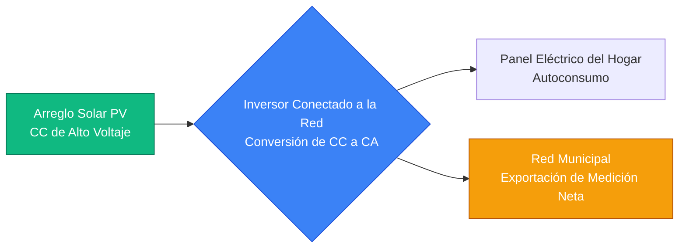
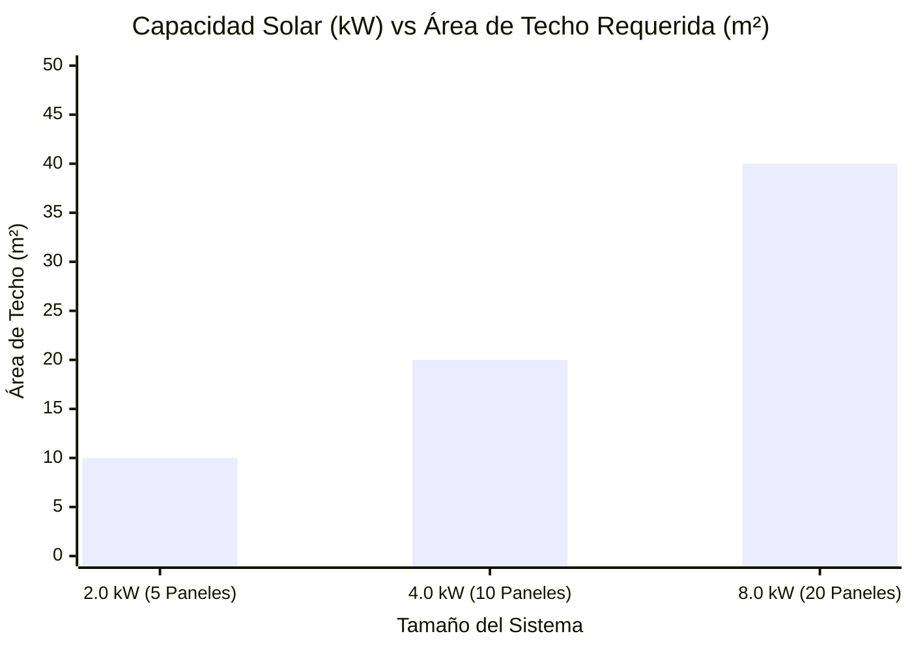
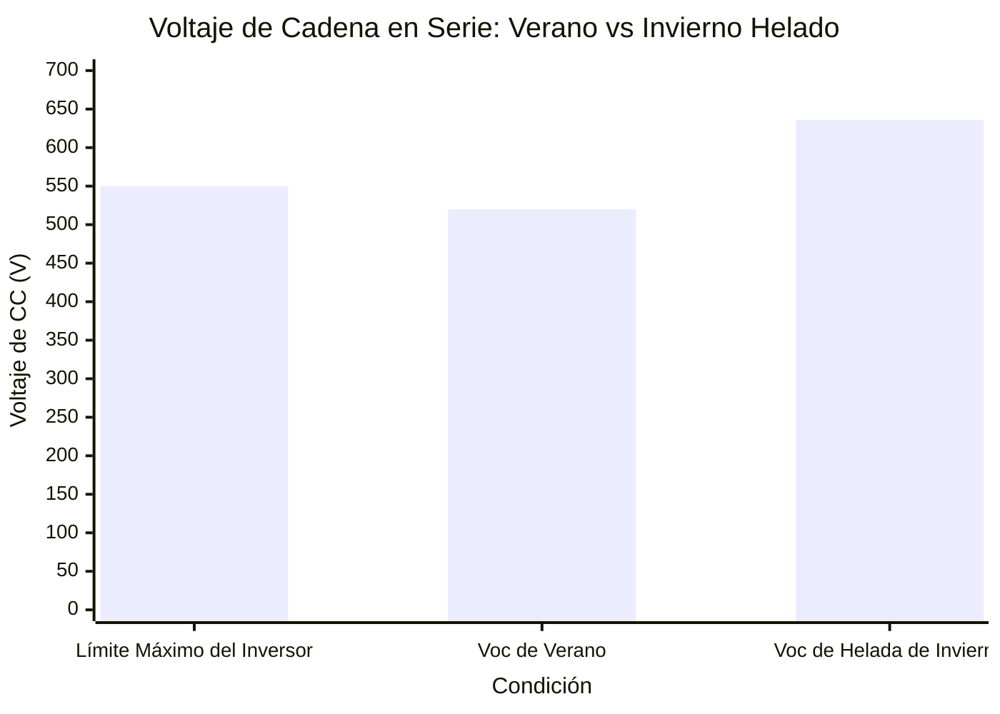
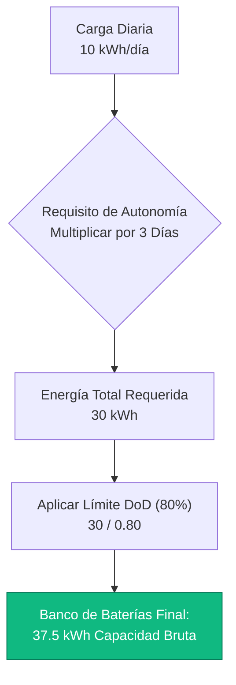
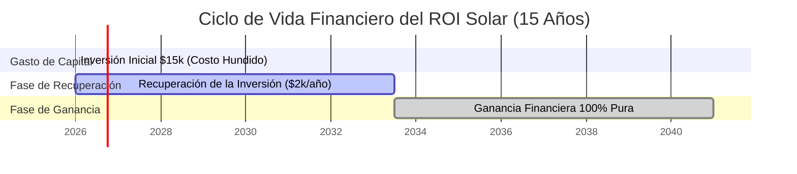

# La Calculadora de Paneles Solares Definitiva: Dimensionamiento, Configuración MPPT y Retorno de Inversión Financiero

Bienvenido a la **Calculadora de Paneles Solares** definitiva y la guía completa de ingeniería fotovoltaica (PV). Ya sea que sea un propietario que intenta eliminar una enorme factura de electricidad mensual, el constructor de una cabaña fuera de la red que diseña una isla de energía independiente, o el administrador de una instalación comercial que calcula el retorno de la inversión (ROI) financiero a 25 años de un arreglo solar de techo de $50,000, dominar la física solar es absolutamente esencial.

Un sistema de energía solar es una matriz increíblemente compleja de variables interdependientes. Si calcula incorrectamente su carga diaria de kWh, comprará muy pocos paneles y continuará pagando a la compañía de servicios públicos. Si no comprende la física del Voltaje de Circuito Abierto (Voc) en un clima helado, conectará demasiados paneles en serie y quemará permanentemente su costoso inversor MPPT. Si ignora el concepto de Horas de Sol Pico, sobreestimará drásticamente su producción de energía.

En esta clase magistral de SEO exhaustiva de más de 4,000 palabras, deconstruiremos las matemáticas fundamentales de la Producción de Energía Solar, expondremos los peligros ocultos de los picos de voltaje dependientes de la temperatura, demostraremos matemáticamente cómo un sistema de Medición Neta conectado a la red acelera la recuperación financiera y decodificaremos las fórmulas exactas requeridas para dimensionar un banco de baterías para una autonomía completa fuera de la red. Para asegurar una comprensión absoluta, hemos incluido cinco diagramas interactivos de Mermaid.js meticulosamente detallados y aptos para el análisis.

---

## 1. La Física del Dimensionamiento Solar (Horas de Sol Pico y Eficiencia)

El concepto absolutamente más crítico en la ingeniería solar es comprender que un panel solar de 400W NO produce 400W de potencia durante todo el día. 

La producción solar se rige por las **Horas de Sol Pico (PSH)**. 
- PSH no significa "cuánto tiempo está el sol en el cielo". (Horas de luz diurna).
- PSH es una métrica de ingeniería que cuantifica la energía solar total recibida en un día, expresada como horas de irradiación solar completa de $1000\text{ W/m}^2$.
- En Arizona, puede tener 6.5 Horas de Sol Pico. En Londres, podría tener 2.5 Horas de Sol Pico en invierno.

**La Ecuación de Producción:**
$$\text{Energía Diaria (kWh)} = \text{Tamaño del Arreglo (kWp)} \times \text{Horas de Sol Pico} \times \text{Eficiencia del Sistema}$$

**Eficiencia del Sistema (Factor de Reducción):**
Los paneles solares nunca operan al $100\%$ de eficiencia en el mundo real. Un sistema estándar conectado a la red opera con aproximadamente un $80\%$ a $85\%$ de eficiencia debido a:
- **Reducción por Temperatura (Pérdida del $10\%$):** Los paneles solares pierden potencia a medida que se calientan bajo el sol.
- **Conversión del Inversor (Pérdida del $4\%$):** La conversión de CC a CA desperdicia energía en forma de calor.
- **Caída de Voltaje del Cableado (Pérdida del $2\%$):** Los cables de cobre resisten naturalmente el flujo de corriente.
- **Polvo y Suciedad (Pérdida del $4\%$):** El polen y la suciedad bloquean la luz solar.

**Cálculo de Ejemplo:**
Si instala un arreglo solar de $5\text{ kWp}$ en una ubicación con $5.0$ Horas de Sol Pico, asumiendo una eficiencia del $80\%$:
$5\text{ kW} \times 5.0\text{ Horas} \times 0.80 = \mathbf{20\text{ kWh/día}}$ de energía eléctrica de CA utilizable.

---

## 2. Desmitificando la Configuración de Cadenas en Serie MPPT (Voc vs Vmp)

El error más común que cometen los instaladores solares de bricolaje (DIY) es hacer estallar su controlador de carga solar por exceder el voltaje de entrada máximo.

Los paneles solares tienen dos clasificaciones de voltaje críticas:
1. **Vmp (Voltaje a Máxima Potencia):** El voltaje de funcionamiento cuando el panel produce plena potencia bajo carga (ej., $40\text{V}$).
2. **Voc (Voltaje de Circuito Abierto):** El voltaje máximo posible que genera el panel cuando no hay carga conectada (ej., $50\text{V}$).

Cuando se cablean los paneles solares en **Serie** (conectando el cable positivo de un panel al cable negativo del siguiente), el **Voltaje se Suma**, mientras que la corriente (Amperios) sigue siendo la misma.
- $10$ paneles en serie con un Voc de $50\text{V}$ = $\mathbf{500\text{V} \text{ de CC}}$ de voltaje total de la cadena.

**El Peligro del Clima Helado:**
El voltaje del panel solar se comporta de manera contraria a la intuición: A medida que disminuye la temperatura física de la celda de silicio, el voltaje AUMENTA. Si su inversor tiene un límite de entrada MPPT máximo de $500\text{V}$, y usted diseña una cadena que produce exactamente $490\text{V}$ en el verano, destruirá su inversor en la primera mañana helada del invierno cuando el silicio frío empuje el Voc hasta $530\text{V}$. 

Los ingenieros exigen estrictamente el uso del **Coeficiente de Temperatura de Voc** (ej., $-0.3\%/^\circ\text{C}$) para calcular el voltaje máximo absoluto del peor de los casos a la temperatura histórica más baja registrada para el sitio de instalación.

---

## 3. Retorno de Inversión Financiero (ROI), Medición Neta y Período de Recuperación

Para los propietarios conectados a la red, la instalación de un arreglo solar es una inversión financiera evaluada por su **Período de Recuperación** y su **Retorno de la Inversión (ROI)**.

**Medición Neta (NEM):**
La Medición Neta es un acuerdo de facturación de servicios públicos en el que su medidor eléctrico gira físicamente hacia atrás cuando sus paneles solares generan más energía de la que consume su hogar. 
- Durante el día, usted genera exceso de energía solar y la exporta a la red, obteniendo un crédito.
- Por la noche, cuando el sol se ha puesto, usted consume energía de la red, agotando sus créditos.
- Si su sistema está dimensionado para una Compensación del $100\%$, su factura de electricidad anual disminuye teóricamente a $0.

**La Fórmula de Recuperación Simple:**
$$\text{Período de Recuperación (Años)} = \frac{\text{Costo del Sistema Instalado Neto}}{\text{Ahorros Anuales de Electricidad}}$$

Si un sistema de $6\text{ kW}$ cuesta $\$15,000$ (después de reembolsos de impuestos) y elimina una factura de electricidad anual de $\$2,000$, el sistema se paga por sí mismo en exactamente $7.5\text{ años}$. Debido a que los paneles solares premium de Nivel 1 tienen garantía por 25 años, los $17.5\text{ años}$ restantes representan ganancias financieras puras, libres de impuestos.

---

## 4. Diseño para Autonomía de Batería Fuera de la Red

Si está construyendo una cabaña fuera de la red, no se puede dar el lujo de usar la red municipal como una batería gigante infinita. Usted debe almacenar físicamente suficiente energía en baterías de ciclo profundo para sobrevivir días nublados y noches oscuras.

**La Fórmula de Autonomía:**
$$\text{Banco de Baterías (kWh)} = \frac{\text{Carga Diaria (kWh)} \times \text{Días de Autonomía}}{\text{Profundidad de Descarga (DoD)} \times \text{Eficiencia del Inversor}}$$

- **Días de Autonomía:** El número de días continuos que el banco de baterías puede mantener la casa funcionando con entrada solar absolutamente nula (generalmente $2$ a $3$ días).
- **Profundidad de Descarga (DoD):** Usted nunca puede descargar una batería al $0\%$. Las baterías de plomo-ácido solo deben descargarse a un $50\%$ de DoD. Las baterías de fosfato de hierro y litio (LiFePO4) se pueden descargar de manera segura hasta el $80\%$ de DoD.

Si su cabaña usa $10\text{ kWh/día}$, y desea $2\text{ días}$ de autonomía usando un banco de baterías de Litio ($80\%$ de DoD) y un inversor con un $90\%$ de eficiencia:
$\text{Capacidad de Batería Requerida} = (10 \times 2) / (0.80 \times 0.90) = \mathbf{27.7\text{ kWh}}$.
Necesitará un enorme banco de baterías de $48\text{V} \ 600\text{Ah}$ para sobrevivir el invierno.

---

## 5. Cinco Escenarios Conceptuales de Ingeniería con Visualizaciones 2D

Para dominar completamente las relaciones físicas que rigen los sistemas fotovoltaicos solares, exploraremos cinco escenarios de ingeniería distintos desglosados visualmente usando diagramas personalizados de Mermaid.js.

### Ejemplo 1: El Flujo de Energía Conectado a la Red

**El Escenario:**
Un propietario necesita comprender el flujo físico de energía desde el sol, a través del inversor, y hacia la red de servicios públicos municipal.

**Visualización 2D:**
Este diagrama de flujo lógico mapea el proceso de conversión de energía de alto nivel, demostrando cómo el inversor híbrido actúa como un controlador de tráfico inteligente que dirige la energía a la casa primero y a la red en segundo lugar.

---

### Ejemplo 2: Tamaño del Arreglo vs Área del Techo

**El Escenario:**
Un arquitecto está asignando espacio en el techo para una instalación solar y necesita saber exactamente cuánta área física se consume a medida que aumenta la capacidad en kilovatios del arreglo.

**Las Matemáticas:**
Un panel solar moderno de $400\text{W}$ mide aproximadamente $2.0$ metros cuadrados. Para generar $4\text{ kW}$, se necesitan $10$ paneles, lo que requiere $20$ metros cuadrados de techo orientado al sur sin sombras.

**Visualización 2D:**
Este gráfico muestra la correlación lineal directa entre la capacidad eléctrica deseada y el espacio físico requerido.

---

### Ejemplo 3: El Peligro de Sobrecarga de Voltaje MPPT

**El Escenario:**
Un instalador aficionado conecta doce paneles solares de $50\text{V}$ (Voc) en serie. El inversor tiene un límite máximo estricto de voltaje de entrada de $550\text{V}$. Durante el verano, el arreglo funciona bien. Durante una helada de invierno a $-10^\circ\text{C}$, el voltaje se dispara e incinera el inversor.

**Las Matemáticas:**
Voltaje de verano: $12 \times 46\text{V} = 552\text{V}$ (Ya peligrosamente cerca).
Voltaje de invierno con un coeficiente de temperatura de $-0.3\%$: $12 \times 53\text{V} = 636\text{V}$ (Falla catastrófica).

**Visualización 2D:**
Este gráfico prueba gráficamente la necesidad de diseñar cadenas solares para la temperatura histórica más fría posible.

---

### Ejemplo 4: Arquitectura de Dimensionamiento de Baterías Fuera de la Red

**El Escenario:**
Un ingeniero solar está calculando la capacidad requerida del banco de baterías para mantener operativa una clínica médica fuera de la red durante 3 días de autonomía a causa de un monzón.

**Visualización 2D:**
Este diagrama de flujo descendente mapea las matemáticas estrictas requeridas para evaluar la carga diaria, multiplicar por los días de autonomía, y dividir por el límite de Profundidad de Descarga para obtener el tamaño final de la batería.

---

### Ejemplo 5: El ROI Financiero y la Línea de Tiempo de Recuperación

**El Escenario:**
Un propietario paga $\$15,000$ en efectivo por un sistema solar que le ahorra $\$2,000$ por año en electricidad. Quieren visualizar el momento exacto en el que el sistema se convierte en pura ganancia a lo largo de un período de 15 años.

**Visualización 2D:**
Este diagrama de Gantt visualiza el ciclo de vida financiero de un arreglo solar, trazando el punto de equilibrio a los 7.5 años y las décadas posteriores de ahorros en servicios públicos libres de impuestos.

---

## 7. Conclusión y Desafío de Ingeniería

Dominar el dimensionamiento de los paneles solares es la base fundamental de toda la ingeniería de energías renovables. Comprender la diferencia entre las Horas de Luz Diurna y las Horas de Sol Pico, respetar la brutal realidad de los picos de voltaje en climas fríos y modelar matemáticamente el ROI financiero garantizará que su sistema solar funcione exactamente como fue diseñado durante los próximos 25 años.

Si ignora estos principios matemáticos, su arreglo producirá mucho menos en invierno, sus cadenas en serie excederán los límites de voltaje del inversor anulando su garantía, y su cabaña fuera de la red se quedará sin energía de la batería a las 8:00 PM cada noche.

Para garantizar que ha dominado estos conceptos críticos, inicie nuestro Simulador interactivo e intente resolver estos desafíos finales:
1. **La Restricción de Área:** Tiene exactamente $30\text{ m}^2$ de espacio en el techo sin sombras. Asumiendo que usa paneles de $400\text{W}$ que miden $2.0\text{ m}^2$ cada uno, ¿cuál es la capacidad máxima absoluta en kWp que físicamente puede instalar?
2. **La Trampa de Voltaje:** Usted está conectando en serie paneles de $40\text{V}$ (Voc) a un controlador de carga con un límite máximo absoluto de $250\text{V}$. Asumiendo un multiplicador de clima frío de $1.15\times$, ¿cuál es el número máximo absoluto de paneles que puede conectar de manera segura en una sola cadena?
3. **El Cálculo de Recuperación:** Su sistema cuesta $\$24,000$. Produce $10,000\text{ kWh/año}$. Su compañía de servicios públicos cobra $\$0.30\text{ por kWh}$. ¿Cuántos años exactamente le tomará al sistema pagarse por sí mismo?

Confíe en esta calculadora para auditar los presupuestos de su instalador, justificar matemáticamente las actualizaciones de almacenamiento de batería y eliminar permanentemente su factura de servicios públicos.
