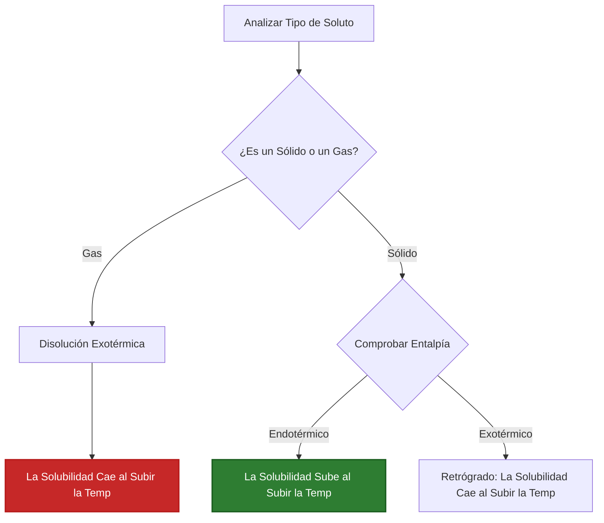

# Guía de Química Analítica y de Laboratorio para el Equilibrio de Solubilidad

En la química analítica, ambiental, física y farmacéutica, la **solubilidad** cuantifica la concentración máxima de equilibrio de un soluto disuelto en un disolvente a una temperatura y presión dadas:

$$\text{Solubilidad de Masa } S_{\text{masa}} \, (\text{g/L}) = S_{\text{molar}} \, (\text{mol/L}) \times M \, (\text{g/mol})$$

$$S_{\text{g/100 mL}} = \frac{S_{\text{g/L}}}{10}$$

$$\text{Masa Máxima Disuelta } m_{\text{máx}} = S_{\text{masa}} \, (\text{g/L}) \times V \, (\text{L})$$

$$\text{Índice de Saturación } R_{\text{sat}} = \frac{C_{\text{actual}}}{S_{\text{máx}}} \quad \begin{cases} R_{\text{sat}} < 1 & \implies \text{Insaturado (Se disuelve completamente)} \\ R_{\text{sat}} = 1 & \implies \text{Saturado (Equilibrio)} \\ R_{\text{sat}} > 1 & \implies \text{Sobresaturado (Favorece la precipitación)} \end{cases}$$

---

## 1. Matriz Clásica de Referencia de Solubilidad de Compuestos Químicos

| Compuesto | Fórmula | Masa Molar | $20^\circ\text{C}$ Solubilidad de Masa | $20^\circ\text{C}$ Solubilidad Molar | Tipo |
| :--- | :--- | :--- | :--- | :--- | :--- |
| **Nitrato de Potasio** | $\text{KNO}_3$ | **101.10 g/mol** | **$316 \text{ g/L}$ ($31.6 \text{ g/100 mL}$)** | **$3.125 \text{ mol/L}$** | Sólido Endotérmico |
| **Cloruro de Sodio** | $\text{NaCl}$ | **58.44 g/mol** | **$360 \text{ g/L}$ ($36.0 \text{ g/100 mL}$)** | **$6.160 \text{ mol/L}$** | Sólido Plano |
| **Cloruro de Plata** | $\text{AgCl}$ | **143.32 g/mol** | **$0.00191 \text{ g/L}$** | **$1.33 \cdot 10^{-5} \text{ mol/L}$** | Poco Soluble ($K_{sp}$) |
| **Fluoruro de Calcio** | $\text{CaF}_2$ | **78.07 g/mol** | **$0.0160 \text{ g/L}$** | **$2.05 \cdot 10^{-4} \text{ mol/L}$** | Poco Soluble ($K_{sp}$) |
| **Sulfato de Cerio(III)**| $\text{Ce}_2(\text{SO}_4)_3$| **568.42 g/mol** | **$101 \text{ g/L}$** | **$0.178 \text{ mol/L}$** | Sólido Retrógrado |
| **Gas Oxígeno** | $\text{O}_2$ | **32.00 g/mol** | **$0.0091 \text{ g/L}$ ($9.1 \text{ mg/L}$)** | **$2.84 \cdot 10^{-4} \text{ mol/L}$** | Gas (Ley de Henry) |

---

## 2. Protocolos Estándar de Cálculo de Solubilidad

```
1. Convertir g/L a mol/L: S_molar = S_masa / MasaMolar
2. Convertir mol/L a g/L: S_masa = S_molar * MasaMolar
3. Convertir g/100 mL a g/L: g/L = (g/100 mL) * 10
4. Masa Máxima Disuelta: m_máx = S_masa * VolumenDisolvente (L)
5. Índice de Saturación: R = ConcActual / SolubilidadMáxima (R > 1 -> Sobresaturado)
```

---

## 3. Descargo de Responsabilidad de Seguridad Educativa y de Laboratorio
*Esta calculadora de solubilidad proporciona cálculos teóricos de equilibrio para aplicaciones educativas, de investigación de laboratorio y de química AP. La solubilidad experimental depende de la temperatura, la presión de los gases, el pH, la fuerza iónica y la composición del disolvente.*

## 4. La Guía Completa de Solubilidad Química

Bienvenido al manual definitivo sobre **Solubilidad Química**. Ya sea que esté intentando disolver una cantidad masiva de Nitrato de Potasio ($\text{KNO}_3$) para una demostración de pirotecnia, calculando el límite tóxico de escorrentía de metales pesados en aguas subterráneas, o intentando mantener oxígeno disuelto en un acuario con calefacción, la solubilidad rige los límites absolutos de la fisicoquímica.

En esta exhaustiva guía de más de 4000 palabras, desglosaremos la termodinámica de por qué las cosas se disuelven. Explicaremos la distinción matemática vital entre Solubilidad de Masa (cuántos gramos caben en un vaso de precipitados) y Solubilidad Molar (la molaridad exacta de una solución saturada). Además, recorreremos cinco rigurosas derivaciones químicas del mundo real, completas con álgebra paso a paso y diagramas visuales de Mermaid altamente compatibles.

### 4.1 ¿Qué es Realmente la Solubilidad?

La **solubilidad** es la cantidad teórica máxima de un soluto específico que puede disolverse en un disolvente dado a una temperatura específica.

Cuando vierte sal de mesa ($\text{NaCl}$) en agua, las moléculas polares del agua atacan de inmediato la red cristalina, arrancando iones $\text{Na}^+$ y $\text{Cl}^-$. A medida que más iones ingresan al agua, comienzan a chocar y recristalizarse inevitablemente.

La solubilidad se alcanza cuando el sistema llega al **Equilibrio Dinámico**. La tasa exacta de disolución coincide perfectamente con la tasa de recristalización. En este punto, la solución se considera **Saturada**. Si agrega más sal, simplemente caerá al fondo del vaso de precipitados; el agua físicamente no puede contener más iones disueltos.

### 4.2 Solubilidad de Masa vs. Solubilidad Molar

Debido a que la química puentea el mundo físico macroscópico (cosas que podemos pesar) y el mundo atómico microscópico (moles de moléculas), usamos dos unidades distintas para la solubilidad:

*   **Solubilidad de Masa ($S_{\text{masa}}$):** Expresada en gramos por litro ($\text{g/L}$) o gramos por 100 mililitros ($\text{g/100 mL}$). Esto es lo que usa al pesar físicamente el polvo en una balanza de laboratorio.
*   **Solubilidad Molar ($S_{\text{molar}}$):** Expresada en moles por litro ($\text{mol/L}$ o Molaridad, M). Esto es lo que usa al hacer estequiometría de reacciones o al calcular constantes de equilibrio termodinámico como $K_{sp}$.

Debe poder convertir entre ellas instantáneamente usando la Masa Molar del compuesto ($M$ en $\text{g/mol}$):

$$ S_{\text{molar}} = \frac{S_{\text{masa}}}{M} \quad \text{y} \quad S_{\text{masa}} = S_{\text{molar}} \times M $$

### 4.3 Los Tres Estados de Saturación

Al comparar la concentración *actual* de una solución con su *solubilidad máxima teórica*, podemos definir tres estados físicos distintos:

1.  **Insaturado ($R_{\text{sat}} < 1$):** La concentración actual está por debajo de la solubilidad máxima. Si agrega más sólido, se disolverá rápidamente.
2.  **Saturado ($R_{\text{sat}} = 1$):** La solución contiene exactamente la cantidad máxima permitida por la termodinámica. Cualquier sólido adicional agregado permanecerá sin disolverse.
3.  **Sobresaturado ($R_{\text{sat}} > 1$):** Un estado altamente inestable y temporal donde la solución contiene *más* soluto del que debería ser físicamente posible. Esto se logra disolviendo una cantidad masiva de soluto a temperaturas de ebullición, luego enfriando el líquido extremadamente lento sin agitarlo. Golpear el vaso o dejar caer un solo "cristal semilla" hará que el exceso de soluto cristalice violenta e instantáneamente fuera de la solución.

### 4.4 La Termodinámica de la Temperatura y la Solubilidad

¿Cómo afecta cambiar la temperatura del agua a la solubilidad? Depende por completo de la entalpía ($\Delta H$) del proceso de disolución.

*   **Sólidos Endotérmicos (La Mayoría de las Sales):** Romper la red cristalina requiere más energía de la que se libera cuando el agua hidrata los iones. Disolverlos absorbe calor. De acuerdo con el Principio de Le Chatelier, aumentar la temperatura bombea calor al sistema, impulsando el equilibrio fuertemente hacia adelante. Así, **la solubilidad aumenta a medida que aumenta la temperatura** (ej. $\text{KNO}_3$ o Azúcar).
*   **Gases Exotérmicos:** Las moléculas de gas ya son libres. Disolver un gas en agua requiere atraparlo en una jaula líquida, lo que libera calor ($\Delta H < 0$). Aumentar la temperatura impulsa el equilibrio en reversa, evaporando el gas del agua. Así, **la solubilidad del gas disminuye a medida que aumenta la temperatura** (razón por la cual los refrescos calientes pierden gas rápidamente).

---

## 5. Guía de Uso: Dominando la Calculadora de Solubilidad

Nuestra calculadora actúa como un motor de conversión y predicción universal.

### 5.1 Modo: Conversiones de Masa/Molar

1.  **Seleccione Modo:** Elija "Convertir Solubilidad de Masa a Molar".
2.  **Parámetros de Entrada:** Ingrese la solubilidad de masa en $\text{g/L}$ y la masa molar del compuesto.
3.  **Lea la Salida:** La herramienta arroja instantáneamente la Solubilidad Molar ($\text{mol/L}$), dejándola lista para cálculos estequiométricos.

### 5.2 Modo: Masa Máxima Disuelta

1.  **Seleccione Modo:** Elija "Masa Máxima Disuelta".
2.  **Parámetros de Entrada:** Ingrese la solubilidad conocida ($\text{g/L}$) y el volumen físico de su contenedor de disolvente (ej. $2.5\text{ Litros}$).
3.  **Ejecute:** La herramienta calcula $m = S \times V$, diciéndole explícitamente exactamente cuántos gramos de polvo puede verter antes de que deje de disolverse.

### 5.3 Modo: Analizador de Saturación

1.  **Seleccione Modo:** Elija "Analizador de Índice de Saturación".
2.  **Parámetros de Entrada:** Ingrese la solubilidad máxima absoluta del compuesto, y la concentración actual de su solución de laboratorio.
3.  **Ejecute:** La herramienta calcula el índice de saturación $R$ y declara explícitamente el estado termodinámico (Insaturado, Saturado, o Sobresaturado).

---

## 6. Cinco Ejemplos Reales de Química Analítica

Cimentemos esta teoría resolviendo cinco escenarios de solubilidad rigurosos y prácticos.

### Ejemplo 1: Conversión de Masa a Solubilidad Molar ($\text{KNO}_3$)

**Escenario:**
El Nitrato de Potasio ($\text{KNO}_3$, masa molar $101.10\text{ g/mol}$) es increíblemente soluble en agua. A $20^\circ\text{C}$, su solubilidad de masa es de unos asombrosos $316\text{ g/L}$. ¿Cuál es la molaridad exacta de una solución saturada de $\text{KNO}_3$?

**Derivación Matemática:**

1.  **Identificar Datos Conocidos:**
    $S_{\text{masa}} = 316\text{ g/L}$
    $M = 101.10\text{ g/mol}$
2.  **Aplicar Fórmula de Conversión:**
    $$ S_{\text{molar}} = \frac{S_{\text{masa}}}{M} $$
3.  **Calcular:**
    $$ S_{\text{molar}} = \frac{316\text{ g/L}}{101.10\text{ g/mol}} $$
    $$ S_{\text{molar}} = 3.125\text{ mol/L} $$

**Conclusión:** Una solución saturada de Nitrato de Potasio a temperatura ambiente tiene una molaridad de $3.125\text{ M}$.

### Ejemplo 2: Determinación de la Masa Máxima Disuelta ($\text{NaCl}$)

**Escenario:**
Está preparando una solución de salmuera en un cubo grande de $5.00\text{ Litros}$. La solubilidad del Cloruro de Sodio ($\text{NaCl}$) es de $360\text{ g/L}$ a temperatura ambiente. ¿Cuál es la masa máxima absoluta de sal que puede disolver en el cubo antes de que se acumule en el fondo?

**Derivación Matemática:**

1.  **Identificar Datos Conocidos:**
    $S_{\text{masa}} = 360\text{ g/L}$
    $V = 5.00\text{ L}$
2.  **Establecer la Ecuación de Masa:**
    $$ m_{\text{máx}} = S_{\text{masa}} \times V $$
3.  **Calcular:**
    $$ m_{\text{máx}} = 360\text{ g/L} \times 5.00\text{ L} $$
    $$ m_{\text{máx}} = 1800\text{ g} $$
    $$ m_{\text{máx}} = 1.80\text{ kg} $$

**Conclusión:** Puede disolver exactamente $1.80\text{ kg}$ de sal en el cubo de $5\text{ Litros}$. Cualquier cantidad superior a esa permanecerá como sólido sin disolver.

### Ejemplo 3: Análisis de la Sobresaturación ($R_{\text{sat}}$)

**Escenario:**
El Acetato de Sodio ($\text{NaCH}_3\text{COO}$) se usa en calentadores de manos reutilizables. Su solubilidad de equilibrio a $20^\circ\text{C}$ es $464\text{ g/L}$. Al hervir agua, usted logra disolver $800\text{ g}$ de ella en $1\text{ Litro}$ de agua, y luego la enfría cuidadosamente a $20^\circ\text{C}$ sin que cristalice. Calcule el Índice de Saturación.

**Derivación Matemática:**

1.  **Identificar Datos Conocidos:**
    $C_{\text{actual}} = 800\text{ g/L}$
    $S_{\text{máx}} = 464\text{ g/L}$
2.  **Aplicar la Fórmula del Índice de Saturación:**
    $$ R_{\text{sat}} = \frac{C_{\text{actual}}}{S_{\text{máx}}} $$
3.  **Calcular:**
    $$ R_{\text{sat}} = \frac{800}{464} = 1.72 $$
4.  **Evaluar:**
    Como $R_{\text{sat}} > 1$, la solución está masivamente **Sobresaturada**.

**Conclusión:** La solución contiene 1.72 veces la cantidad máxima permitida de soluto. En el momento en que active el disco de metal dentro del calentador de manos, $336\text{ g}$ de sólido cristalizarán instantáneamente, liberando una ola masiva de calor exotérmico.

**Visualización: La Termodinámica de la Sobresaturación**

```mermaid
gantt
    title La Línea de Tiempo de Sobresaturación y Cristalización
    dateFormat  HH:mm:ss
    axisFormat  %H:%M
    section Fase de Calentamiento
    Disolver Exceso de Soluto a 100C :00:00:00, 00:20:00
    section Fase de Enfriamiento
    Enfriamiento Cuidadoso a 20C :00:20:00, 00:40:00
    Estado Metastable Sobresaturado :crit, 00:40:00, 01:00:00
    section Evento Desencadenante
    Cristal Semilla Arrojado Adentro :01:00:00, 01:01:00
    Cristalización Exotérmica Violenta :active, 01:01:00, 01:05:00
```


*Esta línea de tiempo ilustra la naturaleza precaria de la sobresaturación. Una solución puede permanecer atrapada en un estado metastable durante horas hasta que un desencadenante físico fuerza una cristalización rápida y violenta.*

### Ejemplo 4: Solubilidad de Gases y Ley de Henry

**Escenario:**
La vida acuática depende del Oxígeno disuelto ($\text{O}_2$). A $20^\circ\text{C}$, la solubilidad de $\text{O}_2$ en agua dulce es de aproximadamente $9.1\text{ mg/L}$. Convierta esta métrica ambiental crítica en Solubilidad Molar. (Masa molar de $\text{O}_2$ = $32.00\text{ g/mol}$).

**Derivación Matemática:**

1.  **Convertir mg a gramos:**
    $9.1\text{ mg/L} = 0.0091\text{ g/L}$
2.  **Aplicar Fórmula de Conversión Molar:**
    $$ S_{\text{molar}} = \frac{0.0091\text{ g/L}}{32.00\text{ g/mol}} $$
3.  **Calcular:**
    $$ S_{\text{molar}} = 0.000284\text{ mol/L} $$
    $$ S_{\text{molar}} = 2.84 \times 10^{-4}\text{ M} $$

**Conclusión:** La molaridad del oxígeno disuelto en un río sano es increíblemente pequeña, solo $2.84 \times 10^{-4}\text{ M}$. Si el río se calienta debido a la contaminación térmica, este equilibrio de solubilidad exotérmica se desplaza hacia atrás, sacando el $\text{O}_2$ del agua y sofocando a los peces.

### Ejemplo 5: Solubilidad Retrógrada (La Excepción)

**Escenario:**
El Sulfato de Cerio(III) ($\text{Ce}_2(\text{SO}_4)_3$) es uno de los raros sólidos que exhibe *solubilidad retrógrada*. Su disolución es altamente exotérmica. A $0^\circ\text{C}$, su solubilidad es de $101\text{ g/L}$. Si calienta el agua a $100^\circ\text{C}$, la solubilidad cae a $25\text{ g/L}$. Si tiene una solución saturada de 1 litro a $0^\circ\text{C}$ y la hierve, ¿qué sucede?

**Derivación Matemática:**

1.  **Determinar la Masa Inicial:**
    A $0^\circ\text{C}$, el vaso de precipitados contiene exactamente $101\text{ g}$ de Sulfato de Cerio disuelto.
2.  **Determinar la Capacidad Final:**
    A $100^\circ\text{C}$, el agua físicamente solo puede contener $25\text{ g}$ de soluto disuelto.
3.  **Calcular la Precipitación:**
    $$ \text{Masa Precipitada} = \text{Masa Inicial} - \text{Capacidad Final} $$
    $$ \text{Masa Precipitada} = 101\text{ g} - 25\text{ g} = 76\text{ g} $$

**Conclusión:** A diferencia del azúcar o la sal, que se disuelven mejor en agua caliente, hervir una solución de Sulfato de Cerio hace que $76\text{ g}$ de roca sólida precipiten repentinamente del líquido transparente.

**Visualización: Predicción de Tendencias de Temperatura**


*Este diagrama de flujo le permite predecir instantáneamente cómo la temperatura afectará el límite de solubilidad de cualquier sustancia química.*

---

## 7. Preguntas Frecuentes Detalladas y Solución de Problemas Avanzados

**P: ¿Puede disolver dos sales diferentes en el mismo vaso de precipitados?**
**R:** Sí, pero pueden interactuar. Si disuelve $\text{NaCl}$ y $\text{KNO}_3$, actúan mayormente de forma independiente hasta cierto punto. Sin embargo, si comparten un ion común (ej. disolviendo $\text{NaCl}$ y $\text{KCl}$), la concentración total de cloruro se dispara, reduciendo severamente la solubilidad de ambas sales en comparación con el agua pura debido al Efecto del Ion Común.

**P: ¿Por qué remover hace que el azúcar se disuelva más rápido, pero no aumenta su solubilidad máxima?**
**R:** Remover es un proceso *cinético*. Mueve rápidamente los iones recién disueltos lejos de la superficie del cristal, exponiendo sólido fresco al agua limpia, lo que acelera la tasa de disolución. Sin embargo, no altera el punto de equilibrio *termodinámico*. Se alcanza exactamente el mismo límite máximo de $g/L$, solo que se llega mucho más rápido.

**P: ¿La presión afecta la solubilidad?**
**R:** Para sólidos y líquidos, la presión prácticamente tiene un efecto nulo. Sin embargo, para los gases (como el $\text{CO}_2$ en una lata de refresco), la presión es la variable dominante. Según la Ley de Henry ($C = kP$), aumentar la presión del gas directamente sobre el líquido incrementa proporcionalmente la solubilidad del gas en el líquido.

Al dominar la conversión matemática entre unidades de masa y molares, comprender el profundo impacto de la temperatura en la disolución endotérmica vs exotérmica, y calcular correctamente los índices de saturación, usted posee el poder teórico para controlar los cambios de fase química. Ya sea aislando cristales farmacéuticos o diseñando ecosistemas acuáticos, ¡confíe en esta Calculadora de Solubilidad para obtener precisión analítica inmediata!
