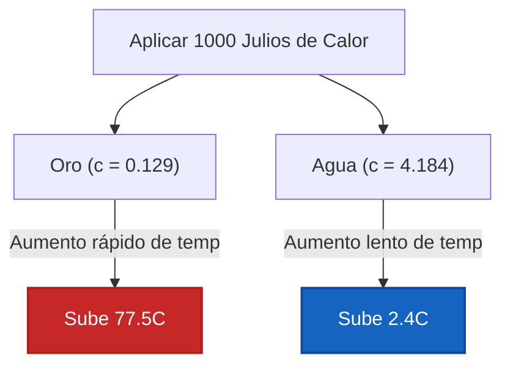

# Guía Completa de Laboratorio e Industrial sobre la Capacidad Calorífica Específica y las Propiedades Térmicas de los Materiales

En fisicoquímica, ciencia de materiales e ingeniería química, la **Capacidad Calorífica Específica ($c$)** define la capacidad de almacenamiento térmico intrínseco de la materia:

$$c = \frac{q}{m \cdot \Delta T} \quad \left(\text{Fórmula de la Capacidad Calorífica Específica}\right)$$

$$q = m \cdot c \cdot \left(T_{\text{final}} - T_{\text{inicial}}\right) \quad \left(\text{Transferencia de Calor Sensible}\right)$$

$$C = m \cdot c \quad \left(\text{Capacidad Calorífica Extensiva}\right)$$

$$\Delta T = \frac{q}{m \cdot c} \quad \left(\text{Aumento de Temperatura}\right)$$

---

## 1. Capacidades Caloríficas Específicas de Referencia de Materiales Comunes

| Material | Fase Física | Capacidad Calorífica Específica $c$ ($\text{J/g}\cdot^\circ\text{C}$) | Capacidad Calorífica Específica $c$ ($\text{J/kg}\cdot\text{K}$) |
| :--- | :--- | :--- | :--- |
| **Agua (Líquida)** | **Líquido** | **4.184** | **4184** |
| **Etanol** | **Líquido** | **2.440** | **2440** |
| **Hielo (Sólido)** | **Sólido** | **2.090** | **2090** |
| **Vapor (Gas)** | **Gas** | **2.010** | **2010** |
| **Aluminio** | **Metal Sólido** | **0.897** | **897** |
| **Vidrio** | **No Metal Sólido** | **0.840** | **840** |
| **Hierro / Acero** | **Metal Sólido** | **0.449** | **449** |
| **Cobre** | **Metal Sólido** | **0.385** | **385** |
| **Plata** | **Metal Sólido** | **0.235** | **235** |
| **Oro** | **Metal Sólido** | **0.129** | **129** |
| **Plomo** | **Metal Sólido** | **0.128** | **128** |

---

## 2. Matriz del Motor de Identificación de Materiales y Resolutor de Variables

```
1. Calcular Calor Específico: c = q / (m * (T_final - T_inicial))
2. Calcular Calor Transferido: q = m * c * ΔT
3. Calcular Masa de la Muestra: m = q / (c * ΔT)
4. Calcular Cambio de Temperatura: ΔT = q / (m * c)
5. Calcular Temperatura Final: T_final = T_inicial + q / (m * c)
6. Calcular Capacidad Calorífica Total: C = m * c
7. Identificación de Material Desconocido: Encontrar min |c_calc - c_ref| en Base de Datos
```

---

*Esta calculadora de calor específico proporciona predicciones de propiedades térmicas teóricas para aplicaciones educativas, de investigación fisicoquímica y de ingeniería de materiales. Las mediciones térmicas reales deben tener en cuenta el calor específico dependiente de la temperatura $c(T)$, las transiciones de fase y las capacidades caloríficas del hardware del calorímetro.*

## 4. La Guía Completa de la Capacidad Calorífica Específica y la Termodinámica de los Materiales

Bienvenido al manual definitivo de ciencia de materiales y fisicoquímica sobre la **Capacidad Calorífica Específica ($c$)**. ¿Por qué la hebilla metálica de un cinturón de seguridad te quema la piel en un caluroso día de verano, mientras que la correa de tela junto a ella se siente completamente bien, a pesar de que ambos han estado sentados bajo exactamente el mismo sol durante horas? La respuesta es la Capacidad Calorífica Específica.

En esta guía exhaustiva de más de 4000 palabras, analizaremos la física microscópica del almacenamiento de energía térmica, analizando específicamente por qué el agua líquida unida por enlaces de hidrógeno posee una capacidad casi anormalmente alta para absorber calor en comparación con metales de transición como el hierro y el oro. Dominaremos la manipulación algebraica de la ecuación de calor sensible ($q = mc\Delta T$) para aislar variables desconocidas, identificar materiales desconocidos en laboratorios forenses y resolver cinco escenarios rigurosos de ingeniería termodinámica del mundo real.

### 4.1 La Física de la Capacidad Calorífica Específica

La **Capacidad Calorífica Específica ($c$)** es una propiedad física *intensiva*. Se define como la cantidad exacta de energía cinética térmica (medida en Julios) requerida para elevar la temperatura de exactamente $1\text{ gramo}$ de un material específico en exactamente $1^\circ\text{C}$ (o $1\text{ Kelvin}$).

*   **Bajo Calor Específico (Metales):** Metales como el Oro ($0.129\text{ J/g}^\circ\text{C}$) y el Cobre ($0.385\text{ J/g}^\circ\text{C}$) tienen capacidades muy bajas. No pueden "retener" mucho calor. Si se les inyecta incluso una pequeña cantidad de calor ($q$), sus átomos vibran enormemente al instante, resultando en un aumento masivo de la temperatura ($\Delta T$). 
*   **Alto Calor Específico (Agua):** El Agua Líquida ($4.184\text{ J/g}^\circ\text{C}$) tiene uno de los calores específicos más altos de la naturaleza. Antes de que las moléculas de agua puedan vibrar más rápido (lo que se registra como un aumento de temperatura), la energía térmica entrante debe primero estirar y tensar la vasta red de **Enlaces de Hidrógeno** intermoleculares que mantienen unido al líquido. Este sumidero masivo de energía permite al agua absorber enormes cantidades de calor con apenas cambios de temperatura, actuando como el regulador climático global de la Tierra.

### 4.2 Intensivo ($c$) vs Extensivo ($C$)

Es fundamental no confundir la Capacidad Calorífica Específica ($c$) con la Capacidad Calorífica Total ($C$):
*   **Intensivo ($c$):** El Calor Específico ($c = \text{J/g}^\circ\text{C}$) depende SOLAMENTE de la identidad del material. Una sola gota de agua y un océano masivo tienen el mismo calor específico: $4.184\text{ J/g}^\circ\text{C}$.
*   **Extensivo ($C$):** La Capacidad Calorífica Total ($C = m \cdot c$) depende de la masa física presente. Un océano masivo tiene una Capacidad Calorífica Total ($C$) inconmensurablemente mayor que una gota de agua.

### 4.3 Identificación de Materiales Desconocidos

Debido a que el Calor Específico ($c$) es una propiedad intensiva única a la estructura molecular de una sustancia, actúa como una huella dactilar térmica. 
Al dejar caer un metal calentado desconocido en un calorímetro, medir el calor transferido ($q$), pesar la masa ($m$) y rastrear la caída de temperatura ($\Delta T$), los científicos forenses pueden aislar $c$:
$$ c = \frac{q}{m\Delta T} $$
Al comparar esta $c$ calculada con una base de datos de referencia, ¡el metal desconocido se puede identificar con alta precisión!

---

## 5. Guía de Uso: Dominando la Calculadora de Calor Específico

Nuestra calculadora actúa como un resolutor algebraico universal de transferencia de calor para laboratorios de fisicoquímica.

### 5.1 Modo: Identificación de Materiales Desconocidos

1.  **Seleccionar Objetivo:** Elija "Calcular Capacidad Calorífica Específica ($c$) e Identificar Material".
2.  **Ingresar Datos de Laboratorio:** Ingrese el calor experimental transferido ($q$), la masa de la muestra desconocida ($m$) y el cambio de temperatura medido ($\Delta T$). 
3.  **Ejecutar:** El motor aísla matemáticamente $c$. Luego escanea la base de datos de referencia termodinámica interna para encontrar el material coincidente más cercano (por ejemplo, emparejando $0.89\text{ J/g}^\circ\text{C}$ con Aluminio) y muestra el porcentaje de error.

### 5.2 Modo: Predicción de la Temperatura Final

1.  **Seleccionar Objetivo:** Elija "Calcular Temperatura Final ($T_f$)".
2.  **Ingresar Parámetros:** Seleccione su material (por ejemplo, Cobre), ingrese su masa, la temperatura inicial y la cantidad de energía térmica ($q$) aplicada por su calentador.
3.  **Ejecutar:** La herramienta calcula exactamente qué tan caliente se volverá el objeto en función de su resistencia térmica a los cambios de temperatura.

---

## 6. Cinco Rigurosas Derivaciones de la Capacidad Calorífica

Dominaremos la ecuación del calor sensible ($q = mc\Delta T$) aislando algebraicamente las cinco variables a lo largo de cinco escenarios de ingeniería del mundo real.

### Ejemplo 1: Resolviendo para el Calor Transferido ($q$)

**Escenario:** 
Un ingeniero está diseñando un sistema de refrigeración para un bloque de motor de Hierro masivo de $50.0\text{ kg}$ ($c_{\text{Fe}} = 0.449\text{ J/g}^\circ\text{C}$). El motor debe enfriarse desde $150.0^\circ\text{C}$ hasta $80.0^\circ\text{C}$. ¿Cuánto calor debe extraer el sistema de refrigeración?

**Derivación Matemática:**

1.  **Convertir Masa a Gramos:**
    $m = 50.0\text{ kg} = 50,000\text{ g}$
2.  **Determinar el Cambio de Temperatura ($\Delta T$):**
    $\Delta T = T_{\text{final}} - T_{\text{inicial}} = 80.0 - 150.0 = -70.0^\circ\text{C}$
3.  **Aplicar la Ecuación del Calor Sensible:**
    $$ q = m \cdot c \cdot \Delta T $$
    $$ q = 50000 \times 0.449 \times (-70.0) $$
4.  **Calcular:**
    $$ q = -1,571,500\text{ Julios} = -1571.5\text{ kJ} $$

**Conclusión:** El motor libera $1571.5\text{ kJ}$ de energía térmica. El sistema de enfriamiento debe estar clasificado para extraer exactamente esta cantidad. (El signo negativo simplemente denota pérdida de calor exotérmica).

### Ejemplo 2: Identificación Forense de Materiales (Aislando $c$)

**Escenario:**
Un laboratorio forense recupera un bloque de metal desconocido de $150.0\text{ g}$. Le aplican exactamente $+3,000\text{ J}$ de calor, y su temperatura se eleva de $25.0^\circ\text{C}$ a $47.3^\circ\text{C}$. Identifique el metal.

**Derivación Matemática:**

1.  **Determinar el Cambio de Temperatura ($\Delta T$):**
    $\Delta T = 47.3 - 25.0 = +22.3^\circ\text{C}$
2.  **Aislar el Calor Específico ($c$):**
    $$ q = m \cdot c \cdot \Delta T \implies c = \frac{q}{m \cdot \Delta T} $$
3.  **Calcular $c$:**
    $$ c = \frac{3000}{150.0 \times 22.3} $$
    $$ c = \frac{3000}{3345} = 0.8968\text{ J/g}^\circ\text{C} $$
4.  **Búsqueda en Base de Datos:**
    Consultando la tabla de referencia, el Aluminio tiene un calor específico de $0.897\text{ J/g}^\circ\text{C}$.

**Conclusión:** Es abrumadoramente probable que el metal desconocido sea Aluminio.

### Ejemplo 3: Predicción de la Temperatura Final ($T_f$)

**Escenario:**
Dejas una taza con $250.0\text{ g}$ de agua líquida ($c = 4.184\text{ J/g}^\circ\text{C}$), inicialmente a $20.0^\circ\text{C}$, dentro de un microondas. El microondas la irradia con $+15,000\text{ J}$ de calor. ¿Cuál es la temperatura final del agua?

**Derivación Matemática:**

1.  **Aislar $\Delta T$:**
    $$ \Delta T = \frac{q}{m \cdot c} $$
2.  **Calcular el Aumento de Temperatura:**
    $$ \Delta T = \frac{15000}{250.0 \times 4.184} = \frac{15000}{1046} = 14.34^\circ\text{C} $$
3.  **Resolver para $T_{\text{final}}$:**
    $$ T_{\text{final}} = T_{\text{inicial}} + \Delta T $$
    $$ T_{\text{final}} = 20.0 + 14.34 = 34.34^\circ\text{C} $$

**Conclusión:** Debido a la masiva resistencia térmica del agua, una gran ráfaga de $15\text{ kJ}$ solo logra elevar la temperatura a unos tibios $34.3^\circ\text{C}$.

**Visualización: Dinámica de Calentamiento de Metales frente al Agua**


*Este diagrama de flujo ilustra el profundo impacto de la capacidad calorífica específica en una muestra de 10 gramos. ¡La misma entrada de calor que hierve el oro apenas calienta el agua!*

### Ejemplo 4: Aislando la Masa Física ($m$)

**Escenario:**
Un joyero quiere fundir un lote de Oro puro ($c = 0.129\text{ J/g}^\circ\text{C}$). Saben que su horno aplicó exactamente $+2,580\text{ J}$ de calor al oro, lo que provocó que se elevara de $25.0^\circ\text{C}$ a $125.0^\circ\text{C}$ antes de fundirse. ¿Cuánto oro había en el lote?

**Derivación Matemática:**

1.  **Determinar el Cambio de Temperatura ($\Delta T$):**
    $\Delta T = 125.0 - 25.0 = 100.0^\circ\text{C}$
2.  **Aislar la Masa ($m$):**
    $$ q = m \cdot c \cdot \Delta T \implies m = \frac{q}{c \cdot \Delta T} $$
3.  **Calcular la Masa:**
    $$ m = \frac{2580}{0.129 \times 100.0} $$
    $$ m = \frac{2580}{12.9} = 200.0\text{ g} $$

**Conclusión:** El joyero estaba trabajando con exactamente $200.0\text{ gramos}$ de oro.

### Ejemplo 5: Calibración de la Capacidad Calorífica Extensiva ($C$)

**Escenario:**
Un ingeniero químico está calibrando un recipiente de reacción grande hecho a medida de acero inoxidable. Bombean $+50,000\text{ J}$ de calor en el recipiente vacío, y su temperatura se eleva exactamente $3.50^\circ\text{C}$. ¿Cuál es la Capacidad Calorífica Total Extensiva ($C$) de todo el recipiente?

**Derivación Matemática:**

1.  **Comprender $C$ Extensiva:**
    Debido a que el ingeniero no conoce la masa física exacta del recipiente de acero, no pueden usar la $c$ intensiva. Deben resolver para la combinada $C = m \cdot c$.
2.  **Modificar la Ecuación del Calor:**
    $$ q = C \cdot \Delta T $$
3.  **Aislar la Capacidad Calorífica Total ($C$):**
    $$ C = \frac{q}{\Delta T} $$
4.  **Calcular:**
    $$ C = \frac{50000\text{ J}}{3.50^\circ\text{C}} = 14285.7\text{ J/}^\circ\text{C} = 14.28\text{ kJ/}^\circ\text{C} $$

**Conclusión:** El enorme recipiente de acero requiere $14.28\text{ kJ}$ de energía para elevar su temperatura ambiente en un solo grado. ¡Esta constante $C_{\text{calorímetro}}$ ahora está calibrada permanentemente para futuras calorimetrías de bomba!

---

## 7. Preguntas Frecuentes Profundas y Solución de Problemas Avanzada

**P: ¿Por qué la fórmula a veces usa Kelvin ($K$) y a veces Celsius ($^\circ\text{C}$)?**
**R:** Debido a que el Calor Específico implica una *diferencia de temperatura* ($\Delta T$), ¡Kelvin y Celsius son matemáticamente idénticos! Un aumento de temperatura de $10^\circ\text{C}$ es exactamente igual a un aumento de temperatura de $10\text{ K}$. (NO convierta el valor de $\Delta T$ sumando 273.15, ¡solo convierta temperaturas absolutas!).

**P: ¿Son los Calores Específicos perfectamente constantes?**
**R:** No. El calor específico ($c$) en realidad fluctúa levemente dependiendo de la temperatura del material. Por ejemplo, el calor específico del agua cambia levemente entre $20^\circ\text{C}$ y $90^\circ\text{C}$. Sin embargo, para la escuela secundaria y la ingeniería general, asumimos que $c$ es una constante estática.

**P: ¿Puede la Capacidad Calorífica Específica ser negativa?**
**R:** Nunca. El calor específico ($c$) es una propiedad física absoluta de la materia (no se puede tener masa negativa, no se puede tener calor específico negativo). Si su matemática arroja una $c$ negativa, significa que intercambió incorrectamente los signos de $q$ y $\Delta T$. Si un objeto pierde calor ($q$ es negativo), su temperatura debe bajar ($\Delta T$ es negativo). Los dos negativos siempre se cancelarán para producir una $c$ positiva.

¡Al dominar la manipulación algebraica de $q = mc\Delta T$, obtiene la capacidad de predecir daños térmicos, diseñar torres de enfriamiento masivas e identificar metales anónimos forensemente. Confíe en esta Calculadora de Calor Específico para aislar variables térmicas instantáneamente!
