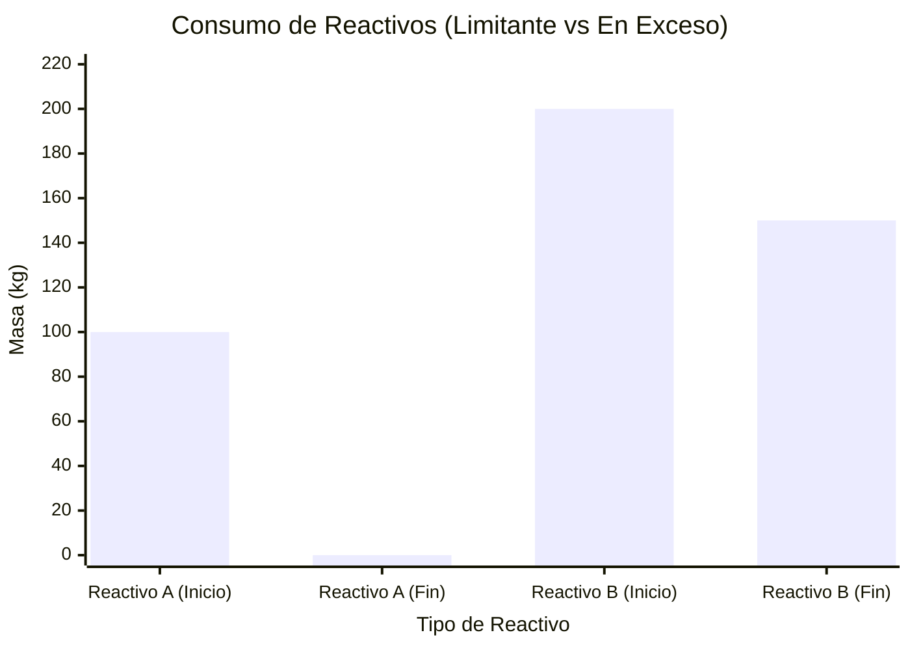
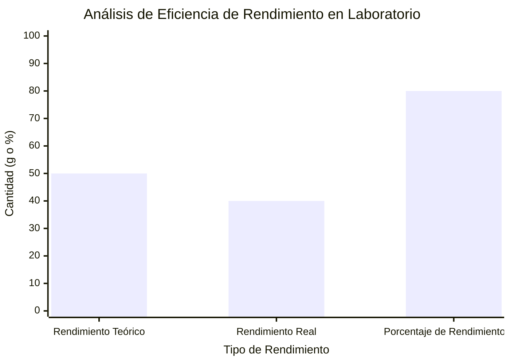
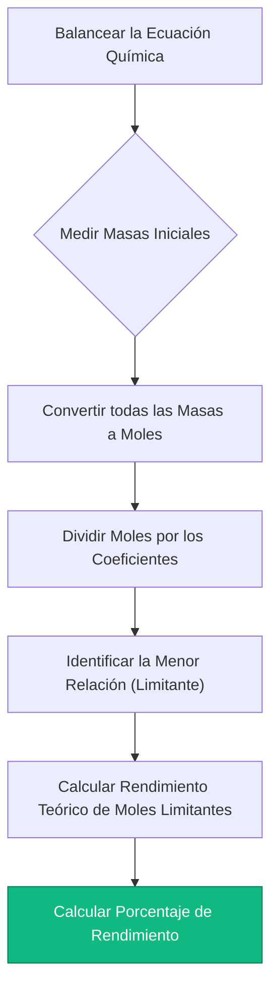
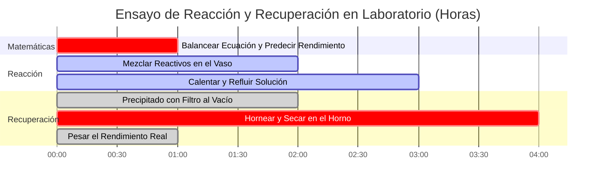

# La Calculadora de Estequiometría Definitiva: Ecuaciones, Rendimientos y Límites de Masa

Bienvenido a la **Calculadora de Estequiometría** definitiva y a la guía integral de análisis de reacciones químicas. Ya seas un estudiante de Química AP aprendiendo el mapa de ruta fundamental de conversión de masa a masa, un ingeniero químico farmacéutico optimizando el porcentaje de rendimiento para síntesis de medicamentos de millones de dólares, o un técnico de laboratorio calculando volúmenes exactos de titulante para la estequiometría de soluciones, dominar las proporciones matemáticas de las reacciones químicas es el núcleo absoluto de la química cuantitativa.

La química no se trata solo de mezclar cantidades aleatorias de polvos y esperar a que ocurra una reacción. Es una disciplina matemática precisa gobernada por las rígidas Leyes de la Termodinámica y la Conservación de la Masa. Cada átomo que entra en un recipiente de reacción debe ser perfectamente contabilizado cuando la reacción termina.

En esta exhaustiva clase magistral de SEO de más de 4000 palabras, deconstruiremos por completo los algoritmos de conversión estequiométrica, probaremos matemáticamente la identificación de los Reactivos Limitantes, decodificaremos la termodinámica de los Rendimientos Teóricos y Reales, y expondremos los errores de cálculo de laboratorio más letales. Para garantizar una comprensión absoluta, hemos incluido cinco diagramas interactivos en Mermaid.js, meticulosamente detallados y seguros para el analizador.

---

## 1. La Física Central: La Ley de Conservación de la Masa

Antes de manipular las relaciones molares o calcular el rendimiento de un producto, debes comprender la física fundamental de una reacción química. 

En 1789, Antoine Lavoisier descubrió la **Ley de Conservación de la Masa**. Demostró que la materia no se crea ni se destruye durante una reacción química. Los átomos simplemente se desconectan unos de otros y se reorganizan en nuevas estructuras moleculares.

**La Regla de Oro de la Estequiometría:**
$$(\text{Masa Total de los Reactivos}) = (\text{Masa Total de los Productos})$$

Si combinas por combustión exactamente $16.04\text{ g}$ de Metano ($\text{CH}_4$) con $64.00\text{ g}$ de Oxígeno ($\text{O}_2$), el recipiente de reacción contiene exactamente $80.04\text{ g}$ de materia. Cuando la combustión finaliza, produciendo Dióxido de Carbono ($\text{CO}_2$) y Agua ($\text{H}_2\text{O}$), la masa total de los gases producidos debe pesar *exactamente* $80.04\text{ g}$. Ni un solo protón o electrón se pierde.

Esta rígida realidad matemática significa que podemos predecir perfectamente cuánta cantidad de producto generará una reacción, siempre que comencemos con una **Ecuación Química Balanceada**.

---

## 2. La Ecuación Balanceada y las Relaciones Molares

Una ecuación química es una receta. Así como una receta dicta que "2 huevos + 1 taza de harina = 4 panqueques", una ecuación química dicta las relaciones moleculares exactas requeridas para una reacción.

Tomemos la síntesis de Amoníaco (El Proceso de Haber):
$$\text{N}_2 + 3\text{H}_2 \rightarrow 2\text{NH}_3$$

Los números delante de las moléculas son los **Coeficientes Estequiométricos**. Estos dictan las **Relaciones Molares**.
- Se necesita exactamente $1\text{ mol}$ de Gas Nitrógeno ($\text{N}_2$) para reaccionar con exactamente $3\text{ moles}$ de Gas Hidrógeno ($\text{H}_2$).
- Esta reacción producirá exactamente $2\text{ moles}$ de Amoníaco ($\text{NH}_3$).

**La Trampa Letal de Laboratorio:** Las relaciones molares se aplican *solamente* a los Moles (el número de partículas), NO a la Masa (gramos). No puedes mezclar $1\text{ gramo}$ de Nitrógeno y $3\text{ gramos}$ de Hidrógeno. Debido a que los diferentes átomos tienen masas sumamente distintas (el Nitrógeno es 14 veces más pesado que el Hidrógeno), siempre debes convertir tus masas físicas de laboratorio a moles antes de aplicar las proporciones de la receta.

---

## 3. El Mapa de Ruta Estequiométrico: Conversiones de Masa a Masa

Debido a que las balanzas de laboratorio miden la masa (gramos), pero las ecuaciones químicas hablan en Moles, cada químico analítico debe ejecutar el Algoritmo de Estequiometría Masa a Masa de 3 pasos.

**El Escenario:** ¿Cuántos gramos de Amoníaco ($\text{NH}_3$) se pueden producir a partir de $28.02\text{ g}$ de Gas Nitrógeno ($\text{N}_2$)?

### Paso 1: Masa a Moles (El Portal de Entrada)
Divide la masa inicial por su Masa Molar.
- $\text{Masa Molar del N}_2 = 28.02\text{ g/mol}$
- $\text{Moles de N}_2 = \frac{28.02\text{ g}}{28.02\text{ g/mol}} = \mathbf{1.00\text{ mol de N}_2}$

### Paso 2: Moles a Moles (La Relación Central)
Multiplica por la Relación Estequiométrica ($\frac{\text{Coeficiente del Objetivo}}{\text{Coeficiente Inicial}}$).
- Relación = $\frac{2\text{ NH}_3}{1\text{ N}_2}$
- $\text{Moles de NH}_3 = 1.00\text{ mol de N}_2 \times \frac{2}{1} = \mathbf{2.00\text{ mol de NH}_3}$

### Paso 3: Moles a Masa (El Portal de Salida)
Multiplica los nuevos moles por la Masa Molar del producto objetivo.
- $\text{Masa Molar del NH}_3 = 17.03\text{ g/mol}$
- $\text{Masa de NH}_3 = 2.00\text{ mol} \times 17.03\text{ g/mol} = \mathbf{34.06\text{ g de NH}_3}$

---

## 4. El Reactivo Limitante y el Rendimiento Teórico

En el mundo real, los químicos rara vez mezclan los reactivos en proporciones estequiométricas exactas y perfectas. Generalmente, un producto químico es barato (como el oxígeno en el aire) y otro producto químico es sumamente costoso (como un catalizador de platino o un precursor de medicamento sintetizado). 

**El Reactivo Limitante:** El químico que se consume por completo primero. En el momento en que se agota, la reacción se detiene instantáneamente. Este dicta la cantidad máxima absoluta de producto que se puede formar (el Rendimiento Teórico).
**El Reactivo en Exceso:** El producto químico que sobra, flotando inútilmente en el vaso de precipitados después de que termina la reacción.

### Cómo Encontrar el Reactivo Limitante
1. Convierte todas las masas iniciales a moles.
2. Divide los moles de cada reactivo por su coeficiente estequiométrico en la ecuación balanceada.
3. El número resultante más pequeño es tu Reactivo Limitante.
4. *Desecha los otros números.* Debes usar los moles originales del Reactivo Limitante para calcular todos los rendimientos de producto.

### Porcentaje de Rendimiento vs Rendimiento Teórico
Tus cálculos indicaron que deberías obtener exactamente $34.06\text{ g}$ de Amoníaco. Este es tu **Rendimiento Teórico**—una realidad perfecta e impecable que asume una eficiencia del $100\%$.

En un laboratorio real, derramas unas cuantas gotas. Parte del gas se escapa del matraz. Algo de producto se queda atascado en el papel de filtro. Pesas tu producto final y solo recuperas $25.00\text{ g}$. Este es tu **Rendimiento Real**.

**Ecuación del Porcentaje de Rendimiento:**
$$\text{Porcentaje de Rendimiento} = \left( \frac{\text{Rendimiento Real}}{\text{Rendimiento Teórico}} \right) \times 100\%$$
$$\text{Porcentaje de Rendimiento} = \left( \frac{25.00}{34.06} \right) \times 100\% = \mathbf{73.4\%}$$

---

## 5. Cinco Escenarios de Ingeniería Conceptual con Visualizaciones en 2D

Para dominar completamente los algoritmos mecánicos que rigen las conversiones de matrices estequiométricas, los límites de rendimiento y los protocolos de laboratorio, exploraremos cinco escenarios distintos de química analítica desglosados visualmente utilizando diagramas personalizados en Mermaid.js.

### Ejemplo 1: El Diagrama de Flujo del Algoritmo Masa-a-Masa

**El Escenario:**
Un estudiante de Química AP está mapeando la estricta e inquebrantable vía matemática de 3 pasos requerida para convertir gramos de un reactivo inicial en gramos de un producto final.

**Visualización en 2D:**
Este diagrama de flujo mapea visualmente el requisito estricto de pasar por el "Portal del Mol". La Masa no puede convertirse directamente en Masa.

---

### Ejemplo 2: Reactivo Limitante vs Reactivo Restante en Exceso

**El Escenario:**
Un ingeniero industrial carga un reactor con $100\text{ kg}$ de Reactivo A y $200\text{ kg}$ de Reactivo B. El Reactivo A se consume completamente (Limitante), dejando cantidades masivas del Reactivo B restantes (En Exceso).

**Visualización en 2D:**
Este gráfico demuestra visualmente cómo el Reactivo Limitante cae al cero absoluto, mientras que el Reactivo en Exceso retiene una masa considerable sin reaccionar.

---

### Ejemplo 3: Análisis de Eficiencia de Rendimiento

**El Escenario:**
Un laboratorio farmacéutico analiza la eficiencia de una costosa síntesis de un medicamento. Calcularon un Rendimiento Teórico de $50.0\text{ g}$, pero solo recuperaron $40.0\text{ g}$.

**Visualización en 2D:**
Este gráfico comparativo mapea visualmente la diferencia entre la perfección matemática (Teórico) y la realidad física (Real), demostrando un Porcentaje de Rendimiento del $80\%$.

---

### Ejemplo 4: El Protocolo de Laboratorio de Estequiometría

**El Escenario:**
Un técnico de laboratorio mapea el rígido procedimiento operativo estándar (SOP) requerido para certificar legalmente un cálculo de rendimiento de reacción para informes industriales.

**Visualización en 2D:**
Este diagrama de flujo de arriba hacia abajo actúa como una estricta receta química, aplicando la secuencia absoluta de acciones matemáticas requeridas para prevenir errores de cálculo.

---

### Ejemplo 5: Línea de Tiempo de Recuperación de Rendimiento de Reacción

**El Escenario:**
Un químico analítico ejecuta un protocolo de síntesis, filtración y secado de múltiples horas para calcular adecuadamente el rendimiento real final de un precipitado sólido.

**Visualización en 2D:**
Este diagrama de Gantt visualiza la secuencia cronológica de un ensayo físico, demostrando que los cálculos de Rendimiento no pueden ocurrir hasta que el producto sea purificado y secado físicamente.

---

## 6. Conclusión y Desafío Estequiométrico

Dominar los algoritmos de la estequiometría es el requisito de ingreso no negociable para entrar a cualquier laboratorio industrial, biológico o químico. Entender la rigidez matemática de la conservación de la masa, el requisito de guiar todos los cálculos a través del "Portal del Mol", y la identificación de Reactivos Limitantes garantizará que tus escalamientos industriales y ensayos de laboratorio funcionen exactamente como se pretende.

Si no logras dominar estos algoritmos, tus plantas químicas desperdiciarán millones de dólares en reactivos sobrantes sin reaccionar, tus dosis farmacéuticas serán letalmente incorrectas y tus datos experimentales estarán completamente corrompidos por el error humano.

Para garantizar que has dominado estos conceptos críticos, inicia nuestro Simulador interactivo e intenta resolver estos desafíos analíticos finales:
1. **El Desafío de la Combustión:** Balancea la ecuación de la combustión del Propano ($\text{C}_3\text{H}_8 + \text{O}_2 \rightarrow \text{CO}_2 + \text{H}_2\text{O}$). ¿Cuántos gramos de Dióxido de Carbono se producen al quemar $44.1\text{ g}$ de Propano?
2. **El Desafío Limitante:** Mezclas $10.0\text{ g}$ de Gas Hidrógeno ($\text{H}_2$) con $10.0\text{ g}$ de Gas Oxígeno ($\text{O}_2$) para hacer agua. ¿Qué gas se agota primero? ¿Cuántos gramos de agua se forman?
3. **El Desafío del Rendimiento:** Calculas un Rendimiento Teórico de $120.0\text{ g}$ de Aspirina. Después de la síntesis, filtración y secado, pesas exactamente $90.0\text{ g}$ de Aspirina pura. ¿Cuál es tu Porcentaje de Rendimiento y qué factores químicos podrían explicar la masa perdida?

Confía en esta calculadora de estequiometría universal para auditar tus protocolos de laboratorio, identificar instantáneamente los reactivos limitantes y dominar de forma permanente la termodinámica del análisis químico cuantitativo.
