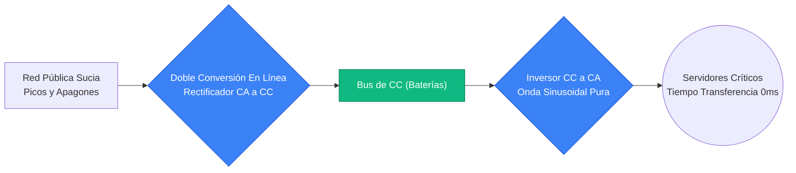
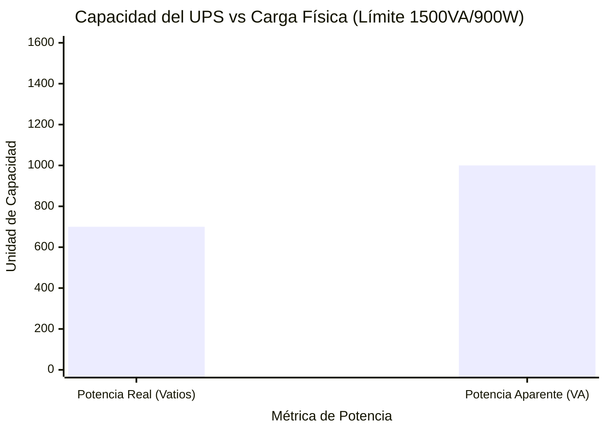
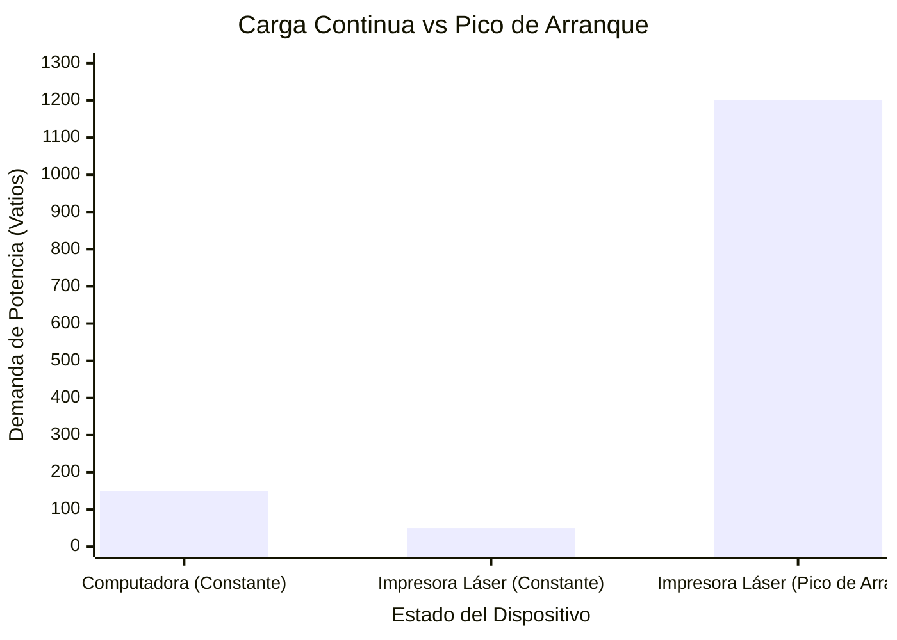
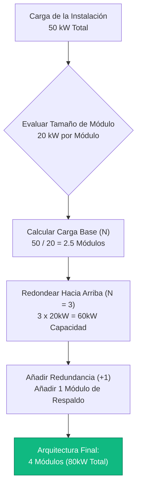
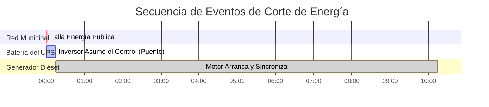

# La Calculadora Definitiva de UPS: Dimensionamiento, Tiempo de Ejecución y Redundancia N+1

Bienvenido a la **Calculadora de UPS** definitiva y a la guía integral de ingeniería de sistemas de alimentación ininterrumpida. Ya sea que usted sea un administrador de TI que dimensiona un rack modular masivo N+1 de $40\text{kVA}$ para un centro de datos, un electricista que evalúa la compatibilidad del generador de reserva, o un jugador de videojuegos tratando de proteger un PC de $1000\text{W}$ de las caídas de voltaje, dominar la física eléctrica de un UPS es absolutamente esencial.

Un UPS (Sistema de Alimentación Ininterrumpida) no es simplemente una batería en una caja de plástico. Es un puente electromecánico altamente complejo diseñado para proteger componentes de silicio sensibles contra picos de voltaje violentos, distorsión armónica y fallas totales en la red eléctrica. Si calcula incorrectamente la diferencia entre **Potencia Real (Vatios)** y **Potencia Aparente (VA)**, sobrecargará permanentemente el inversor. Si malinterpreta la diferencia entre las topologías Fuera de línea y Doble Conversión en Línea, sus servidores se reiniciarán violentamente durante el retraso de transferencia de $4\text{ms}$.

En esta exhaustiva clase magistral de SEO de más de 4,000 palabras, deconstruiremos la trigonometría fundamental de Vatios frente a VA, expondremos los peligros de los picos de arranque de las impresoras láser, decodificaremos las matemáticas de ingeniería requeridas para calcular con precisión los tiempos de ejecución del respaldo de la batería, y demostraremos matemáticamente el concepto de Redundancia N+1 Tolerante a Fallos. Para garantizar que capte por completo estos conceptos de ingeniería, hemos incluido cinco diagramas interactivos de Mermaid.js meticulosamente detallados y a prueba de análisis.

---

## 1. La Física del Dimensionamiento del UPS (Vatios vs VA)

El concepto absolutamente más crítico en la ingeniería de UPS es comprender por qué las cargas eléctricas tienen dos clasificaciones de potencia diferentes: **Vatios (W)** y **Voltiamperios (VA)**.

1. **Potencia Real (Vatios):** Esto representa el trabajo real y verdadero realizado por el equipo. Genera calor y computación.
2. **Potencia Aparente (VA):** Esto representa la demanda eléctrica total colocada en el inversor del UPS. Debido a la física de la corriente alterna (CA) y al **Factor de Potencia (FP)**, las cargas inductivas y capacitivas obligan al UPS a empujar y jalar energía reactiva "fantasma". 

**La Ecuación del Factor de Potencia:**
$$\text{Factor de Potencia (FP)} = \frac{\text{Potencia Real (Vatios)}}{\text{Potencia Aparente (VA)}}$$

Por lo tanto:
$$\text{Potencia Aparente (VA)} = \frac{\text{Vatios}}{\text{Factor de Potencia}}$$

**¿Por Qué Importa Esto?**
Un UPS está clasificado rígidamente TANTO para los Vatios máximos como para los VA máximos. No puede exceder ninguno de los dos límites. 
Por ejemplo, un UPS común de oficina tiene una capacidad nominal de $1500\text{ VA}$ y $900\text{ Vatios}$.
- Si conecta un calentador de espacio de $950\text{W}$ (que tiene un $1.0\text{ FP}$, por lo que equivale a $950\text{ VA}$), no ha excedido el límite de $1500\text{ VA}$, pero SÍ ha excedido el límite de $900\text{ W}$. El UPS emitirá una alarma y se apagará.
- Si enchufa múltiples luces fluorescentes antiguas que consumen $800\text{W}$ con un terrible FP de $0.50$, el VA es $1600\text{ VA}$ ($800 / 0.50$). No ha excedido el límite de $900\text{ W}$, pero SÍ ha excedido el límite de $1500\text{ VA}$. El UPS emitirá una alarma y se apagará.

*Nota de Ingeniería:* Las computadoras modernas con fuentes de alimentación "PFC Activo" tienen un excelente Factor de Potencia de $0.95$ a $0.99$. Esto significa que sus clasificaciones de Vatios y VA son casi idénticas.

---

## 2. Margen de Seguridad y Picos de Arranque

Al calcular la carga total de su equipo, no puede dimensionar el UPS exactamente a su total matemático. Debe diseñar un **Margen de Seguridad**.

1. **La Regla del $20\%$:** El estándar de la industria dicta que un UPS no debe operar a más del $80\%$ de su capacidad máxima nominal. Esto proporciona un margen de seguridad del $20\%$ para acomodar ligeras fluctuaciones de voltaje de la red, el envejecimiento de la batería y la adición de dispositivos USB menores.
2. **Corriente de Irrupción de Arranque:** Los motores eléctricos, compresores de refrigeradores y capacitores de fuentes de poder pesadas extraen ráfagas masivas de corriente en el milisegundo exacto en que se encienden. Un refrigerador de $200\text{W}$ puede consumir $1000\text{W}$ durante medio segundo. Un PC para juegos de $500\text{W}$ puede requerir $650\text{W}$ durante el inicio.
3. **La Trampa de la Impresora Láser:** Nunca conecte una impresora láser a la toma de respaldo con batería de un UPS. Las impresoras láser utilizan elementos calefactores en el fusor que instantáneamente consumen entre $1000\text{W}$ y $1500\text{W}$ cuando comienza la impresión. Esta sobretensión repentina sobrecargará y desconectará instantáneamente el $99\%$ de los UPS de consumo. Conecte las impresoras láser estrictamente a las tomas de "Solo Sobretensión" (Surge Only).

---

## 3. Desmitificando las Topologías de UPS: Fuera de línea vs Línea Interactiva vs En Línea

No todos las unidades de UPS se construyen igual. Los circuitos internos (Topología) dictan cómo el UPS maneja la energía de la red, y qué tan rápido cambia a la batería durante un apagón.

### 1. UPS Fuera de línea / Reserva (Offline / Standby)
Este es el UPS doméstico más barato y común. Bajo condiciones normales, simplemente pasa la potencia bruta de CA de la red pública directamente a su computadora. Cuando falla la red, un relé mecánico hace clic y pasa al inversor de la batería.
- **Tiempo de Transferencia:** $4\text{ a }10\text{ milisegundos}$. (Suficientemente rápido para una PC, pero un interruptor de red sensible podría reiniciarse).
- **Regulación de Voltaje:** Ninguna. Si el voltaje de la pared cae a $105\text{V}$, su computadora recibe $105\text{V}$.

### 2. UPS Interactivo de Línea (Line-Interactive)
El estándar de nivel medio para servidores de oficina y PC para juegos. Incluye un transformador masivo conocido como Regulador de Voltaje Automático (AVR). Si el voltaje de la red pública disminuye (un apagón parcial), el AVR aumenta matemáticamente el voltaje de vuelta a $120\text{V}$ sin agotar la batería interna.
- **Tiempo de Transferencia:** $2\text{ a }4\text{ milisegundos}$.
- **Regulación de Voltaje:** Excelente. Prolonga en gran medida la vida útil de la batería al evitar descargas innecesarias durante caídas de voltaje menores.

### 3. UPS de Doble Conversión En Línea (Online)
El estándar de oro para centros de datos y hospitales. La potencia de CA de la red entrante se convierte agresivamente en potencia de CC. Esta potencia de CC carga la batería Y simultáneamente alimenta al inversor. El inversor convierte la CC nuevamente en potencia de CA matemáticamente perfecta y quirúrgicamente limpia. Su equipo está físicamente aislado de la red eléctrica municipal.
- **Tiempo de Transferencia:** $0\text{ milisegundos}$. (No hay interruptor. El inversor siempre está funcionando).
- **Regulación de Voltaje:** Perfecta.

---

## 4. Cálculo del Tiempo de Ejecución de Respaldo de la Batería

Un UPS está diseñado para proporcionar suficiente tiempo de ejecución para guardar su trabajo de manera segura y apagarse correctamente, o servir como puente hasta que un generador diésel arranque. No está diseñado para mantener una casa encendida por 12 horas.

**La Fórmula del Tiempo de Ejecución:**
$$\text{Tiempo Estimado (Horas)} = \frac{\text{Voltaje de Batería} \times \text{Ah de Batería} \times \text{Profundidad de Descarga (DoD)}}{\frac{\text{Vatios de Carga}}{\text{Eficiencia del Inversor}}}$$

La mayoría de los UPS de consumo contienen pequeñas baterías de Ácido-Plomo Selladas (SLA). 
Por ejemplo, un UPS estándar de $1500\text{ VA}$ generalmente contiene dos baterías de $12\text{V}$ $9\text{Ah}$ conectadas en serie ($24\text{V}$). 
- Energía Total = $24\text{V} \times 9\text{Ah} = 216\text{ Vatios-hora}$.
- Energía Utilizable (teniendo en cuenta la pérdida de Peukert de descarga a alta velocidad y la eficiencia del inversor) es de aproximadamente $130\text{Wh}$.
- Una carga de PC de $400\text{W}$ agotará este UPS en aproximadamente $20\text{ minutos}$.

---

## 5. Redundancia Modular N+1 en Centros de Datos

En la TI empresarial, un solo UPS representa un Punto Único de Fallo (SPOF). Si el inversor interno del UPS falla, todo el rack de servidores pierde potencia.

Para resolver esto, los centros de datos implementan **Arreglos de UPS Modulares Redundantes N+1**.
- **N** representa el número mínimo de módulos UPS independientes requeridos para soportar toda la carga de la instalación.
- **+1** representa un módulo de reserva extra e idéntico.

Si un rack de servidores consume $30\text{ kW}$, y usted utiliza módulos UPS de $10\text{ kW}$:
- Necesita $N = 3$ módulos para soportar la carga de $30\text{ kW}$.
- Agrega $+1$ módulo de redundancia, llevando el total a $4$ módulos.
- Si CUALQUIER módulo individual se incendia, los 3 módulos restantes absorben sin problemas la carga de $30\text{ kW}$ con cero tiempo de inactividad.

---

## 6. Cinco Escenarios de Ingeniería Conceptuales con Visualizaciones 2D

Para dominar completamente las relaciones físicas que rigen los sistemas UPS, exploraremos cinco escenarios de ingeniería distintos desglosados visualmente usando diagramas interactivos personalizados de Mermaid.js.

### Ejemplo 1: Las Topologías Comparadas (Fuera de línea vs En Línea)

**El Escenario:**
Un director de TI necesita justificar la masiva diferencia de costo entre un UPS fuera de línea y un UPS de doble conversión en línea.

**Visualización 2D:**
Este diagrama de flujo lógico traza el flujo físico de energía, demostrando claramente cómo un UPS en línea actúa como un cortafuegos entre la sucia red municipal y los servidores sensibles.

---

### Ejemplo 2: El Cuello de Botella de Capacidad (Vatios vs VA)

**El Escenario:**
Un usuario doméstico no puede entender por qué su UPS de $1500\text{VA} / 900\text{W}$ emite una advertencia de sobrecarga constante cuando conecta $1000\text{VA}$ en aparatos electrónicos de bajo factor de potencia que solo consumen $700\text{W}$.

**Las Matemáticas:**
La carga ($700\text{W}$, $1000\text{VA}$) está dentro del límite de $900\text{W}$, pero peligrosamente cerca del límite de potencia aparente de $1500\text{VA}$ cuando se considera un margen de seguridad del $20\%$ (requisito de $1200\text{VA}$). 

**Visualización 2D:**
Este gráfico traza los límites duales del UPS frente a la carga física, demostrando que la Potencia Aparente (VA) es tan crítica como la Potencia Real (Vatios).

---

### Ejemplo 3: El Peligro de la Impresora Láser

**El Escenario:**
Un recepcionista conecta una impresora láser de $1200\text{W}$ en el enchufe de respaldo de batería de un UPS de oficina de $600\text{W}$. El UPS se dispara al instante y apaga la computadora de escritorio adyacente.

**Las Matemáticas:**
El consumo continuo de una impresora es de $50\text{W}$. La corriente de irrupción del arranque del fusor es de $1200\text{W}$ por 1 segundo. El inversor físicamente no puede suministrar $1200\text{W}$.

**Visualización 2D:**
Este gráfico muestra la brutal realidad de la Corriente de Irrupción, probando por qué los motores mecánicos y los fusores térmicos deben omitir el inversor de la batería del UPS.

---

### Ejemplo 4: Calculando la Redundancia Modular N+1

**El Escenario:**
Un arquitecto de centros de datos debe implementar suficientes módulos UPS de $20\text{ kW}$ para proteger una sala de servidores de $50\text{ kW}$ mientras mantiene una tolerancia a fallos completa contra una falla catastrófica de módulo.

**Visualización 2D:**
Este diagrama de flujo descendente mapea las estrictas matemáticas requeridas para evaluar la cobertura de la carga, definir el requisito de N, y agregar el módulo de respaldo $+1$.

---

### Ejemplo 5: La Línea de Tiempo Puente del Apagón

**El Escenario:**
Un ingeniero debe entender la secuencia exacta de eventos cuando la red municipal falla, el inversor del UPS asume el control, y el generador diésel de reserva intenta sincronizarse.

**Visualización 2D:**
Este diagrama de Gantt describe brutalmente la microscópica línea de tiempo de un apagón eléctrico, demostrando cómo el UPS actúa como el puente crítico que cubre la brecha de 15 segundos antes de que el generador diésel pueda proporcionar energía estable.

---

## 7. Conclusión y Reto de Ingeniería

Dominar el Dimensionamiento de un UPS es la base fundamental de toda la TI empresarial y la ingeniería de instalaciones. Entender la trigonometría de vectores que separa los Vatios y los VA, respetar la brutal realidad de los picos de arranque y diseñar arquitecturas N+1 tolerantes a fallos garantizarán que sus sistemas sobrevivan a cualquier apagón municipal.

Si ignora estos principios matemáticos, sus inversores se sobrecargarán y apagarán durante los picos de impresión, sus servidores se reiniciarán espontáneamente durante los retrasos de transferencia interactiva de línea, y su UPS de un solo módulo se convertirá en el punto único de falla que derrumbará todo su centro de datos.

Para garantizar que haya dominado estos conceptos críticos, inicie nuestro Simulador interactivo e intente resolver estos desafíos finales:
1. **La Trampa de Sobrecarga:** Usted tiene un UPS de $2000\text{VA} / 1200\text{W}$. Conecta diez motores antiguos de CA de $150\text{W}$ con un $0.60\text{ FP}$. ¿Excede la clasificación de Vatios o la clasificación de VA?
2. **El Recuento de Módulos:** Su sala de servidores consume $75\text{ kW}$. Está comprando unidades de UPS modulares de $25\text{ kW}$. ¿Exactamente cuántos módulos totales debe instalar para lograr la redundancia N+1?
3. **El Puente de la Batería:** Una carga de $1000\text{W}$ está conectada a un UPS que contiene cuatro baterías de $12\text{V}$ $7\text{Ah}$ conectadas en serie. Asuma una eficiencia del inversor del $85\%$ y una descarga del $100\%$. Calcule el tiempo de ejecución teórico máximo exacto en minutos antes del apagado total.

Confíe en esta calculadora para auditar sus racks de servidores, justificar matemáticamente las actualizaciones de la infraestructura N+1 y eliminar de forma permanente el tiempo de inactividad.
