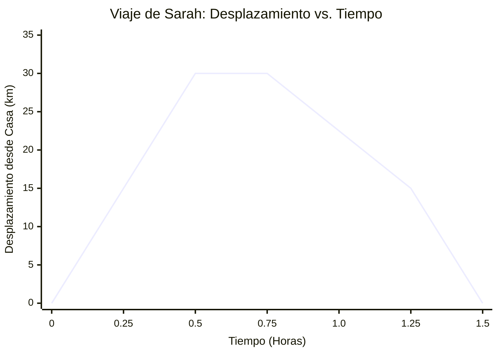
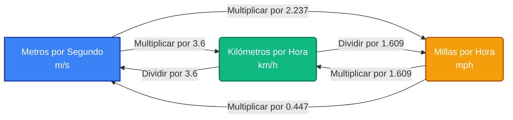
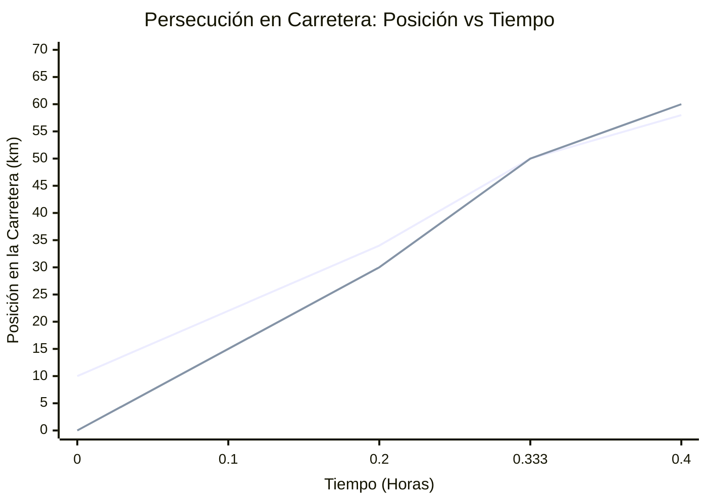
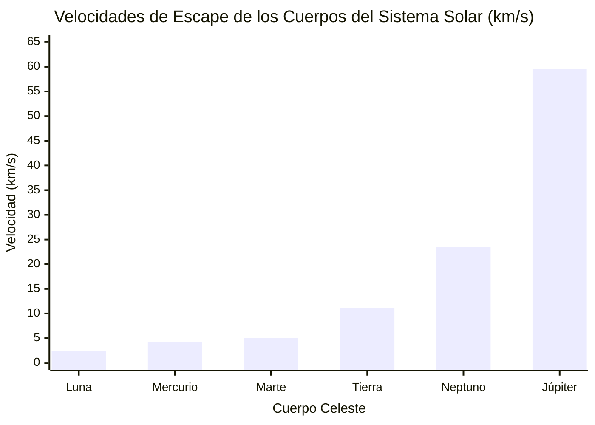

# La Calculadora de Velocidad Definitiva: Dominando la Rapidez, la Distancia, el Tiempo y la Cinemática 1D

Bienvenido a la **Calculadora de Velocidad** y guía más completa, profundamente interactiva y matemáticamente sólida disponible en la actualidad. Ya sea que sea un estudiante de física de secundaria abordando sus primeros problemas de cinemática, un ingeniero calculando tasas de flujo de tránsito, un atleta optimizando el ritmo de su carrera o simplemente una mente curiosa preguntándose cómo medir la rapidez de un objeto que cae, esta guía está hecha para usted.

La velocidad es el latido mismo del movimiento. Dicta cuánto tiempo tarda la luz en llegar a nosotros desde el sol, cómo los aviones navegan por las corrientes atmosféricas y cómo los automóviles frenan de manera segura en las intersecciones. En esta guía definitiva de más de 4,000 palabras, desglosaremos las intrincadas matemáticas de la velocidad, exploraremos las diferencias críticas entre la rapidez y la velocidad, proporcionaremos una guía de uso completa para nuestra calculadora y recorreremos cinco ejemplos conceptuales detallados y visualizados usando diagramas 2D.

---

## 1. El Concepto Humano de Velocidad: Una Explicación Profunda

Desde los albores de la civilización humana, comprender el movimiento ha sido una cuestión de supervivencia, exploración y progreso. Los antiguos cazadores necesitaban estimar la velocidad de sus presas y de sus proyectiles. Los primeros navegantes polinesios calculaban las velocidades medias a través de vastos océanos usando solo las estrellas y el ritmo de las olas. Pero no fue hasta la revolución científica, encabezada por figuras como Galileo Galilei y Sir Isaac Newton, que el concepto de velocidad se formalizó en el estricto marco matemático que usamos hoy.

### Rapidez vs. Velocidad: El Gran Malentendido

En las conversaciones cotidianas, puede escuchar a la gente decir, "La rapidez del auto es de 60 millas por hora", y "La velocidad del auto es de 60 millas por hora", de manera intercambiable. Sin embargo, en el ámbito de la física, cometer este error es similar a confundir el peso con la masa: son conceptos fundamentalmente diferentes.

**La Rapidez es una Cantidad Escalar.**
Una cantidad escalar es una medida que solo tiene magnitud (un número y una unidad). Le dice "qué tan rápido" se mueve un objeto, pero no le dice absolutamente nada sobre hacia dónde va ese objeto. Si tiene los ojos vendados en un automóvil que viaja a 100 km/h, conoce su rapidez, pero no conoce su destino.

**La Velocidad es una Cantidad Vectorial.**
Una cantidad vectorial contiene tanto magnitud *como* dirección. Le dice "qué tan rápido" Y "hacia qué dirección". Si un automóvil viaja a 100 km/h al Norte, esa es su velocidad. Si el automóvil dobla una esquina y comienza a viajar a 100 km/h al Este, su *rapidez* se ha mantenido completamente constante, ¡pero su *velocidad* ha cambiado fundamentalmente porque la dirección cambió!

Esta distinción se vuelve increíblemente importante al calcular promedios. Si corre una vuelta alrededor de una pista circular de 400 metros en 60 segundos y termina exactamente donde comenzó:
- Su **Rapidez Media** es Distancia / Tiempo = 400m / 60s = 6.67 m/s.
- Su **Velocidad Media** es Desplazamiento / Tiempo = 0m / 60s = 0 m/s.

¡Debido a que su posición inicial y final son exactamente las mismas, su desplazamiento neto es cero y, por lo tanto, su velocidad media en todo el viaje es cero!

### Las Ecuaciones Fundamentales del Movimiento

En su nivel más fundamental, la velocidad media ($v$) se calcula dividiendo el cambio de posición (desplazamiento, $\Delta x$) por el cambio de tiempo ($\Delta t$).

**La Ecuación Fundamental:**
$$ v = \frac{\Delta x}{\Delta t} = \frac{x_{final} - x_{inicial}}{t_{final} - t_{inicial}} $$

A partir de esta única y elegante relación algebraica, podemos derivar las otras dos variables centrales. Si sabe qué tan rápido va y cuánto tiempo viaja, puede encontrar la distancia:
**Ecuación de Distancia:**
$$ d = v \times t $$

Si sabe qué tan lejos necesita ir y qué tan rápido viaja, puede encontrar el tiempo que le tomará:
**Ecuación de Tiempo:**
$$ t = \frac{d}{v} $$

### Velocidad Instantánea vs. Media

Si conduce de Nueva York a Boston (aproximadamente 215 millas) en 4 horas, su velocidad media es de aproximadamente 53.75 mph al Noreste. Sin embargo, es muy poco probable que condujera exactamente a 53.75 mph durante cuatro horas seguidas. Se detuvo en los semáforos en rojo (0 mph), aceleró en la carretera (70 mph) y disminuyó la velocidad por el tráfico.

El velocímetro de su automóvil no muestra la velocidad media; muestra la **rapidez instantánea**: su rapidez en esa fracción de segundo exacta e infinitesimalmente pequeña. En cálculo, la velocidad instantánea se define como la derivada de la posición con respecto al tiempo:
$$ v(t) = \lim_{\Delta t \to 0} \frac{\Delta x}{\Delta t} = \frac{dx}{dt} $$

Nuestra calculadora de velocidad está diseñada para manejar velocidades medias y escenarios de velocidad constante, proporcionando una base sólida antes de avanzar a la cinemática acelerada.

---

## 2. Guía de Uso Completa: Cómo Usar la Calculadora de Velocidad

Nuestra Calculadora de Velocidad interactiva está diseñada para ser tan intuitiva como una calculadora de bolsillo pero tan poderosa como un motor de física. Aquí hay una guía paso a paso para maximizar sus características.

### Paso 1: Seleccione Su Variable Objetivo
En la parte superior del panel de control de la calculadora, encontrará opciones para calcular **Velocidad**, **Distancia** o **Tiempo**.
- Si está tratando de averiguar qué tan rápido iba algo, seleccione **Velocidad**. Se le pedirá que ingrese la Distancia y el Tiempo.
- Si desea saber qué tan lejos viajará un tren dada su velocidad y duración del viaje, seleccione **Distancia**.
- Si está planeando un viaje por carretera y necesita saber cuánto tardará en llegar a su destino según su rapidez media, seleccione **Tiempo**.

### Paso 2: Ingrese Sus Valores Conocidos y Seleccione Unidades
La calculadora cuenta con una conversión automática y robusta de unidades. No es necesario convertir sus entradas manualmente antes de usar la herramienta.
- Para **Distancia**, puede ingresar valores en metros (m), kilómetros (km), centímetros (cm), milímetros (mm), millas (mi), yardas (yd), pies (ft), pulgadas (in) o incluso millas náuticas (nmi).
- Para **Tiempo**, puede ingresar valores en segundos (s), milisegundos (ms), minutos (min), horas (h), días o incluso años.
- Para **Velocidad**, la herramienta acepta metros por segundo (m/s), kilómetros por hora (km/h), millas por hora (mph), pies por segundo (ft/s), nudos y Mach (velocidad del sonido).

Simplemente escriba sus números en los campos y use los menús desplegables para seleccionar sus unidades. El motor interno convierte todo instantáneamente a unidades estándar del SI (metros y segundos) para el cálculo, lo que garantiza una precisión perfecta y luego traduce el resultado a su formato de salida deseado.

### Paso 3: Interprete el Panel de Resultados
En el momento en que ingresa su segunda variable, la calculadora actualiza instantáneamente el **Panel de Resultados**. No solo obtendrá un solo número; el panel proporciona:
- El resultado principal calculado en la unidad solicitada.
- Una tabla de valores equivalentes (ej., si calcula 100 km/h, simultáneamente le mostrará 62.1 mph, 27.7 m/s y 91.1 ft/s).
- La energía cinética del objeto (si cambia a la pestaña avanzada e ingresa una masa).

### Paso 4: Explore las Visualizaciones Interactivas
Desplácese hacia abajo hasta la **Línea de Tiempo de Movimiento**. Este gráfico interactivo traza visualmente el desplazamiento del objeto a lo largo del tiempo. Si calculó la velocidad, la pendiente de la línea en este gráfico representa la rapidez. Una pendiente más pronunciada significa una velocidad más alta. Puede usar el control deslizante para desplazarse por la línea de tiempo y ver exactamente dónde estaba el objeto en cualquier segundo dado.

### Paso 5: Utilice la Matriz de Comparación
¿Alguna vez se ha preguntado cómo se compara su rapidez calculada con la de un guepardo, un avión comercial o la velocidad del sonido? La **Matriz de Comparación** en la parte inferior de la herramienta toma su resultado y lo grafica en una escala logarítmica frente a puntos de referencia conocidos, brindándole un contexto del mundo real tangible para los números que está analizando.

---

## 3. Cinco Ejemplos Conceptuales con Visualizaciones 2D

Para dominar verdaderamente la cinemática, uno debe ir más allá de conectar números en ecuaciones y comenzar a visualizar el movimiento. A continuación, presentamos cinco ejemplos conceptuales detallados. Cada ejemplo destaca un aspecto diferente de la velocidad, completo con desgloses matemáticos y visualizaciones 2D de Mermaid.js.

### Ejemplo 1: El Dilema del Viajero Diario (Cálculo de la Rapidez Media vs. Velocidad)

**El Escenario:**
Sarah viaja al trabajo todos los días. Su oficina está a 30 kilómetros al Este de su casa. Por la mañana, hay poco tráfico y tarda 0.5 horas (30 minutos) en llegar a la oficina. Por la noche, el tráfico de la hora pico es terrible y el viaje de regreso le toma 1.0 hora (60 minutos). ¿Cuál es su rapidez media para todo el viaje de ida y vuelta, y cuál es su velocidad media?

**Las Matemáticas:**
- **Viaje de Mañana:** Distancia = 30 km, Tiempo = 0.5 h. Rapidez = 30 / 0.5 = 60 km/h.
- **Viaje de Noche:** Distancia = 30 km, Tiempo = 1.0 h. Rapidez = 30 / 1.0 = 30 km/h.
- **Distancia Total del Viaje de Ida y Vuelta:** 30 km + 30 km = 60 km.
- **Tiempo Total del Viaje de Ida y Vuelta:** 0.5 h + 1.0 h = 1.5 h.
- **Rapidez Media:** Distancia Total / Tiempo Total = 60 km / 1.5 h = 40 km/h.

¡Note que la rapidez media (40 km/h) NO es simplemente el promedio de las dos rapideces ((60+30)/2 = 45 km/h) porque pasó el doble de tiempo viajando a la velocidad más lenta!

- **Velocidad Media:** Desplazamiento Total / Tiempo Total.
Como empezó en casa y terminó en casa, su desplazamiento total es 0 km.
Velocidad Media = 0 km / 1.5 h = 0 km/h.

**Visualización 2D:**
El siguiente gráfico visualiza el desplazamiento de Sarah a lo largo del tiempo. Observe cómo la pendiente es pronunciada al ir al trabajo, y menos pronunciada (y negativa) al regresar a casa.

---

### Ejemplo 2: El Sprint de Atletismo (Conversión de Unidades para Contexto)

**El Escenario:**
En 2009, Usain Bolt estableció el récord mundial en los 100 metros lisos con un tiempo de 9.58 segundos. Si bien 9.58 segundos es increíblemente rápido, los "metros por segundo" no siempre se traducen intuitivamente a la persona promedio que conduce un automóvil medido en mph o km/h. Calculemos su velocidad media y convirtámosla.

**Las Matemáticas:**
- Distancia ($d$) = 100 m
- Tiempo ($t$) = 9.58 s
- **Velocidad en m/s:** $v = d / t = 100 / 9.58 = 10.44 \text{ m/s}$.

Ahora, convirtamos esto a kilómetros por hora (km/h) y millas por hora (mph).
- **A km/h:** Multiplique por 3.6.
  $10.44 \times 3.6 = 37.58 \text{ km/h}$.
- **A mph:** Multiplique por 2.237.
  $10.44 \times 2.237 = 23.35 \text{ mph}$.

Si bien su rapidez *media* fue de 23.35 mph, ¡su *velocidad máxima instantánea* durante el tramo de 60-80 metros en realidad alcanzó unas asombrosas 27.78 mph (44.72 km/h)!

**Visualización 2D:**
El siguiente diagrama de flujo ilustra la canalización de conversión entre unidades de velocidad comunes, actuando como una referencia visual para la lógica de fondo de nuestra calculadora.

---

### Ejemplo 3: La Persecución en Carretera (Velocidad Relativa)

**El Escenario:**
Un ladrón de bancos huye de la escena en una carretera recta viajando hacia el Este a una rapidez constante de 120 km/h. Una patrulla de policía entra a la carretera 10 kilómetros detrás del ladrón y los persigue viajando hacia el Este a una rapidez constante de 150 km/h. ¿Cuánto tiempo le tomará a la policía atrapar al ladrón y qué distancia habrá viajado la policía en ese tiempo?

**Las Matemáticas:**
Este problema requiere el concepto de **Velocidad Relativa**. Debido a que ambos vehículos se mueven en la misma dirección, la tasa a la que la patrulla policial cierra la brecha es la diferencia entre sus rapideces.

- $v_{ladrón} = 120 \text{ km/h}$
- $v_{policía} = 150 \text{ km/h}$
- Distancia de Separación Inicial ($d$) = 10 km
- **Velocidad Relativa ($v_{rel}$):** $150 \text{ km/h} - 120 \text{ km/h} = 30 \text{ km/h}$.

La patrulla de policía está cerrando la distancia a una tasa de 30 km/h.
- **Tiempo para atrapar ($t$):** $t = d / v_{rel} = 10 \text{ km} / 30 \text{ km/h} = 0.333 \text{ horas}$ (que son exactamente 20 minutos).

Para averiguar qué tan lejos viajó la policía en esos 20 minutos:
- $d_{policía} = v_{policía} \times t = 150 \text{ km/h} \times 0.333 \text{ h} = 50 \text{ km}$.

La policía atrapará al ladrón después de viajar 50 kilómetros.

**Visualización 2D:**
Este gráfico muestra la posición absoluta de ambos vehículos a lo largo del tiempo. El punto donde las dos líneas se cruzan es el momento de la captura.

*(Nota: La primera línea representa al ladrón comenzando en 10 km, la segunda línea representa a la policía comenzando en 0 km. Se cruzan exactamente a las 0.333 horas en la marca de 50 km).*

---

### Ejemplo 4: La Tormenta Eléctrica (Cálculo de Distancia Usando Sonido y Luz)

**El Escenario:**
Usted está sentado en su porche y ve un relámpago. Exactamente 4.5 segundos después, escucha el crujido del trueno. Suponiendo que la velocidad del sonido en la temperatura del aire actual es de 343 metros por segundo, ¿a qué distancia cayó el rayo?

**Las Matemáticas:**
La luz viaja a aproximadamente $300,000 \text{ km/s}$. Para distancias en la Tierra, el tiempo que tarda la luz en llegar a sus ojos es tan infinitesimalmente pequeño que podemos considerarlo instantáneo (cero segundos). Por lo tanto, el retraso de 4.5 segundos se debe completamente al tiempo de viaje de las ondas sonoras.

- Velocidad del Sonido ($v$) = 343 m/s
- Retraso de Tiempo ($t$) = 4.5 s
- **Distancia ($d$):** $d = v \times t = 343 \text{ m/s} \times 4.5 \text{ s} = 1543.5 \text{ metros}$.

Convirtiendo a kilómetros, el rayo cayó aproximadamente a **1.54 kilómetros** de distancia (o un poco menos de 1 milla). Esta es la base científica para la antigua regla general de "contar los segundos y dividir por 3 para kilómetros" ($4.5 / 3 = 1.5$).

**Visualización 2D:**
Esta visualización de la línea de tiempo representa el retraso entre el evento (el rayo), la llegada de la luz y la propagación de la onda de sonido.

```mermaid
gantt
    title Línea de Tiempo del Observador del Rayo
    dateFormat  s
    axisFormat %S
    section El Evento
    Rayo                :crit, active, 0, 1s
    section Propagación
    Luz Llega a los Ojos (Instante) : milestone, 0, 0s
    Onda de Sonido Viajando (343 m/s) : active, 0, 4.5s
    section Observación
    Trueno Escuchado    : milestone, 4.5, 0s
```

---

### Ejemplo 5: Exploración Espacial y Velocidad de Escape

**El Escenario:**
Cuando los ingenieros diseñan cohetes para enviar sondas a Marte o al sistema solar exterior, no solo calculan la velocidad estándar; deben alcanzar la **Velocidad de Escape**. Esta es la rapidez exacta requerida para que un objeto supere la atracción gravitacional de un planeta y se aventure en el espacio infinito sin volver a caer. Si una nave espacial despega de la Tierra, ¿qué rapidez debe alcanzar? ¿Y si despegara de la Luna?

**Las Matemáticas:**
La fórmula para la velocidad de escape ($v_e$) se deriva de la conservación de la energía, equiparando la energía cinética con la energía potencial gravitacional:
$$ v_e = \sqrt{\frac{2GM}{R}} $$
Donde $G$ es la constante gravitacional universal, $M$ es la masa del planeta y $R$ es el radio del planeta.

Para la Tierra:
- Masa ($M$) $\approx 5.97 \times 10^{24} \text{ kg}$
- Radio ($R$) $\approx 6.37 \times 10^6 \text{ m}$
- $v_e \approx 11.2 \text{ km/s}$ (unos 40,270 km/h o 25,000 mph).

Para la Luna:
- Masa ($M$) $\approx 7.34 \times 10^{22} \text{ kg}$
- Radio ($R$) $\approx 1.74 \times 10^6 \text{ m}$
- $v_e \approx 2.38 \text{ km/s}$ (unos 8,500 km/h o 5,300 mph).

Debido a que la Luna es significativamente menos masiva, su velocidad de escape es menos de una cuarta parte de la de la Tierra. Es por esto que el Módulo Lunar Apolo pudo despegar de regreso al espacio usando un motor de ascenso relativamente pequeño, mientras que el cohete Saturno V requerido para abandonar la Tierra era un monstruo absoluto que quemaba miles de galones de combustible por segundo.

**Visualización 2D:**
El gráfico de barras a continuación compara las velocidades de escape de varios cuerpos planetarios en el sistema solar, enfatizando la inmensa energía requerida para abandonar cuerpos más grandes como Júpiter.

---

## 4. La Anatomía de la Cinemática: ¿Por Qué Importa la Velocidad?

Comprender la velocidad no es solo un ejercicio académico confinado a las aulas de física; es la métrica fundamental que dicta la logística humana, la seguridad y el avance tecnológico.

### Transporte y Logística
En la cadena de suministro global, el tiempo es dinero. Las empresas de logística utilizan cálculos de velocidad avanzados para optimizar las rutas de envío a través de océanos y carreteras. Si un buque de carga viaja de Shanghai a Los Ángeles (aprox. 10,400 km), un aumento de velocidad de 18 nudos a 22 nudos reduce casi cuatro días el tiempo de tránsito. Sin embargo, la dinámica de fluidos dicta que la resistencia del agua aumenta con el cuadrado de la velocidad, lo que significa que un aumento del 22% en la velocidad podría requerir un aumento del 50% en el consumo de combustible. La ingeniería de transporte es un constante rompecabezas de optimización que equilibra la velocidad frente al costo.

### Seguridad Automotriz y Energía Cinética
¿Por qué las zonas escolares están establecidas estrictamente a 20 mph (32 km/h), mientras que las carreteras permiten 70 mph (112 km/h)? Todo se reduce a la velocidad y la energía cinética. La energía cinética ($E_k$) de un objeto en movimiento se calcula como:
$$ E_k = \frac{1}{2} m v^2 $$
Tenga en cuenta que la velocidad ($v$) está al cuadrado. Si duplica su velocidad en un automóvil, no duplica su energía cinética, la **cuadruplica**.

Si un automóvil que viaja a 20 mph toma 40 pies para frenar hasta detenerse por completo, ese mismo automóvil que viaja a 40 mph tomará aproximadamente 160 pies para detenerse, y un automóvil a 80 mph tomará unos asombrosos 640 pies. Esta relación no lineal es la razón por la que el exceso de velocidad es abrumadoramente peligroso; la energía que deben disipar los frenos (o las zonas de deformación en un choque) se escala exponencialmente con la velocidad.

### Aviación y la Velocidad del Sonido
Los ingenieros de aviación lidian con la velocidad en tres dimensiones, contabilizando la velocidad aerodinámica, la velocidad terrestre y los vientos cruzados. La barrera de velocidad más famosa en la aviación es la **Barrera del Sonido** (Mach 1).
A medida que una aeronave acelera hacia la velocidad del sonido (aprox. 343 m/s a nivel del mar), las moléculas de aire frente a ella no pueden apartarse del camino lo suficientemente rápido. Se comprimen, formando una onda de choque masiva. Cuando Chuck Yeager rompió la barrera del sonido en 1947 en el Bell X-1, fue un triunfo de la ingeniería que superó la resistencia extrema y la turbulencia asociadas con las velocidades transónicas. Hoy en día, nuestra calculadora de velocidad incluye "Mach" como unidad para permitirle comparar las velocidades diarias con este umbral histórico.

### Velocidad Relativista: El Límite de Velocidad Universal
En la mecánica newtoniana clásica, la velocidad simplemente se suma. Si está en un tren que se mueve a 100 km/h y lanza una pelota de béisbol hacia adelante a 50 km/h, un observador en el suelo ve la pelota de béisbol moverse a 150 km/h.

Sin embargo, a medida que nos acercamos a la velocidad de la luz ($c = 299,792,458 \text{ m/s}$), esta adición clásica se rompe. Según la Teoría de la Relatividad Especial de Albert Einstein, la velocidad de la luz es absoluta. Si se encuentra en una nave espacial que viaja al 99% de la velocidad de la luz y enciende una linterna que apunta hacia adelante, la luz no viaja al 199% de la velocidad de la luz. Viaja exactamente a la velocidad de la luz. Para compensar esto, el tiempo mismo se dilata (se ralentiza) y la longitud se contrae para el observador en movimiento. Si bien nuestra calculadora se apega a la cinemática clásica, es asombroso saber que la velocidad deforma fundamentalmente el tejido del espaciotiempo.

---

## 5. Profundización en Preguntas Frecuentes (FAQ)

Hemos recopilado las preguntas más comunes sobre la velocidad, la rapidez y sus aplicaciones. Esta sección amplía las breves definiciones proporcionadas en el área de referencia rápida de la calculadora.

**P: ¿Puede tener una rapidez negativa?**
**R:** No. La rapidez es una cantidad escalar, lo que significa que es una magnitud absoluta. No puede viajar a -10 mph. Sin embargo, **sí puede** tener una *velocidad* negativa. Debido a que la velocidad es un vector, un signo negativo simplemente indica la dirección relativa a un sistema de coordenadas elegido. Si define "Norte" como positivo, entonces viajar hacia el "Sur" a 10 mph se expresaría matemáticamente como una velocidad de -10 mph.

**P: ¿Qué es la velocidad terminal y por qué un objeto que cae deja de acelerar?**
**R:** Si deja caer un centavo desde un rascacielos en un vacío perfecto, se acelerará sin fin a 9.81 m/s² hasta golpear el suelo. Sin embargo, en la Tierra, la atmósfera empuja hacia atrás. A medida que un objeto cae más rápido, la resistencia del aire (arrastre) que empuja hacia arriba contra él aumenta. Eventualmente, la fuerza ascendente de arrastre iguala perfectamente a la fuerza descendente de la gravedad. La fuerza neta se vuelve cero, lo que significa que la aceleración se vuelve cero. El objeto deja de acelerar y cae a una velocidad máxima y constante conocida como velocidad terminal. Para un paracaidista humano que cae de panza, esto es alrededor de 120 mph (193 km/h). Para un objeto compacto y pesado como una bola de boliche, la velocidad terminal es mucho mayor.

**P: Si la Tierra gira y orbita el sol, ¿por qué no sentimos la velocidad?**
**R:** Los humanos no podemos sentir la velocidad; solo podemos sentir la *aceleración* (cambios en la velocidad). Cuando está sentado en un avión comercial que navega suavemente a 500 mph, puede servir un vaso de agua fácilmente porque su cuerpo y el avión se mueven a una velocidad constante. Solo siente el empujón contra su asiento cuando el avión acelera por la pista. Del mismo modo, la Tierra rota a unas 1,000 mph en el ecuador y orbita el sol a unas asombrosas 67,000 mph. No sentimos esta velocidad cósmica porque es una velocidad casi constante, y nos movemos junto con ella.

**P: ¿Cómo miden las pistolas de radar policiales la velocidad de un automóvil?**
**R:** Las pistolas de radar policiales utilizan el **Efecto Doppler**. El arma dispara una señal de radio de microondas a una frecuencia específica hacia un automóvil en movimiento. La señal rebota en el automóvil y regresa al arma. Si el automóvil se mueve hacia el arma, las ondas de retorno se comprimiden (frecuencia más alta). Si el automóvil se aleja, las ondas se estiran (frecuencia más baja). La computadora interna de la pistola de radar calcula la diferencia exacta en frecuencia para determinar instantáneamente la velocidad del vehículo.

**P: ¿Por qué los astrónomos usan "años luz" en lugar de kilómetros?**
**R:** Un año luz es en realidad una medida de *distancia*, no de tiempo. Se define por la velocidad: específicamente, la distancia que la luz (que viaja a 299,792 km/s) cubre en un año terrestre. Un año luz equivale aproximadamente a 9.46 billones de kilómetros. El universo es tan inimaginablemente vasto que medir la distancia a otras estrellas en kilómetros daría como resultado números demasiado grandes para ser prácticos. La estrella más cercana a nuestro sistema solar, Próxima Centauri, está a 4.24 años luz de distancia. Cuando la observamos a través de un telescopio, estamos viendo la luz que partió de ella hace 4.24 años; estamos literalmente mirando hacia atrás en el tiempo, todo gracias a la velocidad finita de la luz.

---

## 6. Utilizando la Calculadora de Velocidad para la Educación

Para educadores y estudiantes, esta calculadora sirve como un entorno de pruebas interactivo. Aquí hay algunos ejercicios para intentar:
1. **La Liebre y la Tortuga:** Ingrese una velocidad muy lenta (como 0.05 m/s para una tortuga) y calcule cuánto tiempo tarda en viajar 1 kilómetro. Luego calcule el tiempo para una liebre (15 m/s).
2. **Geografía Global:** La circunferencia de la Tierra es de aproximadamente 40,075 km. Use la calculadora para determinar cuánto tiempo tomaría conducir alrededor del ecuador a unos 100 km/h constantes (suponiendo que existiera un puente mágico).
3. **Sonido vs. Luz:** Establezca la distancia en 5,000 metros. Calcule el tiempo que tarda la luz en viajar esa distancia (v = 300,000,000 m/s), y luego calcule el tiempo para el sonido (v = 343 m/s). Esta marcada diferencia ilustra vívidamente el retraso del relámpago/trueno.

Al dominar las relaciones entre distancia, tiempo y rapidez, obtiene un conjunto de herramientas fundamental para descifrar el mundo físico. Ya sea que esté apuntando a aprobar un examen de física o simplemente tratando de predecir su tiempo estimado de llegada en un viaje por carretera, la velocidad es la clave que desbloquea la mecánica de nuestro universo en movimiento. Utilice esta calculadora con frecuencia, experimente con las conversiones y observe las líneas de tiempo visuales para construir una comprensión intuitiva y duradera de la cinemática.
