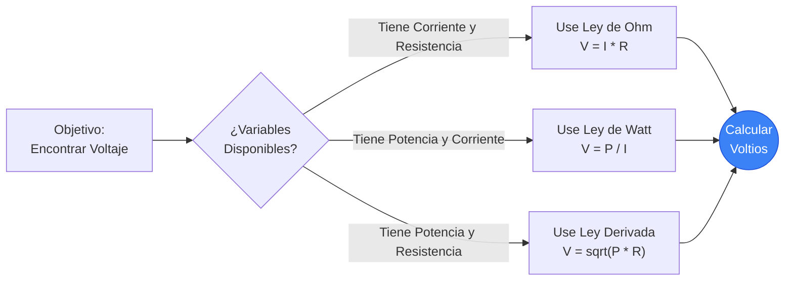
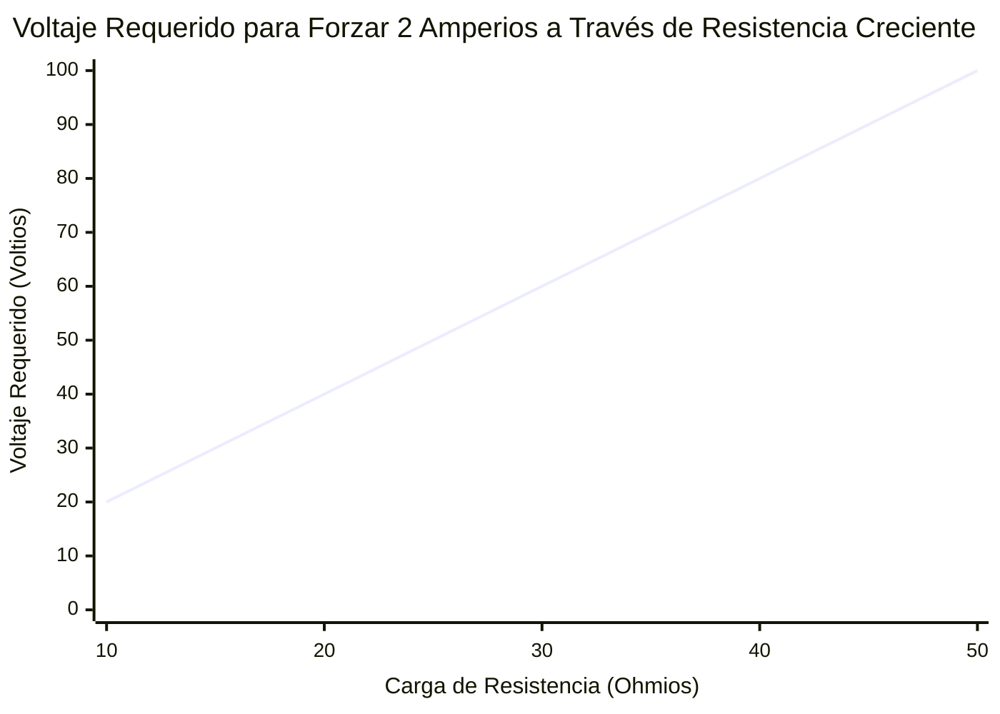
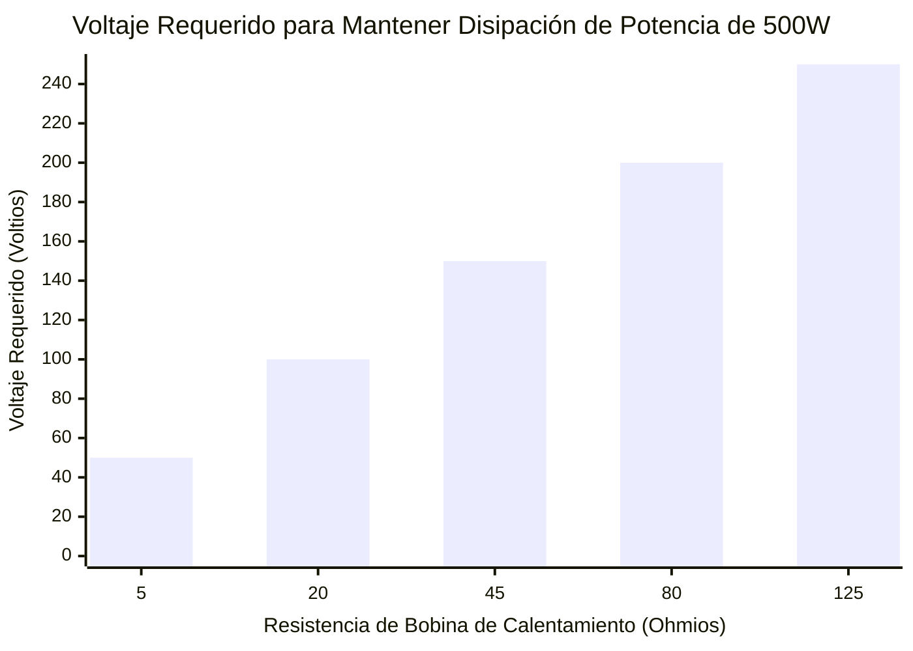
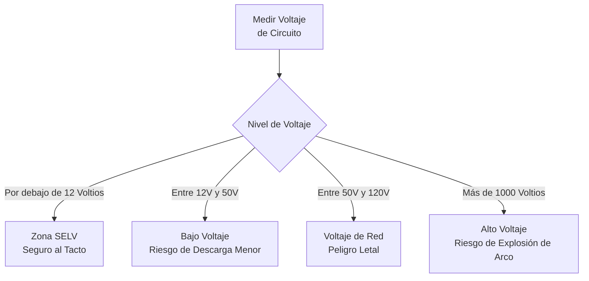

# La Calculadora de Voltaje Definitiva: Dominando el Potencial Eléctrico y la Presión del Circuito

Bienvenido a la **Calculadora de Voltaje** definitiva y la guía de física más completa. Ya sea que sea un ingeniero de sistemas integrados que intenta reducir una fuente industrial ruidosa de $24\text{V}$ para un microcontrolador sensible de $5\text{V}$, un maestro electricista que verifica la caída de la red residencial de $120\text{V}$, o un aficionado que verifica el estado de carga de una batería LiPo, este conjunto interactivo proporciona las derivaciones matemáticas exactas que requiere.

El voltaje es la fuerza impulsora fundamental de todos los componentes electrónicos. Sin voltaje, los electrones no se mueven, la corriente no fluye y la energía nunca se transfiere.

En esta exhaustiva guía SEO de más de 4.000 palabras, deconstruiremos agresivamente la física de la Diferencia de Potencial Eléctrico, exploraremos los límites matemáticos de la Ley de Ohm ($V = IR$) y la Ley de Watt ($V = P/I$), decodificaremos las normas internacionales de seguridad para el Alto Voltaje (HV) y analizaremos cinco escenarios eléctricos detallados representados visualmente mediante diagramas interactivos de Mermaid.js seguros para el analizador.

---

## 1. ¿Qué es Exactamente el Voltaje? (La Definición de la Física)

El **Voltaje**, científicamente denominado *Diferencia de Potencial Eléctrico* o *Fuerza Electromotriz (FEM)*, es la "presión" fundamental que empuja la carga eléctrica a través de un bucle conductor.

Para entender intuitivamente el voltaje, los ingenieros eléctricos se basan universalmente en la **Analogía de la Tubería de Agua**:
- Imagine una torre de agua masiva. La altura física de la torre de agua dicta la presión gravitacional del agua en la parte inferior.
- **El voltaje es la presión del agua.**
- Si tiene una línea de transmisión masiva de $500.000\text{V}$, tiene una cantidad asombrosa de "presión" eléctrica que intenta violentamente empujar a los electrones a través de cualquier camino disponible hacia tierra.
- Si tiene una pequeña batería AA de $1,5\text{V}$, tiene una presión muy baja, solo capaz de empujar un goteo de electrones a través de un pequeño LED.

La unidad oficial del SI para el Voltaje es el **Voltio ($\text{V}$)**, nombrado en honor al pionero físico italiano Alessandro Volta. En términos termodinámicos estrictos, $1\text{ Voltio}$ se define como la cantidad de potencial eléctrico que exige exactamente $1\text{ Julio}$ de trabajo para mover exactamente $1\text{ Coulomb}$ de carga eléctrica. ($1\text{V} = 1\text{J} / 1\text{C}$).

---

## 2. Derivación del Voltaje de la Ley de Ohm ($V = I \cdot R$)

Georg Simon Ohm demostró que el Voltaje está matemáticamente encerrado en una relación a tres bandas con la Corriente ($I$) y la Resistencia ($R$).

$$V = I \cdot R$$

Esto significa que puede calcular fácilmente la caída de voltaje en cualquier componente si conoce la corriente que fluye a través de él y su resistencia inherente.
- **Si la resistencia aumenta** pero la corriente sigue siendo la misma, la caída de voltaje en ese componente debe haber aumentado.
- **Si la corriente aumenta** pero la resistencia sigue siendo la misma, la caída de voltaje debe aumentar proporcionalmente.

Esta relación matemática exacta es cómo funcionan los "Divisores de Voltaje". Al colocar dos resistencias en serie, puede "dejar caer" intencionalmente una cantidad específica de voltaje en la primera resistencia, dejando un voltaje perfectamente menor, reducido, disponible para el resto de su circuito.

---

## 3. Derivación del Voltaje de la Ley de Watt ($V = P / I$)

Mientras que la Ley de Ohm dicta el flujo de electrones, la Ley de Watt dicta la salida de potencia termodinámica.

$$P = V \cdot I$$

Al aislar algebraicamente el Voltaje ($V$), obtenemos dos fórmulas de ingeniería increíblemente poderosas:
1. **Voltaje derivado de Potencia y Corriente:** $V = \frac{P}{I}$
2. **Voltaje derivado de Potencia y Resistencia:** $V = \sqrt{P \cdot R}$

Estas fórmulas son críticas para calcular el voltaje de funcionamiento de los aparatos cuando solo se conoce su potencia en vatios. Por ejemplo, si sabe que un calentador industrial masivo disipa $4.600\text{ Vatios}$ de calor, y su bobina de calentamiento interno tiene exactamente $50\ \Omega$ de resistencia, puede calcular instantáneamente que requiere una red industrial de $480\text{V}$ para funcionar: $V = \sqrt{4600 \cdot 50} = \sqrt{230000} \approx 480\text{V}$.

---

## 4. Entendiendo el Voltaje CA vs CC

El voltaje se manifiesta en dos formatos completamente distintos dependiendo de la fuente de generación de energía:

### Corriente Continua (CC)
En los sistemas de CC (baterías, paneles solares, cargadores USB), el voltaje es constante. Actúa como una bomba de agua empujando de manera constante en una sola dirección. Una batería de coche de $12\text{V}$ empujará continuamente $12\text{V}$ en una línea perfectamente plana hasta que la química de la batería se agote físicamente.

### Corriente Alterna (CA)
En los sistemas de CA (enchufes de pared, torres de red, alternadores), el voltaje es altamente dinámico. Actúa como un pistón, empujando y tirando. El voltaje sube continuamente a un pico positivo, cae a cero y luego se invierte a un pico negativo, generalmente de $50$ a $60$ veces por segundo ($50\text{Hz}$ / $60\text{Hz}$).
Debido a que el voltaje de CA cambia constantemente, los ingenieros utilizan **RMS (Raíz Cuadrada Media)** para describirlo. Cuando conecta una lámpara en un enchufe estándar de EE. UU. de "$120\text{V}$", $120\text{V}$ es solo el promedio RMS. ¡La onda de voltaje de CA real se dispara constantemente hasta un pico violento de casi $170\text{V}$!

---

## 5. Los Niveles Internacionales de Seguridad de Voltaje

El voltaje es lo que descompone la resistencia eléctrica natural de la piel humana. Cuanto mayor sea el voltaje, más fácil será para una corriente letal perforar su epidermis y detener su corazón. Es por esto que los organismos reguladores internacionales categorizan estrictamente los niveles de voltaje:

1. **SELV (Voltaje Extra Bajo de Seguridad - Menos de $12\text{V}$):** Este voltaje carece de la presión para penetrar la piel humana. Puede tocar físicamente los terminales de una batería de $9\text{V}$ o un cable USB de $5\text{V}$ con cero riesgo de descarga.
2. **Bajo Voltaje ($50\text{V}$ a $1.000\text{V}$):** Esto cubre sus enchufes de pared residenciales estándar de $120\text{V}$ y $230\text{V}$. Absolutamente tiene suficiente presión para penetrar la piel y suministrar corrientes letales. El aislamiento de goma pesado es obligatorio a nivel federal.
3. **Alto Voltaje ($1.000\text{V}$ a $35.000\text{V}$):** Utilizado en líneas de distribución de vecindarios. Este voltaje es tan alto que en realidad puede hacer un "arco" o saltar a través del aire. Ni siquiera tiene que tocar el cable; si se acerca a unos centímetros, el voltaje ionizará el aire y lo golpeará como un rayo.
4. **Extra Alto Voltaje (Más de $35.000\text{V}$):** Utilizado en torres masivas de transmisión de campo traviesa (a menudo $500.000\text{V}$). La distancia del arco es aterradora, requiriendo aisladores masivos de vidrio y alturas de torre extremas para evitar que el voltaje simplemente salte directo a la tierra.

---

## 6. Guía de Uso Completa: Maximizando la Calculadora

Nuestra Calculadora de Voltaje interactiva funciona como un multímetro digital avanzado, lo que le permite pivotar sin problemas entre las derivadas de la Ley de Ohm y la Ley de Watt.

### Paso 1: Seleccione Sus Variables Conocidas
Use las pestañas de navegación superiores para seleccionar qué variables posee actualmente:
- **Corriente y Resistencia Dadas ($V = I \cdot R$):** Perfecto para el diseño de placas de circuito estándar.
- **Potencia y Corriente Dadas ($V = P / I$):** Perfecto para dimensionar fuentes de alimentación.
- **Potencia y Resistencia Dadas ($V = \sqrt{P \cdot R}$):** Ideal para el análisis de elementos calefactores.

### Paso 2: Utilice los Ajustes Preestablecidos de Baterías y Sistemas
Si está diseñando un circuito alrededor de una fuente de alimentación estándar del mundo real, simplemente haga clic en uno de nuestros 13 preajustes. Seleccionar la **Batería de Coche de $12\text{V}$** o el **Cargador USB-C PD de $20\text{V}$** precargará instantáneamente los parámetros de voltaje exactos y mapeará automáticamente las curvas de salida dinámicas para su referencia.

### Paso 3: Supervise el Voltímetro Digital Animado
A medida que ajuste las entradas, observe cómo la pantalla del multímetro digital LCD responde dinámicamente. El medidor de aguja integrado está fuertemente codificado por colores basándose en los Niveles de Seguridad Internacionales. Si su voltaje calculado supera los $50\text{V}$, el medidor hará la transición hacia las zonas de peligro Naranja/Rojo, advirtiéndole visualmente que el circuito requiere un estricto cumplimiento de seguridad OSHA y un fuerte aislamiento de los cables.

---

## 7. Cinco Escenarios de Ingeniería Conceptual con Visualizaciones 2D

Para dominar completamente las relaciones matemáticas del voltaje, exploraremos cinco escenarios de física distintos, desglosados visualmente utilizando diagramas personalizados de Mermaid.js.

### Ejemplo 1: Las Derivaciones Algebraicas de Voltaje

**El Escenario:**
Un estudiante de ingeniería necesita una visualización rápida de cómo se puede extraer matemáticamente el voltaje de la corriente ($I$), la resistencia ($R$) y la potencia ($P$) en diferentes conjuntos de problemas.

**Visualización 2D:**
Este diagrama de flujo lógico traza los tres caminos matemáticos distintos para calcular el voltaje dependiendo de las variables conocidas proporcionadas en un examen.

---

### Ejemplo 2: Voltaje Lineal vs Resistencia (Corriente Constante)

**El Escenario:**
Usted tiene un controlador de LED de corriente constante que fuerza exactamente $2\text{A}$ de corriente a través de un circuito, independientemente de la carga. Si cambia diferentes resistencias, ¿cuánta presión de voltaje debe generar la fuente de alimentación para mantener ese flujo de $2\text{A}$?

**Las Matemáticas:**
Dado que $I = 2$, $V = 2 \cdot R$.
- A $10\ \Omega$: $V = 2 \cdot 10 = 20\text{V}$
- A $50\ \Omega$: $V = 2 \cdot 50 = 100\text{V}$

**Visualización 2D:**
Este gráfico traza la característica de línea perfectamente recta de una fuente de corriente constante aumentando forzosamente el voltaje para superar la creciente resistencia.

---

### Ejemplo 3: La Curva de Voltaje de Raíz Cuadrada (Potencia Constante)

**El Escenario:**
Está diseñando un calentador industrial que debe generar exactamente $500\text{W}$ de potencia térmica. Está probando diferentes bobinas de calentamiento de resistencia. ¿Qué voltaje se requiere para cada bobina para alcanzar exactamente $500\text{W}$?

**Las Matemáticas:**
Usamos la fórmula derivada $V = \sqrt{P \cdot R}$. Dado que $P = 500$, $V = \sqrt{500 \cdot R}$.
- A $5\ \Omega$: $V = \sqrt{2500} = 50\text{V}$
- A $20\ \Omega$: $V = \sqrt{10000} = 100\text{V}$

**Visualización 2D:**
A diferencia del gráfico lineal de la Ley de Ohm, este gráfico de barras demuestra la curva de raíz cuadrada agresiva requerida para mantener una potencia en vatios constante a medida que cambia la resistencia.

---

### Ejemplo 4: Seguridad de Voltaje y Clasificación de Aislamiento

**El Escenario:**
Un inspector de seguridad industrial está categorizando varios sistemas de energía dentro de una fábrica para determinar qué cables requieren aislamiento de goma gruesa y carteles de advertencia.

**Visualización 2D:**
Este diagrama de flujo de arriba hacia abajo categoriza estrictamente los sistemas eléctricos comunes en función de su potencial de peligro de descarga.

---

### Ejemplo 5: Programa de Auditoría de Caída de Voltaje de Fábrica

**El Escenario:**
Se ha contratado a un maestro electricista para auditar una fábrica masiva por "Caída de Voltaje". Cuando los cables se extienden a lo largo de cientos de pies, la resistencia interna del cable de cobre mismo hace que el voltaje caiga antes de que siquiera llegue a las máquinas.

**Visualización 2D:**
Este diagrama de Gantt describe el riguroso programa de pruebas de campo para medir la caída de voltaje desde el panel de interruptores principal hasta el brazo robótico más lejano en la línea de montaje.

```mermaid
gantt
    title Programa de Auditoría de Caída de Voltaje de Fábrica
    dateFormat  HH:mm:ss
    axisFormat  %H:%M:%S
    
    section Auditoría de Panel
    Medir Voltaje de Interruptor Principal :done, 00:00:00, 30s
    Registrar Línea Base en 480V :active, 00:00:30, 15s
    
    section Auditoría de Campo
    Caminar Hacia el Robot Más Lejano :active, 00:00:45, 45s
    Medir Voltaje en Entrada de Robot :crit, 00:01:30, 30s
    
    section Análisis
    Calcular Resistencia Total del Cable :active, 00:02:00, 30s
    Determinar si Caída es menor al 3 Por Ciento :milestone, 00:02:30, 10s
```

---

## 8. Conclusión y Desafío de Ingeniería

Dominar el voltaje es el primer paso obligatorio hacia el dominio de la ingeniería eléctrica. Cada batería que usa, cada cable USB que conecta y cada enchufe de pared con el que interactúa opera bajo las estrictas e implacables leyes matemáticas de la Diferencia de Potencial Eléctrico.

Si respeta el voltaje y calcula sus parámetros con precisión, sus circuitos funcionarán perfectamente fríos y eficientes. Si subestima el voltaje, corre el riesgo de condensadores fundidos, silicio derretido y fuga térmica catastrófica.

Para garantizar que ha dominado estos conceptos, inicie nuestro Simulador interactivo e intente resolver estos desafíos finales:
1. **El Cable de Extensión Largo:** Un contratista usa un cable de extensión masivo de $300\text{ pies}$ con una resistencia interna total del cable de $4\ \Omega$. Su sierra circular extrae una gran corriente de $15\text{A}$. Calcule la Caída de Voltaje exacta perdida en el cable ($V = I \cdot R$). ¿Tendrá su sierra suficiente voltaje restante del enchufe de $120\text{V}$ para funcionar?
2. **El Calentador de Espacio:** Un calentador de espacio industrial de $4.600\text{W}$ tiene una bobina de calentamiento con exactamente $50\ \Omega$ de resistencia. Calcule el voltaje requerido para alimentarlo usando $V = \sqrt{P \cdot R}$.
3. **El Microcontrolador:** Tiene un microcontrolador Arduino de $5\text{V}$ que consume $0,25\text{W}$ de potencia. Calcule exactamente cuánta Corriente ($I$) está extrayendo del puerto USB.

Confíe en esta calculadora para verificar dos veces sus cálculos, respete los límites de Seguridad Internacionales y recuerde siempre: El voltaje es la presión que da vida a sus circuitos.
