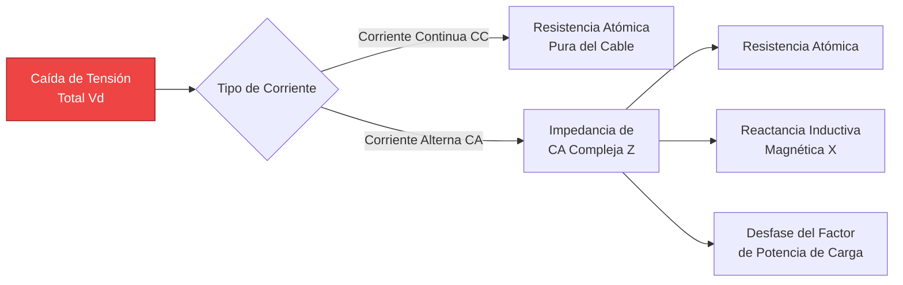
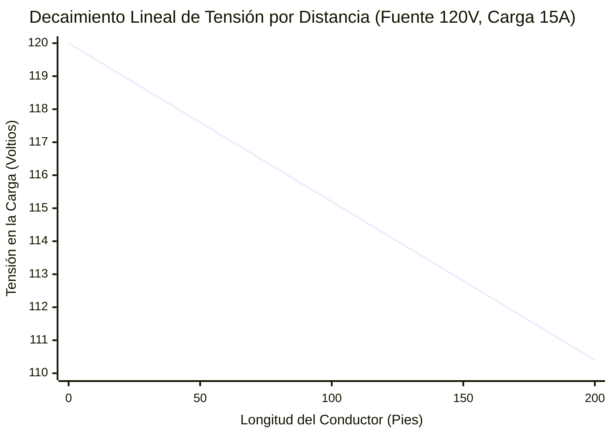
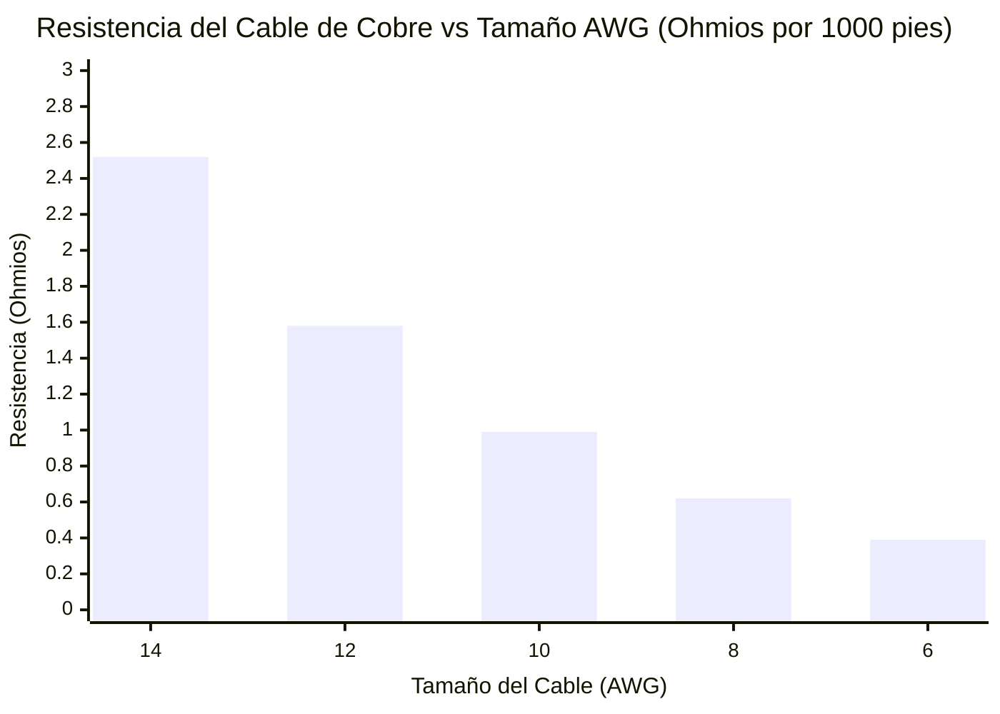
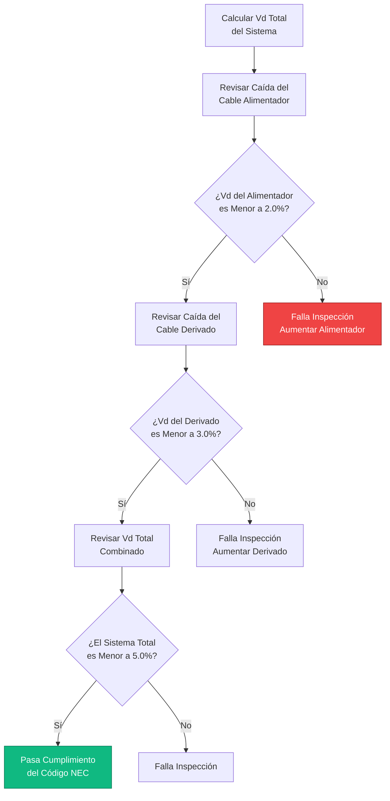
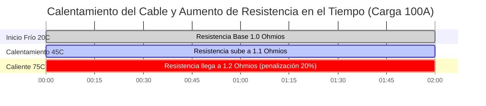

# La Calculadora de Caída de Tensión Definitiva: Dimensionamiento de Cables, Cumplimiento del NEC y Física de CA/CC

Bienvenido a la **Calculadora de Caída de Tensión** definitiva y a la clase magistral de ingeniería. Ya sea que usted sea un electricista intentando dimensionar correctamente los cables de un alimentador para satisfacer las estrictas limitaciones del Artículo 210 del Código Eléctrico Nacional (NEC), un ingeniero solar fotovoltaico diseñando largos recorridos de cadenas de CC para minimizar las pérdidas en los controladores de carga, o un técnico automotriz solucionando problemas en el cableado defectuoso de un cabrestante de 12V, dominar la física de la caída de tensión es obligatorio.

La caída de tensión es el asesino silencioso de los sistemas eléctricos. Ahoga los motores de arranque, provoca apagados del inversor por bajo voltaje, crea calor térmico peligroso dentro de las paredes y reduce agresivamente la eficiencia de los sistemas de iluminación. 

En esta exhaustiva guía SEO de más de 4,000 palabras, deconstruiremos agresivamente la física de $V_{drop}$, exploraremos las severas diferencias entre la resistencia de CC y la reactancia inductiva de CA, detallaremos los efectos matemáticos de la temperatura del conductor ($75^\circ\text{C}$ frente a $90^\circ\text{C}$) y descifraremos la lógica exacta detrás de los umbrales de cumplimiento del 3% y 5% del NEC. Para cimentar estos conceptos, hemos incluido cinco diagramas interactivos en Mermaid.js meticulosamente detallados y seguros para los analizadores (parsers).

---

## 1. ¿Qué es Exactamente la Caída de Tensión?

La **Caída de Tensión** ($V_{drop}$) es la pérdida medible de potencial eléctrico (Voltios) a medida que la corriente viaja desde una fuente de energía hacia una carga. 

Según la física fundamental, ningún cable es un conductor perfecto. Incluso el cobre y la plata puros poseen resistencia atómica interna. Cuando la corriente eléctrica (Amperios) es forzada a través de esta resistencia interna (Ohmios), la Ley de Ohm dicta que se consume un voltaje:
$$V = I \cdot R$$

Si su fuente de energía entrega $120\text{V}$, y los $100\text{ pies}$ de cable de cobre que la conectan a su carga consumen $4\text{V}$ de potencial para empujar los electrones, su aparato solo recibirá $116\text{V}$. 

La energía perdida en el cable no desaparece; se convierte violentamente en energía térmica (calor) de acuerdo con la física del Calentamiento de Joule ($P_{loss} = I^2 \cdot R$). Si la caída de tensión es demasiado severa, el cable derretirá su propio aislamiento y provocará un incendio eléctrico.

---

## 2. Las Fórmulas Universales de Caída de Tensión

Las matemáticas requeridas para calcular la pérdida en el cable dependen por completo del tipo de circuito eléctrico. Los circuitos de Corriente Continua (CC) solo lidian con la resistencia atómica, mientras que los circuitos de Corriente Alterna (CA) también deben combatir la reactancia inductiva electromagnética ($X$) y los desfases del Factor de Potencia ($\cos\phi$).

### Circuitos de CC de 2 Hilos
Para cables de batería, paneles solares y cableado automotriz, el circuito consta de dos cables (positivo y negativo). Por lo tanto, la corriente debe recorrer toda la distancia *dos veces* (ida y vuelta).
$$V_{drop} = 2 \cdot I \cdot R_{\text{one-way}}$$

### Circuitos de CA Monofásicos (120V / 240V)
Para los tomacorrientes y electrodomésticos residenciales de pared, debemos incluir en el cálculo la impedancia de CA del cable ($Z$), la cual combina la resistencia de CC con la resistencia magnética de la corriente de CA que alterna $60\text{ veces}$ por segundo.
$$V_{drop} = 2 \cdot I \cdot L \cdot (R \cos\phi + X \sin\phi)$$

### Circuitos de CA Trifásicos (480V L-L)
Para cargas de motores comerciales e industriales masivos, la matemática trifásica introduce la constante de raíz cuadrada de 3.
$$V_{drop} = \sqrt{3} \cdot I \cdot L \cdot (R \cos\phi + X \sin\phi)$$

*(Donde $L$ es la distancia, $R$ es la Resistencia por unidad de longitud, $X$ es la Reactancia por unidad de longitud y $\cos\phi$ es el Factor de Potencia de la carga).*

---

## 3. Límites de Cumplimiento del Código Eléctrico Nacional (NEC)

El NEC no exige legalmente límites estrictos de caída de tensión por razones de seguridad (las reglas de capacidad de corriente de los cables manejan la seguridad contra incendios), pero recomiendan agresivamente límites estrictos para la eficiencia y la longevidad del equipo.

### La Regla del 3% / 5% del NEC (Nota Informativa 210.19)
- **Circuitos Derivados:** La caída de tensión máxima permitida para el circuito derivado (el cable desde la caja de interruptores hasta el tomacorriente de pared) no debe exceder el **3.0%**.
- **Sistema Total (Alimentador + Derivado):** La caída de tensión total desde el medidor de servicio principal, a través de los alimentadores del subpanel y hasta el tomacorriente final no debe exceder el **5.0%**.

**Ejemplo:**
Para un tomacorriente residencial estándar de $120\text{V}$, un límite de caída de tensión del $3\%$ significa que el cable no puede perder más de $3.6\text{V}$. El electrodoméstico debe recibir al menos $116.4\text{V}$ para funcionar de manera eficiente. 

Si está instalando un circuito de $20\text{A}$ a un garaje separado a $150\text{ pies}$ de distancia, un cable estándar de 12 AWG reprobará miserablemente esta prueba. Estará obligado matemáticamente a aumentar el tamaño del cable a un grueso 10 AWG o incluso 8 AWG solo para satisfacer el límite de caída de tensión del 3%.

---

## 4. El Peligro Extremo de los Sistemas Solares y Automotrices de 12V

La caída de tensión es significativamente más peligrosa en los sistemas de CC de bajo voltaje (como las baterías de 12V para vehículos recreativos y el cableado automotriz) que en los sistemas residenciales de alto voltaje de 120V. 

**La Matemática de la Pérdida Proporcional:**
Perder $3\text{V}$ de potencial en una línea de $120\text{V}$ es una pérdida microscópica del **2.5%**. Las luces apenas se atenuarán.
¡Perder $3\text{V}$ de potencial en un cabrestante automotriz de $12\text{V}$ es una pérdida masiva del **25.0%**! 

Si un motor de arranque de 12V recibe solo $9\text{V}$, perderá su par magnético, extraerá exponencialmente más amperios para compensar y quemará rápidamente sus devanados de cobre internos. Esta es la razón por la cual los cables de puente para baterías automotrices son increíblemente gruesos (2 AWG o 0 AWG); deben minimizar la resistencia a $300\text{ Amperios}$ de corriente.

---

## 5. Factor de Corrección por Temperatura del Conductor ($\alpha$)

Los electricistas rutinariamente ignoran la temperatura, asumiendo que la resistencia del cable es estática. Este es un error crítico de ingeniería. 
A medida que el cable de cobre se calienta bajo una carga pesada o en un ático caliente ($90^\circ\text{C}$), las vibraciones atómicas dentro del metal obstruyen físicamente el flujo de electrones, aumentando radicalmente la resistencia del cable.

**La Fórmula de la Resistencia Térmica:**
$$R_{hot} = R_{cold} \cdot [1 + \alpha (T_{hot} - T_{cold})]$$
Para el Cobre, el coeficiente de temperatura ($\alpha$) es $0.00393$.

Un cable de cobre que opera a una temperatura abrasadora de $75^\circ\text{C}$ dentro de un conducto tiene un **21% más de resistencia** que un cable a una temperatura ambiente fresca de $20^\circ\text{C}$. Nuestra calculadora avanzada toma en cuenta agresivamente esta penalización térmica para garantizar que sus cables no fallen bajo las cargas máximas del verano.

---

## 6. Cinco Escenarios de Ingeniería Conceptuales con Visualizaciones 2D

Para dominar completamente las relaciones matemáticas que rigen la pérdida de tensión, exploraremos cinco escenarios eléctricos distintos desglosados visualmente usando diagramas personalizados de Mermaid.js.

### Ejemplo 1: La Física de la Caída de Tensión

**El Escenario:**
Un aprendiz de electricista necesita entender exactamente cómo los fenómenos físicos destruyen el potencial eléctrico dentro del cable.

**Visualización 2D:**
Este diagrama de flujo lógico separa la resistencia atómica de CC de la penalización más compleja del factor de potencia y la reactancia electromagnética de CA.

---

### Ejemplo 2: Decaimiento de la Tensión sobre la Distancia

**El Escenario:**
Un instalador solar está tendiendo un cable de 10 AWG a $200\text{ pies}$ de una bomba de pozo remoto. Necesitan visualizar qué tan rápido cae la tensión a medida que el cable se alarga.

**Las Matemáticas:**
Dado que $V_{drop} = I \cdot R$ y la resistencia es directamente proporcional a la longitud, la tensión cae de manera perfectamente lineal sobre la distancia.

**Visualización 2D:**
Este gráfico traza la línea perfectamente recta de la tensión decayendo a medida que el recorrido del cable se extiende de $0$ a $200\text{ pies}$.

---

### Ejemplo 3: Tamaño AWG vs Resistencia del Conductor

**El Escenario:**
Un ingeniero está tratando de convencer a un cliente de actualizar de un cable de 12 AWG a un cable mucho más grueso de 8 AWG para resolver un problema severo de caída de tensión.

**Las Matemáticas:**
El sistema American Wire Gauge (AWG) es logarítmico. Los números más bajos significan un cable radicalmente más grueso y una resistencia agresivamente menor.

**Visualización 2D:**
Este gráfico de barras demuestra la caída masiva e inversa de Ohmios por cada $1000\text{ pies}$ al actualizar el grosor del cable de un delgado 14 AWG a un grueso 6 AWG.

---

### Ejemplo 4: Lógica de Cumplimiento del Código NEC

**El Escenario:**
Un inspector eléctrico está revisando planos para garantizar que un nuevo circuito derivado comercial y el alimentador de un subpanel cumplan con los estrictos límites del NEC $210.19$.

**Visualización 2D:**
Este diagrama de flujo de arriba hacia abajo mapea las verificaciones matemáticas exactas requeridas para pasar una inspección eléctrica con la máxima eficiencia.

---

### Ejemplo 5: Acumulación de Resistencia Térmica

**El Escenario:**
Un motor de alto amperaje está extrayendo una fuerte corriente, calentando lentamente el cable de cobre dentro de un conducto sellado, de unos fríos $20^\circ\text{C}$ a unos abrasadores $75^\circ\text{C}$.

**Visualización 2D:**
Este diagrama de Gantt describe el aumento constante y aterrador de la caída de tensión a medida que el calor térmico eleva la resistencia atómica del cobre durante varias horas de carga continua.

---

## 7. Conclusión y Desafío de Ingeniería

Dominar la física de la Caída de Tensión es la clave absoluta para diseñar sistemas eléctricos seguros, que cumplan con los códigos y sean altamente eficientes. Si ignora las matemáticas de la resistencia del cable, sus motores se sobrecalentarán, sus luces LED parpadearán, sus paneles solares desperdiciarán su recolección y sus paneles de interruptores actuarán como calentadores de espacio masivos.

Siempre recuerde: aumentar el calibre de su cable es un gasto inicial que paga dividendos masivos en la eficiencia energética y la longevidad del equipo a largo plazo.

Para garantizar que ha dominado estos conceptos, inicie nuestro Simulador interactivo e intente resolver estos desafíos finales:
1. **El Recorrido Largo:** Usted necesita empujar $15\text{A}$ a $120\text{V}$ hacia un cobertizo a $250\text{ pies}$ de distancia. Calcule el Porcentaje de Caída de Tensión exacto usando un cable de 10 AWG. ¿Aprueba la regla del 3% del NEC?
2. **El Cabrestante:** Un cabrestante de Jeep de 12V extrae $400\text{A}$ a carga máxima. Si la batería está a $6\text{ pies}$ de distancia ($12\text{ pies}$ en bucle total), ¿qué cable AWG se requiere para mantener la caída de tensión por debajo de $0.5\text{V}$?
3. **La Penalización Térmica:** Un cable alimentador comercial de cobre cae $4.0\text{V}$ a temperatura ambiente ($20^\circ\text{C}$). Recalcule la caída cuando el cable alcanza su clasificación de temperatura máxima de $90^\circ\text{C}$.

Confíe en esta calculadora para verificar dos veces sus cálculos matemáticos, auditar el dimensionamiento de sus cables y garantizar siempre que sus cargas eléctricas reciban la energía que matemáticamente merecen.
