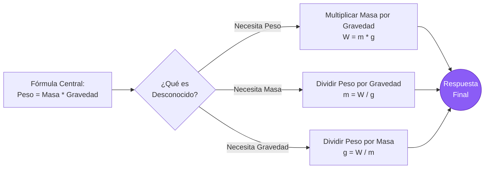
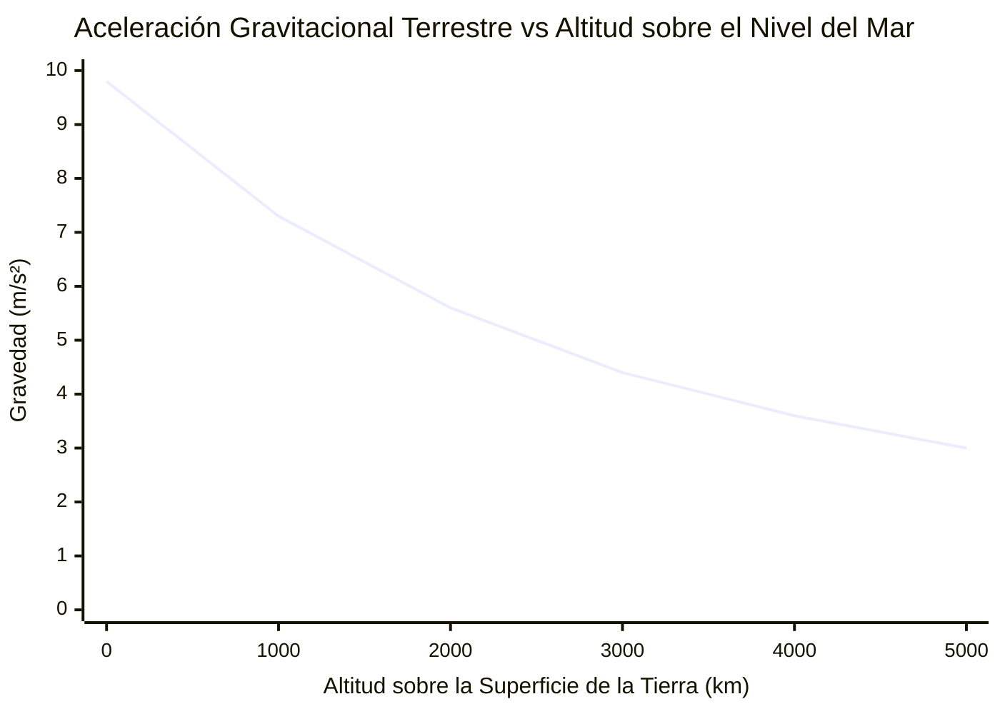

# La Calculadora de Peso Definitiva: Dominando la Gravedad, Masa y Fuerzas Planetarias

Bienvenido a la última **Calculadora de Peso** y guía completa de astrofísica. Ya seas un estudiante de física de secundaria tratando de entender la diferencia fundamental entre masa y peso, un ingeniero aeroespacial calculando proporciones de empuje de carga útil para un alunizaje, o un entusiasta de la astronomía preguntándose cuán pesado te sentirías caminando sobre Júpiter, esta herramienta proporciona las conversiones físicas absolutas y exactas que necesitas.

El Peso ($W$) es uno de los conceptos más universalmente malentendidos en la vida cotidiana. Cuando nos subimos a una báscula de baño, decimos que estamos midiendo nuestro "peso" en kilogramos. Pero en el reino rígido e implacable de la física clásica, esto es completamente erróneo. La Masa y el Peso son dos propiedades físicas radicalmente diferentes.

En esta exhaustiva guía SEO de más de 4,000 palabras, deconstruiremos violentamente la fórmula del peso ($W = mg$). Exploraremos la naturaleza invariable de la masa, desentrañaremos la Ley de Gravitación Universal de Newton, calcularemos la gravedad aplastante de Júpiter y el Sol, y analizaremos cinco escenarios conceptuales de física detallados representados visualmente mediante diagramas interactivos de Mermaid.js.

---

## 1. Definiendo el Peso: La Fuerza Descendente de la Gravedad

En la mecánica newtoniana clásica, el **Peso** ($W$) se define estrictamente como la fuerza vectorial hacia abajo ejercida sobre la masa de un objeto por un campo gravitacional local. 

$$ W = m \cdot g $$

### Masa vs. Peso: La Distinción Definitiva
Para comprender esto de manera intuitiva, debes separar la "cantidad de materia" del "tirón sobre la materia".
- **Masa ($m$):** Una propiedad escalar intrínseca que mide la cantidad total de materia en un objeto. Nunca cambia, independientemente de dónde te encuentres en el universo. Un humano de $70\text{ kg}$ pesa exactamente $70\text{ kg}$ en la Tierra, en Marte, en la Luna y flotando en el espacio interestelar profundo.
- **Peso ($W$):** Una fuerza vectorial variable. Depende enteramente de la aceleración gravitacional ($g$) del planeta en el que te encuentres. El peso cambia instantáneamente a medida que viajas entre cuerpos celestes.

### Unidades Estándar del SI para el Peso
Debido a que el Peso es una *fuerza*, su unidad estándar del SI adecuada es el **Newton** ($\text{N}$), nombrado así en honor a Sir Isaac Newton.
$$ 1\text{ Newton} = 1\text{ kg} \cdot 1\text{ m/s}^2 $$

Cuando te paras en una báscula de baño calibrada en Kilogramos, la báscula en realidad está midiendo la fuerza hacia abajo (Newtons) que tu cuerpo aplica a sus resortes internos. Luego divide secretamente esa fuerza por la gravedad estándar de la Tierra ($9.81\text{ m/s}^2$) para mostrar tu masa en Kilogramos en la pantalla digital.
Si llevaras esa misma báscula de baño a la Luna, te diría que "pesas" aproximadamente $11\text{ kg}$—lo cual es físicamente incorrecto. Tu masa sigue siendo de $70\text{ kg}$; ¡la fuerza gravitacional que te empuja hacia la báscula es simplemente seis veces más débil!

---

## 2. Gravedad Terrestre vs Gravedad Planetaria

La gravedad estándar en la superficie de la Tierra ($g_0$) está acordada internacionalmente como:
$$ g = 9.80665\text{ m/s}^2 $$
Para casi todas las aplicaciones de ingeniería y tareas de física, esto se redondea a **$9.81\text{ m/s}^2$**.

### Calculando la Gravedad Planetaria
¿De dónde viene este $9.81$? Se deriva directamente de la **Ley de Gravitación Universal de Newton**. La gravedad en la superficie de cualquier cuerpo celeste esférico depende completamente de dos factores: la Masa del planeta ($M$) y el Radio del planeta ($r$).

$$ g = \frac{G \cdot M}{r^2} $$
*(Donde $G = 6.674 \times 10^{-11}\text{ N}\cdot\text{m}^2/\text{kg}^2$)*

Debido a que Júpiter es inimaginablemente masivo, su gravedad superficial es de aproximadamente $24.79\text{ m/s}^2$ ($2.5\times$ la de la Tierra). Debido a que la Luna es pequeña y relativamente ligera, su gravedad superficial es de solo $1.62\text{ m/s}^2$ ($1/6$ de la de la Tierra).

---

## 3. Peso Aparente y Física de los Ascensores

Tu "Peso Real" ($W = mg$) nunca cambia siempre y cuando permanezcas en la superficie de la Tierra. Sin embargo, tu **Peso Aparente**—qué tan pesado te *sientes*—puede cambiar drásticamente según tu aceleración vertical.

El peso aparente es simplemente la *Fuerza Normal* ($F_N$) empujando hacia arriba contra tus pies. 
- **De Pie y Quieto:** $F_N = m \cdot g$. Te sientes normal.
- **Ascensor Acelerando Hacia Arriba:** El suelo empuja tus pies con más fuerza para acelerar tu masa hacia arriba. $F_N = m(g + a)$. Temporalmente te sientes más pesado.
- **Ascensor Acelerando Hacia Abajo:** El piso se aleja de tus pies. $F_N = m(g - a)$. Temporalmente te sientes más ligero.
- **Caída Libre (Cables Rotos):** El ascensor cae a $g$. $F_N = m(g - g) = 0$. Experimentas ingravidez Zero-G, ¡a pesar de que la gravedad sigue tirando de ti!

Esto es exactamente por qué los astronautas en la Estación Espacial Internacional se sienten sin peso. No están en "gravedad cero"—¡la gravedad de la Tierra a esa altitud sigue siendo $90\%$ tan fuerte como al nivel del mar! Simplemente se mueven lateralmente tan rápido ($17,500\text{ mph}$) que a medida que caen hacia la Tierra, la Tierra se curva alejándose debajo de ellos. Están en un estado de caída libre perpetua y continua.

---

## 4. Guía Completa de Uso: Maximizando la Calculadora

Nuestra Calculadora de Peso interactiva opera como un robusto simulador de astrofísica.

### Paso 1: Selecciona Tu Objetivo de Cálculo
Usa la navegación superior para seleccionar tu variable desconocida:
- **Peso ($W$):** Conoces la Masa y la Gravedad. (Mecánica newtoniana estándar).
- **Masa ($m$):** Conoces el Peso y la Gravedad. (Determina la masa a partir de una carga de fuerza).
- **Gravedad ($g$):** Conoces la Masa y el Peso. (Calcula el campo gravitacional de un planeta desconocido).

### Paso 2: Utiliza el Modo Preestablecido de Planeta Astronauta
Omite la entrada manual de gravedad seleccionando de nuestros 10 preajustes incrustados del Sistema Solar. ¿Quieres saber exactamente cuánto pesará un Rover de Marte de $5,000\text{ kg}$ cuando aterrice en el Cráter Jezero? Selecciona 'Marte' en el menú desplegable, y la calculadora completará instantáneamente $g = 3.71\text{ m/s}^2$ para calcular la fuerza marciana.

### Paso 3: Interpreta el Medidor de Peso Logarítmico
Nuestra escala radial de fuerza contextualiza instantáneamente tu resultado:
- **Micro-Fuerzas:** $0\text{N}$ a $1,000\text{N}$ (Humanos, mochilas, pequeños electrodomésticos).
- **Macro-Fuerzas:** $1\text{kN}$ a $1,000\text{kN}$ (Coches, camiones, elefantes, aeronaves pequeñas).
- **Mega-Fuerzas:** $1\text{MN}$ a $100\text{MN}$+ (Rascacielos, cruceros, cohetes Saturn V).

---

## 5. Cinco Escenarios Conceptuales de Ingeniería con Visualizaciones 2D

Para dominar por completo las relaciones entre Masa, Fuerza, Gravedad y Cinemática, exploraremos cinco escenarios físicos distintos, desglosados visualmente usando diagramas personalizados de Mermaid.js.

### Ejemplo 1: La Lógica de la Fórmula W=mg (Resolviendo Variables)

**El Escenario:**
Un estudiante de física de primer año necesita visualizar rápidamente las permutaciones algebraicas de la fórmula de peso ($W = mg$) para resolver tres preguntas diferentes de examen.

**Visualización 2D:**
Este diagrama de flujo lógico ilustra la clásica técnica de aislamiento de variables.



---

### Ejemplo 2: El Espectro de Peso Interplanetario

**El Escenario:**
Estás diseñando un rover presurizado. Tiene una masa estática invariable de $1,000\text{ kg}$. Necesitas diseñar los resortes de suspensión. ¿Cuánta fuerza gravitacional experimentarán esos resortes en los diferentes planetas de nuestro Sistema Solar?

**Visualización 2D:**
Este gráfico de barras traza las variaciones extremas en la Fuerza de Peso a través de cinco cuerpos celestes para el mismo rover de $1,000\text{ kg}$. ¡Nota el peso aplastante en Júpiter comparado con la presencia ligera como una pluma en Plutón!

```mermaid
xychart-beta
    title "Peso Gravitacional de un Rover de 1,000 kg en el Sistema Solar"
    x-axis "Cuerpo Celeste" [Plutón, Luna, Marte, Tierra, Júpiter]
    y-axis "Fuerza Descendente (Newtons)" 0 --> 25000
    bar [620, 1620, 3710, 9810, 24790]
```

---

### Ejemplo 3: Física del Peso Aparente en Ascensores

**El Escenario:**
Una persona de $80\text{ kg}$ está parada sobre una báscula dentro de un ascensor en un rascacielos. Necesitamos trazar exactamente qué lee la báscula (su Peso Aparente) dependiendo del estado de aceleración del carro del ascensor.

**Visualización 2D:**
Este diagrama de flujo visualiza la adición vectorial de la gravedad y la aceleración del ascensor para determinar la Fuerza Normal final ($F_N$) sentida por la persona.

```mermaid
flowchart TD
    A[Persona de 80 kg en<br/>Ascensor] --> B{Estado del<br/>Ascensor}
    
    B -->|Acelerando Hacia Arriba (+a)| C[F_N = m(g + a)<br/>Báscula Lee > 784 N]
    B -->|Velocidad Constante| D[F_N = m(g)<br/>Báscula Lee = 784 N]
    B -->|Acelerando Hacia Abajo (-a)| E[F_N = m(g - a)<br/>Báscula Lee < 784 N]
    B -->|Cables Rotos (a = -g)| F[F_N = m(g - g)<br/>Báscula Lee = 0 N]
    
    C --> G((Se Siente<br/>Pesado))
    D --> H((Se Siente<br/>Normal))
    E --> I((Se Siente<br/>Ligero))
    F --> J((Caída Libre<br/>Ingrávida))
    
    style G fill:#ef4444,color:#fff
    style H fill:#10b981,color:#fff
    style I fill:#f59e0b,color:#fff
    style J fill:#6366f1,color:#fff
```

---

### Ejemplo 4: Curva de Disminución Gravitacional (Órbita vs Superficie)

**El Escenario:**
Mucha gente cree erróneamente que no hay "gravedad" en el espacio. Según la ley de Newton ($g \propto 1/r^2$), la gravedad se desvanece suavemente a medida que te alejas del centro de la Tierra; no se "apaga" simplemente. Observemos la gravedad de la Tierra en la superficie ($r = 6,371\text{ km}$) versus la altitud.

**Las Matemáticas:**
- Superficie ($0\text{ km}$): $g = 9.81\text{ m/s}^2$
- Órbita de la ISS ($400\text{ km}$): $g = 8.69\text{ m/s}^2$ (¡aún el $89\%$ de la gravedad de la superficie!)
- Órbita Alta ($5,000\text{ km}$): $g = 3.08\text{ m/s}^2$

**Visualización 2D:**
Este gráfico traza la decadencia de la ley de la inversa del cuadrado de la aceleración gravitacional de la Tierra a medida que ganas altitud.



---

### Ejemplo 5: Secuencia de Lanzamiento de un Cohete Espacial (Empuje vs Peso)

**El Escenario:**
Un cohete masivo de SpaceX se asienta en la plataforma de lanzamiento. Tiene una masa de $1,000,000\text{ kg}$, dándole un peso gravitacional de $9,810,000\text{ Newtons}$. Para poder abandonar el suelo, los motores deben generar una fuerza de Empuje que estrictamente exceda este vector de peso masivo. A medida que se quema el combustible, la masa disminuye, haciendo que el vector Peso se reduzca, lo que incrementa salvajemente la aceleración.

**Visualización 2D:**
Este diagrama de Gantt esboza la cronología física de un cohete despejando la torre de lanzamiento y empujando hacia Max-Q.

```mermaid
gantt
    title Lanzamiento de Cohete Orbital: Secuencia de Empuje vs Peso
    dateFormat s
    axisFormat %S
    section Pre-Lanzamiento
    Secuencia de Ignición de Motores :active, 0, 5s
    El Empuje se Acumula pero Empuje < Peso :active, 5s, 8s
    section Despegue
    El Empuje Excede al Peso (T over W Greater Than 1) :crit, done, 8s, 10s
    Torre Despejada (Acelerando) :done, 10s, 15s
    section Vuelo
    Quema de Combustible (El peso disminuye rápidamente) :active, 15s, 40s
    Máxima Presión Aerodinámica (Max-Q) :milestone, 40s, 45s
```

---

## 6. Análisis Profundo de Preguntas Frecuentes (FAQ)

**P: ¿Por qué las cosas caen a la misma velocidad independientemente del peso?**
**R:** Esto fue famoso al ser probado por Galileo y luego por el astronauta del Apollo 15 David Scott dejando caer un martillo y una pluma en la Luna. Mientras la gravedad tira *más fuerte* de una bola de bolos pesada que de una canica ligera, la bola de bolos también tiene vastamente más *masa* (inercia), haciéndola más difícil de acelerar. La proporción exacta de Fuerza a Masa siempre es igual a $9.81\text{ m/s}^2$. Por lo tanto, en un vacío sin resistencia del aire, ¡todos los objetos caen exactamente al mismo ritmo!

**P: ¿Cómo pesamos la Tierra?**
**R:** Nosotros no "pesamos" la Tierra (porque no hay nada sobre lo cual posarla), pero podemos calcular su *masa*. Utilizando la fórmula $g = GM/r^2$, ya que conocemos la gravedad de la Tierra ($9.81$), el radio de la Tierra ($6,371\text{ km}$) y la Constante Gravitacional ($G$), podemos resolver algebraicamente para $M$. ¡La masa de la Tierra es un asombroso $5.972 \times 10^{24}\text{ kg}$!

**P: Si Júpiter está hecho completamente de gas, ¿cómo tiene gravedad?**
**R:** La gravedad es generada por la *masa*, independientemente de si esa masa es roca sólida, agua líquida o gas hidrógeno. Júpiter contiene tanto gas hidrógeno y helio altamente comprimido que su masa total es $318$ veces mayor que la de la Tierra, generando un inmenso tirón gravitacional.

**P: ¿Puede la gravedad ser alguna vez negativa?**
**R:** En la física clásica estándar, no. La gravedad es estrictamente una fuerza atractiva generada por masa positiva. Sin embargo, en la cosmología moderna, el concepto de "Energía Oscura" actúa como una fuerza repulsiva que impulsa la expansión acelerada del universo, funcionando matemáticamente como una antigravedad a escala galáctica.

**P: ¿Qué es un Kilogramo-Fuerza (kgf)?**
**R:** Es una unidad de fuerza obsoleta y ajena al SI. Un kilogramo-fuerza se define como la fuerza gravitacional ejercida por la gravedad estándar de la Tierra sobre un kilogramo de masa. Por lo tanto, $1\text{ kgf} = 9.80665\text{ Newtons}$. La ingeniería moderna utiliza estrictamente Newtons para evitar confundir la masa y la fuerza.

---

## 7. Conclusión y Reto de Ingeniería

El peso es la correa invisible que nos encadena a la Tierra. Gobierna el diseño estructural de cada edificio, el tamaño del motor de cada aeronave y la mecánica orbital del cosmos.

Para dominar verdaderamente estos conceptos de física, utiliza nuestra Calculadora de Peso para resolver los siguientes desafíos conceptuales:
1. **El Turista Interplanetario:** Te paras sobre una báscula de baño en la Tierra, y lee $80\text{ kg}$. Viajas a Marte ($g = 3.71\text{ m/s}^2$). ¿Qué mostrará la misma báscula exacta cuando te pares en ella en el desierto marciano?
2. **El Salto en el Asteroide:** Aterrizas tu nave espacial en el asteroide Ceres ($g = 0.28\text{ m/s}^2$). Tu traje espacial y cuerpo tienen una masa combinada de $150\text{ kg}$. ¿Cuál es tu fuerza de peso descendente total en Newtons en Ceres?
3. **El Ascensor que Cae:** Los cables de un carro de ascensor vacío de $500\text{ kg}$ se rompen, y entra en caída libre. ¿Cuál es la Fuerza Normal total que actúa entre el piso del ascensor y una caja de $10\text{ kg}$ que descansa en su interior?

Experimenta con el simulador, analiza las variaciones planetarias y confía en esta calculadora para aclarar de manera permanente la distinción crucial entre la masa invariable y la poderosa fuerza vectorial del peso.
