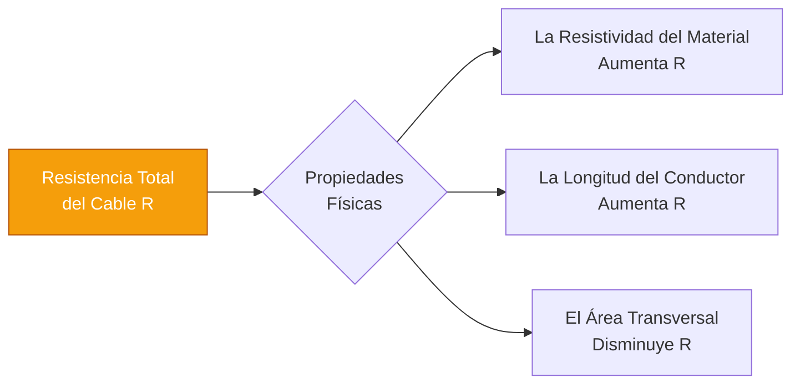
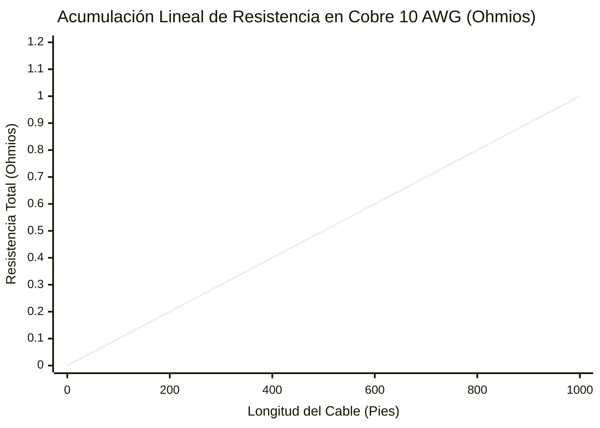
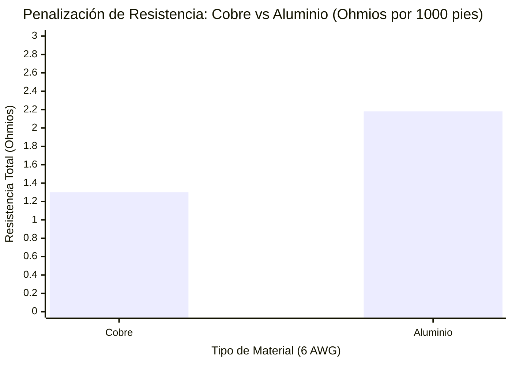
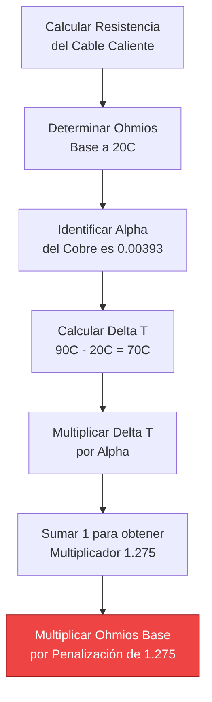
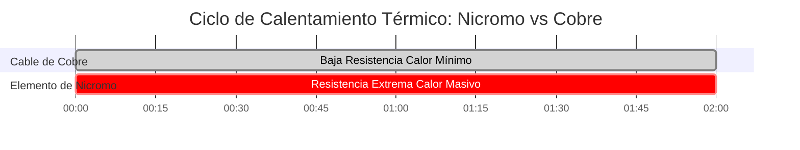

# La Calculadora Definitiva de Resistencia de Cable: R = ρL/A, Matemáticas AWG y Penalizaciones Térmicas

Bienvenido a la **Calculadora de Resistencia de Cable** definitiva y a la guía completa de física. Ya sea que usted sea un ingeniero eléctrico que dimensiona alimentadores de cobre de $4/0$ AWG para un motor industrial, un técnico solar calculando las devastadoras pérdidas de línea de CC en tramos largos, o un estudiante de ciencia de materiales investigando la degradación térmica de los conductores de aluminio, dominar la física de la resistencia del cable no es negociable.

La resistencia eléctrica no es un concepto teórico; es una barrera física. Convierte su costosa energía eléctrica en calor térmico desperdiciado ($P = I^2 \cdot R$), destruyendo la eficiencia del sistema, causando caídas catastróficas de voltaje y, si se ignora, provocando incendios eléctricos.

En esta clase magistral exhaustiva de SEO de más de 4,000 palabras, deconstruiremos la ecuación fundamental $R = \rho L/A$, expondremos matemáticamente las severas diferencias entre el Cobre y el Aluminio, decodificaremos el sistema logarítmico del Calibre de Alambre Estadounidense (AWG) y analizaremos profundamente los aterradores efectos del calentamiento del conductor (el coeficiente de temperatura $\alpha$). Para consolidar estos conceptos críticos de ingeniería, hemos incluido cinco diagramas interactivos de Mermaid.js meticulosamente detallados y seguros para el analizador.

---

## 1. ¿Qué es Exactamente la Resistencia del Cable?

La **Resistencia del Cable** ($R$, medida matemáticamente en Ohmios $\Omega$) es la oposición física estricta que presenta un conductor de metal al flujo de corriente eléctrica (electrones).

Incluso los metales más altamente conductores de la Tierra, la Plata y el Cobre, no son perfectos. A medida que miles de millones de electrones son empujados con fuerza a través de un cable de cobre por una fuente de voltaje, chocan violentamente con los átomos de cobre vibrantes en la red metálica. Cada colisión destruye una pequeña fracción del impulso hacia adelante del electrón, convirtiendo esa energía cinética directamente en calor térmico.

Esta fricción microscópica colectiva es lo que medimos como **Resistencia Eléctrica**.

---

## 2. La Ecuación Universal de Resistencia ($R = \rho L / A$)

La resistencia de cualquier objeto físico se rige por tres factores geométricos y materiales inmutables, perfectamente resumidos por la ecuación fundamental de la física eléctrica:

$$R = \frac{\rho \cdot L}{A}$$

### Los Tres Factores:
1. **Resistividad del Material ($\rho$):** La resistencia química intrínseca del metal en sí. La Plata tiene la resistividad más baja, lo que la convierte en el mejor conductor. El Cobre es el segundo. El Aluminio es un distante tercero, y el Hierro es terrible. La resistividad se mide en Ohm-metros ($\Omega\cdot m$).
2. **Longitud del Conductor ($L$):** La resistencia es estrictamente proporcional a la distancia. Si duplica la longitud de un cable, obliga a los electrones a navegar por el doble de colisiones atómicas. Por lo tanto, la resistencia se duplica exactamente.
3. **Área de la Sección Transversal ($A$):** La resistencia es estrictamente *inversamente* proporcional al grosor del cable. Si duplica el área física del cable, proporciona el doble de rutas para que viajen los electrones, reduciendo efectivamente la resistencia a la mitad.

---

## 3. El Debate de Ingeniería entre Cobre vs. Aluminio

Al diseñar redes eléctricas masivas, los ingenieros se ven obligados a elegir entre los dos conductores principales: **Cobre (Cu)** y **Aluminio (Al)**.

### La Física del Cobre
El cobre es el estándar de oro del cableado eléctrico (irónicamente, en realidad es un mejor conductor que el Oro). Su resistividad ($\rho$) es increíblemente baja, $1.68 \times 10^{-8} \ \Omega\cdot m$. Es físicamente fuerte, altamente resistente a la oxidación y se dobla sin romperse.

### La Física del Aluminio
El aluminio es el rey de las líneas de transmisión de servicios públicos. Su resistividad es de $2.82 \times 10^{-8} \ \Omega\cdot m$. Debido a que su resistividad es significativamente mayor, **el cable de Aluminio tiene aproximadamente un 68% más de resistencia eléctrica que un cable de Cobre del mismo tamaño exacto.**

Entonces, ¿por qué la red eléctrica usa Aluminio? **Peso y Costo.**
El aluminio es radicalmente más barato que el Cobre y exponencialmente más ligero ($2.70 \text{ g/cm}^3$ frente a $8.96 \text{ g/cm}^3$). Para las torres de servicios públicos de alto voltaje que abarcan kilómetros, un cable de cobre sería tan pesado que rompería físicamente las torres de acero que lo sostienen.

*Regla General de Ingeniería:* Para lograr exactamente la misma resistencia eléctrica que un cable de cobre, un cable de aluminio debe aumentarse a dos tamaños AWG más grueso (por ejemplo, reemplazar el Cobre 10 AWG con Aluminio 8 AWG).

---

## 4. Las Matemáticas Logarítmicas del Sistema AWG

El sistema de **Calibre de Alambre Estadounidense (AWG)** es profundamente confuso para los nuevos ingenieros porque matemáticamente va hacia atrás y es estrictamente logarítmico.

En el sistema AWG, un número **más pequeño** representa un cable **más grueso** con **menor** resistencia.
- 14 AWG es un cable delgado utilizado para circuitos de iluminación de baja potencia de $15\text{A}$.
- 4 AWG es un cable masivo y grueso utilizado para cargadores pesados de vehículos eléctricos de $60\text{A}$.

Debido a que el sistema es logarítmico, cada vez que el número AWG cae en 3 (por ejemplo, de 10 AWG a 7 AWG), el área de la sección transversal del cable se duplica exactamente, y su resistencia eléctrica se reduce estrictamente a la mitad.

---

## 5. La Penalización Térmica de la Temperatura ($\alpha$)

Aquí es donde fallan los ingenieros aficionados. La resistencia eléctrica **no es estática**. Cambia violentamente en función de la temperatura del cable.

Cuando un cable de cobre se calienta (ya sea por un caluroso sol de verano o por la fricción térmica interna de transportar una corriente pesada), los átomos de cobre vibran mucho más agresivamente. Estas vibraciones agresivas hacen que los electrones choquen con mucha más frecuencia, elevando aún más la resistencia eléctrica del cable.

### La Fórmula de Corrección Térmica:
$$R_{\text{caliente}} = R_{\text{frío}} \cdot [1 + \alpha (T_{\text{caliente}} - T_{\text{frío}})]$$

Donde $\alpha$ es el Coeficiente de Temperatura de Resistencia. Para el Cobre, $\alpha = 0.00393 \ /^\circ\text{C}$.

**El Peligro:**
Si calcula la resistencia de su cable en una habitación cómoda con aire acondicionado a $20^\circ\text{C}$, pero instala ese cable en un ático abrasador a $75^\circ\text{C}$, el cable poseerá un **21% más de resistencia** de lo que se contabilizó en sus planos. Esta penalización masiva desencadenará una severa caída de voltaje y disparos inesperados del interruptor.

---

## 6. Cinco Escenarios Conceptuales de Ingeniería con Visualizaciones 2D

Para dominar completamente las relaciones físicas que rigen la resistencia del cable, exploraremos cinco escenarios de ingeniería distintos desglosados visualmente utilizando diagramas de Mermaid.js personalizados.

### Ejemplo 1: La Física de la Resistencia

**El Escenario:**
Un estudiante de ingeniería necesita visualizar cómo interactúan matemáticamente las tres propiedades físicas (Longitud, Área, Material) para generar la resistencia óhmica total.

**Visualización 2D:**
Este diagrama de flujo lógico separa los componentes fundamentales de la ecuación $R = \rho L / A$, demostrando qué elementos aumentan o disminuyen la resistencia total.

---

### Ejemplo 2: Resistencia vs Longitud del Cable (Acumulación Lineal)

**El Escenario:**
Un técnico está desenrollando $1000\text{ pies}$ de cable de cobre 10 AWG y necesita comprender cómo se acumula la resistencia en distancias extremas.

**Las Matemáticas:**
Debido a que $R$ es estrictamente proporcional a $L$, cada pie de cable agrega exactamente la misma cantidad microscópica de resistencia, formando una pendiente lineal perfecta.

**Visualización 2D:**
Este gráfico traza la línea perfectamente recta de la resistencia acumulándose a medida que el cable de cobre 10 AWG se extiende de $0$ a $1000\text{ pies}$.

---

### Ejemplo 3: Penalización de Resistencia entre Cobre vs Aluminio

**El Escenario:**
Un contratista quiere ahorrar dinero cambiando los alimentadores de Cobre de 6 AWG por alimentadores de Aluminio más baratos de 6 AWG. Necesita ver la penalización exacta de resistencia de esta decisión.

**Las Matemáticas:**
El aluminio tiene una resistividad de $2.82 \times 10^{-8} \ \Omega\cdot m$ en comparación con los $1.68 \times 10^{-8} \ \Omega\cdot m$ del Cobre. Esto resulta en un aumento masivo de la resistencia del 68% para el mismo grosor físico.

**Visualización 2D:**
Este gráfico de barras demuestra agresivamente la severa penalización de resistencia de tamaños AWG idénticos al comparar Cobre con Aluminio.

---

### Ejemplo 4: Lógica de Penalización de Resistencia Térmica

**El Escenario:**
Un motor industrial de alto amperaje está operando en un conducto sellado, calentando el cable de cobre de $20^\circ\text{C}$ hasta $90^\circ\text{C}$. El inspector debe calcular la penalización de resistencia térmica.

**Visualización 2D:**
Este diagrama de flujo de arriba hacia abajo mapea los pasos matemáticos exactos requeridos para calcular el severo multiplicador de resistencia térmica utilizando el Coeficiente de Temperatura ($\alpha$).

---

### Ejemplo 5: Ciclo de Calentamiento de Nicromo vs Cobre

**El Escenario:**
Comparación del calentamiento deliberado por resistencia del elemento de una tostadora de Nicromo versus el calentamiento accidental por resistencia de un cable de extensión de Cobre durante un ciclo de carga pesada de 2 horas.

**Visualización 2D:**
Este diagrama de Gantt describe los comportamientos térmicos enormemente diferentes del Nicromo de alta resistividad (diseñado para generar calor extremo) versus el Cobre de baja resistividad.

---

## 7. Conclusión y Desafío de Ingeniería

Dominar los parámetros físicos de la Resistencia del Cable ($R = \rho L / A$) es la base de toda la ingeniería eléctrica. Si respeta la resistividad de los materiales, aumenta agresivamente su calibre AWG para recorridos largos y siempre calcula matemáticamente sus penalizaciones de temperatura térmica, sus circuitos funcionarán muy fríos y serán infinitamente eficientes.

Si ignora esta física, sus cables generarán violentamente calentamiento de Joule ($I^2 \cdot R$), destruyendo el potencial de voltaje y derritiendo el aislamiento.

Para garantizar que ha dominado estos conceptos, inicie nuestro Simulador interactivo e intente resolver estos desafíos finales:
1. **El Cambio de Aluminio:** Tiene $500\text{ pies}$ de cable de Cobre de 8 AWG. Si lo cambia por cable de Aluminio de 8 AWG, ¿cuál es el aumento numérico exacto en la resistencia Óhmica?
2. **El Colapso Térmico:** Un cable de cobre de 4 AWG tiene una resistencia base de $0.815 \ \Omega$ a $20^\circ\text{C}$. Calcule su resistencia exacta cuando se calienta a $75^\circ\text{C}$ en un ático.
3. **Las Matemáticas del Área:** Si baja de 12 AWG a 9 AWG, ¿qué sucede exactamente con el área de la sección transversal física y qué sucede exactamente con la resistencia?

Confíe en esta calculadora para verificar dos veces sus cálculos, auditar el dimensionamiento de sus cables y garantizar siempre que sus conductores eléctricos sobrevivan a sus entornos térmicos.
