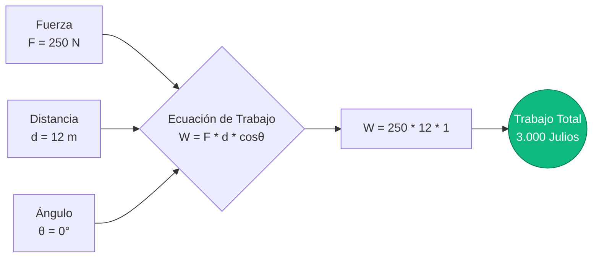
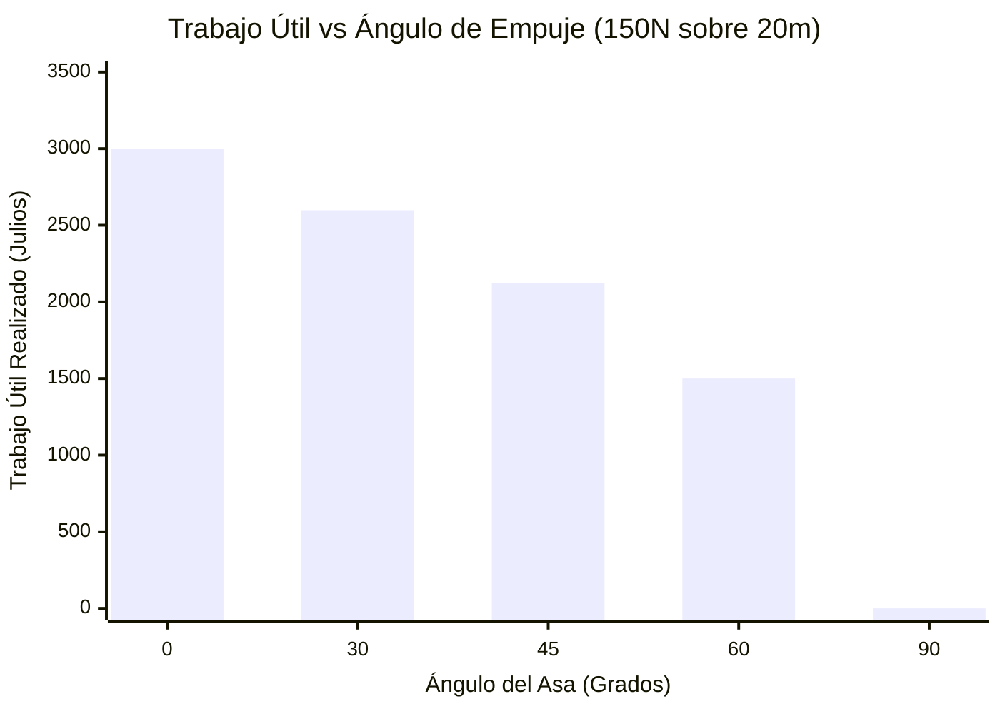
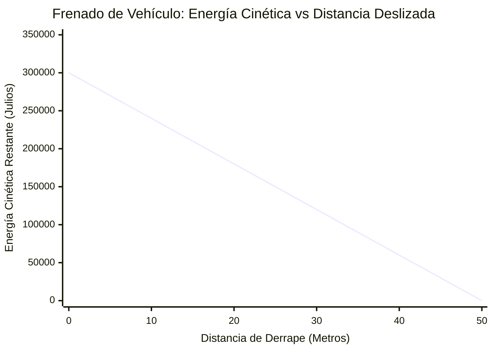
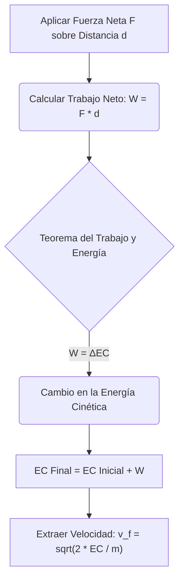

# La Calculadora Definitiva de Trabajo: Dominando la Transferencia de Energía Mecánica y los Vectores de Fuerza

Bienvenido a la **Calculadora de Trabajo Mecánico** definitiva y a la guía integral de física. Ya sea usted un ingeniero civil evaluando la capacidad de carga de una grúa de construcción, un estudiante de física de secundaria estudiando el Teorema del Trabajo y la Energía, o un termodinámico analizando la expansión de un cilindro de gas, esta calculadora está diseñada para usted.

En física, el "trabajo" no es el esfuerzo fisiológico que siente al sostener una mancuerna pesada estacionaria. En física, el Trabajo ($W$) es la medida matemática rigurosa de cuánta energía es transferida hacia o desde un objeto por una fuerza externa que causa un desplazamiento físico.

En esta extensa guía técnica de más de 4.000 palabras, deconstruiremos por completo la ecuación primaria del trabajo mecánico ($W = F \cdot d \cdot \cos\theta$). Exploraremos los matices críticos de los ángulos de los vectores de fuerza, definiremos la diferencia entre trabajo positivo, negativo y nulo, y recorreremos cinco escenarios cinemáticos y de ingeniería del mundo real utilizando visualizaciones detalladas de Mermaid.js.

---

## 1. ¿Qué es el Trabajo Mecánico? (La Definición en Física)

En la mecánica newtoniana clásica, el Trabajo es el producto escalar del vector de Fuerza ($\vec{F}$) y el vector de Desplazamiento ($\vec{d}$).

Debido a que estos son vectores (tienen tanto una magnitud como una dirección específica), no podemos simplemente multiplicar sus números en bruto. Debemos tener en cuenta el ángulo entre ellos utilizando trigonometría, específicamente la función coseno.

La fórmula fundamental es:
$$W = F \cdot d \cdot \cos\theta$$

Donde:
- **$W$ (Trabajo):** Medido en Julios ($\text{J}$). Un Julio equivale a un Newton-metro ($\text{N}\cdot\text{m}$).
- **$F$ (Fuerza):** La magnitud del empuje o tracción, medida en Newtons ($\text{N}$).
- **$d$ (Desplazamiento):** La distancia en línea recta que el objeto se ha movido, medida en metros ($\text{m}$).
- **$\theta$ (Theta):** El ángulo entre la dirección de empuje de la fuerza y la dirección en la que el objeto se mueve realmente.

### El Julio: La Unidad de Energía del SI
El trabajo es una medida de transferencia de energía. Por lo tanto, comparte su unidad con la energía: el Julio ($\text{J}$).
$$ 1\text{ Julio} = 1\text{ Newton} \times 1\text{ metro} = 1\text{ kg} \cdot \text{m}^2/\text{s}^2 $$
Si aplicas exactamente $1\text{ Newton}$ de fuerza (aproximadamente el peso de una manzana pequeña) para empujar un bloque de manera precisa $1\text{ metro}$ sobre una mesa sin fricción, habrás realizado exactamente $1\text{ Julio}$ de trabajo mecánico.

---

## 2. El Papel Crítico del Ángulo del Coseno ($\cos\theta$)

El ángulo $\theta$ es la variable peor entendida en la introducción a la física. Para comprender el trabajo, debes entender cómo $\cos\theta$ modifica el vector de fuerza.

### Trabajo Positivo ($0^\circ \le \theta < 90^\circ$)
Si empujas un carrito de compras horizontalmente hacia adelante ($0^\circ$), toda tu fuerza se destina al movimiento hacia adelante.
- $\cos(0^\circ) = 1$
- **Resultado:** $W = F \cdot d$. Realizaste Trabajo Positivo Máximo. Añadiste energía cinética al carrito.

### Trabajo Nulo ($\theta = 90^\circ$)
Si levantas una caja pesada de $50\text{ kg}$ y la cargas horizontalmente a través de una habitación a velocidad constante, tu fuerza de elevación apunta directamente hacia ARRIBA ($90^\circ$ con respecto al movimiento de caminar hacia adelante).
- $\cos(90^\circ) = 0$
- **Resultado:** $W = 0$. A pesar de que tus músculos arden y queman calorías fisiológicas (trabajo metabólico), desde una estricta perspectiva física, realizaste exactamente CERO trabajo mecánico sobre la caja porque no cambiaste su energía cinética ni su altura.

### Trabajo Negativo ($90^\circ < \theta \le 180^\circ$)
Si un coche en movimiento pisa fuertemente los frenos, la fuerza de fricción de los neumáticos empuja hacia atrás ($180^\circ$) mientras el coche continúa deslizándose hacia adelante.
- $\cos(180^\circ) = -1$
- **Resultado:** $W = -F \cdot d$. La carretera realizó Trabajo Negativo Máximo. El trabajo negativo significa que se está *extrayendo* energía del objeto (en este caso, la energía cinética se drena y se convierte en calor y sonido).

---

## 3. El Teorema del Trabajo y la Energía

El concepto de trabajo mecánico está intrínsecamente ligado al **Teorema del Trabajo y la Energía**, que establece:
*El trabajo neto realizado sobre un objeto por todas las fuerzas combinadas es exactamente igual al cambio en su energía cinética.*

$$ W_{neto} = \Delta EC = \frac{1}{2} m v_f^2 - \frac{1}{2} m v_i^2 $$

Si calculas el trabajo neto realizado sobre un objeto y el resultado es $+500\text{ J}$, eso significa que el objeto ganó exactamente $500\text{ J}$ de energía cinética (aceleró). Si el trabajo neto es $-500\text{ J}$, el objeto perdió $500\text{ J}$ de energía cinética (desaceleró). Si el trabajo neto es $0$, el objeto mantuvo una velocidad constante.

---

## 4. Guía de Uso Completa: Maximizando la Calculadora

Nuestra Calculadora de Trabajo interactiva te permite resolver dinámicamente cualquier variable faltante en la ecuación del trabajo mecánico.

### Paso 1: Selecciona Tu Objetivo de Cálculo
Utiliza las pestañas de navegación superiores para seleccionar lo que deseas resolver:
- **Trabajo ($W$):** Calcula la energía total transferida dada la fuerza, la distancia y el ángulo.
- **Fuerza ($F$):** Aplica ingeniería inversa a la fuerza requerida para lograr una meta de trabajo específica sobre una distancia.
- **Distancia ($d$):** Determina qué tan lejos se moverá un objeto dado un presupuesto de energía establecido y un límite de fuerza.
- **Ángulo ($\theta$):** Calcula el ángulo geométrico del vector de fuerza en función de la salida de energía.

### Paso 2: Utiliza el Simulador de Dirección de Fuerza
Al calcular el Trabajo, utiliza el control deslizante de ángulo interactivo (de $0^\circ$ a $180^\circ$). Observa cómo el trabajo resultante escala desde el $100\%$ de eficiencia a $0^\circ$, baja al $0\%$ a $90^\circ$ y se hunde en territorio negativo a medida que te acercas a $180^\circ$.

### Paso 3: Manejo de Conversiones de Unidades Avanzadas
La calculadora maneja automáticamente una escalada métrica compleja:
- **Energía:** Julios ($\text{J}$), Kilojulios ($\text{kJ}$), Megajulios ($\text{MJ}$), Vatios-hora ($\text{Wh}$), Kilovatios-hora ($\text{kWh}$).
- **Fuerza:** Newtons ($\text{N}$), Kilonewtons ($\text{kN}$).
- **Distancia:** Metros ($\text{m}$), Kilómetros ($\text{km}$), Pies ($\text{ft}$).

---

## 5. Cinco Escenarios Conceptuales de Ingeniería con Visualizaciones en 2D

Para comprender por completo la cinemática del trabajo mecánico, exploraremos cinco escenarios físicos detallados, utilizando Mermaid.js para deconstruir visualmente las matemáticas y las curvas de movimiento.

### Ejemplo 1: La Ecuación Física Básica (Flujo Lógico Cinemático)

**El Escenario:**
Un trabajador de la construcción empuja una caja pesada por el suelo de un almacén. Empuja con una fuerza de $250\text{ N}$ directamente hacia adelante. Mueve la caja $12\text{ metros}$. ¿Cuánto trabajo mecánico realizó?

**Las Matemáticas:**
Usamos la ecuación fundamental $W = F \cdot d \cdot \cos\theta$.
Debido a que está empujando directamente hacia adelante, $\theta = 0^\circ$, y $\cos(0^\circ) = 1$.
$$ W = 250\text{ N} \cdot 12\text{ m} \cdot 1 $$
$$ W = 3.000\text{ Julios} = 3\text{ kJ} $$

**Visualización en 2D:**
El árbol lógico a continuación ilustra la multiplicación directa de las tres variables centrales.

---

### Ejemplo 2: El Cortacésped (Curva de Eficiencia de Ángulo)

**El Escenario:**
Un propietario de casa empuja un cortacésped por su jardín con $150\text{ N}$ de fuerza sobre una distancia de $20\text{ metros}$. Sin embargo, está empujando *hacia abajo* sobre el asa en cierto ángulo. Analicemos cómo el ángulo del asa afecta el trabajo horizontal *útil* real que se está realizando.

**Las Matemáticas:**
- Si el asa estuviera plana ($0^\circ$): $W = 150 \cdot 20 \cdot 1 = 3.000\text{ J}$
- Si el asa está a $30^\circ$: $W = 150 \cdot 20 \cdot \cos(30^\circ) = 3.000 \cdot 0,866 = 2.598\text{ J}$
- Si el asa está a $45^\circ$: $W = 150 \cdot 20 \cdot \cos(45^\circ) = 3.000 \cdot 0,707 = 2.121\text{ J}$
- Si el asa está a $60^\circ$: $W = 150 \cdot 20 \cdot \cos(60^\circ) = 3.000 \cdot 0,500 = 1.500\text{ J}$
- Si el asa apunta hacia abajo ($90^\circ$): $W = 150 \cdot 20 \cdot 0 = 0\text{ J}$ (El cortacésped no se movería hacia adelante).

**Visualización en 2D:**
Este gráfico de barras demuestra visualmente cómo los ángulos pronunciados desperdician dramáticamente la fuerza aplicada, reduciendo el trabajo mecánico útil transferido al cortacésped.

---

### Ejemplo 3: La Prueba de Frenos del Coche (Teorema del Trabajo y la Energía)

**El Escenario:**
Un coche de $1.500\text{ kg}$ conduce a $20\text{ m/s}$ ($72\text{ km/h}$). El conductor pisa los frenos. La fricción de la carretera ejerce una fuerza constante hacia atrás de $-6.000\text{ N}$. ¿Qué distancia se deslizará el coche antes de detenerse por completo?

**Las Matemáticas:**
Primero, encontramos la Energía Cinética inicial del coche:
$$ EC = 0,5 \cdot 1.500\text{ kg} \cdot (20\text{ m/s})^2 = 300.000\text{ Julios} $$

Para detener el coche ($EC = 0$), los frenos deben realizar exactamente $-300.000\text{ J}$ de trabajo negativo.
La fuerza de fricción es exactamente opuesta al movimiento, por lo que $\theta = 180^\circ$ ($\cos180^\circ = -1$).
$$ W = F \cdot d \cdot \cos\theta $$
$$ -300.000 = 6.000 \cdot d \cdot (-1) $$
$$ -300.000 = -6.000 \cdot d $$
$$ d = 50\text{ metros} $$

El coche derrapará exactamente $50\text{ metros}$ antes de detenerse.

**Visualización en 2D:**
Este gráfico muestra la relación lineal entre el trabajo negativo realizado por los frenos y la energía cinética restante del vehículo sobre la distancia.

---

### Ejemplo 4: El Teorema del Trabajo y la Energía (Desglose Lógico)

**El Escenario:**
El teorema del Trabajo y la Energía es primordial en la ingeniería mecánica. Visualicemos el flujo lógico de cómo el Trabajo se conecta con la Velocidad. Si una fuerza neta realiza un trabajo sobre un objeto, la energía cinética de ese objeto cambia, lo que fuerza matemáticamente a que cambie su velocidad.

**Visualización en 2D:**
Este diagrama de flujo de arriba hacia abajo deconstruye la cadena conceptual que une la fuerza aplicada con la velocidad final.

---

### Ejemplo 5: El Motor Termodinámico (Diagrama de Gantt de Trabajo P-V)

**El Escenario:**
El trabajo mecánico no se trata solo de empujar cajas; ¡así es como funcionan los motores de los coches y las centrales eléctricas! En termodinámica, un gas en expansión dentro de un cilindro empuja un pistón. Esto se llama trabajo Presión-Volumen ($P-V$) ($W = P \cdot \Delta V$). Hagamos un mapa del ciclo de 4 tiempos de un motor de combustión interna para ver exactamente cuándo se genera el trabajo útil.

**Las Matemáticas:**
En un motor de coche, las carreras de Admisión, Compresión y Escape en realidad *consumen* pequeñas cantidades de trabajo del impulso del motor. Toda la potencia de salida del coche proviene estrictamente de la violenta expansión durante la **Carrera de Expansión (Trabajo)**, que realiza un trabajo positivo masivo sobre el pistón.

**Visualización en 2D:**
Este diagrama de Gantt traza los milisegundos del ciclo de un motor de 4 tiempos, destacando el momento crítico en que la energía química se convierte en trabajo mecánico.

```mermaid
gantt
    title Ciclo de Motor de 4 Tiempos (Generación de Trabajo Mecánico)
    dateFormat  HH:mm:ss
    axisFormat  %M:%S
    section Ciclo del Motor
    Carrera de Admisión (Trabajo Negativo) :active, 00:00:00, 00:00:01
    Carrera de Compresión (Trabajo Negativo) :active, 00:00:01, 00:00:02
    Ignición y Carrera de Trabajo (Trabajo Positivo Masivo) :crit, done, 00:00:02, 00:00:03
    Carrera de Escape (Trabajo Negativo) :active, 00:00:03, 00:00:04
```

*(Nota: Los plazos son ilustrativos. ¡En un motor real a 3.000 RPM, todo este ciclo de 4 tiempos ocurre en 0,04 segundos!)*

---

## 6. Inmersión Profunda en Preguntas Frecuentes (FAQ)

**P: ¿Puede el trabajo ser negativo?**
**R:** ¡Sí! El trabajo negativo simplemente significa que la fuerza actúa en dirección opuesta al movimiento. La fuerza está *extrayendo* energía del objeto. La fricción siempre realiza trabajo negativo, drenando energía cinética y convirtiéndola en calor.

**P: Si sostengo un peso de $50\text{ kg}$ sobre mi cabeza durante 5 minutos, ¿estoy realizando trabajo?**
**R:** En un sentido estrictamente físico, no. Debido a que el desplazamiento ($d$) es cero, el trabajo mecánico ($W = F \cdot 0$) es de cero Julios. Tus músculos están quemando energía porque las fibras musculares humanas se contraen constantemente y consumen ATP (trabajo metabólico), pero no estás transfiriendo ninguna energía mecánica a la mancuerna.

**P: ¿Cómo reduce la fuerza un sistema de poleas?**
**R:** Una polea es una máquina simple que se basa en la ecuación del trabajo ($W = F \cdot d$). El trabajo total requerido para levantar una caja $1\text{ metro}$ no puede cambiar. Sin embargo, un sistema de poleas puede requerir que tires de $4\text{ metros}$ de cuerda (la $d$ sube $4\times$). Debido a que $W$ es constante y $d$ ha aumentado, la fuerza requerida ($F$) cae en un $75\%$. ¡Estás intercambiando distancia por fuerza!

**P: ¿El trabajo es un Vector o un Escalar?**
**R:** El trabajo es un **Escalar**. Tiene magnitud (como $500\text{ J}$ o $-200\text{ J}$) pero no tiene una dirección. La fuerza y el desplazamiento son vectores, pero su producto escalar da como resultado un valor de energía escalar.

**P: ¿Cuál es la diferencia entre Trabajo y Potencia?**
**R:** El Trabajo es la cantidad total de energía transferida (Julios). La Potencia es qué tan *rápido* se realizó ese trabajo (Vatios). Si subes un tramo de escaleras caminando o corriendo, realizaste exactamente la misma cantidad de trabajo mecánico ($W = mgh$). Sin embargo, al correr tomaste menos tiempo, lo que significa que generaste mucha más Potencia ($P = W / t$).

---

## 7. Conclusión y Desafío de Ingeniería

El trabajo mecánico es la moneda universal de la transferencia de energía. Desde el frenado por fricción de un tren de alta velocidad hasta la expansión termodinámica de la tobera del motor de un cohete, la ecuación $W = F \cdot d \cdot \cos\theta$ gobierna el universo mecánico.

Para dominar verdaderamente estos conceptos, utiliza nuestra Calculadora de Trabajo Mecánico para resolver los siguientes desafíos conceptuales de física:
1. **La Cuerda de Remolque de Esquí:** La cuerda de remolque de una estación de esquí tira de un esquiador de $80\text{ kg}$ a $200\text{ metros}$ por una pendiente nevada de $15^\circ$ a velocidad constante. Ignorando la fricción, ¿cuánto trabajo mecánico realizó el motor de la cuerda de remolque contra la gravedad?
2. **El Arco y la Flecha:** Un arquero tensa la cuerda de un arco $0,6\text{ metros}$ hacia atrás con una fuerza promedio de $150\text{ N}$. ¿Cuánto trabajo se almacenó como energía potencial elástica en las palas del arco?
3. **La Resistencia del Avión:** Un jet comercial que vuela a velocidad constante cubre $10\text{ km}$ ($10.000\text{ m}$) mientras experimenta $50.000\text{ N}$ de resistencia aerodinámica. ¿Cuánto trabajo negativo realizó la atmósfera sobre el avión, y cuánto trabajo positivo tuvieron que generar los motores para mantener la velocidad?

Experimenta con el simulador, analiza las agresivas curvas de eficiencia de los ángulos y confía en esta calculadora para iluminar las masivas transferencias de energía mecánica que ocurren a tu alrededor.
