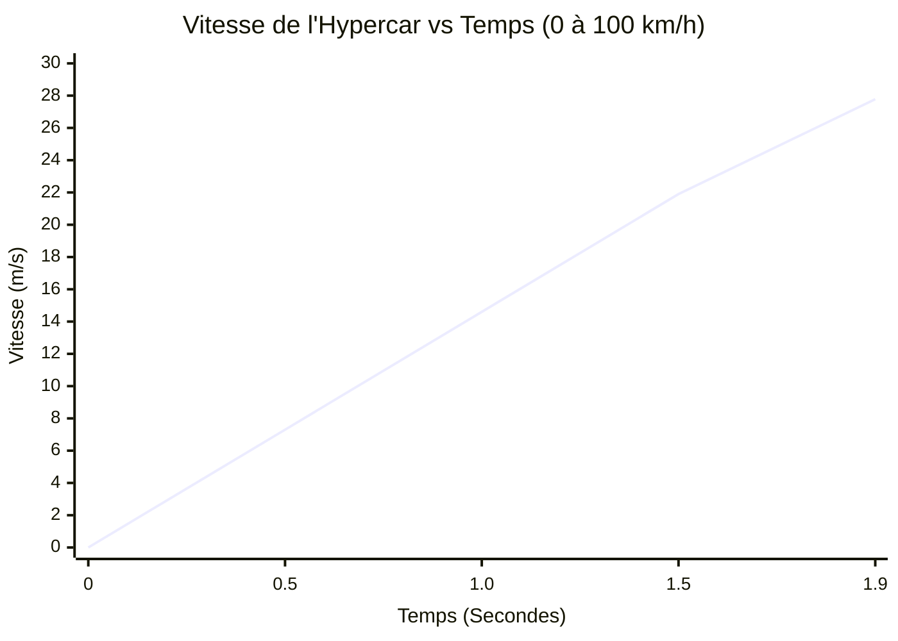
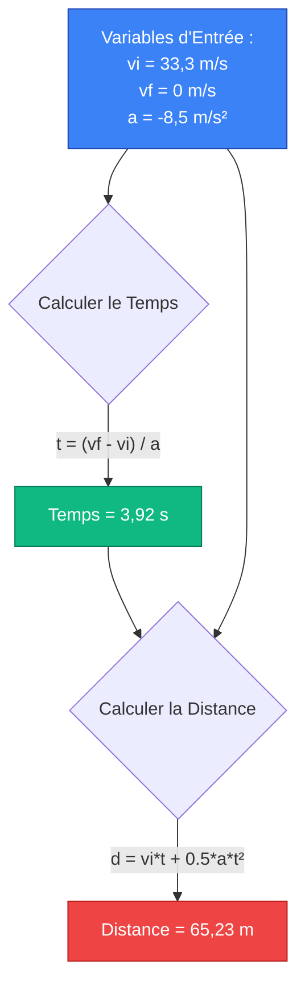
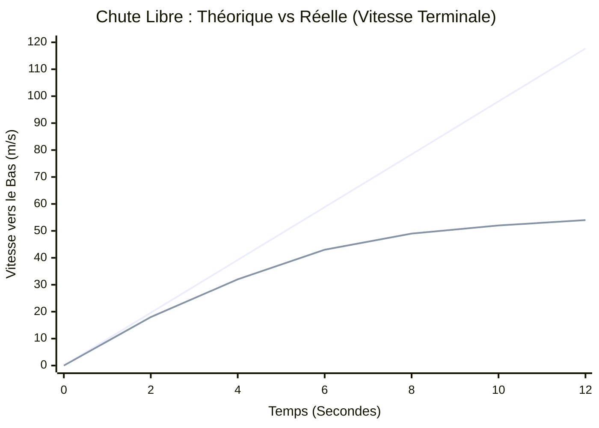
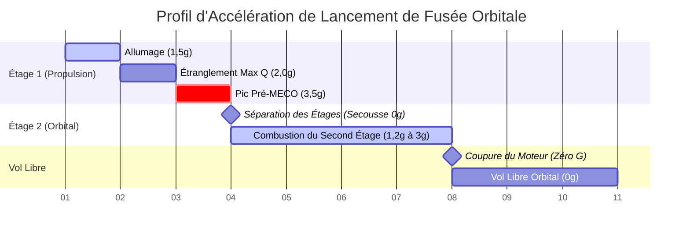
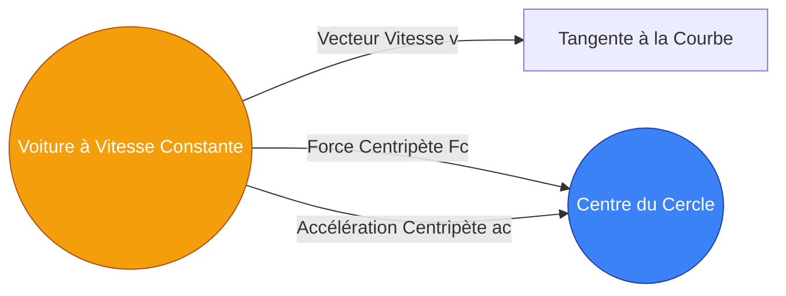

# Le Calculateur d'Accélération Ultime : Maîtriser la Force G, le Changement de Vitesse, et la Cinématique

Bienvenue dans le guide définitif du **Calculateur d'Accélération** et de la physique complète. Que vous soyez un ingénieur automobile essayant de calculer le sprint de 0 à 60 mph d'une hypercar, un étudiant préparant un examen de cinématique en physique AP, ou un passionné d'aviation curieux des forces G écrasantes subies par les pilotes de chasse, cet outil est conçu pour vous.

L'accélération est le moteur du changement dans le monde physique. C'est la poussée palpitante que vous ressentez dans votre poitrine lors du lancement de montagnes russes et la force de freinage violente qui vous sauve la vie lors d'un accident de voiture. Dans ce guide massif de plus de 4 000 mots, nous allons complètement démystifier l'accélération. Nous explorerons les fondements mathématiques de la cinématique, disséquerons la différence entre l'accélération uniforme et variable, vous guiderons dans l'utilisation de notre calculateur interactif, et parcourrons cinq exemples conceptuels du monde réel visualisés avec des diagrammes détaillés Mermaid.js.

---

## 1. L'Expérience Humaine de l'Accélération

Avant de plonger dans les mathématiques, il est crucial de comprendre comment les humains ressentent l'accélération. En tant qu'organismes biologiques, nous sommes complètement aveugles à une vitesse constante. Si vous êtes assis dans un train à grande vitesse roulant à 300 km/h de manière parfaitement fluide avec les fenêtres fermées, vous pourriez facilement vous verser une tasse de café. Votre corps a l'impression d'être complètement immobile.

Ce que les humains *peuvent* ressentir, c'est **l'accélération**—le taux de changement de cette vitesse. Lorsque le train à grande vitesse quitte la gare, vous vous sentez poussé au fond de votre siège. Lorsqu'il freine, vous êtes projeté en avant. Notre oreille interne (le système vestibulaire) est essentiellement un accéléromètre biologique tridimensionnel hautement sensible.

### Pourquoi l'Accélération est Importante en Ingénierie
Dans le monde de l'ingénierie, la gestion de l'accélération est souvent plus importante que la gestion de la vitesse de pointe.
- **Automobile :** La conception de systèmes de freinage antiblocage (ABS) est un exercice visant à maximiser l'accélération négative (décélération) sans rompre le frottement statique.
- **Aérospatial :** Une navette spatiale doit atteindre 28 000 km/h pour orbiter autour de la Terre, mais si elle accélère trop rapidement (au-dessus de 3g), les astronautes s'évanouiront et l'immense pression aérodynamique (Max Q) déchirera le véhicule.
- **Architecture :** Les gratte-ciel et les ponts suspendus sont conçus non seulement pour supporter du poids, mais aussi pour résister à l'accélération latérale causée par les vents violents et les tremblements de terre.

---

## 2. Les Mathématiques Fondamentales : Scalaires, Vecteurs, et Équations

En physique, l'accélération ($a$) est définie comme le taux auquel un objet modifie sa vitesse dans le temps. Étant donné que la vitesse est un **vecteur** (ce qui signifie qu'elle a à la fois une amplitude et une direction), l'accélération est également un vecteur.

Cela conduit à une réalisation essentielle : **Vous pouvez accélérer sans jamais changer de vitesse (speed).**
Si vous conduisez votre voiture en un cercle parfait à une vitesse constante de 30 mph, votre vitesse (velocity) change constamment car votre *direction* change constamment. Par conséquent, vous êtes dans un état d'accélération continue (spécifiquement, une accélération centripète vous poussant vers le centre du cercle).

### L'Équation Fondamentale de l'Accélération Moyenne
La définition algébrique la plus basique de l'accélération moyenne est la variation de vitesse ($\Delta v$) divisée par la variation de temps ($\Delta t$) :

$$ a = \frac{v_f - v_i}{t} $$

Où :
- **$a$** = Accélération
- **$v_f$** = Vitesse Finale
- **$v_i$** = Vitesse Initiale
- **$t$** = Durée

### Les Quatre Équations Cinématiques (Pour l'Accélération Uniforme)
Lorsque l'accélération est constante (uniforme), comme un objet en chute libre près de la surface de la Terre (en ignorant la résistance de l'air), nous pouvons utiliser les quatre équations cinématiques classiques pour résoudre toute variable manquante :

1. **Résoudre pour la Vitesse Finale :**
   $$ v_f = v_i + a \cdot t $$
2. **Résoudre pour le Déplacement (Distance) sans la Vitesse Finale :**
   $$ d = v_i \cdot t + \frac{1}{2} a \cdot t^2 $$
3. **L'Équation Indépendante du Temps (Résoudre pour la Vitesse Finale sans le Temps) :**
   $$ v_f^2 = v_i^2 + 2 \cdot a \cdot d $$
4. **Résoudre pour le Déplacement sans l'Accélération :**
   $$ d = \left(\frac{v_i + v_f}{2}\right) \cdot t $$

Notre calculateur avancé utilise toutes ces équations dynamiquement. Il vous suffit d'entrer les variables que vous connaissez, et le moteur principal du calculateur détermine quelle équation appliquer pour trouver les données manquantes.

---

## 3. Guide d'Utilisation Complet : Maximiser le Calculateur

Notre Calculateur d'Accélération interactif est conçu avec une interface à double mode pour s'adapter à la fois aux calculs quotidiens rapides et aux devoirs de physique complexes. Voici comment l'utiliser efficacement.

### Étape 1 : Sélectionnez Votre Cible de Calcul
En haut du tableau de bord, choisissez ce que vous voulez résoudre :
- **Accélération (a) :** Sélectionnez ceci si vous savez à quelle vitesse un objet a commencé, à quelle vitesse il a fini, et combien de temps cela a pris.
- **Vitesse Finale (vf) :** Sélectionnez ceci si vous connaissez la vitesse de départ d'un véhicule, son taux d'accélération, et le temps écoulé.
- **Vitesse Initiale (vi) :** Sélectionnez ceci si vous connaissez la vitesse finale et souhaitez revenir en arrière pour découvrir à quelle vitesse il allait à l'origine.
- **Temps (t) :** Sélectionnez ceci si vous avez besoin de savoir combien de temps il faudra à un véhicule pour atteindre une vitesse cible à un taux d'accélération spécifique.

### Étape 2 : Entrez les Valeurs et Gérez les Unités
Contrairement aux calculateurs traditionnels, vous n'avez pas besoin de convertir vos unités au préalable.
- Vous pouvez entrer la vitesse initiale en **mph**, la vitesse finale en **km/h**, et le temps en **minutes**.
- Le moteur de conversion du calculateur normalise instantanément toutes les entrées en unités SI (mètres et secondes), effectue le calcul physique, et génère le résultat.
- Les unités de sortie pour l'accélération incluent $m/s^2$, $ft/s^2$, $km/h/s$, et la **Force G ($g$)**.

### Étape 3 : Interprétez la Jauge d'Arc de Force G
Une fois qu'un calcul est terminé, la **Jauge d'Arc de Force G** se met à jour immédiatement.
- Une gravité terrestre standard (1g) est d'environ $9,81\text{ m/s}^2$.
- La jauge d'arc visuelle fournit un codage couleur intuitif : Vert pour les limites humaines de sécurité (0 à 2g), Jaune pour les limites intenses (3g à 5g, comme un avion de chasse), et Rouge pour les limites dangereuses (6g+).
- Si votre accélération est négative (décélération), la jauge bascule vers la gauche, indiquant une force de freinage.

### Étape 4 : Utilisez le Simulateur de Mouvement et les Graphiques
En activant le **Mode Avancé**, vous accédez aux graphiques interactifs Recharts.
- Le **graphique Vitesse vs Temps** trace la trajectoire de la vitesse. Pour une accélération constante, ce sera une ligne droite inclinée.
- Le **graphique Position vs Temps** affichera une parabole courbée, démontrant comment le déplacement augmente de manière exponentielle sous accélération.

---

## 4. Cinq Exemples Conceptuels avec Visualisations 2D

Pour combler le fossé entre la théorie mathématique et l'application dans le monde réel, explorons cinq exemples détaillés d'accélération, en utilisant Mermaid.js pour visualiser la physique.

### Exemple 1 : Le Sprint de l'Hypercar de 0 à 100 km/h (Calcul de l'Accélération de Base)

**Le Scénario :**
Une hypercar électrique haute performance se vante de pouvoir accélérer de l'arrêt complet (0 km/h) à 100 km/h en seulement 1,9 seconde. Quelle est son accélération moyenne en $m/s^2$, et combien de forces G le conducteur subit-il ?

**Les Mathématiques :**
- Vitesse Initiale ($v_i$) = 0 km/h = 0 m/s
- Vitesse Finale ($v_f$) = 100 km/h. Pour convertir en m/s, divisez par 3,6 : $100 / 3,6 = 27,78\text{ m/s}$.
- Temps ($t$) = 1,9 s

En utilisant l'équation fondamentale :
$$ a = \frac{v_f - v_i}{t} = \frac{27,78 - 0}{1,9} = 14,62\text{ m/s}^2 $$

Pour trouver la force G, divisez l'accélération par la gravité terrestre ($9,81\text{ m/s}^2$) :
$$ \text{Force G} = \frac{14,62}{9,81} = 1,49g $$

Le conducteur subit près de 1,5 fois son propre poids corporel le repoussant dans le siège !

**Visualisation 2D :**
Le graphique vitesse vs temps ci-dessous démontre cette augmentation rapide et linéaire de la vitesse.

---

### Exemple 2 : L'Arrêt d'Urgence (Décélération et Déplacement)

**Le Scénario :**
Un conducteur roule sur l'autoroute à 120 km/h (33,3 m/s). Soudain, un cerf saute sur la route. Le conducteur écrase les freins, et le système de freinage antiblocage de la voiture applique une décélération constante de $-8,5\text{ m/s}^2$. Combien de temps faut-il à la voiture pour s'arrêter complètement, et quelle est la distance de freinage ?

**Les Mathématiques :**
- $v_i$ = 33,3 m/s
- $v_f$ = 0 m/s (arrêt complet)
- $a$ = -8,5 $m/s^2$

Tout d'abord, calculez le temps nécessaire pour s'arrêter :
$$ t = \frac{v_f - v_i}{a} = \frac{0 - 33,3}{-8,5} = 3,92\text{ secondes} $$

Ensuite, calculez la distance de freinage ($d$) en utilisant l'équation de déplacement :
$$ d = v_i \cdot t + \frac{1}{2} a \cdot t^2 $$
$$ d = (33,3 \times 3,92) + 0,5 \times (-8,5) \times (3,92)^2 $$
$$ d = 130,54 - 65,31 = 65,23\text{ mètres} $$

La voiture parcourra plus de 65 mètres (plus de la moitié d'un terrain de football) avant de s'arrêter complètement.

**Visualisation 2D :**
Cet organigramme visualise la séquence de cinématique utilisée par le moteur de notre calculateur pour résoudre les variables manquantes lorsque la décélération est impliquée.

---

### Exemple 3 : L'Objet en Chute et la Vitesse Terminale

**Le Scénario :**
Un parachutiste saute d'un avion. Si l'on ignore la résistance de l'air, la gravité dicte qu'il accélérera vers le bas à $9,81\text{ m/s}^2$. Quelle est sa vitesse après 5 secondes de chute libre ?

**Les Mathématiques (Sans Résistance de l'Air) :**
- $v_i$ = 0 m/s
- $a$ = 9,81 $m/s^2$
- $t$ = 5 s
$$ v_f = 0 + (9,81 \times 5) = 49,05\text{ m/s} \text{ (environ 176 km/h)} $$

**La Réalité (Avec Résistance de l'Air) :**
Dans le monde réel, à mesure que la vitesse du parachutiste augmente, la force de traînée aérodynamique poussant vers le haut augmente également. Finalement, la force de traînée vers le haut équivaut parfaitement à la force gravitationnelle vers le bas. La force nette devient nulle ($F = 0$), ce qui signifie que l'accélération devient nulle ($a = 0$). Le parachutiste cesse d'accélérer et continue de tomber à une vitesse maximale constante connue sous le nom de **Vitesse Terminale** (environ 54 m/s pour un humain).

**Visualisation 2D :**
Ce graphique trace la vitesse théorique (une ligne droite) par rapport à la vitesse réelle (une courbe s'aplatissant à mesure qu'elle approche de la vitesse terminale).

*(Ligne 1 : Vide Théorique. Ligne 2 : Atmosphère réelle se courbant pour devenir plate à la vitesse terminale).*

---

### Exemple 4 : La Chronologie des Étages d'une Fusée Spatiale

**Le Scénario :**
Un lanceur orbital à plusieurs étages ne subit pas une accélération constante. Comme le carburant est rapidement brûlé, la masse de la fusée diminue considérablement. Selon $a = F/m$, si la force de poussée ($F$) reste constante tandis que la masse ($m$) diminue, l'accélération ($a$) doit continuellement augmenter.

Lorsque la fusée largue un étage de carburant vide (séparation), la masse change instantanément, créant une secousse massive d'accélération.

**Visualisation 2D :**
Le diagramme de Gantt ci-dessous illustre une chronologie de lancement de fusée simplifiée, cartographiant les événements de la mission aux environnements d'accélération changeant rapidement subis par l'équipage.

---

### Exemple 5 : Accélération Centripète (La Force de Virage)

**Le Scénario :**
Une voiture de Formule 1 navigue dans un long virage circulaire balayé avec un rayon de 50 mètres. Le conducteur maintient une vitesse parfaitement constante de 100 km/h (27,7 m/s) tout au long du virage. Puisque la vitesse est constante, la voiture accélère-t-elle ?

**Les Mathématiques :**
Oui ! La vitesse (velocity) est un vecteur. En tournant le volant, le conducteur change constamment la *direction* du vecteur vitesse. Modifier un vecteur vitesse nécessite une force et entraîne une accélération. Ce type spécifique est appelé **Accélération Centripète** ($a_c$), et il pointe directement vers le centre du cercle.

La formule de l'accélération centripète est :
$$ a_c = \frac{v^2}{r} $$
Où $v$ est la vitesse et $r$ est le rayon du virage.

- $v$ = 27,7 m/s
- $r$ = 50 m
$$ a_c = \frac{27,7^2}{50} = \frac{767,29}{50} = 15,34\text{ m/s}^2 $$

En termes de force G :
$$ \text{Force G} = \frac{15,34}{9,81} = 1,56g $$
Le cou du conducteur doit supporter 1,56 fois le poids de sa propre tête poussant vers l'extérieur (en raison de l'inertie, souvent appelée à tort force centrifuge) contre le virage.

**Visualisation 2D :**
Le diagramme ci-dessous montre la relation vectorielle dans le mouvement circulaire.

---

## 5. Plongée Approfondie dans les Foires Aux Questions (FAQ)

**Q : Pouvez-vous avoir une accélération négative tout en accélérant ?**
**R :** Oui, absolument ! C'est l'un des obstacles les plus courants en cinématique. Un signe négatif en physique indique simplement la direction par rapport à un axe choisi. Si vous définissez "Droite" comme positif et "Gauche" comme négatif, une voiture reculant vers la "Gauche" et appuyant sur l'accélérateur accélère (speeding up), mais sa vitesse (velocity) devient *plus négative* (par exemple, de -10 m/s à -20 m/s). Parce que le changement de vitesse est négatif, l'accélération est négative, même si la voiture prend de la vitesse dans la direction opposée !

**Q : Qu'est-ce que le "Jerk" (à-coup) en physique ?**
**R :** Si la vitesse est le taux de changement de position, et que l'accélération est le taux de changement de vitesse, alors le **Jerk** est le taux de changement de l'accélération ! Mathématiquement, c'est la troisième dérivée de la position. Lorsque vous montez dans un ascenseur mal conçu et que vous ressentez une soudaine et inconfortable secousse dans votre estomac lorsqu'il commence à bouger, vous ressentez un *jerk* élevé. Les ingénieurs d'ascenseurs contrôlent soigneusement le jerk pour s'assurer que l'accélération augmente en douceur, en privilégiant le confort humain.

**Q : Comment la masse affecte-t-elle l'accélération ?**
**R :** Selon la Seconde Loi de Newton ($a = F / m$), l'accélération est inversement proportionnelle à la masse. Si vous poussez une voiture de 1 000 kg avec 5 000 Newtons de force, elle accélérera à $5\text{ m/s}^2$. Si vous appliquez exactement cette même force de 5 000 Newtons à un énorme semi-remorque de 10 000 kg, il n'accélérera qu'à $0,5\text{ m/s}^2$. C'est pourquoi les véhicules lourds nécessitent des moteurs immensément puissants juste pour suivre le trafic routier, et pourquoi ils nécessitent des distances de freinage considérablement plus longues pour s'arrêter.

**Q : Est-il possible de voyager à grande vitesse avec une accélération nulle ?**
**R :** Oui. En fait, si vous lisez ceci sur Terre, vous vous précipitez actuellement autour du Soleil à environ 67 000 mph (107 000 km/h). Cependant, comme cette vitesse est relativement constante et que le rayon de notre orbite est si massif, l'accélération centripète que nous ressentons est proche de zéro, donc nous ne la remarquons pas. Une accélération nulle signifie simplement que votre vitesse et votre direction actuelles sont parfaitement stables.

**Q : Quelle est l'accélération la plus élevée qu'un humain puisse survivre ?**
**R :** La tolérance humaine aux forces G dépend entièrement de la direction de la force et de la durée.
- **Forces G Verticales (de la Tête aux Pieds) :** Le sang se vide du cerveau, provoquant une perte de conscience (voile noir ou G-LOC). Les pilotes de chasse portant des combinaisons anti-G de compression spécialisées et pratiquant des manœuvres de contraction peuvent soutenir 9g pendant quelques secondes.
- **Forces G Horizontales (de la Poitrine au Dos) :** Les humains sont beaucoup plus résistants à l'accélération "globes oculaires rentrants". Les astronautes de la Navette Spatiale subissaient 3g pendant des minutes lors du lancement. En 1954, le Dr John Stapp a monté un traîneau-fusée et a décéléré à 46,2g pendant une fraction de seconde, prouvant que les humains pouvaient survivre à des impacts instantanés massifs, bien qu'il ait subi de graves ecchymoses et une cécité temporaire.

---

## 6. Conclusion et Exercices en Classe

Les concepts de cinématique et d'accélération fournissent le cadre mathématique nécessaire pour tout concevoir, des montagnes russes aux fusées interplanétaires.

Pour tester votre compréhension à l'aide de notre calculateur interactif, essayez les exercices pratiques suivants :
1. **La Chute d'un Quart de Mile :** Calculez combien de temps il faut à un objet en chute libre ($a = 9,81\text{ m/s}^2$) pour chuter d'un quart de mile (402 mètres) en partant du repos ($v_i = 0$).
2. **Le Test de Freinage F1 :** Une voiture de Formule 1 décélère de 300 km/h à 80 km/h en seulement 1,5 seconde à l'entrée d'une chicane serrée. Utilisez le calculateur pour trouver la décélération en $m/s^2$ et convertissez-la en force G.
3. **L'Atterrisseur Lunaire :** Le Module Lunaire Apollo a utilisé un moteur de descente pour atterrir sur la Lune, où la gravité n'est que de $1,62\text{ m/s}^2$. Calculez la force de freinage nécessaire pour contrer la gravité lunaire.

Continuez à explorer les visualisations, testez les cas extrêmes, et comptez sur ce calculateur pour résoudre vos problèmes de cinématique 1D les plus complexes avec une précision absolue.
