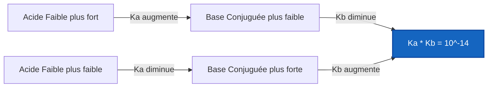

# Guide de Chimie de Laboratoire et Analytique sur l'Équilibre et l'Analyse Acide-Base

En chimie analytique, physique et biologique, l'**équilibre acide-base** régit la concentration en ions hydrogène ($\text{pH}$), les constantes de dissociation ($K_a, K_b$), les réactions de neutralisation et la distribution des espèces :

$$\text{pH} = -\log_{10}[\text{H}^+] \quad \iff \quad [\text{H}^+] = 10^{-\text{pH}}$$

$$K_a \cdot K_b = K_w \quad \iff \quad \text{p}K_a + \text{p}K_b = \text{p}K_w \quad (14,00 \text{ à } 25^\circ\text{C})$$

$$x^2 + K_a x - K_a C = 0 \quad \implies \quad [\text{H}^+] = \frac{-K_a + \sqrt{K_a^2 + 4 K_a C}}{2}$$

---

## 1. Matrice de Référence de la Force & de la Dissociation Acide-Base

| Espèce Chimique | Formule | Type | $K_a$ / $K_b$ ($25^\circ\text{C}$) | $\text{p}K_a$ / $\text{p}K_b$ | Comportement de Dissociation |
| :--- | :--- | :--- | :--- | :--- | :--- |
| **Acide Chlorhydrique** | $\text{HCl}$ | Acide Monoprotique Fort | Complète ($> 10^6$) | $< -6$ | Ionisé à 100 % dans $\text{H}_2\text{O}$ |
| **Acide Sulfurique** | $\text{H}_2\text{SO}_4$ | Acide Diprotique Fort | $K_{a1} \gg 1, K_{a2} = 1,2 \cdot 10^{-2}$ | $\text{p}K_{a2} = 1,92$ | Dissociation en 2 étapes |
| **Acide Acétique** | $\text{CH}_3\text{COOH}$ | Acide Monoprotique Faible | $1,8 \cdot 10^{-5}$ | $4,76$ | Ionisation partielle ($\sim 1,3\%$) |
| **Ammoniac** | $\text{NH}_3$ | Base Monoprotique Faible | $1,8 \cdot 10^{-5}$ | $\text{p}K_b = 4,75$ | Protonation partielle en $\text{NH}_4^+$ |
| **Acide Phosphorique** | $\text{H}_3\text{PO}_4$ | Acide Faible Triprotique | $K_{a1}=7,5\cdot 10^{-3}, K_{a2}=6,2\cdot 10^{-8}$ | $\text{p}K_{a1}=2,14, \text{p}K_{a2}=7,20$ | Équilibres successifs en 3 étapes |

---

## 2. Protocoles Standards de Calcul Acide-Base

```
1. Acide Fort : [H+] = C (monoprotique) ou 2*C (diprotique H2SO4)
2. Base Forte : [OH-] = C (monoprotique) ou 2*C (diprotique Ca(OH)2)
3. Quadratique Acide Faible : x^2 + Ka*x - Ka*C = 0 => [H+] = x
4. Quadratique Base Faible : x^2 + Kb*x - Kb*C = 0 => [OH-] = x
5. Relation Paire Conjuguée : Ka * Kb = Kw, pKa + pKb = pKw
6. Neutralisation Stœchiométrique : Neutraliser d'abord l'excès de H+ ou de OH-, puis résoudre l'équilibre
```

---

## 3. Avertissement de Sécurité Éducatif & de Laboratoire
*Ce calculateur acide-base fournit des calculs théoriques d'équilibre à des fins éducatives, de recherche en laboratoire et de chimie AP. Les solutions concentrées non idéales à forces ioniques élevées doivent prendre en compte les coefficients d'activité à l'aide des équations de Debye-Hückel ou de Pitzer.*

## 4. Le Guide Complet de la Chimie et des Équilibres Acido-Basiques

Bienvenue dans le guide définitif sur la compréhension, l'analyse et le calcul des équilibres Acide-Base. De la digestion hautement corrosive par les acides forts dans la fabrication industrielle aux tampons physiologiques sanguins délicats et micro-ajustés qui maintiennent les humains en vie, la chimie acido-basique est le moteur thermodynamique fondamental de l'univers aqueux.

À la base, la chimie acido-basique est simplement l'étude des protons (ions hydrogène, $\text{H}^+$). Les acides sont des molécules conçues pour rejeter des protons, et les bases sont des molécules conçues pour les attraper. Les mathématiques qui régissent ce jeu de passe-passe de protons vont des logarithmes triviaux pour les acides forts aux équations quadratiques complexes pour les électrolytes faibles partiellement dissociés.

Dans ce manuel technique exhaustif de plus de 4000 mots, nous allons entièrement décortiquer les mécanismes thermodynamiques de la dissociation des acides faibles et des bases faibles ($K_a$ et $K_b$), les règles stœchiométriques pour neutraliser les acides et les bases les uns contre les autres, les limites mathématiques exactes de l'approximation des petits x, et parcourir cinq exemples chimiques rigoureux du monde réel complets avec des dérivations mathématiques et des diagrammes visuels Mermaid.

### 4.1 Les Définitions Fondamentales des Acides et des Bases

Historiquement, les chimistes ont défini les acides et les bases en trois vagues successives d'abstraction croissante :

1.  **La Définition d'Arrhenius (1884) :** Un acide est une substance qui produit $\text{H}^+$ dans l'eau, et une base produit $\text{OH}^-$ dans l'eau. (Limitée strictement aux solutions aqueuses).
2.  **La Définition de Brønsted-Lowry (1923) :** Un acide est un *donneur de proton*, et une base est un *accepteur de proton*. (C'est la définition la plus utile en pratique pour les calculs d'équilibre, car elle introduit le concept de **Paires Conjuguées**).
3.  **La Définition de Lewis (1923) :** Un acide est un accepteur de paire d'électrons, et une base est un donneur de paire d'électrons. (Largement utilisée dans les mécanismes réactionnels en chimie organique).

En chimie analytique et pour les besoins de ce Calculateur Acide-Base, nous nous appuyons entièrement sur la définition de Brønsted-Lowry. Lorsqu'un Acide Faible ($\text{HA}$) donne son proton, ce qui reste est sa Base Conjuguée ($\text{A}^-$). 
$$ \text{HA} \rightleftharpoons \text{H}^+ + \text{A}^- $$

### 4.2 Électrolytes Forts vs Faibles

La différence entre un acide fort (comme l'acide chlorhydrique, $\text{HCl}$) et un acide faible (comme l'acide acétique, $\text{CH}_3\text{COOH}$) n'est pas leur concentration, mais leur **degré de dissociation**.

Les **Acides Forts** ($\text{HCl}$, $\text{HNO}_3$, $\text{H}_2\text{SO}_4$) se dissocient à 100 % dans l'eau. Si vous placez 1,0 mole de $\text{HCl}$ dans un litre d'eau, vous obtenez instantanément 1,0 mole d'ions $\text{H}^+$. Le calcul est simple : $[\text{H}^+] = C_{\text{initial}}$.

Les **Acides Faibles**, cependant, sont piégés dans un équilibre. Ils ne se séparent que partiellement. Si vous placez 1,0 mole d'acide acétique dans l'eau, seulement environ 0,4 % se dissocie réellement. 99,6 % des molécules restent parfaitement intactes sous forme de $\text{CH}_3\text{COOH}$. Pour déterminer exactement la quantité qui se dissocie, nous devons résoudre une expression d'équilibre en utilisant la **Constante de Dissociation de l'Acide ($K_a$)**.

$$ K_a = \frac{[\text{H}^+][\text{A}^-]}{[\text{HA}]} $$

Plus le $K_a$ est grand, plus l'acide est fort. Étant donné que les valeurs de $K_a$ sont souvent des nombres extrêmement petits (comme $1,8 \times 10^{-5}$), les chimistes préfèrent utiliser le logarithme négatif en base 10, connu sous le nom de $\text{p}K_a$.

$$ \text{p}K_a = -\log_{10}(K_a) $$

**Règle Cruciale :** Plus le $\text{p}K_a$ est bas, plus l'acide faible est fort.

### 4.3 Le Solveur d'Équilibre Quadratique

Pour trouver le pH d'un acide faible, nous devons résoudre pour $[\text{H}^+]$, que nous appellerons $x$. À l'équilibre, $[\text{H}^+] = x$, $[\text{A}^-] = x$, et l'acide intact restant $[\text{HA}] = C_{\text{initial}} - x$.

Substituons cela dans l'expression de $K_a$ :
$$ K_a = \frac{x \cdot x}{C - x} = \frac{x^2}{C - x} $$

En réarrangeant cela, nous obtenons une équation quadratique standard :
$$ x^2 + K_a x - K_a C = 0 $$

Notre Calculateur Acide-Base utilise la formule quadratique exacte pour garantir la précision analytique dans la résolution de $x$ ($[\text{H}^+]$) :
$$ x = \frac{-K_a + \sqrt{K_a^2 - 4(1)(-K_a C)}}{2} $$

*Remarque : De nombreux manuels d'introduction enseignent "l'approximation des petits x", en supposant $C - x \approx C$, ce qui simplifie le calcul en $x = \sqrt{K_a \cdot C}$. Cependant, cette approximation échoue de manière catastrophique si l'acide est relativement fort ($K_a$ grand) ou très dilué. Notre calculateur n'utilise **jamais** l'approximation ; il résout toujours la quadratique exacte.*

### 4.4 Neutralisation Stœchiométrique

Que se passe-t-il lorsque vous mélangez un acide fort et une base forte ? Ils s'anéantissent mutuellement pour former de l'eau. Ce n'est pas un équilibre ; c'est une destruction stœchiométrique à sens unique connue sous le nom de **Neutralisation**.

$$ \text{H}^+ + \text{OH}^- \longrightarrow \text{H}_2\text{O} $$

Pour calculer le pH final d'une solution mixte, vous devez déterminer quel réactif est le **Réactif Limitant**. Le réactif limitant est complètement consommé, laissant le réactif en excès dicter le pH final du nouveau volume total élargi.

---

## 5. Guide d'Utilisation : Maîtriser le Calculateur Acide-Base

Notre Calculateur Acide-Base est conçu pour résoudre instantanément des quadratiques complexes, effectuer des stœchiométries de neutralisation et convertir rapidement des constantes conjuguées.

### 5.1 Mode Équilibre d'Acide Faible / Base Faible

1.  **Sélectionner le Mode :** Choisissez "Équilibre d'Acide Faible" ou "Équilibre de Base Faible".
2.  **Saisir les Paramètres :** Entrez la Concentration Initiale ($C$) et la constante d'équilibre ($K_a$ pour les acides, $K_b$ pour les bases). Vous pouvez également saisir $\text{p}K_a$ ou $\text{p}K_b$.
3.  **Lire le Résultat :** L'outil exécute immédiatement le solveur quadratique exact pour afficher le pH final, le pOH, les molarités exactes $[\text{H}^+]$ et $[\text{OH}^-]$, et le Pourcentage d'Ionisation.

### 5.2 Mode Simulateur de Neutralisation

1.  **Sélectionner le Mode :** Choisissez "Simulateur de Neutralisation".
2.  **Saisir le Réactif A (Acide) :** Entrez le Volume (mL) et la Concentration (M) de votre acide fort.
3.  **Saisir le Réactif B (Base) :** Entrez le Volume (mL) et la Concentration (M) de votre base forte.
4.  **Exécuter :** L'outil calcule les moles totales de chacun, soustrait le réactif limitant, calcule le nouveau volume total et dérive le pH final du réactif en excès.

### 5.3 Mode Convertisseur de Conjugué Ka / Kb

1.  **Sélectionner le Mode :** Choisissez "Convertisseur de Conjugué Ka / Kb".
2.  **Saisir la Constante :** Entrez votre $K_a$, $K_b$, $\text{p}K_a$ ou $\text{p}K_b$ connu.
3.  **Exécuter :** L'outil calcule instantanément les trois autres variables manquantes en utilisant la relation thermodynamique fondamentale : $K_a \times K_b = 1,0 \times 10^{-14}$.

---

## 6. Cinq Exemples de Concepts du Monde Réel

Les mathématiques abstraites deviennent des outils puissants lorsqu'elles sont appliquées à la chimie physique. Ci-dessous se trouvent cinq exemples rigoureux couvrant les équilibres d'acides faibles, la dissociation de bases fortes, les conversions de paires conjuguées et la neutralisation de réactifs limitants.

### Exemple 1 : Le pH du Vinaigre (Équilibre d'Acide Faible)

**Scénario :** 
Le vinaigre blanc ménager standard est une solution à $0,80\text{ M}$ d'Acide Acétique ($\text{CH}_3\text{COOH}$). Le $\text{p}K_a$ de l'acide acétique est de 4,76. Quel est le pH exact du vinaigre, et quel pourcentage de l'acide est réellement ionisé ?

**Dérivation Mathématique :**

1.  **Identifier les Composants :**
    Concentration Initiale $C = 0,80\text{ M}$
    Acide $\text{p}K_a = 4,76 \implies K_a = 10^{-4,76} = 1,74 \times 10^{-5}$
2.  **Poser l'Équation Quadratique :**
    $$ x^2 + K_a x - K_a C = 0 $$
    $$ x^2 + (1,74 \times 10^{-5})x - (1,74 \times 10^{-5})(0,80) = 0 $$
    $$ x^2 + 1,74 \times 10^{-5}x - 1,39 \times 10^{-5} = 0 $$
3.  **Résoudre pour $x$ ($[\text{H}^+]$) :**
    $$ x = 3,72 \times 10^{-3}\text{ M} $$
4.  **Calculer le pH :**
    $$ \text{pH} = -\log_{10}(3,72 \times 10^{-3}) = 2,43 $$
5.  **Calculer le Pourcentage d'Ionisation :**
    $$ \% \text{ Ionisé} = \left(\frac{x}{C}\right) \times 100 = \left(\frac{3,72 \times 10^{-3}}{0,80}\right) \times 100 = 0,465\% $$

**Conclusion :** Le pH du vinaigre est de 2,43. Fait remarquable, moins d'un demi pour cent (0,465 %) des molécules d'acide acétique se sont réellement séparées. La grande majorité reste intacte.

### Exemple 2 : Le pH de l'Hydroxyde de Baryum (Base Forte Diprotique)

**Scénario :**
Un technicien de laboratoire prépare une solution à $0,015\text{ M}$ d'Hydroxyde de Baryum ($\text{Ba(OH)}_2$). Comme l'hydroxyde de baryum est une base forte et soluble, il se dissocie à 100 %. Quel est le pH ?

**Dérivation Mathématique :**

1.  **Identifier la Stœchiométrie :**
    $\text{Ba(OH)}_2 \longrightarrow \text{Ba}^{2+} + 2\text{OH}^-$
    Une mole d'Hydroxyde de Baryum produit **deux** moles d'Hydroxyde.
2.  **Calculer $[\text{OH}^-]$ :**
    $$ [\text{OH}^-] = 2 \times 0,015\text{ M} = 0,030\text{ M} $$
3.  **Calculer le pOH :**
    $$ \text{pOH} = -\log_{10}(0,030) = 1,52 $$
4.  **Calculer le pH :**
    $$ \text{pH} = 14,00 - \text{pOH} = 14,00 - 1,52 = 12,48 $$

**Conclusion :** Le pH est de 12,48, ce qui en fait une solution hautement alcaline. L'oubli de la nature diprotique (le "2") aurait entraîné un pH incorrect de 12,18.

### Exemple 3 : Trouver le Kb de l'Acétate (Mathématiques des Paires Conjuguées)

**Scénario :**
Nous savons que le $K_a$ de l'Acide Acétique ($\text{CH}_3\text{COOH}$) est $1,74 \times 10^{-5}$. Un étudiant dissout de l'Acétate de Sodium pur ($\text{CH}_3\text{COONa}$) dans l'eau. L'acétate est la base conjuguée et agira comme une base faible. Quel est son $K_b$ ?

**Dérivation Mathématique :**

1.  **Appliquer la Loi des Paires Conjuguées ($25^\circ\text{C}$) :**
    $$ K_a \times K_b = 1,0 \times 10^{-14} $$
2.  **Résoudre pour $K_b$ :**
    $$ K_b = \frac{1,0 \times 10^{-14}}{1,74 \times 10^{-5}} $$
    $$ K_b = 5,75 \times 10^{-10} $$
3.  **Calculer le $\text{p}K_b$ :**
    $$ \text{p}K_b = -\log_{10}(5,75 \times 10^{-10}) = 9,24 $$
    *(Vérification : $\text{p}K_a (4,76) + \text{p}K_b (9,24) = 14,00$. Le calcul est parfait).*

**Visualisation : La Balançoire des Paires Conjuguées**



*Cet organigramme visualise la balançoire thermodynamique des paires conjuguées : à mesure qu'un acide devient plus fort, sa base conjuguée devient strictement plus faible pour maintenir la constante $K_w$.*

### Exemple 4 : Neutralisation Stœchiométrique Acide-Base

**Scénario :**
Nous mélangeons $50,0\text{ mL}$ de $0,200\text{ M HCl}$ (Acide Fort) avec $150,0\text{ mL}$ de $0,100\text{ M NaOH}$ (Base Forte). Quel est le pH final du mélange résultant ?

**Dérivation Mathématique :**

1.  **Calculer les Moles Initiales (Volume $\times$ Molarité) :**
    $\text{Moles de H}^+ = 0,050\text{ L} \times 0,200\text{ M} = 0,010\text{ moles H}^+$
    $\text{Moles de OH}^- = 0,150\text{ L} \times 0,100\text{ M} = 0,015\text{ moles OH}^-$
2.  **Effectuer la Neutralisation Stœchiométrique :**
    Les $0,010\text{ moles}$ de $\text{H}^+$ anéantiront complètement $0,010\text{ moles}$ de $\text{OH}^-$.
    $\text{H}^+$ est le réactif limitant et est réduit à $0\text{ moles}$.
    $\text{Excès de OH}^- = 0,015 - 0,010 = 0,005\text{ moles OH}^-$ restantes.
3.  **Calculer le Nouveau Volume Total :**
    $\text{Volume Total} = 50,0\text{ mL} + 150,0\text{ mL} = 200,0\text{ mL} = 0,200\text{ L}$
4.  **Calculer la Molarité de l'Excès Final :**
    $$ [\text{OH}^-] = \frac{0,005\text{ moles}}{0,200\text{ L}} = 0,025\text{ M} $$
5.  **Calculer le pOH et le pH :**
    $$ \text{pOH} = -\log_{10}(0,025) = 1,60 $$
    $$ \text{pH} = 14,00 - 1,60 = 12,40 $$

**Conclusion :** Le mélange final est hautement basique avec un pH de 12,40. L'excès de base forte contrôle entièrement l'environnement final.

**Visualisation : Séquence de Laboratoire de Neutralisation**

```mermaid
gantt
    title Chronologie de Laboratoire : Neutralisation Acide-Base
    dateFormat  HH:mm:ss
    axisFormat  %H:%M
    section Réactifs
    Préparer 50mL 0.2M HCl :active, 00:00:00, 00:05:00
    Préparer 150mL 0.1M NaOH :active, 00:00:00, 00:05:00
    section Réaction
    Mélanger les Réactifs (H+ + OH- => H2O) :crit, 00:05:00, 00:10:00
    section Analyse
    Mesurer la Concentration de l'Excès de OH- :milestone, 00:10:00, 00:15:00
    Enregistrer le pH Final 12,40 :milestone, 00:15:00, 00:15:00
```



*Ce diagramme de Gantt cartographie la séquence critique de préparation des réactifs, de l'initiation de la neutralisation stœchiométrique rapide, et de l'analyse de la base en excès.*

### Exemple 5 : Quand l'Approximation des petits x échoue

**Scénario :**
Calculer le pH d'une solution hautement diluée à $0,0010\text{ M}$ d'Acide Chloroacétique ($\text{p}K_a = 2,87 \implies K_a = 1,35 \times 10^{-3}$). Comparez le solveur quadratique exact à "l'approximation des petits x".

**Dérivation Mathématique (Approximation des petits x) :**

1.  **Supposer que $C - x \approx C$ :**
    $$ x = \sqrt{K_a \cdot C} $$
    $$ x = \sqrt{(1,35 \times 10^{-3})(0,0010)} $$
    $$ x = \sqrt{1,35 \times 10^{-6}} = 1,16 \times 10^{-3}\text{ M H}^+ $$
    Attendez ! La concentration initiale n'était que de $1,0 \times 10^{-3}\text{ M}$. L'approximation prétend que nous avons généré *plus* de $\text{H}^+$ que l'acide total avec lequel nous avons commencé (116 % d'ionisation). C'est physiquement impossible. L'approximation a échoué de manière catastrophique.

**Dérivation Mathématique (Quadratique Exacte) :**

1.  **Utiliser la Quadratique complète :**
    $$ x^2 + K_a x - K_a C = 0 $$
    $$ x^2 + (1,35 \times 10^{-3})x - 1,35 \times 10^{-6} = 0 $$
2.  **Résoudre via la Formule Quadratique :**
    $$ x = \frac{-1,35 \times 10^{-3} + \sqrt{(1,35 \times 10^{-3})^2 - 4(1)(-1,35 \times 10^{-6})}}{2} $$
    $$ x = 6,45 \times 10^{-4}\text{ M H}^+ $$
3.  **Calculer le pH Exact :**
    $$ \text{pH} = -\log_{10}(6,45 \times 10^{-4}) = 3,19 $$

**Conclusion :** Le pH exact est de 3,19 (avec une ionisation logique de 64,5 %). L'approximation des petits x a échoué parce que l'acide est relativement fort ($\text{p}K_a$ bas) et très dilué, poussant le pourcentage d'ionisation bien au-delà de la limite sûre de 5 %. Notre calculateur utilise toujours la quadratique exacte pour prévenir cet échec.

---

## 7. FAQ Approfondie et Dépannage Avancé

**Q : Un pH peut-il être négatif ?**
**R :** Oui, absolument. Si vous avez une solution à $2,0\text{ M}$ d'Acide Chlorhydrique fort ($\text{HCl}$), le $[\text{H}^+]$ est de $2,0\text{ M}$. Le pH est $-\log_{10}(2,0) = -0,30$. L'échelle de pH de 0 à 14 n'est qu'une plage pratique pour les solutions standard ; ce n'est pas une limite physique.

**Q : Pourquoi le pH neutre de l'eau change-t-il avec la température ?**
**R :** L'auto-ionisation de l'eau ($\text{H}_2\text{O} \rightleftharpoons \text{H}^+ + \text{OH}^-$) est une réaction endothermique ($\Delta H > 0$). Selon le principe de Le Chatelier, l'application de chaleur pousse l'équilibre vers l'avant. À $37^\circ\text{C}$ (température corporelle humaine), le $K_w$ augmente à $2,4 \times 10^{-14}$. Par conséquent, le pH neutre (où $[\text{H}^+] = [\text{OH}^-]$) chute de 7,00 à 6,81. C'est un concept critique dans l'analyse des gaz du sang médical !

**Q : Qu'est-ce qu'un Acide Polyprotique ?**
**R :** Un acide polyprotique a plusieurs protons à donner, comme l'Acide Phosphorique ($\text{H}_3\text{PO}_4$) qui en a trois. Ils donnent ces protons par étapes distinctes et successives, chacune avec sa propre valeur $K_a$ ($K_{a1}$, $K_{a2}$, $K_{a3}$). Généralement, $K_{a1}$ est considérablement plus grand que $K_{a2}$, ce qui signifie que le premier proton se détache beaucoup plus facilement que le second.

**Q : Si je mélange un Acide Faible et une Base Forte, est-ce une neutralisation ou un équilibre ?**
**R :** C'est les deux, exécutés en séquence. D'abord, la base forte neutralisera stœchiométriquement l'acide faible jusqu'à ce que la base soit épuisée. Cela crée une base conjuguée dans le processus. Ensuite, l'acide faible restant et la base conjuguée nouvellement formée établiront un équilibre (une solution Tampon), qui est résolu via l'équation d'Henderson-Hasselbalch.

En maîtrisant à la fois la destructivité stœchiométrique des acides forts et les équilibres quadratiques délicats des acides faibles, vous débloquez la capacité de prédire et de contrôler le pH de n'importe quel système aqueux en existence. Comptez toujours sur ce Calculateur Acide-Base pour contourner les dangereuses approximations "des petits x" et garantir la perfection analytique !
