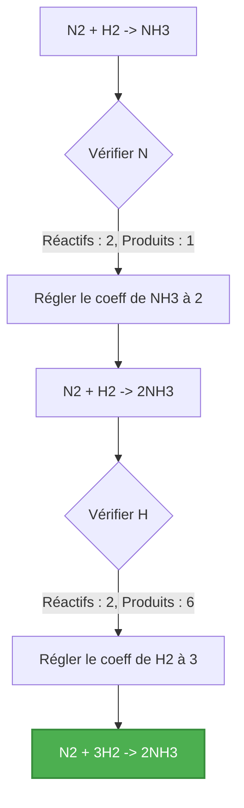

# Guide de Chimie Analytique et de Laboratoire pour l'Équilibrage des Équations Chimiques

En stœchiométrie quantitative et en génie chimique, **l'Équilibrage des Équations Chimiques** applique la **Loi de Conservation de la Masse** :

$$\sum \text{Atomes des Réactifs} = \sum \text{Atomes des Produits} \quad \text{pour chaque élément } E$$

$$\mathbf{A} \cdot \mathbf{x} = \mathbf{0} \implies \text{Solution du Noyau Réduite aux Plus Petits Entiers}$$

---

## 1. Types de Réactions Chimiques Standards & Exemples

| Type de Réaction | Équation Non Équilibrée | Équation Équilibrée | Rapport Stœchiométrique |
| :--- | :--- | :--- | :--- |
| **Synthèse de l'Eau** | $\text{H}_2 + \text{O}_2 \to \text{H}_2\text{O}$ | $2\text{H}_2 + \text{O}_2 \to 2\text{H}_2\text{O}$ | $2 : 1 : 2$ |
| **Combustion du Méthane** | $\text{CH}_4 + \text{O}_2 \to \text{CO}_2 + \text{H}_2\text{O}$ | $\text{CH}_4 + 2\text{O}_2 \to \text{CO}_2 + 2\text{H}_2\text{O}$ | $1 : 2 : 1 : 2$ |
| **Combustion du Propane** | $\text{C}_3\text{H}_8 + \text{O}_2 \to \text{CO}_2 + \text{H}_2\text{O}$ | $\text{C}_3\text{H}_8 + 5\text{O}_2 \to 3\text{CO}_2 + 4\text{H}_2\text{O}$ | $1 : 5 : 3 : 4$ |
| **Rouille du Fer** | $\text{Fe} + \text{O}_2 \to \text{Fe}_2\text{O}_3$ | $4\text{Fe} + 3\text{O}_2 \to 2\text{Fe}_2\text{O}_3$ | $4 : 3 : 2$ |
| **Remplacement Simple** | $\text{Al} + \text{HCl} \to \text{AlCl}_3 + \text{H}_2$ | $2\text{Al} + 6\text{HCl} \to 2\text{AlCl}_3 + 3\text{H}_2$ | $2 : 6 : 2 : 3$ |

---

## 2. Protocole Standard d'Équilibrage des Équations

```
   Étape 1 : Écrire les formules chimiques correctes pour tous les réactifs et produits.
   Étape 2 : Compter le nombre d'atomes de chaque élément des deux côtés de l'équation.
   Étape 3 : Insérer des coefficients entiers devant les formules pour équilibrer les éléments un par un.
   Étape 4 : Ne JAMAIS changer les indices des formules (par ex. changer H2O en H2O2 est interdit).
   Étape 5 : Réduire les coefficients en divisant par leur Plus Grand Commun Diviseur (PGCD).
   Étape 6 : Vérifier que le Total des Atomes des Réactifs = Total des Atomes des Produits pour tous les éléments.
```

---

## 3. Avis de Non-responsabilité Pédagogique et de Sécurité en Laboratoire
*Cet équilibreur d'équations chimiques fournit des calculs stœchiométriques automatisés pour des applications éducatives, de recherche en laboratoire et de chimie AP. Les mécanismes de réaction industriels complexes doivent être vérifiés par rapport aux références scientifiques standard.*

## 4. Le Guide Complet pour Équilibrer les Équations Chimiques

Bienvenue dans la ressource ultime pour comprendre, maîtriser et résoudre automatiquement les équations chimiques. Que vous soyez un lycéen apprenant la loi fondamentale de conservation de la masse, un étudiant en chimie AP s'attaquant à des demi-réactions d'oxydoréduction complexes, ou un ingénieur chimiste professionnel modélisant une synthèse industrielle, l'équilibrage des équations est le fondement des mathématiques chimiques.

À la base, la chimie est une question de transformation. Les réactifs entrent en collision, les liaisons se brisent, les atomes se réarrangent et de nouveaux produits se forment. Cependant, comme la matière ne peut être ni créée ni détruite, chaque atome qui entre dans une réaction doit en sortir. Ce principe immuable dicte que les équations chimiques doivent être parfaitement équilibrées.

Dans ce guide exhaustif, nous plongerons au cœur de la mécanique de la stœchiométrie, explorerons les puissants algorithmes d'algèbre linéaire utilisés par notre calculatrice pour résoudre n'importe quelle réaction, et parcourrons cinq exemples détaillés du monde réel complets avec des dérivations mathématiques et des diagrammes 2D.

### 4.1 La Loi de Conservation de la Masse

En 1789, Antoine Lavoisier a établi la Loi de Conservation de la Masse, qui stipule que dans un système fermé, la masse n'est ni créée ni détruite par des réactions chimiques ou des transformations physiques.

Appliqué aux équations chimiques, cela signifie que la masse des réactifs doit être égale à la masse des produits. Plus précisément, le nombre exact d'atomes pour chaque élément individuel du côté gauche de la flèche de réaction (réactifs) doit parfaitement correspondre au nombre d'atomes du côté droit (produits).

Si vous écrivez une équation squelettique comme $\text{H}_2 + \text{O}_2 \to \text{H}_2\text{O}$, vous pouvez voir qu'il y a deux atomes d'oxygène à gauche, mais un seul à droite. Cela représente un scénario impossible où un atome d'oxygène aurait simplement disparu de l'existence. Pour résoudre ce problème, nous devons équilibrer l'équation.

### 4.2 Coefficients vs. Indices

La règle d'or de l'équilibrage des équations est de **ne jamais modifier les indices** d'une formule chimique.
*   **Les indices** (les petits nombres en bas à droite du symbole d'un élément) dictent l'identité chimique réelle d'une substance. Par exemple, changer l'indice de $\text{H}_2\text{O}$ à $\text{H}_2\text{O}_2$ transforme la substance de l'eau vitale en peroxyde d'hydrogène toxique.
*   **Les coefficients** (les grands nombres placés directement devant les formules chimiques) dictent la quantité ou le rapport molaire de cette molécule spécifique dans la réaction.

Pour équilibrer $\text{H}_2 + \text{O}_2 \to \text{H}_2\text{O}$, nous plaçons un coefficient de 2 devant l'eau pour équilibrer l'oxygène, et un 2 devant l'hydrogène gazeux pour rééquilibrer l'hydrogène, ce qui donne : $2\text{H}_2 + \text{O}_2 \to 2\text{H}_2\text{O}$.

### 4.3 La Méthode de la Matrice d'Algèbre Linéaire

Bien que les équations simples puissent être équilibrées par inspection (essais et erreurs), les réactions d'oxydoréduction hautement complexes ou les équations de combustion avec des hydrocarbures massifs peuvent être très difficiles à résoudre manuellement.

Notre Calculatrice d'Équilibrage d'Équations Chimiques utilise des **mathématiques avancées d'algèbre linéaire et de matrices**. L'algorithme traite chaque élément comme une ligne et chaque molécule comme une colonne dans une matrice. Il configure ensuite un système d'équations linéaires représentant la conservation de chaque élément et résout le noyau de la matrice.

Parce que les molécules fractionnaires n'existent pas dans la stœchiométrie standard, l'algorithme calcule ensuite le plus petit commun multiple pour mettre à l'échelle la solution matricielle en les plus petits nombres entiers positifs possibles (l'étape de réduction du Plus Grand Commun Diviseur). Cela garantit une précision mathématique à 100 % pour toute équation chimique valide que vous saisissez.

---

## 5. Guide d'Utilisation : Maîtriser l'Équilibreur d'Équations

Notre Calculatrice d'Équilibrage d'Équations Chimiques est conçue avec un "Cockpit Interactif" intuitif qui fournit à la fois des réponses instantanées et de profondes informations pédagogiques.

### 5.1 Fonctionnement de Base

1.  **Entrez votre Équation Squelettique :** Utilisez la notation chimique standard. Par exemple, tapez `C6H12O6 + O2 -> CO2 + H2O`. Vous n'avez pas à vous soucier du formatage des indices ; l'analyseur s'en charge automatiquement.
2.  **Utilisez la Bonne Syntaxe :** Mettez toujours la première lettre d'un élément en majuscule (par ex., `Na` pour le sodium, pas `na` ou `NA`). Utilisez `->`, `=`, ou `=>` pour séparer les réactifs des produits.
3.  **Cliquez sur "Équilibrer l'Équation" :** Le moteur calculera instantanément les coefficients.

### 5.2 Fonctionnalités et Modes Avancés

*   **Matrice de Conservation des Atomes :** Sous la sortie équilibrée, vous trouverez une matrice qui compte le nombre exact d'atomes de chaque élément des deux côtés de l'équation. Cela agit comme une preuve mathématique que l'équation est équilibrée.
*   **Équilibrage Redox et des Charges :** Si vous saisissez des équations ioniques (par ex., `Cu + Ag+ -> Cu2+ + Ag`), la calculatrice équilibrera non seulement les atomes, mais s'assurera également que la charge électrique nette est conservée des deux côtés.
*   **Outil d'Équation Ionique Nette :** Ce mode vous permet de saisir des équations ioniques complètes. La calculatrice identifiera les "ions spectateurs" (les ions qui apparaissent de manière identique des deux côtés) et les supprimera automatiquement pour fournir l'équation ionique nette simplifiée.

---

## 6. Cinq Exemples de Concepts du Monde Réel

Pour vraiment maîtriser la stœchiométrie chimique, vous devez voir ces principes appliqués à différents types de réactions chimiques. Vous trouverez ci-dessous cinq exemples détaillés représentant différentes classifications de réactions, complétés par des dérivations visuelles.

### Exemple 1 : La Combustion du Propane

**Scénario :**
Le propane ($\text{C}_3\text{H}_8$) est couramment utilisé dans les barbecues extérieurs et le chauffage domestique. Lorsqu'il brûle en présence d'oxygène ($\text{O}_2$), il produit du dioxyde de carbone ($\text{CO}_2$) et de la vapeur d'eau ($\text{H}_2\text{O}$). Nous devons équilibrer cette réaction de combustion.

**Équation Non Équilibrée :**
$\text{C}_3\text{H}_8 + \text{O}_2 \to \text{CO}_2 + \text{H}_2\text{O}$

**Dérivation Étape par Étape :**

1.  **Équilibrer le Carbone (C) :** Il y a 3 carbones à gauche, nous plaçons donc un 3 devant $\text{CO}_2$.
    *   $\text{C}_3\text{H}_8 + \text{O}_2 \to 3\text{CO}_2 + \text{H}_2\text{O}$
2.  **Équilibrer l'Hydrogène (H) :** Il y a 8 hydrogènes à gauche, nous plaçons donc un 4 devant $\text{H}_2\text{O}$.
    *   $\text{C}_3\text{H}_8 + \text{O}_2 \to 3\text{CO}_2 + 4\text{H}_2\text{O}$
3.  **Équilibrer l'Oxygène (O) :** Sur la droite, nous avons $(3 \times 2) = 6$ atomes d'oxygène provenant du $\text{CO}_2$ et $(4 \times 1) = 4$ atomes d'oxygène de l'eau. Total = 10. Pour obtenir 10 oxygènes à gauche, nous plaçons un 5 devant $\text{O}_2$.
    *   $\text{C}_3\text{H}_8 + 5\text{O}_2 \to 3\text{CO}_2 + 4\text{H}_2\text{O}$

**Visualisation : Matrice de Comptage des Atomes**

| Élément | Réactifs | Produits | Statut |
| :--- | :--- | :--- | :--- |
| **Carbone (C)** | $1 \times 3 = 3$ | $3 \times 1 = 3$ | Équilibré |
| **Hydrogène (H)** | $1 \times 8 = 8$ | $4 \times 2 = 8$ | Équilibré |
| **Oxygène (O)** | $5 \times 2 = 10$ | $6 + 4 = 10$ | Équilibré |

*Ce tableau confirme que la Loi de Conservation de la Masse est strictement respectée.*

### Exemple 2 : Le Processus Haber-Bosch (Synthèse)

**Scénario :**
Le processus Haber-Bosch est l'une des réactions industrielles les plus importantes de l'histoire, synthétisant l'ammoniac ($\text{NH}_3$) à partir de l'azote ($\text{N}_2$) et de l'hydrogène ($\text{H}_2$) gazeux pour produire des engrais agricoles.

**Équation Non Équilibrée :**
$\text{N}_2 + \text{H}_2 \to \text{NH}_3$

**Dérivation Étape par Étape :**

1.  **Équilibrer l'Azote (N) :** Il y a 2 azotes à gauche. Placez un 2 devant $\text{NH}_3$.
    *   $\text{N}_2 + \text{H}_2 \to 2\text{NH}_3$
2.  **Équilibrer l'Hydrogène (H) :** Maintenant il y a $(2 \times 3) = 6$ hydrogènes à droite. Placez un 3 devant $\text{H}_2$ pour l'équilibrer.
    *   $\text{N}_2 + 3\text{H}_2 \to 2\text{NH}_3$

**Visualisation : Flux Logique Algorithmique**



*Cet organigramme imite la logique d'inspection algorithmique utilisée pour des équations de synthèse plus simples.*

### Exemple 3 : La Photosynthèse (Réaction Biologique Complexe)

**Scénario :**
Les plantes captent l'énergie solaire pour convertir le dioxyde de carbone et l'eau en glucose et en oxygène gazeux. C'est un processus biochimique massif en plusieurs étapes, mais l'équation chimique globale nette doit toujours être équilibrée.

**Équation Non Équilibrée :**
$\text{CO}_2 + \text{H}_2\text{O} \to \text{C}_6\text{H}_{12}\text{O}_6 + \text{O}_2$

**Dérivation Étape par Étape :**

1.  **Équilibrer le Carbone :** Placez un 6 devant $\text{CO}_2$.
    *   $6\text{CO}_2 + \text{H}_2\text{O} \to \text{C}_6\text{H}_{12}\text{O}_6 + \text{O}_2$
2.  **Équilibrer l'Hydrogène :** Placez un 6 devant $\text{H}_2\text{O}$.
    *   $6\text{CO}_2 + 6\text{H}_2\text{O} \to \text{C}_6\text{H}_{12}\text{O}_6 + \text{O}_2$
3.  **Équilibrer l'Oxygène :** Le côté gauche a maintenant $(6 \times 2) = 12$ venant du $\text{CO}_2$ et $(6 \times 1) = 6$ de l'eau, totalisant 18 atomes d'oxygène. Le côté droit en a 6 dans le glucose. Nous avons besoin de 12 de plus venant du gaz $\text{O}_2$, donc nous plaçons un 6 devant celui-ci.
    *   $6\text{CO}_2 + 6\text{H}_2\text{O} \to \text{C}_6\text{H}_{12}\text{O}_6 + 6\text{O}_2$

### Exemple 4 : Remplacement Simple et Conservation des Charges

**Scénario :**
Un morceau solide de métal d'aluminium est plongé dans une solution de sulfate de cuivre(II). L'aluminium, plus réactif, remplace le cuivre, précipitant du cuivre solide hors de la solution.

**Équation Non Équilibrée :**
$\text{Al} + \text{CuSO}_4 \to \text{Al}_2(\text{SO}_4)_3 + \text{Cu}$

**Dérivation Étape par Étape :**

1.  Au lieu d'équilibrer les atomes S et O individuels, traitez l'ion polyatomique sulfate ($\text{SO}_4$) comme une unité unique car il ne se brise pas.
2.  **Équilibrer le Sulfate ($\text{SO}_4$) :** Il y a 3 sulfates à droite. Placez un 3 devant $\text{CuSO}_4$.
    *   $\text{Al} + 3\text{CuSO}_4 \to \text{Al}_2(\text{SO}_4)_3 + \text{Cu}$
3.  **Équilibrer le Cuivre (Cu) :** Placez un 3 devant le Cu à droite.
    *   $\text{Al} + 3\text{CuSO}_4 \to \text{Al}_2(\text{SO}_4)_3 + 3\text{Cu}$
4.  **Équilibrer l'Aluminium (Al) :** Placez un 2 devant l'Al à gauche.
    *   $2\text{Al} + 3\text{CuSO}_4 \to \text{Al}_2(\text{SO}_4)_3 + 3\text{Cu}$

### Exemple 5 : Décomposition de l'Azoture de Sodium (Airbags)

**Scénario :**
Dans les airbags automobiles, une décomposition chimique rapide doit gonfler le coussin en quelques millisecondes. L'azoture de sodium ($\text{NaN}_3$) est allumé électriquement pour se décomposer rapidement en sodium solide et en azote gazeux.

**Équation Non Équilibrée :**
$\text{NaN}_3 \to \text{Na} + \text{N}_2$

**Dérivation Étape par Étape :**

1.  **Équilibrer l'Azote :** Nous avons 3 azotes à gauche et 2 à droite. Le plus petit commun multiple est 6. Donc, nous avons besoin de 6 azotes des deux côtés.
2.  Placez un 2 devant $\text{NaN}_3$ et un 3 devant $\text{N}_2$.
    *   $2\text{NaN}_3 \to \text{Na} + 3\text{N}_2$
3.  **Équilibrer le Sodium :** Placez un 2 devant le Na à droite.
    *   $2\text{NaN}_3 \to 2\text{Na} + 3\text{N}_2$

**Visualisation : Chronologie du Déploiement de l'Airbag**

```mermaid
gantt
    title Chronologie de la Réaction : Déploiement de l'Airbag
    dateFormat  HH:mm:ss
    axisFormat  %S.%L
    section Initialisation
    Capteur d'Impact Déclenché :active, 00:00:00, 00:00:01
    Allumage Électrique :crit, 00:00:01, 00:00:02
    section Décomposition
    Décomposition de 2NaN3 :active, 00:00:02, 00:00:04
    Expansion du Gaz Azote (3N2) :done, 00:00:03, 00:00:05
    section Gonflage
    Déploiement Complet de l'Airbag :milestone, 00:00:05, 00:00:05
```



*Ce diagramme de Gantt montre l'application physique en temps réel de la réaction équilibrée. Le coefficient important de 3 pour l'azote gazeux assure une expansion massive et rapide du volume pour protéger le passager.*

---

## 7. FAQ Approfondie et Dépannage Avancé

**Q : La calculatrice affiche "Équation Impossible". Qu'est-ce que cela signifie ?**
**R :** Cela se produit lorsque votre équation viole la Loi de Conservation de la Masse à un niveau fondamental. Par exemple, si vous saisissez $\text{Na} \to \text{Cl}_2$, la calculatrice le signalera comme impossible car la matière ne peut pas se transmuter du sodium au chlore. Il vous manque une source de chlore dans vos réactifs, ou un produit sodé.

**Q : Dois-je écrire les symboles d'état (s, l, g, aq) ?**
**R :** Notre calculatrice ignore les symboles d'état aux fins de l'équilibrage stœchiométrique. Vous pouvez les inclure, mais l'algorithme de la matrice n'analyse que la composition élémentaire pour générer les coefficients.

**Q : Puis-je utiliser des coefficients fractionnaires ?**
**R :** Mathématiquement, oui (par ex. $\text{H}_2 + 0.5\text{O}_2 \to \text{H}_2\text{O}$ est parfaitement équilibrée). C'est courant en thermodynamique pour montrer la formation d'une mole d'une substance. Cependant, notre calculatrice utilise par défaut les conventions IUPAC standard, qui exigent les plus petits nombres entiers. Si la matrice d'algèbre linéaire donne une fraction, la calculatrice multiplie automatiquement l'équation entière pour l'éliminer.

**Q : Comment cette calculatrice gère-t-elle les ions spectateurs ?**
**R :** Lors de l'utilisation de l'outil Ionique Net, l'algorithme décompose tous les composés aqueux (solubles) en leurs ions constitutifs. Il compare ensuite les côtés gauche et droit. Tout ion qui existe exactement dans le même état et avec la même charge des deux côtés est mathématiquement annulé, ne laissant que les participants actifs de la réaction.

**Q : L'équilibrage des équations est-il lié aux moles ?**
**R :** Absolument. Les coefficients dans une équation équilibrée représentent les rapports molaires des substances impliquées. Dans l'équation $2\text{H}_2 + \text{O}_2 \to \text{H}_2\text{O}$, cela vous indique que 2 moles d'hydrogène gazeux réagissent avec 1 mole d'oxygène gazeux pour produire 2 moles d'eau. C'est le fondement de tous les calculs stœchiométriques. (Pour plus de détails, visitez notre [Calculatrice de Moles](/mole-calculator) ou [Calculatrice de Stœchiométrie](/stoichiometry-calculator)).

En comprenant la rigueur mathématique derrière l'équilibrage des équations chimiques, vous vous équipez de l'outil analytique le plus important en chimie. Assurez-vous d'utiliser cette calculatrice pour vérifier vos devoirs, vos pré-laboratoires et vos dérivations redox complexes !
