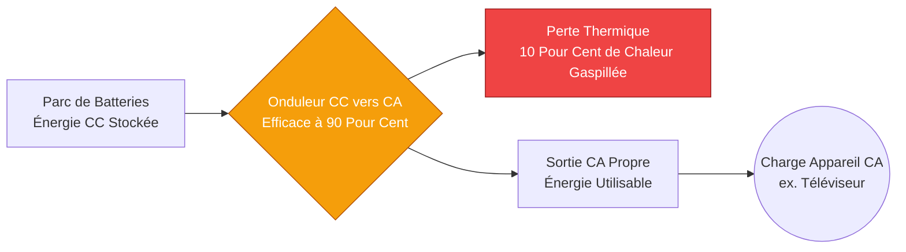
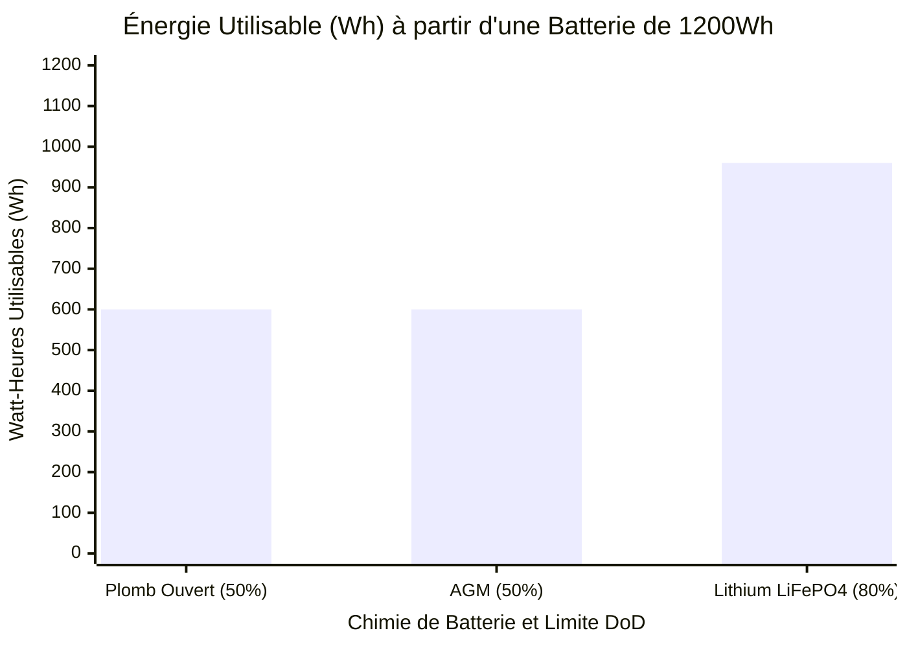
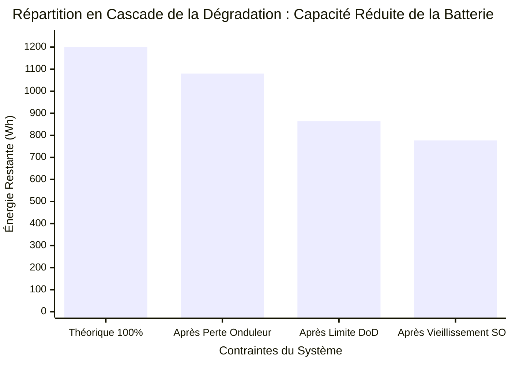
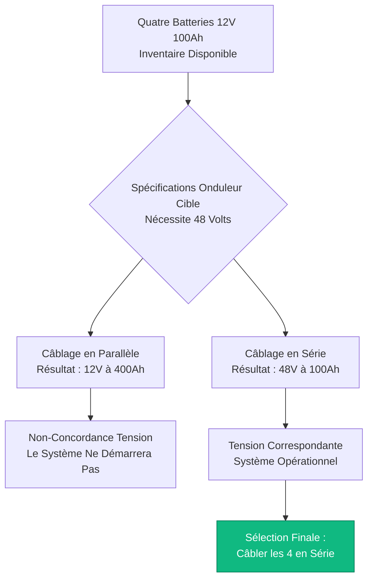
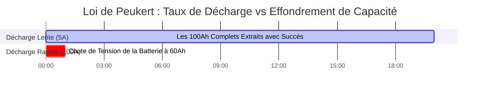

# Le Calculateur d'Autonomie de Batterie Définitif : Dimensionnement de Capacité, Pertes d'Onduleur et Loi de Peukert

Bienvenue dans l'ultime **Calculateur d'Autonomie de Batterie** et le guide d'ingénierie complet sur le stockage d'énergie. Que vous soyez un architecte solaire hors réseau dimensionnant un énorme parc de batteries LiFePO4 de $48\text{V}$ pour une cabane isolée, un administrateur informatique calculant la fenêtre de sauvegarde exacte de l'onduleur requise pour éteindre en toute sécurité une baie de serveurs, ou un amateur d'électronique alimentant un Raspberry Pi avec une cellule lithium-ion $18650$, la maîtrise de la physique de décharge de la batterie est absolument essentielle.

Les batteries sont incroyablement trompeuses. Une étiquette qui imprime clairement "$12\text{V}$ $100\text{Ah}$" ne garantit pas que vous extrairez réellement $1200\text{ Watt-heures}$ d'énergie. Si vous divisez aveuglément la capacité par la puissance de la charge, votre système tombera en panne prématurément, vos onduleurs basculeront en Déconnexion à Basse Tension, et vous détruirez définitivement la chimie de votre parc de batteries.

Dans cette masterclass SEO exhaustive de plus de 4 000 mots, nous déconstruirons les mathématiques fondamentales de conversion $Ah \to Wh$, exposerons la brutale réalité de la Répartition en Cascade de la Dégradation (Efficacité de l'Onduleur, Profondeur de Décharge et État de Santé), décoderons la physique non linéaire terrifiante de la loi de Peukert dans les batteries au plomb, et prouverons mathématiquement comment câbler correctement les chaînes en série et en parallèle. Pour vous assurer de bien comprendre ces concepts d'ingénierie, nous avons inclus cinq diagrammes interactifs Mermaid.js méticuleusement détaillés.

---

## 1. La Physique de l'Énergie Stockée (Ampères-heures vs Watt-heures)

L'erreur la plus courante commise par les novices lors du calcul de l'autonomie de la batterie est de se fier aux Ampères-heures (Ah) sans tenir compte de la tension du système. Un Ampère-heure est simplement une mesure de charge électrique. Pour calculer le travail réel (Énergie), vous devez convertir les Ampères-heures en **Watt-heures (Wh)**.

**L'Équation Énergétique Fondamentale :**
$$\text{Énergie (Wh)} = \text{Tension (V)} \times \text{Capacité (Ah)}$$

Pourquoi est-ce critique ?
- Une batterie de $12\text{V}$ $100\text{Ah}$ contient $1200\text{ Wh}$ d'énergie.
- Une batterie de $24\text{V}$ $50\text{Ah}$ contient $1200\text{ Wh}$ d'énergie.
- Même si la batterie de $12\text{V}$ a le double d'"Ampères-heures", les deux batteries contiennent exactement la même quantité totale d'énergie électrique et alimenteront une charge de $100\text{W}$ pendant exactement le même laps de temps.

Normalisez toujours vos calculs en Watt-heures. C'est la seule véritable mesure de la capacité de stockage d'une batterie.

---

## 2. La Répartition en Cascade de la Dégradation : Pourquoi l'Autonomie Théorique est un Mensonge

Si vous avez une batterie de $1200\text{Wh}$ et un téléviseur de $100\text{W}$, des mathématiques simples suggèrent que vous avez $12\text{ heures}$ d'autonomie. **C'est complètement faux.**

Dans le monde réel, l'énergie doit se frayer un chemin à travers une série de goulets d'étranglement physiques avant d'atteindre votre appareil. Nous appelons cela la **Répartition en Cascade de la Dégradation**.

1. **Perte d'Efficacité de l'Onduleur ($\eta$) :** Les batteries produisent du Courant Continu (CC). Les téléviseurs nécessitent du Courant Alternatif (CA). Vous devez utiliser un Onduleur (ou inverseur) pour inverser le courant. Les onduleurs sont généralement efficaces à $85\%$ ou $90\%$. Les $10\%$ manquants sont violemment brûlés sous forme de chaleur thermique. Pour alimenter un téléviseur CA de $100\text{W}$, l'onduleur tirera en fait $111\text{W}$ de la batterie.
2. **Profondeur de Décharge (DoD) :** Vous ne pouvez pas vider une batterie à $0\%$. Cela causerait des dommages chimiques irréversibles. Les batteries au Plomb Ouvert ne peuvent être vidées qu'à $50\%$ de DoD. Les batteries modernes LiFePO4 (Lithium Fer Phosphate) peuvent être vidées à $80\%$ ou $90\%$ de DoD. Si vous avez une batterie au plomb de $1200\text{Wh}$, vous n'avez que $600\text{Wh}$ d'énergie utilisable.
3. **État de Santé (SOH) :** Lorsqu'une batterie vieillit, sa capacité interne diminue. Une batterie avec une évaluation SOH de $80\%$ a perdu définitivement $20\%$ de sa capacité d'usine.

**L'Équation d'Autonomie en Conditions Réelles :**
$$\text{Énergie Utilisable (Wh)} = \text{Wh Totaux} \times \text{DoD \%} \times \text{SOH \%}$$
$$\text{Autonomie Réelle (Heures)} = \frac{\text{Énergie Utilisable (Wh)}}{\text{Puissance de la Charge (W)} / \text{Efficacité de l'Onduleur}}$$

---

## 3. Le Cauchemar de la Loi de Peukert (Plomb Uniquement)

Si vous utilisez des batteries au Plomb, AGM ou Gel, vous devez faire face à l'une des règles les plus frustrantes de l'ingénierie électrique : **la Loi de Peukert**.

En 1897, le scientifique Wilhelm Peukert a découvert que la capacité d'une batterie au plomb diminue mathématiquement lorsqu'on la décharge rapidement. 
Une batterie au plomb de $100\text{Ah}$ est testée à un taux de décharge très lent de $20\text{ heures}$ ($5\text{ Ampères}$).
- Si vous tirez $5\text{ Ampères}$, la batterie fournit l'intégralité des $100\text{Ah}$.
- Si vous tirez $50\text{ Ampères}$ (une décharge à grande vitesse), les réactions chimiques internes ne peuvent pas suivre le rythme. La tension s'effondre et la batterie ne fournira que $60\text{Ah}$ avant de s'éteindre.

**L'Équation de Peukert :**
$$T = H \times \left( \frac{C}{I \times H} \right)^n$$
Où $n$ est l'Exposant de Peukert (généralement $1,15$ à $1,30$ pour le Plomb).

*Note d'ingénierie :* C'est pourquoi l'industrie solaire a massivement migré vers **le Lithium (LiFePO4)**. Les batteries au lithium ont un exposant de Peukert d'environ $1,00$ à $1,05$. Que vous déchargiez une batterie au Lithium sur $20\text{ heures}$ ou $1\text{ heure}$, vous en extrairez près de $100\%$ de sa capacité nominale.

---

## 4. Conception de Parcs de Batteries en Série et en Parallèle

Lorsqu'une seule batterie ne peut pas fournir suffisamment de Tension ou suffisamment d'Ampères-heures, vous devez câbler plusieurs batteries ensemble pour créer un **Parc de Batteries**. 

**Règle 1 : Câblage en Série (Augmente la Tension)**
Lorsque vous connectez la borne Positive de la Batterie A à la borne Négative de la Batterie B, vous câblez en série.
- **Tension :** S'additionne ($12\text{V} + 12\text{V} = 24\text{V}$).
- **Capacité :** Reste exactement la même ($100\text{Ah} + 100\text{Ah} = 100\text{Ah}$).
- *Pourquoi ?* Une tension plus élevée vous permet d'utiliser des câbles en cuivre plus fins et des régulateurs de charge solaire plus petits.

**Règle 2 : Câblage en Parallèle (Augmente la Capacité)**
Lorsque vous connectez le Positif au Positif et le Négatif au Négatif, vous câblez en parallèle.
- **Tension :** Reste exactement la même ($12\text{V} + 12\text{V} = 12\text{V}$).
- **Capacité :** S'additionne ($100\text{Ah} + 100\text{Ah} = 200\text{Ah}$).

**Règle 3 : La Règle d'Or des Parcs de Batteries**
**Ne mélangez jamais les chimies, les âges ou les capacités de batteries.** Si vous câblez une batterie LiFePO4 de $100\text{Ah}$ toute neuve en parallèle avec une batterie AGM de $80\text{Ah}$ de 5 ans, elles se battront violemment. La batterie au lithium tentera de charger agressivement la batterie AGM jusqu'à ce que l'une d'elles surchauffe de manière critique et dégaze.

---

## 5. Cinq Scénarios d'Ingénierie Conceptuelle avec Visualisations 2D

Pour maîtriser pleinement les relations physiques régissant l'Autonomie de la Batterie, nous explorerons cinq scénarios d'ingénierie distincts, visuellement décomposés à l'aide de diagrammes Mermaid.js personnalisés.

### Exemple 1 : Le Pipeline de Conversion d'Énergie

**Le Scénario :**
Le propriétaire d'une cabane hors réseau doit comprendre exactement comment l'alimentation CC de la batterie est convertie, taxée par l'inefficacité de l'onduleur et livrée à un téléviseur CA standard.

**Visualisation 2D :**
Cet organigramme logique mappe le flux physique de l'énergie, démontrant clairement l'inévitable perte de chaleur thermique qui se produit pendant le processus d'inversion CC vers CA.

---

### Exemple 2 : L'Écart de Profondeur de Décharge (DoD) selon la Chimie

**Le Scénario :**
Un entrepreneur solaire doit présenter une analyse de rentabilisation à un client prouvant pourquoi les batteries au Lithium (LiFePO4) sont nettement moins chères sur une durée de vie de 10 ans que les batteries au Plomb standard, malgré un coût initial plus élevé.

**Les Mathématiques :**
Une batterie au plomb de $100\text{Ah}$ donne $50\text{Ah}$ de capacité utilisable. Une batterie LiFePO4 de $100\text{Ah}$ donne de $80\text{Ah}$ à $90\text{Ah}$ de capacité utilisable. 

**Visualisation 2D :**
Ce graphique à barres démontre agressivement l'avantage massif en énergie utilisable de la chimie du Lithium par rapport à la chimie historique au Plomb.

---

### Exemple 3 : La Répartition en Cascade de la Dégradation (Autonomie Réelle vs Fausse)

**Le Scénario :**
Un propriétaire de camping-car mécontent se plaint que sa batterie de $1200\text{Wh}$ ne fait fonctionner sa charge de $100\text{W}$ que pendant $8\text{ heures}$ au lieu des $12\text{ heures}$ qu'il a calculées mathématiquement. 

**Les Mathématiques :**
$1200\text{Wh} \times 0,90\text{ (Onduleur)} \times 0,80\text{ (DoD)} = 864\text{Wh}$ réellement utilisables. $864 / 100\text{W} = 8,6\text{ heures}$.

**Visualisation 2D :**
Ce graphique illustre la réalité brutale de la Répartition en Cascade de la Dégradation, prouvant exactement où se sont évaporées les $4\text{ heures}$ d'autonomie manquantes.

---

### Exemple 4 : Logique d'Architecture Série vs Parallèle

**Le Scénario :**
Un étudiant en ingénierie possède quatre batteries de $12\text{V}$ $100\text{Ah}$ et doit les configurer pour alimenter un onduleur solaire massif de $48\text{V}$.

**Visualisation 2D :**
Cet organigramme descendant mappe la logique stricte requise pour évaluer les chaînes en Série (pour la multiplication de tension) par rapport aux chaînes en Parallèle (pour la multiplication de capacité) afin d'atteindre l'architecture système requise.

---

### Exemple 5 : La Chronologie de l'Effet Peukert

**Le Scénario :**
Un cariste remarque que s'il conduit lentement, la batterie dure toute la journée, mais s'il appuie à fond sur l'accélérateur et provoque des pics de courant massifs, la batterie meurt en quelques heures seulement.

**Visualisation 2D :**
Ce diagramme de Gantt décrit brutalement la chronologie microscopique de la loi de Peukert, démontrant comment une décharge à grande vitesse de $100\text{A}$ réduit mathématiquement la chimie interne d'une batterie au plomb, provoquant un effondrement prématuré de la tension.

---

## 7. Conclusion et Défi d'Ingénierie

Maîtriser le Calcul de l'Autonomie de la Batterie est la pierre angulaire de tous les systèmes hors réseau, marins et de secours par onduleur. Comprendre la règle de conversion $Ah \to Wh$, respecter la réalité brutale de la Répartition en Cascade de la Dégradation (Efficacité de l'Onduleur et Profondeur de Décharge), et craindre la physique terrifiante de la loi de Peukert garantira que vos systèmes de secours survivront à la nuit.

Si vous ignorez ces principes mathématiques, vos onduleurs hurleront et s'éteindront à 2h00 du matin, vos coûteuses batteries au plomb se sulfateront de façon permanente à cause d'une décharge profonde extrême, et vos parcs parallèles mal assortis se détruiront silencieusement les uns les autres.

Pour vous assurer d'avoir maîtrisé ces concepts critiques, lancez notre Simulateur interactif et essayez de résoudre ces défis finaux :
1. **La Taxe de l'Onduleur :** Vous avez une batterie LiFePO4 de $24\text{V}$ $200\text{Ah}$ (limite DoD de $80\%$). Vous alimentez une charge CA de $500\text{W}$ via un onduleur efficace à $85\%$. Calculez l'autonomie réelle exacte en heures et minutes.
2. **Le Constructeur de Parc :** Vous devez construire un parc de batteries de $48\text{V}$ $400\text{Ah}$ en utilisant des batteries standard de $12\text{V}$ $100\text{Ah}$. Combien de batteries vous faut-il au total, et quelle est la géométrie exacte de câblage Série/Parallèle ?
3. **La Mort Thermique :** Une charge de $1000\text{W}$ est alimentée par un onduleur efficace à $90\%$. Exactement combien de Watts sont tirés de la batterie, et exactement combien de Watts sont convertis en chaleur thermique inutile ?

Fiez-vous à ce calculateur pour auditer vos panneaux solaires, justifier mathématiquement les mises à niveau des batteries au Lithium et éliminer définitivement l'anxiété liée à l'alimentation hors réseau.
